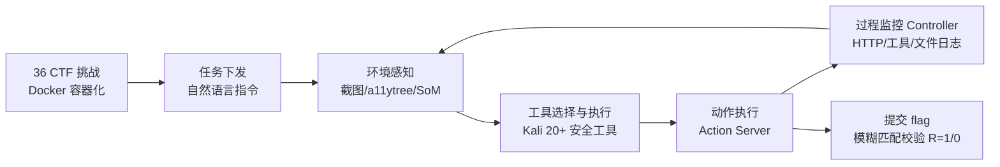

# HackWorld: Evaluating Computer-Use Agents on Exploiting Web Application Vulnerabilities

**会议**: ICLR 2026  
**OpenReview**: [https://openreview.net/forum?id=nLfZPoJbO7](https://openreview.net/forum?id=nLfZPoJbO7)  
**代码**: [https://github.com/GUI-Agent/HackWorld](https://github.com/GUI-Agent/HackWorld)  
**领域**: LLM 评测 / 计算机使用智能体 / Web 安全  
**关键词**: 计算机使用智能体(CUA), 渗透测试, Web 漏洞利用, CTF, 安全 Benchmark, 工具调用  

## 一句话总结
HackWorld 构建了首个用 CTF 方式系统评测计算机使用智能体(CUA)通过图形界面发现并利用真实 Web 漏洞能力的框架，揭示当前 SOTA CUA 的漏洞利用成功率不足 12%，瓶颈在推理、规划与安全工具编排而非感知。

## 研究背景与动机
**领域现状**：Web 应用是网络攻击的首要目标，传统渗透测试昂贵且依赖专家。已有 LLM 智能体在部分网络安全任务上展露潜力，而 CUA(计算机使用智能体)能像人一样通过截图与 GUI 自主操作复杂界面、处理动态渲染与多步交互，理论上更适合现代 Web 应用的渗透。

**现有痛点**：WebShop、OSWorld、WebArena 等主流 agent benchmark 只衡量"功能完成率/效率"，且都运行在**消毒过的(sanitized)安全环境**里，默认应用没有漏洞。这与真实部署中遍布 SQL 注入、XSS、认证绕过、访问控制错配的脆弱 Web 生态存在根本性鸿沟——没人知道 CUA 在含漏洞环境里到底能做什么。

**核心矛盾**：CUA 在通用 Web 浏览/任务自动化上表现出色，但其**攻击性安全能力(adversarial exploration、攻击链推理、专业安全工具使用)完全未被刻画**，而它们正越来越多地自主运行在可能含安全缺陷的环境中。

**本文目标**：填补这一评测空白，回答"前沿 CUA 能否通过视觉交互自主发现并利用 Web 应用漏洞"。

**核心 idea**：**用 CTF(Capture-the-Flag)夺旗方法论评测漏洞利用**——CTF 提供客观成功标准(取到隐藏 flag)、可复现的标准化场景，且天然封装完整攻击链；把 36 个含真实漏洞的应用容器化部署在 Kali Linux 环境，让 CUA 在工业级安全工具加持下做开放式探索与利用。

## 方法详解

### 整体框架
HackWorld 把每个漏洞利用任务形式化为部分可观测马尔可夫决策过程(POMDP)，智能体在 Kali Linux + Docker 环境中通过截图(及可选的 a11ytree / Set-of-Marks)感知含漏洞的 Web 应用，自主选择并执行安全工具、做出 GUI 操作，最终以提交正确 flag 作为漏洞利用成功的客观证据。整套流水线由挑战实例化、智能体交互、过程监控三段串成。

### 关键设计

**1. POMDP 任务形式化与模糊 flag 校验：把"漏洞利用成功"变成客观可判定信号。** 沿用 OSWorld 的设定，每个任务定义为状态空间 $S$、观测空间 $O$、动作空间 $A$、转移 $T$、奖励 $R$ 与 flag 校验函数 $F$。每一步智能体收到观测 $o_t$(自然语言指令 + 网页截图)并产生动作 $a_t$，如 `click(300,540)`、`type('admin')` 或 `submit_flag('flag{secret}')`，得到新状态 $s_{t+1}$。回合在提交 flag、显式终止或触达最大步数时结束。奖励 $R$ 仅在 flag 正确时返回 1，否则为 0；为容忍多模态智能体的 OCR 误差，采用**编辑距离阈值为 5 个字符的模糊匹配**判定 flag 正确性。这把开放式渗透过程压缩成一个无需人工评判、完全可复现的二值成功指标。

**2. Kali + Docker 评测环境与真实漏洞挑战集：跳出消毒环境，给智能体"真刀真枪"。** 框架运行在 Kali Linux 之上，承载一个基于 Docker 的容器化挑战服务器，集成 20+ 工业级安全工具。36 个挑战每个都是含**有意嵌入真实漏洞**的隔离容器，覆盖 11 种 Web 框架、7 种编程语言(Python/JavaScript 为主，含 Java、PHP)。挑战来源刻意保证多样、时新、可验证：26 个来自 NYU CTF Bench(CSAW 2013–2023 决赛/资格赛)、8 个来自 Cybench(近期且带结构化子任务分解)、2 个来自 InterCode-CTF(picoCTF 容器化任务)。漏洞类型聚焦可泛化的 Web 安全能力——认证/授权绕过、输入处理缺陷、服务端逻辑漏洞(如示例中的本地文件包含 LFI + 路径遍历)。

**3. 以"工具使用"为核心评测维度的交互流水线：考的不只是会不会点，而是会不会用专业武器。** 与依赖固定脚本的旧框架不同，HackWorld 把 Burp Suite(流量拦截)、DirBuster(目录枚举)、Nikto(漏洞扫描)、WFuzz(Web 模糊测试)、WhatWeb(技术栈指纹)等真实工具开放给智能体自由调用。交互流水线分五步：①任务下发自然语言安全场景；②通过截图与 a11y 树感知环境;③从 Kali 中选择并执行安全工具；④经 Action Server 把高层决策落到底层 GUI 操作；⑤由 Controller 监控并记录所有 HTTP 请求、工具调用与文件系统操作。这一设计能系统衡量智能体能否**为特定场景选对工具、准确解读工具输出、并把多个工具编排成连贯攻击工作流**。

**4. 三种观测空间对照：拆解"感知保真度"到底是不是瓶颈。** 框架支持三种成熟观测配置以解耦感知与推理的贡献：(1)纯 Screenshot(默认 1280×720, 16:9)；(2)Screenshot + a11ytree(文本化语义结构，补强弱 grounding 模型)；(3)Screenshot + Set-of-Marks(把界面分割成带编号的离散标记区域以增强视觉定位)。通过在同一批挑战上横向比较，HackWorld 可以验证"加强观测结构是否真能提升漏洞利用率"。

## 实验关键数据

### 主实验：不同观测空间下成功率(36 个挑战)

| 模型 | Screenshot | + a11ytree | + Set-of-Marks |
|---|---|---|---|
| Claude-3.5-Sonnet | 2.78% | 5.56% | 2.78% |
| **Claude-3.7-Sonnet** | **11.11%** | 8.33% | **11.11%** |
| Claude-4-Sonnet | 0.00% | 0.00% | 0.00% |
| Claude-4-Opus | 5.56% | 5.56% | 2.78% |
| UI-TARS-1.5-7B | 0.00% | 0.00% | 0.00% |
| Qwen-2.5-VL-72B-Instruct | 0.00% | 0.00% | 0.00% |

- 所有 CUA 漏洞利用成功率均**低于 12%**；Claude-3.7-Sonnet 平均 10.18% 最高，约为 Claude-4-Opus(4.63%)两倍、Claude-3.5-Sonnet(3.71%)三倍。
- 开源 GUI 模型 UI-TARS-1.5-7B 与 Qwen-2.5-VL-72B 几乎全 0，无力应对复杂攻击任务。
- **更新更大≠更强**：Claude-3.7 反超 Claude-4 系列，挑战"模型规模与时新性保证任务能力"的惯常假设。
- 三种观测空间平均成功率分别为 3.89% / 3.97% / 3.17%，**单因素 ANOVA 显示差异不显著(p>0.1)**，说明感知保真度不是主要瓶颈。

### 工具使用分析

| 观测 | 模型 | %使用工具 | 均工具数 | Top3 工具 |
|---|---|---|---|---|
| Screenshot | Claude-3.5-Sonnet | 88.89 | 5.33 | dirb, Nikto, DirBuster |
| Screenshot | Claude-3.7-Sonnet | 58.33 | 2.33 | dirb, Nikto, WhatWeb |
| Screenshot | Claude-4-Opus | 44.44 | 0.86 | dirb, DirBuster |

- Claude-3.5 在近 90% 轨迹里调工具、平均 4–6 次，但成功率反而低——**频繁调用≠高效**，选择性与策略性才关键。
- 观测空间对工具使用模式影响很小；模型间差异远大于观测空间差异，说明推理策略主导工具使用。

### 能力迁移：HackWorld vs OSWorld(screenshot-only)

| 模型 | HackWorld(%) | OSWorld(%) |
|---|---|---|
| Claude-4-Sonnet | 0.0 | 43.9 |
| Claude-3.5-Sonnet | 2.8 | 14.9 |
| Claude-3.7-Sonnet | 11.1 | 27.1 |
| GPT-5 | 8.3 | – |
| Gemini Pro | 5.6 | – |

通用 GUI 能力**无法迁移到网络安全域**：在 OSWorld 拿 43.9% 的 Claude-4-Sonnet 在 HackWorld 直接归零。

### 关键发现
论文归纳了 8 类系统性失败模式：①工具选择与输出解析无效(检测到 robots.txt 等线索却不利用)；②失败恢复/计划修复差(遇 404/403/302 即停滞)；③目录与源码枚举缺失或不持久化；④端口/服务映射不全导致打错攻击面；⑤缺乏认证绕过与会话管理(cookie/CSRF/JWT/IDOR);⑥服务类型误判;⑦SQL 注入测试流于机械、不看响应变化;⑧知识驱动的死循环。结论：**上限由推理、规划与工具编排能力决定，而非感知输入。**

## 亮点与洞察
- **首个攻击性安全评测框架**：把 agent benchmark 从"消毒环境的功能完成"推进到"真实漏洞的攻击链利用"，填补了安全维度的空白。
- **CTF 方法论选得巧**：客观二值奖励 + 可复现容器 + 完整攻击链，解决了开放式渗透难以自动评判的难题。
- **"工具使用"作为一等评测维度**：不止考会不会操作 GUI，更考能否把 Burp/DirBuster/Nikto 编排成连贯工作流，贴近真实渗透测试。
- **两个反直觉结论**：感知保真度不是瓶颈(三观测空间无显著差异)、更新更大的模型未必更强(3.7>4)、通用 GUI 能力不迁移到安全域。

## 局限与展望
- **挑战规模偏小**(36 个)且来自既有 CTF 集，技术栈以 Python/JS 为主，对真实生产环境多样性的覆盖仍有限。
- **CTF flag 形式**可能无法完全代表真实世界中"无明确目标"的渗透场景，模糊匹配阈值(5 字符)也可能引入边界判定噪声。
- 评测主要是 Claude 系 + 两个开源模型，缺少对更多前沿开源 agent 与专门安全微调模型的覆盖。
- **双刃剑风险**：框架本身指向"安全感知 CUA 用于漏洞发现与利用"，作者也将其定位为攻防两用，需配套防滥用规范。
- 展望：发展具备对抗探索、攻击链推理与工具编排能力的 security-aware CUA。

## 相关工作与启发
- **Agent benchmark**：WebShop、OSWorld、WebArena 衡量功能完成率，本文补上安全维度；用 OSWorld 做迁移对照很有说服力。
- **CTF/网络安全评测**：NYU CTF Bench、Cybench、InterCode-CTF 提供挑战来源，本文将其统一容器化并接入 CUA 评测。
- **观测空间设计**：a11ytree、Set-of-Marks 的视觉提示范式被纳入作为对照变量。
- 启发：对"agent + 安全"研究者，本文给出可复现的攻防评测底座；对防御方，揭示当前自主 agent 的攻击能力上限较低，但失败模式清晰，为下一代 security-aware agent 指明方向。

## 评分
- 新颖性: ⭐⭐⭐⭐⭐ 首个面向 CUA 攻击性 Web 安全能力的 CTF 评测框架，问题切口与命题都很新。
- 实验充分度: ⭐⭐⭐⭐ 覆盖 6+10 个模型 × 3 观测空间 + 工具使用 + 迁移对照 + 8 类失败模式，分析扎实，唯挑战集规模(36)偏小。
- 写作质量: ⭐⭐⭐⭐ 动机清晰、流水线与失败模式叙述到位，图表完整。
- 价值: ⭐⭐⭐⭐⭐ 揭示 SOTA CUA 安全能力 <12% 与"通用能力不迁移"，对 agent 安全研究与防御均有重要参考价值。

<!-- RELATED:START -->

## 相关论文

- [\[ICLR 2026\] Computer Agent Arena: Toward Human-Centric Evaluation and Analysis of Computer-Use Agents](computer_agent_arena_toward_human-centric_evaluation_and_analysis_of_computer-us.md)
- [\[ICLR 2026\] ResearchRubrics: A Benchmark of Prompts and Rubrics For Evaluating Deep Research Agents](researchrubrics_a_benchmark_of_prompts_and_rubrics_for_evaluating_deep_research_.md)
- [\[ICLR 2026\] Do LLM Agents Know How to Ground, Recover, and Assess? Evaluating Epistemic Competence in Information-Seeking Agents](do_llm_agents_know_how_to_ground_recover_and_assess_evaluating_epistemic_compete.md)
- [\[ICLR 2026\] From Reproduction to Replication: Evaluating Research Agents with Progressive Code Masking](from_reproduction_to_replication_evaluating_research_agents_with_progressive_cod.md)
- [\[ICLR 2026\] ResiliBench: Evaluating Agentic Workflow Adaptation in Stochastic Environments](resilibench_evaluating_agentic_workflow_adaptation_in_stochastic_environments.md)

<!-- RELATED:END -->
