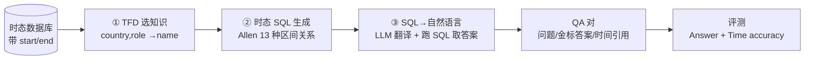

# Harnessing Temporal Databases for Systematic Evaluation of Factual Time-Sensitive Question-Answering in LLMs

**会议**: ICLR 2026  
**代码**: [https://github.com/ssoy0701/tdbench](https://github.com/ssoy0701/tdbench)  
**领域**: LLM 评测 / 时间敏感问答 (TSQA)  
**关键词**: 时间敏感问答, 时态数据库, 时态函数依赖, Allen 区间代数, 时间幻觉  

## 一句话总结
本文提出 TDBench，把"时态数据库 + 数据库技术（时态函数依赖、时态 SQL、时态连接）"当成 TSQA 题库的自动构造引擎，零人工地生成覆盖 13 种时间约束的题目，并引入 time accuracy 指标揭示出 LLM 即便答对答案也会在解释里幻觉出错误时间引用（平均 21.7%）。

## 研究背景与动机
- **领域现状**：事实会随时间变化（"美国现任总统是谁"），时间敏感问答（TSQA）被广泛用于检验 LLM 的两类能力——**时间推理**（理解"2019 年前""第 5 届冬奥会期间"等时态语境）和**时间对齐**（回答反映当前世界事实）。
- **现有痛点**：现有 TSQA benchmark **严重依赖人工**。设计多样时态语境靠人写或靠少量固定模板（Dhingra 用 9 个、Margatina 用 16 个），多样性受限；而时间敏感知识不断变化，benchmark 还要持续维护——RealTimeQA 因人工成本过高已停止更新。
- **核心矛盾**：要"规模化 + 全面 + 持续可维护"地评测 TSQA，却被"人工设计语境/模板/答案"这一瓶颈卡死；同时传统评测只看答案对错，**看不到模型解释里的时间幻觉**。
- **本文目标**：构造一个无需人工、可随数据更新自动刷新题目、覆盖更全时间约束、且能细粒度检验时间引用真伪的 TSQA 框架。
- **核心 idea**：**把成熟的时态数据库设计理论直接搬来当题库生成器**——用时态函数依赖（TFD）选知识、用时态 SQL（基于 Allen 区间代数）编码 13 种时间关系、用时态连接造隐式多跳题，最后用 LLM 把 SQL 翻成自然语言，答案则直接跑 SQL 得到。

## 方法详解

### 整体框架
TDBench 把 TSQA 构造拆成"从时态数据库自动生成 QA 对"和"同时评测答案与时间引用"两半。给定一张带 `start`/`end` 有效区间的单时态数据库表，构造端走三步流水线：TFD 选属性 → 时态 SQL 生成带时间约束的查询 → LLM 把 SQL 翻成自然语言问题、跑 SQL 得到金标答案；评测端则在答案准确率之外，额外用 SQL 编码的时间约束去自动核验模型解释里的时间引用是否正确。

### 关键设计

**1. 用 TFD 自动选知识：让"哪些属性能出题"有理论依据。** 时态函数依赖把普通函数依赖搬到时间维度——普通 FD $X \to Y$ 要求 $X$ 在整张表里唯一决定 $Y$，而 TFD $X \xrightarrow{T} Y$ 只要求在有效区间重叠（同时有效）时成立。例如 `country, role` $\xrightarrow{T}$ `name` 表示"任一时刻、某国某职位只由一人担任，但担任者可随时间更替"。TDBench 直接用满足 TFD 的属性集出题：把 $X$ 值放进问题、$Y$ 值当答案（"谁是 [country] 的 [role]？"答 [name]）。因为 TFD 本就是时态数据库的设计理论，这套逻辑能泛化到任意 schema，从而**无需人工预处理去识别"哪些字段和时间相关"**。

**2. 时态 SQL + Allen 区间代数：把"4-6 种时间约束"扩到 13 种。** 不直接生成自然语言问题，而是先生成时态 SQL 查询，借助 SQL 内置时态算子（`BETWEEN`、`DATEDIFF` 等）表达丰富语境。`Genqueries` 算法先用 TFD 属性搭基础查询（$X$ 进 `WHERE`、$Y$ 进 `SELECT`），再附加时间约束——约束依据 Allen 区间代数的 **13 种互斥且完备的时间关系**（before/after/meet/met-by/overlap/equal/start/finish/during/contain 等）。每种关系对应一段 SQL 条件：如 `meet` 关系是 `a.end = b.end - b.length`，对应"任期恰好在某日期前半年结束的总统"；`overlap` 还专门有一支 `a.end IS NULL` 用来表达"当前正在任"。相比现有 benchmark 常用的 4-6 种（in/from-to/before/after），这套覆盖能暴露 LLM 在罕见时间关系上的盲区。

**3. SQL→自然语言 + 数据库取答案：兼顾语言多样性与答案可靠性。** 问题侧用 GPT-4o 当 SQL-to-text 翻译器（零样本下 91.5% 准确），把同一条 SQL 翻成多句措辞不同但答案一致的问题；答案侧**不让 LLM 生成答案，而是直接把 SQL 跑在数据库上**取金标。这样既得到语言多样的题目，又保证答案严格遵循数据库事实——数据库内容一更新（换了新总统），对应 QA 对自动刷新，从根本上解掉维护瓶颈，同时比"纯 LLM 造题"错误率更低、推理成本更省。

**4. time accuracy 指标：抓住"答对但时间引用幻觉"的隐性错误。** 作者发现 LLM 常常答案正确却在解释里编错时间（如答对瑞典国王是谁，却把即位时间说错）。time accuracy 定义为解释中时间引用（`start`/`end` 日期）的正确率，且**核验过程可自动化**——因为 SQL 约束本身就编码了该题需要哪个时间引用（`meet` 关系需核验 `end` 日期、`after` 需 `start`、其余七种两者都要）。由于模型可能夹带无关时间（"截至 2025 年……"），用 LLM-judge 而非精确匹配核验，人工抽检达 91.1% 准确。三档指标分别为答案准确率 A、时间准确率 T、二者皆对的严格指标 AT。

**5. 时态连接造隐式多跳题：免人工地拉高难度。** 通过对两张表做**时态自然连接**（只连有效区间重叠的元组）生成隐式时间约束题。例如把 Olympic 表和 Leaders 表按 `country` 连接，配出"奥运主办国当时的领导人"，再用连接表上推导出的 TFD（`game_edition, role` $\xrightarrow{T}$ `name`）生成"谁是 [game edition] 期间主办国的 [role]？"——把显式日期换成"第 1988 届夏季奥运会期间"这类需要事件-事件推理的隐式语境，全程无需人工编写。

## 实验关键数据

设置：8 个 LLM（GPT-3.5/4/4o、Llama3.1-70B、Mixtral-8x7B、Gemma2-27B、Qwen2-72B、Granite3.1-8B，温度 0）；数据源两类——Wikipedia（国家/运动员/组织/奥运，6,177 题）与 Kaggle 等平台（同性婚姻法/碳税/UNESCO 遗产/Netflix，覆盖法律/环境/文化/社会域，1,704 题）。

### 主实验：时间对齐任务（A=仅答案，AT=答案+时间，Δ=A−AT）

| 模型 | Wiki A | Wiki AT | Wiki Δ | Law AT | Heritage AT | Netflix AT |
|---|---|---|---|---|---|---|
| GPT-3.5 | 47.5 | 22.4 | 25.1 | 39.9 | 26.5 | 19.1 |
| GPT-4o | 73.9 | 48.8 | 25.1 | 54.0 | 53.3 | 25.9 |
| Llama3.1-70B | 64.6 | 56.7 | 7.9 | 44.9 | 39.7 | 28.6 |
| Gemma2-27B | 69.3 | 32.8 | 36.5 | 29.8 | 22.0 | 27.7 |
| Granite3.1-8B | 49.6 | 26.1 | 23.5 | 28.6 | 4.5 | 14.9 |
| **平均** | **56.9** | **35.2** | **21.7** | **40.7** | **28.6** | **22.4** |

### 关键发现
- **时间幻觉普遍存在**：Wikipedia 上从 A 到 AT 平均掉 **21.7%**，即模型答对答案后仍有约两成响应带着错误时间引用——传统只看答案的评测会把这些"事实不一致"漏掉。
- **域特化能力差异显现**：GPT-4o 在法律/碳税/遗产域最强，Llama3.1-70B 在 Netflix 域领先，证明 TDBench 能评测 Wikipedia 之外的应用专属数据。
- **可移植到现有 benchmark**：把 time accuracy 接到 Dyknow 上（只改 system prompt 让模型给出 `start` 日期），对时间对齐响应得到 0.96 F1，提升了 benchmark 相对人工核验的正确性。
- **约束覆盖更广**：13 种时间约束 vs 现有 4-6 种，能定位现有 benchmark 看不清的时间盲区。

## 亮点与洞察
- **跨学科借力**：把数据库领域成熟的 TFD / 时态 SQL / 时态连接直接当作题库生成的"形式化引擎"，让"出什么题、答案是什么、需要核验哪个时间"都有理论保证，而不是靠人工拍脑袋。
- **自我维护的 benchmark**：题目由数据库内容动态决定，更新数据即刷新题库，正面回应了 RealTimeQA 因人工成本停更的困境。
- **time accuracy 是被低估的评测维度**：揭示"答对≠可靠"，把幻觉评测从答案层下沉到解释中的时间引用层，且可 SQL 自动核验。

## 局限与展望
- 聚焦**单时态（uni-temporal）**数据模型（只存有效时间区间），未覆盖双时态（含事务时间）等更复杂时态语义。
- 流水线两处依赖 LLM：SQL→文本翻译（91.5%）与时间引用 LLM-judge（91.1%），均非 100%，会给题目和评测引入小幅噪声。
- 题目质量受**输入数据库的 TFD 是否已定义/正确**约束；TFD 缺失或失效时需额外处理（附录讨论），未在主流程内自动保证。
- 隐式多跳题依赖能找到可时态连接的相关表，域特定数据若缺少可连接事件表则难以扩展难度。

## 相关工作与启发
- **TSQA benchmark**：TimeQA、TempLAMA、RealTimeQA、Dyknow 等多以 Wikipedia/Wikidata 为中心、人工或固定模板构造；TDBench 主打"数据库驱动 + 应用专属数据 + 自动维护"作为补充。
- **时态数据库**：Jensen & Snodgrass 的时态数据库理论（TFD、时态连接、Allen 区间代数）是本文方法论根基。
- **幻觉评测**：已有工作发现 LLM 会在解释中幻觉，本文把这一现象具体化为"时间引用错误"并给出可自动核验的指标。
- **启发**：用形式化的数据结构/查询语言当题库生成器，是降低评测人工成本、保证可控可复现的通用思路，可推广到其他需要结构化事实的评测任务（计数、聚合、多约束推理）。

## 评分
- **新颖性**: ⭐⭐⭐⭐ — "时态数据库技术当 TSQA 题库引擎 + time accuracy 揭示时间幻觉"角度新颖，把数据库理论与 LLM 评测做了实质性嫁接。
- **实验充分度**: ⭐⭐⭐⭐ — 8 个主流 LLM × 多域数据 × 三档指标，并验证可移植到现有 benchmark，覆盖面足。
- **写作质量**: ⭐⭐⭐⭐ — 动机—方法—指标—实验逻辑清晰，图 1 与表格示例把抽象的 SQL 构造讲得直观。
- **价值**: ⭐⭐⭐⭐ — 提供可自动维护、覆盖更广、能查时间幻觉的 TSQA 评测框架，代码数据开源，对评测社区实用。

<!-- RELATED:START -->

## 相关论文

- [\[ICLR 2026\] EIP: Weighted Ranking of LLMs by Quantifying Question Difficulty](eip_weighted_ranking_of_llms_by_quantifying_question_difficulty.md)
- [\[ICLR 2026\] GuidedSampling: Steering LLMs Towards Diverse Candidate Solutions at Inference-Time](guidedsampling_steering_llms_towards_diverse_candidate_solutions_at_inference-ti.md)
- [\[ACL 2025\] YESciEval: Robust LLM-as-a-Judge for Scientific Question Answering](../../ACL2025/llm_evaluation/yescieval_llm_judge_science.md)
- [\[ACL 2026\] ReTraceQA: Evaluating Reasoning Traces of Small Language Models in Commonsense Question Answering](../../ACL2026/llm_evaluation/retraceqa_evaluating_reasoning_traces_of_small_language_models_in_commonsense_qu.md)
- [\[ACL 2026\] ReCoQA: A Benchmark for Tool-Augmented and Multi-Step Reasoning in Real Estate Question and Answering](../../ACL2026/llm_evaluation/recoqa_a_benchmark_for_tool-augmented_and_multi-step_reasoning_in_real_estate_qu.md)

<!-- RELATED:END -->
