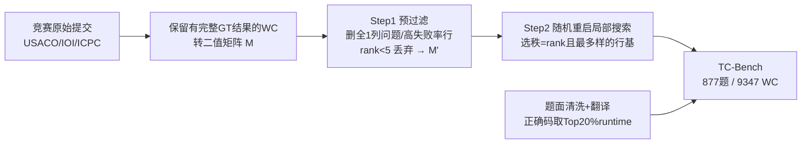

# How Many Code and Test Cases Are Enough? Evaluating Test Cases Generation from a Binary-Matrix Perspective

**会议**: ICLR 2026  
**OpenReview**: [https://openreview.net/forum?id=RomWar2kVN](https://openreview.net/forum?id=RomWar2kVN)  
**代码**: [https://github.com/Luowaterbi/TC-Bench](https://github.com/Luowaterbi/TC-Bench)  
**数据集**: [https://huggingface.co/datasets/Luoberta/TC-Bench](https://huggingface.co/datasets/Luoberta/TC-Bench)  
**领域**: LLM 评测 / 测试用例生成 / 代码评估基准  
**关键词**: 测试用例生成, 二值矩阵, 矩阵秩, 诊断基, 评测分数膨胀, 竞赛编程  

## 一句话总结
把"评测测试用例生成方法"形式化为在「错误代码 × 测试用例」二值矩阵里找一组秩等于矩阵秩、内部多样性最大的"诊断基"，据此构造出紧凑、抗分数膨胀的 TC-Bench，揭示即便最强方法 HackRate 也只有约 60%。

## 研究背景与动机

**领域现状**：LLM 解算法题的能力高度依赖测试用例来判定对错，黄金测试用例(GT)稀缺且昂贵，于是衍生出一批用 LLM 自动增广测试用例(AT)的方法。这些方法本身又需要被评测——核心是评 AT 的"有用性"，即能排除(hack)多少错误代码(WC)。

**现有痛点**：主流做法是"尽可能多收集错误代码，跑全部 AT，看能排除多少"。这带来两个致命问题：① 成本是 AT 数 × WC 数的乘积，竞赛题动辄几十万份提交，开销不可承受；② **分数膨胀**——WC 群体被大量平凡、重复的错误主导，真正难检测的核心缺陷只占极少数，一个只会抓常见错误的平庸方法和一个能抓罕见 corner case 的强方法拿到的分数差不多，基准失去区分力。

**核心矛盾**：一头是"多收集 WC"导致冗余膨胀，另一头是启发式只挑 5 个难错码(如 TCG)又过度稀疏、覆盖不全。一个 WC ≠ 一种错误，到底**多少个错误代码才足够代表整个错误空间？多少个测试用例才足够区分它们？**这两个看似独立的问题没有原则性答案。

**本文目标**：给出一个理论框架，同时回答"最少需要多少 WC"和"最少需要多少测试用例"，并据此造一个紧凑、多样、抗膨胀的评测基准。

**核心 idea**：**【秩=诊断维度】** 把每个 WC 在 GT 上的执行结果(AC=0, WA=1)看成一个二值"失败签名"向量，所有 WC 堆成 n×d 的二值矩阵 M。矩阵的**秩**精确刻画了独立错误模式的数量(应选多少 WC)，同时由于行秩=列秩，它又给出了区分所有错误模式所需测试用例数的紧上界。在秩约束下再最大化内部多样性，就得到最优"诊断基"。

## 方法详解

### 整体框架
方法把"造基准"重铸成一个矩阵分析+组合优化问题：先把每道题的错误代码在 GT 上的对错结果转成二值矩阵 M（行=错误代码，列=测试用例，失败记 1），用秩确定该题应保留多少个错误代码；再在所有满足秩条件的"行基"中，选出成员之间平均 Jaccard 相似度最低（最多样）的那一组作为诊断基。由于该选择是 NP-hard 的，作者用 WrongSelect（预过滤 + 随机重启局部搜索）做高效近似，最后接一条数据清洗管线落地成 TC-Bench。

### 关键设计

**1. 二值矩阵与"诊断基"建模：把抽象错误翻译成可计算的线性代数对象。** 一个 WC 在 GT 序列上的结果(如 `["AC","WA","WA"]`)被编码为二值向量 `[0,1,1]`，称为该错误的"失败签名"。所有 WC 的签名堆成矩阵 $M\in\{0,1\}^{n\times d}$，其中 $M_{ij}=1$ 表示第 $i$ 个 WC 在第 $j$ 个测试用例上失败。理想的 WC 子集 $I$ 要同时满足**完备无冗余**——在线性代数里这恰好对应一个**行基**：$I$ 中行向量线性无关且 $|I|=\mathrm{rank}(M)$，既不多也不少地张成所有独立错误模式。更妙的是行秩=列秩，于是这个数 $|I|$ 同时是"区分所有独立错误模式所需测试用例数"的理论上界——一个建模动作同时回答了开篇两个问题。

**2. 多样性目标与 Jaccard 相似度：在众多合法基里挑最"正交"的那一个。** 满足秩条件的基不唯一，理想基应由相互正交(错误模式互不重叠)的签名组成，但真实数据几乎不存在正交基，于是退而求其次——最大化成员间的多样性。两个签名的重叠用 Jaccard 相似度衡量：$J(r_i,r_j)=\dfrac{r_i\cdot r_j}{\|r_i\|_1+\|r_j\|_1-r_i\cdot r_j}$，分子是两者共同失败的测试数(交集)，分母是并集。全局目标是最小化基内所有成员对的平均 Jaccard 相似度：$\min_I F(I)=\dfrac{1}{\binom{|I|}{2}}\sum_{r_i,r_j\in I,\,i<j}J(r_i,r_j)$。$F(I)$ 越低，基越多样、诊断面越宽、信息效率越高。

**3. WrongSelect 的预过滤：先把"会被白嫖分数"的噪声从候选池里清掉。** 最终基的质量取决于候选池质量，作者从列、行两个方向清噪。**列分析（问题级）**：若 M 存在全 1 列，意味着所有 WC 都在某个用例上失败——这可能源于难度递增的 GT、WC 太少或题目过简，但更关键的是全 1 列给"刷分"开了后门，故凡含全 1 列的问题整道剔除(约 5% 问题)。**行分析（代码级）**：失败率(行内 1 的比例)超过阈值 $\tau=80\%$ 的 WC 几乎在所有私有用例上都挂，是任何平庸测试集都能轻易排除的"背景噪声"，会抬高分数、削弱区分力，予以删除(约 13% WC)。最后丢弃 $\mathrm{rank}(M')<5$ 的题，保证每题错误模式足够丰富。

**4. 随机重启局部搜索：用交换+重启逼近 NP-hard 的最优诊断基。** 在过滤后的 $M'$ 上，从一个随机选出的合法基出发，定义邻域为"基内一个成员与基外一个成员做单次交换后仍合法的所有基"；只要存在更优邻居($F(I)$ 更低)就跳过去，直到收敛到局部最优。为避免初始化导致的差局部最优，做多次随机重启(内外循环各 1000 次)取全局最佳。论文用一个 $R'=2$ 的小例子演示：初始基 $[[0,0,1],[0,1,1]]$ 的 $F=0.5$，换入外部向量 $[0,1,0]$ 后得到 $[[0,0,1],[0,1,0]]$，$F=0$ 完美多样即收敛。实践中内外循环都收敛极快且易并行，整体高效。

## 实验关键数据

### 主实验：13 个 LLM × 5 种方法在 TC-Bench 上的表现（节选）

PassRate(PR)=有效 AT 占比；HackRate(HR)=被成功排除的 WC 占比(WA/RE/TLE 都算排除)。

| LLM | 方法 | PR | HR |
|---|---|---|---|
| Qwen2.5-Coder-32B | LCB | 59.65 | 58.10 |
| Qwen2.5-Coder-32B | HT | 66.53 | 43.76 |
| Deepseek-V3 | LCB | 46.58 | 58.83 |
| Qwen-Coder-Plus | LCB | 77.73 | **61.46** |
| GPT-4o | LCB | 68.51 | 57.55 |
| Claude4 | LCB | 55.49 | 62.08 |
| Claude4 | HT | 71.56 | **62.96** |
| Claude4-Thinking | LCB | 75.79 | 62.35 |

最强组合 Claude4 + HT 的 HackRate 也只有约 63%，揭示当前技术存在明显性能天花板。

### 对照实验：不同代码选择策略导致的分数偏差（Claude-4-Thinking，100 题子集）

| 基准构造方式 | 代表性 | LCB 表现 |
|---|---|---|
| All WC（全量错误码，TCGBench） | 严重膨胀 | ≈100% |
| TestCase-Eval（随机采 20 个） | 趋势与 All WC 几乎一致 | ≈接近全量 |
| TCG（启发式选 5 个） | 高复杂度题严重欠覆盖 | 偏低 |
| **TC-Bench（按秩选基）** | 平衡，按题内在秩定预算 | **约 50%** |

### 关键发现
- **高 PassRate ≠ 高 HackRate**：CRUX 在多个模型上 PassRate 显著高于 ALGO，但 HackRate 反而更低——可以靠生成大量简单用例刷高 PassRate。
- **方法的影响远大于基座模型**：Qwen2.5-Coder-32B 上 LCB 的 HackRate 比 CRUX 高近 40%；而参数更少的 Qwen2.5-Coder-32B 与 Deepseek-V3 在 LCB 下只差约 1%。作者推测测试用例生成是预训练语料中欠表示的专门任务，难靠扩参数提升。
- **秩=必要测试用例数上界**：rank=R 的错误空间只有 R 个线性无关的诊断维度，多出的测试用例只是已有维度的线性组合，不提供新信息。用 Rank 当预算，简单题不再"过度测试"、复杂题不再"测试不足"。
- **极致压缩**：最终 WC 仅占原始提交的不到 2%，配合原则化的测试用例数，评测成本近似平方级下降。

## 亮点与洞察
- **跨学科的优雅建模**：把"造评测基准"这件看似工程化的事，干净地映射到线性代数的"行基/秩"和组合优化的"最大多样性子集"，两个长期被孤立处理的问题(选多少 WC、用多少测试用例)被同一个数量(矩阵秩)统一回答。
- **分数膨胀的根因诊断**：明确指出全量/随机采样无法消除冗余错误模式，是膨胀的真正来源；同时启发式硬限 5 个又会让未来方法只需覆盖 5 个模式就刷满分——TC-Bench 用"按秩定预算"卡在两者之间的最优点。
- **抗未来作弊**：基准的目标不只是当下区分力，还要防止未来方法用"覆盖固定小子集"刷满分，体现了对基准长期有效性的考量。

## 局限与展望
- **绑定竞赛编程 + C++**：数据全来自 USACO/IOI/ICPC 且只保留 C++ WA 提交，泛化到通用软件工程、其他语言或非竞赛场景的能力未验证。
- **AC/WA 二值简化**：失败签名只区分通过/失败，丢失了 WA/TLE/RE 等错误类型的细粒度信息，可能把语义不同但行为相同的错误折叠成同一模式。
- **秩作上界但未必可达**：rank 是区分所需测试用例数的上界，论文未深入给出"实际最少要多少测试用例"的构造，且诊断基本身依赖 GT 质量这一前提。
- **正确码选择敏感**：实验显示过松/过严的正确码集会偏置结果，目前靠"Top 20% runtime 随机取 8 份"启发式缓解，仍非原则化。

## 相关工作与启发
- **测试用例增广(AT)方法**：CRUX(直接生成输入输出)、PSEUDO(多解投票定输出)、ALGO(生成输入生成器+暴力 oracle)属于不依赖正确码一类；LCB/HT 依赖正确码执行得到正确输出。TC-Bench 是评测这些方法的"裁判"。
- **既有基准对比**：TCGBench(全量 WC)、TestCase-Eval(随机 20 个)、TCG(启发式 5 个)分别代表膨胀派和欠覆盖派，本文用秩理论统一批判并给出折中。
- **启发**：这种"把评测对象的行为编码成二值矩阵→用秩刻画内在复杂度→在秩约束下最大化多样性"的范式，可迁移到任何需要"用最少样本最大化诊断力"的基准构造场景(如对抗样本集、单元测试精简、模型能力探针)。

## 评分
- 新颖性: ⭐⭐⭐⭐⭐ 用矩阵秩统一"WC 数"与"测试用例数"两个根本问题，建模角度新颖且优雅。
- 实验充分度: ⭐⭐⭐⭐ 13 个 LLM × 5 方法 + 与 3 类既有基准的对照，揭示分数膨胀机制；二值简化与语言绑定限制了广度。
- 写作质量: ⭐⭐⭐⭐ 图 1 的三栏对比、具体小矩阵示例把抽象理论讲得清楚易懂。
- 价值: ⭐⭐⭐⭐ 提供了抗膨胀、低成本的测试用例生成评测标尺，暴露 SOTA 仅约 60% 的性能天花板，对代码 RLVR/评测社区有直接参考价值。

<!-- RELATED:START -->

## 相关论文

- [\[ICLR 2026\] Train-before-Test Harmonizes Language Model Rankings](train-before-test_harmonizes_language_model_rankings.md)
- [\[ICLR 2026\] Towards Self-Evolving Agent Benchmarks: Validatable Agent Trajectory via Test-Time Exploration](towards_self-evolving_agent_benchmarks_validatable_agent_trajectory_via_test-tim.md)
- [\[ICLR 2026\] From Reproduction to Replication: Evaluating Research Agents with Progressive Code Masking](from_reproduction_to_replication_evaluating_research_agents_with_progressive_cod.md)
- [\[ACL 2026\] MultiFileTest: A Multi-File-Level LLM Unit Test Generation Benchmark and Impact of Error Fixing Mechanisms](../../ACL2026/llm_evaluation/multifiletest_a_multi-file-level_llm_unit_test_generation_benchmark_and_impact_o.md)
- [\[AAAI 2026\] LLM-as-a-Judge for Scalable Test Coverage Evaluation](../../AAAI2026/llm_evaluation/llm-as-a-judge_for_scalable_test_coverage_evaluation_accuracy_operational_reliab.md)

<!-- RELATED:END -->
