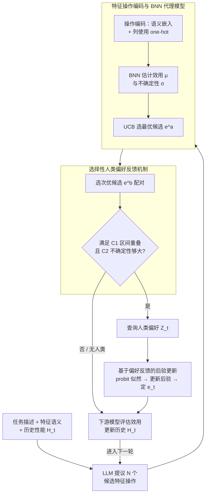

# Human-LLM Collaborative Feature Engineering for Tabular Learning

**会议**: ICLR 2026  
**arXiv**: [2601.21060](https://arxiv.org/abs/2601.21060)  
**代码**: 无  
**领域**: AutoML / 表格学习  
**关键词**: 特征工程, 人机协作, 贝叶斯优化, LLM, 表格数据

## 一句话总结

提出一个人-LLM协作特征工程框架，将LLM的特征操作提议与选择过程解耦，通过贝叶斯神经网络建模操作效用和不确定性来指导选择，并选择性地引入人类偏好反馈，在18个表格数据集上平均错误率降低8.96%~11.23%。

## 研究背景与动机

**领域现状**：LLM在表格学习中被广泛用于自动化特征工程，通过语义理解生成有意义的特征变换操作（如CAAFE、OCTree）。

**现有痛点**：现有方法将LLM同时用作特征操作的提议者和选择者，完全依赖LLM内部启发式，缺乏对操作效用和不确定性的校准估计，导致反复探索低收益操作，在有限迭代预算下表现不佳。

**核心矛盾**：LLM擅长生成多样化的特征变换候选，但不擅长在候选中做出最优选择——提议能力强但选择能力弱的矛盾。

**本文目标** 如何将LLM的操作提议与选择解耦，并在选择过程中有效融合人类专家知识，以提升特征工程效率。

**切入角度**：借鉴贝叶斯优化思想，用显式代理模型替代LLM的隐式选择，并设计选择性人类反馈机制控制专家参与成本。

**核心 idea**：LLM只负责提议候选特征操作，选择由贝叶斯神经网络的UCB策略引导，在不确定性高时选择性引入人类偏好反馈。

## 方法详解

### 整体框架

方法把每一轮特征工程拆成"提议"和"选择"两件事：LLM 只负责根据任务描述、特征语义和历史性能生成 $N$ 个候选特征变换操作（实现中每轮 15 个），真正决定用哪个操作则交给一个贝叶斯神经网络（BNN）代理模型——它先把每个操作编码成向量，再估计期望效用 $\mu_t(e)$ 和不确定性 $\sigma_t^2(e)$，由 UCB 策略挑出最优候选 $e_t^a$。当代理模型自己也拿不准时，框架才选择性地额外取一个次优候选 $e_t^b$、向人类专家请教一次偏好，并以概率方式把反馈融进后验后定下本轮操作；最后在下游模型上评估实际效用、更新历史 $H_t$，进入下一轮。

### 关键设计

**1. 特征操作编码与 BNN 代理模型：把 LLM 的隐式选择换成可校准的显式估计**

现有方法让 LLM 既提议又选择，等于把"哪个操作更好"完全交给语言模型的内部启发式，既无法量化效用也无法表达不确定性。本文改用一个 BNN 作为代理模型来打分。难点在于 LLM 生成的操作是自然语言，需要先编码成向量：每个操作的嵌入由语义嵌入 $\phi_{\text{embedding}}(e)$（来自 text-embedding-3-small）和列使用编码 $\phi_{\text{column}}(e) \in \{0,1\}^d$ 拼接而成，后者用一个 one-hot 向量标记该操作动了哪些列，专门化解多列语义描述相似时"光看文字分不清谁是谁"的歧义。BNN 通过变分推断学习参数后验 $q_t(\boldsymbol{\theta}) = \mathcal{N}(\boldsymbol{\theta}; \boldsymbol{M}_t, \boldsymbol{\Sigma}_t)$，从而同时给出预测均值 $\mu_t(e)$ 和方差 $\sigma_t^2(e)$。之所以不用经典贝叶斯优化里的高斯过程，是因为 GP 在这种高维、语言派生的特征空间里扩展性差，而 BNN 更能拟合其中的非平稳结构。

**2. 选择性人类偏好反馈机制：只在值得问的时候才打扰专家**

引入人类反馈能纠正代理模型的偏差，但每轮都问会带来沉重的认知负担。框架因此在 UCB 选出最优候选 $e_t^a$、次优候选 $e_t^b$ 后，只有同时满足两个条件才触发一次查询：其一是置信区间重叠 $\text{UCB}_t(e_t^b) > \text{LCB}_t(e_t^a)$，说明二者孰优孰劣尚有不确定空间；其二是不确定性足够大 $\sqrt{\beta_t}(\sigma_t(e_t^a) + \sigma_t(e_t^b)) \geq \gamma_\kappa$，说明这次提问能带来的潜在收益超过查询成本 $\gamma_\kappa$（取 4）。两个门控合起来保证：只有当人类反馈确实能带来显著效用增益时才请专家介入，把宝贵的人力花在刀刃上。

**3. 基于偏好反馈的后验更新：用概率方式而非全盘采信地吸收人类意见**

拿到人类对 $e_t^a$ 与 $e_t^b$ 的偏好 $Z_t$ 后，框架不会直接照着选，而是把它当作一次观测融进后验。偏好通过 probit 似然建模为 $\mathcal{P}(Z_t | \boldsymbol{\theta}, e_t^a, e_t^b) = \Phi(\eta Z_t [\hat{g}(\phi(e_t^a); \boldsymbol{\theta}) - \hat{g}(\phi(e_t^b); \boldsymbol{\theta})])$，据此把变分后验更新为 $q_t'(\boldsymbol{\theta})$，再用更新后的 UCB 值做最终决策。这样处理的好处是对噪声反馈更鲁棒——人类偶尔判断失误时，概率化的吸收方式会平滑掉错误，而不是被单次反馈带偏。

### 损失函数 / 训练策略

BNN 通过最小化 ELBO 训练，目标为 $\text{KL}(q_t(\boldsymbol{\theta}) \| \mathcal{P}(\boldsymbol{\theta})) - \mathbb{E}_{q_t(\boldsymbol{\theta})}[\log \mathcal{P}(H_t | \boldsymbol{\theta})]$，即在拟合历史观测 $H_t$ 与贴近先验之间取平衡。UCB 的探索系数取 $\beta_t = 2\log(|\mathcal{S}_t|\pi^2 t^2 / 3\delta)$，其中 $\delta=0.1$，随轮次 $t$ 增长以保持探索；人类查询成本阈值 $\gamma_\kappa=4$。

## 实验关键数据

### 主实验

| 数据集 | 指标 | 本文(w/o human) | 本文(w/ human) | 最佳基线 | 提升(w/ human) |
|--------|------|------|------|------|------|
| 13分类数据集(MLP) | AUROC(%) | 85.3 | 85.5 | 84.7(OCTree) | 错误率降低8.96% |
| 13分类数据集(XGBoost) | AUROC(%) | 87.4 | 87.4 | 86.7(OCTree) | 错误率降低11.23% |
| flight(MLP) | AUROC(%) | 96.9 | 97.3 | 94.8(OCTree) | +48.1%错误率降低 |
| conversion(XGBoost) | AUROC(%) | 93.5 | 93.9 | 92.4(OCTree) | +11.5%错误率降低 |

### 消融实验

| 配置 | 指标 | 说明 |
|------|------|------|
| 不同LLM骨干(GPT-5) | MLP平均85.9→86.5 | GPT-5骨干下Ours(w/ human)最优 |
| 不同LLM骨干(GPT-3.5) | MLP平均84.6→85.1 | 弱骨干也能保持优势 |
| 用户研究(ALG vs Control) | 性能: p=0.011 | ALG框架显著提升用户性能 |
| 用户研究(ALG vs Control) | 完成时间: p<0.001 | ALG框架显著减少完成时间 |

### 关键发现

- LLM-based方法整体优于传统AutoML（OpenFE、AutoGluon），验证了语义理解对特征工程的价值
- 显式建模效用和不确定性比纯依赖LLM启发式分别提升7.24%和9.02%的错误率降低
- 人类偏好反馈一致性地带来额外提升，且计算开销（BNN+UCB）仅占总时间的2.2%

## 亮点与洞察

- 将贝叶斯优化的思想引入LLM驱动的特征工程，解耦提议与选择是一个优雅的工程设计。UCB平衡探索/利用的理论保证让选择过程不再是黑箱。
- 选择性查询机制的两个条件（置信区间重叠+不确定性门控）有坚实的理论支撑（Lemma 3.1-3.2），实现了人类认知成本和信息增益的最优权衡。

## 局限与展望

- 人类反馈在实验中由GPT-4o模拟，实际用户研究仅在单个数据集上进行，泛化性有限
- BNN代理模型在特征工程早期轮次数据稀疏时校准质量可能不佳，冷启动问题未充分讨论
- 框架仅考虑单个操作的效用，未建模多操作组合的交互效应

## 相关工作与启发

- **vs CAAFE**: CAAFE让LLM同时提议和选择特征操作，易陷入局部最优；本文解耦后能持续发现高价值操作
- **vs OCTree**: OCTree用决策树反馈指导LLM，但仍依赖LLM的内部启发式选择；本文用BNN提供更校准的效用估计
- **vs 传统贝叶斯优化**: 传统BO用GP做代理模型，在低维空间有效；本文用BNN处理高维语言嵌入空间

## 评分

- 新颖性: ⭐⭐⭐⭐ 解耦提议与选择并引入人类反馈的框架设计新颖，理论分析完整
- 实验充分度: ⭐⭐⭐⭐ 18个数据集+用户研究+计算可扩展性分析，多角度验证
- 写作质量: ⭐⭐⭐⭐ 问题动机清晰，理论推导严谨，实验展示全面
- 价值: ⭐⭐⭐ 实际应用场景明确但需要LLM API成本，方法通用性较好

<!-- RELATED:START -->

## 相关论文

- [\[ECCV 2024\] Image-Feature Weak-to-Strong Consistency: An Enhanced Paradigm for Semi-Supervised Learning](../../ECCV2024/llm_evaluation/image-feature_weak-to-strong_consistency_an_enhanced_paradigm_for_semi-supervise.md)
- [\[ACL 2026\] TabReX: Tabular Referenceless eXplainable Evaluation](../../ACL2026/llm_evaluation/tabrex_tabular_referenceless_explainable_evaluation.md)
- [\[ICLR 2026\] In-Context Learning for Pure Exploration](in-context_learning_for_pure_exploration.md)
- [\[NeurIPS 2025\] Toward Engineering AGI: Benchmarking the Engineering Design Capabilities of LLMs](../../NeurIPS2025/llm_evaluation/toward_engineering_agi_benchmarking_the_engineering_design_capabilities_of_llms.md)
- [\[ICLR 2026\] AutoMetrics: Approximate Human Judgments with Automatically Generated Evaluators](autometrics_approximate_human_judgments_with_automatically_generated_evaluators.md)

<!-- RELATED:END -->
