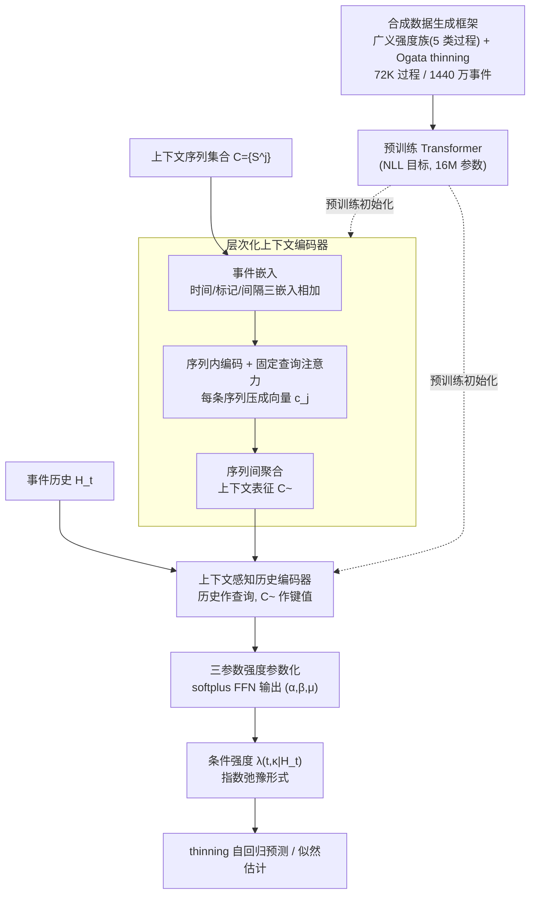

# In-Context Learning of Temporal Point Processes with Foundation Inference Models

**会议**: ICLR 2026  
**arXiv**: [2509.24762](https://arxiv.org/abs/2509.24762)  
**代码**: [OpenFIM](https://fim4science.github.io/OpenFIM/intro.html)  
**领域**: LLM评测  
**关键词**: 时间点过程, 基础推断模型, 上下文学习, Hawkes 过程, 条件强度函数

## 一句话总结

提出 FIM-PP——首个面向标记时间点过程（MTPP）的基础推断模型，在 72K 合成点过程（1440 万事件）上预训练 Transformer 来上下文推断条件强度函数，零样本即可匹配专用模型数小时训练的性能，微调几分钟后在四个真实数据集的多事件预测上全面刷新 SOTA。

## 研究背景与动机

**领域现状**：标记时间点过程（MTPP）是建模异步、不规则事件序列的标准框架，广泛应用于金融交易、社交媒体传播、神经脉冲、流行病学等领域。核心数学对象是条件强度函数 $\lambda(t,\kappa|\mathcal{H}_t)$——给定事件历史后，各类别事件在未来某时刻的瞬时发生率。经典的 Hawkes 过程用线性自激核建模事件间的激发/抑制关系，后续神经方法（NHP、A-NHP 等）引入 RNN/Transformer 编码历史，但都是"一个数据集训练一个模型"的范式。

**现有痛点**：每遇到新的事件序列数据就必须从头训练，训练耗时可达数小时，且学到的表征无法跨系统迁移。与此同时，NLP、ODE、SDE 等领域已经涌现基础模型（如 ODEFormer、FIM-MJP），事件序列领域却始终空白。另一方面，近年流行的生成式方法（扩散、流匹配）虽然预测精度高但完全放弃了强度函数的可解释性——无法看到事件之间的激发/抑制结构。

**核心矛盾**：要兼顾三个目标——(1) 跨数据集的零样本泛化，(2) 高精度的多步预测，(3) 保留条件强度函数的可解释性——但现有方法最多只能满足其中两个。

**本文切入角度**：借鉴 FIM（Foundation Inference Model）范式——在大规模合成数据上预训练一个"识别网络"，让它学会从上下文事件序列集合中推断出底层动力学参数。关键观察是：只要合成数据的条件强度函数族足够广，预训练模型就能编码强大的先验，在真实数据上实现零样本推断或极快微调。

**核心 idea**：在覆盖五类过程的大规模合成 MTPP 上预训练 Transformer，使其学会从一组上下文序列中直接推断条件强度函数的三个解析参数（$\alpha, \beta, \mu$），从而实现零样本/快速微调的可解释事件序列预测。

## 方法详解

### 整体框架

FIM-PP 的流程分为两阶段。**预训练阶段**：定义一个广泛的条件强度函数族（涵盖经典 Hawkes、Poisson、周期过程、高初始激发过程、非单调核过程），从中随机采样大量 MTPP 并用 Ogata thinning 算法模拟事件序列，生成"（上下文序列集、事件历史、真实强度值）"三元组作为训练数据。**推断阶段**：给定一组来自同一系统的上下文事件序列 $\mathcal{C}=\{\mathcal{S}^j\}$ 和一段事件历史 $\mathcal{H}_t$，模型先用一个**层次化编码器**把上下文压成固定表征，再用一个**上下文感知的历史解码器**结合当前历史，最后由前馈网络输出条件强度函数 $\hat{\lambda}(t,\kappa|\mathcal{H}_t)$ 的三个解析参数，可直接用于似然估计或通过 thinning 算法自回归预测未来事件。

### 关键设计

**1. 合成数据生成框架：用一族广义强度函数喂出足够宽的先验**

预训练能不能零样本迁移，全看合成数据覆盖了多少种事件动力学。作者不局限于经典 Hawkes，而是写出一个广义条件强度函数

$$\lambda(t,\kappa|\mathcal{H}_t)=\max\Big(0,\ \mu_\kappa(t)+\sum_{(t',\kappa')\in\mathcal{H}_t} z_{\kappa\kappa'}\gamma_{\kappa\kappa'}(t-t')\Big)$$

再从中切出五类过程族来填满分布：(a) 经典 Hawkes（常数基强度 + 指数衰减核）、(b) Poisson（常数基强度、无交互核）、(c) 周期过程（正弦基强度）、(d) 高初始激发（Gamma 分布基强度）、(e) 非单调偏移核（Rayleigh 分布核）。交互结构则对每对标记 $(\kappa,\kappa')$ 随机采样 $z_{\kappa\kappa'}\in\{-1,0,1\}$，对应抑制、无影响、激发三种关系。从这族过程里用 Ogata thinning 算法模拟，最终堆出 72K 个点过程、1440 万个事件作为训练集。覆盖面够宽带来一个意外收获：实验里这套先验连训练中从未出现的幂律核都能正确推断（Figure 4），说明它学到的不是某个具体核，而是一类局部弛豫行为。

**2. 层次化上下文编码器：先序列内、再序列间，绕开长序列的二次复杂度**

推断时模型要吃进一组来自同一系统的上下文序列 $\mathcal{C}=\{\mathcal{S}^j\}$，序列条数和长度都不定，必须压成固定维度才能往下传。最直接的做法是把所有事件拼成一条超长序列再编码，但那样注意力会撞上 $O(N^2)$ 的瓶颈。作者改成两级压缩：每个事件 $(t_i, \kappa_i, \Delta t_i)$ 先过三个嵌入网络（$\phi_t, \phi_\kappa, \phi_{\Delta t}$，其中时间嵌入用正弦激活）相加得到事件嵌入 $\mathbf{u}_i$；单条序列内的事件嵌入经 Transformer 编码器 $\Psi_\text{enc}^\text{cont}$ 提取特征后，用一个可学习固定查询 $\mathbf{q}^\text{cont}$ 做注意力把整条序列压成单向量 $\mathbf{c}_j$；最后所有 $\mathbf{c}_j$ 再经第二个编码器 $\Psi_\text{enc}^\text{comb}$ 聚合成上下文表征 $\tilde{\mathbf{C}}$。先在序列内消化、再在序列间汇总，使上下文规模可以自由增长而不爆显存，这也是消融里「远少于 2000 条上下文即饱和」能成立的前提。

**3. 上下文感知的历史编码器 + 三参数强度参数化：简单解析形式 + 神经网络参数，灵活性和可解释性兼得**

有了上下文表征，模型还要结合当前事件历史 $\mathcal{H}_t$ 才能输出强度。这里把 $\mathcal{H}_t$ 的嵌入当作 Transformer 解码器 $\Psi_\text{dec}^\text{hist}$ 的查询、$\tilde{\mathbf{C}}$ 当键值，得到历史编码 $\mathbf{h}_t^\text{hist}$；与标记嵌入拼接后经三个独立前馈网络（softplus 激活保证非负）输出 $(\hat{\alpha}, \hat{\beta}, \hat{\mu})$。条件强度则写成一个指数弛豫形式

$$\hat{\lambda}(t,\kappa'|\mathcal{H}_t)=\hat{\mu}+(\hat{\alpha}-\hat{\mu})\exp\!\big(-\hat{\beta}(t-t_\text{last})\big)$$

直观上就是：新事件一发生，强度跳升到 $\hat{\alpha}$，再以速率 $\hat{\beta}$ 指数弛豫回基线 $\hat{\mu}$。形式上它像 Hawkes 一样三个参数就够，但关键差别在于这三个参数本身是历史和标记依赖的（由神经网络逐步输出），所以局部上能拟合 Rayleigh 核、幂律核等远超固定 Hawkes 的行为。这种「解析骨架交给公式、复杂度交给网络」的折中既保住了表达力，又让人看一眼强度曲线就能读出是激发还是抑制——这正是它相比扩散/流匹配等无强度方法保留下来的可解释性。

### 损失函数 / 训练策略

训练目标是标准的下一事件负对数似然 $\mathcal{L}_\text{NLL}=\sum_\kappa \int_0^T \hat{\lambda}(s,\kappa|\mathcal{H}_s)ds - \sum_{(t,\kappa)\in\mathcal{T}}\hat{\lambda}(t,\kappa|\mathcal{H}_t)$。训练时随机子采样上下文序列数量、截断长度和标记数，使模型在推断时适应不同规模的真实数据。模型仅 16M 参数，最多支持 22 种标记。微调在目标数据的训练集上进行同样的 NLL 优化，随机选一条序列做目标、其余做上下文，几分钟即可完成，显存需求不超过 11GB。

## 实验关键数据

### 主实验：多事件预测（N=20）

在 Taxi、StackOverflow、Amazon、Retweet 四个真实数据集上与 7 个基线对比，报告 OTD（最优传输距离，越低越好）和 sMAPE（对称平均绝对百分比误差，越低越好）：

| 方法 | Taxi OTD | SO OTD | Amazon OTD | Retweet OTD | Taxi sMAPE | SO sMAPE | Amazon sMAPE | Retweet sMAPE |
|:---|:---:|:---:|:---:|:---:|:---:|:---:|:---:|:---:|
| HYPRO | 21.60 | 42.40 | 38.6 | 61.03 | 93.8 | 111.00 | 82.5 | 106.11 |
| A-NHP | 24.76 | 42.59 | 39.5 | 60.63 | 97.4 | 108.54 | 84.3 | 107.23 |
| CDiff | 21.01 | 41.25 | 37.7 | 60.66 | 88.0 | 106.18 | 82.0 | 106.18 |
| FIM-PP (zs) | 23.15 | 49.26 | 46.2 | 60.24 | **76.8** | 96.36 | 128.6 | 99.07 |
| **FIM-PP (f)** | **17.91** | **39.80** | **37.2** | **59.44** | 76.8 | **88.25** | **81.2** | **87.59** |

微调后的 FIM-PP (f) 在全部 4 个数据集的 OTD 和 3/4 数据集的 sMAPE 上取得最优。零样本 FIM-PP (zs) 在 Retweet 上已优于所有基线。

### 单事件预测（N=1）

| 方法 | Taxi RMSE$_{\Delta t}$ | Taxi Acc | Taxi sMAPE | Taobao RMSE$_{\Delta t}$ | Taobao Acc | Taobao sMAPE |
|:---|:---:|:---:|:---:|:---:|:---:|:---:|
| A-NHP | 0.32 | **0.91** | 85.13 | 0.53 | 0.47 | 129.13 |
| CDiff | 0.34 | **0.91** | 87.12 | **0.52** | **0.48** | 127.12 |
| FIM-PP (zs) | **0.15** | 0.41 | 69.37 | 1.41 | 0.09 | 163.34 |
| FIM-PP (f) | **0.15** | 0.69 | **63.02** | 9.31 | 0.39 | 138.46 |

FIM-PP 在时间预测指标（RMSE、sMAPE）上大幅领先，但标记准确率显著落后——根源在于 Taxi 数据中存在固定的标记交替模式、Taobao 被单一标记主导，这些分布外模式未被合成先验覆盖。

### 消融与分析

| 配置 | 说明 |
|:---|:---|
| 预训练 vs 从头训练 | 相同架构，预训练初始化收敛更快、最终性能更优（Appendix Figure 5） |
| 上下文序列数 | 远少于 2000 条上下文即可达到饱和性能（Figure 6 消融） |
| 未见核泛化 | 零样本对训练中从未出现的幂律核也能正确推断强度曲线（Figure 4） |
| 预测窗口 N=5/10/20 | 跨所有窗口长度，FIM-PP (f) 均一致优于基线的平均性能 |

### 关键发现

- **零样本即竞争力**：FIM-PP (zs) 未经任何目标域训练，在 Retweet 数据上已超越所有需训练数小时的专用模型，说明合成先验编码了强大的归纳偏置
- **微调极其高效**：在所有数据集上微调仅需几分钟、11GB 显存，性能全面超越基线。这比基线从头训练快一个数量级以上
- **标记预测是短板**：零样本标记准确率仅 0.41（Taxi）和 0.09（Taobao），微调后有大幅提升但仍不及专用模型，核心原因是合成先验未覆盖"固定交替"和"单标记主导"等数据特有模式
- **先验的泛化力惊人**：即使面对训练中从未出现的幂律核，零样本强度估计仍然准确，说明三参数指数弛豫形式的局部适应能力强于预期

## 亮点与洞察

- **首个时间点过程的基础推断模型**：填补了事件序列领域基础模型的空白。与 NLP 中的大语言模型类似，FIM-PP 展示了"合成数据预训练 + 上下文推断"范式在非语言领域的可行性
- **解析强度参数化兼顾灵活性与可解释性**：三参数 $(\alpha,\beta,\mu)$ 看似简单，但由于参数本身是历史和标记依赖的（神经网络输出），实际可以拟合远超 Hawkes 的复杂局部行为。这种"简单解析形式 + 神经网络参数"的设计思路可以迁移到其他需要可解释动力学建模的场景
- **层次化序列编码避免长序列瓶颈**：先独立编码每条序列再聚合，而非将所有事件拼成一条超长序列。这个设计使上下文规模可以自由增长，是处理集合型输入的通用 trick
- **合成先验的覆盖度决定零样本性能天花板**：标记预测的失败精确暴露了先验的盲区（交替模式、单标记主导），为后续工作指明了最直接的改进方向

## 局限与展望

- **合成先验不够普适**：当前五类过程族未覆盖标记层面的结构模式（如固定交替、单标记主导），导致零样本标记预测大幅落后。扩展先验至更多标记动态模式是最优先方向
- **标记数上限固定**：训练时设定最多 22 种标记，超过此限制则无法利用全部上下文。可考虑动态标记嵌入或分组策略突破限制
- **强度参数化局限**：指数弛豫形式虽然灵活，但对多模态核（如多次激发-抑制交替）的拟合能力有限。可尝试多组件混合参数化
- **未整合无强度方法**：近期 intensity-free 方法（扩散、流匹配）在预测精度上有优势，如何将其与 FIM-PP 的可解释推断结合是重要方向

## 相关工作与启发

- **vs CDiff（扩散式事件预测）**：CDiff 直接生成事件集合，预测精度高但完全放弃强度函数可解释性。FIM-PP 通过微调在多数指标上超越 CDiff，同时保留了强度曲线的物理语义
- **vs NHP / A-NHP（神经 Hawkes）**：这些方法同样基于条件强度但必须逐数据集从头训练。FIM-PP 用合成预训练消除了这一负担，且微调后在 OTD 指标上超越 10-30%
- **vs FIM-MJP / FIM-SDE（其他基础推断模型）**：FIM-PP 将 FIM 范式从 Markov 跳跃过程/随机微分方程扩展到点过程，验证了"合成预训练 + 解析参数化 + 上下文推断"三位一体的框架在更多动力学系统上的普适性

核心启发：**合成先验设计质量决定基础推断模型的泛化上限**。

## 评分

| 维度 | 分数 |
|:---:|:---:|
| 新颖性 | ⭐⭐⭐⭐⭐ |
| 技术深度 | ⭐⭐⭐⭐ |
| 实验充分性 | ⭐⭐⭐⭐ |
| 写作质量 | ⭐⭐⭐⭐ |
| 实用价值 | ⭐⭐⭐⭐ |
| 总评 | ⭐⭐⭐⭐ |

> 开创性地将基础推断模型引入时间点过程。合成预训练+上下文学习极具启发性，零样本表现印象深刻，微调后全面 SOTA。主要局限在合成先验覆盖范围。

<!-- RELATED:START -->

## 相关论文

- [\[ICLR 2026\] In-Context Learning for Pure Exploration](in-context_learning_for_pure_exploration.md)
- [\[ICLR 2026\] Detecting Data Contamination in LLMs via In-Context Learning](detecting_data_contamination_in_llms_via_in-context_learning.md)
- [\[ICML 2025\] Sample Efficient Demonstration Selection for In-Context Learning](../../ICML2025/llm_evaluation/sample_efficient_demonstration_selection_for_in-context_learning.md)
- [\[ICLR 2026\] GuidedSampling: Steering LLMs Towards Diverse Candidate Solutions at Inference-Time](guidedsampling_steering_llms_towards_diverse_candidate_solutions_at_inference-ti.md)
- [\[ICLR 2026\] Multi-LLM Adaptive Conformal Inference for Reliable LLM Responses](multi-llm_adaptive_conformal_inference_for_reliable_llm_response.md)

<!-- RELATED:END -->
