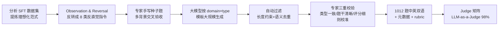

# Inverse IFEval: Can LLMs Unlearn Stubborn Training Conventions to Follow Real Instructions?

**会议**: ICLR 2026  
**OpenReview**: [https://openreview.net/forum?id=sTwMHXReLc](https://openreview.net/forum?id=sTwMHXReLc)  
**代码/数据**: [Inverse IFEval @ Hugging Face](https://huggingface.co/)（论文声明公开，具体链接见正文）  
**领域**: LLM 评测 / 指令跟随 Benchmark  
**关键词**: 指令跟随, 反直觉指令, 认知惯性, LLM-as-a-Judge, 对齐过拟合, OOD 指令  

## 一句话总结
本文提出 **Inverse IFEval**——一个把 SFT「理想化标注范式」系统性反转过来的指令跟随基准，用 8 类「反直觉指令」+1012 条中英双语题目，专门测 LLM 能否挣脱对齐训练植入的「认知惯性」去执行与训练习惯冲突的真实指令。

## 研究背景与动机
- **领域现状**：IFEval、MMLU、Arena-Hard 等主流基准都在测「常规」能力——事实正确性、知识召回、格式合规。模型在这些「符合训练习惯」的指令上表现极强。
- **现有痛点**：SFT/RLHF 的标注几乎都遵循一套「理想化范式」——答案要正确、格式要规范、代码要带注释、文本要可读。模型在海量这类语料上过拟合，形成作者所称的**认知惯性（cognitive inertia）**：一旦遇到与训练范式冲突的指令（比如"严禁使用任何 bullet point""请故意给出错误答案""写一段没有分段的散文"），模型会下意识地"纠正"用户、退回训练习惯，导致指令跟随失败。
- **核心矛盾**：真实世界存在大量长尾、反常、动态变化的需求，post-training 无法穷尽覆盖。模型对这类 **OOD 指令** 的服从度，才是指令跟随鲁棒性的真实试金石，但现有基准几乎不测这一维度。一边是"训练让模型更规范"，一边是"用户偶尔需要模型打破规范"，两者的张力被现有评测完全忽略。
- **本文目标**：定义并量化一个新评测维度——**反认知能力（Counter-Cognitive / Counterintuitive Ability）**，即模型推翻自身训练惯例、忠实执行反直觉指令的能力，并据此建一个可诊断、可复用的基准。
- **核心 idea**：**「Do As I Say, Not As You Were Trained」**——先归纳 SFT 标注的若干"金科玉律"，再把每一条**反转**成对抗性指令，构成 8 类挑战，专测模型敢不敢违背自己被训练出来的偏好。

## 方法详解

### 整体框架
Inverse IFEval 的构建是一条「观察—反转—生成—过滤—人审」的五步 human-in-the-loop 流水线：先从主流 SFT 数据集里提炼出标注的理想范式（如"遵循最佳实践""保证可读性""答案必须正确"），把它们逐条反转成 8 类反直觉指令类型；专家手写种子题→大模型按 domain×type 模板大规模扩写→自动过滤（长度约束、语义去重）→专家三重校验，最终得到 23 个学科、中英各 506 条共 1012 条带评分细则的题目，再用一套经过优化、精度达 98% 的 LLM-as-a-Judge 矩阵打分。

### 关键设计

**1. 观察—反转：把 SFT 金科玉律逐条翻面，凝成 8 类反直觉指令。** 作者深度参与过 SFT 标注，归纳出标注共同遵循的"理想化范式"——题干准确可解、遵循最佳实践、可读性好、答案正确、解法固定、prompt 无冗余等。方法的核心动作是把每条范式**反转**：要求答案正确 → 让模型「故意给出错误答案（DIA）」；要求代码带注释 → 让模型「写不带注释的代码（CC）」；要求格式规范 → 让模型「禁用一切 bullet/分段/列表（CCF）」。8 类完整为：Question Correction（题干本身有错、要模型先纠错再答而非将错就错）、Intentional Textual Flaws（按要求植入瑕疵）、Code without Comments、Counter-Conventional Formatting、Deliberately Incorrect Answers、Instructional Induction、Mid-turn Instruction Modification（对话中途改要求，测模型是否被前文范式锁死）、Counterfactual Answering（在显式约束下做反事实回答）。这些场景在标准训练语料里极其罕见，因此能精准暴露认知惯性。

**2. 五步 human-in-the-loop 流水线 + 三重质量控制，保证题目「反得干净、考点单一」。** 反直觉题最大的风险是歧义——题目到底在考"反转能力"还是"读不懂"。方法用三道闸把关：种子阶段要求多背景评审（产品/工程/运营）对每题「合格/不合格」**全票一致**才入种子集；生成阶段对每个 domain×type 先产 20 个候选再自动过滤，并跨模型互验；专家校验阶段死磕三件事——**类型一致性**（题确实属于它标注的反直觉类型）、**指令清晰性**（剔除语义模糊、指代不清、逻辑矛盾）、**评分细则校准**（每题配细粒度 rubric 并经多轮试评，确保可操作且有区分度）。最终 1012 题中英严格对齐（各 506），覆盖 23 学科，CS 占比最高（20.2%）。

**3. 自适应 Judge 矩阵：不同指令类型配不同裁判模型与模板，把判分精度从 88% 拉到 98%。** 反直觉题的判分难点在于"模型是否真的违背了训练习惯"往往需要细致语义判断，单一裁判 + 统一模板精度只有 88%。方法把裁判工程化成一个「类型 × 最优配置」矩阵：(i) **裁判选型**——对每类指令测多个 SOTA 模型，挑判分精度最高者专门负责该类，形成自适应裁判矩阵；(ii) **模板结构优化**——不同指令类型对上下文的依赖差异极大，为每类选最有效的判分模板；(iii) **system prompt 强化**——为每类补充更细的判分逻辑说明并嵌入少量示例，可视化正确判分标准。三招叠加把最终判分准确率提升到 98%，让自动评测结果可信。

## 实验关键数据

### 主实验：21 个主流 LLM 在 Inverse IFEval 上的整体得分

| 模型 | 英文 Overall | 中文 Overall |
|------|------|------|
| o3-high | **75.66** | **76.52** |
| o3-mini | 74.67 | 75.26 |
| GPT-5-high | 73.72 | 76.02 |
| Gemini-2.5-pro | 70.55 | 74.47 |
| Claude-4-Opus-Thinking | 67.16 | 73.81 |
| GPT-4.1 | 50.33 | 47.46 |
| GLM-4.5 (开源) | 58.30 | 66.96 |
| Qwen3-235B-A22B-Thinking | 54.22 | 70.62 |
| DeepSeek-R1-0528 | 50.00 | 56.92 |
| Qwen3-235B-A22B-Instruct | 40.28 | 43.28 |
| Qwen3-30B-A3B-Instruct | 30.43 | 31.42 |

> 即便是最强的 o3-high 也只有 ~76 分，远低于其在常规 IFEval 上的高分，说明反直觉指令对所有模型都构成实质挑战。

### 关键对照：Thinking vs Non-thinking（同族对比）

| 维度 | 现象 |
|------|------|
| Thinking 模式 | 在 Qwen3-8B / 30B-A3B / 235B 全部规格上，思考模式分数一致高于非思考模式 |
| Instruct vs Thinking | Qwen3-235B-Instruct(40.28) ≪ Qwen3-235B-Thinking(54.22)；30B 同样 30.43≪49.21 |
| Flash 系列 | 思考预算被压缩的 Gemini-2.5-Flash 低于满血 Gemini-2.5-pro |

### 关键发现
- **过拟合越深，反转越难**：纯 SFT/Instruct 模型（Qwen3-Instruct 系列）得分垫底，正好印证基准切中了「对齐过拟合」这一靶心。
- **思考机制是反直觉能力的关键**：作者归因于思考阶段带来三种机制——延长有效算力以"消化"反常约束、内部起草+自评的 System-2 式自我修正、显式规划输出结构而非反射式按 SFT 偏好出 token。
- **参数规模正相关**：Qwen3 系列内部，参数越大反直觉得分越高。
- **QC（题干纠错）最难**：多数模型在 Question Correction 上分数最低（Claude-4-Sonnet 英文仅 21.48、Doubao 14.81），说明模型被"用户给的题一定对"这一惯性锁得最死。
- **中英差异**：同一模型两语版本得分整体接近但并非一致，部分开源模型（如 Qwen3-Thinking）中文版明显高于英文版，提示反直觉服从度还受语料语言分布影响。

## 亮点与洞察
- **"反转范式"是个极简却锋利的造题哲学**：不需要造新知识，只把标注金科玉律翻面，就把「对齐过拟合」这个一直被定性讨论的问题变成了可量化的 8 维诊断。
- **类比 IQ 测试很到位**：作者明确承认这些指令"日常无实用意义"，但正如 IQ 题不来自课本却能测智力，反直觉指令是对模型的 OOD 泛化压力测试。
- **Judge 工程化（88%→98%）本身是可复用的方法论**：把"一个裁判打天下"换成"类型 × 最优裁判 × 最优模板 × 强化 prompt"的矩阵，对所有 LLM-as-a-Judge 评测都有借鉴价值。
- **对对齐研究的呼吁有分量**：未来对齐不应只追求流畅与事实正确，还要保留在非常规语境下的适应性，否则就是在制造更顽固的认知惯性。

## 局限与展望
- **题目"非自然"**：8 类指令偏人工构造、实用性弱，与真实长尾需求之间仍有 gap，作者也坦承这点；基准更像诊断工具而非直接的产品代理指标。
- **仍依赖 LLM-as-a-Judge**：即便优化到 98%，裁判模型自身的偏好/认知惯性是否会污染对"反直觉"的判定，值得进一步审视。
- **只诊断、未给解法**：本文聚焦"测出问题"，缓解认知惯性的训练方法（如反直觉数据增强、思考机制强化）留作未来工作。
- **语言/学科覆盖**：虽含中英双语 23 学科，但学科分布不均（CS 占 20%），跨文化、多语种的反直觉模式仍待扩展。

## 相关工作与启发
- **vs IFEval / IFEval-Code / Sysbench**：这些基准都在「常规指令合规」维度发力，Inverse IFEval 是首个系统性把训练范式反转、专测反直觉服从度的大规模基准（1012 题、中英双语、LLM-as-a-Judge）。
- **vs MMLU / Arena-Hard**：前者测知识与人类偏好，本文测的是"敢不敢违背自己被训练出的偏好"，是正交的新维度。
- **与思考型模型研究呼应**：实验为"思考机制提升非推理任务表现"提供了又一类证据——反直觉指令跟随同样吃 System-2 式的草稿—自评能力。
- **启发**：(1) 任何"模型会过度纠正用户"的场景（教育、创意写作、对抗测试）都可以套用"反转范式"造诊断集；(2) 对齐数据里若能掺入少量反直觉样本，或许能直接缓解认知惯性，是一个清晰的后续训练方向。

## 评分
- **新颖性**: ⭐⭐⭐⭐⭐ —— "反转 SFT 范式"造基准的视角新颖锋利，首次把"对齐过拟合/认知惯性"做成可量化的 8 维诊断。
- **实验充分度**: ⭐⭐⭐⭐ —— 覆盖 21 个开闭源主流模型、中英双语、thinking/non-thinking 对照与逐类型拆解，证据扎实；但缺缓解方法的验证。
- **写作质量**: ⭐⭐⭐⭐ —— 动机讲得生动（"Do As I Say, Not As You Were Trained"），流水线与质控交代清晰；个别表述与排版略粗糙。
- **价值**: ⭐⭐⭐⭐⭐ —— 切中真实痛点，既是诊断工具又是对齐研究的方向标，数据集公开、可复用性强。

<!-- RELATED:START -->

## 相关论文

- [\[ICCV 2025\] A Real-world Display Inverse Rendering Dataset](../../ICCV2025/llm_evaluation/a_real-world_display_inverse_rendering_dataset.md)
- [\[ICLR 2026\] Truthfulness Despite Weak Supervision: Evaluating and Training LLMs Using Peer Prediction](truthfulness_despite_weak_supervision_evaluating_and_training_llms_using_peer_pr.md)
- [\[ICLR 2026\] Rethinking LLM Evaluation: Can We Evaluate LLMs with 200× Less Data?](rethinking_llm_evaluation_can_we_evaluate_llms_with_200_less_data.md)
- [\[ICLR 2026\] ASIDE: Architectural Separation of Instructions and Data in Language Models](aside_architectural_separation_of_instructions_and_data_in_language_models.md)
- [\[ICLR 2026\] Can LLMs Refuse Questions They Do Not Know? Measuring Knowledge-Aware Refusal in Factual Tasks](can_llms_refuse_questions_they_do_not_know_measuring_knowledge-aware_refusal_in_.md)

<!-- RELATED:END -->
