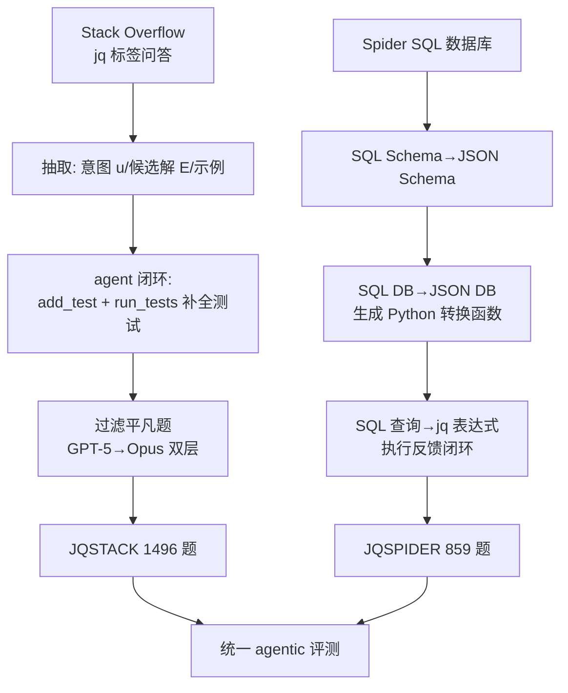

# JQBench: 一个从自然语言和/或示例读写 JSON 的基准

**会议**: ICLR 2026  
**OpenReview**: [https://openreview.net/forum?id=VStKtgGXUc](https://openreview.net/forum?id=VStKtgGXUc)  
**代码**: [https://github.com/PidgeyUsedGust/jqBench](https://github.com/PidgeyUsedGust/jqBench)  
**领域**: LLM 评测 / 代码生成基准  
**关键词**: jq、JSON 转换、自然语言到代码、programming-by-example、agentic 评测、低资源语言  

## 一句话总结
本文构建了 **JQBench**——一个评测 LLM 把自然语言和/或输入输出示例转写成 `jq` 表达式（查询、过滤、变换 JSON）的基准，由 Stack Overflow（JQSTACK，1496 题）和 Spider（JQSPIDER，859 题）两条全自动流水线生成，并通过大量基线实验揭示了「文档陷阱」「jq 落后于 Python」「示例反馈至关重要」三大反直觉发现。

## 研究背景与动机
- **领域现状**：JSON 已是 Web API、数据库、配置文件乃至 LLM 推理与 agent 工作流的事实标准数据格式，对 JSON 做查询/变换是高频任务，`jq` 这类工具表达力强但语法冷僻；NL-to-code 基准（HumanEval、Spider 等）层出不穷，却没有一个**同时覆盖自然语言意图与可执行 JSON 查询/变换**的基准。
- **现有痛点**：`jq` 的表达力虽强，但其简洁而少见的语法让模型很难从自然语言生成正确表达式——文中举例「找两个数组的公共元素」，GPT-5 写出冗长且错误的 `index` 嵌套，而正解只是 `.[0] - (.[0] - .[1])`。这类问题没有现成基准来系统衡量。
- **核心矛盾**：JSON 数据形态自由多变、输入信号多样（NL、示例、JSON Schema），而 `jq` 又是「表达力高、写法少见」的低资源语言——三者叠加使得「构造高质量基准」本身就很难，更别说评测模型。**人工标注成本高且易出错**（Spider 被发现 30%+ NL-SQL 映射错误），纯合成又会损失真实用户查询的鲁棒性。
- **本文目标**：低成本、可自动验证地构造一个既贴近真实开发者问题、又能挑战最强模型的 jq 基准，并借此分析 LLM 在低资源语言、agentic 反馈、PBE 等设定下的真实能力。
- **核心 idea**：**用 LLM agent + 执行反馈把现成的两类高质量资源（Stack Overflow 真实问答、Spider 关系数据库）自动"翻译"成机器可验证的 jq 任务**——前者提供多样真实问题与 I/O 示例，后者提供深层嵌套的大规模结构化数据，互补成一个全自动、可执行验证的基准。

## 方法详解

### 整体框架
JQBench = JQSTACK ∪ JQSPIDER，两套数据由两条独立的自动流水线生成，最后用统一的 agentic 评测协议跑基线。JQSTACK 走「从 Stack Overflow 抽取意图+候选解+示例 → agent 补全测试用例 → 过滤平凡题」；JQSPIDER 走「SQL Schema → JSON Schema → JSON 数据库 → jq 查询」的逐级转换。所有中间步骤都用编译/执行反馈做闭环校验，保证产出的任务有可自动判定的正确答案。

### 关键设计

**1. JQSTACK：从真实问答中"蒸馏"可验证任务。** 流水线分四步——抽取、转换、过滤、人工复核。**抽取**阶段让 GPT-5 从每条 jq 标签的问答里提炼出 (1) 关键问题/解法的原文引用、(2) 精确的意图描述 $u$、(3) 所有满足意图的候选 jq 表达式 $E$、(4) 可选的输入输出示例，得到 15860 条原始抽取。**转换**阶段是整条流水线的核心：给 agent 两个工具 `add_test(n,i,o)`（添加一个名为 $n$、期望输入 $i$ 产出 $o$ 的测试）和 `run_tests(e)`（在所有测试上跑表达式 $e$ 并返回编译/执行结果），让模型在闭环里反思、纠正测试输出（7.5% 的转换发生了这种自我纠错），最终用所有候选表达式在测试集上执行来判定哪些是正解，产出 14620（GPT-5）+923（Opus）条有效转换。这一设计的巧妙之处在于：**它不要求模型从零写解，而是给足候选解和示例，让 agent 只需"补全测试集"，把开放式生成降维成可验证的对齐问题**。

**2. 双层过滤 + 人工复核保证难度与质量。** 真实问答里大量任务过于平凡（如「打印名为 text 的字段」正解就是 `.text`），会让强模型轻松刷满分而失去区分度。作者用「无交互、温度 0 的一次性 jq 生成」当过滤器：先用 GPT-5 滤掉 11066 条能直接解出的题，再用 Opus 4.1 滤掉 1913 条，只留下 **1496 道有挑战性的题**。最后人工复核那些"任何基线都没解出"的题——发现它们多半是**欠规约**（硬编码常量、对抗性边界、unseen 样本里 schema 突变、表述歧义），约 25 道修掉歧义、约 43 道因补全规约后变平凡而被剔除。被滤掉的 13K 简单题并未浪费，而是作为**微调种子数据**释出。

**3. JQSPIDER：把关系数据库逐级"升维"成嵌套 JSON 查询。** 从修复版 Spider 出发，三步转换:(1) 让模型把 SQL Schema（列、类型、外键）转成 **JSON Schema**，指示它选合适的根表、用嵌套对象/数组表达一对一与一对多关系（实测 LLM 生成的 schema 比符号启发式更"有意思"）；(2) 把 SQL 数据库转成符合该 schema 的 **JSON 数据库**——先符号化地把每张表平铺成 trivial JSON，再让模型迭代写 Python 转换函数、用 `jsonschema` 校验反馈闭环（202 个库成功 197 个）；(3) 给定 NL 指令、SQL 查询、JSON Schema 和 SQL 在原库上的期望输出，迭代让模型写出等价 **jq 表达式**，用执行反馈校验，产出 893 题。这条线的价值在于:**表越多 → JSON 嵌套越深 → jq 需要越长的 `map`/`select` 管道链**（SQL JOIN 数与 jq 管道数正相关 $r=0.326$），从而系统性地制造"需要长链推理"的难题。

**4. 统一 agentic 评测协议：拆解反馈、语言、指令三个变量。** 默认设定基于 SELF-DEBUG——总是给编译反馈，有输入时给执行反馈，有输出时给测试结果反馈（即**隐式反馈**）。在此之上对照三组变量:(a) **隐式 vs 显式工具**——额外给 `run_code`（在合成输入上跑表达式）、`search_docs`/`print_docs`（检索 jq 文档）三个工具，看模型主动探索是否有帮助；(b) **jq vs Python**——用结构尽量一致的 prompt 让模型改用 Python 函数解同一题，隔离出"语言陌生度"这个瓶颈；(c) **NL vs PBE**——去掉自然语言指令、只留「让查询匹配以下 I/O 示例」，把任务退化成 programming-by-example。所有设定最多迭代 8 轮、温度 0，评测用 value-match（`jq.all(e,i)==[o]`，JQSPIDER 上忽略 record 的键名、无 ORDER BY 时忽略顺序）。

## 实验关键数据

### 主实验表格（value-match，节选）

| 数据集 | 模型 | 语言 | 隐式反馈 | value 准确率 | iter@1 |
|--------|------|------|----------|-------------|--------|
| JQSTACK | Opus 4.1 | jq | ✓ | **0.76**（最佳 jq） | 0.30 |
| JQSTACK | GPT-5 | jq | ✓ | 0.68 | 0.11 |
| JQSTACK | GPT-5-mini | jq | ✓ | 0.59 | 0.10 |
| JQSTACK | Phi-4 | jq | ✓ | 0.10 | 0.02 |
| JQSTACK | Opus 4.1 | Python | ✓ | **0.83**（最佳总体） | 0.69 |
| JQSTACK | GPT-5 | Python | ✓ | 0.82 | 0.66 |
| JQSPIDER | Opus 4.1 | jq | ✓ | **0.81**（最佳） | – |
| JQSPIDER | GPT-5 | jq | ✓ | 0.78 | – |
| JQSPIDER | Phi-4 | jq | ✓ | 0.43 | – |

### 消融/对照实验表格

| 对照设定 | 现象 | 数据 |
|----------|------|------|
| 隐式反馈 → 加 `run_code` 显式工具 | 性能**下降** | GPT-5 −53%、Opus 4.1 −22% |
| jq → Python（JQSTACK） | jq 落后 | Phi-4 54%→10%、GPT-5 82%→68%、Opus 仅 −5% |
| 有文档 vs 无文档（Opus 4.1） | 「文档陷阱」 | 76% → 31% |
| NL → 纯示例 PBE | 小幅下降 | Opus 76%→71%、GPT-5 68%→63%、mini 59%→53% |

### 关键发现
- **语言陌生度是主要瓶颈**：模型常常"懂任务但不会用 jq 表达"，越小的模型越明显（Phi-4 在 jq 上只有 10%，换 Python 升到 54%）；Opus 4.1 编码强，几乎不受影响（仅 1% 表达式编译失败）。
- **「自由探索」反而有害**：给显式工具后 GPT-5 在 78% 任务里压根不用工具、对示例覆盖率低（27.8% vs Opus 68.5%）、看到错误输出仍坚持错解——主动探索抵不上被动的隐式反馈。
- **「文档陷阱」**：最擅长 jq 的 Opus 4.1 拿到文档后反而暴跌，因为它陷入反复请求文档的循环（文档请求率是次高模型的 5 倍）。能力到一定程度后，SELF-DEBUG 比 RAG 检索文档更划算。
- **反馈至关重要、4 轮后收益递减**：所有模型 iter@1 都很低，需要多轮反馈，效果在 4 轮（Opus）或 7–8 轮后趋平；停滞主因是**在示例上过拟合**（哪怕指令明说要泛化）。
- **难造的题也难解、但无污染**：构造迭代次数越多的题越难解，而解与原候选的距离和正确率无关，说明不存在数据污染问题。

## 亮点与洞察
- **「降维成对齐」的造题哲学**：不让模型从零写解，而是给足候选解与示例、只让 agent 补全可执行测试，把开放生成变成可自动验证的对齐任务——这是用 LLM 低成本造高质量基准的可复用范式。
- **双源互补**：JQSTACK 考"深知识"（116 种内置函数、99 道需自定义算子），JQSPIDER 考"长链组合"（中位数 4 个管道），一个考广度一个考深度，服务不同研究方向。
- **三个反直觉结论本身就是贡献**：文档陷阱、显式工具有害、jq 落后 Python——都提示 agentic 工作流里"给模型更多能力"未必更好，对 agent 设计有直接启发。
- **附带释出 13K 微调数据**，让基准不止用于评测，还能驱动低资源语言的微调研究（Phi-4 的挣扎正暗示了这条路）。

## 局限与展望
- **单输入限制**：当前每题只支持单个 JSON 输入，不处理多输入/多文件 jq 程序，难以覆盖真实的多源工作流。
- **自动构造的难度天花板**：流水线依赖 LLM 从丰富信号生成解，可能限制了高难题的数量；作者计划用人工标注 + 更强模型补全剩余失败转换。
- **仅英文**：数据源（Stack Overflow、Spider）都是英文，基准也只有英文版。
- **评测放宽了等价判定**（忽略键名、顺序、wrap-in-list），在严格语义等价场景下可能偏松。

## 相关工作与启发
- **最近邻基准**：DOCSPIDER（Spider→MongoDB 查询）、JSONSCHEMABENCH（约束解码生成合规 JSON）——JQBench 的差异在于既译 SQL（→jq）又抓真实 Stack Overflow 问题，覆盖更多样、更不规则的 JSON 形态。
- **NL-to-CLI**：NL2Bash（12K Linux 命令，但只含 2 条 jq）、Terminal-Bench（终端 agent，数据操作类任务少）——jq 本质是 CLI 工具，JQBench 填补了"数据变换型 CLT"的空白。
- **基准构造方法学**：呼应 ODEX（Stack Overflow + 人工测试）、BigCodeBench（LLM+人工扩写）、执行过滤/自一致/自精炼等技术，强调"真实查询 + 执行验证"对鲁棒性的重要。
- **对 PBE 研究的价值**：去掉 NL 后 JQSTACK 退化成有挑战性的 programming-by-example 基准，连接符号与神经 PBE 两条线。

## 评分
- **新颖性**: ⭐⭐⭐⭐ 首个联合自然语言+示例+可执行 JSON 变换的基准，瞄准 jq 这个被忽视的低资源语言，造题范式与三个反直觉发现都有原创性。
- **实验充分度**: ⭐⭐⭐⭐ 覆盖多模型（Opus/GPT-5/GPT-5-mini/Phi-4）、多设定（隐式 vs 显式、jq vs Python、NL vs PBE、有无文档）的系统对照，复杂度代理分析详尽。
- **写作质量**: ⭐⭐⭐⭐ 流水线图示清晰、发现部分有故事性（文档陷阱/自由测试致命等小标题），但表格符号繁多、可读性偏弱。
- **价值**: ⭐⭐⭐⭐ 提供可自动验证的挑战性基准 + 13K 微调数据，对 agent 反馈设计、低资源语言代码生成、execution-guided decoding 等方向都有直接驱动作用。

<!-- RELATED:START -->

## 相关论文

- [\[ICLR 2026\] Towards Personalized Deep Research: Benchmarks and Evaluations](towards_personalized_deep_research_benchmarks_and_evaluations.md)
- [\[ICLR 2026\] RedacBench: Can AI Erase Your Secrets?](redacbench_can_ai_erase_your_secrets.md)
- [\[ICLR 2026\] Evaluating Language Models' Evaluations of Games](evaluating_language_models_evaluations_of_games.md)
- [\[ICLR 2026\] Culture in Action: Evaluating Text-to-Image Models through Social Activities](culture_in_action_evaluating_text-to-image_models_through_social_activities.md)
- [\[ICLR 2026\] Talk, Evaluate, Diagnose: User-aware Agent Evaluation with Automated Error Analysis](talk_evaluate_diagnose_user-aware_agent_evaluation_with_automated_error_analysis.md)

<!-- RELATED:END -->
