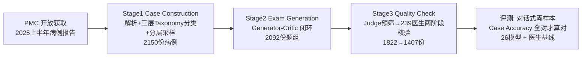

# LiveClin: A Live Clinical Benchmark without Leakage

**会议**: ICLR 2026  
**OpenReview**: [https://openreview.net/forum?id=E0WSAugJ0j](https://openreview.net/forum?id=E0WSAugJ0j)  
**代码**: [https://github.com/AQ-MedAI/LiveClin](https://github.com/AQ-MedAI/LiveClin)  
**领域**: LLM 评测 / 医疗大模型 / 动态基准  
**关键词**: 数据污染, 知识过时, 医疗 LLM, 临床路径, 多模态评测, AI-人协同标注  

## 一句话总结
LiveClin 用每半年更新一次、源自最新同行评议病例报告的"活基准"，把单题问答升级为模拟完整临床路径的多模态序列考试，从根上抵抗数据污染与知识过时——26 个模型里最强的 Case Accuracy 也仅 35.7%，且仍落后于主任医师。

## 研究背景与动机
**领域现状**：医疗 LLM 被寄望于辅助诊断与个性化诊疗，而能否安全落地完全取决于能否被严格评估。但主流评测仍停留在 MedQA、MedXpertQA、AgentClinic 这类静态、单轮的问答集上。

**现有痛点**：静态基准有两个致命缺陷。其一，题目和答案随着模型在 web 级语料上训练会被不可避免地"吃进"训练集，造成**数据污染（data contamination）**——模型是在已见过的数据上被测，分数虚高，社区无法区分真实进步与"刷榜"；同时临床医学持续演进，静态题库还会**知识过时（knowledge obsolescence）**。其二，单轮评测与"患者纵向管理"的本质错位，把诊疗拆成一堆互不相关的快照任务，无法考察从首诊到长期管理的整合推理。

**核心矛盾**：论文用一个纵向 pilot 实验把矛盾量化了——GPT-5 在其知识截止前的旧数据上能拿 45.0%，但在截止后发布的新病例上骤降近 10 个百分点；这一模式在多个模型上一致出现，说明静态基准是"真实临床推理"的不可靠代理。

**本文目标**：构建一个动态、抗污染、覆盖完整临床路径的多模态基准，并配套一条可持续、可验证的生产管线。

**核心 idea**：**(1) 活基准（live benchmark）**——只用 PubMed Central（PMC）开放获取子集里"当代、同行评议"的病例报告做源头，每半年更新，让污染与过时在源头被规避；**(2) 临床路径化**——把一份静态病例报告改写成 3–6 题、随病程推进逐步引入新信息（影像、化验等）的序列 MCQ；**(3) AI-人协同工厂**——用 Generator-Critic-Judge 多智能体生成 + 239 位医生两阶段审核，兼顾规模与临床严谨度。

## 方法详解

### 整体框架
LiveClin 是一条三阶段流水线 + 一套三层临床分类体系（Taxonomy）。Taxonomy 提供多分辨率分析骨架：Level 1 为 16 个 ICD-10 章节（宏观专科），Level 2 为 72 个疾病簇（亚专科），Level 3 为具体 ICD-10 编码（诊断级）。流水线在此骨架上依次完成：① Case Construction（拉取并分层采样最新病例，建当代语料）→ ② Exam Generation（Generator-Critic 把静态报告改写成序列推理题）→ ③ Quality Check（Judge 智能体预筛 + 多级医生核验）。最终评测采用"对话式、零样本、全程保留历史"的协议，主指标 Case Accuracy 要求一个病例的所有序列题全对才算对。

### 关键设计

**1. 源头抗污染的"活"数据底座：用最新同行评议病例 + 分层采样建当代语料。** 与"事后去污染（decontamination）"这种被动、且常不彻底的做法相反，LiveClin 选择主动设计——只程序化抓取 PMC 开放获取子集中 2025 年上半年发表的 XML 格式病例报告，把 Case Presentation 等"患者旅程"段落聚合成病例主线、Discussion 段落聚合成病例讨论，并把表格转 Markdown、抽取所有图像的持久 URL 与图注以支撑多模态。采样上先用 gpt-4.1 对每份病例打三层 Taxonomy 标签，再以 72 个 Level-2 疾病簇做分层采样（每簇目标 30 份），并在簇内优先 Level-3 疾病多样性以抑制常见病过表示，最终得到 2,150 份高质量病例。半年一更的机制让"新病例永远在模型知识截止之后"，使污染与过时从源头失效。

**2. Generator-Critic 闭环把静态报告改写成完整临床路径序列考试。** 这是把"单点快照"升级为"纵向路径"的关键。Generator Agent（o3 驱动）先只用"患者到达时可获信息"写一个初始临床场景，再生成 3–6 题、每题 10 选项的递进 MCQ，并给每题动态打上临床阶段标签（如 Initial Assessment），保证从诊断到长期管理的逻辑流；每题在合适的工作流节点策略性引入新临床细节，逼模型持续整合演进信息。Critic Agent 随后进入自动"同行评审"闭环，在 Clinical Accuracy 与 Cognitive Complexity 两个维度打分并给可执行反馈，循环直到题组达成 100% 临床准确率且 >60% 题目为高认知复杂度；10 个周期内不收敛则丢弃。该闭环把 2,150 份病例炼成 2,092 份高质量题组。

**3. Judge 预筛 + 239 医生两阶段核验，以"保守拒绝"守住医学严谨。** 质量检查遵循"任何可能有瑕疵的题一律拒绝"的保守原则。先由 o3 实现的 Judge Agent 做高保守预筛，按 Factual Validation（与源病例完全对齐）和 Logical Solvability（答案可由已知信息推出）两条标准，并刻意区分"特权信息"与"考生可见信息"来自动剔除根本性缺陷题，把池子从 2,092 收窄到 1,869。随后 239 位执业医师两阶段把关：Annotation 阶段由顶级医院主治医师逐题评估，Inspection 阶段由资深医师复核，任何分歧触发与标注者的修订循环直至共识——分歧仅出现在 8.7% 病例且两轮内全部解决。整个核验耗 1,772.18 人时、$24/小时、共 $42,304.39，产出 1,822 份合格题组，最后按 Level-2 簇每簇 20 例分层采样定稿为 1,407 份。

**4. 对话式零样本评测协议 + 严苛的 Case Accuracy。** 为忠实模拟序列临床会诊，评测全程把完整对话历史作为后续每题的上下文，强迫模型持续整合新信息；多数模型温度设 0 保证可复现。主指标 Case Accuracy 极其严苛：一个病例只有其所有序列题全部答对才计为正确，这使整体分数被压得很低，凸显基准难度。

## 实验关键数据

### 主实验（26 模型 + 医生基线，Case Accuracy）

| 对象 | 表现 / 排序 |
|---|---|
| 最强模型（o3 / GPT-5） | Case Accuracy 仅 **35.7%**（顶配） |
| 主任医师（Chief Physician） | 准确率最高，**领先全部模型** |
| 主治医师（Attending Physician） | 略低于主任，仍**高于多数模型** |
| o3 / GPT-5 vs 主治 | 仅"勉强超过主治"，仍明显落后主任 |
| 开源模型 | InternVL-3.5-241B 逼近专有领头羊；GLM-4V-9B 超过较弱专有模型（如 GPT-4o） |
| 反直觉 | Claude 3.5 Sonnet > Claude 3.7 Sonnet；Gemini 2.0 Flash > Gemini 2.5 Flash —— 升级/扩规模不再自动带来临床推理增益 |

### 消融实验（出题方法，200 病例，每 100 份归一化成本）

| 方法 | 物理验证准确率(%) | Trivial 题占比(%) | 时间(hrs) | 成本($) |
|---|---|---|---|---|
| Physicians（纯人工） | 92.5 | 38.5 | 188.9 | 4534.30 |
| Generator | 84.5 | 16.5 | 0.13 | 35.34 |
| Generator-Critic | 93.0 | 5.5 | 0.45 | 221.69 |
| Generator-Critic-Judge | 89.5* | 5.5 | 0.55 | 244.19 |

*Judge 通过子集上准确率达 98.4%。Generator 单独把时间/成本降低近两个数量级，并把 trivial 题从 38.5% 压到 16.5%；加 Critic 把准确率从 84.5% 提到 93.0% 并进一步降 trivial 到 5.5%；加 Judge 名义通过率降到 89.5% 实为更严标准（>80% 被重判病例归因于真实临床复杂度）。

### 关键发现
- **数据新近度直接影响分数**：GPT-5 在知识截止前数据 45.0%，截止后新病例骤降近 10 个百分点，证明静态基准虚高。
- **失败模式随模型类别分化**：顶级专有模型（o3）在认知最密集的 Diagnosis & Interpretation 中段失误最多；开源医疗模型在末段 Follow-up 集中失误，暴露长上下文保持缺陷；通用模型（GLM-4V-9B）前置失误，初诊推理就崩。
- **领域与模态差异显著**：模型在系统逻辑清晰的内分泌病擅长，在需细腻综合的肿瘤学普遍薄弱；多模态上能读结构化 Diagram（75.1%），却在 Pathology（59.6%）、Biosignals（53.6%）等需专家级推理处失分。

## 亮点与洞察
- **把"抗污染"从事后补救变成源头设计**：用"半年一更 + 最新同行评议病例"让新题永远在模型知识截止之后，比 decontamination 这种被动手段更根本。
- **临床路径化的评测范式**：序列 MCQ + 全程对话上下文，把"单点知识问答"升级为"纵向患者管理推理"，并能解剖出模型在路径不同阶段的失败模式。
- **AI-人协同被实证更优**：消融显示 Generator-Critic 工厂在准确率、复杂度、成本三方面都优于"纯医生出题"，给可持续基准生产提供了可复制配方。
- **挑战"越新越大越强"的直觉**：多个新版/大模型反而不如旧版/小模型，给医疗 AI"需要定向领域优化而非盲目 scaling"提供了硬证据。

## 局限与展望
- **病例来源单一**：仅依赖 PMC 开放获取病例报告，可能偏向"可发表的罕见/复杂病例"，与真实门诊常见病分布存在偏差。
- **以 MCQ 为载体**：10 选项序列 MCQ 仍是选择题形式，难以完整考察开放式问诊、医患沟通与实际操作决策。
- **依赖闭源强模型做生产与翻译**：Generator/Critic/Judge 与中文翻译均由 o3 等驱动，生产管线本身受这些模型能力与可得性约束。
- **多语言/跨地域**：素材为英文经 o3 译给中文专家审核，跨语言医学等价性与不同医疗体系的适配仍需更多验证。

## 相关工作与启发
- **静态医疗基准**：MedQA、MedXpertQA、AgentClinic 等代表了静态/单轮评测，本文正是针对其污染与单点化两大缺陷。
- **污染与过时研究**：呼应近年关于 benchmark contamination、knowledge cutoff 影响评测可靠性的工作，并把"活基准"作为系统性解法。
- **启发**：动态、源头抗污染 + 任务序列化 + AI-人协同生产的范式，可迁移到法律、金融等同样高风险、知识快速更新且需纵向推理的专业领域评测。

## 评分
- **新颖性**: ⭐⭐⭐⭐⭐ —— "活基准 + 源头抗污染 + 临床路径序列化 + AI-人协同工厂"四点组合在医疗 LLM 评测里是系统性的范式创新。
- **实验充分度**: ⭐⭐⭐⭐⭐ —— 26 模型 + 医生基线 + 纵向新近度 pilot + 四方案出题消融 + 路径/领域/模态细粒度归因，覆盖全面。
- **写作质量**: ⭐⭐⭐⭐ —— 动机—管线—实验逻辑清晰、图表丰富；个别多模态/路径分析依赖附录，正文略密。
- **价值**: ⭐⭐⭐⭐⭐ —— 提供持续演进、临床扎实的评测框架与可复制的生产管线，对衡量真实医疗 AI 能力有直接、长期的价值。

<!-- RELATED:START -->

## 相关论文

- [\[ICLR 2026\] LiveResearchBench: A Live Benchmark for User-Centric Deep Research in the Wild](liveresearchbench_a_live_benchmark_for_user-centric_deep_research_in_the_wild.md)
- [\[ICLR 2026\] Preference Leakage: A Contamination Problem in LLM-as-a-judge](preference_leakage_a_contamination_problem_in_llm-as-a-judge.md)
- [\[ACL 2026\] When Vision-Language Models Judge Without Seeing: Exposing Informativeness Bias](../../ACL2026/llm_evaluation/when_vision-language_models_judge_without_seeing_exposing_informativeness_bias.md)
- [\[ICLR 2026\] CMT-Benchmark: A Benchmark for Condensed Matter Theory Built by Expert Researchers](cmt-benchmark_a_benchmark_for_condensed_matter_theory_built_by_expert_researcher.md)
- [\[ICLR 2026\] DeepResearch Bench: A Comprehensive Benchmark for Deep Research Agents](deepresearch_bench_a_comprehensive_benchmark_for_deep_research_agents.md)

<!-- RELATED:END -->
