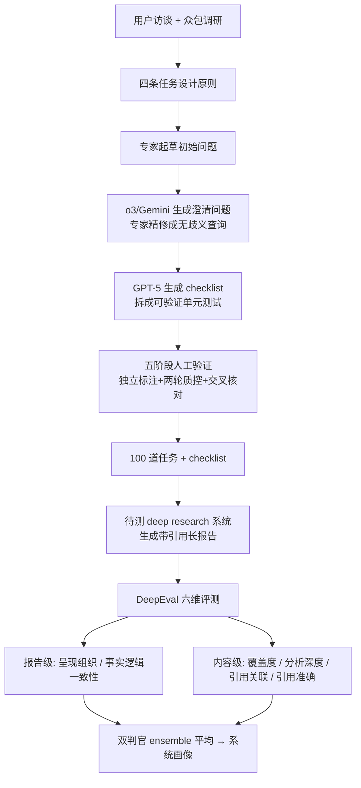

# LiveResearchBench: A Live Benchmark for User-Centric Deep Research in the Wild

**会议**: ICLR 2026  
**OpenReview**: [https://openreview.net/forum?id=ghwbZ3uhEd](https://openreview.net/forum?id=ghwbZ3uhEd)  
**代码**: [https://github.com/SalesforceAIResearch/LiveResearchBench](https://github.com/SalesforceAIResearch/LiveResearchBench)  
**领域**: LLM 评测 / Deep Research / Agentic Benchmark  
**关键词**: deep research, live benchmark, long-form report, citation grounding, LLM-as-a-judge  

## 一句话总结
LiveResearchBench 用 100 道专家精修、带 checklist 的"动态实时网络检索"任务，配上拆成六个维度、各用专属评测协议的 DeepEval 评测套件，第一次把单 agent / 多 agent 深度研究系统放在统一、不可作弊、与人类高度对齐的标尺上比较，揭示出当前系统"会搜集不会深析、引用错漏频发"的系统性短板。

## 研究背景与动机
**领域现状**：Deep research（深度研究）指系统针对开放式复杂问题，自主搜索数百个实时网页并综合成带引用、结构化的长报告，是 agentic 系统从"聊天机器人"走向"独立问题解决者"的重要前沿。OpenAI o3 Deep Research、Gemini Deep Research、Manus、Grok-4 Heavy 等单/多 agent 系统层出不穷。

**现有痛点**：进展卡在"基准与评测危机"上。已有 deep research 基准——DeepResearch Bench、Deep Research Bench、Mind2Web2、LiveDRBench、DeepScholarBench——普遍存在以下组合缺陷：(1) **领域狭窄**（如 ResearcherBench 只盯 AI 领域）；(2) **任务静态、时间封闭**，因此易被预训练语料污染、易过期；(3) **限于短答案或封闭式信息检索**（如"chess.com 2024 年关了多少 IM/GM 账号"这种搜索密集但推理负荷低的题）；(4) **问题歧义**，常省略目标读者、输出格式、覆盖范围，导致同一模型多次运行解读都不一致，破坏评测可靠性。

**核心矛盾**：长报告评测本身极难——回答太多样无法字符串匹配，实时查询没有固定 ground truth，且任务天然多维（覆盖度、推理、证据使用、呈现质量都要评）。人工评测贵且难规模化，朴素的 LLM-as-a-judge 又结果不稳。于是"我们到底在评真正高质量的研究，还是评一堆听起来合理却空洞的拼凑"成了悬而未决的问题。

**本文目标**：建立一套既能反映真实信息需求、又抗污染、又评测友好的 deep research 标尺，并用它系统性诊断当前前沿系统的能力边界。

**核心 idea**：**原则先行的基准设计** —— 先从用户调研中提炼出深度研究任务必须满足的四条原则（user-centric / dynamic / unambiguous / multi-faceted & search-intensive），再按原则反推出 100 道任务；**多协议混搭的评测套件** —— 不同质量维度配不同评测协议（checklist / pointwise / pairwise / rubric-tree），并用双判官 ensemble 逼近人类判断。

## 方法详解

### 整体框架
LiveResearchBench 由两块构成：左边是 **基准数据**（100 道任务 + checklist，经六阶段生成 + 五阶段验证），右边是 **DeepEval 评测套件**（六个维度，各配专属协议 + 双 LLM 判官 ensemble）。一道任务的评测流程是：把 `{{date}}` 替换为评测当天日期 → 喂给待测系统生成带引用长报告 → DeepEval 从六个角度逐项打分 → 汇总成可比的系统画像。

### 关键设计

**1. 四条任务设计原则：把"什么是好的 deep research 任务"先讲清楚**。论文从一项覆盖企业从业者、学者学生、日常用户的用户调研（问题就是"你会问深度研究 agent 什么问题"）出发，提炼出四条原则作为整个基准的宪法：**user-centric**（任务要贴合目标读者，给研究者的查询可以要术语和细粒度，给非专家就不能堆复杂度）、**dynamic / time-varying**（要求实时检索、`{{date}}` 占位，天然抗预训练语料污染，不像静态题会过期或泄漏）、**unambiguous**（明确 scope、audience、format，保证不同模型/标注者解读一致）、**multi-faceted & search-intensive**（要多跳检索 + 深度分析，超越简单事实检索）。这四条不是事后总结，而是反过来约束后面每一道题的生成与验收。

**2. 六阶段数据生成 + 五阶段验证：1500+ 小时人工堆出的 100 道高质量任务**。生成管线是：用户访谈/众包 → 据响应确定任务与领域分布 → 雇企业/学界领域专家起草初始问题 → 用 **两个** 顶级 deep research 模型（OpenAI o3 Deep Research 和 Gemini Deep Research）生成澄清问题（用两个而非一个是为避免单模型偏见与遗漏）→ 专家结合澄清把查询精修到 scope 清晰 → GPT-5 把每道查询拆成 checklist（例如"美国企业 AI 服务市场 2024-2025 规模"会拆出"报告是否给出 2024 和 2025 的市场规模""是否聚焦美国市场"等 9 项），checklist 本质是覆盖度维度的单元测试。验证则是五阶段：标注者按详细指南独立判定查询（appropriate / not）和 checklist 项（appropriate / not / valid-but-unnecessary / needs-modification）→ 质控专家独立判同意与否 → 第二轮抽样质控，确保整体质量与真实质量偏差 ≤5% → 第三组专家最终交叉核对、消解冲突、定稿。最终覆盖 7 大领域、10 类任务（市场分析、文献综述、政策评估、竞品分析、决策支持等）。

**3. DeepEval 的"维度—协议"匹配：不同质量维度用不同评测协议**。这是 DeepEval 的灵魂——作者明确反对"让 LLM 给个 0-10 整体分"的做法（实测即便 Gemini-2.5 Pro / GPT-5 当判官，与人类一致率也 <60%，且分数跨次波动可超 50 分；因为模型一旦先下了"整体不错"的结论，就懒得逐句挑错，导致漏判和虚高）。取而代之，六个维度各配最合适协议：❶**呈现与组织**（10 条常见错误模式 checklist，二值打分，与人一致率 98.3%）和 ❸**覆盖与全面性**（直接复用人工精修的 checklist 当单元测试，二值打分，一致率 100%）用 **checklist-based**；❷**事实与逻辑一致性**和 ❺**引用关联**用 **pointwise（加性）**——判官尽量挑出实质性错误，满分 100，每多一个问题扣分（公式上 $\text{score} = 100 - \sum_i \text{penalty}_i$）；❹**分析深度**用 **pairwise 对比**——和基线报告（Open Deep Research）两两比，从推理粒度、多层洞察、批判性评估、证据分析性使用、洞察密度五个子维各打 1-5 分，用 position-swap 双向打分平均消除位置偏置，差值 ≤1 算平局并剔出分母，一致率 92.5%；❻**引用准确性**用 **rubric-tree**——带网络访问的 agentic 判官逐条验证 (statement, URL)：URL 是否可达、可达后内容是否真支撑该 claim。

**4. Agent-Ensemble-as-a-Judge：双判官平均抵消单模型归纳偏置**。为降低依赖单一模型带来的偏置，作者先做 pilot 选判官：Gemini 2.5 Pro 与人类对齐最好，GPT-5 次之，Claude 4 Sonnet 一致性低且不稳。最终所有 LLM-as-a-judge 评测都用 Gemini 2.5 Pro + GPT-5 双独立判官，取两者评估的平均作为最终分。这一设计贯穿上面五个维度，是 DeepEval 高人类一致率的实现底座。

## 实验关键数据
评测了 **17 个** SoTA 系统，分三类：单 agent + 网络搜索（GPT-5、Gemini 2.5 Pro、Claude 4.1 Opus、Perplexity Sonar 系列等）、单 agent deep research（o3 Deep Research、o4-mini DR、Grok-4 DR、Gemini DR 等）、多 agent deep research（Manus、Grok-4 Heavy、Open Deep Research、Deerflow+）。开源系统统一用 GPT-5 当 backbone；Deerflow+ 是作者修复了频繁失败与早停、加了内联引用/引用映射/长上下文管理的增强版 Deerflow。

### 主实验（DeepEval 四维，0-100，节选）

| 系统 | 呈现&组织 | 事实&逻辑一致 | 覆盖&全面 | 引用关联 |
|------|:---:|:---:|:---:|:---:|
| GPT-5（单 agent web） | 71.6 | 68.3 | 83.4 | 67.6 |
| Gemini 2.5 Pro（单 agent web） | 51.9 | **76.5** | 73.1 | 38.5 |
| Claude 4 Sonnet（单 agent web） | 81.9 | 67.3 | 49.2 | 37.9 |
| o3 Deep Research（单 DR） | 71.3 | 64.2 | 85.0 | 25.6 |
| Grok-4 Deep Research（单 DR） | 69.1 | 57.4 | 86.3 | 49.5 |
| Manus（多 agent） | 75.0 | 63.1 | 73.3 | 45.6 |
| Grok-4 Heavy（多 agent） | 75.9 | 59.4 | **89.3** | 48.0 |
| Deerflow+（多 agent, GPT-5） | 78.8 | 69.9 | 61.6 | 77.0 |
| Open Deep Research（多 agent, GPT-5） | 81.0 | 71.3 | 65.3 | 76.9 |

系统级平均最高：Open Deep Research（73.6）> GPT-5（72.7）> Deerflow+。按家族平均：多 agent（69.5）> 单 agent web（62.8）> 单 agent DR。

### 分析深度（对 Open Deep Research 的 win rate）

| 系统 | Win Rate |
|------|:---:|
| Deerflow+ | 55.2%（胜 ODR） |
| Gemini Deep Research | 63.3%（胜 ODR） |
| GPT-5 | 28.4% |
| o3 Deep Research | 14.3% |
| Grok-4 Heavy | 15.9% |
| Sonar Reasoning / GPT-4.1 / Manus | ~0% |

仅 Deerflow+ 与 Gemini Deep Research 超过 ODR；产长报告的 o3 DR、覆盖最强的 Grok-4 Heavy 在深度上都几乎赢不了 ODR。

### 关键发现
- **Obs.❶ 报告越长不等于越好**：单 agent DR（Gemini DR、o3 DR）报告显著更长，但长度被引用格式（如 Gemini 的 grounding 跳转 URL、o3 的内联+文献区重复链接）灌水，token 数反映引用处理多于实质内容。
- **Obs.❷ 难点在引用正确性与格式，而非表面流畅**：内链与文献不匹配、URL 缺失、引用格式不一致、文献区有未引用条目、表格断裂、参考编号乱序——这些对人 trivial 的事对 agent 很难。
- **Obs.❹ 三类系统各擅一方**：单 agent web 靠单一持久记忆流在一致性上最强（Gemini 2.5 Pro 76.5）；多 agent 靠专门引用对齐在引用关联上领先（61.9 均值）；单 agent DR 引用关联最差（o3 DR 大量关键陈述无引用，Manus 还出现虚构链接）。
- **Obs.❼ 多是"深度搜索者"而非"深度研究者"**：多数系统在收集组织信息，却不会跨源综合出有论证的深层洞察。
- **Obs.❽ 连 SoTA 也远非引用零错**：用 rubric-tree 评 GPT-5/Grok-4 DR/ODR 在市场分析与广域搜索两类最密集任务上，全都产生非平凡引用错误，且"广域搜索"里错误多来自 unsupported claim（有网络访问仍幻觉），而非死链/无关链。

## 亮点与洞察
- **"原则 → 任务 → 验收"闭环**：四条原则不是装饰，而是真正反推出每道题并约束 checklist 验收，使"什么算好任务"可操作化，这是 benchmark 方法论上的硬贡献。
- **抗污染的 live 设计**：`{{date}}` 占位 + 强制实时检索，使基准天然免疫预训练泄漏，解决了静态 benchmark 必然过期/被刷的结构性缺陷。
- **"反对单一整体评分"的实证**：作者拿数据证明 LLM 给整体分会"先表态后偷懒"，从而论证维度拆分 + 专属协议的必要性，这个洞察对所有做 LLM-as-a-judge 的人都有警示价值。
- **诊断而非排名**：六维画像揭示了"一致性 / 关联 / 覆盖 / 深度在上下文限制下相互 trade-off，没有系统四项全优"，并据此指出未来方向（长程记忆+更新、无损层次压缩、显式综合/论证模块），把 benchmark 从"打分表"升级成"研究路线图"。

## 局限与展望
- **规模偏小**：100 道任务虽精修但数量有限，且 1500+ 小时人工成本极高，难以快速扩展或随领域演进高频更新。
- **评测仍依赖闭源判官**：DeepEval 的双判官是 Gemini 2.5 Pro + GPT-5，评测可复现性与成本受制于 API，且判官本身的偏置无法完全消除（只是用 ensemble 缓解）。
- **引用准确性评测需联网 agent**：rubric-tree 的 ❻维要实时访问 URL，结果会随网页可达性波动，长期可复现性存疑。
- **作者自指方向**：未来需要 importance-aware 与 preference-aware 的信息压缩（冗余时合并、全相关时按重要性分级），以及显式综合模块，才能让系统从"深度搜索"真正走向"深度研究"。

## 相关工作与启发
- **vs DeepResearch Bench (Du et al.)**：后者 100 道短开放问题但常缺目标读者/格式/scope，歧义大；本文显式补齐这些要素。
- **vs Deep Research Bench (Bosse et al.) / Mind2Web2 / LiveDRBench**：偏封闭式信息检索、静态时间封闭；本文强调动态实时与长报告。
- **vs 长答案评测（PROXYQA / LongFact / LongEval / HelloBench）**：这些多孤立评单一维度（覆盖或结构）；DeepEval 把报告级与内容级六维一起评且高度人类对齐。
- **启发**：(1) 任何 agentic 长输出评测都应"先定原则再造题"并维度化、协议化打分，警惕整体评分的虚高；(2) live/动态任务是抗污染评测的可行范式，值得推广到 coding agent、tool-use 等其他 agentic 领域；(3) "深度搜索 ≠ 深度研究"的诊断，提示下一代系统的核心竞争力在记忆架构与综合论证，而非堆检索量或报告长度。

## 评分
- **新颖性**: ⭐⭐⭐⭐ 第一个把"原则驱动 + live 抗污染 + 维度化多协议评测"系统整合的 deep research 基准，"反对单一整体评分"的实证与"深度搜索 vs 深度研究"的诊断框架有清晰增量。
- **实验充分度**: ⭐⭐⭐⭐⭐ 覆盖 17 个前沿单/多 agent 系统、六维评测、九条系统性观察 + 人类对齐研究，证据扎实全面。
- **写作质量**: ⭐⭐⭐⭐ 结构清晰、图表（任务分布/生成验证管线/长度分布/深度 win rate）信息密度高，论证层层递进；细节较多需对照附录。
- **价值**: ⭐⭐⭐⭐⭐ 为 deep research 这一热门但评测混乱的方向立了可复用、抗污染的标尺，并把短板转化为明确研究路线（记忆/压缩/综合），对学界与工业界都有直接参考价值。

<!-- RELATED:START -->

## 相关论文

- [\[ICLR 2026\] DRBench: A Realistic Benchmark for Enterprise Deep Research](drbench_a_realistic_benchmark_for_enterprise_deep_research.md)
- [\[ICLR 2026\] DeepResearch Bench: A Comprehensive Benchmark for Deep Research Agents](deepresearch_bench_a_comprehensive_benchmark_for_deep_research_agents.md)
- [\[ICLR 2026\] ResearchRubrics: A Benchmark of Prompts and Rubrics For Evaluating Deep Research Agents](researchrubrics_a_benchmark_of_prompts_and_rubrics_for_evaluating_deep_research_.md)
- [\[ICLR 2026\] Characterizing Deep Research: A Benchmark and Formal Definition](characterizing_deep_research_a_benchmark_and_formal_definition.md)
- [\[ICLR 2026\] Towards Personalized Deep Research: Benchmarks and Evaluations](towards_personalized_deep_research_benchmarks_and_evaluations.md)

<!-- RELATED:END -->
