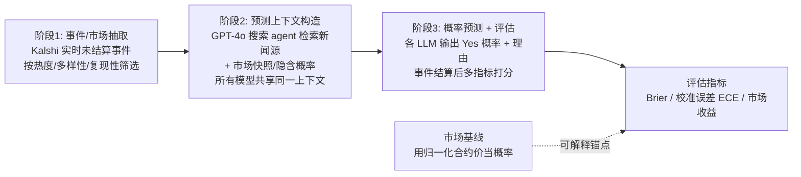

# LLM-as-a-Prophet: Understanding Predictive Intelligence with Prophet Arena

**会议**: ICLR 2026  
**OpenReview**: [https://openreview.net/forum?id=VpiHkMSPqI](https://openreview.net/forum?id=VpiHkMSPqI)  
**代码/平台**: [https://www.prophetarena.co](https://www.prophetarena.co)  
**领域**: LLM 评测 / 预测智能 / 实时基准  
**关键词**: 预测市场, 开放域预测, 校准误差, Brier 分数, 数据污染, live benchmark  

## 一句话总结
本文提出"LLM-as-a-Prophet"评测范式与 **Prophet Arena** 实时基准：用 Kalshi 预测市场上不断更新的真实未来事件来考核大模型的预测智能，既天然免疫数据污染，又能用 Brier 分数、校准误差、市场收益三类指标系统拆解出前沿模型在事件回忆、信息源理解、临近结算时信息聚合上的瓶颈。

## 研究背景与动机
- **领域现状**：随着大模型在几乎所有可得数据上训练，传统静态基准越来越受数据污染和过拟合困扰，难以可靠衡量模型"智能"。与此同时，开放域预测（不依赖领域微调、跨主题给出准确预测）在 ML 里虽有时间序列、在线学习、conformal prediction 等传统，但用大模型做开放域预测仍基本是空白。
- **现有痛点**：少数已有的预测基准（ForecastBench、FutureBench、FutureX、MIRAI 等）大多只盯单一指标（Brier 或校准或准确率），且要么不是实时事件、要么不支持概率化/多时间点/模块化评测，无法系统诊断"模型为什么预测得好或不好"。
- **核心矛盾**：预测既是"连接当下知识推断未来"的能力综合体（需要信息检索 + 复杂推理 + 数据分析 + 校准的不确定性估计），又恰好是一个结果客观可验证、且因为考的是未来事件而**天然无法被训练数据污染**的理想测评场——但前提是要有一个能持续产出真实问题、又能把预测过程拆开看的评测平台。
- **本文目标**：不只是给模型排名，而是把预测当作研究智能核心成分（推理、校准、证据聚合）的"透镜"，搞清哪些能力正在涌现、哪些仍受限，以及预测评测如何指导更可靠预测智能的发展。
- **核心 idea**：**用预测市场事件做活基准 + 把预测流程模块化拆解**——以 Kalshi 真实交易事件为题源（带激励对齐的人群共识、标准化结算），把"事件抽取→上下文构造→概率预测与评估"拆成三段流水线，并引入"市场基线"作为可解释锚点，从而既能大规模实验又能逐模块归因。

## 方法详解

### 整体框架
Prophet Arena 是一条持续运行、实时更新的评测流水线，由三个阶段串成端到端工作流：从 Kalshi 抽取未结算事件 → 为每个事件构造所有模型共享的统一预测上下文（检索到的新闻源 + 市场快照）→ 让各 LLM 输出每个市场的概率预测，待事件结算后用多指标评估。整条管线被刻意设计成"模块化 + 多时间点 + 概率化 + 含收益指标"，以支持对模型预测能力的控制变量式归因。

### 关键设计

**1. 三阶段模块化流水线：把"预测"拆成可控变量的可归因管线。** Prophet Arena 不把预测当黑箱，而是切成三段。阶段一从 Kalshi 周期性抓取未结算事件，按 Popularity（成交量/流动性/波动性）、Diversity（领域均衡）、Recurrence（重复格式）过滤，保证题目持续新鲜且都是有真实重要性、可客观核验结算的未来事件——这正是"活基准"抗污染的根基。阶段二对每个事件构造**所有模型完全相同**的统一上下文：由一个基于 GPT-4o 的搜索 agent 检索近期新闻的标题/摘要/时间戳/URL，再叠加市场快照（最新 Yes/No 合约价、成交量、由价格推出的隐含概率）。统一上下文的关键意图是**隔离掉检索能力差异**，让评测真正比的是模型的推理与校准。阶段三每个模型对事件内每个市场输出 $p_{ij}\in[0,1]$（认为该市场结算为 Yes 的信念）加一句自然语言理由，事件结算拿到真实 $o_{ij}\in\{0,1\}$ 后再多指标评分。搜索组件是 searcher-agnostic 的，可替换而不动评测协议。

**2. 三类互补指标 + 市场基线锚点：从绝对质量、可靠性、经济价值三个正交维度刻画预测。** 单一指标会误导，本文同时用三类指标。Brier 分数衡量概率预测的**绝对质量**，对事件 $E_i$ 定义为 $BS_i=\frac{1}{m_i}\sum_{j=1}^{m_i}(p_{ij}-o_{ij})^2$，即预测概率与实现指示的平方距离在各市场上取平均（纯随机猜的期望 Brier 约 0.25）。期望校准误差 ECE 衡量**可靠性**——给定模型预测概率 $\tilde p$，$\tilde p$ 与 Yes 真实发生频率的差距，低 ECE 意味预测概率更贴近条件真概率。市场收益（Average Return）衡量**相对经济价值**：在风险中性最优策略下、每个市场分配单位预算、用 LLM 预测去交易能赚多少。三者本质不同：Brier 是绝对指标（贴近真值），市场收益是相对指标（跑赢市场当前信念即合约价），校准与总收益无关但决定了赌 Yes/No 两边收益是否均衡——文中证明一个良好校准且对称的预测者两类合约的期望收益是平衡的。为提供可解释锚点，引入**市场基线**：一个把归一化合约价直接当作自身 Yes 概率的"合成预测者"，当 LLM 跑赢它就说明对聚合的人群共识有真实预测优势。

**3. 多时间点（multi-horizon）协议：把单点预测扩成全生命周期的时间动态考察。** 预测本质是时间性的——市场与信息源都随事件临近结算而变化。Prophet Arena 给每个事件按调度算法在结算前多个时间戳让模型反复预测（如"0-3h""1-2d"">4d"等 lead-time 分箱），从而能分析模型如何随市场条件与公开信息演化更新自己的预测。这一设计直接支撑了纵向分析：可以观察远期时 LLM 是否凭更广先验跑赢市场、临近结算时市场是否反超 LLM。

**4. 模块化归因实验：用流水线的可拆性做控制变量的机制分析。** 因为上下文构造被拆开，作者能系统地做"消融式"机制分析：分别给模型 None / 仅新闻源 / 仅市场数据 / 两者都给四种条件看 Brier 变化；retrieve 100 个知识截止前的过往事件用 recall prompt 测内化知识；对比模型概率与市场隐含概率看保守性；用 LLM-as-a-judge 打开推理黑箱评估过程。模块化让每个能力（内化知识、源使用、信息聚合、概率引出鲁棒性、逻辑一致性）都能被单独探针，这是单一打分基准做不到的。

## 实验关键数据

评测在 2025-10-11 前已结算的 **1,367 个事件**上固定快照进行，共测 22-23 个 LLM，正文展示 5 个代表性模型。事件类别分布反映 Kalshi 真实构成：81% 体育、5% 娱乐、5% 政治、9% 其他（另有平衡重加权验证稳健性）。

### 主实验表格（5 个代表模型，R 表示推理模型）

| 模型 | ↓Brier (95% CI) | 排名 | ↓ECE | 排名 | ↑平均收益 (95% CI) | 排名 |
|------|------|------|------|------|------|------|
| GPT-5 R | 0.184 (±0.006) | ① | 0.042 | ② | 0.943 (±0.042) | ① |
| Grok 4 R | 0.189 (±0.005) | ② | 0.043 | ③ | 0.864 (±0.052) | ④ |
| Claude Sonnet 4 R | 0.194 (±0.006) | ③ | 0.041 | ① | 0.909 (±0.101) | ② |
| Gemini 2.5 Flash R | 0.197 (±0.007) | ④ | 0.067 | ⑤ | 0.883 (±0.053) | ③ |
| Llama 4 Scout | 0.219 (±0.008) | ⑤ | 0.060 | ④ | 0.805 (±0.040) | ⑤ |
| **Market Baseline** | 0.187 (±0.006) | N/A | 0.069 | N/A | 0.899 (±0.043) | N/A |

- 前沿专有模型在三类指标上都能稳定**跑赢市场基线**；但不同指标下排名会变（如校准最好的是 Claude，Brier/收益最好的是 GPT-5），印证三指标互补。
- Brier 落在窄带 [0.17, 0.24]（随机猜 ≈0.25）；校准差异更明显，强模型 ECE≤0.05、弱模型在 [0.05, 0.2]。
- **即便最强的 GPT-5 也未达盈亏平衡**（平均收益 <1），多数模型 <0.9——相对市场赚钱仍很难。

### 机制/消融分析

| 实验 | 关键发现 |
|------|----------|
| 上下文消融（Brier） | Both 0.169 < Market-only 0.173 < Sources-only 0.191 < None 0.235；仅市场数据均值已接近 Both，但加优质源主要**降低预测方差**、稳定信号 |
| 内化知识 recall（100 过往事件） | 娱乐类回忆最可靠；天气/政治回忆低且常误回忆；GPT-5 对自称记得的经济/政治事件全对，Llama 4 Scout、Gemini 2.5 Flash 几乎全是假记忆。回忆"近似而非精确"（记得对的歌却记错日期） |
| 保守性（模型 vs 市场概率） | 模型普遍比市场更保守，尤其市场接近确定时仍犹豫；Llama 4 Scout 最明显，GPT-5/Grok 4 跟踪市场更紧 |
| 纵向多时间点 | 远期预测时若干前沿 LLM 反超市场基线；临近结算时市场吸收新闻更快、迅速反超 LLM |
| 近乎成熟的能力 | 概率引出鲁棒性、逻辑一致性（互斥/嵌套市场理解）对多数模型已基本可靠 |

### 关键发现
- LLM 已展现非平凡的预测能力（小校准误差、稳定置信、可观市场收益），但**绝对预测技巧与相对盈利仍是挑战**。
- 强模型优势主要来自极端概率区间（0-0.1 与 0.9-1.0）几乎总预测对，而这些极端预测出现频繁，从而放大了 Brier 与收益差距。
- 系统性瓶颈集中在：事件回忆不准、对数据源理解有误、临近结算时信息聚合慢于市场。
- 加优质新闻源对不同类别收益不均：政治这类可多视角解读的事件受益明显，体育/娱乐边际价值小——"信息更多不必然更好"，关键看与任务的相关性。

## 亮点与洞察
- **用预测市场做活基准是优雅的抗污染解法**：题目是未来事件，结算客观可验证，又自带人群共识（市场价）当可解释锚点，一举解决静态基准的污染与"难度无参照"两个老问题。
- **三指标正交拆解 + 市场收益**：首次系统把"绝对质量/可靠性/经济价值"分开看，并引入此前没人系统评过的市场收益指标，且用理论说明三者何时会相互背离（更好 ECE 可能更差 Brier、更差 Brier 可能更高收益）。
- **模块化流水线让"为什么预测得好"可归因**：统一上下文隔离检索差异、上下文消融分离源贡献、recall 探针分离内化知识，把笼统的"模型聪明与否"落到可观测的能力维度。
- **"近似回忆"与"系统性保守"是有画面感的诊断**：模型记得歌却记错日期、市场近乎确定时仍不敢给极端概率——这些是可指导后续模型/系统设计的具体失效模式。

## 局限与展望
- **事件分布严重偏体育（81%）**：尽管做了平衡重加权验证，主结论仍建立在 Kalshi 真实构成上，对政治/经济等长尾类别的结论样本更稀疏。
- **题源单一**：仅用 Kalshi 一个平台，且 2023 年选举市场监管约束使政治题偏向"政治相关指标"，可能引入题型偏置。
- **机制分析子集小**：第 4 节多数机制实验只用 100 个均匀采样事件（资源约束），统计强度弱于主表的 1,367 事件。
- **搜索器固定**：所有实验用单一 GPT-4o 搜索 agent，上下文质量受其检索能力上限制约（虽然框架是 searcher-agnostic 可替换）。
- **展望**：把"预测当透镜"的思路可推广到更多平台与更均衡题源；可进一步研究如何针对性提升临近结算时的快速信息聚合、以及缓解极端概率上的系统性保守。

## 相关工作与启发
- **预测基准谱系**：从早期众包多选题 ForecastQA，到纳入预测市场事件、从新闻抽事件、动态 live 基准（ForecastBench、FutureBench、FutureX、MIRAI）。Prophet Arena 的差异化在于同时满足 live + 概率化 + 多时间点 + 模块化 + 收益指标五项（见对比表）。
- **LLM 预测能力研究**：与温度泛化、预测一致性等工作呼应，但本文是据作者所知**首个诊断 LLM 通用预测智能**（而非单点提升或单指标排名）的基准。
- **校准与 proper scoring rule**：沿用 Brier 严格 proper 评分与 ECE/reliability 经典分解（Murphy 把 Brier 分解为可靠性+不确定性+分辨率），把测评工具学与大模型评测结合。
- **启发**：当静态基准趋于饱和与污染，"用客观可验证的未来事件 + 模块化归因"是一条值得复用的评测设计范式，可迁移到代理决策、风险敏感任务等更多需要校准与证据聚合的场景。

## 评分
- 新颖性: ⭐⭐⭐⭐⭐ —— "LLM-as-a-Prophet"范式 + 预测市场活基准 + 首个模块化/多指标/含市场收益的预测智能诊断框架，角度新且抓住了数据污染这一真痛点。
- 实验充分度: ⭐⭐⭐⭐ —— 22-23 个模型、1,367 事件主表 + 多维机制/纵向/保守性/消融分析详尽，但机制实验子集仅 100 事件、题源偏体育略减一星。
- 写作质量: ⭐⭐⭐⭐ —— 指标差异与设计动机讲得清楚，三指标互补与市场基线锚点解释到位，图表组织清晰。
- 价值: ⭐⭐⭐⭐⭐ —— 提供持续运行、抗污染的活基准与可归因平台，对"如何可靠评测前沿模型智能"有方法论与基础设施双重价值。

<!-- RELATED:START -->

## 相关论文

- [\[ICLR 2026\] Fewer Battles, More Gain: An Information-Efficient Framework for Arena-based LLM Evaluation](fewer_battles_more_gain_an_information-efficient_framework_for_arena-based_llm_e.md)
- [\[ICLR 2026\] Computer Agent Arena: Toward Human-Centric Evaluation and Analysis of Computer-Use Agents](computer_agent_arena_toward_human-centric_evaluation_and_analysis_of_computer-us.md)
- [\[ICLR 2026\] DAComp: Benchmarking Data Agents across the Full Data Intelligence Lifecycle](dacomp_benchmarking_data_agents_across_the_full_data_intelligence_lifecycle.md)
- [\[ICLR 2026\] ParallelBench: Understanding the Trade-offs of Parallel Decoding in Diffusion LLMs](parallelbench_understanding_the_trade-offs_of_parallel_decoding_in_diffusion_llm.md)
- [\[ICLR 2026\] VideoJudge: Bootstrapping Enables Scalable Supervision of MLLM-as-a-Judge for Video Understanding](videojudge_bootstrapping_enables_scalable_supervision_of_mllm-as-a-judge_for_vid.md)

<!-- RELATED:END -->
