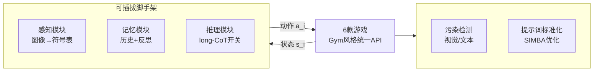

# LMGame-Bench: How Good are LLMs at Playing Games?

**会议**: ICLR 2026  
**OpenReview**: [https://openreview.net/forum?id=qeziG97WUZ](https://openreview.net/forum?id=qeziG97WUZ)  
**代码**: 待确认  
**领域**: LLM 评测 / 游戏智能体基准  
**关键词**: 游戏基准, LLM/VLM 评测, 智能体脚手架, 数据污染, 能力解耦  

## 一句话总结
LMGame-Bench 用统一 Gym 风格 API 把 6 款经典游戏做成一个**可插拔模块化**的评测基准，通过感知/记忆/推理三类脚手架（harness）按需开关来**单独探测**视觉感知、长程规划、反思等能力，并配套数据污染检测与提示词标准化，让 13 个前沿模型在不饱和的前提下被清晰区分。

## 研究背景与动机
**领域现状**：互动游戏正成为评测 LLM/VLM 的有力测试床——规则明确、结果可量化、自带由易到难的难度梯度，天然不容易被现有模型刷爆。从 TD-Gammon、AlphaGo 到 OpenAI Gym，游戏一直是研究规划与序贯决策的经典环境，近年又被用来评测 LLM 智能体。

**现有痛点**：以往的游戏基准把多种能力**纠缠**在一起——视觉感知、推理、记忆同时被考——导致一旦模型失败，根本说不清是"看不懂画面"还是"不会规划"，失败模式被掩盖。更糟的是难度两极分化：要么像 VideoGameBench 太难、模型毫无进展，要么像 LMAct 一半任务已被现有模型解掉、失去区分度。

**核心矛盾**：直接用"截图→动作"的朴素设定去评测，会发现连最强的推理模型也常常逼近随机基线（40% 的无脚手架 run 跑不过随机策略），分数太低且被游戏随机性淹没，**数值上根本分不开模型**。要既保持挑战性、又能把单项能力隔离出来做细粒度诊断，二者难以兼得。

**本文目标**：造一个**模块化**的游戏基准，既不饱和又能解耦能力，同时解决数据污染与提示词方差两个让评测不可靠的工程问题。

**核心 idea**：**「可插拔脚手架做能力探针」**——把感知、记忆、推理写成独立模块挂到智能体工作流上，固定底层游戏不变，通过逐一开关模块来隔离每种技能（如感知 vs 规划），从而在保持游戏原始难度的同时把模型的强弱项一一拆开。

## 方法详解

### 整体框架
LMGame-Bench 把每款游戏抽象为一个（部分/完全可观测的）MDP：状态空间 $S$、动作空间 $A$、奖励 $R: S \times A \times S \to \mathbb{R}$，模型 $M$ 在多轮交互中不断接收状态 $s_i$、生成动作 $a_i$ 以最大化奖励。在这个统一接口之上，框架分两层：底层是 6 款原汁原味的游戏（覆盖平台跳跃、解谜、叙事三大类），上层是一套可开关的脚手架模块（感知/记忆/推理）外加污染检测与提示词标准化两个增强组件。

### 关键设计

**1. 六款难度可缩放的游戏选型：用经典游戏天然的难度梯度做区分度。** 作者刻意复用 Super Mario Bros（平台跳跃，考空间-时序推理与目标规划）、Tetris / Sokoban / Candy Crush / 2048（网格解谜，考模式识别、空间推理、长程规划）和 Ace Attorney（法庭叙事视觉小说，考长上下文理解与因果演绎）。选型沿两个维度刻画难度：**容错度**（低=一步错即败如 Sokoban；中=可累积可恢复；高=容忍多次失误）和**状态-动作空间复杂度**。保留原始游戏设定意味着保留了人类认知设计者精心打磨的挑战性，使基准不易饱和。奖励分两类：对线性/无固定终点的游戏给**渐进奖励**（如马里奥水平距离、2048 累计合并分），对多步目标给**长程奖励**（如 Sokoban 解完所有箱子、Ace Attorney 走完一段庭审），统一映射为连续原始分。

**2. 三类可开关脚手架——基准的能力探针核心。** 这是全文最关键的设计。**感知模块**把多模态 UI 转成符号/文本：网格游戏直接从游戏后端读出坐标-对象表（如 `"Box at (2,3)"`）替代原始图像，绕开视觉瓶颈；对马里奥这类复杂画面则用 o3 生成文本描述。**记忆模块**含两个可选组件——瞬时记忆（记录最近 $N$ 个状态-动作）和反思模块（把失败教训编码成显式经验，避免重复无效动作），专门对付 Sokoban、Tetris 这类决策空间随进程爆炸的游戏。**推理模块**允许在带/不带 long-CoT 之间切换。固定游戏、逐一开关模块，就能把"感知差"和"规划差"这种本来混在一起的失败拆开诊断。实验显示打开脚手架后 86.7% 的 run 能超过随机基线（无脚手架时只有 60%），配对 t 检验确认提升显著。

**3. 数据污染检测与缓解——区分"理解"还是"背诵"。** 因为复用公开游戏素材，图像/脚本可能已进入预训练数据。作者对素材广为流传的两款做污染测试：**视觉级**在 Super Mario Bros 上让模型重排打乱的 RGB 帧，发现只有少数模型有中等正相关、且不显著影响排名，说明模型靠局部感知而非背诵帧序列；**文本级**在 Ace Attorney 上用 Sentence-BERT 测输出与公开粉丝逐字稿的相似度，发现强相关——于是施加结构化缓解（实体掩码、改写、强制推理），相关性消失，排名转而对齐"被判定的推理质量"。其余组合爆炸型游戏（Tetris/2048/Candy Crush/Sokoban）则因状态空间巨大，与训练数据重叠可忽略。

**4. 两阶段提示词标准化——压低评测方差。** 即便经验调过的提示词，分数也能波动超过 $\pm 1\sigma$。作者先固定一个规范化的智能体输入格式 $[\{J_{[\min(0,i-N):i-1]}\}, R_{i-1}, s_i] \mapsto a_i$（$J$ 是最近 $N$ 轮轨迹、$R_{i-1}$ 是记忆反思），再用 DSPy 的 SIMBA 优化器以游戏奖励为信号迭代精炼提示词。三次运行下，2048 等游戏的提示词方差降低 33.8%–63.5%，让跨模型比较更一致。

## 实验关键数据

### 主实验表格（13 个模型，原始分，部分摘录）

| 模型 | Harness | Sokoban | Mario | Tetris | 2048 | Candy Crush | Ace Attorney |
|------|---------|---------|-------|--------|------|-------------|--------------|
| o3-2025-04-16 | No | 2.0 | 1955 | 31.0 | 128.2 | 106.0 | 8.0 |
| o3-2025-04-16 | **Yes** | **8.0** | **2267** | **42.0** | 128.6 | **647.0** | 11.3 |
| o1-2024-12-17 | Yes | 2.3 | 855 | 35.0 | 128.9 | 159.0 | **16.0** |
| Gemini-2.5-pro | Yes | 4.3 | 1498 | 23.3 | 117.3 | 416.3 | 7.7 |
| Claude-3.7(think) | Yes | 2.3 | 1419 | 16.3 | 113.3 | 484.0 | 7.0 |
| GPT-4.1 | Yes | 0.0 | 2126 | 13.7 | 105.7 | 182.0 | 3.3 |
| Random | – | 0.0 | 987 | 10.2 | 100.4 | 116.5 | 0.0 |
| Human (avg) | – | 9.7 | 4333 | 353.3 | 115.5 | 283.3 | 17.3 |

**结论**：o3 与 o1 包揽全游戏 Top-2，其后是 Gemini-2.5-pro 与 Claude-3.7-Sonnet；非推理模型中 GPT-4.1 领先。基准远未饱和（人类在 Tetris 拿 353 分而最强模型仅 42 分）。

### 消融实验表格（按推理/非推理模型分组的脚手架贡献）

| 模型组 | 游戏 | ZS | +记忆 | +感知 | +两者 |
|--------|------|-----|-------|-------|-------|
| 推理模型 | Sokoban | 0.9 | 0.9 | 4.0 | 4.0 |
| 推理模型 | Tetris | 13.4 | 15.1 | **26.4** | 21.6 |
| 推理模型 | Candy Crush | 138.1 | 161.1 | 229.7 | **462.5** |
| 非推理模型 | 2048 | 57.6 | **102.5** | 71.1 | 107.0 |
| 非推理模型 | Candy Crush | 36.1 | 97.6 | 66.3 | 127.3 |

**结论**：感知模块在 Sokoban/Tetris/Candy Crush 上对推理模型增益最大（结构化空间输入解锁了图像下表达不出的规划能力）；记忆模块对非推理模型在 2048/Candy Crush 这类长程游戏上提升最猛，既抬均值又降方差。

### 关键发现
- **能力相关性**：Sokoban 强相关数学/编程基准，Tetris/2048 对齐 EnigmaEval、NYT-Connections 等模式识别任务，Candy Crush 关联编程（算法推理），Ace Attorney 关联 LiveBench-Language（叙事理解）。低秩矩阵分解把游戏拆成 4 个潜在能力（语言多任务、编程、符号解谜、物理推理）的稀疏组合，证明**游戏考的是复合能力而非孤立技能**。
- **暴露的四大缺陷**：(1) VLM 难以从图像直接抽取棋盘状态（Tetris/Sokoban 这种人类秒懂的任务都做不好）；(2) 非推理模型频繁陷入重复无效动作循环（2048 反复尝试不可能的合并），靠记忆+反思才能自纠；(3) 空间选择与时序动态错位（马里奥跳跃帧数不对）；(4) 长上下文检索失败（Ace Attorney 证据就在窗口里却调不出来）。

## 亮点与洞察
- **"脚手架开关 = 能力探针"是真正的方法论贡献**：把评测从"打一个总分"升级为"固定游戏、逐模块消融、定位单项能力"，这比堆更多游戏更有诊断价值。
- **把污染问题当一等公民处理**：视觉级 + 文本级双路检测，并用缓解前后相关性是否消失来验证有效性，方法论扎实，回应了"游戏素材在预训练里"这个最容易被质疑的点。
- **量化把游戏和已有基准连起来**：相关分析 + 低秩分解给出"哪款游戏考哪种能力"的可解释框架，让游戏分数不再是黑箱。

## 局限与展望
- **部分可观测游戏方差仍高**：Super Mario Bros 因随机动态，模型与人类都方差大，难以稳定区分。
- **计算成本高**：多轮交互产生大量高度重复的长推理链，运营开销可观，呼唤更高效的推理。
- **马里奥感知模块收益有限**：文本描述与真正需要的空间-时序信息之间仍有鸿沟，复杂画面的感知瓶颈未被脚手架根本解决。

## 相关工作与启发
- **游戏作为 AI 测试床**：从 TD-Gammon、AlphaGo 到 Gym，再到近年的 BALROG（网格导航+文本推理）、LMAct（看专家演示数量）、VideoGameBench（3D 但太难）；本文在游戏选型（自带难度梯度）、脚手架设计、污染缓解、量化评测四点上做出差异化。
- **LLM 智能体基准**：相比代码编辑（SWE-bench）、网页浏览、GUI 控制等领域专用基准，游戏提供了既可扩展又技能多样的互补设定。
- **启发**：模块化脚手架的"逐项开关做消融"思路可迁移到任何多能力纠缠的智能体评测；污染检测中"缓解前后相关性是否消失"是验证 benchmark 可信度的好范式。

## 评分
- **新颖性**: ⭐⭐⭐⭐ 模块化脚手架做能力探针 + 污染检测 + 量化能力分解的组合在游戏评测里属首创，虽然单个组件（Gym 接口、DSPy 优化）是已有工具。
- **实验充分度**: ⭐⭐⭐⭐ 13 模型 × 6 游戏 × 多脚手架配置，配人类基线、配对 t 检验、相关分析与低秩分解，覆盖面广；但部分模型/游戏因成本只跑单次，方差大。
- **写作质量**: ⭐⭐⭐⭐ 动机—痛点—设计逻辑清晰，图表与失败案例分析到位，能力解耦的叙事完整。
- **价值**: ⭐⭐⭐⭐ 给社区一个不饱和、可诊断、抗污染的游戏评测框架，且明确指出视觉抽取、反思、时空推理、长上下文四个改进方向，实用价值高。

<!-- RELATED:START -->

## 相关论文

- [\[ICLR 2026\] Evaluating Language Models' Evaluations of Games](evaluating_language_models_evaluations_of_games.md)
- [\[ICLR 2026\] DARE-bench: Evaluating Modeling and Instruction Fidelity of LLMs in Data Science](dare-bench_evaluating_modeling_and_instruction_fidelity_of_llms_in_data_science.md)
- [\[ICLR 2026\] PCB-Bench: Benchmarking LLMs for Printed Circuit Board Placement and Routing](pcb-bench_benchmarking_llms_for_printed_circuit_board_placement_and_routing.md)
- [\[ICLR 2026\] TrustJudge: Inconsistencies of LLM-as-a-Judge and How to Alleviate Them](trustjudge_inconsistencies_of_llm-as-a-judge_and_how_to_alleviate_them.md)
- [\[ICLR 2026\] DeepResearch Bench: A Comprehensive Benchmark for Deep Research Agents](deepresearch_bench_a_comprehensive_benchmark_for_deep_research_agents.md)

<!-- RELATED:END -->
