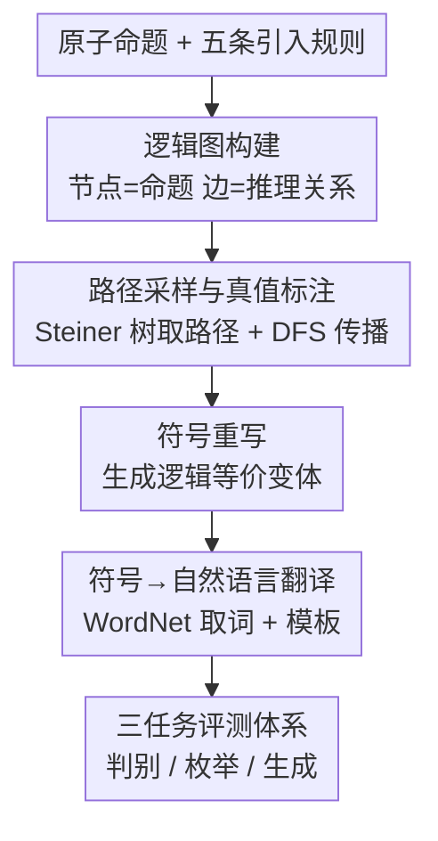

# LogiConBench: Benchmarking Logical Consistencies of LLMs

**会议**: ICLR 2026  
**OpenReview**: [https://openreview.net/forum?id=ULEHJkolxB](https://openreview.net/forum?id=ULEHJkolxB)  
**代码**: https://github.com/Bellafc/LogiConBench.git  
**领域**: LLM评测 / 逻辑推理 / Benchmark  
**关键词**: 逻辑一致性, 自动数据生成, 逻辑图, 推理路径, 枚举任务

## 一句话总结
LogiConBench 用「自动生成逻辑图 → 采样命题并沿推理路径传播真值 → 翻译成自然语言」的流水线，造出可无限扩展、深度可控、带显式推理路径的 280K 逻辑一致性评测集，并设计判别 / 枚举 / 生成三类任务，揭示出前沿 LLM 在枚举任务上 exact accuracy 最高只有 34% 的硬伤。

## 研究背景与动机
**领域现状**：逻辑一致性（logical consistency）指一组陈述在逻辑规则下不互相矛盾，是可信推理的底座——如果 P 蕴含 H、H 蕴含 Z，模型就应推出 P 蕴含 Z。现有评测一致性的基准包括 BeliefBank（基于常识知识库的实体约束）、EntailmentBank（多步蕴含树）、LFC（知识图谱转逻辑事实核查）、Set-LConVQA / Set-SNLI（把 VQA / NLI 扩成集合级一致性检查）等。

**现有痛点**：这些数据集普遍存在四个问题——规模和规则数都偏小（BeliefBank 仅 2 条规则、EntailmentBank 1840 条样本），推理深度浅且缺少显式推理路径，全部靠人工撰写或从已有数据集派生因而无法规模化，更关键的是已经「饱和」：gpt-5、grok-4-fast 等模型在它们上面准确率普遍超过 95%，失去了区分前沿模型的能力。

**核心矛盾**：一个好的一致性基准需要同时满足「规模可无限扩展 + 标签精确 + 对最强模型仍有挑战性」，而人工或派生式构造天然在规模和难度上撞天花板——你没法靠手写题目持续压住越来越强的模型。

**本文目标**：造一个能自动生成无限多逻辑规则组合、深度可控、自带推理路径、且对 SOTA 模型仍然难的一致性评测框架。

**切入角度**：作者不从预定义公理或昂贵的自然语言解释出发，而是退到**原子命题**这一推理的最细粒度，用五条基本逻辑规则把原子命题组合成可以无限生长的「逻辑图」，让结构复杂度和标签正确性都由构造过程本身保证。

**核心 idea**：把逻辑一致性数据生成转化为「在逻辑图上采样子集 + 沿最短推理路径做真值传播」的可程序化过程，从而用图的自动扩张换来无限规模、精确标签和可控深度。

## 方法详解

### 整体框架
LogiConBench 的语料构造是一条五段流水线：先用五条自然演绎引入规则从原子命题滚雪球式地生成**逻辑图**（节点是命题、边是推理关系）；从图中随机采样 $k\in\{2,3,4,5\}$ 个目标节点，用 Steiner 树抽出连接它们的最短推理子图作为推理路径；沿这条路径用 DFS 把布尔真值传播下去，枚举出所有让目标命题相容的赋值（consistent lists），其余 $2^k$ 种赋值即矛盾赋值（inconsistent lists）；再对子图里的每个节点做**符号重写**产生逻辑等价但形式不同的公式以增加多样性；最后把符号公式经 WordNet 取词 + 模板**翻译成自然语言**。生成的语料之上再架三类评测任务（判别 / 枚举 / 生成），用来测 14 个前沿模型。

### 关键设计

**1. 逻辑图构建：用五条引入规则让数据集可无限生长**

现有基准受限于人工撰写，规模和深度都封顶。作者改从原子命题出发，用自然演绎的五条引入规则——蕴含 $I_\rightarrow:(\varphi\vdash\psi)\Rightarrow(\varphi\rightarrow\psi)$、析取 $I_\vee$、合取 $I_\wedge$、否定 $I_\neg:(\varphi\vdash\bot)\Rightarrow(\neg\varphi)$、双条件 $I_\leftrightarrow$——把原子命题逐步组合成复杂公式。在图上做了明确的分工：蕴含 $\rightarrow$ 与双条件 $\leftrightarrow$ 只表达在**边**上，析取 $\vee$ 与合取 $\wedge$ 只表达在**节点**上，否定 $\neg$ 节点和边都可出现（带矛盾的边记作「×」）。例如从固定原子命题 $p$ 出发，生成 $\neg p$、合取扩张 $p\wedge q$、蕴含 $p$ 的析取扩张 $p\vee q$，得到初始结构 $p\vee q\rightarrow p\rightarrow p\wedge q$ 且 $p\times\neg p$；每个新节点都能按同样方式继续扩张，于是逻辑图可以通过迭代施加基本规则无限生长。这正是「280K 规则数、深度可达 32、可扩展」相对旧基准（规则数 2–51、深度 1–6）质变的来源。

**2. 路径采样与真值标注：用 Steiner 树取推理路径、DFS 传播得到精确一致性标签**

光有图还不够，要把「哪些赋值相容」这个标签精确地算出来，并且让题目既不太松（随便填都对）也不太散（节点离太远没有约束）。作者对每个 $k\in\{2,3,4,5\}$ 各采 10000 个样本，要求目标节点在全局图中的距离不超过 6，以保证每个样本都至少存在一个不相容赋值、保留足够的局部约束；同时让每个样本里公式的原子数均匀分布以保证复杂度多样。采到目标集 $S=\{v_1,\dots,v_k\}$ 后，通过求解 Steiner 树问题（基于排列的最短游走搜索）抽出连接所有目标的小子图，得到有序边列表 $E$。边的真值相容性由规则集给定，例如 $\rightarrow$ 允许 $\{(T,T),(F,T),(F,F)\}$、矛盾边 $\times$ 只允许 $\{(T,F),(F,T)\}$。然后在 $E$ 上做 DFS，按规则增量给节点赋布尔值，把所有规则相容赋值在目标节点上的投影收集为 consistent lists；由于 $k$ 个目标共有 $2^k$ 种赋值，余下的即 inconsistent lists。作者保证每个样本都同时含非空的相容与不相容列表，供下游评测使用。

**3. 符号重写与自然语言翻译：先做等价变体增多样性，再落到自然语言防过拟合**

如果所有题目都是同一套符号写法，模型很容易靠表层模式作弊。作者在采样子图上对每个节点施加一套消去重写规则（如等价消去、转换成合取范式 CNF / 析取范式 DNF），只要重写产生合法的等价公式就作为额外节点保留，从而在不改变逻辑标签的前提下扩出形式各异的等价表达。之后再把符号公式翻译成自然语言：对每个原子命题从 WordNet 随机取名词 / 形容词 / 动词，覆盖肯定与否定两种变体，让用词高度多样以防模型记住固定措辞；复合公式则用结构模板把逻辑连接词映射成对应的自然语言算子。这一步既保证表层语言贴近真实，又把「逻辑结构」和「语言外壳」解耦——后续实验也证明换成常识 / 反事实 / 人类风格措辞对结果影响很小，说明测的是推理而非词表记忆。

**4. 三任务评测体系：判别、枚举、生成，难度逐级拉开**

为了多角度暴露模型短板，作者在语料上设计了三类任务。**Task 1 判别任务**：给定 $k$ 个陈述和一组布尔标签，判断该赋值是否导致矛盾——只需验证单个赋值，最容易；还派生出「难样本」（相容与不相容标签仅差一个位置）和「标签补全」变体。**Task 2 枚举任务**：给定一组陈述，要求**枚举出所有**逻辑相容的布尔赋值列表——需要在 $2^k$ 标签空间里做完整搜索，杜绝了判别任务里「蒙一个」的捷径，因而最难；评测用 Format（输出可执行率）、Exact（所有相容列表全对的精确率）、F1（部分正确）三指标。**Task 3 生成任务**：给定 $n$ 组相互相容的前提，要求模型生成 $n$ 条仍逻辑相容的新陈述，核心在对所有跨组组合做穷尽一致性校验。三任务对同一套逻辑结构施加递增的认知负荷，从而把不同强度模型的能力差异拉开。

## 实验关键数据

### 主实验
在 14 个前沿模型（gpt-5、grok-4-fast、deepseek-r1-0528、gemini-2.5-pro、claude-sonnet-4、qwen3-235b、o3-mini、llama-3.1-405b、phi-4-reasoning-plus 等）上，按 zero-shot / 3-shot / 3-shot+推理路径三种设置评测，每个配置随机抽 1000 题，温度固定为 0。

| 任务 | 指标 | 最强模型表现 | 多数模型表现 |
|------|------|--------------|--------------|
| Task 1 判别 | Overall Acc | gpt-5 / grok-4-fast / deepseek-r1 / gemini-2.5-pro 稳定 85–95% | 小模型（llama-3.1-8b、gpt-4o）约 31–35% |
| Task 2 枚举 | Exact Acc | gpt-5（3-shot+路径）≈ 0.51，grok-4-fast ≈ 0.20 | **绝大多数 < 1%** |
| Task 3 生成 | Consistency | o3-mini / grok-4-fast 在 2 statements 约 0.79–0.84 | $n$ 增大快速下滑，最佳整体约 0.42 |

枚举任务是核心难点：即便最强的 gpt-5，平均 exact accuracy 也只有约 34%（论文摘要数字），多数模型几乎为 0，印证了「完整搜索标签空间」对 LLM 是真正的硬骨头。

### 难度与提示分析
| 维度 | 关键发现 |
|------|---------|
| 提示方式（Task 1）| 平均准确率 zero-shot 59.21% → 3-shot 65.70% → 3-shot+路径 67.58%，推理路径监督最有用 |
| 陈述数 $k$（Task 1）| 准确率从 $k{=}2$ 的 66.87% 跌到 $k{=}5$ 的 59.59%，规模越大越难 |
| Task 1 难样本 | 所有模型在「相容/不相容仅差一位」的难样本上显著掉点；标签补全变体上强模型（gpt-5、gemini）维持 80–86%，小模型（claude-3.5-haiku）跌破 40% 接近随机 |
| Task 2 短路径子集 | 3-shot+路径下 gpt-5 的 exact 从约 34% 升到 58%，grok-4-fast 从 12% 升到 31%；短陈述子集收益小得多 |
| 常识 / 反事实 / 人类风格 | 对大模型几乎无影响，小模型在去掉模板表层规律后明显退化——证明基准测的是真推理 |

### 关键发现
- **判别易、枚举难**是最强信号：模型能判断「这组赋值矛不矛盾」，却几乎无法枚举「所有相容赋值」，说明它们缺的是对标签空间的系统性搜索能力而非单点判断。
- **推理路径监督的价值被反复验证**：无论 Task 1 还是 Task 2，给出 ground-truth 推理路径的 few-shot 都是最有效设置，提示一致性失败很大程度上是「不会一步步推」而非知识缺失。
- **逻辑结构 vs 语言外壳解耦成功**：把陈述换成常识 / 反事实 / 人类风格措辞后强模型几乎不掉点，证明 LogiConBench 测的是逻辑推理本身；而小模型在去模板后退化，说明它们部分依赖表层规律作弊。
- **与真实下游任务相关性强**：三任务表现与 LiveCodeBench、InfiniteBench、AIME、AA-LCR、ACEBench 的 Pearson / Spearman 相关系数多在 0.6–0.79，说明逻辑一致性是真实能力的良好代理指标。

## 亮点与洞察
- **「图生长 + 路径传播」把数据生成变成可程序化的无限过程**：用 Steiner 树取最短推理路径、DFS 沿边传播真值，标签由构造保证精确，深度由图距离参数（≤6）可控——这套机制让 280K 只是「当前发布量」，框架本身能无限扩。这个思路可迁移到任何能形式化为图约束传播的评测集构造。
- **节点/边的算子分工很巧**：把 $\vee,\wedge$ 放节点、$\rightarrow,\leftrightarrow$ 放边、$\neg$ 两者皆可，让逻辑公式天然映射到图结构，既便于生长又便于沿边做真值约束。
- **判别 / 枚举的难度断崖**最有诊断价值：同一套逻辑结构，只把任务从「验证一个赋值」换成「枚举所有相容赋值」，最强模型准确率就从 90%+ 崩到 34%，干净地暴露了 LLM 缺乏系统性搜索的本质短板。
- **用符号重写 + WordNet 取词解耦逻辑与语言**，是防止模型靠表层模式刷分的可复用 trick——可迁移到任何想测「真能力 vs 记忆」的推理基准。

## 局限与展望
- 任务全部建立在合成逻辑图 + 模板/WordNet 翻译之上，虽然作者用常识/反事实/人类风格变体做了缓解，但与真实文本中夹杂世界知识、隐含前提的逻辑推理仍有距离。
- 真值标签依赖 Steiner 树最短路径 + DFS 传播的正确实现，路径抽取用的是基于排列的最短游走搜索，超大规模子图上的可扩展性和最短性保证细节需看附录，规模继续放大时计算成本值得关注。
- 枚举任务上多数模型 exact accuracy < 1%，区分度几乎全靠 gpt-5 / grok-4-fast 撑着，对中下游模型该任务区分力有限，长期看仍可能被更强模型逼近饱和。
- 改进方向：把真实领域知识（法律、医疗规则）注入逻辑图、引入带噪声/不完备前提的鲁棒一致性评测、以及探索能显式做标签空间搜索的推理范式来攻克枚举任务。

## 相关工作与启发
- **vs BeliefBank / EntailmentBank**：它们靠常识知识库或人工蕴含树，规则数 2–6、深度 1–6 且无法规模化；本文用逻辑图自动生成，规则数 280K、深度可达 32、自带推理路径且可无限扩，从根上解决饱和问题。
- **vs LFC / Set-LConVQA / Set-SNLI**：这些从已有 KG / VQA / NLI 派生，缺显式推理路径且规模有限；本文从原子命题自底向上构造，路径与标签均由构造过程精确给出。
- **启发**：当某类能力的基准被模型刷爆，与其继续手写更难的题，不如找到一个能「程序化生成 + 标签自洽 + 难度可调」的形式化骨架（这里是逻辑图），让数据难度随模型一起进化。

## 评分
- 新颖性: ⭐⭐⭐⭐⭐ 把一致性数据生成转成逻辑图上的采样+真值传播，实现无限规模、精确标签、可控深度，思路干净有力
- 实验充分度: ⭐⭐⭐⭐⭐ 14 个前沿模型 × 3 任务 × 3 提示设置 + 难度/常识/反事实/人类风格/下游相关性多维分析
- 写作质量: ⭐⭐⭐⭐ 流水线和任务定义清晰，部分指标定义需翻附录，正文表格略密
- 价值: ⭐⭐⭐⭐⭐ 在已饱和的一致性评测上重新拉开区分度，枚举任务的难度断崖给后续推理研究指明了具体短板

<!-- RELATED:START -->

## 相关论文

- [\[ICLR 2026\] Benchmarking Overton Pluralism in LLMs](benchmarking_overton_pluralism_in_llms.md)
- [\[ICLR 2026\] PCB-Bench: Benchmarking LLMs for Printed Circuit Board Placement and Routing](pcb-bench_benchmarking_llms_for_printed_circuit_board_placement_and_routing.md)
- [\[ICLR 2026\] Beyond a Million Tokens: Benchmarking and Enhancing Long-Term Memory in LLMs](beyond_a_million_tokens_benchmarking_and_enhancing_long-term_memory_in_llms.md)
- [\[ACL 2026\] Personalized Benchmarking: Evaluating LLMs by Individual Preferences](../../ACL2026/llm_evaluation/personalized_benchmarking_evaluating_llms_by_individual_preferences.md)
- [\[AAAI 2026\] Benchmarking LLMs for Political Science: A United Nations Perspective](../../AAAI2026/llm_evaluation/benchmarking_llms_for_political_science_a_united_nations_perspective.md)

<!-- RELATED:END -->
