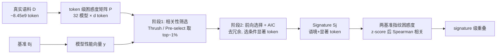

# Mapping Overlaps in Benchmarks through Perplexity in the Wild

**会议**: ICLR 2026  
**OpenReview**: [https://openreview.net/forum?id=QD0cuAmi9z](https://openreview.net/forum?id=QD0cuAmi9z)  
**代码**: 已开源（论文中提供 GitHub 链接）  
**领域**: LLM 评测 / Benchmark 元评估  
**关键词**: benchmark overlap, perplexity, benchmark signature, meta-evaluation, in-the-wild corpora  

## 一句话总结
本文提出 **benchmark signature（基准指纹）**——从大规模真实语料里筛出一组"显著 token"，用一组 LLM 在这些 token 上的困惑度去预测它们在某基准上的表现，从而刻画每个基准真正考察的能力，并据此量化 89 个基准之间被语义相似度和性能相关性都掩盖掉的真实重叠结构。

## 研究背景与动机
- **领域现状**：LLM 基准爆炸式增长（NeurIPS Datasets & Benchmarks track 投稿量从 2021 年 252 篇涨到 2024 年 1820 篇，7 倍）。每个基准都声称测某种"独特能力"，但是否真的独特、彼此重叠多少，长期说不清。
- **现有痛点**：衡量基准重叠的两条主流路子都不靠谱。**语义级**（用句向量比题面相似度）只能抓表层措辞，相似度普遍卡在 0.1–0.4 的窄区间，分辨力差；**性能级**（比模型在两基准上得分的相关性）则几乎一律很高，而且会被"基准无关因素"污染——比如 MMLU-history 和 MMLU-chemistry 的相关性反而比两个不同来源的 history 基准更高，说明它测的是"同属 MMLU 家族""同为多选题格式"这类表面属性，而非真实能力。
- **核心矛盾**：题面不同 ≠ 能力不重叠；性能相关高 ≠ 能力相关，因为做任何一道题都混入了阅读、指令遵循、理解等公共技能，把行为对齐稀释成不可分辨。我们既缺一把能穿透题面措辞、又能滤掉格式/家族噪声的尺子。
- **本文目标**：在 32 个 LLM × 89 个基准的元评估上，找出一个鲁棒、不受题面与格式混淆的重叠度量，回答"我们到底需不需要这么多基准、它们重叠多少、哪些能力反而没人测"。
- **核心 idea**：**用困惑度当桥梁**。基准考察的能力（常识、事实记忆、推理、编程）都源自真实世界文本分布；模型对一段文本困惑度低，说明训练时见过类似模式、掌握了该能力。因此**真实语料上的 token 级困惑度分布就是模型训练暴露/能力的指纹**，不同基准会映射到不同的困惑度分布——这就是 signature。**【核心假设：基准不是训练后强加的外来物，而是对真实数据中能力分布的结构化采样】**

## 方法详解

### 整体框架
方法把"基准重叠"拆成三个互补层级来看：**语义级**（题面句向量余弦相似度，做了 size-matched bootstrap 消除题量偏差）、**性能级**（模型得分向量的 Spearman 秩相关）、以及本文新提的 **signature 级**。signature 的提取是核心：对每个基准，把数十亿真实语料 token 的困惑度当协变量、模型在该基准的得分当回归目标，在 $d \gg m$（$d\approx 8.45\times10^9$ 个 token，$m=32$ 个模型）的超高维稀疏回归里筛出一小撮预测力最强的 token，它们的"语境 + 显著 token"就构成该基准的指纹。两个基准的重叠 = 用 32 个模型读各自指纹算出的归一化困惑度的 Spearman 相关。

### 关键设计

**1. 三层级重叠定义：把"重叠"拆成题面、行为、指纹三个视角**。语义级用句向量 $f$ 在 size-matched 抽样下算 $\widehat{A}_{\text{sem}}(B_a,B_b)=\frac{1}{T}\sum_t s\big(f(\text{concat}(q^{(a)}_t)),f(\text{concat}(q^{(b)}_t))\big)$，靠 $T=1000$ 次等量抽样消除"题多的基准天然更相似"的偏差；性能级用 Spearman 秩相关 $\rho(B_a,B_b)=\text{corr}(\text{rank}(y_{:,a}),\text{rank}(y_{:,b}))$。这两层是对照组，用来反衬 signature 才是真正能区分基准的那一层——前两层要么分辨力太弱、要么被格式家族污染。

**2. 超高维稀疏假设下的两阶段提取**。直接对 $P\in\mathbb{R}^{m\times d}$ 做多元回归在 $d\approx10^9\gg m=32$ 时病态不可解，于是作者押注**稀疏性假设**（绝大多数 token 困惑度对预测性能无信息，只有极小一撮带信号），并据此分两步。第一步是 $O(md)$ 线性时间的**逐 token 相关性筛选**：对每个 token 算其困惑度向量与性能向量的鲁棒相关系数，保留信号最强的约 top 1%（$d'\approx1.69\times10^7$）。其理论依据是 Sure Independence Screening（SIS, Fan & Lv 2008）——超高维下边际筛选具有"确保筛选性质"，能在高概率下扔掉噪声、留住真信号；经验依据是 Thrush 等人用文档级困惑度相关性做数据筛选已被验证有效。Figure 3 显示三个代表基准的相关系数分布都在 0 附近尖峰、两端细尾，直接为稀疏假设背书。

**3. 鲁棒相关系数：抗量纲的并发/逆序统计**。为了不被困惑度绝对数值左右，筛选用两种秩式系数。**Thrush 相关**是 Kendall's τ 的变体，对每个 token $t_j$ 计 $\gamma_j=\sum_{1\le k<l\le m}\text{sign}(y_{k,j}-y_{l,j})(\text{rank}_j(p_{k,j})-\text{rank}_j(p_{l,j}))$，数"性能更好的模型是否困惑度排名也更低"的并发对减去逆序对；**Pre-select 相关** $\eta_j=\sum_{1\le k<l\le m}\mathbf{1}\{p_{k,j}>p_{l,j}\}/Z$（$Z=\binom{m}{2}$）则数被困惑度错排的模型对比例，理想情形为 0、随机情形为 0.5。两者都只看秩、不看数值大小，天然抗"弱模型一律高困惑度"这类系统偏差。

**4. 前向选择 + AIC 去冗余精炼指纹**。一阶段筛出的候选 token 仍有冗余（多个 top token 反映同一语言现象）且只反映边际重要性，所以二阶段做**贪心前向选择回归**：每步加入能让模型拟合提升最大的那个 token，用 **AIC** 在解释力与模型规模间权衡，直到没有 token 能有意义地降低 AIC 为止。最终得到的稀疏、可解释 token 集就是 signature。计算重叠时还把每个模型的困惑度做组内 z-score 归一化，再取两指纹困惑度均值列的 Spearman 相关，避免强弱模型的系统差异污染对齐。

## 实验关键数据

### 主实验设置与三层级对比
- 规模：**32 个 LLM × 89 个基准**，真实语料取自 **RedPajama**。

| 重叠层级 | 典型取值/表现 | 分辨力 |
|---|---|---|
| 语义级 | 同类/异类都落在 0.1–0.4 窄区间 | 弱，几乎无法区分 |
| 性能级 | 几乎一律很高，同家族/同格式内 ≈0.8 | 被格式与家族严重污染 |
| **signature 级** | 同类高、异类低，结构清晰 | **最强，统计显著** |

### 评估偏差消解（消融式对照）

| 比较维度 | 性能级结果 | signature 级结果 |
|---|---|---|
| 同家族 vs 跨家族 / 同格式 vs 异格式 | 同家族/格式内重叠显著升高（≈0.8） | Mann–Whitney U 检验差异 ≈0，统计**不显著** |
| 结论 | 性能相关被"题目格式/家族"等基准无关因素污染 | signature 滤掉噪声、逼近真实重叠 |

### 关键发现
- **跨能力重叠结构**：logic、instruction-following、language、math、world-modeling（多为文化类基准）形成一个互联能力簇；math 与 logic 重叠 0.21，接近功能内平均 0.285、远超跨功能平均 0.105，符合"解数学常需逻辑"的直觉。
- **coding 最孤立**：编程基准跨功能重叠很低，只与"检测序列中缺失信息"的能力（AbsenceBench）中度相关，因为编程依赖 GitHub 这类高度专门化的预训练语料。
- **设计与执行错位**：出现 instruction-following 与 logic 的跨功能重叠竟超过功能内重叠——说明很多号称测"逻辑"的基准实际在测"指令遵循"，暴露基准设计意图与真实考察内容的偏离。
- **定性分析**：只有"知识类"基准的 signature 真正"关于"该知识领域（社科知识可达余弦相似度 0.4），而 logic 等元能力基准的 signature 与其声称功能几乎无关——暗示 LLM 的语义组织方式可能不同于人类概念结构。

## 亮点与洞察
- **困惑度即指纹**这一视角很优雅：不用在基准上直接评测，只靠真实语料困惑度就能"反推"基准考察什么，把难以形式化的"互联能力空间"概念落了地。
- **对现有 benchmark agreement 研究的当头一棒**：揭示了性能相关性会被题型/家族严重污染，"MMLU-history 更像 MMLU-chemistry 而非另一个 history 基准"这个反直觉证据极具说服力。
- 方法在**超高维稀疏回归**里把 SIS 理论保证、数据筛选的经验先例、AIC 前向选择三者拼成一条可复制流水线，且作者强调小规模、低算力也能复现，工程友好。

## 局限与展望
- **边际筛选的固有局限**：一阶段只看单 token 边际相关，可能漏掉只在多元语境下才有预测力的"抑制变量型" token，作者用 SIS 理论与经验先例辩护，但并未根除。
- **签名的可解释性仍偏弱**：很多元能力基准的 signature 与其声称功能对不上，作者只给了"基准捆绑多子技能"等三条理论解释，缺乏更系统的因果验证。
- **依赖真实语料近似**：signature 质量受"用什么语料近似 in-the-wild"影响，虽做了鲁棒性检验，但 RedPajama 是否充分代表训练分布仍是开放问题。
- **不给基准打分而给重叠图谱**，落到"该删哪些基准、该补哪些能力"的可操作建议上还需进一步工作。

## 相关工作与启发
- 与 **benchmark agreement / 性能相关性研究**（Perlitz et al., 2024）直接对话，指出其只停在性能级、被混淆因素污染。
- **困惑度做数据筛选**的脉络（Thrush et al., 2025；Shum et al., 2025）为本文的相关系数与稀疏筛选提供经验基础，本文把它从"选训练数据"迁移到"刻画基准"。
- 理论上靠 **Sure Independence Screening**（Fan & Lv, 2008）为超高维边际筛选背书。
- 启发：评测社区或许该从"造更多基准"转向"先测清楚已有基准的重叠与盲区"；困惑度指纹也可推广到诊断数据污染、构建更正交的评测集。

## 评分
- **新颖性**: ⭐⭐⭐⭐⭐ "benchmark signature = 真实语料困惑度指纹"是一个新颖且优雅的视角，把模糊的"能力重叠"形式化为可计算量，并揭示性能相关性被污染这一反直觉事实。
- **实验充分度**: ⭐⭐⭐⭐ 32 模型 × 89 基准规模可观，三层级对照 + 四维鲁棒性检验扎实；但部分结论依赖单一语料（RedPajama）和定性分析。
- **写作质量**: ⭐⭐⭐⭐ 动机层层递进、三层级框架清晰，公式与图示配合到位；少量记号（如 $d/d'$、协变量矩阵维度）略显跳跃。
- **价值**: ⭐⭐⭐⭐⭐ 对 LLM 评测有效性、基准设计与"互联能力空间"理解都有实质贡献，给"基准过剩"问题提供了可量化的诊断工具。

<!-- RELATED:START -->

## 相关论文

- [\[ICLR 2026\] Mapping Post-Training Forgetting in Language Models at Scale](mapping_post-training_forgetting_in_language_models_at_scale.md)
- [\[ICLR 2026\] LiveResearchBench: A Live Benchmark for User-Centric Deep Research in the Wild](liveresearchbench_a_live_benchmark_for_user-centric_deep_research_in_the_wild.md)
- [\[ACL 2026\] WildIFEval: Instruction Following in the Wild](../../ACL2026/llm_evaluation/wildifeval_instruction_following_in_the_wild.md)
- [\[ICLR 2026\] Towards Personalized Deep Research: Benchmarks and Evaluations](towards_personalized_deep_research_benchmarks_and_evaluations.md)
- [\[ICLR 2026\] Culture in Action: Evaluating Text-to-Image Models through Social Activities](culture_in_action_evaluating_text-to-image_models_through_social_activities.md)

<!-- RELATED:END -->
