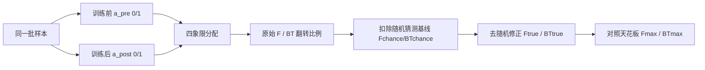

# Mapping Post-Training Forgetting in Language Models at Scale

**会议**: ICLR 2026  
**OpenReview**: [https://openreview.net/forum?id=qCIg2WGudx](https://openreview.net/forum?id=qCIg2WGudx)  
**代码**: [https://post-forget.github.io/](https://post-forget.github.io/)  
**领域**: LLM 评测, 持续学习, 后训练分析  
**关键词**: post-training, catastrophic forgetting, backward transfer, sample-wise metrics, chance adjustment  

## 一句话总结
提出一套**样本级 + 去随机猜测修正**的遗忘/反向迁移度量，对近 30 个 base→后训练模型对、约 100 个子基准做大规模实测，发现现实中的后训练遗忘远比持续学习文献预测的轻，而数学/逻辑上的反向迁移普遍存在。

## 研究背景与动机
**领域现状**：扩大后训练（instruction tuning、SFT/RL 推理训练、domain-continual pretraining）已成为现代 LLM 能力提升的主要驱动力，从业者普遍默认"每一步后训练只会累加新能力，不会侵蚀预训练塞进权重里的广博世界知识"。而持续学习（continual learning）的经典结论恰恰相反：顺序训练会带来**灾难性遗忘**。这两种直觉之间存在尖锐冲突，却从未在真实后训练流水线上被系统量化。

**现有痛点**：传统评测用"训练前后聚合准确率之差"衡量遗忘，隐含地把一个基准当成一个**样本可互换的单任务**（像分类猫图）。但预训练知识不满足这一假设——知道一位美国总统不能补偿忘掉另一位，记得 NumPy 广播规则不能抵消忘掉某个云 API 语法。聚合会把大量真实的知识丢失和获取**相互抵消**，掩盖剧烈变化。更糟的是，知识密集型基准大多是多选题（MCQ），随机猜测会制造**虚假的 1→0 / 0→1 翻转**（运气好猜对后又答错），当选项只有 4 个时这部分能占据可观比例，同时扭曲遗忘的水平和趋势估计。

**核心矛盾**：要回答"后训练到底遗忘了什么、何时遗忘、遗忘多少"，既需要把结果**还原到样本级**，又必须**显式扣除随机猜测**的贡献——而任务级聚合指标两者都做不到。

**本文目标**：建立一个实用、可大规模复现的"遗忘地图"框架，回答三问：遗忘在流水线哪一步最严重（指令微调 vs 推理训练）？哪类预训练知识最受影响（文化 vs 逻辑）？到底遗忘/重新激活了多少知识？

**核心 idea**：**[样本级转移计数]** 把每个样本按"训练前后是否答对"归入四象限，用 1→0 翻转计遗忘、0→1 翻转计反向迁移；并 **[去随机修正]** 仅凭聚合准确率和选项数 $k$ 就能解析地扣掉运气猜测贡献，无需 logits 或重复采样，从而可在近百个基准上廉价部署。

## 方法详解

### 整体框架
框架的核心是把"训练前正确性 $a^{pre}_i$"和"训练后正确性 $a^{post}_i$"两个 0/1 标签做成一张样本级转移图：每个样本落入保持(1→1)、反向迁移(0→1)、遗忘(1→0)、未习得(0→0)四象限之一。原始遗忘/反向迁移就是后两类翻转的比例，但它们混入了随机猜测制造的假翻转；于是再用一个"知道就答对、不知道就在 $k$ 个选项里均匀猜"的简单响应模型，解析地估出猜测基线并扣除，得到去随机修正后的 $F_{true}$、$BT_{true}$ 以及理论天花板 $F_{max}$、$BT_{max}$。整套度量只依赖聚合准确率与选项数，因而能跨近 30 个模型对、约 100 个子基准统一施测。

### 关键设计
**1. 样本级翻转计数：拒绝任务平均的"互相抵消"。** 对一个含 $N$ 题、每题 $k$ 个选项的评测集，遗忘和反向迁移被定义为两类样本翻转的占比：

$$F = \frac{1}{N}\sum_{i=1}^{N}\mathbb{1}\{a^{pre}_i=1 \wedge a^{post}_i=0\}, \quad BT = \frac{1}{N}\sum_{i=1}^{N}\mathbb{1}\{a^{pre}_i=0 \wedge a^{post}_i=1\}$$

关键在于必须在**同一批样本**上做训练前后对比，这样才能区分"哪些被保留、哪些被遗忘、损失集中在哪"，而不是像任务平均那样让一处的 +5% 把另一处的 −5% 抹平。这一步把遗忘从一个标量变成了一张可定位的地图。

**2. 随机猜测基线：把"运气翻转"从真知识变化里剥离。** 纯靠运气的 1→0 翻转需要"训练前蒙对 + 训练后答错"两件事同时发生。假设不会的题在 $k$ 个选项里均匀猜，则蒙对比例为 $x=\frac{1-\bar a}{k-1}$，于是按训练前后猜测独立可写出：

$$F_{chance} = \frac{1-\bar a^{pre}}{k-1}\cdot(1-\bar a^{post}), \quad BT_{chance} = (1-\bar a^{pre})\cdot\frac{1-\bar a^{post}}{k-1}$$

这解释了一个反直觉现象：两个独立的随机二分类器($k{=}2$)会"测出" $F=0.5\times0.5=0.25$ 的遗忘——纯属噪声。基线只依赖聚合准确率和 $k$，既不需要 logits 也不需要重复采样。

**3. 去随机修正与天花板：给遗忘量一个有意义的标尺。** 把基线从原始指标里减掉并在 0 处截断，得到只反映"超出运气的真实知识变化"的修正量；同时用"训练前/后真正会的比例"给出可能遗忘/迁移的上限：

$$F_{true}=\max(F-F_{chance},0), \quad F_{max}=\bar a^{pre}_{true}=\max\!\Big(\frac{k\bar a^{pre}-1}{k-1},0\Big)$$

例如 4 选 MCQ 准确率从 80% 掉到 70%，原始遗忘 10%，去随机后仅约 6%。把 $F_{true}$ 与天花板 $F_{max}$ 并列汇报，既区分了真实知识损失与运气，又给出了"还能退化多少"的语境。作者特别强调：$F_{true}$ 度量的是"先前可被激发的知识失去可及性"，**未必等于权重里的信息被真正抹除**——很多 $BT_{true}$ 变化其实反映的是更好的知识**激发**而非新知识获取。

## 实验关键数据

### 主实验（四类后训练机制的遗忘/反向迁移格局）
使用 LightEval 框架、零样本 CoT（指令模型）/少样本（base 模型仅教格式）、序列长达 32,768 token、温度 0.6 + top-p 0.95，定义遗忘"中等=15±5%、低=低于此、高=高于此"。

| 后训练机制 | 遗忘程度 | 反向迁移 | 关键观察 |
|---|---|---|---|
| Domain-continual pretraining (Coder/Math) | 低到中等，跨类一致 | 弱 | 数学专化模型遗忘明显更多；模型越大遗忘越少 |
| Instruction tuning (Qwen2.5/Llama3.1) | 低到中等，Culture/Knowledge 有峰值 | Math 上明显 | 规模越大遗忘越少、反向迁移越多 |
| 推理训练 SFT/RL（从 base） | 整体极小，Culture 高、Knowledge 中 | Math/Logic 中到高 | 大部分增益其实来自指令跟随改善 |
| 推理训练（从 instruct，低数据 s1.1/LIMO） | 极小 | 低（生成式数学除外） | 少量数据少轮训练几乎不动预训练知识 |
| 推理训练（从 instruct，高数据 OpenThinker 等） | 低到中等（窄数据如 OpenCodeReasoner 偏高） | 中等 | 无单一主导因素可解释；混合领域训练遗忘更少 |

### 模型合并能否缓解遗忘
对 EMA / LERP / SLERP 合并（两检查点线性插值 $\theta_{EMA}(\alpha)=\alpha\theta_{pre}+(1-\alpha)\theta_{post}$）测试 Qwen2.5-Coder-7B、OpenThinker-7B/3-7B：

| 合并对象 | 结果 |
|---|---|
| Qwen2.5-Coder-7B / OpenThinker3-7B | 即使少量混入 base 也会降性能，后者尤甚 |
| OpenThinker-7B | 小幅整体增益，但伴随中等遗忘 |
| 总体 | 合并**未能**可靠缓解遗忘（推测因只合两个检查点、权重漂移过大，而文献常合 8+ 个） |

### 关键发现
- **现实后训练遗忘远小于持续学习文献预测**——这是全文最核心的反差结论，说明"持续学习实验设定"与"真实后训练流水线"之间存在重要 gap。
- **规模几乎总是有利**：更大模型遗忘更少、反向迁移更多，在多数子领域成立。
- **数学/逻辑的反向迁移普遍存在**，但很大一部分是"更好的知识激发"而非新知识获取；从 base 出发的推理训练增益主要来自指令跟随能力的改善。
- **窄数据后训练（如纯代码推理）遗忘最严重**，且常因指令跟随退化（拒绝用字母作答、把答案嵌在 Python 代码里）导致抽取依赖评测方法，需 LLM-as-a-judge 补救。

## 亮点与洞察
- **把"遗忘"从标量还原成可定位的地图**：四象限 + 样本级计数让"哪类知识、在哪一步、丢了多少"第一次可被分门别类地看清，直击任务平均的抵消盲区。
- **去随机修正只需 $\bar a$ 和 $k$**：不依赖 logits、不需重复采样，是其能在近百个 MCQ 基准上铺开的工程关键，也修正了"两个随机分类器测出 0.25 遗忘"这种系统性高估。
- **概念上的重要澄清**：$F_{true}$ 度量的是知识"可及性"而非"是否被抹除"，BT 多反映激发改善——这把"遗忘"和"激发能力变化"两件常被混淆的事拆开了。
- **结论本身有政策意义**：现代后训练并不像持续学习文献吓唬的那样侵蚀世界知识，给"放心扩大后训练"提供了实测背书，同时点名窄领域训练与模型合并是真正的风险/未解点。

## 局限与展望
- **去随机修正依赖两条强假设**：不会的题均匀随机猜、训练前后猜测独立；真实模型的猜测有偏（如倾向某个选项），可能让修正失准。
- **可及性 ≠ 遗忘**：$F_{true}$ 无法区分"知识真被擦除"还是"只是没被正确激发"，尤其在指令跟随退化的窄数据模型上，观测到的遗忘高度依赖答案抽取方法。
- **高数据推理训练无单一主导因素**：初始化、数据规模、模型大小都不足以稳健解释动态，作者承认这部分结论仍是初步的，需要更精细的训练质量控制。
- **模型合并实验偏少**：只合两个检查点，与文献常用的 8+ 检查点合并不可比，"合并无效"的结论需谨慎外推。

## 相关工作与启发
- 样本级转移概念承接 Lopez-Paz & Ranzato (2017) 的 backward transfer，但把它从任务级下放到样本级并加了去随机修正。
- 与一系列 LLM 遗忘研究形成对照：Kotha et al. (2024) 认为微调是扭曲隐式任务推断而非擦除能力，Li et al. (2025) 提出"时间性遗忘"——本文的"可及性而非抹除"立场与之呼应。
- 对实践的启发：评测后训练时应同一批样本前后对照 + 去随机汇报 + 分知识类别，而非只看聚合分数；窄领域后训练要额外警惕指令跟随退化导致的"伪遗忘"。

## 评分
- **新颖性**: ⭐⭐⭐⭐ 度量本身（样本级 + 解析去随机）是对经典遗忘评测的扎实改进，组件不复杂但组合得当且实用。
- **实验充分度**: ⭐⭐⭐⭐⭐ 近 30 个模型对、约 100 个子基准、四类后训练机制 + 合并实验，覆盖面在同类分析论文中罕见，并开源逐样本日志。
- **写作质量**: ⭐⭐⭐⭐ 问题动机清晰、公式推导干净、takeaway 框醒目；图较多依赖正文描述，纯文本读者略吃力。
- **价值**: ⭐⭐⭐⭐⭐ 给"扩大后训练是否侵蚀世界知识"这一关键实践问题提供了可复现的量化答案与工具，对后训练流水线设计和持续学习研究都有直接指导意义。

<!-- RELATED:START -->

## 相关论文

- [\[ICLR 2026\] Mapping Overlaps in Benchmarks through Perplexity in the Wild](mapping_overlaps_in_benchmarks_through_perplexity_in_the_wild.md)
- [\[ACL 2026\] Enhancing Linguistic Competence of Language Models through Pre-training with Language Learning Tasks](../../ACL2026/llm_evaluation/enhancing_linguistic_competence_of_language_models_through_pre-training_with_lan.md)
- [\[ICLR 2026\] Evaluating Language Models' Evaluations of Games](evaluating_language_models_evaluations_of_games.md)
- [\[NeurIPS 2025\] ConfTuner: Training Large Language Models to Express Their Confidence Verbally](../../NeurIPS2025/llm_evaluation/conftuner_training_large_language_models_to_express_their_confidence_verbally.md)
- [\[ICLR 2026\] Truthfulness Despite Weak Supervision: Evaluating and Training LLMs Using Peer Prediction](truthfulness_despite_weak_supervision_evaluating_and_training_llms_using_peer_pr.md)

<!-- RELATED:END -->
