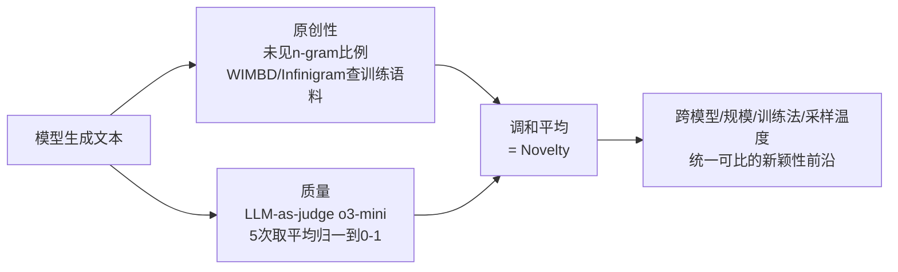

# Measuring LLM Novelty as the Frontier of Original and High-Quality Output

**会议**: ICLR 2026  
**OpenReview**: [https://openreview.net/forum?id=i7QNKZioN6](https://openreview.net/forum?id=i7QNKZioN6)  
**代码**: 待确认（作者承诺发布 5000+ 条生成数据、质量分与复制 n-gram）  
**领域**: LLM 评测 / 创造力与新颖性度量  
**关键词**: 新颖性度量, n-gram 原创性, LLM-as-judge, 创造力评测, 后训练, 推理时方法  

## 一句话总结
本文提出把 LLM 的"新颖性"定义为**原创性（训练数据中未见 n-gram 比例）与质量（任务专属打分）的调和平均**，用这把统一的尺子在三个开放数据模型家族、三个创意任务上系统刻画了什么因素能真正推动新颖性前沿。

## 研究背景与动机
**领域现状**：LLM 越来越多地用于创意写作和科学发现，于是"模型能不能生成新东西"成了关键评测维度。已有两条独立的衡量路线——一条用**记忆度/原创性**（McCoy、Merrill、Lu 等人的 Creativity Index、n-novelty），即统计生成文本里有多少高阶 n-gram 没在训练数据出现；另一条用**人类偏好**（Chatbot Arena 这类排行榜）来衡量质量。

**现有痛点**：这两把尺子各自都不够。只看原创性，模型完全可以靠输出胡言乱语、生僻怪句来刷高分——长尾生成往往既原创又毫无意义；只看人类偏好，非专家评审又分不出哪句是"逐字抄自预训练语料"的高质量句子，反而会给抄来的答案打高分。**核心矛盾**：原创性和质量是两个会互相拉扯的维度，单看任何一个都会被钻空子。

**本文目标**：造一把能横向比较不同家族、不同规模、不同训练方法模型的统一新颖性尺子，进而拆解"到底是什么在影响 LLM 的新颖性"。**核心 idea（原创性×质量的调和平均）**：真正的新颖输出必须**同时**原创且高质量，用调和平均强制惩罚任一维度的塌陷；并刻意选择**开放数据模型**（OLMo / OLMo-2 / Pythia），因为只有训练语料公开才能准确测原创性。

## 方法详解

### 整体框架
方法分三步：先把新颖性形式化为原创性与质量的调和平均（指标定义）；再把它落到三个开放式创意任务（故事续写、诗句创作、创造性工具使用）上；最后用公开语料索引算原创性、用 LLM-as-judge 算质量，从而能对任意一组模型/采样策略产出可比的新颖性分数。整个评测被用来回答两个问题：什么**改模型**的因素能推动新颖性（Section 3），以及**不改模型**的推理时方法能否凑效（Section 4）。

### 关键设计

**1. 调和平均融合原创性与质量：用"短板惩罚"逼出真新颖。** 这是全文的支点。原创性 $O$ 取生成文本中未出现于语料 $C$ 的 $n$-gram 比例，$C$ 为该模型的预训练+后训练全部语料；质量 $Q$ 由 LLM-as-judge 评 0–5 分再归一到 $[0,1]$。新颖性定义为二者的调和平均

$$\text{Novelty} = \frac{2 \cdot O \cdot Q}{O + Q}$$

选调和平均而非算术平均，是因为它对**任一维度偏低极其敏感**：原创但胡言乱语（$Q$ 低）或高质量但抄袭（$O$ 低）都会被拉到接近零，只有两者都高才能得高分。这恰好修正了 Creativity Index、n-novelty 只看 $O$、Chatbot Arena 只看 $Q$ 的单维盲点。$n$ 取 4、5、6——更小则几乎所有 n-gram 都已见（$O\to0$），更大则几乎都未见（$O\to1$），4–6 才有区分度。

**2. 用开放数据模型 + 语料索引精确测原创性。** 要算"未见 n-gram 比例"，必须能反查模型到底见过哪些文本，所以本文只选训练语料公开的 OLMo、OLMo-2、Pythia。原创性通过 WIMBD API 和 Infinigram 在 Pile、Dolma、Dolmino、Tulu SFT/RLVR mixture、Ultrafeedback 等对应语料上逐 n-gram 检索是否出现。基线则用数据集自带的人类参考文本（references），在 Dolma（对 OLMo）或 Pile（对 Pythia）上同样算原创性，再用 o3-mini 打质量分，作为"普通人类网络写作"的对照——目标是看模型能否超过人类参考。

**3. LLM-as-judge 质量评分并用人类研究校准可靠性。** 大规模人评不现实，故用 LLM-as-judge 近似。为确保可信，作者从 Upwork 招标注员，对每个任务 100 例各取 3 份人工标注，标注 rubric 与喂给评审 LLM 的 prompt 完全一致。任务内标注者一致性（Krippendorff's α）为 CoPoet 0.68、MacGyver 0.64、TinyStories 0.59，与创意任务领域同期工作相当。再用模型打分与人评均值的 Spearman 相关挑最佳配置——**o3-mini 取 5 次平均**相关性最高（三任务约 0.50–0.52），全文质量分都用此设置。

**4. 把指标当探针：分离"质量驱动"还是"原创性驱动"的新颖性增益。** 指标真正的价值在于能把每一次新颖性变化**归因**到是质量提升还是原创性提升。作者据此系统扫了三类干预——模型规模（1B→32B）、后训练（base→SFT→DPO/RLVR）、底座升级（OLMo→OLMo-2、Pythia→Pythia-DDP），以及推理时干预——采样温度、新颖 ICL 示例、Denial Prompting，逐一在 $O$-$Q$ 平面上画出移动方向，从而判断每种手段是把前沿往外推，还是只是在原创性和质量之间做零和搬运。

## 实验关键数据

### 主实验（改模型，TinyStories / CoPoet / MacGyver，∆ 相对人类基线）

| 模型 | TinyStories ∆Novelty (n=5) | CoPoet ∆Novelty (n=5) | MacGyver ∆Novelty (n=5) |
|---|---|---|---|
| OLMo-1B (base) | −0.096* | −0.108* | −0.416 |
| OLMo-7B (base) | −0.026 | −0.105 | −0.294 |
| OLMo-7B-Instruct | +0.044* | +0.231* | −0.168 |
| OLMo-2-7B (base) | +0.225* | +0.180* | −0.141 |
| OLMo-2-7B-Instruct | **+0.378*** | **+0.409*** | +0.142* |
| OLMo-2-32B-Instruct | +0.376* | +0.386* | +0.198* |

注：`*` 表示配对 t 检验 α=0.05 显著。部分 base 模型新颖性甚至**低于人类参考**（负值），但放大规模、后训练、升级底座都能把它拉到显著为正。

### 消融/趋势（新颖性增益的来源拆解）

| 干预 | 新颖性变化 | 驱动来源 |
|---|---|---|
| 规模 1B→7B | 升 | 主要靠**质量**（TinyStories +19%、MacGyver +39%）；CoPoet 靠原创性 +20% |
| 规模 7B→32B | 平台期/混合 | 平均增益饱和，但 **Top 10% 生成仍随规模提升** |
| 底座升级 (OLMo→OLMo-2) | 升 | 主要靠**原创性**（诗/故事比工具使用更明显）|
| 后训练 base→Instruct | 升 | 主要靠**质量**，原创性略升 |
| SFT 阶段 | 持平 | 质量升但原创性几乎等量下降（更多记忆）|
| RLVR/DPO 阶段 | 回升 | 偏好微调把 SFT 损失的原创性找回 |

### 关键发现
- **采样温度对新颖性呈 U 形（实为先升后降）**：温度从 0.5→2 升原创性但降质量，存在任务相关的最优温度，需调而非固定。
- **推理时方法几乎推不动前沿**：新颖 ICL 示例只对 OLMo-7B 的 CoPoet(+15.5%)、MacGyver(+5.5%) 显著有效，对 OLMo-2 反而小降；Asking-for-novelty 与 Denial Prompting 主要靠多挤一点原创性、却付出质量代价，整体只是在 $O$-$Q$ 间搬运。
- **训练侧 >> 推理侧**：scaling、alignment、升级底座能真正外推 Pareto 前沿，推理时技巧收益有限，呼吁研究更有效的 elicitation 策略。

## 亮点与洞察
- **把"新颖"从单维口号变成可操作的二维前沿**：用调和平均一举封堵"刷原创性"和"刷人类偏好"两个漏洞，且天然把长尾里的"真新颖"与"退化乱码"区分开。
- **指标即探针**：因为能归因到质量 vs 原创性，作者得以给出反直觉结论——SFT 增记忆、RL 找回原创性，与 Chu et al. (2025) "SFT 记忆、偏好微调泛化"的观察互相印证。
- **纠正前人结论**：Lu et al. (2024a) 报告 RLHF 降低 Creativity Index，本文发现对齐后原创性与质量**双升**，并指出差异源于参考语料不同（他们用海量互联网文本，本文用模型自身训练语料）。
- **可推广到黑盒模型**：厂商可在不暴露私有数据的前提下自行上报聚合新颖性分数，为社区长期追踪新颖性、评估真实泛化（AI safety 视角）提供接口。

## 局限与展望
- **依赖开放数据模型**：精确原创性必须能反查训练语料，故主体实验只覆盖 OLMo/Pythia 系；黑盒推广仍需厂商配合上报。
- **质量分靠 LLM-as-judge**：尽管做了人评校准，与人评的 Spearman 相关也仅 ~0.50，创意任务本身一致性偏低（TinyStories α=0.59），质量维度仍有噪声。
- **原创性以 n-gram 为代理**：词面未见不等于语义新颖，换皮改写可能逃过 n-gram 检测；更高阶的语义原创性度量是公开方向。
- **任务范围有限**：三个创意任务偏文学/物理推理，对科学发现等高价值场景的外推性待验证；推理时方法的失败也留下"如何有效 elicit 新颖性"的开放问题。

## 相关工作与启发
本文站在两条评测传统的交汇处：原创性侧（McCoy 2023、Merrill 2024、Elazar 2024 WIMBD、Lu 2024 Creativity Index、Liu Infinigram）与质量/偏好侧（Chiang 2024 Chatbot Arena），核心贡献是论证二者必须**联合**考量。对实践者的启发有三：(1) 评创造力别只看一个维度，调和平均式的联合指标更难被钻空子；(2) 想提升模型新颖性，优先投资训练侧（规模/对齐/底座）而非堆推理时 prompt 技巧；(3) 采样温度要按任务调，存在新颖性最优点而非越高越好。对开放科学的启发是：训练语料公开本身就是"可被严肃评测原创性"的前提。

## 评分
- **新颖性**: ⭐⭐⭐⭐ —— 把模糊的"新颖"概念形式化为原创性×质量的可比前沿，并用它揭示一批反直觉归因，概念贡献扎实。
- **实验充分度**: ⭐⭐⭐⭐ —— 三家族×多规模×三任务×多 n 值，含人评校准、温度/ICL/Denial 多种推理干预与显著性检验，覆盖面广。
- **写作质量**: ⭐⭐⭐⭐ —— 图 1 一图点题，研究问题清晰，归因叙事连贯，表格信息密度高。
- **价值**: ⭐⭐⭐⭐ —— 给创造力评测提供了可落地、可推广到黑盒、可长期追踪的统一尺子，并附 5000+ 条生成数据，社区价值明确。

<!-- RELATED:START -->

## 相关论文

- [\[ACL 2026\] Same Voice, Different Lab: On the Homogenization of Frontier LLM Personalities](../../ACL2026/llm_evaluation/same_voice_different_lab_on_the_homogenization_of_frontier_llm_personalities.md)
- [\[ICLR 2026\] NAIPv2: Debiased Pairwise Learning for Efficient Paper Quality Estimation](naipv2_debiased_pairwise_learning_for_efficient_paper_quality_estimation.md)
- [\[ICLR 2026\] Can LLMs Refuse Questions They Do Not Know? Measuring Knowledge-Aware Refusal in Factual Tasks](can_llms_refuse_questions_they_do_not_know_measuring_knowledge-aware_refusal_in_.md)
- [\[ICLR 2026\] CLASH: Evaluating Language Models on Judging High-Stakes Dilemmas from Multiple Perspectives](clash_evaluating_language_models_on_judging_high-stakes_dilemmas_from_multiple_p.md)
- [\[ICML 2026\] Estimating Tail Risks in Language Model Output Distributions](../../ICML2026/llm_evaluation/estimating_tail_risks_in_language_model_output_distributions.md)

<!-- RELATED:END -->
