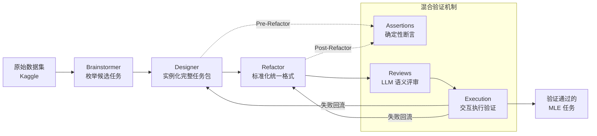

# MLE-Smith: Scaling MLE Tasks with Automated Multi-agent Pipeline

**会议**: ICLR 2026  
**OpenReview**: [https://openreview.net/forum?id=mXQslpfSU5](https://openreview.net/forum?id=mXQslpfSU5)  
**代码**: 待确认  
**领域**: LLM 评测 / Agent 基准  
**关键词**: MLE Agent, 自动任务生成, 多智能体流水线, 基准构建, 验证机制  

## 一句话总结
MLE-Smith 用「生成—验证—执行」三段式多智能体流水线，把原始数据集自动转化为竞赛风格的机器学习工程（MLE）任务，无需人工就能规模化产出 606 个高质量、可执行、可区分模型能力的基准任务。

## 研究背景与动机
- **领域现状**：LLM Agent 在自动化机器学习工程（MLE，从数据预处理到调参部署）上进展显著，MLE-Bench、DS-Bench、MLE-Dojo、MLGym 等基准/交互环境是评测和训练这类 agent 的关键基础设施。
- **现有痛点**：这些基准全是**静态、人工策展**的任务集合——竞赛由人类专家精心挑选，再花大量工程把它们改造成标准格式（切分 train/test、写评测脚本、定打分机制）。这条人工流水线极其耗时，导致任务规模和多样性都被卡死。
- **核心矛盾**：训练/评测下一代 MLE agent 需要**海量、多样、真实**的任务，但任务的「生产速度」远远跟不上「消耗速度」，形成可扩展性瓶颈。难点在于：自动生成的任务如何保证质量？一个合格的 MLE 任务必须同时满足三重交织的标准——**结构完整性**（脚本/目录/评测端到端可跑）、**语义合理性**（学习目标自洽、输入输出反映数据真实信号、不退化成 trivial 映射）、**经验可解性**（非平凡但可解，baseline 能拿到有意义且稳定提升的分数）。任一维度失败，任务就失去区分 agent 能力的价值。
- **本文目标**：构建一个全自动框架，能持续地**生成、验证、演化** MLE 任务，把人从繁琐的任务策展中解放出来。
- **核心 idea**：**生成—验证—执行（generate–verify–execute）范式**——用三个专职 agent（Brainstormer / Designer / Refactor）结构化地设计与标准化任务，配一套**混合验证机制**（确定性断言 + LLM 语义评审 + 交互式执行验证）层层把关，只有三关全过的任务才被保留。

## 方法详解

### 整体框架
MLE-Smith 以 Kaggle 等来源的原始数据集为输入，经过一条顺序架构的流水线产出竞赛风格 MLE 任务：先由多智能体生成工作流提出并实例化多个候选任务，再由贯穿全程的混合验证机制施加硬结构约束与软语义约束，最后在交互式 MLE 环境中跑通整条 pipeline 以确认经验可解性。三个阶段串联，既保留任务提案的多样性，又对结构正确性和下游可用性提供强保证。所有 agent 默认用 GPT-5 驱动，且流水线兼容任意 LLM。

### 关键设计

**1. 多智能体生成工作流：分离假设与承诺：** 三个专职 agent 顺序交接产物，并配受控反馈回路允许上游精修，每个 agent 都能用文件 I/O、shell、代码执行等领域工具，输出统一为便于自动验证的结构化格式。**Brainstormer** 在多轮数据探索后，不是给出单一设计而是**枚举一组候选任务形式**（候选数由数据集内在属性自适应决定，每个数据集最多 3 个），明确指定预测目标、评测指标、数据利用方式与设计理据——关键原则是所有标签和特征必须真实地源于数据本身（显式提供或确定性派生），而非合成或启发式构造。**Designer** 为每个候选实例化一个端到端可跑、无需人工干预的完整任务包，包含 4 大组件：确定性的 train/test 切分、输入输出 schema、带数值稳定性的任务专属评测指标，以及任务描述 / 准备脚本（`prepare.py`）/ 随机有效的样例提交 / 评测脚本 / 测试脚本等全套辅助组件。**Refactor** 把候选任务重写进一个共享一致的 schema（准备接口、输入输出规范、`metric.py` 实现、规范化目录结构 `raw/ private/ public/`、反馈报告机制），保证格式一致与跨文件连贯。这种「先分离假设生成、再承诺到具体实现」的设计在不牺牲可行性的前提下保留了设计灵活性与多样性。

**2. 混合验证机制：硬约束与软约束互补的三层契约：** 验证不是流水线末端的一次性检查，而是**贯穿整个 generate–verify–execute 的持久化多层契约**，由三种互补策略组成。**Assertions（确定性守门人）**编码强制结构约束：检查文件存在性、目录布局、函数/类/脚本的 schema 合规；Pre-Refactor 阶段确认 Designer 输出完整（如 `metric.py`、`prepare.py` 能跑通、样例提交与测试答案已生成），Post-Refactor 阶段强制全面符合统一 schema（函数签名、接口格式、执行脚本）。**Reviews（语义评审）**用 LLM agent 评估任务描述清晰度、指标适当性，以及任务是否鼓励有意义行为而非走捷径——它能抓出「能过断言但泄露 ground truth 或描述缺信息」这类形式正确却语义失效的问题。**Execution-based Validation（经验可解性）**在基于 MLE-Dojo 的交互环境里跑完整任务，用一个带动作预算的 ReAct 式 coding agent 模拟真实 MLE 交互，监控两点：真实 pipeline 验证（数据准备→训练→评测→打分能无人工跑通）与性能验证（test agent 能拿到非平凡分数且指标对方法质量敏感）。任一维度失败都被记成结构化缺陷，**回流**触发 Designer/Refactor 的定向精修或对应阶段重跑。三层各管一摊——断言保结构、评审保语义、执行保真实可解——只有三关全过才算验证通过的高质量任务。

**3. 执行验证与回流闭环：把失败模式重新喂回流水线：** 执行验证位于流水线末端，是逃过静态/语义检查的失败模式的最终安全网。它复用 MLE-Dojo 暴露的 API（检索任务元数据、校验代码、执行脚本、评估提交），对 agent 的逐步动作保持透明并提供细粒度反馈。一旦失败，缺陷被路由回验证机制形成闭环，而非简单丢弃。实测中 Designer 的角色更轻（>99% 一次通过、92% 在 15 步内完成），Refactor 更重（约 6% 需第二次重试、约 1% 需第三次，普遍用 13–22 步），因为它要读示例、分析如何把代码和文件结构标准化到规范并让所有测试通过——这与各 agent 的设计意图吻合。

## 实验关键数据

### 主实验：八个 LLM 的 Elo 评级（节选自 Combined set）
作者在 100 个 MLE 任务（50 个 MLE-Dojo 真实任务 Dojo set + 50 个 MLE-Smith 生成任务 Smith set）上评测八个前沿 LLM，用 Chatbot Arena 式 Elo 排名作主指标。

| Model | MLE-Dojo Overall | MLE-Smith Overall | Combined |
|---|---|---|---|
| Gemini-2.5-Pro | 1254.6 | **1179.7** | **1214.3** |
| Gemini-2.5-Flash | 1146.7 | 1079.3 | 1111.3 |
| o4-mini | 1068.0 | 1114.6 | 1097.6 |
| DeepSeek-Reasoner | 1064.8 | 1059.1 | 1061.8 |
| o3-mini | 1011.9 | 1003.3 | 1007.6 |
| DeepSeek-Chat | 990.7 | 1030.2 | 1011.2 |
| GPT-4o | 776.5 | 808.8 | 794.1 |
| GPT-4o-mini | 686.7 | 742.0 | 716.8 |

模型在 Smith set 上的排序与在人工设计的 Dojo set 上高度一致——Gemini-2.5-Pro 稳居榜首，两个 GPT-4o 系列稳居末位。

### Elo 一致性统计（生成任务 vs 人工任务的对齐度）

| Pair | Pearson r | R² | Spearman ρ | Kendall τb | CCC | Top-3 / Top-5 |
|---|---|---|---|---|---|---|
| Dojo–Smith | 0.982 | 0.964 | 0.952 | 0.857 | 0.958 | 1.0 / 0.8 |
| Dojo–Combined | 0.996 | 0.992 | 0.976 | 0.929 | 0.989 | 1.0 / 0.8 |
| Smith–Combined | 0.995 | 0.990 | 0.976 | 0.929 | 0.989 | 1.0 / 1.0 |

Cronbach's α = 0.993、ICC(2,1) = 0.981，表明三套 Elo 几乎可互换作为评测器。

### 规模与成本 / 多样性
- **规模**：224 个 Kaggle 数据集 → 606 个全验证任务，平均每数据集 2.71 个任务。
- **成本**：每任务平均 419.98 秒、$0.78；每数据集平均 1136.20 秒、$2.11（不含执行验证），远低于人工策展。
- **多样性**：模态覆盖 Tabular(43.5%)/NLP(21.7%)/Vision-Image(11.8%)/Audio/Time-Series 等；目标含分类(57.9%)/回归(27.4%)/排序/多标签/结构化预测/生成；指标含 F1·P·R(24.7%)/AUC(18.3%)/RMSE 系(17.3%)/自定义域指标(16.2%)。

### 关键发现
- 生成任务诱导的 Elo 分布与人工基准**统计上不可区分**（近完美线性 r≈0.98–0.996、稳定排序、可忽略的 Bland–Altman 偏差），证明 MLE-Smith 生成的任务难度真实、可区分模型能力。
- 对未结构化的原始数据（无预定义特征/标签的表格、原始服务器日志、原始科学传感器数据）也能自主组织、定义特征标签并产出有效任务，泛化性超出竞赛就绪数据集。

## 亮点与洞察
- **首个 MLE 域全自动任务生成框架**：把「benchmark 怎么造」本身自动化，从根上解掉静态人工策展的可扩展性瓶颈。
- **验证是契约而非后处理**：把硬断言、软语义评审、真实执行三层验证编织进整条流水线并带失败回流，是任务质量可信的关键——这套「结构/语义/经验可解」三维标准对任何自动出题系统都有借鉴意义。
- **用「下游模型排序一致性」证明任务质量**：不直接评任务好坏，而是看生成任务能否复现人工任务对模型的区分结构（Elo 高度相关），这是一个干净、可量化的基准等价性判据。
- **生成与承诺分离**：Brainstormer 先发散枚举候选、Designer 再收敛实例化，在保证可行性的同时拿到多样性。

## 局限与展望
- **依赖强 backbone**：全流程用 GPT-5 驱动，弱模型下的生成质量与成本权衡未充分展开。
- **来源数据偏置**：Kaggle 数据使 Tabular/NLP 占比偏高，Vision-Video 等模态稀少，生成任务分布受源数据特性约束。
- **评测仅取子集**：用 50 个生成任务做模型评测，更大规模/更长尾任务上的一致性仍待验证。
- **可解性验证用 ReAct agent 模拟**：经验可解性以特定 test agent 的表现为代理，可能与「人类专家可解」存在系统性偏差。
- **展望**：把生成任务直接用于 MLE agent 的 RL 训练（自博弈式持续出题）、扩展到 Kaggle 之外的真实工业数据。

## 相关工作与启发
- **MLE 基准/环境**：MLAgentBench(13)、MLE-Bench(75 Kaggle)、DS-Bench(74)、MLGym、MLE-Dojo(200+ 可执行任务)——均为静态人工策展，MLE-Smith 主打「持续自动生成」与之互补，并复用 MLE-Dojo 作执行环境。
- **自动任务生成**：TaskCraft（多工具 agentic 任务）、AutoCodeBench（逆向合成代码题）、SWE-Smith（从真实仓库合成 bug 任务）、Self-Challenging / SQLM（自博弈出题+自解）——MLE-Smith 是 MLE 域的首个同类工作，把这条「自动造题」思路引入机器学习工程评测。
- **启发**：「生成—验证—执行」+ 失败回流的范式，可迁移到任何需要「自动产出可执行、可验证、有区分度任务」的 agent 评测场景；用下游模型排序一致性作质量判据，是衡量合成基准是否「以假乱真」的通用方法论。

## 评分
- **新颖性**: ⭐⭐⭐⭐ — MLE 域首个全自动任务生成框架，"生成—验证—执行"三层契约+失败回流的组合设计有原创性。
- **实验充分度**: ⭐⭐⭐⭐ — 224 数据集→606 任务的规模、八模型 Elo + 多种一致性统计 + 人工评估 + 原始数据泛化，证据链完整；但模型评测仅取 50 任务子集。
- **写作质量**: ⭐⭐⭐⭐ — 三重质量标准（结构/语义/经验可解）与流水线对应清晰，图表（多样性分布、Elo、一致性表）支撑有力。
- **价值**: ⭐⭐⭐⭐ — 直接解掉 MLE 基准的可扩展性瓶颈，为下一代 MLE agent 的评测与训练提供可持续的任务来源，工程与方法论价值兼具。

<!-- RELATED:START -->

## 相关论文

- [\[ICLR 2026\] Talk, Evaluate, Diagnose: User-aware Agent Evaluation with Automated Error Analysis](talk_evaluate_diagnose_user-aware_agent_evaluation_with_automated_error_analysis.md)
- [\[ACL 2026\] Automated Creativity Evaluation of Language Models Across Open-Ended Tasks](../../ACL2026/llm_evaluation/automated_creativity_evaluation_of_language_models_across_open-ended_tasks.md)
- [\[ICLR 2026\] Foundational Automatic Evaluators: Scaling Multi-Task Generative Evaluator Training for Reasoning-Centric Domains](foundational_automatic_evaluators_scaling_multi-task_generative_evaluator_traini.md)
- [\[ICLR 2026\] Holistic Agent Leaderboard: The Missing Infrastructure for AI Agent Evaluation](holistic_agent_leaderboard_the_missing_infrastructure_for_ai_agent_evaluation.md)
- [\[ICLR 2026\] Towards Self-Evolving Agent Benchmarks: Validatable Agent Trajectory via Test-Time Exploration](towards_self-evolving_agent_benchmarks_validatable_agent_trajectory_via_test-tim.md)

<!-- RELATED:END -->
