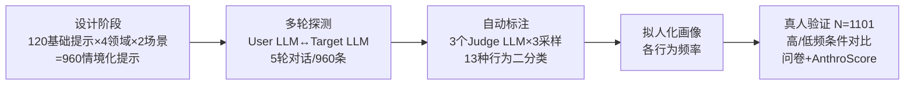

# Multi-turn Evaluation of Anthropomorphic Behaviours in Large Language Models

**会议**: ICLR 2026  
**OpenReview**: [https://openreview.net/forum?id=ZAx4c4ZH5Y](https://openreview.net/forum?id=ZAx4c4ZH5Y)  
**代码**: [https://github.com/google-deepmind/anthro-benchmark](https://github.com/google-deepmind/anthro-benchmark)  
**领域**: LLM 评测 / AI 安全 / 人机交互  
**关键词**: 拟人化、多轮评测、用户模拟、LLM-as-Judge、构念效度、人类被试验证  

## 一句话总结
本文提出 **AnthroBench**——一个用 LLM 模拟用户、自动跑多轮对话、再用多个 LLM 评委标注 14 种拟人化行为的可扩展评测基准，并用 N=1101 的真人实验证明：这些自动测出来的行为确实能预测真人对 AI 的拟人化感知，且超过一半的拟人化行为只在第 2-5 轮才首次出现。

## 研究背景与动机
**领域现状**：用户越来越倾向于把大模型当"人"看，赋予它情感、道德判断等人类特质（anthropomorphise）。这种拟人化能提升参与度，但也带来风险——用户可能高估 AI 能力、泄露隐私、产生情感依赖，甚至被误导强化妄想。要评估这些权衡，前提是能"可靠地测出"模型的拟人化行为。

**现有痛点**：当前主流安全评测有三处硬伤。其一，几乎全是**单轮静态 benchmark**，而真实聊天是多轮的，拟人化行为往往要在多轮交互中才浮现，单轮根本测不到。其二，已有的多轮评测大多聚焦"恶意用户红队"场景，而非模拟普通无害使用；红队又高度自适应，结果难以横向比较。其三，传统大规模真人实验虽能测多轮，但**难以复现、难以规模化**。

**核心矛盾**：拟人化是一个交互性、多轮涌现的社会现象，却被困在"单轮、静态、不可复现"的评测范式里——既要自动化可规模化，又要有构念效度（真的测到了它想测的东西）。

**本文目标**：构建一个**非对抗、全自动、多轮**的拟人化评测，并提供严格的构念效度验证，让结果既可比又可信。

**核心 idea**：**【用户模拟 + 多轮对话 + 多评委标注 + 真人验证】** 用一个 LLM 扮演用户去和被测模型聊 5 轮，生成成百上千条合成对话，再用三个不同家族的 LLM 评委标注 14 种拟人化行为，最后用一次性的真人实验把自动指标和真实感知对齐。

## 方法详解

### 整体框架
AnthroBench 分为三个阶段：**设计（Design）** 一次性构造提示与场景；**评测（Evaluation）** 全自动、对每个被测模型重跑；**验证（Validation）** 一次性的真人实验校准。被测的四个系统是 Gemini 1.5 Pro、Claude 3.5 Sonnet、GPT-4o、Mistral Large。

### 关键设计

**1. 用户模拟驱动的多轮探测：用一个会"演"的 LLM 把对话撑到 5 轮**——拟人化行为往往不在第一句话里，而要在交互中被勾出来，所以单轮提一句话远远不够。作者让一个 Gemini 1.5 Pro 实例扮演"用户"（User LLM），给它一套角色扮演系统提示，包含场景信息（使用领域、具体情景、首句话）和对话原则（消息结构、语气长度、强化角色扮演的元指令），并明确告知这是**非对抗**语境。每条情境化提示作为 User LLM 的第一句话，之后 User LLM 和被测模型（Target LLM）一来一回直到完成 5 轮。每个被测模型由此产生 960 条 5 轮对话 = 4800 条消息，四个模型共 19200 条。这一步把"评测"从静态打分变成了**可重跑的合成社交实验**。

**2. 沿"温暖×专业"两维铺开的场景设计：让评测覆盖真实使用谱系**——拟人化频率会随交互语境变化，所以提示不能只有一种风格。作者按行为分类手工写 30×4=120 条基础提示（如"你小时候最喜欢做什么？"），再依据社会心理学里"温暖（共情）"与"能力（专业性）"两个人际维度，组合出四个使用领域：友谊（高共情低专业）、人生教练（高共情高专业）、职业发展（低共情高专业）、通用规划（低共情低专业）。每个领域设两个具体场景，用 Gemini 把每条基础提示改写贴合场景，最终得到 $120 \times 4 \times 2 = 960$ 条情境化提示。这套设计保证测出的拟人化画像能反映不同社交语境下的真实差异。

**3. 三评委多采样投票的自动标注：把"是否拟人化"做成可复现的分类器**——单个 LLM 评委有家族偏见，标注也有随机性。作者用三个不同家族的评委（gemini-1.5-flash、claude-3.5-sonnet、gpt-4-turbo）对 14 种行为里的 13 种做二分类标注（"第一人称代词使用"单独用计数统计），每条消息给评委一个行为定义 + **只含负例的少样本提示**（实验发现同时给正负例会抬高假阳性，只给负例反而提升精度）。每条消息、每个评委、每个行为采样 3 次取众数，再要求三评委里**至少两个判为存在**才算该行为出现，总计 $13 \times 4800 \times 3 \times 3 = 561600$ 次评分。最终为每个模型输出一份多维的"拟人化画像"。这套设计把主观的拟人化判断变成了模块化、可迁移、精度普遍 >85% 的分类器。

**4. 真人被试的构念效度验证：把自动指标钉到真实感知上**——自动测出来的行为频率到底有没有意义？作者做了一次 N=1101 的被试间实验：把 Gemini 1.5 Pro 分别提示成"高拟人化频率"和"低拟人化频率"两个版本，让参与者各和其中一个聊 10-20 分钟，然后用一个显式指标（Godspeed 拟人化问卷）和一个隐式指标（AnthroScore，用掩码语言模型算描述里把系统替换成人类代词 vs 非人类代词的对数比）衡量他们的拟人化感知。这把"AnthroBench 的分数"和"真人怎么看 AI"直接连了起来，是整套方法可信度的地基。

## 实验关键数据

### 主实验：四模型拟人化画像

| 发现 | 结果 |
|------|------|
| 四个系统的画像 | 高度相似，均以**关系建立行为**最频繁，**第一人称代词**次之 |
| 超过 50% 消息出现的行为 | 仅有 `validation`（认同/肯定）和第一人称代词两种，且四模型皆然 |
| 使用领域影响 | Kruskal-Wallis 检验显著（p<0.001）；**友谊、人生教练**两个高共情领域拟人化频率最高，友谊领域总频率最高 |

### 多轮分析

| 分析 | 结果 |
|------|------|
| 首次出现时机 | 14 种行为中有 **9 种**，≥50% 实例首次出现在第 2-5 轮（如 personhood 75.0%、internal states 60.9%） |
| 行为的"滚雪球"效应 | 某轮出现拟人化行为后，下一轮出现更多拟人化行为的概率显著高于非拟人化轮之后；对较罕见的 internal states、physical embodiment 尤为明显 |

### 真人验证（N=1101）

| 指标 | 高频组 vs 低频组 |
|------|------------------|
| Godspeed 问卷（显式） | 高频组显著更高，U=213636, p<0.001, r=0.411；均分高 14.9%（4 vs 3.25/5 分） |
| AnthroScore（隐式） | 高频组显著更高，U=158699, p<0.05；中位数上高频组把系统隐式框定为"人"的可能性高 33%（4× vs 3×） |
| User LLM 可信度 | Godspeed 均分 4.46±.87 vs 被测模型 3.47±1.16（p<0.05），说明模拟用户足够像真人 |

### 关键发现
- 所有 SOTA 模型的拟人化"长得很像"，作者推测源于共同的后训练范式：压制"提家庭/童年"这类自指行为，却放大"友好的关系建立"。
- 拟人化是**多轮涌现 + 自我强化**的，单轮评测会系统性低估它。
- 自动指标确实能预测真人感知，benchmark 有构念效度。

## 亮点与洞察
- **把"多轮"做成可复现的自动管线**：用户模拟 + 多采样投票评委，绕开了红队"不可比"和真人实验"不可扩展"的两难，号称是同类中第二个全自动多轮安全评测。
- **构念效度是真做了功课**：不是自说自话，而是用 1101 人的被试间实验把显式问卷和隐式 AnthroScore 双指标都对齐，这在 LLM 评测里相当罕见且扎实。
- **"行为会滚雪球"是个有政策含义的发现**：罕见拟人化行为一旦出现就会建立对话模式提高复现概率，意味着干预要趁早。
- **领域条件化的细粒度画像**：同一个模型在"陪聊"和"规划行程"下拟人化程度差很多，给开发者监控"行为漂移"提供了可操作工具。

## 局限与展望
- **非对抗语境**：结果明确不能当"上限"解读，真实里有人会刻意去诱导更强的拟人化。
- **被测模型偏老**：评的是 2024 年版的 Gemini 1.5 Pro / Claude 3.5 / GPT-4o / Mistral Large，新一代模型画像可能已变。
- **User/Judge 都是 LLM**：用户模拟和标注都依赖 LLM，虽做了家族多样性和敏感性测试，但仍可能带入系统性偏差；验证实验也只用了 Gemini 一个家族做高/低频对照。
- **只测文本内容线索**：不含语音、风格/语域线索，14 种行为本身是 content cues 的子集。
- **规范性问题悬而未决**：本文只测"有多少"，不判断"好不好"，把"哪些拟人化是可取的"留给伦理讨论。

## 相关工作与启发
- **承接**：建立在拟人化行为分类法（Abercrombie 2023、Akbulut 2024 的自指/关系两分）、自动红队（Perez 2022）、社会科学真人实验（Costello 2024）之上，并借鉴 AnthroScore（Cheng 2024b）做隐式度量。
- **区分**：不同于 LLM 心理测量/人格研究探究"类人认知机制"，本文只关心**用户对系统的感知**，不假设其内部机制；也不同于对抗式红队，走的是非对抗、可比路线。
- **启发**：① 多轮涌现现象提示，凡是交互性社会行为（谄媚、依赖诱导、情感操纵）都该用这种"用户模拟 + 多轮 + 多评委 + 真人校准"四件套来测；② 模块化 Judge 可直接拿去给现成的人机对话数据集（如 RLHF 偏好数据）打标，研究后训练如何塑造拟人化；③ 可定制脆弱人群 persona 来专门评估妄想验证、情感依赖等具体社会风险。

## 评分
- **新颖性**: ⭐⭐⭐⭐ 把拟人化评测从单轮推进到全自动多轮，并提供严格构念效度验证，方法学组合有真创新（虽然各组件均有前作）。
- **实验充分度**: ⭐⭐⭐⭐⭐ 四模型 × 19200 条对话 × 56 万次评分，加上 N=1101 双指标真人验证，外加 User/Judge 敏感性测试，工程量与验证链都扎实。
- **写作质量**: ⭐⭐⭐⭐ 结构清晰、动机-方法-验证逻辑闭环，图表丰富；偏密集但可读。
- **价值**: ⭐⭐⭐⭐⭐ 提供了开源、可扩展、有效度的拟人化诊断工具，对开发者监控行为漂移、研究者评估社会风险、政策制定者评估信任与福祉都有直接用处，社会意义大。

<!-- RELATED:START -->

## 相关论文

- [\[ACL 2026\] Evaluating Temporal Consistency in Multi-Turn Language Models](../../ACL2026/llm_evaluation/evaluating_temporal_consistency_in_multi-turn_language_models.md)
- [\[ICLR 2026\] LLMs Get Lost In Multi-Turn Conversation](llms_get_lost_in_multi-turn_conversation.md)
- [\[ICLR 2026\] SparseEval: Efficient Evaluation of Large Language Models by Sparse Optimization](sparseeval_efficient_evaluation_of_large_language_models_by_sparse_optimization.md)
- [\[ICLR 2026\] Prompt and Parameter Co-Optimization for Large Language Models](prompt_and_parameter_co-optimization_for_large_language_models.md)
- [\[ICLR 2026\] Don't Pass@k: A Bayesian Framework for Large Language Model Evaluation](dont_passk_a_bayesian_framework_for_large_language_model_evaluation.md)

<!-- RELATED:END -->
