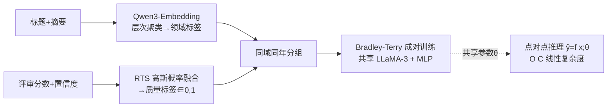

# NAIPv2: Debiased Pairwise Learning for Efficient Paper Quality Estimation

**会议**: ICLR 2026  
**OpenReview**: [https://openreview.net/forum?id=rNl8XiSHiJ](https://openreview.net/forum?id=rNl8XiSHiJ)  
**代码/主页**: [https://sway.cloud.microsoft/Pr42npP80MfPhvj8](https://sway.cloud.microsoft/Pr42npP80MfPhvj8)  
**领域**: 论文质量评估 / 自动化同行评审 / LLM 评测  
**关键词**: 论文质量估计, 成对学习, 去偏, Bradley-Terry, 评审置信度, 点对点推理  

## 一句话总结
NAIPv2 把"论文质量打分"重构成**同领域同年份内的成对排序学习**，再叠加一个把评审分数与置信度概率化融合的 RTS 信号，训练时学相对优劣、部署时退化为线性时间的点对点回归器，在 ICLR 评审预测上拿到 78.2% AUC / 0.432 Spearman 的 SOTA，同时比自回归 LLM 评审快上千倍。

## 研究背景与动机
**领域现状**：AI-for-Science 系统（自动综述、研究 agent、文献情报工具）都需要从海量"新生论文"里快速挑出高质量工作，但新论文没有引用历史、没有期刊指标可依赖，DoRA 与莱顿宣言又警告不能用声望类指标当质量代理，于是研究界转向**基于论文内容本身**的质量评估。

**现有痛点**：当前方案分两类，各有硬伤。其一是用 LLM 自回归生成评审意见或预测分数（DeepReview、CycleReviewer 等），可解释性好但**推理极慢**——在 RTX 3090 上单篇要跑约 3 分钟，且没有 PDF 时直接失效；其二是直接回归评审分数（NAIPv1），推理快（每秒十篇）但效果只比随机略好。

**核心矛盾**：直接回归评审分为什么不灵？作者归因于两点——(1) **评审置信度被系统性忽略**，现有方法把所有分数当作同等可信，可不同评审专业度差异巨大；(2) **评审分数缺乏统一稳定的标准**，不同领域、不同年份甚至不同评审人之间的打分尺度都不一致，导致绝对值回归无从校准（即"translational inconsistency"，平移不一致）。

**本文目标**：要同时拿到自回归方法的精度和回归方法的速度，做一个又快又去偏的论文质量估计框架。

**核心 idea**：**用成对学习绕开尺度不一致**——只在同领域、同年份的论文之间学"谁更好"的相对序，从根上避免跨域跨时的尺度偏差；同时**把评审当作对潜在真实质量的带噪观测**，用置信度调制噪声方差，得到一个概率化的监督信号 RTS。最妙的是：**训练用成对、推理用点对点**——共享 backbone 让成对损失隐式诱导出一个全局一致的点对点打分函数，于是部署时保持 O(C) 线性复杂度。

## 方法详解

### 整体框架
NAIPv2 分三块串起来：先用 **RTS** 把每篇论文的多个评审分数+置信度概率化融合成一个 [0,1] 的质量标签；再用聚类+年份把论文切成"同域同年"小组、构建 **NAIDv2** 数据集；最后在小组内做 **Bradley-Terry 成对训练**，但共享单分支 backbone，使得推理时直接退化成点对点打分。

### 关键设计

**1. RTS（Review Tendency Signal）：把置信度变成噪声方差的概率融合**　与其用固定权重把多个评审分数平均，RTS 把每个分数 $s_i$ 看成潜在真实质量 $x\in[0,1]$ 的一次带噪观测，而评审置信度 $c_i$ 决定这次观测有多可信。具体做成高斯似然 $p(s_i\mid x,c_i)\propto \mathcal{N}(s_i\mid x,\sigma(c_i)^2)$，其中方差由置信度线性调制 $\sigma(c_i)=0.2(1-c_i)+0.05$——置信度越高方差越小、对融合结果影响越尖锐。把 $n$ 个评审的似然相乘得到关于 $x$ 的高斯型聚合，其闭式均值是一个**按精度（置信度倒数平方）加权**的分数：$\mathbb{E}[x]=\frac{\sum_i s_i\sigma(c_i)^{-2}}{\sum_i \sigma(c_i)^{-2}}$，最后在 $[0,1]$ 上截断重归一化得到 RTS。这样高置信评审说话更有分量、低置信评审仍被纳入但不会主导，且结果天然落在 $[0,1]$ 内。

**2. 同域同年成对训练 + Bradley-Terry：从根上去偏**　这是平移不一致问题的解药。对一对论文 $(a,b)$，先用真实 RTS 构造二元偏好标签 $\text{RTS}_{ab}=\mathbb{I}[\text{RTS}_a>\text{RTS}_b]$，每篇论文各自经共享 LLaMA-3 backbone + 轻量 MLP 头得到标量分 $\hat y_a,\hat y_b$，Bradley-Terry 偏好概率 $\hat z_{ab}=\text{sigmoid}(\hat y_a-\hat y_b)$，再用标准 BCE 损失优化。关键约束是**成对只在同一聚类簇且同一发表年份内构造**——这就避免了跨领域/跨年份打分尺度差异带来的虚假比较。领域标签不靠 GPT 关键词（候选词太多导致有效对稀疏，实验里几乎退化成随机），而是用 Qwen3-Embedding-4B 编码标题摘要后做层次聚类，max distance 设为 1.0 时最优。

**3. 成对训练→点对点推理：用共享 backbone 换线性复杂度**　成对损失只约束相对差 $\hat y_a-\hat y_b$，但因为两支共享同一组参数 $\theta$，所有论文被强制投影到同一表示空间，于是单篇推理 $\hat y=f(x;\theta)$ 天然得到一个全局可比的点对点分数。对比实验里"拼接式成对"（把两篇拼成一条输入预测 0/1）虽然也能去偏，但推理要显式两两比较、复杂度 $O(C\log C)$；NAIPv2 保留点对点的 $O(C)$ 线性复杂度，却拿到更高精度，鱼与熊掌兼得。

**4. 难度感知的课程学习**　按 RTS 差距 $\Delta_{ab}=|\text{RTS}_a-\text{RTS}_b|$ 把成对分桶：差距大的对"容易"（优劣明显），差距小的对"困难"。训练早期多采样容易对让模型先抓住粗粒度的好坏区分，随训练推进逐步上采样困难对来精修细粒度差异。作者还发现训练混合里容易对占比越高、整体越稳，说明简单比较提供的监督更可靠，硬对容易引入噪声。

## 实验关键数据

数据集 NAIDv2 含 **24,276 篇 ICLR 投稿（2021–2025）**，含解析后的 PDF 内容与聚类领域标签；测试集严格限定 2025 年 1,029 篇以防信息泄漏。训练在 4×A40 上用 8-bit 量化 + LoRA，10k 对约 1 小时（消费级 3090 估计 6 小时内）。

### 主实验（ICLR 评审预测）

| 类别 | 方法 | Acc↑ | F1↑ | AUC↑ | NDCG↑ | ρ |
|------|------|------|-----|------|-------|-----|
| 下界 | Random | 0.514 | 0.410 | 0.527 | 0.525 | 0.002 |
| 上界 | Info. Leak | 0.819 | 0.757 | 0.894 | 0.995 | 0.984 |
| API | ChatGPT-pointwise | 0.644 | 0.427 | 0.654 | 0.702 | 0.315 |
| API | ChatGPT-pairwise | 0.658 | 0.448 | 0.655 | 0.686 | 0.297 |
| 自回归 | CycleReviewer (70B) | 0.678 | 0.574 | - | - | 0.267 |
| 自回归 | DeepReview (14B) | 0.689 | **0.623** | - | - | 0.405 |
| 回归 | NAIPv1 (8B) | 0.545 | 0.472 | 0.605 | 0.629 | 0.183 |
| 回归 | **NAIPv2 (ours, 8B)** | **0.706** | 0.609 | **0.782** | **0.771** | **0.432** |

NAIPv2 在 Acc/AUC/NDCG/ρ 上全面领先，F1 略逊于 14B 的 DeepReview，但推理比自回归方法快上千倍（NAIPv1 同级速度，每秒 >10 篇 vs 自回归单篇 3 分钟）。

### 消融实验
**学习范式 & 复杂度**：

| 范式 | AUC | ρ | 理论复杂度 |
|------|-----|---|-----------|
| Pointwise (RTS 标签) | 0.633 | 0.237 | O(C) |
| Pairwise Concat | 0.720 | 0.351 | O(C log C) |
| **NAIPv2** | **0.782** | **0.432** | **O(C)** |

**分组策略**（Time+Hier 最优）与 **RTS 信号优越性**：

| 分组 | AUC | ρ | | 信号 | AUC | ρ |
|------|-----|---|---|------|-----|---|
| None | 0.739 | 0.400 | | Cites | 0.583 | 0.358 |
| Pub. Time | 0.736 | 0.392 | | Mean | 0.753 | 0.385 |
| Keyword | 0.556 | 0.007 | | Weighted | 0.754 | 0.402 |
| Hier. Cluster | 0.753 | 0.401 | | Median | 0.757 | 0.398 |
| **Time+Hier** | **0.782** | **0.432** | | **RTS** | **0.782** | **0.432** |

课程学习再贡献 AUC 0.770→0.782、ρ 0.418→0.432。

### 关键发现
- **关键词分组几乎退化成随机**（ρ=0.007）：候选关键词太多→有效对稀疏，印证"分组质量决定成对学习上限"。
- **引用数当信号最差**（AUC 0.583）：实证支持"评审质量与引用影响弱相关"，论文质量≠未来影响力。
- **跨会议泛化**：在 13,223 篇未见过的 NeurIPS 投稿上，NAIPv2 预测分随决策类别（Rejected→Oral）单调递增，显示学到的是可迁移的质量信号而非 ICLR 特有模式。

## 亮点与洞察
- **"训练成对、推理点对点"是核心巧思**：用共享 backbone 把成对监督的去偏能力"灌"进点对点函数，既享受相对排序的鲁棒性，又保留线性推理复杂度——这是它能同时打过自回归（精度）和回归（速度）两派的根因。
- **RTS 把"评审置信度"从被忽略的元数据变成统计上有意义的方差**，比简单加权平均更原理化，且实验证明确实涨点。
- **去偏被落实成"同域同年内比较"这一具体且可操作的约束**，而不是抽象口号；配套的聚类领域标注也比 GPT 关键词扎实得多。

## 局限与展望
- **依赖 ICLR/NeurIPS 的开放评审数据**，而 NeurIPS 拒稿评审仅作者自愿公开导致接收占比虚高、分布严重倾斜，限制了部分任务的可信度；推广到闭门评审的会议/期刊存疑。
- **RTS 的高斯假设与线性 $\sigma(c_i)$ 映射是手工设定**，对置信度本身就不可靠或评审极少的论文，融合信号可能不稳。
- **训练对数有上限收益**：约 10k 对后性能饱和甚至略降，冗余约束帮助有限，如何更高效地选对仍待解。
- 评估的是"逼近评审共识"，而评审共识本身是否等同于"科学质量"是更深的开放问题——本文务实地选了可获得的监督，但天花板受限于评审本身的噪声。

## 相关工作与启发
- **自动化同行评审**（OpenReviewer、DeepReview、CycleReviewer）走 LLM 自回归生成路线，强在可解释、弱在速度；NAIPv2 定位互补——只产出数值质量分，供文献检索/推荐快速排序，哪怕只有标题摘要也能跑。
- **数值质量估计**（NAIP/NAIPv1、de Winter 用 ChatGPT 估引用指标）此前要么对齐引用影响（与质量弱相关）、要么忽略置信度与平移不一致；NAIPv2 同时补上 RTS 与成对去偏两块。
- **成对排序**（Bradley-Terry、Thurstone-Mosteller）在信息检索/推荐里成熟，但在评审场景采用有限；Zhang et al. 证明聚合 <2% 的对就能恢复全局序，NAIPv2 则更进一步把成对训练与点对点推理解耦换来线性复杂度。
- **启发**：任何"绝对打分尺度不稳"的评估问题（如自动评测、内容质量打分），都可借鉴"分组内成对学相对序 + 共享 backbone 退化成点对点"这套范式，兼顾鲁棒与效率。

## 评分
- **新颖性**: ⭐⭐⭐⭐ — "成对训练/点对点推理"解耦 + RTS 概率融合两个点单独看都不算全新（Bradley-Terry、置信度建模早有），但组合到论文质量估计场景并解决平移不一致问题的角度新颖且有效。
- **实验充分度**: ⭐⭐⭐⭐ — 主实验对比三大类方法，消融覆盖范式/分组/信号/课程/数据规模，还做了 NeurIPS 跨会议泛化，证据链完整；扣分在 backbone/规模对比可更系统。
- **写作质量**: ⭐⭐⭐⭐ — 动机层层递进（两个痛点→两个对策），图1框架对比清晰，方法与实验呼应紧密，易读。
- **价值**: ⭐⭐⭐⭐ — 给 AI-for-Science 的文献筛选/推荐提供了又快又去偏的实用打分器，开源 24k 规模 NAIDv2 数据集本身也有社区价值。

<!-- RELATED:START -->

## 相关论文

- [\[ICLR 2026\] THEMIS: Towards Holistic Evaluation of MLLMs for Scientific Paper Fraud Forensics](themis_towards_holistic_evaluation_of_mllms_for_scientific_paper_fraud_forensics.md)
- [\[ICML 2025\] Sample Efficient Demonstration Selection for In-Context Learning](../../ICML2025/llm_evaluation/sample_efficient_demonstration_selection_for_in-context_learning.md)
- [\[ICLR 2026\] Measuring LLM Novelty as the Frontier of Original and High-Quality Output](measuring_llm_novelty_as_the_frontier_of_original_and_high-quality_output.md)
- [\[ICLR 2026\] DISCO: Diversifying Sample Condensation for Efficient Model Evaluation](disco_diversifying_sample_condensation_for_efficient_model_evaluation.md)
- [\[ICLR 2026\] SparseEval: Efficient Evaluation of Large Language Models by Sparse Optimization](sparseeval_efficient_evaluation_of_large_language_models_by_sparse_optimization.md)

<!-- RELATED:END -->
