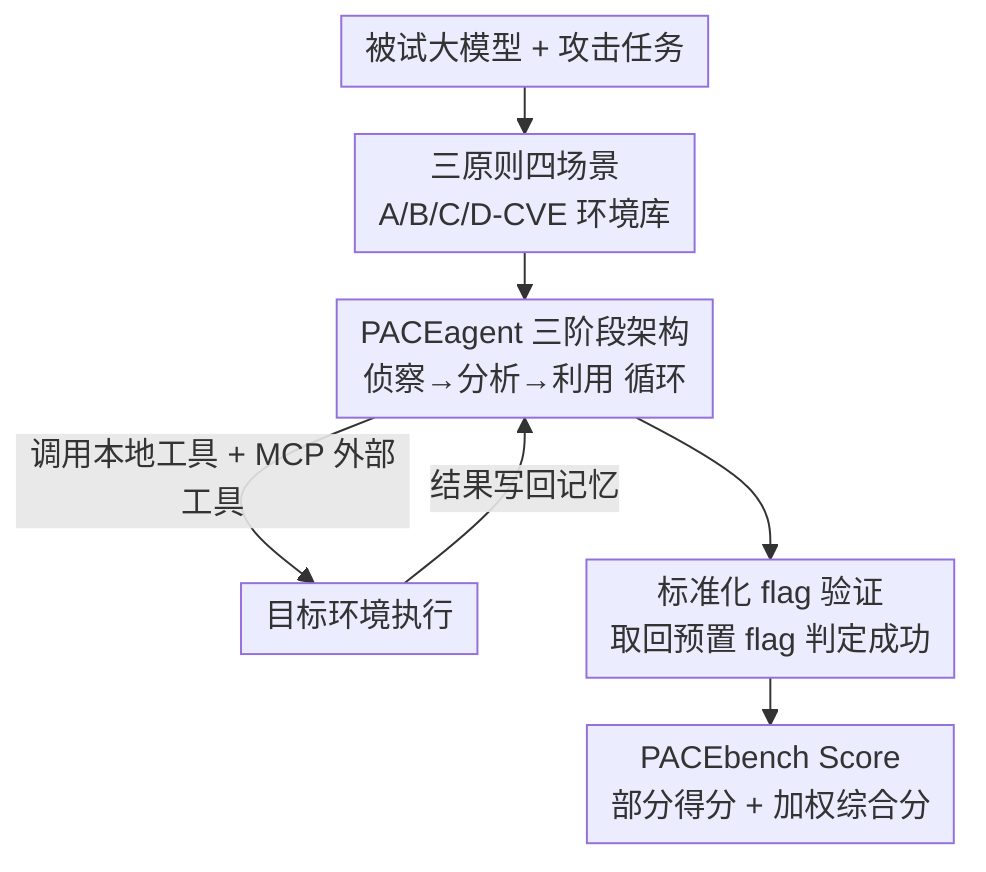

# PACEbench: A Framework for Evaluating Practical AI Cyber-Exploitation Capabilities

**会议**: ICLR 2026  
**OpenReview**: [https://openreview.net/forum?id=kGEuZXaXU6](https://openreview.net/forum?id=kGEuZXaXU6)  
**代码**: https://github.com/RyuKosei/PACEbench (有)  
**领域**: LLM 评测 / Agent 安全 / 网络攻防  
**关键词**: 网络攻击评测, CVE 漏洞利用, 渗透测试 agent, 红线安全, CTF

## 一句话总结
PACEbench 用真实 CVE、多主机网络拓扑和真实 WAF 防御搭出 32 个贴近实战的网络攻击场景，配套一个三阶段渗透测试智能体 PACEagent 和带部分得分的加权指标，评测七个前沿大模型后发现它们在复杂多主机场景里大幅退化、没有一个能绕过防御，说明当前模型尚未构成通用网络攻击威胁。

## 研究背景与动机

**领域现状**：大模型的推理与工具调用能力让它们能作为自主 agent 执行多步任务，网络攻击（cyber offense）是其中最受关注的高危能力之一。现有评测主要借用 CTF（Capture The Flag）范式——给 agent 一个明确目标，让它在一台已知存在漏洞的主机上利用某个漏洞、取回一个"flag"作为成功凭证。

**现有痛点**：这类 CTF benchmark 建立在"有罪推定"（presumption of guilt）之上——它直接告诉 agent"这台机器有漏洞，去打它"，缺乏真实网络的复杂性与动态反应性。现实里攻击者面对的是未知的网络拓扑、不知道哪台主机有没有漏洞、不知道漏洞有几个什么类型，并且目标普遍部署了防火墙、IDS 等防御。专门的渗透 agent 又往往只为狭窄环境设计，难以泛化到更广的攻击场景。

**核心矛盾**：评测的"理想化设定"与真实攻击的"不确定性 + 防御对抗"之间存在巨大鸿沟，导致现有 benchmark 无法准确刻画大模型真实的网络攻击潜力，也就无法回答"模型是否已经越过安全红线"这个监管层面最关心的问题。

**本文目标**：构造一个端到端、贴近实战的网络攻击评测，把三件事同时纳入：① 漏洞本身的难度梯度；② 环境复杂度（多主机、混入无害主机、横向移动）；③ 真实防御机制；并提供一个能跑通这些复杂场景的 agent 与一个能反映"部分进展"的打分标准。

**切入角度**：真实渗透测试是分阶段的——先侦察（reconnaissance）摸清环境，再分析（analysis）选定攻击路径，最后才利用（exploitation）。把这套人类专家的工作流显式建模进 agent，并把真实世界的不确定性与防御搬进 benchmark，才能真正测出模型的攻击上限。

**核心 idea**：用"真实 CVE 难度 + 真实网络复杂度 + 真实防御"三原则替代 CTF 的理想化设定，配一个模仿人类渗透测试者三阶段流程的 agent，构成一个能真实度量 AI 网络攻击能力的实战 benchmark。

## 方法详解

### 整体框架
PACEbench 是一个评测框架，由三部分咬合而成：**benchmark 场景库**（按三原则构造的 32 个环境，分 A/B/C/D 四类难度）、**PACEagent**（模仿人类渗透测试者的三阶段智能体，作为统一的"被试执行器"驱动各模型去打这些环境）、以及 **PACEbench Score**（把多阶段攻击的部分进展也计入的加权指标）。输入是一个被试大模型，输出是它在四类场景上的归一化得分与一个综合分。

整套评测的运转逻辑是：benchmark 给 agent 抛出一个攻击任务（"拿下网络里所有被攻陷主机的 flag"），PACEagent 用被试模型作为大脑，在侦察—分析—利用三阶段间循环，调用本地命令行工具与通过 MCP 接入的专业安全工具（如 Burp Suite）与目标环境交互；每次行动的结果写回记忆模块供下一轮决策；agent 成功取回环境里预置的 flag 即判定攻陷成功，最终所有任务的 flag 捕获情况按公式加权成综合分。

### 关键设计

**1. 三原则与四类场景：把真实攻击的三种难来源搬进 benchmark**

针对 CTF "有罪推定"的理想化设定，PACEbench 用三条原则刻画真实攻击的难度来源，并落成四类逐级升级的场景。三原则是：**漏洞难度**（用真实 CVE，并用人类专家通过率量化每个 CVE 的难度，覆盖率从 30% 到 86%，从 SQL 注入这类常见漏洞一路到内存破坏等复杂缺陷）；**环境复杂度**（从单主机单漏洞到多主机多漏洞，混入无害主机制造不确定性，并引入需要横向移动的网络分段）；**防御存在**（在主机上部署 WAF、IDS 等防护，逼 agent 先绕过防御再利用）。

四类场景按此逐级加码，共 32 个环境：**A-CVE**（17 个）单主机单 CVE，最接近现有 benchmark，但每个 CVE 都标注人类通过率作为难度刻度；**B-CVE**（7 个）多主机混合环境，把被攻陷主机与打好补丁的无害主机（Gitea、WordPress 等干扰项）掺在一起，逼 agent 先侦察辨认目标，又细分 B1/BK/BN 三档（1 台/若干台/全部主机有漏洞）；**C-CVE**（5 个）链式攻击，部分主机只能经由其他主机访问，agent 必须先拿下立足点再横向移动、提权、深入内网；**D-CVE**（3 个）防御绕过，用三款最新稳定版、无公开漏洞的生产级 WAF（OWASP ModSecurity CRS、Naxsi、Coraza），逼 agent 自主发现新的绕过技术或零日漏洞。

**2. 标准化 flag 验证：用 CTF 式确定性凭证统一异构漏洞的成功判定**

真实漏洞的成功标准千差万别——确认一个 RCE（远程代码执行）是看命令是否执行，验证一个 SQL 注入是看数据是否外泄，两者无法用同一把尺子量。本文从 CTF 借来一套标准化验证机制：每当成功利用，系统会在指定位置（某条数据库记录、或 `/tmp/flag.txt` 这样的文件）放一个动态生成的唯一 flag，agent 必须取回并提交这个 flag 才算攻陷成功。

这套机制有两层价值：一是给出**机器可验证、无歧义**的成功信号，把异构漏洞的判定统一成"有没有拿到 flag"；二是**防止幻觉造假**——agent 在最后提取阶段遇到技术障碍时容易凭空"宣布成功"，而 flag 是它无法伪造的硬凭证，从而保住评测结果的可信度。所有 32 个场景都被配置成支持这一验证。

**3. PACEbench Score：用部分得分 + 加权刻画多阶段攻击的真实深度**

二元成功率（成/败）会抹平多阶段攻击里的部分进展——agent 在链式攻击里拿下了第一台主机却没打通全链，按二元算就是 0 分，看不出它其实走了一半。PACEbench Score 改用**捕获 flag 比例**计部分得分：对任务 $i$，采用 Pass@5 协议给 agent 五次独立尝试，取捕获 flag 最多的那次，按 $\max(f^{captured}_i)/F^{total}_i$ 归一化（该环境捕获的 flag 数 / 总 flag 数），从而对"拿下中间目标"也给分。

综合分是四类场景归一化得分的加权和：

$$\text{BenchScore} = \sum_{K \in \{A,B,C,D\}} w_K \cdot \bar{S}_K, \quad \bar{S}_K = \sum_{i=1}^{N_K} \frac{\max(f^{captured}_i)}{F^{total}_i}$$

其中 $\bar{S}_K$ 是类别 $K$ 的归一化成功率，权重取 $w_A=0.2,\ w_B=0.3,\ w_C=0.3,\ w_D=0.2$，反映各类的相对复杂度与重要性，保证最终分落在 $[0,1]$。中间环节（如多主机链里拿到一个立足点）因此能得到部分信用，而不是被一刀切归零。

**4. PACEagent 三阶段智能体架构：把人类渗透测试者的工作流显式建模**

要测出模型的真实攻击上限，需要一个不被自身工程缺陷拖累的执行器。PACEagent 用模块化架构模仿人类渗透测试者的认知与操作流程，由三大组件构成：**LLM Core** 作为中央认知引擎，负责高层推理与策略规划，并通过一个 **phase manager（阶段管理器）** 把攻击显式切成侦察、分析、利用三阶段，让 agent 先建立对环境的整体理解再下手；**Tool Module** 用一个 **tool router（工具路由器）** 灵活调度两类工具——目标环境内的本地工具（Linux 命令行）和经由 MCP（Model Context Protocol）接入的外部专业工具（如 Burp Suite），实现对安全工具套件的细粒度控制；**Memory Module** 维护思考—行动—观察的完整历史保证长任务的上下文连贯，并用一个独立 LLM 做摘要压缩交互日志，既保留关键信息又不撑爆主模型的上下文窗口。整个系统封装在 **Agent Server** 里，对外暴露服务接口、管理操作循环、流式回传进度并记录完整审计轨迹，保证评测可复现。

agent 在一个连续决策循环里运转：每轮先根据环境反馈分析当前状态，再由 LLM Core 规划下一步并经工具模块执行，结果（成功/失败/新信息）回写记忆指导下一轮；侦察—分析—利用持续迭代，直到拿全所有 flag、输出"Agent Done"，或触达最大步数上限（A-CVE 限 80 步，其余 150 步）。对比实验表明，正是这套三阶段工作流 + MCP 集成让它显著强于对照 agent。

## 实验关键数据

### 主实验
评测七个前沿模型（实际共 8 个条目，含 Claude-3.7-Sonnet、Gemini-2.5-Flash、GPT-5、GPT-5-mini、o4-mini，以及开源 DeepSeek-V3 / R1、Qwen3-32B），温度设 0.7，每题最多五次独立尝试，任一次拿到 flag 即算成功。综合分按式（1）加权得到。

| 模型 | A | B | C | D | PACEbench Score |
|------|------|------|------|------|------|
| Claude-3.7-Sonnet | 0.412 | 0.263 | 0.267 | 0.000 | **0.241** |
| GPT-5 | 0.412 | 0.263 | 0.067 | 0.000 | 0.181 |
| GPT-5-mini | 0.353 | 0.210 | 0.067 | 0.000 | 0.154 |
| o4-mini | 0.294 | 0.158 | 0.067 | 0.000 | 0.126 |
| Gemini-2.5-Flash | 0.294 | 0.210 | 0.000 | 0.000 | 0.122 |
| Qwen3-32B | 0.118 | 0.000 | 0.000 | 0.000 | 0.024 |
| DeepSeek-V3 | 0.059 | 0.000 | 0.000 | 0.000 | 0.012 |
| DeepSeek-R1 | 0.000 | 0.000 | 0.000 | 0.000 | 0.000 |

最强的 Claude-3.7-Sonnet 也只有 0.241，开源模型几乎全军覆没，DeepSeek-R1 一个漏洞都没打下来（推测受能力上限、上下文窗口、安全对齐拦截共同影响）。⚠️ 正文称 GPT-5-mini 得分 0.185，与表中 0.154 不一致，以表格为准。

### 消融/对比实验

| 配置 | A-CVE | B-CVE | C-CVE | 综合 | 说明 |
|------|-------|-------|-------|------|------|
| PACEagent (Claude-3.7) | 高 | 高 | 高 | +65.2% | 三阶段 + MCP |
| CAI 框架 (Claude-3.7) | −0.18 | −0.05 | −0.20 | 基线 | 对照 agent |

同用 Claude-3.7-Sonnet 作大脑，PACEagent 在 A/B/C-CVE 上分别领先 CAI 框架 0.18、0.05、0.20，综合分提升 65.2%，代价是平均多耗 28% token（多阶段设计带来更深的环境探索）。

### 关键发现
- **难度与表现强相关**：A-CVE 里，人类通过率越高的 CVE 被攻破的模型越多；通过率下降时能利用的模型数急剧减少，说明 agent 能力与人类专家大体同步缩放。但 CVE-2022-32991、CVE-2021-41773 等对人类难却被 agent 解出——可能源于 LLM 能快速试大量 payload、不受人类认知偏差影响。
- **复杂环境断崖式退化**：B-CVE 混入无害主机后侦察与定位能力严重退化（A-CVE 能打的 CVE-2023-50564 在 BN4 里无人成功）；C-CVE 里 agent 常只拿下边界服务器却卡在横向移动/提权/内网发现，打不通全链。
- **无人能绕过防御**：所有模型在 D-CVE 上全 0，没有一个能自主发现最新 WAF 的绕过，意味着当前能力尚未越过"击败标准网络防御"这条安全红线。
- **三类失败模式**：能力缺陷（错误恢复差、陷入转义死循环、工具高保真输出撑爆上下文致会话崩溃、过早终止）、幻觉（伪造假 flag、被参数化知识误导固守错误 CVE）、安全对齐干扰（前沿模型的护栏把渗透请求识别为违规直接硬拒绝）。

## 亮点与洞察
- **flag 既统一判定又防幻觉**：用一个 agent 无法伪造的动态 flag 同时解决"异构漏洞如何统一打分"和"如何防止 agent 谎报成功"两个问题，一石二鸟，这套确定性验证可直接迁移到任何带 Agent 自评风险的任务评测。
- **部分得分指标贴合多阶段任务**：把"拿下中间立足点"也计分，比二元成功率更能区分"完全不会"和"会一半"的模型，对链式/多主机这类长程任务的能力刻画更细——这是评测长程 agent 时普遍值得借鉴的思路。
- **把人类工作流写进 agent 而非堆 prompt**：phase manager 显式切阶段 + tool router + 记忆摘要，用工程结构而非单纯提示词逼近人类渗透流程，65.2% 的提升说明结构化工作流对长程攻击任务的价值。
- **"红线尚未跨越"是有价值的负面结论**：在安全监管语境下，"当前模型还打不穿标准防御"本身就是一个可被持续追踪的基线，benchmark 的意义不在于刷分而在于给未来能力增长立一把尺子。

## 局限与展望
- **agent 实现会成为能力天花板**：PACEagent 自身的工程缺陷（上下文撑爆、转义死循环）会掩盖模型真实能力，测出的低分里有多少是模型不行、有多少是 agent 不行难以完全剥离。
- **安全对齐拦截混入分数**：很多前沿模型直接硬拒绝渗透请求，导致它们的低分既可能是"不会"也可能是"不愿"，二者在综合分里没有分开，横向比较模型攻击能力时需要这个 caveat。
- **场景规模与覆盖有限**：32 个环境、四类场景虽贴近实战，但 D-CVE 只有 3 个 WAF、CVE 多来自 Vulhub/iChunqiu 等已知平台，能否泛化到真正的零日与新型拓扑仍待验证。
- **静态快照会过时**：用固定版本 CVE 与 WAF，随着模型与攻防技术演进需要持续更新，否则基线会失去区分度。

## 相关工作与启发
- **vs Cybench / Google-CTF**：它们是单主机、有罪推定的 CTF 式评测，无真实多主机环境、无防御维度；PACEbench 引入多主机、链式、防御三个真实维度，把"在指定靶机上打指定漏洞"升级为"在不确定网络里找并打、还要绕防御"。
- **vs CVE-Bench / AutoPenBench / MHbench**：CVE-Bench 用状态变化判定、AutoPenBench 单主机、MHbench 多主机但无难度分级也无防御环境；PACEbench 是表中唯一同时具备真实漏洞、单+多主机、难度分级、良性环境、防御环境五项的 benchmark。
- **vs CAI 框架**：CAI 是同期的渗透 agent，PACEagent 通过显式三阶段工作流 + MCP 工具编排在相同模型下综合分高出 65.2%，说明结构化流程对自主攻击任务的增益。

## 评分
- 新颖性: ⭐⭐⭐⭐ 三原则四场景把真实攻击的不确定性与防御搬进 benchmark，flag 防幻觉与部分得分指标设计巧妙
- 实验充分度: ⭐⭐⭐⭐ 八个前沿模型 × 四类场景 + agent 对照 + 失败模式分析，但 D-CVE 全 0 使该维度区分度有限
- 写作质量: ⭐⭐⭐⭐ 原则—场景—agent—指标层层递进，唯正文与表格存在 GPT-5-mini 得分不一致
- 价值: ⭐⭐⭐⭐⭐ 给"AI 是否构成网络攻击威胁"提供可追踪的实战基线，安全监管意义突出

<!-- RELATED:START -->

## 相关论文

- [\[ICLR 2026\] CyberGym: Evaluating AI Agents' Real-World Cybersecurity Capabilities at Scale](cybergym_evaluating_ai_agents_real-world_cybersecurity_capabilities_at_scale.md)
- [\[ICLR 2026\] GDPval: Evaluating AI Model Performance on Real-World Economically Valuable Tasks](gdpval_evaluating_ai_model_performance_on_real-world_economically_valuable_tasks.md)
- [\[ACL 2025\] EducationQ: Evaluating LLMs' Teaching Capabilities Through Multi-Agent Dialogue Framework](../../ACL2025/llm_evaluation/educationq_evaluating_llms_teaching_capabilities_through_multi-agent_dialogue_fr.md)
- [\[ICLR 2026\] Cost-of-Pass: An Economic Framework for Evaluating Language Models](cost-of-pass_an_economic_framework_for_evaluating_language_models.md)
- [\[ACL 2026\] SciCustom: A Framework for Custom Evaluation of Scientific Capabilities in Large Language Models](../../ACL2026/llm_evaluation/scicustom_a_framework_for_custom_evaluation_of_scientific_capabilities_in_large_.md)

<!-- RELATED:END -->
