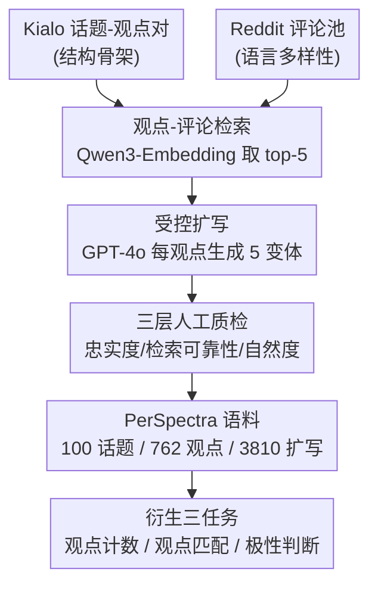

# PerSpectra: A Scalable and Configurable Pluralist Benchmark of Perspectives from Arguments

**会议**: ICLR 2026  
**OpenReview**: [https://openreview.net/forum?id=dyooGJcKJg](https://openreview.net/forum?id=dyooGJcKJg)  
**代码**: https://github.com/caisa-lab/ICLR-2026-Pespectra  
**领域**: LLM 评测 / 数据集与基准 / 多元主义对齐  
**关键词**: 多元主义、观点理解、辩论语料、基准构建、Kialo+Reddit

## 一句话总结
PerSpectra 把 Kialo 辩论图谱的"清晰结构"和 Reddit 真实讨论的"语言多样性"用一条检索-扩写流水线缝合起来，构造出 100 个争议话题、762 个 pro/con 立场、3810 条自然化论点的可配置基准，并衍生出观点计数、观点匹配、极性判断三个任务，揭示出当前 LLM 在多视角理解上的系统性失败（高估观点数、混淆同侧细分观点、被让步从句带偏极性）。

## 研究背景与动机
**领域现状**：LLM 越来越多地服务价值观各异的人群，理想情况下它的输出应当反映"合理观点的多元性"（pluralism），而不是把所有声音碾平成一个"平均答案"。已有的多元主义数据集如 OpinionQA、GlobalOpinionQA（把模型预测对齐到民意调查分布）、DICES（收集文化多样的对话安全判断）证明了"多元评测"可行。

**现有痛点**：这些资源几乎都依赖人工标注或精心策划的调查问卷，因此**扩展昂贵、话题覆盖窄、难以适配新的多元任务**。另一条转向"自然发生的辩论"的路线也各有短板：PerSpectrum 这类在线辩论数据集质量高，但要靠密集人工校验，扩不上去；Reddit 规模大、语言自然，却**没有清晰的论辩结构、标注成本高、标签噪声大（反讽、歧义）**；Kialo 提供了显式的 pro/con 图谱，但它的论点**过于简短、formalized，脱离真实话语的风格丰富度**。

**核心矛盾**：现有辩论语料要么"小规模但结构干净"（Kialo、PerSpectrum），要么"大规模但噪声多样"（Reddit、IAC），二者无法兼得——结构清晰与语言多样存在天然 trade-off。同时，RLHF 这类对齐手段为了安全和一致性，会把概率质量集中到少数答案，**主动压制观点异质性**，让"多元能力"既没人造数据来训、也没基准来测。

**本文目标**：造一个既有 Kialo 结构清晰度、又有 Reddit 语言多样性、且**可程序化扩展、可配置**的多元基准，并用它把"模型能否表示、区分、推理多个视角"量化出来。

**切入角度**：作者观察到 Kialo 的"结构骨架"和 Reddit 的"语言血肉"恰好互补——能不能用一个 Kialo 观点当锚点，去 Reddit 里检索语义相近的真实评论，再让大模型把二者"扩写"成既忠实原立场、又带 Reddit 自然风格的论点？这样结构由 Kialo 保证、多样性由 Reddit 注入、规模由自动流水线保证。

**核心 idea**：用"Kialo 观点 + 检索到的 Reddit 评论 → 受控扩写"的流水线，把简短结构化观点膨胀成多个自然化变体，从而构造一个可配置、零额外标注的多元主义基准。

## 方法详解

### 整体框架
PerSpectra 本质上是一个**数据集 + 基于其结构衍生的评测任务**，而不是一个新模型。它的核心产物是一条数据构造流水线：以 Kialo 的（话题, 观点）对为骨架，为每个观点从 Reddit 海量评论里检索语义最相近的若干条，再用 GPT-4o 受控扩写成 5 个忠实原立场但风格自然的论点变体，最终得到 100 话题 / 762 观点 / 3810 扩写的语料。因为每条扩写都"知道"自己对应哪个 Kialo 原始观点、属于 pro 还是 con，这些**结构标签可以零成本地反推出任务的 ground truth**，于是作者在同一份语料上程序化地搭出三个任务：观点计数、观点匹配、极性判断。

整条流水线可以分成"数据源 → 检索 → 扩写 → 质检 → 衍生任务"五段，下面的框架图给出鸟瞰：

### 关键设计

**1. 双源缝合：用 Kialo 当骨架、Reddit 当血肉**

这一设计针对"结构清晰 vs 语言多样无法兼得"的核心矛盾。Kialo 把内容组织成"话题 → pro/con 观点"的层级树，每个观点是一条边界清晰、被人工 moderated 的论辩单元，天然适合当数据生成的锚点（例如话题"美国人都应有基本医疗权"下，pro 是"全民医疗能救很多命"、con 是"全民医疗可能导致医生短缺"）。但 Kialo 的观点太短太正式。Reddit 则相反：没有显式辩论树，但有大量非正式、风格丰富的真实论辩表达。作者的做法是让 Kialo 提供"可靠的清晰观点骨架"、让 Reddit 提供"自然话语的上下文变体池"，二者结合就同时拿到结构和多样性——这正是 KialoPrime、PerSpectrum 等单源资源给不了的。

**2. 受控检索：为每个观点在 Reddit 里找语义最近的真实评论**

针对"如何把结构化观点接地到自然话语"，作者设计了一条多阶段检索-过滤管线。对每个话题先用基于检索的排序取最相关的 20 个 thread，每个 thread 按 score（赞-踩）取至多 100 条评论，单话题最多 2000 条原始候选。随后做质量过滤：丢掉少于 5 个词的评论、无可识别作者的、moderator/automoderator 发的、用户名含 "bot" 的，过滤后每话题剩约 1500–1800 条。最后用 **Qwen3-Embedding-8B**（因其在 MTEB 聚类任务上表现强，而本任务正是"简短结构化观点"与"多样 Reddit 话语"之间的语义聚类）对 Kialo 观点和所有候选评论编码，按余弦相似度为每个观点保留 top-5：相似度最高者作为 "best match"，其余作为生成风格化、上下文化扩写的额外素材。这里有意**不固定 subreddit、每 thread 设固定检索预算**，避免单一来源主导、保住话题多样性。

**3. 受控扩写：忠实原立场前提下注入 Reddit 风格**

针对"既要语言自然又不能跑偏原立场"，作者对每个（话题, 观点, 评论）三元组用固定模板提示 GPT-4o，显式要求模型：(i) 保持论辩忠实度，(ii) 忽略无关/跑题内容，(iii) 模仿 Reddit 非正式、语境化的风格。作者试了多版 prompt，选了最能平衡忠实与自然的那版。每个观点扩出 **5 个变体**，共 762×5 = 3810 条，平均每条约 100 词（mean 97.82，range 49–311），原始观点则很短（mean 14.09 词）。多变体的意义在于：同一底层立场被表达成多种措辞与语境，**为后续"模型能否抽象掉表面差异、把同义变体聚到同一观点"的评测提供了天然难度**。

**4. 三层人工质检 + 五维评分，保证扩写没有"换皮跑偏"**

针对"自动扩写质量没保证"，作者把质检拆成三个互补层次并落到五个 0–5 评分维度。**内容忠实与连贯**：扩写必须保住原观点的核心立场和推理，新增材料要 on-topic；这是最根本指标。**机制特异可靠性**：因为检索靠 embedding 相似度，而"语义相似不等于真相关"，best match 有时只松散相关甚至跑题，所以要分别看"被检索帖本身的内在相关性"和"模型如何处理这次检索"——好的生成应当选择性整合相关 match，或在 match 无关时大体忽略它。**写作自然度**：要读起来像人写的 Reddit 帖，避免"机器味"的重复措辞。在 100 个随机抽样的（观点, 扩写）对上人工打分（表 2）：忠实度 4.92、新增内容相关性 4.87、best match 使用 4.72、自然度 4.42 都很高，而**最大变异来源是"检索 best match 与话题的相关性"仅 3.31（std 1.37）**——这暴露了检索环节是质量瓶颈，也解释了为什么扩写阶段要专门训练模型"该忽略就忽略"。

### 一个完整示例
以话题"漫威宇宙比 DC 宇宙好"、Kialo 观点"DC 角色更好"为例：检索到的 best match 评论是"DC 的角色更能独当一面，而漫威更擅长团队作品"。GPT-4o 扩写后输出："虽然漫威擅长打造史诗级团队动态和群像故事，但 DC 的强项在于其标志性的、能独当一面的角色。蝙蝠侠、超人、神奇女侠等英雄拥有丰富、有层次的叙事……这种独自撑起整个故事还能吸引观众的能力，正是 DC 角色与众不同、在漫画世界里堪称传奇的原因。"——它成功把评论里的"standalone characters"线索融进来，同时把原立场扩写得更丰满。该样本忠实度、新增相关性、best match 使用、话题相关性都拿 5 分，唯独自然度因仍残留轻微"模型腔"被打 4 分。这个例子把"检索→扩写→质检五维评分"整条链路具象化了。

## 实验关键数据

### 主实验
作者从语料里为每个子任务采样 500 个评测样本（ground truth 由观点/立场标签程序化导出，无需额外标注），评测 12 个开源/闭源 LLM 并对比人类。三任务指标：**观点计数**报 Accuracy（精确匹配 $\hat{y}=y$）、MAE（$|\hat{y}-y|$）、NIE；**观点匹配**报 Accuracy（精确命中源观点）与 Stance Accuracy（只看是否选对 pro/con 一侧）；**极性判断**报 Accuracy。其中 NIE（Normalized Inverse Error）定义为

$$\text{NIE} = \frac{1}{N}\sum_{i=1}^{N}\left(1 + \frac{|\hat{k}_i - k_i|}{\max(1, k_i)}\right)^{-1}$$

其中 $k_i$ 是第 $i$ 例的真实唯一观点数、$\hat{k}_i$ 是模型预测，分母用 $\max(1,k_i)$ 把误差按真实计数尺度归一化，是一个比精确匹配更平滑的分数。

| 模型 | T1 计数 Acc↑ | T1 MAE↓ | T1 NIE↑ | T2 匹配 Acc↑ | T2 Stance↑ | T3 极性 Acc↑ |
|------|------|------|------|------|------|------|
| LLaMA-3.1-8B-Instruct | 6.4% | 3.17 | 0.57 | 6.0% | 10.4% | 29.6% |
| Qwen3-8B | 33.6% | 1.26 | 0.79 | 83.6% | 92.4% | 64.0% |
| QwQ-32B | 36.2% | **0.97** | **0.82** | 72.0% | 80.2% | 66.4% |
| Qwen2.5-32B | **35.2%** | 1.25 | 0.79 | 72.2% | 80.4% | 55.2% |
| DS-R1-Distill-Qwen-32B | 31.2% | 1.48 | 0.77 | **85.4%** | **95.0%** | 67.2% |
| GPT-4o | 29.2% | 1.38 | 0.76 | 74.8% | 81.2% | **76.4%** |
| GPT-4o-mini | 34.0% | 0.94 | 0.81 | 71.6% | 81.6% | 72.8% |
| **Human** | **44.0%** | 1.01 | 0.81 | **90.6%** | **94.3%** | **85.6%** |

关键观察：没有任何单一模型在三任务上都领先；T1 计数上开源的 QwQ-32B 略胜 GPT-4o，T2 匹配上蒸馏的 DS-R1-Distill-Qwen-32B 最强（甚至超过 GPT-4 系），T3 极性上 GPT-4o 领先而开源模型普遍吃力。**人类在三任务上都以明显优势超过所有模型**，说明多元理解仍有巨大 headroom。

### 失败分析（替代消融）
本文是基准论文，"消融"以三类系统性失败模式的定量分析呈现：

| 失败模式 | 任务 | 定量证据 | 根因 |
|------|------|------|------|
| 观点高估（oversplit） | T1 计数 | 12 模型全错的 47 例 / 564 次预测中，71.5% 是多估、24.6% 少估、3.9% 无效输出 | 把表面措辞/风格差异误当成不同观点，难点在语义归一化而非立场识别 |
| 同侧细分混淆 | T2 匹配 | Stance Acc 始终比 Exact Acc 高 8–24 点（如 Qwen3-8B 83.6% vs 92.4%） | 选对辩论一侧不难，难在区分同侧语义相近的细分观点（扩写引入的额外细节造成歧义） |
| 让步陷阱 | T3 极性 | 全模型皆错的 34 例中 20 例（59%）有清晰的"让步-反驳"结构 | 开头"while/although…"的局部极性线索把模型带向被让步的一侧，而非结论立场 |

### 关键发现
- **多元理解的真正难点是"语义归一化"**：计数任务里模型不是分不清立场，而是分不清"哪些不同措辞其实是同一个观点"，over-splitting 是压倒性的主要失败模式（71.5%）。
- **立场粗判稳健、细分判别脆弱**：匹配任务里 stance 准确率系统性高于 exact，说明模型对"pro/con 哪一侧"很稳，但对"同侧到底是哪条观点"经常被扩写新增的具体细节带偏。
- **让步从句是极性判断的系统性杀手**：先承认对方再反驳的结构里，模型常被开头的让步线索骗到错误一侧，这是 systematic 而非随机错误。

## 亮点与洞察
- **"结构源 × 多样源 + LLM 扩写"是一条可复用的造数范式**：用一个高质量结构化骨架（Kialo）当 ground-truth 标签来源、用一个大规模噪声源（Reddit）当风格注入器、用大模型受控扩写做缝合，既拿到自动标签又拿到自然语言——这套思路能迁移到任何"有干净标签的小数据 + 有自然语言的大数据"的造基准场景。
- **结构标签反推任务，零额外标注还可配置**：因为每条扩写都带"对应哪个原观点、哪个立场"的标签，作者能程序化地从同一份语料切出计数/匹配/极性三个完全不同的任务，且明说语料可配置出 demo 之外的更多任务——这把"造一个基准"升级成"造一个可生长的基准平台"。
- **用 best-match 相关性 3.31 这个低分自曝瓶颈**：作者没有藏着检索环节的弱点，反而把"检索 best match 与话题相关性"的低均值高方差摆出来，既诚实又顺势论证了"为什么扩写阶段要让模型学会忽略无关 match"。
- **三类失败给后续方法指了明确靶子**：oversplit / 同侧混淆 / 让步陷阱不是空泛的"模型不行"，而是可定位、可针对性改进的具体机制缺陷。

## 局限与展望
- **扩写依赖单一闭源模型（GPT-4o）**：整个语料的语言风格和潜在偏差都受 GPT-4o 影响，"自然度"里残留的"机器腔"（自然度 4.42 而非满分）说明合成数据仍非完全拟真，可能给下游评测引入系统性 artifact。
- **检索环节是质量瓶颈且未端到端优化**：best-match 话题相关性仅 3.31，意味着相当比例的扩写是建立在"只松散相关甚至跑题"的 Reddit 评论之上，虽然质检要求模型"无关就忽略"，但这把负担转嫁给了扩写模型，检索本身没被改进。
- **任务覆盖仍偏"理解"而非"生成多元"**：三个 demo 任务都是判别式（数观点、配观点、判极性），还没直接测"模型能否主动生成并保留多个合理视角"这一 pluralistic alignment 的终极目标。
- **话题与立场仍受 Kialo 边界约束**：观点单元全继承自 Kialo 的 moderated 图谱，好处是减少主观性，但也意味着基准的视角空间被 Kialo 的策展口径框定，少数/边缘视角可能本就缺席。

## 相关工作与启发
- **vs OpinionQA / GlobalOpinionQA / DICES**：它们靠民意调查或人工标注对齐 population 级观点分布，强在真实人群代表性，但扩展贵、话题窄、难适配新任务；PerSpectra 用自动流水线换取可扩展性与可配置性，代价是数据为合成扩写。
- **vs PerSpectrum**：同样看重"自然辩论里的多元视角"，但 PerSpectrum 靠密集人工校验，扩不上去；PerSpectra 用检索+扩写把人工成本压到只剩抽样质检。
- **vs KialoPrime / BERDS（纯 Kialo）**：它们继承了 Kialo 的清晰 pro/con 结构但也继承了"过于简短正式"的缺陷；PerSpectra 给 Kialo 观点注入 Reddit 风格，补上语言多样性。
- **vs 纯 Reddit 语料（CMV / DEBAGREEMENT / IAC 2.0）**：它们有规模和自然度但缺论辩脚手架、标注贵且标签噪声大；PerSpectra 用 Kialo 骨架给 Reddit 风格"配上结构标签"，把噪声多样性变成可评测的干净任务。
- **vs Modular Pluralism / Community Alignment**：那些工作偏"如何让模型表示多元"（方法/训练侧），PerSpectra 偏"如何测量模型多元能力"（评测/基准侧），二者互补。

## 评分
- 新颖性: ⭐⭐⭐⭐ 双源缝合+结构标签反推任务的造基准范式很巧，但单点技术（检索、LLM 扩写）都是成熟组件的组合。
- 实验充分度: ⭐⭐⭐⭐ 12 个模型 × 3 任务 + 人类基线 + 三类失败的定量归因，作为基准论文相当扎实。
- 写作质量: ⭐⭐⭐⭐ 动机链条清晰、失败分析具体可操作，公式与统计表完整。
- 价值: ⭐⭐⭐⭐ 填补了"可扩展可配置的多元主义评测基准"空白，且开源可生长，对 pluralistic alignment 研究有持续价值。

<!-- RELATED:START -->

## 相关论文

- [\[ICLR 2026\] VideoJudge: Bootstrapping Enables Scalable Supervision of MLLM-as-a-Judge for Video Understanding](videojudge_bootstrapping_enables_scalable_supervision_of_mllm-as-a-judge_for_vid.md)
- [\[ICLR 2026\] CLASH: Evaluating Language Models on Judging High-Stakes Dilemmas from Multiple Perspectives](clash_evaluating_language_models_on_judging_high-stakes_dilemmas_from_multiple_p.md)
- [\[ACL 2026\] TaxPraBen: A Scalable Benchmark for Structured Evaluation of LLMs in Chinese Real-World Tax Practice](../../ACL2026/llm_evaluation/taxpraben_a_scalable_benchmark_for_structured_evaluation_of_llms_in_chinese_real.md)
- [\[AAAI 2026\] LLM-as-a-Judge for Scalable Test Coverage Evaluation](../../AAAI2026/llm_evaluation/llm-as-a-judge_for_scalable_test_coverage_evaluation_accuracy_operational_reliab.md)
- [\[ACL 2026\] ScaleBox: Enabling High-Fidelity and Scalable Code Verification for Large Language Models](../../ACL2026/llm_evaluation/scalebox_enabling_high-fidelity_and_scalable_code_verification_for_large_languag.md)

<!-- RELATED:END -->
