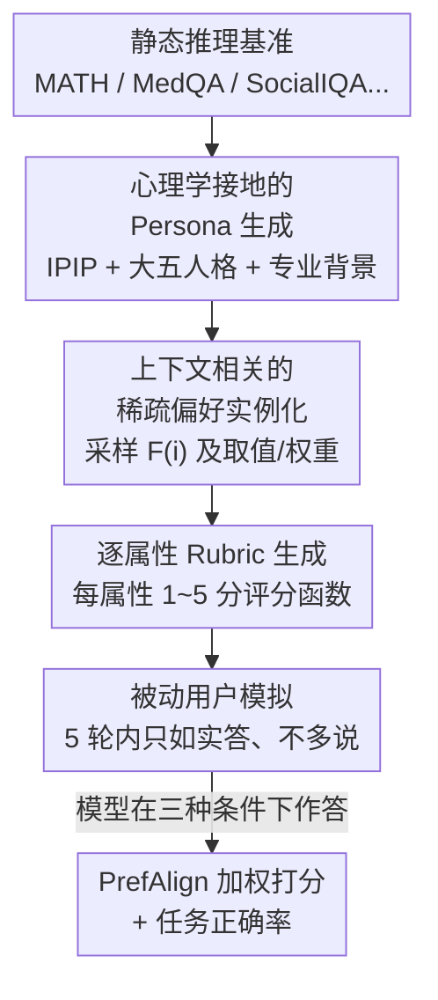

# PrefDisco: Benchmarking Proactive Personalized Reasoning

**会议**: ICLR 2026  
**OpenReview**: [https://openreview.net/forum?id=O1hfVE0UxG](https://openreview.net/forum?id=O1hfVE0UxG)  
**代码**: https://github.com/stellalisy/PrefDisco  
**领域**: LLM 评测 / 个性化推理 / 偏好对齐  
**关键词**: 个性化推理, 偏好发现, 冷启动, rubric 评测, 主动提问

## 一句话总结
本文提出 PrefDisco——一套把任意静态推理基准改造成「交互式个性化任务」的评测方法，要求模型在冷启动（无历史）下主动提问来发现用户隐藏偏好、再据此调整推理链，并用细粒度 rubric 指标 PrefAlign 度量对齐程度；在 21 个前沿模型 × 10 个任务上发现 29.0% 的个性化尝试反而比通用回答更差。

## 研究背景与动机

**领域现状**：当前 LLM 的开发把「把题做对」和「对齐人类偏好」当成两件先后独立的事——先用指令微调 / RL 优化客观正确率，再用 RLHF 对齐到「聚合后的大众偏好」。评测也大多在这两条线上分别打分。

**现有痛点**：在真正面向人的应用里，把题做对远远不够。同一个医学解释，对临床实习生 A 该用临床类比，对另一个用户 B 却要正式定义；模型若不分对象给出一模一样的回答，哪怕基准分很高也服务不了具体的人。现有个性化基准（PersoBench、PrefEval、PersonaMem、UserBench 等）要么把偏好直接写在 context 里、要么需要长历史，**假设偏好已知或可从上下文推断**，且只评「表达风格」是否匹配，从不要求模型去改底层推理过程。

**核心矛盾**：现实中最难的恰恰是**冷启动 / just-in-time** 场景——隐私约束或新用户上线导致没有任何交互历史；而且用户常常说不清自己要什么、也给不出有效反馈。这就要求模型**主动**识别「我对这个用户还不知道什么」，靠提问去问出来，而不是把认知负担压给用户。现有工作没人认识到：不同用户需要的**根本就是不同的推理链**，而非同一条链换个说法。

**本文目标**：把「个性化推理」这件事拆成可评测的三步——(1) 推断哪些属性对当前用户-任务对重要；(2) 在有限轮次里高效问出这些属性的取值与权重；(3) 据此重塑推理链与回答，并联合「正确性 + 偏好对齐」打分。

**切入角度**：作者主张个性化不是「换皮」（surface presentation），而是**选哪条推理链本身**。同一道格点路径计数题，可以用容斥、递归 DP、母函数三种方法解，每种适配不同背景的用户，但都得到正确答案——选链才是个性化的核心。

**核心 idea**：用一套自动化流水线把现成静态基准「升级」成交互式个性化考场——给每个 persona-任务对采样**稀疏、上下文相关**的偏好子集，自动生成**逐属性 rubric**，再用被动用户模拟逼模型主动提问发现偏好，最后用加权 rubric 分 PrefAlign 度量对齐。

## 方法详解

### 整体框架

PrefDisco 本质是一个**评测方法 + 一个指标**，不训练任何模型。它的输入是任意一个带标准答案的推理基准（如 MATH、MedQA、SocialIQA），输出是把每道题包装成一个交互式个性化场景，并给出待测模型在该场景下的 PrefAlign（偏好对齐）与任务正确率两个分数。

整条流水线分两块。**问题形式化**（§2）先把「个性化推理」定义清楚：存在一个很大但有限的全局属性集 $\Theta=\{\theta_1,\dots,\theta_d\}$（如是否用类比、术语密度、共情程度等）；对任意任务 $i$，只有一个小子集 $F(i)\subseteq\Theta$ 真正相关；每个用户 $p$ 在实例 $i$ 上的偏好画像写作 $P_{p,i}=\{(\theta_j,v_j,w_j):\theta_j\in F(i)\}$，其中 $v_j$ 是取值方向（如「高术语」vs「低术语」），$w_j\ge 0$ 是相对权重且 $\sum_{\theta_j\in F(i)} w_j=1$。由于 $P_{p,i}$ 对模型不可见，偏好发现被建模成一个**序贯决策过程**：每一轮 $t$ 模型选动作 $a_t\in\{\text{ask}(\theta)\mid\theta\in F(i)\}\cup\{\text{answer}\}$，问就得到该属性取值并细化估计 $\hat P_{p,i}$，答则终止并据 $\hat P_{p,i}$ 生成回答。

**基准构建**（§3）则是把上述形式化落成可批量生成的四步流水线：先造心理学接地的 persona，再为每个 persona-题对实例化稀疏偏好，自动生成逐属性 rubric，最后用被动用户模拟驱动交互。下图按数据流向给出这条构建链：

### 关键设计

**1. 稀疏、实例级的偏好建模：把「该不该个性化」精确到属性**

传统个性化假设每个人有一份**固定**偏好画像、跨任务通用。本文反对这一点：心理学研究表明人在不同情境下会优先不同属性（同一个人在专业场合重精确、在闲聊中重易懂）。于是作者只在小子集 $F(i)$ 上激活偏好，并坚持**实例级**——同一用户 Alice 问同一医学问题，备考时偏好高术语、急诊时偏好低术语，偏好取值 $v_j$ 本身会随实例漂移。关键的区分是**取值 $v_j$ 与权重 $w_j$ 解耦**：$v_j$ 说「往哪个方向偏」，$w_j$ 说「这个属性相对多重要」，两个用户可能共享同一组相关属性却赋予完全不同的权重。$F(i)$ 由 LLM 分类确定，并在 20 个场景（每个含 10 个相关 + 10 个无关属性）上做人工标注验证，3 名标注者共 400 标签/人，Fleiss kappa = 0.463（主观任务下属中等一致），对多数投票的准确率 61.5%；再用 LLM 语义去重防止冗余属性虚增复杂度。这套稀疏建模让评测能**逐属性归因**模型的失败，而不是给一个糊在一起的整体满意度分。

**2. PrefAlign 指标：用逐属性 rubric 替代整体满意度打分**

要量化「回答有多贴合用户偏好」，本文不用一个 LLM-judge 拍一个整体好恶分，而是为每个相关属性 $\theta_j$ 生成一个评分函数 $g_j(r,v_j)\in[0,5]$，度量回答 $r$ 在该属性上与用户取值 $v_j$ 的吻合度（如「医学解释里的术语量是否匹配用户的容忍度」）。总对齐分按权重聚合：

$$\mathrm{PrefAlign}(r,P_{p,i})=\sum_{\theta_j\in F(i)} w_j\cdot g_j(r,v_j).$$

成功的个性化推理要求**联合目标**——既 $\mathrm{Correct}(r,i)=1$，又最大化 $\mathrm{PrefAlign}$。逐属性 rubric 的好处是每个属性都对照一条显式标准打分，而非汇成一个不透明的总印象，从而**降低幻觉与偏置**，也让 10K 场景的大规模自动评测可扩展。为消除单模型偏置，构建时每次 API 调用（生成 persona / 实例化偏好 / 造 rubric）从 GPT-4.1、Gemini-2.5-Flash、Claude-Sonnet-4 中随机选一个。

**3. 心理学接地的 Persona 生成：让偏好可迁移、分布真实**

作者不用任意编造的用户原型，而是把 persona 接到国际人格题库 IPIP（Goldberg et al., 2006）上，纳入人口学特征、大五人格维度和领域专业度，这些跨题保持一致。生成时用高温采样（$t=0.7$）+ 拒绝采样，既保证多样覆盖、又避免常见属性组合被过度代表。persona 跨实例一致这一点很关键：它让评测能进一步考察模型**在同一会话内把已发现偏好迁移到新任务**的能力，这是实际部署里用户跨多任务交互时的核心需求。

**4. 被动用户模拟 + 5 轮预算：把「会不会问」从「用户主不主动」里剥出来**

为了干净地评测模型自身的提问能力，本文实现**被动用户**模拟（借鉴 MediQ）：用户只如实回答模型问到的那个属性、**绝不主动多说**。注意「被动」指信息分享行为最小化，不是指回复格式——用户用自然语言文本作答而非给标量。这样设计强迫模型自己发展出**有策略的提问**，把模型的提问能力从用户沟通风格里隔离出来，提供受控的评测条件。每次交互限 5 轮，对应人机交互中现实的注意力约束；作者的相关性分析与固定轮长实验（性能曲线在 3–5 轮附近趋平）支持这个预算选择。

### 一个例子：格点路径计数题怎么「选链」

题目：数从 $(0,0)$ 到 $(10,10)$、只走右/上、且不越过对角线 $y=x$ 的最短路径数（答案 = Catalan 数 $C_{10}=16796$）。同一道题对三类用户应走**不同推理链**：早期大学生 Maya 偏好「建立直觉」→ 用容斥 + 反射双射；程序员 Dev 偏好「算法解」→ 写 DP 填三角区表格 $dp(10,10)$；数学家 Rina 偏好「形式推导」→ 用母函数 $C(x)=1+xC(x)^2$ 解出 $[x^{10}]$。三条链都给出正确的 16796，但通用模型只会给一条标准 Catalan 公式链，导致 Maya 没拿到直觉、Dev 没拿到代码、Rina 没拿到推导——答案对了，个性化全错。这正是 PrefAlign 要捕捉、而传统「只看答案对不对」的基准完全看不见的差距。

## 实验关键数据

评测覆盖 **10 个基准**（MATH-500、AIME、LogiQA、MascQA、ScienceQA、MMLU、SimpleQA、MedQA、CommonsenseQA、SocialIQA）跨数学/逻辑/科学/社会推理，**21 个前沿模型**（GPT、O 系列、Gemini、Claude 各变体）。生成 100 个 persona、每基准抽 100 题、每题配 10 个 persona ⇒ 每任务 1,000 场景、共 **10,000 场景**。每个模型在三种条件下作答：**Baseline**（只给题，无偏好）、**Discovery**（多轮主动问后再答）、**Oracle**（直接给全部 ground-truth 偏好画像）。

归一化对齐分让不同模型可比：

$$\mathrm{NormAlign}=100\times\frac{\mathrm{PrefAlign}(r_{\text{discovery}})-\mathrm{PrefAlign}(r_{\text{baseline}})}{\mathrm{PrefAlign}(r_{\text{oracle}})-\mathrm{PrefAlign}(r_{\text{baseline}})},$$

其中 0 表示对 baseline 毫无改进，100 表示 discovery 完美追平 oracle，负值表示个性化尝试反而比通用回答更差。

### 主实验：归一化偏好对齐（Discovery 模式，部分模型）

| 任务 | gpt-4o | o4-mini | gemini-1.5-flash | gemini-2.5-pro | claude-opus-4 | claude-3-5-sonnet-v1 |
|------|--------|---------|------------------|----------------|---------------|----------------------|
| MATH | 4.9 | 21.9 | 20.7 | -13.5 | 16.9 | 15.6 |
| LogiQA | 7.7 | 26.0 | 23.5 | -0.3 | 14.7 | 38.8 |
| MedQA | -6.6 | 23.8 | 6.7 | 35.7 | 33.0 | 24.0 |
| SocialIQA | 21.2 | 17.4 | 27.0 | 29.3 | 7.7 | -8.7 |
| CommonsenseQA | 25.2 | 16.0 | 24.9 | 20.2 | 2.2 | 1.8 |

整体看：210 个「模型 × 任务」组合里 **61 个（29.0%）NormAlign 为负**——即主动个性化的回答比不做个性化还差。MATH、LogiQA 退化最严重（分别有 10、11 个模型变差），SocialIQA 获益最多。Claude Opus 4 正向最稳定；有趣的是较老的 Claude 3-Opus 在 discovery 对齐上偶尔超过更新的 Claude Sonnet-4，与「RL 会导致模型坍缩、输出多样性下降」的发现一致。

### 关键分析：提问量、正确率代价

| 分析维度 | 关键数据 | 说明 |
|----------|----------|------|
| 提问量 ↔ 对齐 | $r=0.445$, $p<0.001$；平均仅问 **1.48** 个问题（上限 5） | 问得多对齐更好，但绝大多数模型问得太少，落在低性能区 |
| 各家提问效率 | Gemini $\beta$=0.474 > OpenAI 0.379 > Claude 0.117 | Gemini 每多问一题带来的对齐增益最大，说明差距在**问题质量与时机**而非纯数量 |
| 正确率代价 | Baseline 65.2% → Oracle 61.8% → Discovery 60.1% | 个性化有**固有认知成本**：连无需交互的 Oracle 都掉点，说明代价来自「处理偏好约束」本身而非多轮对话开销 |
| 领域分化 | AIME 掉 12.1%；CommonsenseQA 涨 5.4% | 数学严重退化、社会任务反而稳健/提升 |
| 固定轮长对照 | 强制问 2/4/8 题，数学仍退化、社会仍提升 | 领域脆弱性与「何时停问」无关，是更深层架构问题 |

### 关键发现
- **过度纠正是负分主因**：模型倾向去改 baseline 里本来就 OK 的部分，naive 个性化常常越改越糟——29.0% 负分正源于此 + 问得太少（1.48 题）落在低性能区。
- **数学退化 vs 社会稳健的根因猜想**：SOTA 模型被 RL 重度优化在可验证数学基准上，收敛到一小撮高奖励推理路径；个性化常要求**改核心推理步**（如给新手避开高等微积分），这种「换认知工具箱」让僵化绑定训练路径的模型解不出题，正确率因此下滑。
- **失败是架构层面、非提问策略层面**：固定问题数后领域分化依旧，说明问题出在「同时维持逻辑精确 + 适配偏好」的认知负荷上。

## 亮点与洞察
- **重新定义了「个性化」**：从「换说法」上升到「换推理链本身」——格点路径题的容斥/DP/母函数三链例子极具说服力，是全文最「啊哈」的地方。
- **稀疏 + 实例级偏好建模**：把「该不该个性化」精确到逐属性的 $(v_j,w_j)$，且承认同一用户偏好随情境漂移，比「一人一份固定画像」更贴近真实，且天然支持逐属性失败归因。
- **可迁移的方法论**：PrefDisco 能把**任意**静态基准升级成交互式个性化考场，这个「benchmark 转换器」范式可直接迁移到新领域、新任务，复用成本极低。
- **揭示对齐-推理的内在冲突**：连 Oracle 都掉正确率这一发现，把「个性化代价」从「多轮对话开销」剥离出来，定位到 RL 训练范式导致的推理僵化，对后续训练方法设计有直接启发。

## 局限与展望
- 作者承认：只评了**有益的**个性化，未涉及过度个性化（信息茧房）、谄媚（为迎合用户牺牲事实）；当前只评**沟通偏好**而非内容偏好，也不涉及偏好演化或冲突偏好。
- 模拟用户虽心理学接地，但未必覆盖真人偏好表达的全部复杂度；被动用户是一种刻意简化，真实用户的主动/含糊行为会带来额外噪声。
- 自己发现的局限：rubric $g_j$ 与 $F(i)$ 都由 LLM 生成，人工验证的一致性只有中等（kappa 0.463），评测信号本身可能含 LLM 偏置；NormAlign 用 Baseline-Oracle 区间归一，当某模型 oracle≈baseline 时分母极小、分数会不稳定，跨任务比大小需谨慎。
- 改进思路：作者点出可利用这套多维奖励结构做 RL（而非只做评测），并研究跨任务偏好迁移，把个性化推理从「考能力」推进到「训能力」。

## 相关工作与启发
- **vs PersoBench / PrefEval / PersonaMem / UserBench**：它们把偏好直接给在 context 里或需长历史、且只评静态一致性或对话生成；PrefDisco 是首个要求模型在**真冷启动**下主动发现稀疏隐藏偏好、并据此**改推理链**、还覆盖多个可验证推理域的框架。
- **vs MediQ / GATE**：二者展示了交互式提问（临床信息搜寻 / 用户意图澄清），但局限单一窄域、且没有「推理适配」这一核心成分；PrefDisco 把交互发现与跨域推理适配结合起来。
- **vs 用户偏好建模（per-user reward model / 多维偏好）**：现有方法不回答「对特定用户-任务对哪些属性相关」「冷启动下如何交互发现」，PrefDisco 正是补这个空缺。

## 评分
- 新颖性: ⭐⭐⭐⭐⭐ 把个性化从「换皮」重定义为「选推理链」，并造出首个冷启动主动发现的评测范式
- 实验充分度: ⭐⭐⭐⭐⭐ 21 模型 × 10 任务 × 10K 场景，三条件对照 + 固定轮长消融，分析扎实
- 写作质量: ⭐⭐⭐⭐ 形式化清晰、图例（医学/格点路径）很到位，但符号略多
- 价值: ⭐⭐⭐⭐⭐ 揭示对齐-推理内在冲突，为教育/医疗/技术支持的个性化 AI 提供可复用评测地基

<!-- RELATED:START -->

## 相关论文

- [\[ACL 2026\] Personalized Benchmarking: Evaluating LLMs by Individual Preferences](../../ACL2026/llm_evaluation/personalized_benchmarking_evaluating_llms_by_individual_preferences.md)
- [\[ICLR 2026\] Towards Personalized Deep Research: Benchmarks and Evaluations](towards_personalized_deep_research_benchmarks_and_evaluations.md)
- [\[ACL 2025\] Mis-prompt: Benchmarking Large Language Models for Proactive Error Handling](../../ACL2025/llm_evaluation/mis-prompt_benchmarking_large_language_models_for_proactive_error_handling.md)
- [\[ICLR 2026\] Benchmarking Overton Pluralism in LLMs](benchmarking_overton_pluralism_in_llms.md)
- [\[ICLR 2026\] AnesSuite: A Comprehensive Benchmark and Dataset Suite for Anesthesiology Reasoning](anessuite_a_comprehensive_benchmark_and_dataset_suite_for_anesthesiology_reasoni.md)

<!-- RELATED:END -->
