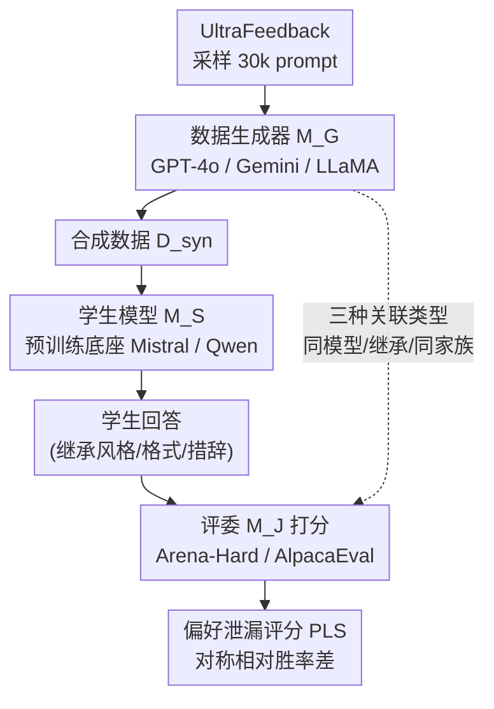

# Preference Leakage: A Contamination Problem in LLM-as-a-judge

**会议**: ICLR2026  
**arXiv**: [2502.01534](https://arxiv.org/abs/2502.01534)  
**代码**: [David-Li0406/Preference-Leakage](https://github.com/David-Li0406/Preference-Leakage)  
**领域**: LLM评测  
**关键词**: LLM-as-a-Judge, 偏好泄漏, 数据污染, 评估偏差, 合成数据

## 一句话总结

首次定义并系统研究 LLM-as-a-Judge 中的 **偏好泄漏 (Preference Leakage)** 问题——当合成数据生成器 $M_G$ 与评估器 $M_J$ 存在关联（同模型/继承/同家族）时，评委会对"相关学生模型"产生系统性偏好，同模型场景下 PLS 高达 28.7%（Arena-Hard），且该偏差比自中心偏差更隐蔽、更难检测。

---

## 研究背景与动机

**LLM-as-a-Judge 成为主流评估范式**：传统 n-gram 匹配（BLEU/ROUGE）无法有效评估 LLM 的开放式长文本生成，社区转向用强力 LLM 作评委打分，AlpacaEval 2.0、Arena-Hard 等排行榜广泛采用此方式。

**合成数据训练已成趋势**：为提升训练效率，研究者大量使用 LLM 生成的合成数据来微调学生模型（如用 GPT-4o 生成指令数据训学生模型）。

**数据生成器与评估器高度重叠**：由于"最强模型"数量有限，社区常用 GPT-4 既做数据生成器、又做评估器。这种重叠类似传统机器学习中的数据泄漏问题，但发生在评估侧、且更加隐蔽。

**已知偏差不足以覆盖此问题**：已有工作揭示了 LLM 评估中的位置偏差、长度偏差、自中心偏差（egocentric bias）等，但偏好泄漏是一种全新的、由数据生成-评估管线耦合引发的系统性污染，之前未被系统研究。

**检测极其困难**：大多数 LLM 不公开训练数据，蒸馏关系难以量化，使得偏好泄漏比数据污染更难发现。

**核心研究问题**：本文围绕三个 RQ 展开——(RQ1) 偏好泄漏是否引入系统性偏差？(RQ2) 不同场景下偏好泄漏的严重度如何？(RQ3) 偏好泄漏的底层机制是什么？

---

## 方法详解

### 整体框架

本文不提出新模型，而是把"合成数据生成 → 学生模型训练 → 评委打分"这条主流评估管线拆开，定位其中一个被忽视的耦合点：当数据生成器 $M_G$ 与评委 $M_J$ 存在关联时，评委会系统性高估那些用 $M_G$ 的数据训出来的学生模型 $M_S$，而这种偏好并非源于回答更好，而是 $M_S$ 从 $M_G$ 继承了风格、格式、措辞这类表面特征，恰好被 $M_J$ 天然偏爱。整套方法学因此分三步落地：先把这个直觉**形式化**成一条可用胜率数据检验的不等式，再把"关联"从二元拆成**有梯度的三档谱系**，接着用一个对称的 **PLS 指标**把偏差量化成单一数值，最后用受控的"三生成器 × 两学生 × 三评委"**矩阵实验**把它从噪声里测出来。下图给出这条被研究的管线及泄漏发生的耦合路径（虚线即 $M_G$ 与 $M_J$ 的关联，是泄漏的源头）：

### 关键设计

**1. 问题形式化：把"评委偏心"写成一条可检验的不等式**

要把"评委偏心"从直觉变成能被证伪的命题，作者先给管线里的三类实体定下符号——数据生成器 $M_G$ 产出合成集 $D_{syn}$（条件分布 $P_{M_G}(y|x)$），学生模型 $M_S$ 在 $D_{syn}$ 上训练得到输出分布 $P_{M_S}(y|x)$，评委 $M_J$ 给出评分函数 $S_{M_J}(y|x)$。偏好泄漏被定义为：当 $M_G$ 与 $M_J$ 关联时，$M_J$ 给 $M_S$ 的期望分被人为抬高，而抬高的来源是 $M_S$ 从 $M_G$ 继承的那些虚假特征恰好对 $M_J$ 的胃口。落到公式上就是一条期望不等式：

$$\mathbb{E}_{x, y_S \sim P_{M_S}}[S_{M_J}(y_S|x) \mid M_G \sim_{rel} M_J] > \mathbb{E}_{x, y_S \sim P_{M_S}}[S_{M_{J'}}(y_S|x) \mid M_G \not\sim_{rel} M_{J'}]$$

即关联评委给出的期望分，高于无关联评委对同一批学生回答给出的期望分。这一步的价值在于把一个模糊的偏心感受，变成了可以直接用胜率数据拿来验证的形式化断言，为后面的指标和实验立了靶子。

**2. 三种关联类型：把"关联"从二元拆成有梯度的谱系**

现实里生成器与评委的关系远不止"是不是同一个模型"，如果只测同模型这一极端，就会低估问题的覆盖面。作者因此按耦合紧密度分出三档，让后续实验能测出泄漏随关联强度递减的趋势：

| 类型 | 定义 | 典型场景 |
|------|------|---------|
| **同模型 (Same Model)** | $M_G \equiv M_J$ | 用 GPT-4o 生成数据，又用 GPT-4o 当评委 |
| **继承关系 (Inheritance)** | $M_J \leftarrow \text{FineTune}(M_G, D)$ 或反向 | GPT-4o 生成数据 → 微调得到的模型做评委 |
| **同家族 (Same Family)** | $M_G, M_J \in \text{Family}(A_X, D_X)$ | GPT-4o 生成数据，GPT-4-turbo 做评委 |

这样分档是为了验证一个核心假设：泄漏不是"同模型才有"的孤例，只要存在血缘就会按比例渗出。一旦成立，问题的影响范围就从少数自评场景扩大到整个模型家族——你即便换了个"看起来不同"的评委，只要它和生成器同源，排行榜依旧失真。

**3. 偏好泄漏评分 PLS：用对称的相对胜率差把偏差量化成单一数值**

有了形式化的靶子，还需要一个能跨设置对齐的标量来回答"评委偏心了多少"。作者定义 Preference Leakage Score：核心是拿评委给关联学生的胜率，与一个中性基准做相对差，再对两个互为对照的模型对取对称平均：

$$\text{PLS}(i,j) = \frac{\left(\frac{\text{WR}(i,i) - \text{AVG}(i,j)}{\text{AVG}(i,j)}\right) + \left(\frac{\text{WR}(j,j) - \text{AVG}(j,i)}{\text{AVG}(j,i)}\right)}{2}$$

其中 $\text{WR}(i,j)$ 是评委 $j$ 给学生模型 $i$ 的胜率，$\text{AVG}(i,j) = \frac{\text{WR}(i,i) + \text{WR}(i,j)}{2}$ 充当"去掉偏心后"的参照基线。$\text{PLS} > 0$ 表示评委确实偏好与自己关联的学生，数值越大偏差越严重。取对称平均这一步很关键——它抵消了两个学生模型本身强弱不同带来的干扰，让最终的数值只反映"关联"这一项的贡献，而不混入"谁本来就更强"的噪声。

**4. 受控实验矩阵：用预训练底座隔离干扰，把泄漏从噪声里分离出来**

指标要测得准，前提是测出的偏差只来自合成数据本身、不掺杂其他污染源。作者从 UltraFeedback 采样 30,000 条 prompt，分别用 GPT-4o、Gemini-1.5-flash、LLaMA-3.3-70B 三个生成器各自产出回答；学生模型选 Mistral-7B-v0.1 和 Qwen-2.5-14B，关键在于一律用**预训练版本而非 instruct 版本**——因为 instruct 底座里可能已混入蒸馏数据，会把额外的泄漏信号偷带进来。评估跑在 Arena-Hard（500 题）和 AlpacaEval 2.0（805 题）两个基准上，最终铺成"三生成器 × 两学生 × 三评委 × 两 benchmark"的对照矩阵。这套矩阵让每一组 PLS 都有可比的对照项，是后续所有结论（关联越紧泄漏越重、SFT 比 DPO 重、小模型更重等）能成立的实验地基。

---

## 实验结果

### 主实验：偏好泄漏普遍存在（Table 1）

| 学生模型 | 生成器/评委对 | Arena-Hard PLS | AlpacaEval PLS | 平均 |
|---------|-------------|---------------|---------------|------|
| Mistral-7B | GPT-4o & Gemini-1.5 | 28.7% | 18.4% | **23.6%** |
| Mistral-7B | GPT-4o & LLaMA-3.3 | -1.5% | 1.4% | -0.1% |
| Mistral-7B | LLaMA-3.3 & Gemini-1.5 | 13.1% | 19.8% | 16.4% |
| Qwen-14B | GPT-4o & Gemini-1.5 | 37.1% | 18.6% | **27.9%** |
| Qwen-14B | GPT-4o & LLaMA-3.3 | 1.0% | 2.3% | 1.7% |
| Qwen-14B | LLaMA-3.3 & Gemini-1.5 | 25.4% | 18.4% | 21.9% |

**关键发现**：绝大多数模型对呈现显著正 PLS，评委明显偏好其关联学生模型。

### 关联类型分析（Table 2）

| 关联类型 | Arena-Hard | AlpacaEval 2.0 | 平均 |
|---------|-----------|---------------|------|
| 同模型 | 28.7% | 18.4% | **23.6%** |
| 继承 + 同指令 | 17.8% | 20.7% | 19.3% |
| 继承 + 不同指令 | 18.3% | 26.3% | 22.3% |
| 同家族 + 同系列 | 10.1% | 7.6% | 8.9% |
| 同家族 + 不同系列 | 3.3% | 2.2% | 2.8% |

**结论**：偏好泄漏严重度与关联程度强正相关。同模型 > 继承 > 同家族同系列 > 同家族不同系列。

### 学习方法对比（Table 3）

| 学习方法 | Arena-Hard | AlpacaEval 2.0 | 平均 |
|---------|-----------|---------------|------|
| SFT | 28.7% | 18.4% | **23.6%** |
| DPO | 7.7% | 2.7% | 5.2% |
| ICL | -4.2% | -1.1% | -2.7% |

**发现**：SFT 泄漏最严重，DPO 的成对优化机制可显著降低泄漏，ICL 不更新参数因此基本不受影响。

### 虚假特征消融（Table 6）

| 设置 | GPT & Gemini | GPT & LLaMA | LLaMA & Gemini |
|------|-------------|-------------|---------------|
| Baseline | 17.5% | 2.3% | 18.8% |
| − 去除 style | 9.0% | 3.3% | 14.6% |
| − 去除 format | 9.8% | 1.9% | 14.5% |
| − 去除 wording | 11.2% | 2.4% | 18.2% |

**发现**：风格和格式是偏好泄漏的主要载体，去除后 PLS 显著下降；词汇层面替换效果有限，说明偏好泄漏不是由语义相似性驱动，而是由表面风格特征驱动。

### 缓解方法探索（Table 7）

| 方法 | Error Bias ↓ |
|------|-------------|
| 基线 | 17.8 |
| + Prompting | 18.3 |
| + Chain-of-Thought | 15.6 |
| + Paraphrase | 18.7 |
| + Auto Calibration | 20.7 |
| + Contextual Calibration | **7.3** |

**发现**：仅 Contextual Calibration（基于 held-out 集做后校准）能有效缓解偏好泄漏，将 Error Bias 从 17.8 降至 7.3。简单的 prompting 和 paraphrase 几乎无效。

### 其他关键发现

- **模型越小，泄漏越严重**：LLaMA-3-1B、Qwen-2.5-3B 等小模型的 PLS 高于大模型。作者推测小模型学习能力有限，更依赖于反复出现的表面特征（格式/风格），正是这些特征承载了偏好泄漏。
- **评委无法自我识别其关联学生**：三个评委模型在识别"自己的学生模型生成内容"任务上的准确率仅在随机猜测水平（~41-53%），说明偏好泄漏是无意识的、隐式的偏差。但 BERT 分类器可以以 82.4% 的准确率区分不同学生模型的输出，说明合成数据确实嵌入了可检测的特征。
- **主观题泄漏更严重**：编程、写作等主观开放题的 PLS 远高于数学等有标准答案的客观题；公平性等主观评判维度的 PLS 高于完整性等客观维度。
- **数据混合比例线性相关**：即使仅 10% 合成数据也会引入可测量的偏好泄漏，且 PLS 随合成数据占比线性增长，无明显阈值效应。
- **真实排行榜影响**：在 AlpacaEval 2.0 排行榜上，偏好泄漏导致的排名差异（Vicuna 系列平均 +1.33 名）甚至大于自中心偏差（GPT-4 Preview +1.00 名）。

---

## 亮点与洞察

- **首次定义**：将 LLM 评估管线中数据生成-评估的耦合问题概念化为"偏好泄漏"，类比传统数据泄漏但更隐蔽
- **系统性实验设计**：三种关联类型 × 三种学习方法 × 多种数据混合比例 × 两大 benchmark × 多模型规模，覆盖面极广
- **机制分析深入**：通过识别任务证明泄漏是隐式的，通过虚假特征消融定位到风格/格式层面
- **PLS 指标**：提出了量化偏好泄漏的标准化指标，便于后续研究使用
- **实用建议**：提示社区在使用 LLM-as-a-Judge 时需避免生成器与评估器的关联性

---

## 局限性

1. **缓解方法初步**：仅探索了五种缓解方法，其中只有 contextual calibration 有效，但它需要额外的 held-out 数据集，实用性受限
2. **真实场景覆盖有限**：主实验基于受控 SFT 设置，现实中的复杂训练管线（多轮蒸馏、混合多源数据、RLHF 等）未充分覆盖
3. **排行榜分析受限**：只分析了 AlpacaEval 和 LMArena 两个排行榜，多数排行榜缺乏可追溯的蒸馏关系元数据
4. **仅关注英文**：所有实验仅在英文 benchmark 上进行，跨语言场景未涉及
5. **关联类型定义粗粒度**：实际中模型间的关联远比三种类型复杂（如间接蒸馏链、多跳继承等）

---

## 相关工作

- **LLM-as-a-Judge**：Zheng et al. (2023) 开创性提出用 LLM 自动评估，后续 Prometheus 系列 (Kim et al., 2023/2024) 发展开源评估模型。已有工作揭示了位置偏差、长度偏差等问题
- **自中心偏差 (Egocentric Bias)**：Koo et al. (2024)、Panickssery et al. (2024) 等发现 LLM 评委倾向于偏好自己的生成内容。偏好泄漏是更泛化的场景——不要求评委和生成者完全相同，只需存在"关联"
- **数据泄漏/污染**：Deng et al. (2024) 等研究了训练数据与评估集的重叠问题。偏好泄漏是数据污染在评估侧的新变体

---

## 评分

- **新颖性**: ⭐⭐⭐⭐⭐ — 首次系统化定义偏好泄漏问题，视角独特且具有广泛影响
- **实验充分度**: ⭐⭐⭐⭐⭐ — 三种关联 × 三种学习方法 × 多混合比例 × 多模型规模 × 特征消融 × 缓解方法
- **写作质量**: ⭐⭐⭐⭐⭐ — 问题定义清晰，三个 RQ 组织严密，形式化定义严谨
- **实用价值**: ⭐⭐⭐⭐⭐ — 对 LLM 评估范式有深远影响，直接关系到排行榜公平性
- **综合评分**: ⭐⭐⭐⭐⭐

<!-- RELATED:START -->

## 相关论文

- [\[ICLR 2026\] Doubly-Robust LLM-as-a-Judge: Externally Valid Estimation with Imperfect Personas](doubly-robust_llm-as-a-judge_externally_valid_estimation_with_imperfect_personas.md)
- [\[ICLR 2026\] Detecting Data Contamination in LLMs via In-Context Learning](detecting_data_contamination_in_llms_via_in-context_learning.md)
- [\[ICLR 2026\] LiveClin: A Live Clinical Benchmark without Leakage](liveclin_a_live_clinical_benchmark_without_leakage.md)
- [\[ICML 2026\] Nonparametric LLM Evaluation from Preference Data](../../ICML2026/llm_evaluation/nonparametric_llm_evaluation_from_preference_data.md)
- [\[ICLR 2026\] BiasScope: Towards Automated Detection of Bias in LLM-as-a-Judge Evaluation](biasscope_towards_automated_detection_of_bias_in_llm-as-a-judge_evaluation.md)

<!-- RELATED:END -->
