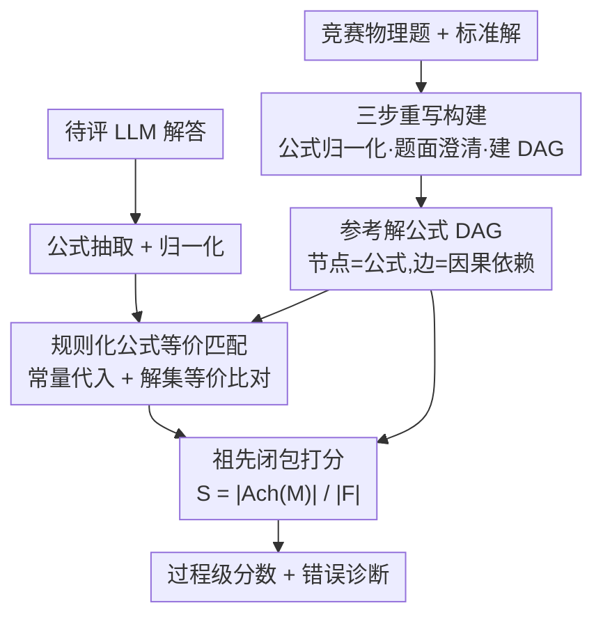

# PRISM-Physics: Causal DAG-Based Process Evaluation for Physics Reasoning

**会议**: ICLR 2026  
**OpenReview**: [https://openreview.net/forum?id=4PZMeopXzP](https://openreview.net/forum?id=4PZMeopXzP)  
**项目页**: [https://open-prism.github.io/PRISM-Physics/](https://open-prism.github.io/PRISM-Physics/)  
**代码**: 待确认（项目页有公开计划）  
**领域**: LLM 评测 / 物理推理 / 过程级打分 / Benchmark  
**关键词**: 物理推理、过程级评测、有向无环图、公式等价匹配、祖先闭包打分

## 一句话总结
PRISM-Physics 把竞赛物理题的参考解答建模成"公式 DAG"（节点是公式、边是因果依赖），配上一套纯规则的物理公式等价匹配器和有理论最优性证明的"祖先闭包打分"，做出第一个对物理推理过程逐步打分的 benchmark，比 LLM-as-judge 和现有线性过程打分更贴近物理专家评分。

## 研究背景与动机

**领域现状**：数学（IMO）和编程（IOI）方向已经有成熟的竞赛级 benchmark 评测大模型推理，但物理竞赛长期被冷落。物理既要领域知识，又要建模假设、多步符号推导和精确数值计算，是衡量"科学推理能力"的好探针。

**现有痛点**：现有物理 benchmark 有三个硬伤。一是大多是选择题/填空题，只看最终答案，完全丢掉了推理过程，诊断价值极低；二是想看过程时普遍依赖 LLM-as-judge 打分，受幻觉、prompt 敏感、评分不一致困扰；三是少数尝试逐步打分的工作（如 PhysReason 的 PSAS-S）强行假设"步骤严格线性排列"或只做浅层表达式匹配，无法表达步骤间真实的依赖逻辑。

**核心矛盾**：物理推导本质是**非线性**的——解题过程会分叉、合并、复用中间结果。可现有打分策略要么"严格匹配"（换一种等价推导就判错、太苛刻），要么"前缀给分"（只要匹配到一个公式就把它之前所有步骤都算对、严重高估）。两种朴素策略都没有把"哪一步是哪一步的前提"这层因果结构刻画出来。

**本文目标**：构造一个能逐步、可解释、有理论保证地给物理推理过程打分的框架与 benchmark，同时去掉对 LLM 裁判的依赖。

**切入角度**：作者观察到，一份物理解答的逻辑骨架天然就是一个**有向无环图**——每个关键公式是节点，"v 由 u 推出"是一条边。只要把参考解表示成这种 DAG，"给分"就能顺着因果链只向前提（祖先）传播，既不像严格匹配那么死板，也不像前缀给分那么滥发。

**核心 idea**：用"公式 DAG + 祖先闭包打分 + 规则化公式等价匹配"替代"线性步骤序列 + LLM 裁判"，让过程级评分既有结构严谨性又有理论最优性。

## 方法详解

### 整体框架

PRISM-Physics 由两条线组成：**数据侧**把每道竞赛物理题的标准解答经过三步重写处理成一张参考解公式 DAG；**评测侧（PRISM-DAG）**拿到一份待评的 LLM 解答后，先抽取并归一化其中的公式，再用纯规则的等价匹配器逐一比对它命中了参考 DAG 里哪些节点，得到匹配集合 $M$，最后按"祖先闭包打分"算出一个 $[0,1]$ 的过程分。整条管线没有任何 LLM 裁判参与打分，因此可复现、可解释。

### 关键设计

**1. 三步重写的数据集构建：把杂乱的竞赛解答洗成机器可评的标准件**

直接拿网上的竞赛题解没法打分——符号写法不统一、题面有歧义、解答步骤之间的依赖也没显式写出来。作者设计了一条三阶段重写流水线，逐题处理：(1) **公式归一化**，把所有数学表达式统一成标准 LaTeX，符号等价规则和数值精度都统一；(2) **题面澄清**，重写题干，把所有变量定义和答案要求写明确，消除歧义；(3) **DAG 构建**，把解答表示成公式 DAG，并用规则检查 + LLM 检查双重校验。每一阶段都有一个 LLM 校验模块检查格式、清晰度和依赖规则，不合格就反馈纠正、重新生成。在此之上还做了有效数字、常量/变量显式定义、答案格式统一等细化。难度上用 LLM 评的概念深度、计算负担再加一个"基于熵的 DAG 复杂度"合成一个分数，映射成 Easy/Medium/Hard；并把题目归到力学、电磁、光学、原子核与粒子、热统、量子、固体与其他共七大物理领域，便于细粒度分析。

**2. 用公式 DAG 表示解答：把"步骤的因果依赖"显式编码进图结构**

这是全文的结构基石。形式上一份解答被系统地转成 DAG $G=(V,E)$：节点 $v\in V$ 是一条经过 canonicalize 的关键公式（物理定律、推导出的中间方程、化简关系等），边 $(u,v)\in E$ 表示"公式 $v$ 由公式 $u$ 推出"。这张图额外要满足两条约束让它既精炼又完备：**最小性**——去掉冗余代数步骤，只保留必要公式；**完备性**——每个节点都必须有一条有向路径连到某个被指定的"最终答案节点"，从而保证图里没有悬空或无关的步骤，每个保留的公式都真正因果地贡献于最终解。这样一来，正确性既可以局部评估（逐节点），也可以全局评估（沿整条依赖链），把推导变成机器可解释的逻辑骨架。作者进一步证明（Theorem 1）：在"因果性 + 最小证明者唯一"两条假设下，满足保序的"证明系统（justification system）"与前向边 DAG 之间存在双射——也就是说 DAG 恰好是证明系统的**最小编码**，既无冗余规则、又能通过闭包恢复完整证明系统，不丢信息也不引入多余复杂度。

**3. 祖先闭包打分：让分数只沿因果链向前提传播**

有了 DAG，关键问题是"匹配到某个公式后该给多少分"。作者定义**祖先闭包** $Ach(M):=M\cup Anc(M)$，其中 $Anc(M)$ 是 $M$ 中各节点在 DAG 里的全部祖先（反向可达）。打分策略很直观：一份学生解答匹配上的参考公式集合记为 $M$，最终分数是

$$S=\frac{|Ach(M)|}{|F|},$$

$F$ 是 DAG 里全部公式的集合。含义是：如果某条公式被匹配（算作"达成"），那么所有指向它的有向路径上的前置公式也视为达成——因为这些前提逻辑上是推出它的必要条件；于是把每个匹配公式连同它的全部前提取并集，分数就是被这个并集覆盖的参考公式占比。它一举绕开两种朴素策略的毛病：既不像严格匹配那样无视等价推导，也不像前缀给分那样把无关步骤一起算上。作者还证明了它的**最优性/可容许性**（Theorem 2）：任何满足"匹配包含、祖先闭包、可靠性（不越界给分）"三条公理的可容许打分策略 $S$，其结果必然等于 $Ach(M)$——换句话说祖先闭包打分等价于所有可容许策略，是这一类打分的精确刻画。

**4. 纯规则的物理公式等价匹配：不靠 LLM 也能判两条公式是否等价**

打分要先知道学生公式有没有命中参考节点，核心是判断"两条物理公式是否等价"。这比表达式比较难三层：**方程等价**（不是简单表达式）、**常量代换**（等价变量写法不同）、**单位换算**（同一量不同单位）。以往工作要么只比最终表达式、要么强制固定格式、要么交给 LLM 裁判（会幻觉）。作者提出两阶段算法：**[阶段一] 常量代入**——把某些变量替换成其表达式，变量、常量、单位统一归一到预定义形式；**[阶段二] 解集等价检验**——对含 $N$ 个变量的两条方程，随机挑一个变量作目标，其余 $N-1$ 个赋随机值，解出目标值，比较两条方程的解集是否一致，重复多轮，用"解集等价"作为"方程等价"的代理判据。整套匹配纯规则、可复现，不依赖任何启发式裁判。在评测时，待评解答先做公式抽取与归一化（丢掉语法错误或无关数字碎片），再逐条按此匹配进 DAG，最后交给祖先闭包打分。

## 实验关键数据

### 主实验：逐步评分 vs. 只看答案

作者在 benchmark 上跑了一大批前沿模型，给出最终答案准确率（Final）、步骤级准确率（Step）和响应时间，并按 Easy/Medium/Hard 分难度。核心结论是：**只看最终答案会严重低估模型的推理能力**——从 Easy 到 Medium，最终答案准确率会暴跌 40%+，在 Hard 上普遍跌破 10%；而步骤级评分显示模型即使最后做错，仍能在前面正确应用关键定律、推出有效中间方程而拿到部分分。

| 模型 | 设定 | Final-Avg | Step-Avg | 说明 |
|------|------|-----------|----------|------|
| GPT-5 (High) | 推理 | 29.36 | 54.13 | 文本设定最强 |
| GPT-5-mini (High) | 推理 | 26.01 | 48.78 | |
| Grok-4 | 推理 | 23.34 | 47.29 | |
| Gemini-2.5-Pro | 推理 | 23.99 | 41.19 | |
| Deepseek-Reasoner | 推理 | 23.25 | 43.39 | |
| Deepseek-chat | chat | 23.40 | 41.36 | 开源 chat 最强 |
| GPT-OSS-20B | 推理 | 8.72 | 16.27 | 整体垫底 |

可以看到即使最强的 GPT-5(High)，平均最终答案准确率也只有约 29%，物理竞赛推理对当前 LLM 仍是硬骨头；Step 分（约 54%）远高于 Final 分，印证"部分推导正确但终点失败"是普遍现象。多模态设定下加图普遍在 Step 层面带来更大增益（支撑中间推理），但对偏弱的小模型反而可能有害，因为物理题里的图常是"展示性"而非"信息性"。

### 评测框架对齐人类专家

作者随机抽 70 题（每领域 10 题）配 DeepSeek-V3 的文本解答，请两位物理专家（含一名 IPhO 金牌、一名顶尖物理博士）独立打分，分歧大时第三人裁定，用 Kendall's $\tau_b$ 衡量框架打分与人类的一致性。

| 方法 | $\tau_b$ ↑ | 渐近 p 值 ↓ | 置换 p 值 ↓ |
|------|-----------|------------|------------|
| LLM-as-Judge | 0.294 | 6.90×10⁻³ | 6.00×10⁻³ |
| PSAS-S | 0.213 | 2.20×10⁻² | 2.09×10⁻² |
| **PRISM-DAG** | **0.346** | **1.31×10⁻⁴** | **1.00×10⁻⁴** |

PRISM-DAG 取得最高 $\tau_b$ 和最低 p 值。原因分析：LLM-as-Judge 纯看结果、只给 0/1 二值分；PSAS-S 虽然是过程级但独立评估各步、不建模因果依赖；两者都是 LLM-based，而 PRISM-DAG 是非 LLM 的、显式刻画了步骤间因果，因此更贴近人类判断。

### 关键发现
- **难度敏感**：所有领域准确率都随 Easy→Hard 下滑，响应时间随难度上升；量子力学最难、热统最容易。
- **推理预算的代价**：提高 GPT-5-mini 推理档位能提分，但 medium 比 low 延迟高 129%、high 比 low 高 589%；GPT-5 的 medium 反而掉到 low 之下（疑似"想多但不够透彻"的 over-thinking），high 档才稳。
- **错误画像**：对每份解的第一个错误步骤做七类错误分类，主导错误是条件/假设错误（CAE）、推导计算错误（DCE）、建模与过程理解错误（MPUE）——说明 LLM 既难建立一致的物理假设，又难稳住代数推导。
- **训练价值**：只看最终答案会让难题奖励极稀疏，而步骤级分数提供了丰富的中间奖励信号，对 RL 微调和构造高质量训练数据很有价值。

## 亮点与洞察
- **把"评分"问题转成"图上闭包"问题**：祖先闭包打分把模糊的"该给多少过程分"变成 $|Ach(M)|/|F|$ 这样一个有定义、可计算、且被证明是唯一可容许解的量，这种"先公理化再证唯一性"的做法在 benchmark 设计里很少见，值得借鉴。
- **用解集等价做方程等价的代理**：随机赋值 + 解集比对绕开了符号方程等价判定的难题，工程上既快又稳，是一个可迁移到任何"判两条方程是否等价"场景的实用 trick。
- **过程信号既是评测也是监督**：作者明确指出 step-level 分可直接当 RL 的稠密奖励，把一个评测 benchmark 顺手变成训练信号来源，这个"评测—训练"闭环视角很有启发。

## 局限与展望
- 作者承认目前只覆盖物理，但框架是 domain-agnostic 的，可扩展到数学、化学、生物；未来计划用该 benchmark 做后训练、研究过程信号在 RL 微调中的收益。
- 数据构建重度依赖 LLM 做归一化、题面澄清和 DAG 草构（再加规则/LLM 双校验），DAG 标注质量和"最小公式集"的选取本身带主观性，参考 DAG 若有偏差会直接影响打分上限。
- 等价匹配的"解集等价"是概率代理（随机赋值多轮），对某些病态/退化方程可能误判；常量代入和单位归一依赖预定义规则表，覆盖面有边界。
- 人类对齐实验仅 70 题、单一被评模型（DeepSeek-V3），$\tau_b=0.346$ 虽显著优于 baseline，但绝对值并不算高，说明过程级评分与人类完全一致仍有距离。

## 相关工作与启发
- **vs OlympiadBench / SeePhys / PhyBench**：这些物理 benchmark（即便提出 EED score 这类指标）主要仍评最终答案、无法表示或给出细粒度过程分；本文专攻过程级、且显式建模步骤依赖。
- **vs PSAS-S（PhysReason）**：PSAS-S 是最接近的过程级工作，但它假设步骤严格线性、只比表达式、独立评估各步不建模依赖；PRISM-DAG 用 DAG 表达非线性因果、用祖先闭包沿前提传播给分，对齐人类更好（$\tau_b$ 0.346 vs 0.213）。
- **vs LLM-as-Judge**：LLM 裁判受幻觉、prompt 敏感、评分不一致困扰，且本质是结果导向的 0/1 打分；本文用纯规则等价匹配 + 图闭包打分，去掉裁判依赖，可复现、可解释。

## 评分
- 新颖性: ⭐⭐⭐⭐⭐ 把物理解答建模成公式 DAG 并给出有最优性证明的祖先闭包打分，是过程级评测里少见的"结构 + 理论"双管齐下。
- 实验充分度: ⭐⭐⭐⭐ 覆盖大量前沿模型、文本/多模态/推理档位、错误分类与人类对齐都有，但人类对齐样本偏小。
- 写作质量: ⭐⭐⭐⭐ 动机—结构—理论—实验链条清晰，定理与定义部分需要一点数学耐心。
- 价值: ⭐⭐⭐⭐⭐ 既补齐了物理过程级评测的空白，又把 step-level 信号通向 RL 训练，benchmark 与方法都可被后续工作直接复用。

<!-- RELATED:START -->

## 相关论文

- [\[ACL 2025\] PhysReason: A Comprehensive Benchmark towards Physics-Based Reasoning](../../ACL2025/llm_evaluation/physreason_a_comprehensive_benchmark_towards_physics-based_reasoning.md)
- [\[ICLR 2026\] CMPhysBench: A Benchmark for Evaluating Large Language Models in Condensed Matter Physics](cmphysbench_a_benchmark_for_evaluating_large_language_models_in_condensed_matter.md)
- [\[ICML 2026\] BuildArena: A Physics-Aligned Interactive Benchmark of LLMs for Engineering Construction](../../ICML2026/llm_evaluation/buildarena_a_physics-aligned_interactive_benchmark_of_llms_for_engineering_const.md)
- [\[ICLR 2026\] FinSearchComp: Towards a Realistic, Expert-Level Evaluation of Financial Search and Reasoning](finsearchcomp_towards_a_realistic_expert-level_evaluation_of_financial_search_an.md)
- [\[ICLR 2026\] PrefDisco: Benchmarking Proactive Personalized Reasoning](prefdisco_benchmarking_proactive_personalized_reasoning.md)

<!-- RELATED:END -->
