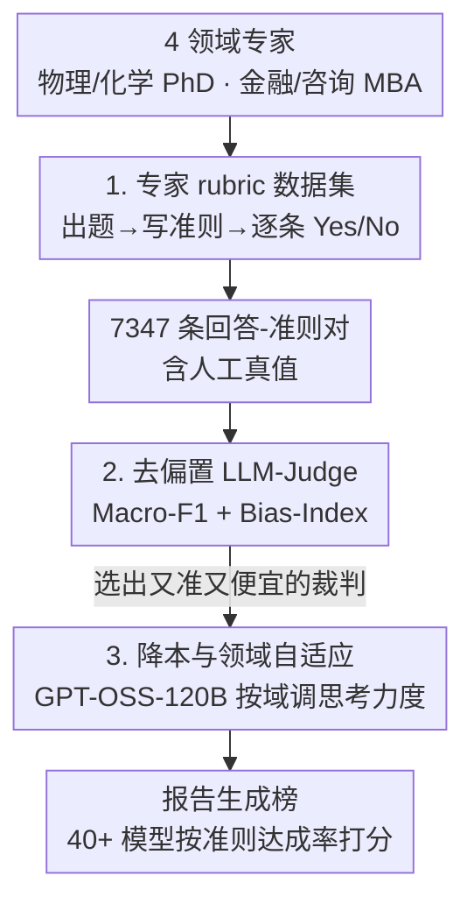

# ProfBench: Multi-Domain Rubrics requiring Professional Knowledge to Answer and Judge

**会议**: ICLR 2026  
**OpenReview**: [https://openreview.net/forum?id=VwNzKPqBxk](https://openreview.net/forum?id=VwNzKPqBxk)  
**代码**: https://github.com/NVlabs/ProfBench （数据 [HuggingFace](https://huggingface.co/datasets/nvidia/ProfBench)）  
**领域**: LLM评估 / 基准测试  
**关键词**: rubric 评测, 专业领域, LLM-as-Judge, 自我增强偏置, 报告生成

## 一句话总结
ProfBench 用物理/化学博士与金融/咨询 MBA 专家亲手撰写的 7000+ 条「回答-评分准则」对，搭起一个跨 4 个专业领域、需要真专业知识才能答也才能判的 rubric 评测基准，并配套一个去偏置、便宜 2-3 个数量级的 LLM-Judge，发现连 GPT-5-high 也只能拿 65.9% 总分。

## 研究背景与动机
**领域现状**：大模型的能力评测高度依赖「答案好不好验证」。数学（AIME）、竞赛编程（LiveCodeBench）、精确指令跟随（IFBench）这些任务之所以热门，正是因为可以用一段脚本或单元测试自动判对错，从而支撑 RLVR（带可验证奖励的强化学习）。科学领域的评测（MMLU-Pro、GPQA、HLE）也被迫退化成单选或短答案 span，只为了「有唯一正确答案」。

**现有痛点**：但现实世界里有价值的专业任务——读一堆专业文档、综合信息、写一份多页报告——根本没有唯一正确答案，无法套用上述验证方式。已有的 rubric 类基准要么只覆盖单一领域（PaperBench 限于复现 ML 论文、HealthBench 限于医疗），要么虽然号称多领域却质量堪忧：DeepResearch-Bench RACE 的题目「巴菲特和芒格的投资哲学是什么」一个本科生几次搜索就能答，而且它的评分准则和参考答案都由 Gemini-2.5-Pro 合成，导致 Gemini-2.5-Pro 自己在 4 个维度上拿到 >97% 的虚高分。

**核心矛盾**：「任务要够专业、够真实」与「评分要可验证、可负担、还得公平」这几件事很难同时满足。专业 rubric 必须请真专家手写（贵、慢、难招），而用 LLM 当裁判又会带来自我增强偏置（模型偏爱自家或同族模型的回答），跑一遍还可能花掉上千美元。

**本文目标**：(1) 造一个跨多个专业领域、由真专家手写 rubric 的硬基准；(2) 配一个既贴近人类标注、又对各家模型公平、还便宜到社区能负担得起的 LLM-Judge；(3) 用它系统性地测一遍 40+ 个模型，看专业领域上谁强谁弱、思考到底有没有用。

**核心 idea**：把「复杂专业问题」拆成一组「好回答必须满足的二元准则」，让专家写准则、让一个经过去偏置和降本改造的 LLM 来逐条判断是否满足，从而把无法验证的开放式专业任务变成可量化、可复现的评测。

## 方法详解

### 整体框架
ProfBench 不是一个模型方法，而是一条「数据采集 → 裁判遴选 → 模型评测」的评测流水线。输入是 4 个专业领域（物理 PhD、化学 PhD、金融 MBA、咨询 MBA）专家提出的真实工作任务，输出是一张能同时排「谁更会当裁判」和「谁更会写报告」的双榜单。整条管线分三段：先由专家完成「出题 → 写准则 → 给三个模型的回答逐条打 Yes/No」拿到 7347 条带人工真值的回答-准则对；再把这些真值当标尺，去 benchmark 一大批 LLM 当裁判的能力（用 Macro-F1 衡量与人类的一致性、用 Bias-Index 衡量公平性），选出一个又准又便宜的最优裁判；最后用这个裁判去给 40+ 个模型生成的报告打分，得到报告生成榜。

### 关键设计

**1. 专家手写的多领域 rubric 数据集：把开放式专业任务拆成可判定的二元准则**

针对「真实专业任务没有唯一正确答案、无法验证」的痛点，ProfBench 把每个任务分解成一组独立可用的评分准则，好回答必须逐条满足。数据由 8 个国家的 38 位专家产出，44.7% 持 PhD、18.4% 持 MBA，平均毕业后 5.24 年从业经验，全程**禁止使用任何 LLM**。每位专家完整走「出题（Prompt Ideation）→ 写准则（Rubric Creation）→ 标注回答（Response Annotation）」三步，每个任务花 10-20 小时，且每人最多贡献 5 个任务以保证多样性。出的题刻意设计得连 2025 年 7 月最强的 o3 / Grok4 / DeepSeek R1-0528 都难住——通常是会让初级同事去做、最终产出一份多页报告的多子问题任务（如金融 MBA 那道分析 IFFIm 如何在资本市场为疫苗融资的投资备忘录题）。每个任务写 15-60 条准则，每条带描述、理由、重要性和一个或多个类型标签；准则按内容分为 Reasoning（占 62.9%，判逻辑正确性）、Extraction（34.1%，判信息检索准确性）、Style（3.0%，判格式与清晰度）。最终得到 80 个任务、4 域各 20 个、共 7347 条回答-准则对。质量把控很硬：41.4% 的准则在评审中被标为「需改进」，且做了交叉验证——另请两位同领域专家重标 1127 条，Fleiss' $\kappa = 0.912$，说明标注高度可信。

**2. 去自我增强偏置的 LLM-Judge：用 Bias-Index 把「公平」量化进总分**

光看裁判与人类一致不够，因为 LLM 有自我增强偏置——会给自家或同族模型的回答虚高打分。ProfBench 把任务设计成一个二分类的 NLI/文本蕴含问题：给裁判「回答 + 单条准则」，问是否满足（Yes/No），且**故意不给原始题目**（准则本就设计为可独立使用，给题目反而会干扰裁判）。一致性用 Macro-F1 衡量。公平性则用自定义的 Bias-Index：先对每个被评模型算偏置 $\frac{1}{N}\sum_{i=1}^{N}(c_i^{\text{model}} - c_i^{\text{human}})$，即裁判预测的准则达成与人类真值之差的平均；再在三个被评模型（o3、Grok4、R1-0528）上取最大偏置减最小偏置作为 Bias-Index。Bias-Index 越接近 0，说明裁判没有相对地偏袒或打压某家模型。最终的总分定义为 $\text{Overall} = \text{Macro-F1} - \text{Bias-Index}$，把「准」和「公平」拧成一个可比的数。结果显示这套设计能把跨三家模型的偏置压到不超过 1%，且 GPT-4.1 裁判在三次独立运行间 Macro-F1 与 Bias-Index 波动 <0.2%，稳定到只需跑一次就够。

**3. 降本与领域自适应裁判：把评测成本砍掉 2-3 个数量级**

要让基准对社区可负担，裁判不能贵。ProfBench 在推理设置上做文章：非推理 LLM 只生成 1 个 token（Yes/No），推理 LLM 最多生成 32000 token，使得非推理裁判比推理裁判便宜快约 2-3 个数量级。在 benchmark 完 40+ 个裁判后，作者并不无脑选最强的专有模型，而是综合「Overall 分 + 运行成本」选了开源的 GPT-OSS-120B。更巧的是观察到：高思考力度版本在物理、化学和 Style 类准则上更强，低思考力度版本在其余准则上更优——于是按「领域/准则类型」动态切换思考力度（物理/化学/Style 用 high effort、其余用 low effort）。这个领域自适应裁判达到 78.2% Overall，**追平最强专有模型 Gemini-2.5-Pro，却只花它 1.68% 的成本**（\$0.70 vs \$41.46，而对比 PaperBench JudgeEval 的 \$1320 更是天壤之别）。一半数据公开、一半留作私有集以缓解测试污染。

### 一个例子：金融 MBA 任务怎么被评
以「评估某投行新设健康金融业务单元、研究 GAVI 通过 IFFIm 在资本市场融资」这道题为例：专家先写出一道含 6 个子问题、明确要求「投资备忘录风格、以文字为主、少用表格」的多页报告题；再写出几十条准则，如 Extraction 类「指出 IFFIm 违反流动性政策会损害其评级」、Reasoning 类「指出疫苗是全球最具成本效益的健康投资之一」、Style 类「清晰呈现结论以便有效使用」；接着让 o3/Grok4/R1-0528 各生成一份回答，专家逐条判 Yes/No 并写理由。评测时，裁判拿到「某模型的回答 + 单条准则」（不含原题），判是否满足，最后按准则重要性加权（additional=1、minor=2、major=3、critical=4）算达成率，得到该回答的分数。

## 实验关键数据

### 主实验：LLM 当裁判（与人类一致性 + 公平性）
裁判榜的核心结论是「专有模型领先，但开源紧追且便宜得多」。

| 裁判模型 | Macro-F1 (All) | Bias-Index ↓ | Overall ↑ | 成本(\$) |
|--------|------|------|------|------|
| Gemini-2.5-Pro (Thinking) | 79.2 | 1.0 | **78.2** | 41.46 |
| GPT-OSS-120B（领域自适应思考力度） | 78.7 | 0.5 | **78.2** | **0.70** |
| o3-low | 78.7 | 2.3 | 78.7→76.4 | 14.01 |
| GPT-4.1（1 token/任务，非推理最佳） | 76.3 | 0.9 | 75.4 | 11.31 |
| Kimi-K2-Instruct-0711（开源非推理） | 77.6 | 2.4 | 75.2 | 0.81 |
| GPT-4.1-nano | 67.9 | 13.8 | 54.1 | 0.56 |

非推理类里 GPT-4.1 最佳（75.4%），开源 Kimi-K2-0711 只差 0.2% 却仅花其 7.16% 成本；推理类里 Gemini-2.5-Pro 称王（78.2%），开源 GPT-OSS-120B-low 仅差 1.5% 却只花其 1.21% 成本。最终领域自适应版 GPT-OSS-120B 以 1.68% 的成本追平 Gemini-2.5-Pro。

### 主实验：LLM 当报告生成器
即便用最强裁判去评，这个基准也极难。

| 模型 | Physics | Chemistry | Finance | Consulting | Overall |
|------|------|------|------|------|------|
| GPT-5 (high) | 49.3 | 70.6 | 63.7 | 80.0 | **65.9** |
| o3 | 46.1 | 61.8 | 60.9 | 76.8 | 61.4 |
| Gemini-2.5-Pro | 46.8 | 66.3 | 54.0 | 74.2 | 60.3 |
| GPT-OSS-120b（开源最佳） | 49.1 | 55.3 | 45.5 | 69.4 | 54.9 |
| DeepSeek-V3.1 (Thinking) | 44.8 | 59.8 | 43.3 | 67.4 | 53.8 |

最强的 GPT-5-high 也只有 65.9%，与 HealthBench（GPT-5 67.2%）难度相当，却远难于 AIME 25（94.6%）、GPQA-Diamond（87.0%）。领域上物理最难（49.3%），其次金融、化学、咨询。

### 关键发现
- **思考不一定有用，要看怎么比**：同一模型开/关思考通常小幅提升（0.3-4.8%），GPT-5 从 minimal 到 high 递增 4.8%；但若是「同尺寸、分别为指令跟随和思考训练的两个模型」相比，思考版反而可能更差——Qwen3-30B-Thinking 只有 44.6%，而 Instruct 版 49.3%，原因之一是 Instruct 版回答更长（11167 vs 4757 字符）。
- **思考越多偏置越大**：增大思考力度普遍提升与人类的一致性，但也增大对特定模型（尤其 o3）的偏置，可能是自我增强偏置随思考加深而放大——这正是要把 Bias-Index 纳入总分的实证理由。
- **规模有用但很快饱和**：同族内大模型更强，但收益递减；GPT-5-mini 比 nano 提升 10.2%，GPT-5 比 mini 只提升 5.6%；llama-3.1-70B→3.3-70B（+3.4%，换 post-training 配方）的跃升甚至大于 70B→405B（+0.9%，纯堆规模）。
- **开源在金融上差距最大**：闭源 vs 开源在物理上差 <1%，化学/咨询差 9.2%/9.6%，金融差最大达 15.0%——可能因开源模型偏重 Code/Math 类基准（与物理解题路数相近），而对化学、咨询、金融关注不足。

## 亮点与洞察
- **「Overall = Macro-F1 − Bias-Index」是个可复用的裁判设计范式**：很多 LLM-as-Judge 工作只报一致性，ProfBench 把「公平性」显式量化并直接扣进总分，逼着裁判既准又不偏心，这个思路可迁移到任何用 LLM 当裁判的评测里。
- **领域自适应思考力度**是个便宜的好 trick：发现「物理/化学/Style 吃思考、其余不吃」后按域切 high/low effort，用一个开源模型以 1.68% 成本追平顶级专有裁判，对预算有限的研究者极友好。
- **「禁止 LLM 介入标注」是它对 DeepResearch-Bench 的针对性修正**：用合成准则会引入对生成模型的系统性偏袒（Gemini 虚高 97%），ProfBench 全程人工 + 交叉验证（κ=0.912）把这条堵死。
- **「验证比求解简单，但不该限制能训什么任务」**这个出发点很有启发：rubric 分解让本来不可验证的开放式专业报告变得可量化，为把 RLVR 扩展到真实高价值任务铺了路。

## 局限与展望
- 数据规模受限于专家招募的高成本——80 个任务、38 位标注者，虽与 PaperBench/HealthBench 同量级，但领域内任务覆盖仍有限。
- 只覆盖文本模态、英文、且禁用专有文档（只能用公网可查资料），与真实专业工作中常见的多模态、非公开材料场景有差距。
- 一半数据留作私有集以防污染，意味着公开可复现部分只有一半；且裁判的偏置只在 o3/Grok4/R1-0528 三个模型上度量，对更广模型族的公平性是否成立未充分验证。
- Bias-Index 用「max−min 偏置」定义，对仅三个参照模型较敏感，参照集换了结论可能漂移。

## 相关工作与启发
- **vs PaperBench / HealthBench**：同为专家 rubric + LLM-Judge 的范式，但二者各限于单一领域（复现 ML 论文 / 医疗对话），ProfBench 把它扩展到物理/化学/金融/咨询 4 个专业领域，且额外解决了裁判去偏置与降本（PaperBench JudgeEval 一次要 \$1320，ProfBench-Judge 只 \$0.70）。
- **vs DeepResearch-Bench RACE**：后者号称多领域 PhD 级，但题目教育型通才就能答、准则由 Gemini 合成未经专家验证，导致严重自偏袒；ProfBench 用真专家出题写准则、全程禁 LLM、交叉验证，对症修正了「假专业 + 合成偏置」。
- **vs MMLU-Pro / GPQA / HLE**：这些为了可验证退化成单选/短答案，测的是「考试式」知识；ProfBench 测的是「写出有真实价值的多页专业报告」，更贴近专家真正的工作产出。

## 评分
- 新颖性: ⭐⭐⭐⭐ 把多领域专家 rubric、裁判去偏置、降本三件事系统地拼成一个可负担的硬基准，范式扎实但单项技术非颠覆性。
- 实验充分度: ⭐⭐⭐⭐⭐ 40+ 模型 × 裁判榜 + 报告生成榜，思考/规模/开源闭源/成本多维分析齐全，交叉验证 κ=0.912。
- 写作质量: ⭐⭐⭐⭐ 动机清晰、对比表点明痛点，指标定义到位；表格密集但叙事顺畅。
- 价值: ⭐⭐⭐⭐⭐ 给「不可验证的专业任务」提供了可量化、便宜、公平的评测底座，对推动化学/金融/咨询等被忽视领域的进展有直接价值。

<!-- RELATED:START -->

## 相关论文

- [\[ICLR 2026\] ResearchRubrics: A Benchmark of Prompts and Rubrics For Evaluating Deep Research Agents](researchrubrics_a_benchmark_of_prompts_and_rubrics_for_evaluating_deep_research_.md)
- [\[ACL 2026\] DiningBench: A Hierarchical Multi-view Benchmark for Perception and Reasoning in the Dietary Domain](../../ACL2026/llm_evaluation/diningbench_a_hierarchical_multi-view_benchmark_for_perception_and_reasoning_in_.md)
- [\[ICML 2026\] InnoEval: On Research Idea Evaluation as a Knowledge-Grounded, Multi-Perspective Reasoning Problem](../../ICML2026/llm_evaluation/innoeval_on_research_idea_evaluation_as_a_knowledge-grounded_multi-perspective_r.md)
- [\[ICLR 2026\] Rethinking LLM-as-a-Judge: Representation-as-a-Judge with Small Language Models via Semantic Capacity Asymmetry](rethinking_llm-as-a-judge_representation-as-a-judge_with_small_language_models_v.md)
- [\[ACL 2026\] Multi-Task Reinforcement Learning for Enhanced Multimodal LLM-as-a-Judge](../../ACL2026/llm_evaluation/multi-task_reinforcement_learning_for_enhanced_multimodal_llm-as-a-judge.md)

<!-- RELATED:END -->
