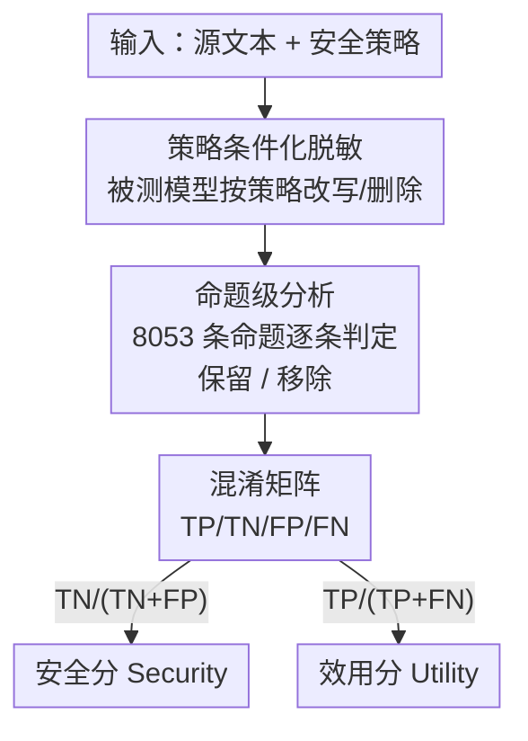

# RedacBench: Can AI Erase Your Secrets?

**会议**: ICLR 2026  
**OpenReview**: [https://openreview.net/forum?id=wf73W2xatC](https://openreview.net/forum?id=wf73W2xatC)  
**代码**: 待确认（提供 web playground：https://hyunjunian.github.io/redaction-playground/）  
**领域**: LLM评测 / 隐私安全 / 数据脱敏  
**关键词**: 文本脱敏、命题级评估、安全-效用权衡、策略条件化、隐私基准

## 一句话总结
本文提出 RedacBench——一个用「策略条件 + 命题级标注」来评测 LLM 文本脱敏（redaction）能力的综合基准，用 514 篇人工撰写文本、187 条安全策略和 8,053 条标注命题，同时量化「删干净敏感信息」的安全性与「保住非敏感信息」的效用，并系统评测了 11 个主流模型 × 3 类脱敏策略，发现越强的模型安全性越高但效用越难保住，二者存在明显权衡。

## 研究背景与动机

**领域现状**：LLM 在金融、法律、医疗等领域被大规模部署做摘要、检索等任务，频繁接触个人和组织的敏感数据。为防止泄露，**数据净化（data sanitization）/ 文本脱敏**——即检测并移除文本中的敏感信息——是目前最实用、应用最广的防护手段。

**现有痛点**：现有脱敏方法大量依赖**表层的关键词或模式匹配**（如基于命名实体识别 NER 删实体），它们假设「敏感信息 = 文本里可识别的实体」。这导致两类失败：要么删不掉**语义上敏感但没有显式标识符**的内容（如埋在上下文里的健康状况、商业机密），要么**过度删除**破坏文本可用性。结果是一种「虚假的隐私感」（false sense of privacy）。

**核心矛盾**：真实场景里「什么算敏感」是随上下文/组织而变的，无法穷举成固定类别；而现有基准要么只盯着「模型会不会无意生成敏感内容」，要么只覆盖 PII 这种狭窄定义，**没有一个标准化、可量化的方法来评测脱敏后敏感信息是否仍可被推断出来**。更关键的是，强 LLM 能从看似无害的文本里**推断**出职业、健康、人际关系等敏感属性，所以评测必须超越「实体是否被删」，转向「信息是否仍可被推断」。

**本文目标**：构建一个能跨领域、跨策略类型、在**策略约束下**评测 LLM 脱敏能力的基准，并同时刻画安全（删敏感）和效用（留无害）两个维度。

**切入角度**：作者把脱敏任务重新定义为「**策略条件化的选择性移除**」——把一条高层「安全策略」作为输入的一部分，让系统根据策略决定删什么；评测时不看 token 是否被删，而看**预先标注的每一条命题（proposition）在脱敏后是否还能被推断出来**。

**核心 idea**：用「命题级、可推断性」的评测代替「实体级、字面匹配」的评测，把脱敏质量拆成一个 TP/TN/FP/FN 混淆矩阵，从而同时量化安全分与效用分。

## 方法详解

### 整体框架

RedacBench 本质是一个「数据集 + 评测协议」。输入是一篇**源文本**和一条与之配套的**安全策略**，被测系统（某个 LLM + 某种脱敏策略）产出**脱敏后文本**；评测端拿源文本预先标注好的一组命题，逐条判断它在脱敏文本里**是否仍可被推断**，再结合每条命题的「敏感/非敏感」标签算出**安全分（Security）**和**效用分（Utility）**。

整套东西由三块拼成：(1) 一个**策略条件化的任务定义**，把"敏感性"外置成可变的策略输入；(2) 一个**命题级评测框架**，用混淆矩阵把脱敏结果量化成安全/效用两个分数；(3) 一个**自底向上、人在回路的数据集构建流程**，产出 514 文本 / 187 策略 / 8,053 命题。最后用这套基准去**评测多种脱敏策略 × 多个 SOTA 模型**，建立基线。

### 关键设计

**1. 策略条件化的脱敏任务定义：把"什么算敏感"从固定类别变成可变输入**

现有脱敏任务把敏感信息钉死成 PII 等固定类别，无法覆盖真实场景里「敏感性随上下文/组织而变」的事实。本文把任务重新定义为：系统同时接收**源文本**和一条**高层安全策略**，输出一段满足该策略的脱敏文本。策略既有微观的（如「讲师姓名须保密」），也有宏观的（如「所有战略业务计划须保密」），跨越不同抽象层级。这样「敏感」不再由数据集硬编码，而由输入的策略动态决定，更贴近金融、政府等真实运营环境——同一段文本配不同策略，该删的内容就不同。

**2. 命题级、可推断性评测框架：用混淆矩阵同时量化安全与效用**

这是本文方法的核心。作者把「信息」拆成**命题（proposition）**——可从源文本推断出的最小事实单元，且**包含上下文可推断的隐含信息**（如文本提到"在某公司开会"就可推出命题"说话者隶属该公司"），而非机械切句。每条命题先按策略标为**敏感/非敏感**，脱敏后再判定它**是否仍可被推断（保留/移除）**，由此构造混淆矩阵：TP=非敏感且正确保留，TN=敏感且正确移除，FP=敏感却被错误保留，FN=非敏感却被错误移除。两个核心指标定义为

$$\text{Security} = \frac{TN}{TN+FP}, \qquad \text{Utility} = \frac{TP}{TP+FN}$$

即安全分=成功移除的敏感信息比例，效用分=成功保住的非敏感信息比例。这套设计的妙处在于：评的是「信息是否还可被推断」而非「token 是否被删」，因此能抓住语义层/上下文推断层的泄露，是对 NER 式实体评测的根本性升级；同时把脱敏天然存在的「删太多 vs 删太少」摊成两个独立维度，让安全-效用权衡变得可测量。

**3. 自底向上、人在回路的数据集构建：让策略与命题都扎根于真实数据**

数据集走四步流程：① **源文本收集**——从个人（学生作文）、企业（Enron 邮件）、政府（Hillary Clinton 解密邮件）三类来源人工精选 514 篇含敏感内容的文本（个人 36 / 企业 342 / 政府 136）；② **命题抽取**——为每篇文本抽出语义命题，共 8,053 条；③ **策略制定**——找出可能敏感的命题，再**自底向上**地从这些命题归纳出通用安全策略并合并去重，共 187 条；④ **违规标注**——给每条命题标注它违反了策略集里的哪些策略，不违反任何策略的留空。为兼顾规模和质量，②③④ 采用**人在回路**：先让 LLM 跑一遍初稿，再由两位标注者（一位 AI 隐私安全方向研究者 + 一位有五年以上经验的从业者）复核、讨论直至共识。自底向上的关键在于：策略不是凭空写的，而是从真实命题反推出来的，保证策略与数据强对齐。

**4. 三类脱敏策略 + LLM 自动评估器：建立可比的基线**

为展示基准的用法，作者评测三类代表性脱敏方法：**Masking**（按策略做关键词匹配后做 token 级遮蔽，代表无上下文推理的表层删除）、**Adversarial Redaction（AR）**（改编自对抗式匿名化，让模型读源文+策略后改写、删违规内容，能做句法和语义层脱敏）、**Iterative Redaction**（把模型反复作用于自己的输出，每轮再删残留敏感内容，通常安全↑效用↓）。判定命题"是否仍可推断"由 **GPT-4.1-mini 自动评估器**完成；为保可靠性，作者在全部 8,053 条命题上测了它的错误率：把真命题误判为假的 FN 率仅 **1.45%**，把已不可推断的命题误判为仍可推断的 FP 率为 **2.62%**（211 例）——FP 偏高意味着报告的安全分可能被**略微低估**。由于同一评估器一致地施加于所有方法/模型，相对比较仍然可靠。

### 一个完整示例

以 Table 2 的 Phillip Allen 邮件为例（讨论一个 134 单元公寓项目的融资）：源文本被抽成 10 条命题，如"项目是位于 San Marcos 的 134 单元公寓""Phillip Allen 在寻找无需投资人个人担保的过渡融资"等。给定策略「所有敏感财务信息须保密」，其中涉及融资结构、投资人安排等命题被标为**敏感**，而"项目适合任何商学院教学"这类被标为**非敏感**。被测模型把原文改写成脱敏文本后，评估器逐条判定：敏感命题"被移除"则计入 TN（贡献安全分），非敏感命题"被保留"则计入 TP（贡献效用分）；图 1 中该样本最终得到 Security 44.6% / Utility 71.5%。这条例子直观说明了为什么需要命题级评测——同一段改写里，安全和效用是被分别记账的。

## 实验关键数据

### 主实验

在 11 个不同规模/推理配置的模型上评测三类方法（Masking、AR iter-1、AR iter-2），指标为安全分 / 效用分（越高越好，但二者权衡）。

| 模型 | Masking 安全/效用 | AR(iter1) 安全/效用 | AR(iter2) 安全/效用 |
|------|------|------|------|
| gpt-5 | 38.9 / 80.2 | 72.3 / 48.7 | 77.1 / 45.6 |
| gpt-5-mini | 41.8 / 75.8 | 63.4 / 57.2 | **80.9** / 37.6 |
| gpt-5-nano | 38.5 / 82.1 | 51.9 / 71.5 | 58.2 / 64.8 |
| gpt-4.1 | 36.4 / 82.0 | 68.2 / 55.1 | 77.0 / 44.4 |
| gemini-2.5-flash-lite | 35.9 / **85.1** | 52.2 / 70.6 | 60.2 / 62.1 |
| claude-sonnet-4 | **44.6** / 78.3 | 59.5 / 68.6 | 68.5 / 55.8 |
| qwen3-4b-2507 | 51.6 / 72.8 | 63.5 / 59.1 | 75.8 / 44.4 |

（节选 7/11 个模型）安全分最高是 **gpt-5-mini 用 AR 两轮达 80.9%**，但效用骤降到只剩 37.6%——删得越干净，留住的非敏感信息越少。

### 方法/模型分析

| 现象 | 数据 | 说明 |
|------|------|------|
| Masking 触顶 | 各模型安全分都在 ~36–52% 窄区间 | 表层遮蔽对当代 LLM 已达性能天花板，模型强弱无明显差异 |
| AR 拉开差距 | 推理增强模型安全分一致更高 | 语义脱敏依赖更强的基础推理能力 |
| 迭代换规模 | GPT-4.1-mini 跑 7 轮 ≈ GPT-5 跑 2 轮 | 一旦模型过某个门槛，多迭代可部分补偿模型规模差 |
| 迭代失效 | GPT-4.1-nano 多轮几乎无提升 | 模型基础能力太弱时迭代精炼无效 |
| 开源可竞争 | Qwen3-4B-2507 介于 GPT-4.1 与 GPT-4.1-mini 之间 | 配合先进脱敏策略，开源小模型也能打 |

### 关键发现
- **安全-效用是普遍权衡**：所有「模型 × 方法」组合都落在一条"安全↑则效用↓"的折中曲线上（图 2a），且模型间绝对差距不大，说明「高安全 + 高效用」的脱敏方法仍有很大改进空间。
- **Claude-Sonnet-4 折中最好**：在可比安全水平下能稳定保住更高效用，是较优的平衡点。
- **评估器有轻微偏差但相对可比**：FP 率 2.62% 使安全分可能被略微低估；由于评估器一致施加于所有方法，横向比较结论依然成立。

## 亮点与洞察
- **把"敏感"外置成策略输入**：用一条策略条件化整个任务，既反映真实运营环境的可变性，又让同一数据集能复用于不同敏感定义，是数据集设计上很省的一招。
- **"可推断性"而非"是否被删"**：命题级评测抓住了 LLM 时代真正的威胁——上下文推断式泄露。把信息拆成含隐含命题的最小单元，再用混淆矩阵把安全/效用解耦，这套量化框架可直接迁移到其他「选择性改写」任务（如内容审核、合规改写）。
- **自底向上造策略**：先从真实命题反推策略再合并去重，避免了"拍脑袋写策略导致与数据脱节"，这个 bottom-up + human-in-the-loop 的造数据范式值得借鉴。
- **迭代能换规模**的发现很实用：在算力/模型受限时，多轮自我脱敏可逼近更大模型的效果。

## 局限与展望
- **只有经验性而非形式化的隐私保证**：用强 LLM 做对抗式推断来"模拟攻击"，给出的是安全的实用下界，而非差分隐私那种统计不可区分性的数学保证（作者主动承认，理由是形式化方法会严重破坏文本流畅度）。
- **评估器幻觉/数据污染风险**：若评估器 LLM 在预训练时见过源文档，它可能"凭记忆"判定被删信息仍可推断，从而误判。作者提议用「评估模型知识截止日之后发布的文档」来构建数据集以缓解。
- **效用普遍偏低**：即便 SOTA 模型也难在高安全下保住效用，说明现有脱敏策略远未成熟；作者明确告诫**勿在医疗/法律/金融等高风险场景部署全自动脱敏而不加人工监督**。
- **数据来源偏特定语料**：源文本集中在 Enron / Clinton 邮件与学生作文，领域覆盖虽分三类但仍有限，泛化到其他文体有待验证。

## 相关工作与启发
- **vs 传统 PII/NER 脱敏**：他们删显式实体（姓名、卡号、SSN）以合规 GDPR/HIPAA，假设"敏感=可识别实体"；本文用策略驱动 + 命题可推断性评测，能覆盖高层、上下文式的敏感内容，且不靠删实体而破坏连贯性。
- **vs SynthPAI 等属性推断基准**：SynthPAI 聚焦个人属性推断；RedacBench 把评测扩展到非个人领域的、策略定义的复杂敏感性，填补 PII 数据集覆盖不到的空白。
- **vs Adversarial Anonymization (Staab et al., 2025)**：本文把它改编为 AR 基线方法之一，但贡献在于提供了配套的命题级基准来评测这类改写策略，而非提出新脱敏算法。
- **vs 机器遗忘 / 差分隐私**：那些是 model-centric、针对训练数据记忆的防护；本文针对**推理时输入输出**的脱敏，是互补的一层防御——即便有完美遗忘/DP，仍需推理时保护用户新输入的敏感数据。

## 评分
- 新颖性: ⭐⭐⭐⭐ 命题级可推断性 + 策略条件化的评测视角，对脱敏评测是实质性升级，但属基准而非新算法
- 实验充分度: ⭐⭐⭐⭐ 11 模型 × 3 策略 × 多轮迭代，且报告了评估器自身的 FN/FP 率，较扎实
- 写作质量: ⭐⭐⭐⭐ 任务定义、指标、数据构建讲得清楚，配图直观
- 价值: ⭐⭐⭐⭐ 为隐私脱敏提供了标准化、可量化的评测工具与基线，对合规落地有现实意义

<!-- RELATED:START -->

## 相关论文

- [\[ICML 2026\] From Human-Level AI Tales to AI Leveling Human Scales](../../ICML2026/llm_evaluation/from_human-level_ai_tales_to_ai_leveling_human_scales.md)
- [\[ICLR 2026\] PACEbench: A Framework for Evaluating Practical AI Cyber-Exploitation Capabilities](pacebench_a_framework_for_evaluating_practical_ai_cyber-exploitation_capabilitie.md)
- [\[ICLR 2026\] Holistic Agent Leaderboard: The Missing Infrastructure for AI Agent Evaluation](holistic_agent_leaderboard_the_missing_infrastructure_for_ai_agent_evaluation.md)
- [\[ICLR 2026\] Rethinking LLM Evaluation: Can We Evaluate LLMs with 200× Less Data?](rethinking_llm_evaluation_can_we_evaluate_llms_with_200_less_data.md)
- [\[ICLR 2026\] Can You Hear Me Now? A Benchmark for Long-Range Graph Propagation and Beyond](can_you_hear_me_now_a_benchmark_for_long-range_graph_propagation_and_beyond.md)

<!-- RELATED:END -->
