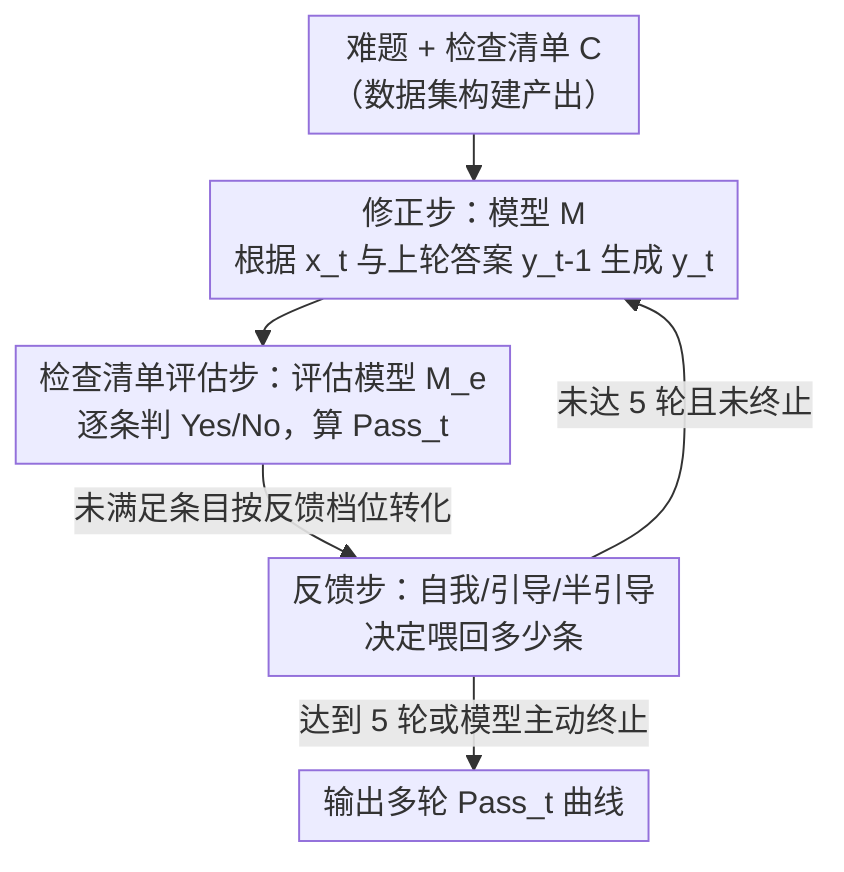

# RefineBench: Evaluating Refinement Capability of Language Models via Checklists

**会议**: ICLR 2026  
**OpenReview**: [https://openreview.net/forum?id=GYJFJz9Dy5](https://openreview.net/forum?id=GYJFJz9Dy5)  
**代码**: 待确认（论文提供 Website / Code / Dataset 链接）  
**领域**: LLM 评测 / Benchmark  
**关键词**: 自我修正、引导式修正、检查清单评测、多轮交互、推理模型

## 一句话总结
作者提出 RefineBench——一个覆盖 11 个领域、1000 道难题、用「检查清单」逐条打分的多轮修正评测基准，系统区分「自我修正（无反馈）」与「引导式修正（给反馈）」两种场景，发现即便是 Gemini-2.5-Pro、GPT-5 这样的前沿模型，自我修正五轮后也只能拿到 31.3%/29.1% 的极低分，而一旦明确告诉它「哪里错了」就能逼近满分，说明当前模型缺的不是「改」的能力，而是「发现自己哪里错了」的能力。

## 研究背景与动机
**领域现状**：让语言模型根据用户反馈修正自己的上一条回复，是智能系统的一项关键能力。真实数据里这种需求很常见——WildChat 的 159,134 条对话中约 10.24% 含有某种形式的修正请求。这些请求大致分两类：用户明确指出哪里要改的「引导式修正（guided refinement）」，以及只说「再改改」却不点明问题的「自我修正（self-refinement）」。

**现有痛点**：「模型到底能不能自我修正」这个问题被反复争论却始终没定论。早期工作（Self-Correct、Self-Refine）声称能改，后续分析（Huang et al. 2024）又说不行。作者指出过去研究有三个硬伤：其一，绝大多数实验只在数学题、代码这类「可验证」任务上做，换成写作、法律这类自由生成任务结论可能完全不同；其二，自我修正的表现严重依赖「喂了多少反馈」，但过去几乎没人精细控制反馈量；其三，新出现的推理模型（带 self-reflection 的长 CoT）是否还遵循旧结论，无人系统检验。

**核心矛盾**：现有修正类基准（CriticBench、CriticEval、RealCritic）大多把「修正」当作「批判质量」的代理指标，依赖模型自己生成的反馈，既不区分「外部反馈/无反馈」两档，也不能精细控制反馈多少，更没有同时覆盖可验证与不可验证任务。于是「能不能自我修正」无法被干净地测量出来。

**本文目标**：造一个能把「自我修正 vs 引导修正」「反馈给多少」「可验证 vs 自由生成」「11 个领域」全部解耦、可控、可逐条打分的统一评测台。

**切入角度**：用「检查清单（checklist）」做评测的最小单元——把每道题的合格标准拆成若干条二元判断项（Yes/No），那么「哪条没满足」天然就是反馈的来源；想测自我修正就什么都不给，想测引导修正就把没满足的条目当反馈喂回去，想测半引导就只喂一部分条目。

**核心 idea**：用「检查清单」同时充当评分标尺和反馈源，把修正能力拆成「能不能改对（已知反馈）」与「能不能自己发现要改什么（未知反馈）」两件事分别度量。

## 方法详解

### 整体框架
RefineBench 不是一个算法，而是一套「难题集 + 检查清单 + 多轮评测协议」。整体分两大块：**离线的数据集构建**产出 1000 道带检查清单的难题；**在线的评测协议**则让被测模型 $M$ 在最多 $t=5$ 轮里反复修改自己的答案，每轮由评估模型 $M_e$（用 GPT-4.1）拿检查清单逐条判 Yes/No，再据此决定是否、以及如何把反馈喂回下一轮。三种反馈档位（自我修正 / 引导修正 / 半引导修正）共用同一套清单，只是「喂回多少条」不同，从而把「修正能力」沿反馈强度这条轴展开成一条可比较的曲线。

下图是单道题在评测协议里的多轮回环（数据集构建在协议之前一次性完成）：

### 关键设计

**1. 检查清单评测框架与 Pass_t 指标：把模糊的「答得好不好」拆成可逐条核对的二元项**

自由生成任务（写作、法律论述）最难评的就是「没有唯一正确答案」。RefineBench 的做法是给每道题配一份检查清单 $C$，把「一个高质量回答应满足的标准」拆成平均 9.9 条（最多 23 条）二元判断项，例如「回答是否准确识别了 Passage A 的核心现象」「是否综合利用了 B–E 段的人类属性来解释」。评分用两个指标：$\text{Acc}_t = 100 \times \frac{N_c}{N}$ 衡量第 $t$ 轮满足的清单条目比例（$N_c$ 为正确条目数，$N$ 为总条目数）；而主指标 $\text{Pass}_t$ 是更严的全或无标准——只有当全部条目都满足（$N_c=N$）才记 1 分，否则记 0，再对所有样本取平均乘以 100。这种「全对才算过」的设计逼出了真实的难度：模型很容易满足大部分条目却总差一两条，于是 $\text{Pass}_5$ 长期卡在 32% 以下，留出了充足的提升空间，避免像 MATH-500 那样饱和到没有头部空间可测。

**2. 三档反馈协议：把「会改」和「会发现要改什么」拆开度量**

同一份检查清单被复用为反馈源，于是只需调节「喂回多少未满足条目」就能造出强度递增的三个场景。**自我修正**：$f_t=\varnothing$，完全不给反馈，模型每轮自己决定继续改还是终止，考的是「能不能独立发现并修复错误」。**引导修正**：把上一轮所有没满足的清单条目作为反馈喂进下一轮 query，考的是「明确知道哪里错时能不能改对」。**半引导修正**：在全部 $N$ 条里只提供一个子集 $N' = \lfloor N \times \text{ratio} \rfloor$ 条作为「已知反馈」，剩下 $N-N'$ 条是「未知反馈」需模型自己补出。三档放在一起，就能把「修正失败」干净地归因到底是「不会改」还是「没发现要改什么」——这正是本文最核心的诊断能力，也是过去基准做不到的。

**3. 难题集构建与清单质量保证：覆盖 11 领域、可验证与自由生成并存，并用回译过滤把清单噪声压到极低**

题目来自韩国多所大学的人文社科论述题、加州律考的法律论述题、斯坦福的数学统计题以及 HLE，共 1000 道、横跨 11 个领域（239 个学科）、Math 占比最大（32%），同时含「自由生成（free-form）」与「精确匹配（exact match）」两种任务类型；含图表的题目用 GPT-4o/4.1/Claude-Sonnet-3.7 转成详细文字描述并人工核对。清单则在原始题与参考答案基础上由多个 LLM 生成、作者迭代人工精修。质量保证用「**回译过滤（backtranslation）**」：让评估模型 GPT-4.1 对着参考答案逐条判清单项，凡是连参考答案都判「No」的条目说明清单本身有问题，予以剔除——这一步只删掉了 1.1% 的条目，说明生成的清单本就高质量；另招 6 位博士专家对 100 题（854 条）做人工核验，96.1% 被判为合适。这套流程保证了「逐条打分」的可信度，是整个评测台立得住的根基。

## 实验关键数据

### 主实验
评测覆盖 34 个前沿模型（开源/闭源、指令微调/推理四类），$M_e$ 固定用 GPT-4.1，最多 5 轮，指标为 $\text{Pass}_t$，$\Delta = \text{Pass}_5 - \text{Pass}_1$。

| 模型 | 自我修正 t=1 | 自我修正 t=5 | 自我修正 Δ | 引导修正 t=5 | 引导修正 Δ |
|------|------|------|------|------|------|
| Gemini-2.5-Pro | 29.5 | 31.3 | +1.8 | 94.7 | +65.2 |
| GPT-5 | 27.5 | 29.1 | +1.7 | 79.0 | +51.6 |
| Claude-Opus-4.1 | 18.7 | 20.8 | +2.1 | 98.4 | +79.7 |
| DeepSeek-R1 | 8.1 | 7.9 | -0.1 | 91.4 | +83.3 |
| GPT-4.1 | 23.4 | 21.8 | -1.6 | 95.5 | +72.2 |
| LLaMA-3.1-8B-Instruct | 1.4 | 1.0 | -0.3 | 30.1 | +28.7 |

核心结论：**自我修正全军覆没**——最强的 Gemini-2.5-Pro 五轮后也只有 31.3%，大多数模型 $\Delta$ 落在 −2.5% 到 0% 之间，只有闭源推理模型勉强录得 0–2.6% 的微弱正增益。**引导修正则天差地别**——绝大多数 ≥70B 开源模型与闭源模型在 5 轮内逼近满分（Claude-Opus-4.1 第 3 轮即达 94.3%，o3-mini 第 5 轮 98.2%），但 <8B 的小模型即便给了反馈也改不动（LLaMA-3.1-8B 仅 +28.7%）。

### 消融 / 分析实验
关键的「给评判标准但不给改法」实验（$\text{Pass}_t$）：

| 模型 | 设置 | t=1 | t=5 |
|------|------|------|------|
| LLaMA-3.1-70B-Instruct | 纯自我修正 | 4.7 | 4.6 |
| LLaMA-3.1-70B-Instruct | +提供评判标准 | 4.7 | 48.2 |
| Gemini-2.5-Pro | 纯自我修正 | 29.5 | 31.3 |
| Gemini-2.5-Pro | +提供评判标准 | 29.5 | 75.8 |

只要把完整清单（即「哪些条目没满足」，但不说怎么改）告诉模型，LLaMA-3.1-70B 第 5 轮就从 4.6 飙到 48.2（+43.6），Gemini-2.5-Pro 从 31.3 升到 75.8（+44.5）。这直接坐实了核心诊断：模型不是不会改，而是发现不了自己要改什么。

### 关键发现
- **瓶颈在「定位错误」而非「修复错误」**：给标准就大涨、半引导下「已喂条目改得好、没喂条目改不动」，两组实验共同指向同一结论——自我修正失败的主因是模型无法独立识别自身缺陷。
- **推理模型略强但仍很弱**：Qwen3-30B-Thinking（+1.4）优于其 Instruct 版（−1.6），o1（−0.2）优于 GPT-4o（−1.4），但绝对值依旧低得可怜。
- **DeepSeek 系列反而越改越差**：DeepSeek-R1 −0.1%、其 Qwen-32B 蒸馏版 −2.5%；分析发现 R1 首轮后推理 token 数骤降 69.7%，倾向「只反复确认最初改过的地方、判定无需再改即提前终止」。
- **思考更长 ≠ 修正更好**：Gemini-2.5-Pro 增大 token 预算单轮会更准，但多轮自我修正曲线几乎不随轮数上升；终止轮次与 $\text{Pass}_5$ 还呈统计显著的负相关（$R^2=-0.477$，p<0.01），即「磨蹭更多轮」并不带来更高分。
- **领域差异显著**：多数模型在 STEM 上自我修正几乎无增益（−1.2 到 +2.5），但 Law 领域出现明显正增益（Claude-Opus-4.1 +7.8、Gemini-2.5-Pro +5.0）；GPT-5 则相反，法律差、数学统计好。
- **评测成本可接受**：用 GPT-4.1 评 Gemini-2.5-Pro，自我修正每样本约 \$0.038、51.1 秒，引导修正约 \$0.028、22.9 秒。

## 亮点与洞察
- **把「修正能力」沿反馈强度轴解耦**是最巧的设计：同一份检查清单同时当标尺和反馈源，只调「喂几条」就造出自我/引导/半引导三档，干净地把「不会改」和「发现不了要改啥」分离开——这是过去用 LM 生成反馈的基准做不到的可控性。
- **Pass_t 全或无指标**避开了基准饱和陷阱：在 AIME24/MATH-500 上头部模型已无提升空间，而 RefineBench 用「全条目都满足才算过」逼出 32% 的低分天花板，为长期追踪修正能力的进步留足量程。
- **「给标准就涨 40 分」是全文最 aha 的实证**：它把一个长期争论的哲学问题（LM 能否自我修正）转成可操作的诊断结论——缺的是「自我诊断」，把研究方向从「教模型改」指向「教模型发现自己错了」。
- 可迁移：这套「checklist 既评分又反馈 + 反馈消融」的范式可直接搬到 agent 多轮纠错、代码自修复、写作助手等任意需要「自我评估」的多轮任务上做诊断。

## 局限与展望
- **评估器单点依赖**：全程用 GPT-4.1 当评估模型 $M_e$ 逐条判 Yes/No，评估器本身的偏差/盲区会传导到所有分数，论文未充分量化评估器误差对排名的影响。
- **清单生成仍含 LLM 主观性**：清单由多 LLM 生成 + 人工精修，回译过滤虽只删 1.1%，但「合格标准如何拆条」本身带主观判断，不同标注者可能给出不同清单粒度。
- **自由生成的 Pass_t 偏严**：全或无指标对长自由生成任务可能过于苛刻（差一条即 0 分），可能低估了部分「整体不错但细节漏项」的模型的真实可用性。
- **只测能力、不给解法**：论文定位为诊断基准，明确不提新的修正算法；如何让模型学会「自我定位错误」仍是开放问题，半引导设置或可作为训练信号的来源。

## 相关工作与启发
- **vs Huang et al. (2024)**：他们在 GSM8K 等可验证推理任务上测多轮自我纠错，结论是「没有高质量外部反馈就改不动」；本文把战场扩到 11 个含自由生成的领域并精细控制反馈量，既复现了「自我修正难」也进一步定位到「难在自我诊断」。
- **vs CriticBench / CriticEval / RealCritic**：这些基准把修正当作「批判质量」的代理、主要依赖 LM 自生成反馈、聚焦外部修正；RefineBench 是唯一同时支持外部/部分/内部三档反馈、用检查清单做细粒度控制、并覆盖可验证与不可验证任务、领域数最多（11）的多轮检查清单评测。
- **vs MT-Eval / MultiChallenge 等多轮基准**：它们覆盖追问、指令保持、编辑可靠性等多种交互维度，修正只是其中一项；本文专注「修正」并用统一清单透明地度量逐轮进步，把这一维度做深。

## 评分
- 新颖性: ⭐⭐⭐⭐ 「清单同时当标尺与反馈源 + 三档反馈解耦」是真正干净的新评测范式，问题本身较少全新理论
- 实验充分度: ⭐⭐⭐⭐⭐ 34 个模型、11 领域、自我/引导/半引导/给标准多组消融，诊断结论扎实自洽
- 写作质量: ⭐⭐⭐⭐⭐ 动机三连问、协议形式化、图表清晰，诊断逻辑层层递进
- 价值: ⭐⭐⭐⭐⭐ 把「LM 能否自我修正」从争论变成可测可追踪的诊断台，并明确把研究方向指向「自我错误定位」

<!-- RELATED:START -->

## 相关论文

- [\[ICLR 2026\] Evaluating Language Models' Evaluations of Games](evaluating_language_models_evaluations_of_games.md)
- [\[ICLR 2026\] ExpertLongBench: Benchmarking Language Models on Expert-Level Long-Form Generation Tasks with Structured Checklists](expertlongbench_benchmarking_language_models_on_expert-level_long-form_generatio.md)
- [\[ICLR 2026\] CMPhysBench: A Benchmark for Evaluating Large Language Models in Condensed Matter Physics](cmphysbench_a_benchmark_for_evaluating_large_language_models_in_condensed_matter.md)
- [\[ACL 2026\] Evaluating Memory Capability in Continuous Lifelog Scenario](../../ACL2026/llm_evaluation/evaluating_memory_capability_in_continuous_lifelog_scenario.md)
- [\[ICLR 2026\] Cost-of-Pass: An Economic Framework for Evaluating Language Models](cost-of-pass_an_economic_framework_for_evaluating_language_models.md)

<!-- RELATED:END -->
