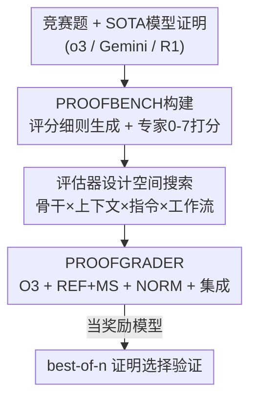

# Reliable Fine-Grained Evaluation of Natural Language Math Proofs

**会议**: ICLR 2026  
**OpenReview**: [https://openreview.net/forum?id=ky5iqwZSXI](https://openreview.net/forum?id=ky5iqwZSXI)  
**代码**: 数据集 [huggingface.co/datasets/wenjiema02/ProofBench](https://huggingface.co/datasets/wenjiema02/ProofBench)  
**领域**: LLM评测 / 数学推理 / LLM-as-a-judge  
**关键词**: 自然语言证明、细粒度打分、评测基准、奖励模型、best-of-n

## 一句话总结
针对"LLM 生成的自然语言数学证明无法可靠打分"这一空白，本文先构建首个细粒度专家标注集 PROOFBENCH（145 题 / 435 份证明 / 0–7 分），再系统搜索评估器设计空间（骨干模型、上下文、指令、工作流），得到 PROOFGRADER（O3 + 参考解与评分细则 + 简单集成），对专家分数的平均绝对误差低至 0.926，并在 best-of-n 选择中逼近人类上限。

## 研究背景与动机
**领域现状**：近两年 LLM 在数学推理上突飞猛进，但绝大多数进展集中在"有唯一可验证最终答案"的题目上——因为这类任务能用简单的答案校验作为强化学习奖励。

**现有痛点**：证明题（proof generation）完全是另一回事。很多证明题根本没有单一可校验的最终答案（如"证明对所有充分大的奇数 n……"）；即便有最终答案，光验证答案也不够，因为中间推理可能藏着致命错误。要推动证明生成，就必须先能可靠地"批改"自然语言证明，但目前缺一个可靠、细粒度的评估器。

**核心矛盾**：现有的几条路都不通。专家批改准确但慢且贵；形式化数学（如 Lean）虽然绝对严谨，却脱离了人类教育与科研里真正使用的自然语言，且自然语言到形式语言的自动翻译极其脆弱；用 LLM-as-a-judge 看似可行，但它对评估器设计（模型选择、可用上下文、评分细则、提示词）高度敏感，而这些因素几乎没人系统研究过。

**本文目标**：设计一个自动评估器 $E$，输入题目 $p$、模型生成的证明 $s$ 与可选上下文材料 $C_{\text{context}}$，输出一个细粒度整数分 $\hat{y}\in\{0,1,\dots,7\}$，且要与专家打分高度对齐、并能当奖励信号用。

**切入角度**：作者刻意**不训练**评估器，而是把问题看成在一个离散配置空间 $C$ 上的搜索——把"哪些设计因素真正提升打分质量"逐一拆开做对照实验。采用 0–7 分制（对齐顶级竞赛的评分标准），因为二元的"对/错"丢失了对证明质量的细粒度刻画。

**核心 idea**：用"专家细粒度标注集 + 设计空间系统搜索"找出最优评估器配置，证明一个精心配置的 LLM 评估器能在下游任务上逼近人类。

## 方法详解

### 整体框架
本文要解决"如何可靠地给自然语言数学证明打 0–7 分"。整条工作分三步走：先造一把"标准尺"——专家细粒度标注集 PROOFBENCH；再以它为测试台，沿四条轴系统搜索评估器的设计空间，看每个因素到底起多大作用；最后把最优配置组装成 PROOFGRADER，并用 best-of-n 选择任务验证它能否当奖励模型用。

### 关键设计

**1. PROOFBENCH：首个细粒度专家标注的证明评测集**

要研究"评估器准不准"，前提是有一把人类校准过的尺子，而已有资源要么规模太小、要么只有二元粒度。作者从 APMO、EGMO、IMO、Putnam、USA TST、USAMO 六大竞赛、2022–2025 四年里收集了 145 道证明题（尽量从官方 PDF 解析、配齐官方人写解答以保证可靠性），再用三个 SOTA 推理模型（OpenAI o3、Gemini-2.5-Pro、DeepSeek-R1-0528）各生成证明，共 435 份待评证明。标注分两阶段：**阶段一**由一个 LLM $M_{\text{MS}}$（最终选定 gemini-2.5-pro）根据题目与参考解自动生成"评分细则"（marking scheme）——列出"在什么条件下给分/扣分"以及"哪些平凡情形不该给分"，经专家反复打磨，约 85% 的细则被判为高质量；**阶段二**由五位具备 Putnam 或国家奥数水平的专家，把细则当"详细参考"而非"死板清单"来给每份证明打 0–7 分，特别注意给"用了与参考解不同的有效新方法"的证明应得的分。41% 的证明由多名标注者交叉打分，**1 分以内一致率达 87.5%**，分歧再讨论解决。数据本身就揭示了现状：整体均分仅 2.38、中位数 1，最强模型在不到 30% 的题上拿到 6 分以上；难度上 TST 最难（均分 1.26）、Putnam 最易（3.09）；且模型在知识截止日之后发布的新题上分数一致下滑，暗示存在数据污染或泛化缺口。

**2. 沿四条轴系统搜索评估器设计空间**

有了测试台，作者把"一个好评估器该长什么样"拆成可对照的几条轴，逐一回答"哪个因素真正重要"。单次（single-pass）评估器沿三条轴展开：**骨干模型**（比较 O3、GPT-5、Gemini-2.5-Pro、O4-MINI、R1、GPT-4O 六个，跨家族/规模/推理能力）、**上下文**（REF+MS 给参考解加评分细则、MS 只给细则、REF 只给参考解、NONE 无上下文）、**指令**（NORM 灵活遵循细则并允许等价的替代路径、STRICT 严格照细则扣分、BASIC 最少指引）。在此之上还扩展两类工作流：**集成（Ensemble）**——同一评估器独立跑多次再用均值/中位数/多数聚合以降方差；**分阶段（Staged）**——把复杂打分拆成"先判二元对错并定位关键错误 → 再据此给细粒度分"两步。这套搜索得出三条关键结论：① 骨干越强打分越准（O3 几乎在所有指标领先），无上下文时 O3 的 MAE 为 1.680，加上 REF+MS 后降到 0.964；② 上下文里**评分细则（MS）贡献了大头收益**，加参考解只对最强骨干 O3 有小幅额外提升；③ 指令风格要"看人下菜"——最强的 O3 配灵活的 NORM 偏差近零、最准，中档模型（Gemini、O4-MINI）反而需要更死板的 STRICT 来抑制过度给分。

**3. PROOFGRADER：把最优配置组装起来**

设计空间搜索的落点就是 PROOFGRADER：以 **O3 为骨干 + REF+MS 上下文 + NORM 指令 + 简单集成**。集成这一步看似平凡却很关键——对 O3 在 REF+MS 下独立跑五次，均值聚合把 RMSE 从最佳单次的 1.225 降到 1.169 并把排序一致性 Kendall-$\tau$ 从 0.540 提到 0.578，中位数聚合给出最低 MAE 0.926 与最高 WTA$_{\le1}$；其真正价值在于**压方差**——单次评估器即便上下文丰富也波动很大，集成把它稳住。值得注意的是，分阶段工作流并非万能：它能救中档模型（O4-MINI 的 MAE 从 1.367 降到 1.245）却会拖累强 O3（MAE 反升到 1.065），所以 PROOFGRADER 没有采用分阶段。最终它对专家分的 MAE 仅 0.926，远胜各种朴素基线。

### 评估指标
论文在 0–7 尺度上用逐题指标衡量评估器与专家的对齐：$\text{MAE}_p=\frac{1}{n}\sum_i|\hat{y}_{pi}-y_{pi}|$ 与 $\text{RMSE}_p=\sqrt{\frac{1}{n}\sum_i(\hat{y}_{pi}-y_{pi})^2}$ 衡量误差（RMSE 更惩罚大错）；$\text{Bias}_p=\frac{1}{n}\sum_i(\hat{y}_{pi}-y_{pi})$ 衡量系统性偏移（正值=过度给分）；$\text{WTA}_p(\le1)$ 衡量落在专家分 ±1 内的比例；并用 ties-adjusted 的 Kendall-$\tau_b$ 衡量题内排序一致性。

## 实验关键数据

### 主实验：骨干 × 上下文（单次评估器）

| 骨干 | 上下文 | RMSE ↓ | MAE ↓ | WTA≤1(%) ↑ | Kendall-τ ↑ | Bias ≈0 |
|------|--------|--------|-------|------------|-------------|---------|
| O3 | REF+MS | 1.273 | **0.964** | 76.5 | 0.502 | −0.008 |
| O3 | MS | 1.418 | 1.069 | 72.8 | 0.477 | −0.381 |
| O3 | NONE | 1.901 | 1.680 | 49.5 | 0.435 | 0.924 |
| GPT-5 | REF+MS | 1.353 | 1.055 | 73.2 | 0.532 | 0.295 |
| Gemini | REF+MS | 1.696 | 1.342 | 62.7 | 0.529 | 0.626 |
| GPT-4O | NONE | 3.402 | 3.001 | 31.9 | 0.208 | 2.614 |

骨干越强、上下文越全，误差越低；MS 贡献最大、O3 是最佳骨干。

### 集成 vs 分阶段（O3 骨干，REF+MS）

| 方案 | RMSE ↓ | MAE ↓ | WTA≤1(%) ↑ | Kendall-τ ↑ |
|------|--------|-------|------------|-------------|
| 最佳单次 | 1.225 | 0.944 | 77.1 | 0.540 |
| 集成-均值 | **1.169** | 0.940 | 69.7 | **0.578** |
| 集成-中位数 | 1.185 | **0.926** | **77.7** | 0.540 |
| 分阶段(Binary+Errors→Fine) | 1.375 | 1.065 | 73.0 | 0.444 |

集成稳定提升并降方差；分阶段反而拖累强骨干 O3（MAE 0.964→1.065），但对 O4-MINI 有效（1.367→1.245）。

### 下游：best-of-n 证明选择（O3 生成 16 候选 × 29 题，专家打分）

| 选择器 | n=16 平均人类分(/7) | 说明 |
|--------|--------------------|------|
| 二元评估器(Binary) | 2.48 | 无法区分多个"正确"证明的优劣 |
| **PROOFGRADER** | **4.14** | 弥合二元到上限 78% 的差距 |
| 人类上限(Oracle) | 4.62 | 性能天花板 |

PROOFGRADER 紧贴人类上限曲线，且优于计算量大得多的 Tournament（全配对）与 Knockout（单淘汰）等成对比较法。

### 关键发现
- **细粒度打分是奖励模型的关键**：二元评估器把所有"正确"证明压成一类，丢失排序能力，无法区分 5/7 的合格证明与 7/7 的优秀证明，在 best-of-n 上明显落后。
- **评分细则不可或缺**：无上下文（NONE）时 60%+ 的情况会高估证明正确性，且这种高估与证明质量强相关（$r=0.699$）——对低质量证明（0–2 分）平均高估 1.7 分；说明没有参考材料评估器难以判断证明进展。
- **失败模式对称分布**：过度给分（10.8%）与给分不足（12.2%）比例相近。过度给分常因依赖表面启发式（奖励"看着像细则结构 / 用了花哨框架"的解，哪怕核心论断是错的）；给分不足常因揪着早期小失误、重复扣同一处缺陷或苛求过细论证。代数和几何题失败最多（各约 25%）。
- **评分细则需与人类对齐**：用同 prompt 重采样或换模型生成的细则替换原细则后，各项指标均下降。

## 亮点与洞察
- **把"做评估器"重构成"搜配置"而非"训模型"**：不引入任何训练，纯靠在 backbone×context×instruction×workflow 的离散空间里做对照实验，结论清晰可复现，且直接给出可落地的最优配方。
- **离线指标 ↔ 下游效用的桥接**：不止报 MAE/RMSE，还用 best-of-n 证明 0.926 的低误差真能转化为"逼近人类的候选选择"，把"评估器准"和"能当奖励模型"两件事打通。
- **"简单集成 + 灵活指令"的朴素手段意外有效**：跑五次取中位数、用 NORM 让强模型自行映射等价推理路径，这两个不起眼的设计就把 O3 推到 SOTA，比成本高得多的成对比较法还好——可直接迁移到其他开放式生成的打分任务。
- **细则的"参考而非清单"哲学**：把 marking scheme 当详细参考、允许有效替代解，避免了把评估器训成只认标准答案路径的"死板批改机"。

## 局限与展望
- **依赖强闭源骨干**：最优配置建立在 O3 上，对算力/可及性要求高；开源 R1 作骨干时误差明显更大，落地成本与可复现性受限。
- **细则生成本身仍是瓶颈**：约 15% 的自动生成细则质量不达标，且评估器对"用哪份细则"敏感——细则换一个就掉点，整条管线的可靠性受制于细则生成质量。
- **同源偏差**：每个评估器在自家模型家族生成的证明上 MAE 最高，Gemini、R1 倾向给自己的输出打高分，用作 RL 奖励时可能引入自利偏差。
- **规模与范围**：145 题、435 份证明、best-of-n 仅 29 题，覆盖竞赛数学；能否推广到科研级证明或更长证明待验证。自己补充：0–7 整数尺度虽比二元细，但对"差一个引理"vs"完全跑偏"这类质性差异仍可能粗糙。

## 相关工作与启发
- **vs 形式化验证（Lean 等）**：形式化给出绝对确定性，但脱离自然语言、自动翻译脆弱；本文专攻自然语言证明的细粒度评估，与形式化路线互补。
- **vs 二元 LLM-as-a-judge**：以往把证明判为"对/错"，丢失排序能力；本文用 0–7 细粒度打分，在 best-of-n 上把分数从 2.48 提到 4.14。
- **vs 成对比较选择（Tournament / Knockout）**：成对法需 $O(\binom{n}{2})$ 或 $n-1$ 次比较、计算昂贵且大 n 时可能退化；PROOFGRADER 独立给每个候选打分即可，更省且更稳。

## 评分
- 新颖性: ⭐⭐⭐⭐⭐ 首个细粒度专家标注证明集 + 把评估器构建系统化为设计空间搜索，填补真实空白
- 实验充分度: ⭐⭐⭐⭐⭐ 六骨干×四上下文×三指令×两工作流全面对照，且有 best-of-n 下游验证与失败模式分析
- 写作质量: ⭐⭐⭐⭐ 结论清晰、指标定义完整，benchmark 与方法两条线交织叙述需读者耐心梳理
- 价值: ⭐⭐⭐⭐⭐ 直接给出可当奖励模型的可复现配方，对推动证明生成训练意义重大

<!-- RELATED:START -->

## 相关论文

- [\[ICLR 2026\] FRABench and UFEval: Unified Fine-grained Evaluation with Task and Aspect Generalization](frabench_and_ufeval_unified_fine-grained_evaluation_with_task_and_aspect_general.md)
- [\[ACL 2026\] IF-Critic: Towards a Fine-Grained LLM Critic for Instruction-Following Evaluation](../../ACL2026/llm_evaluation/if-critic_towards_a_fine-grained_llm_critic_for_instruction-following_evaluation.md)
- [\[ACL 2026\] LoCar: Localization-Aware Evaluation of In-Vehicle Assistants through Fine-Grained Sociolinguistic Control](../../ACL2026/llm_evaluation/locar_localization-aware_evaluation_of_in-vehicle_assistants_through_fine-graine.md)
- [\[ACL 2026\] Rethinking Meeting Effectiveness: A Benchmark and Framework for Temporal Fine-grained Automatic Meeting Effectiveness Evaluation](../../ACL2026/llm_evaluation/rethinking_meeting_effectiveness_a_benchmark_and_framework_for_temporal_fine-gra.md)
- [\[ACL 2026\] K-MetBench: A Multi-Dimensional Benchmark for Fine-Grained Evaluation of Expert Reasoning, Locality, and Multimodality in Meteorology](../../ACL2026/llm_evaluation/k-metbench_a_multi-dimensional_benchmark_for_fine-grained_evaluation_of_expert_r.md)

<!-- RELATED:END -->
