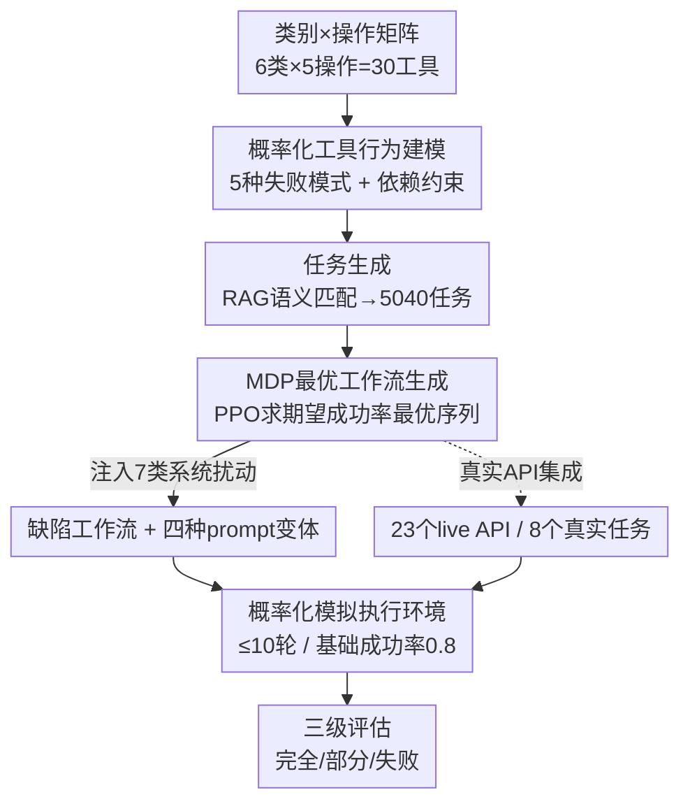

# ResiliBench: Evaluating Agentic Workflow Adaptation in Stochastic Environments

**会议**: ICLR 2026  
**OpenReview**: [https://openreview.net/forum?id=KTZ56LG7jZ](https://openreview.net/forum?id=KTZ56LG7jZ)  
**代码**: https://github.com/Archer222arc/ResiliBench  
**领域**: Agent / LLM 评测  
**关键词**: Agentic Workflow, 工具调用, 鲁棒性评测, MDP 最优工作流, 随机环境

## 一句话总结
ResiliBench 把"工具会概率性失败"和"用户给的工作流指令本身有缺陷"这两类真实部署不确定性当成评测的主角，用 30 个 API 的工具库自动生成 5040 个任务，并为每个任务配上 MDP 推导出的最优工作流和七类系统性扰动后的缺陷工作流，从而量化 LLM 在随机环境下的纠错与重规划能力。

## 研究背景与动机
**领域现状**：现有的工具调用 / 工作流执行 benchmark（ToolBench、ToolQA、Gorilla 等）主要衡量 LLM 能不能正确地调用 API、做多步推理、按指令完成任务。它们建立了"受控条件下"工具使用能力的基线。

**现有痛点**：真实部署里 LLM 面对的远不止"工具能正常工作 + 指令清晰"。API 会超时、会服务中断、会校验失败、会资源溢出，而且模型并不知道失败的具体原因；用户给的指令也常常不完整、有歧义、自相矛盾，甚至给出的工作流计划本身就是错的。但现有 benchmark 把这些当成"数据噪声"——它们筛选、清洗 API 和指令，主动把不确定性过滤掉，于是评不出模型"从错误中恢复"的能力。

**核心矛盾**：评测的可控性和真实部署的随机性之间存在冲突。要可控就得把噪声过滤干净，但过滤干净后就只剩下"指令完美 + 工具可靠"的理想场景，无法回答最关键的问题——当工具概率性失败、当给的工作流计划有缺陷时，模型还能不能把任务做完。

**本文目标**：构造一个把不确定性当作"系统研究对象"而非"待清除噪声"的 benchmark，分解为三个子问题：(1) 怎么可控地模拟真实 API 的概率性失败；(2) 拿什么当"正确工作流"的参照系；(3) 怎么系统地制造"有缺陷的指令"来度量鲁棒性。

**切入角度**：作者意识到，要衡量"鲁棒性"必须先有一个理论上的"最优行为"作参照。他们用 MDP 把"在已知工具失败概率下最大化期望成功率"形式化，求出最优工作流；再以这个最优工作流为基准，系统地注入七类扰动得到缺陷工作流。最优 vs 缺陷的成功率落差，就直接读出了模型的鲁棒性。

**核心 idea**：用"概率化工具错误模型 + MDP 最优工作流 + 七类系统扰动"三件套，把工作流执行的不确定性变成可控、可量化的实验变量。

## 方法详解

### 整体框架
ResiliBench 不是一个新模型，而是一条"自动造题 + 受控评测"的流水线。它的数据由三大件组成：任务规格（5040 个任务，跨 5 种类型、3 个难度）、工具注册表（30 个带概率行为和依赖约束的 API）、参考工作流（每个任务配 4 种 prompt 变体）。构建侧分三步走：先用"类别×操作"矩阵生成工具库并赋予错误模型，再用 RAG 语义匹配把操作序列映射到具体工具生成任务，最后用 MDP 求最优工作流并系统注入扰动得到缺陷工作流。评测侧把任务丢进一个概率化模拟执行环境（基础成功率 0.8，最多 10 轮对话），模型用 `<tool_call>` 之类语法逐个调用工具，系统返回带错误信息的反馈，最终按三级（完全成功 / 部分成功 / 失败）打分。

### 关键设计

**1. 概率化工具行为建模：把"API 会失败"做成可参数化的错误模型**

针对"现有 benchmark 把工具失败过滤掉、评不出纠错能力"这个痛点，ResiliBench 主动给每个工具注入概率性失败。工具库用两层结构组织：底层是 6 个功能类别（data processing、file operations、network、computation、integration、utility）× 5 个操作的矩阵，得到 30 个 `{category}_{operation}` 命名的工具；上层按工作流角色把它们分成 sources（reader/fetcher）、processors（parser/transformer/analyzer）、aggregators、outputs（writer/poster）、utilities，并据此建立依赖关系——processor 依赖 source、aggregator 依赖 processor、output 依赖 aggregator。每个工具显式声明 5 种失败模式：输入校验失败（INVALID_INPUT）、操作失败（OPERATION_FAILED）、超时（TIMEOUT）、计算错误（CALCULATION_ERROR）、资源溢出（OVERFLOW）。执行时模拟器以基础成功率 $\rho_{base}=0.8$ 为底，结合工具依赖、执行历史和失败模式概率性地决定本次调用成功还是返回某种错误。这样模型拿到的反馈里就会真实地出现各种 API 错误，且它不知道失败的底层原因（比如 random seed），必须靠观察反馈来适应——这正是真实部署里"工具不可靠"的核心刻画。

**2. MDP 最优工作流生成：给"什么是正确工作流"一个可计算的参照系**

要度量鲁棒性，得先有"最优行为"作基准。作者把工具序列选择形式化为一个 MDP：状态用复合表示，捕捉工具执行状态、进度追踪等；动作空间是结构化的工具调用；优化目标是在工具失败概率已知的前提下最大化期望累积奖励。奖励采用两阶段自适应策略——先是 coverage-focused 阶段，鼓励把该用的工具都发现并用上；再是 sequence-optimized 阶段，强调执行顺序和效率。策略用 PPO 训练，配 Transformer 网络、混合精度训练，以及跨 5 个难度阶段的课程学习。训练好的策略产出的工具序列，就是在该 MDP 建模假设下期望成功率最高的工作流。论文同时点明了三条理论上界：(i) 100%（受轮次/重试限制往往达不到）；(ii) 一个能预知每次工具调用随机种子、提前规避错误的策略所能达到的上界；(iii) 只知道工具失败概率、不知具体种子的策略上界。MDP 求的就是对上界 (iii) 的可解近似。这个"最优工作流"既被直接当成一种高质量 prompt，又是后面制造缺陷工作流的母本。

**3. 七类系统扰动 + 四种 prompt 变体：把"指令质量"变成可控实验变量**

针对"用户指令可能有缺陷"这一维度，作者不靠随机噪声，而是在 MDP 最优工作流上系统地注入七类受控扰动：顺序错误、工具误用、参数配置错误、缺失关键步骤、冗余操作、逻辑断裂、语义漂移。由此每个任务都拥有四种 prompt 变体——Baseline（只给任务描述/输入输出/工具说明，测基础指令遵循）、Chain-of-Thought（加显式推理指令，测推理规划）、MDP-Optimal Workflow（带最优执行计划，测工作流遵循）、Flawed Workflow（带系统性错误的执行计划，测错误检测和鲁棒性）。把同一任务在"最优工作流"和"缺陷工作流"下的成功率相减，就直接读出了模型对指令质量的敏感度；再按七类扰动分别看，就能定位模型具体怕哪种错误（实验显示先进模型对顺序错误和参数错误较抗、对语义漂移更脆弱）。

**4. 真实 API 集成：用 live API 验证模拟结论的可迁移性**

为了证明模拟环境不是空中楼阁，作者从 public-apis 仓库挑 API：每个候选 API 实测调用 20 次，按"成功率有波动（偶发超时/限流/中断）"和"延迟有显著波动"两个标准筛出天然带随机行为的 API，最终用 23 个 live API 设计了 8 个顺序工作流任务（如让模型依次调四个 API 取随机事实/笑话/编程名言/斯多葛名言，再编成社媒草稿）。关键是把真实组件对齐到已有基建：构造 MCP 兼容的工具注册（匹配模拟工具库的参数/返回/错误分类），并把任务格式对齐到统一的任务规格，从而模拟侧和真实侧能共用同一套 prompt 生成和评测方法。真实实验呈现出和模拟一致的鲁棒性模式，说明用可控模拟得到的结论确实能迁移到真实 API。

### 损失函数 / 训练策略
这里"训练"专指 MDP 最优工作流的求解：PPO + Transformer 策略网络，两阶段自适应奖励（先 coverage 后 sequence），跨 5 个难度阶段课程学习，混合精度训练。被评测的 LLM 本身不做任何训练，全部 zero-shot 推理。

## 实验关键数据

### 主实验
在 7 个模型（GPT-4o-mini、O3、Gemini-2.5-Flash、GPT-5-mini、Llama-3.3-70B、Qwen2.5-32B、DeepSeek-V3）上测三种 prompt 的完全成功率（Full Success Rate）：

| Prompt 类型 | 平均完全成功率 | 最高模型 | 说明 |
|------|------|------|------|
| Baseline | 51.4% | Gemini-2.5-Flash 54.3% | 只给基础信息 |
| Chain-of-Thought | 50.8% | GPT-4o-mini 56.1% | 加显式推理，平均反而略降 |
| MDP-Optimal Workflow | 62.1% | GPT-4o-mini 67.7% | 带最优执行计划，显著最高 |

一个值得注意的现象是 CoT 的平均成功率（50.8%）甚至略低于 Baseline（51.4%），说明在这种工具不可靠的工作流场景里，单纯加推理链并不必然有帮助；而显式给出 MDP 最优工作流能把平均成功率拉到 62.1%。

### 消融实验
最优 vs 缺陷工作流的对比，直接读出每个模型对"坏指令"的鲁棒性：

| 模型 | 最优工作流 | 缺陷工作流 | 落差 | 含义 |
|------|---------|---------|------|------|
| GPT-4o-mini | 67.7% | 62.2% | −5.5pp | 隐式纠错能力强，最鲁棒 |
| GPT-5-mini | 60.7% | 63.5% | +2.8pp | 几乎不受缺陷指令影响 |
| Qwen2.5-32B | 65.0% | 62.9% | −2.1pp | 较鲁棒 |
| DeepSeek-V3 | 56.8% | 58.4% | +1.6pp | 不受影响 |
| Gemini-2.5-Flash | 60.1% | 20.0% | −40.1pp | 严重崩溃，几乎照搬错误计划 |

平均看，最优工作流 62.1% vs 缺陷工作流 54.3%。

### 关键发现
- **对指令质量的鲁棒性是一个独立能力维度**：GPT-4o-mini 在缺陷指令下只掉 5.5pp，而 Gemini-2.5-Flash 暴跌 40.1pp（67.3% 直接失败），说明"能不能识别并纠正给定计划里的错误"和"模型整体能力"不是一回事。
- **工作流执行的涌现现象**：Qwen2.5 系列上，3B 完全成功率仅 0.5%（99.1% 失败），7B 骤升到 63.5%，32B/72B 都是 65.0%。从 3B 到 7B 暴涨 63pp，说明多步工具使用能力是在某个参数阈值附近"突然出现"而非平滑 scaling，32B 之后则收益递减。
- **任务越复杂越掉点**：从简单内容分析到复杂计算流水线，GPT-4o-mini 从 72.4% 降到 53.7%，各模型都呈一致下降趋势。
- **真实 API 验证一致**：23 个 live API、8 个任务上，GPT-4o-mini 缺陷指令掉 7.8pp、Gemini-2.5-Flash 掉 21.2pp，鲁棒性排序和模拟实验吻合。

## 亮点与洞察
- **用 MDP 给"最优工作流"一个可计算定义**：这是把"鲁棒性评测"从主观变客观的关键——有了 MDP 最优解作母本，缺陷工作流就能通过"在最优解上系统注入七类扰动"精确生成，最优 vs 缺陷的落差天然就是鲁棒性度量，而不是靠人工拍脑袋造坏例子。
- **把不确定性当主角而非噪声**：思路上反其道而行——别人筛掉概率性失败，它故意放大并参数化，这个视角转换让 benchmark 真正贴近生产部署。
- **七类扰动的细粒度归因可迁移**：把"坏指令"拆成顺序/参数/语义漂移等七类分别测，能定位模型具体怕哪种错误，这套扰动分类法可以直接搬到其他 agent 评测里做错误鲁棒性的细分诊断。
- **CoT 在工具不可靠场景里可能无效甚至有害**（平均 50.8% < Baseline 51.4%）是个反直觉的"啊哈"点，提示推理增强的收益高度依赖任务类型。

## 局限与展望
- **MDP 最优只是对理论上界 (iii) 的近似**：它依赖"工具失败概率已知"这一建模假设，求出的"最优"是在该假设下的最优，真实场景中失败概率往往未知或漂移，这个参照系的绝对性有保留。
- **完全成功的判定偏严格**：要求工具覆盖率 100%、顺序完全正确、有输出、有显式完成信号四项全满足，部分成功的边界（"满足至少两个条件"）有一定主观性，可能压低某些模型的分数。
- **真实 API 任务规模小**：只有 8 个任务、23 个 API，作为"可迁移性"验证够用，但难以支撑统计上稳健的真实世界结论。
- **改进思路**：可以把"工具失败概率未知/随时间漂移"也纳入 MDP 建模，评测模型在线估计可靠性并自适应的能力；或扩大真实 API 任务集做更细的领域覆盖。

## 相关工作与启发
- **vs ToolBench**: ToolBench 把评测扩展到更大的 API 集合、支持单/多工具任务，但它筛选、清洗 API 和指令以最小化噪声；本文反过来把概率性失败和缺陷指令当成核心研究对象，优势是评得出纠错/重规划能力，代价是更依赖模拟环境的真实性。
- **vs ToolQA**: ToolQA 区分知识型和工具依赖型问题来分析工具使用推理，但局限于单次工具调用；本文聚焦多步工作流执行在随机环境下的鲁棒性，是不同维度的评测。
- **启发**：MDP 最优解作基准 + 系统扰动生成对照样本，这套"用可计算最优行为锚定鲁棒性度量"的方法论，可推广到任何需要评测 agent 抗噪能力的场景。

## 评分
- 新颖性: ⭐⭐⭐⭐ 把不确定性当主角并用 MDP 给最优工作流可计算定义，视角和方法都有新意
- 实验充分度: ⭐⭐⭐⭐ 7 模型 × 4 prompt × 5040 任务 + 七类扰动归因 + scaling + 真实 API 验证，覆盖全面
- 写作质量: ⭐⭐⭐⭐ 结构清晰、三大组件和构建流水线讲得明白
- 价值: ⭐⭐⭐⭐ 直击 LLM 工作流落地的核心痛点，提供了可复用的鲁棒性评测范式

<!-- RELATED:START -->

## 相关论文

- [\[ICML 2026\] Agent World Model: Infinity Synthetic Environments for Agentic Reinforcement Learning](../../ICML2026/llm_evaluation/agent_world_model_infinity_synthetic_environments_for_agentic_reinforcement_lear.md)
- [\[ICLR 2026\] Agentic Reinforced Policy Optimization](agentic_reinforced_policy_optimization.md)
- [\[ICML 2026\] On Effectiveness and Efficiency of Agentic Tool-calling and RL Training](../../ICML2026/llm_evaluation/on_effectiveness_and_efficiency_of_agentic_tool-calling_and_rl_training.md)
- [\[ICLR 2026\] HackWorld: Evaluating Computer-Use Agents on Exploiting Web Application Vulnerabilities](hackworld_evaluating_computer-use_agents_on_exploiting_web_application_vulnerabi.md)
- [\[ICLR 2026\] Evaluating Language Models' Evaluations of Games](evaluating_language_models_evaluations_of_games.md)

<!-- RELATED:END -->
