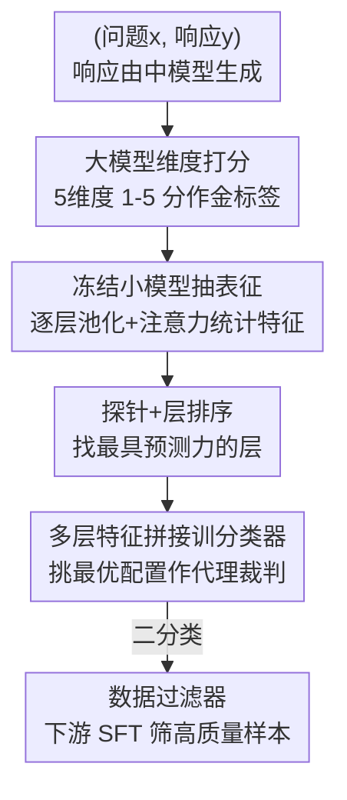

# Rethinking LLM-as-a-Judge: Representation-as-a-Judge with Small Language Models via Semantic Capacity Asymmetry

**会议**: ICLR 2026  
**OpenReview**: [https://openreview.net/forum?id=VAISvCsrvG](https://openreview.net/forum?id=VAISvCsrvG)  
**代码**: https://github.com/zhuochunli/Representation-as-a-judge  
**领域**: LLM评估 / 探针 / 数据筛选  
**关键词**: 无参考评估、表征探针、小模型、语义容量不对称、数据筛选

## 一句话总结
本文提出"表征即裁判"（Representation-as-a-Judge）范式：不让小语言模型生成评分文本，而是冻结它、直接从其隐藏层表征里用轻量探针分类器读出评估分数，在 GSM8K/MATH/GPQA 等推理评估任务上大幅超过同尺寸模型的 prompt 打分，并逼近大模型裁判，还能当数据过滤器提升下游 SFT。

## 研究背景与动机
**领域现状**：当前主流的无参考（reference-free）评估靠"LLM-as-a-Judge"——把一个强大的专有大模型（如 GPT-4）当裁判，用 prompt 让它对生成结果的质量打分。这种做法在摘要、复杂推理等任务上效果很好。

**现有痛点**：但 prompt 式评估有三个硬伤。其一，它必须做自回归解码，即便只想要一个分数也要逐 token 生成，计算昂贵；其二，依赖闭源大模型，内部机制不透明、不可验证；其三，效果高度依赖 prompt 工程，可复现性、鲁棒性和可扩展性都成问题。

**核心矛盾**：一个很自然的替代是用小开源模型当裁判，但直接 prompt 它们时打分又差又不稳。问题是：小模型评估差，到底是因为它"不懂"，还是仅仅因为它"表达不出来"？已有工作（Li et al. 2024、Waldis et al. 2024）发现小模型尽管生成弱，语义理解力却常常不输大模型——这暗示评估差可能源于表层生成的瓶颈，而非根本性的理解缺失。

**本文目标**：验证一个更细粒度的问题——即便生成很差，小模型的内部表征里是否已经编码了评估相关的信号？

**切入角度**：作者把这个直觉上升为可检验的假设——**语义容量不对称假设**（Semantic Capacity Asymmetry Hypothesis）：准确评估所需的语义容量远低于生成，评估可以落地在小模型的压缩中间表征上，即便生成本身仍需大模型完整解码。

**核心 idea**：用"探针读表征"代替"prompt 生成文本"来做评估——冻结小模型，只训练一个轻量分类器去拟合大模型裁判的分数，从而绕开解码的昂贵、不透明和 prompt 敏感。

## 方法详解

### 整体框架
方法实例化为 INSPECTOR（INternal Signal Probing and EvaluaTion Of Representations），一条三段式 pipeline：先用一个强大 LLM 给响应在多个评估维度上打"金标签"，再把同样的评估 prompt 喂给冻结的小模型抽取逐层表征，最后在这些表征上训一个轻量探针分类器去逼近金标签。训练完，这个探针分类器就成了一个解码无关、可在推理时极廉价运行的"代理裁判"。

整条流程的关键在于：金标签来自大模型（贵但只在构建数据集时用一次），而推理时只需要冻结小模型跑一次前向 + 探针分类器，没有任何文本生成。

### 关键设计

**1. 大模型维度化标注：把"评估"拆成 5 个可探测的语义维度**

要训探针就得先有金标签。本文沿用 ROSCOE、SOCREVAL 等工作的 rubric，把无参考推理质量拆成 5 个维度 $K$：语义一致性（步骤与答案是否忠于题目事实）、逻辑性（每步推理与算术是否合法）、信息量（是否包含验证答案所需的关键步骤）、流畅度、事实性。流程上先用一个**中等规模模型** $M_{med}$（10–50B，本文用 Llama-3-8B-Instruct）生成响应——故意不用最强模型，因为中等模型产出的质量分布更"参差"，好坏样本都有，利于后续探针学习区分。然后用一个强大裁判 $M_{large}$（本文用 DeepSeek-V3）对每个维度打 1–5 的标量分 $s_{i,k}=M_{large}(I_k(x_i,y_i))$，汇成探针数据集 $D_{prob}$。为防止某些分数档位过多导致类别失衡，作者按 5 个分数档里最少的那一档做下采样，构造类别平衡的数据集；分数既可作 5 分类目标，也可用阈值 $\tau$ 二值化成"高/低质量"的简单二分类。

**2. 逐层表征探针：从隐藏状态里"挖"出评估信号而非读输出文本**

这是范式转换的核心。痛点是小模型 $M_{small}$（0–10B）直接 prompt 打分与金标签差距很大。本文不看最终解码文本，而是把同一个评估 prompt $I_k(x_i,y_i)$ 喂进冻结的小模型，逐层提取隐藏状态 $H_i^{(\ell)}$ 和注意力权重 $A_i^{(\ell)}$，做多种池化得到一组互补的特征向量：mean、last、min、max、concat。例如均值池化 $r_{i,\text{mean}}^{(\ell)}=\frac{1}{S_i}\sum_{t=1}^{S_i}H_i^{(\ell)}[t,:]$，末 token 池化取最后一个非 padding token 的表征。除池化向量外，还从每层每个注意力头算注意力熵统计 $\mu_i^{(\ell)},\sigma_i^{(\ell)},\max_h e_{i,h}^{(\ell)}$，以及每个池化向量的范数、方差、熵。特征装配时把 PCA 降维后的池化向量、统计量、注意力摘要沿特征维拼成 $X^{(\ell,p)}$（式 4），所有依赖数据的变换（PCA、scaler 等）都放进交叉验证管线内做，避免信息泄漏。然后对每个 $X^{(\ell,p)}$ 训一个 logistic 探针、用分层交叉验证评估，按二分类或多分类性能给"层–池化–特征"配置排序。探针刻意保持最小容量——这样任何预测信号都只能反映模型自身的语义，而非探针自己学出来的。

**3. 多层特征拼接与最优分类器选择：把分散在不同层的信号聚成一个代理裁判**

探针阶段产出一份排好序的配置列表 $\pi$，但单层往往不够。本设计从 $\pi$ 里取 Top-K 个不重复的层，从排名最高的单层起步，按排名逐个尝试加入下一层、**只在性能提升时才保留**，从而贪心地拼出多层特征 $\tilde{x}_i^{(S,p)}=[r_{i,p}^{(\ell_1)};\dots;r_{i,p}^{(\ell_{|S|})}]$（式 5），需要时再附上各层注意力摘要。在每个候选特征装配上训一族简单可解释的分类器（逻辑回归、随机森林、小 MLP、线性 SVM），用任务相关的性能指标 $\bar a_\gamma$ 选最优配置 $(S^\star,p^\star,\theta^\star)=\arg\max \bar a_\gamma^{(S,p,clf)}$（式 6），$\gamma\in\{bin,multi\}$；平局时偏好更稳定（$\sigma$ 更小）、层数更少的配置。由于所有变体都在缓存好的隐藏表征上操作，搜遍这些组合几乎零额外算力。最终得到一个用少数几层、推理时比大模型便宜几个数量级的紧凑代理裁判。

### 损失函数 / 训练策略
没有端到端训练大模型——小模型全程冻结，只训探针/分类器。训练目标是拟合大模型金标签：多分类预测 1–5 原始分，二分类预测 $\mathbb{1}[s_{i,k}\ge\tau]$。关键超参：阈值 $\tau=4$（≥4 为高质量），PCA 维度 $d=50$，Top-K 取 $K=5$；评测统一报零样本 prompt 下的加权平均 F1。

## 实验关键数据

### 主实验
在 GSM8K、MATH、GPQA 三个推理基准上，对比 Msmall 直接 prompt 打分、微调小模型、RoBERTa 探针三类基线。

| 设置 | 指标 | 探针（本文） | 同模型 prompt | 提升 |
|------|------|------|----------|------|
| 多数任务平均 | 加权 F1 | 大幅领先 | 基线 | 多数 +20% 以上 |
| 二分类（数据过滤） | 加权 F1 | 80–90% | 偏低 | 可靠作过滤器 |
| 多分类（5 档） | 加权 F1 | 约 50–60% | 更低 | 任务本身难，仍领先 |

关键结论：探针远胜 prompt 推理——小模型生成差不代表它没掌握知识，关键信息已嵌在内部表征里、只是被最终解码"埋没"了；且这一现象在所有维度、不同尺寸/家族的小模型（Qwen3-0.6B/1.7B、Llama-3.2-1B、Llama-3.1-8B）上一致成立。

### 消融实验
在 MATH 的 Informativeness 维度、用 Qwen3-0.6B 和 Llama-3.2-1B 做二分类，消融池化与分类器。

| 配置 | 关键发现 | 说明 |
|------|---------|------|
| mean pooling | 最优 | 平均保留关键信息且特征紧凑 |
| last/min/max/concat | 更弱 | 不如均值池化全面 |
| Logistic Regression | 最优分类器 | 数据少且标签有噪时，正则+校准概率更稳 |
| PCA 特征 | 最优特征 | 比标量/注意力特征更能揭示评估信号 |

### 关键发现
- **更大模型不一定评得更好**：MATH 上 Qwen3-0.6B 在 logicality 的 prompt 打分上反超 Qwen3-1.7B（18.18% vs 15.06%），Llama-3.2-1B 在 fluency 二分类探针上反超 Llama-3.1-8B（96.32% vs 92.65%）——不同模型在不同维度各有所长，告诫不要盲信 scaling law。
- **二分类探针是高可靠数据过滤器**：把 Qwen3-1.7B 探针用于知识蒸馏（Llama-3-8B 当教师、Llama-2-7B-Chat 当学生），按 5 维二分类总分排序筛训练子集，得到的 SFT 性能与用 DeepSeek-V3 当过滤器相当，且两者都稳超随机过滤。
- **质量 vs 数量的"先升后降再升"**：SFT 曲线呈 up–down–up——先吃高质量数据涨，掺入低质量后跌，数据量足够大后又回升，印证"低资源下数据质量主导、规模够大后数量主导"。
- **评估信号在中上层最强**：逐层分析显示隐藏表征与大模型评分高度相关，信号集中在中到上层而非输出层，且 PCA 子空间比标量/注意力特征更清晰地揭示这些信号。

## 亮点与洞察
- **范式转换很优雅**：把"评估"从一个生成任务重定义为一个表征探测任务，一举绕开解码昂贵、闭源不透明、prompt 敏感三大痛点——这是最让人"啊哈"的地方。
- **语义容量不对称假设有解释力**：生成要做篇章规划和长程依赖，需大容量+完整解码；评估只需识别不一致或事实错误，这些信息在中间状态里已经可读。这给"为什么小模型探针能行"提供了清晰的理论叙事。
- **几乎零成本的配置搜索**：所有池化/层/分类器变体都跑在缓存的隐藏表征上，探索成本可忽略——这个工程设计让大规模超参搜索变得廉价可行，可迁移到任何"冻结模型+探针"的场景。
- **训练数据极少**：因下采样策略，每个分数档常常少于 100 个样本就能训出强探针，对标注成本敏感的场景很有吸引力。

## 局限与展望
- 任务范围限于数学/科学推理评估（GSM8K/MATH/GPQA），是否能推广到摘要、对话、开放生成等评估场景未验证。
- 金标签完全来自 DeepSeek-V3，探针本质上是在"蒸馏一个大模型裁判"——若大模型裁判本身有偏，探针会继承这种偏差，文中未深入讨论。
- 多分类性能仅 50–60%，对需要细粒度分级（而非二分高/低）的场景还不够可靠。
- 探针依赖能拿到模型内部隐藏状态，因此天然只适用于开源/白盒小模型，对闭源模型不适用。

## 相关工作与启发
- **vs LLM-as-a-Judge（如 SOCREVAL、RECEVAL）**：它们让大模型 prompt 生成评分，贵、不透明、prompt 敏感；本文从小模型表征直接探针读分，更便宜、可解释、可复现——代价是需要先用大模型标注一批金标签。
- **vs 传统探针工作（Shi et al. 2016、Starace et al. 2023）**：以往探针主要用来"理解模型编码了什么知识"（语法、词性、世界状态）；本文把探针用于新方向——提取对评估质量有预测力的内部表征，是首个把探针与 LLM-as-a-Judge 桥接的工作。
- **vs Sentinel（Zhang et al. 2025）**：Sentinel 探小模型注意力提取相关性信号做上下文压缩；本文同属"探针即轻量理解任务"思路，但落点在无参考评估与数据筛选。

## 评分
- 新颖性: ⭐⭐⭐⭐⭐ 把评估从生成任务重构为表征探测任务，并提出语义容量不对称假设，是清晰的范式转换。
- 实验充分度: ⭐⭐⭐⭐ 三基准+多模型家族+消融+下游 SFT 验证扎实，但只覆盖推理类评估。
- 写作质量: ⭐⭐⭐⭐ 假设—方法—验证逻辑顺畅，图示直观。
- 价值: ⭐⭐⭐⭐⭐ 提供了廉价、可解释、可扩展的评估与数据筛选方案，落地价值高。

<!-- RELATED:START -->

## 相关论文

- [\[ICLR 2026\] TrustJudge: Inconsistencies of LLM-as-a-Judge and How to Alleviate Them](trustjudge_inconsistencies_of_llm-as-a-judge_and_how_to_alleviate_them.md)
- [\[ICLR 2026\] BiasScope: Towards Automated Detection of Bias in LLM-as-a-Judge Evaluation](biasscope_towards_automated_detection_of_bias_in_llm-as-a-judge_evaluation.md)
- [\[ICLR 2026\] Preference Leakage: A Contamination Problem in LLM-as-a-judge](preference_leakage_a_contamination_problem_in_llm-as-a-judge.md)
- [\[ICML 2026\] REAL：把回归感知奖励塞进 RL，让 LLM-as-a-Judge 学会"差一分也是差"](../../ICML2026/llm_evaluation/real_regression-aware_reinforcement_learning_for_llm-as-a-judge.md)
- [\[ICLR 2026\] Doubly-Robust LLM-as-a-Judge: Externally Valid Estimation with Imperfect Personas](doubly-robust_llm-as-a-judge_externally_valid_estimation_with_imperfect_personas.md)

<!-- RELATED:END -->
