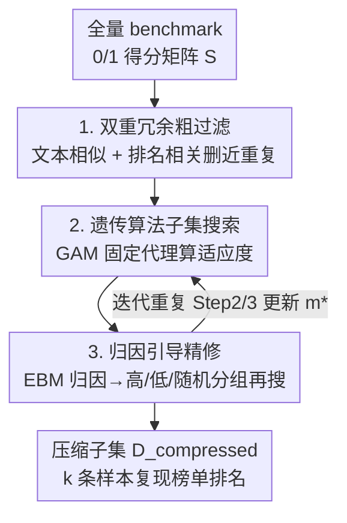

# Rethinking LLM Evaluation: Can We Evaluate LLMs with 200× Less Data?

**会议**: ICLR 2026  
**OpenReview**: [https://openreview.net/forum?id=lZlZjSxdio](https://openreview.net/forum?id=lZlZjSxdio)  
**代码**: https://github.com/gszfwsb/EssenceBench  
**领域**: LLM效率 / 评测压缩  
**关键词**: 基准压缩, 子集选择, 排名保持, 遗传算法, 冗余分析

## 一句话总结
针对"评测一个 benchmark 太贵、且要在大量模型上反复跑"的痛点，本文把基准压缩重新表述为"保住榜单整体排名"的子集优化问题，提出 EssenceBench——用文本+排名双重冗余过滤、遗传算法配固定代理预测器搜索子集、再用归因引导精修三步流水线，在 HellaSwag（1 万样本）上只用 50 条样本就把 95% 的模型排名误差控制在 5% 以内，实现 200× 压缩。

## 研究背景与动机
**领域现状**：LLM 评测的基准套件越做越大，从单任务 NLU 扩展到多语言、长上下文、数学推理、代码生成、工具使用等覆盖广泛的 suite；OpenCompass、Open LLM Leaderboard 这类平台让"一次跑很多模型、很多任务"成了常态。

**现有痛点**：评测不是跑一次就完了。实际工作流里要在不同 checkpoint、不同消融变体、不同竞品系统上反复评测，benchmark 越长，每次评测在 token 和算力上的开销就越大，评测本身正在变成瓶颈。已有的基准压缩方法（TinyBenchmark、MetaBench、SMART 等）虽然能减小测试集，但大多没有显式建模"样本之间的相互作用"，在极紧预算下做可扩展的子集搜索仍然困难。

**核心矛盾**：训练场景关心"某条样本对训练单个模型有没有用"，但榜单评测场景的目标完全不同——它的主要产出是**模型之间的相对排序**。于是真正该问的问题变成：要保住这个集体排名稳定，到底哪些样本是必需的？作者发现 benchmark 里存在大量冗余，而且这种冗余有两层：一是 prompt 文本语义相近，二是不同 prompt 在一群模型上诱导出几乎相同的对错模式（行为冗余）。两条样本若措辞相似或在多数模型上表现一致，同时留着只是翻倍成本却几乎不增加区分信息。

**本文目标**：在不改变榜单结论（模型排序）的前提下，把 benchmark 压到尽可能小，同时兼顾两个耦合目标——准确重建全量分数 + 保持模型排名。

**切入角度**：把压缩看成在 0/1 得分矩阵上"选列"的子集选择问题。利用公开榜单提供的逐样本对错信号，把每个模型在每条样本上的对错组织成矩阵 $S \in \{0,1\}^{N_{model} \times N}$，压缩就等价于选出一组列，使其聚合统计能复现全量评测。

**核心 idea**：先定义并量化文本冗余与排名冗余两把"尺子"砍掉明显重复，再用遗传算法在剩余空间里搜出能复现全量分数的紧凑核心集，最后用样本归因引导精修来补覆盖、避免在紧预算下陷入局部最优。

## 方法详解

### 整体框架
EssenceBench 要解决的是：给定一个大小为 $N$ 的 benchmark 和预算 $k \ll N$，选出 $k$ 条样本组成的子集，使其既能重建全量分数、又能保住一群模型的相对排名。直接在所有 $k$-子集上优化是 NP-hard 组合问题，作者用"由粗到细"（coarse-to-fine）的三段式把它拆开：先廉价剪枝去掉近重复，再做全局优化搜核心集，最后做局部修正补覆盖。

形式化上，benchmark 压缩定义为：用 0/1 掩码 $m \in \{0,1\}^N$（$\sum_j m_j = k$）选列，得到子矩阵 $S_m$，目标是最小化重建误差 $\min_m L(y, g(S_m))$，其中 $y$ 是全量准确率向量、$g$ 是聚合打分函数。

整条流水线分三步串行：**Step 1 粗过滤**用文本+排名双信号删近重复样本，把搜索空间从 $N$ 缩到 $M$；**Step 2 子集选择**在过滤后的集合上用遗传算法搜 $k$-子集，用一个固定的代理预测器（GAM）做适应度；**Step 3 归因精修**从精英子集里估每条样本的归因分，据此分组后再跑一次遗传算法补覆盖。Step 2 和 Step 3 会迭代重复，每轮发现更低误差就更新全局最优掩码 $m^\star$。

### 关键设计

**1. 双视角冗余度量：把"该删哪条"量化成文本+排名两把尺子**

作者认为，benchmark 里的冗余不能只看表面文本，还得看模型行为。于是定义两个互补指标。**文本冗余**（Definition 3）：用嵌入内积衡量语义重叠，样本对的冗余 $R_{text}(i,j) = \langle \text{Emb}(x_i), \text{Emb}(x_j)\rangle$，单条样本的冗余是它对其余样本的平均内积。**排名冗余**（Definition 4）：用两条样本在所有模型上的表现向量 $s_i, s_j \in \mathbb{R}^{N_{model}}$ 之间的 Pearson 相关 $R_{rank}(i,j) = \rho(s_i, s_j) \in [-1,1]$ 来衡量；相关越高说明模型在这两条样本上行为越一致，对区分模型而言是冗余信号。两者分别从"人看文本"和"模型看行为"两个角度出发，单独用任一个都会漏掉另一类重叠，合起来才能系统性地识别冗余。粗过滤阶段就按这两个阈值 $\tau_{text}, \tau_{rank}$ 顺序扫描样本，保留每个高冗余对里的首次出现者：$\epsilon_i = \prod_{j<i} \mathbb{1}(R_{text}(j,i) \le \tau_{text} \wedge R_{rank}(j,i) \le \tau_{rank})$，剩下 $M$ 条。这一步只删最明显的重复，把后续昂贵搜索的空间先压下来。

**2. 遗传算法 + 固定代理预测器：在缩小后的空间里搜出能复现全量分数的核心集**

过滤后仍是组合爆炸，作者用遗传算法（GA）来搜 $k$-子集。一个个体就是一个 $k$-ones 掩码 $m \in \{0,1\}^M$，种群是一组个体。每一代做四件事：(i) 用适应度评估每个候选子集；(ii) 锦标赛选择挑两个高适应度父代；(iii) 交叉 $m_j^{(c)} = (m_j^{(a)} \wedge \xi_j) \vee (m_j^{(b)} \wedge \neg\xi_j)$（$\xi_j \sim \text{Bernoulli}(0.5)$）+ 变异 $m_j^{(c)} \leftarrow m_j^{(c)} \oplus \lambda_j$（$\lambda_j \sim \text{Bernoulli}(1/k)$）生成子代；(iv) 调整子代随机翻转多余的 1/0 以满足预算约束 $\|m\|_1 = k$。关键在适应度怎么算——直接对每个候选子集跑全量评测太贵，于是每轮 GA **只训一次**一个轻量代理：广义加性模型（GAM），它把"模型在子集上的准确率"$s_i(m) = \frac{1}{k}\sum_j S_{filtered}[i,j]\cdot m_j$ 映射到"模型的全量准确率" $\hat y_i = g(s_i(m))$。适应度取留出模型集 $V$ 上的负 RMSE：$\text{fitness}(m) = -\sqrt{\frac{1}{|V|}\sum_{i\in V}(\hat y_i - y_i)^2}$。因为 $g$ 在一轮 GA 内固定，所有候选的打分都在同一把尺子下，既省算力又保证评估一致性。

**3. 归因引导的分组精修：用 EBM 归因分把样本切成高/低/随机三组，逼搜索去找被忽略的信息**

只靠 GA 容易陷在精英子集附近、漏掉覆盖。作者在 Step 2 产出的精英掩码集 $E$ 上训练一个可解释提升机（EBM）$g_m(D_{filtered}) = \sum_j f_j^m(x_j)$，用每个加性分量的范数 $\|f_l^m\|_2$ 作为样本 $l$ 在该掩码下的归因，再对 $E$ 里所有掩码聚合得到全局归因 $A_l = \frac{\sum_{m\in E}\mathbb{1}\{l\in I(m)\}\|f_l^m\|_2}{\sum_{m\in E}\mathbb{1}\{l\in I(m)\}}$。按归因把样本三等分成 $G_{high}$（归因最高）、$G_{low}$（最低）、$G_{rand}$（随机）三组，每组各跑一次 GA 选出最优、再比谁最好得到 $D_{compressed}$。这种"强行让 GA 在不同归因区域里搜"的做法有两层用意：真正重要的高归因信息会被进一步放大，而当前精英子集忽略掉的信息（藏在低归因/随机组里）有机会被重新发现，从而补覆盖、避开局部最优。这一步在预算很紧（$k$ 小）时尤其关键。

### 损失函数 / 训练策略
核心优化目标就是子集重建误差（公式 2 的 $L$ 取 RMSE）。GA 适应度用留出模型集上的负 RMSE（公式 9），代理 GAM 每轮重训一次后固定；EBM 在精英掩码集上学"样本对错矩阵 → 全量准确率"的映射。Step 2 与 Step 3 迭代多轮，逐轮更新全局最优掩码。数据预处理沿用 MetaBench 协议，按模型表现分层做严格 9:1 训练-测试划分。

## 实验关键数据

### 主实验
数据集取自 Open LLM Leaderboard，5 个标准 benchmark（GSM8K/ARC/HellaSwag/WinoGrande/MMLU）+ 8 个更难的现代 benchmark（LiveMCP、MathVista、GPQA、BBH、MATH、MUSR、IFEval、GSM-Plus）。基线含 MetaBench、SMART 及 Random/GraNd/PPL/K-Means/MLP。指标为重建 RMSE↓ 与排名相关↑。

| 数据集 | 子集大小 k | EssenceBench RMSE | MetaBench RMSE | 说明 |
|--------|-----------|-------------------|----------------|------|
| GSM8K | 200 | 0.864 | 1.760 | k=200 即超过 MetaBench k=500（0.958） |
| GSM8K | 500 | 0.377 | 0.958 | 相对降低约 60.7% |
| ARC | 200 | 0.802 | 1.447 | 全档位最低误差 |
| WinoGrande | 200 | 0.777 | 1.530 | k=200 匹配 MetaBench k=500（0.785） |
| MMLU | 300 | 0.846 | 1.287 | PPL/GraNd 在 MMLU 上严重失效（>7） |
| MathVista | 300 | 0.001 | 4.389 | 近乎完美重建 |
| GSM-Plus | 300 | 0.010 | 0.195 | 鲁棒性 suite 上大幅领先 |
| LiveMCP | 90 | 0.001 | 8.210 | 智能体工具使用 |

排名保真度（GSM8K，k=200）：EssenceBench 的 Kendall 相关 0.968，超过 MetaBench 用 450 样本时的 0.964；Pearson 在 k=250 起即达 1.000，Rank Err（within 10%）从 k=150 起即 1.000。HellaSwag 上 k=200 时排名漂移被严格限制在 10% 以内。

### 消融实验

| 配置 | 现象 | 说明 |
|------|------|------|
| Full（迭代精修） | RMSE 2.77 → 2.47（GSM8K） | 增加精修轮数持续降误差 |
| w/o 粗过滤 | 小 k 时明显变差 | 粗过滤对小子集尤为关键 |
| w/o 归因 | 小 k 时 RMSE 升高 | 归因对紧预算维持低误差至关重要 |
| Highest / Lowest / Random only | 均不如三组合用 | 分组策略缺一组都掉点 |

与 SMART 对比（ARC-Challenge）：EssenceBench 用 8% 样本（100 条）即取得 RMSE 1.104，优于 SMART 用 39% 样本（460 条）的 1.193；把 SMART 当粗过滤步只带来微弱增益，说明本文粗过滤已足够高效。

### 关键发现
- 归因引导分组和粗过滤都主要在**预算紧（k 小）时**起作用，k 较大时各方法差距缩小——这正是该方法的目标场景。
- 数据集越大、压缩加速越明显（HellaSwag 达 6.2×），因为冗余越多可删空间越大。
- PPL/GraNd 这类训练侧选择启发式在 MMLU 上彻底失效（RMSE >7），印证"训练有用 ≠ 评测有区分度"。

## 亮点与洞察
- **把评测问题从"逐样本价值"重构为"集体排名稳定性"**：这是全文的灵魂转向——训练问"这条对训一个模型有没有用"，评测该问"这条对区分一群模型有没有用"，两者的最优子集完全不同。
- **文本冗余 + 排名冗余双视角**：把"模型行为"显式建成一把可量化的尺子（表现向量的 Pearson 相关），抓住了纯语义相似抓不到的行为冗余，思路可迁移到任何"逐样本对错矩阵"可得的评测场景。
- **固定代理 + GA 的省算力组合**：每轮只训一次 GAM 当适应度，把组合搜索的评估成本从"每个候选跑全量"降到"一次代理预测"，是让 GA 在大 benchmark 上跑得动的关键工程取舍。

## 局限与展望
- 方法重度依赖公开榜单提供的逐样本对错矩阵——没有多模型评测信号时，排名冗余无法计算，方法退化。
- 选出的子集是针对"当前这群模型"的排名优化的，面对分布迥异的新一代模型时泛化性需进一步验证（虽在 13 个 benchmark 上有交叉验证）。
- 阈值 $\tau_{text}, \tau_{rank}$、保留比例 $\alpha$、GA 超参等需调，且 RMSE 数值随 benchmark 量纲差异较大，跨数据集横向比较绝对值意义有限。

## 相关工作与启发
- **vs MetaBench**: 同为基准压缩，MetaBench 基于 IRT 难度估计、按难度分层选样；本文显式建模文本+排名双重冗余并用 GA+归因搜索，在多数 benchmark 上用更少样本达到更低 RMSE 与更高排名相关（GSM8K k=200 即超 MetaBench k=500）。
- **vs SMART**: SMART 做 filtering，但样本用量大（ARC 上 39%）；EssenceBench 仅用 8% 样本即取得更低 RMSE，且把 SMART 当粗过滤替换只带来边际增益，说明本文粗过滤更高效。
- **vs 训练数据选择（GraNd/PPL/IRT 类）**: 这些方法为"学习效率"优化，不针对榜单分数重建或排名一致性；本文在 MMLU 上直接暴露了它们用于评测压缩时的失效。

## 评分
- 新颖性: ⭐⭐⭐⭐⭐ 把基准压缩重构为排名保持的子集优化、并提出文本+排名双冗余度量，视角新颖
- 实验充分度: ⭐⭐⭐⭐⭐ 13 个 benchmark、多基线、多档位 k、排名+RMSE 双指标、完整消融
- 写作质量: ⭐⭐⭐⭐ 由粗到细的故事线清晰，但部分符号（EBM 归因、迭代细节）需翻附录
- 价值: ⭐⭐⭐⭐⭐ 直击 LLM 评测成本痛点，200× 压缩且开源，实用性强

<!-- RELATED:START -->

## 相关论文

- [\[ICML 2026\] Nonparametric LLM Evaluation from Preference Data](../../ICML2026/llm_evaluation/nonparametric_llm_evaluation_from_preference_data.md)
- [\[ICLR 2026\] Talk, Evaluate, Diagnose: User-aware Agent Evaluation with Automated Error Analysis](talk_evaluate_diagnose_user-aware_agent_evaluation_with_automated_error_analysis.md)
- [\[ICLR 2026\] Rethinking LLM-as-a-Judge: Representation-as-a-Judge with Small Language Models via Semantic Capacity Asymmetry](rethinking_llm-as-a-judge_representation-as-a-judge_with_small_language_models_v.md)
- [\[ICLR 2026\] DARE-bench: Evaluating Modeling and Instruction Fidelity of LLMs in Data Science](dare-bench_evaluating_modeling_and_instruction_fidelity_of_llms_in_data_science.md)
- [\[ICLR 2026\] Detecting Data Contamination in LLMs via In-Context Learning](detecting_data_contamination_in_llms_via_in-context_learning.md)

<!-- RELATED:END -->
