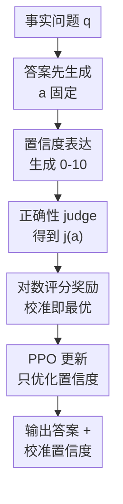

# Rewarding Doubt: A Reinforcement Learning Approach to Calibrated Confidence Expression of Large Language Models

**会议**: ICLR 2026  
**OpenReview**: [https://openreview.net/forum?id=yResLmrVO1](https://openreview.net/forum?id=yResLmrVO1)  
**代码**: https://github.com/pasta99/RewardingDoubt  
**领域**: LLM评测 / 置信度校准 / 不确定性表达  
**关键词**: 置信度校准、强化学习、对数评分规则、不确定性表达、LLM评测  

## 一句话总结
本文把 LLM 的数值置信度表达建模成一个“下注式”的强化学习问题，用严格适当的对数评分规则奖励答对时的高置信、惩罚答错时的过度自信，从而在基本不改变答题准确率的情况下显著提升模型置信度校准和跨任务泛化能力。

## 研究背景与动机
**领域现状**：LLM 已经能在问答、摘要、医学和法律等场景中给出流畅答案，但真实部署时用户不只需要答案本身，还需要知道模型对答案有多确定。理想状态下，如果模型说“置信度 70%”，那么在大量这类样本中约 70% 的答案应该是正确的，这就是置信度校准。

**现有痛点**：很多 LLM 会习惯性地用高置信语气回答，即使答案事实上是错的。对于医学诊断、法律咨询、客服决策这类高风险场景，过度自信比单纯错误更危险，因为用户很容易把流畅表达误读成可靠证据。

**核心矛盾**：已有方法大多把“回答生成”和“置信度估计”拆开处理。黑盒方法从多次采样、一致性或提示词中推断置信度，推理成本高且校准不稳定；白盒方法用 token 概率、隐藏状态 probe 或外部估计器做置信度判断，但模型本身并没有学会在自然语言输出中表达校准后的数值置信度。

**本文目标**：作者希望直接训练 LLM 在回答事实问题之后输出一个数值置信度，并让这个数字和真实正确概率对齐。这个目标包含两个子问题：一是如何设计奖励，让模型既不盲目报高分，也不对正确答案过度保守；二是如何只训练置信度表达能力，而不破坏原本的答题能力。

**切入角度**：论文把置信度表达看成“下注”。如果模型答对且下注高，就应该得到高回报；如果答错还下注高，就应该受到更大惩罚。这个视角自然对应概率预测里的 proper scoring rule，其中对数评分规则的最优解正好是报告真实成功概率。

**核心 idea**：用基于对数评分规则的强化学习奖励直接优化 LLM 生成的置信度 token，让模型在生成流程内部学会“什么时候该自信，什么时候该表达怀疑”。

## 方法详解

### 整体框架
Rewarding Doubt 的训练流程很直接：给模型一个事实问题，模型先生成答案，再在固定答案的条件下生成 0 到 10 的置信度；系统用 judge 判断答案是否正确，然后把正确性和置信度送入对数评分奖励函数，最后用 PPO 只更新置信度生成部分的策略。它的关键不在于提出一个新问答模型，而在于把“置信度是否该高”变成可优化、且理论上指向校准的奖励。

更形式化地说，模型输出答案-置信度对 $(a, \hat{p})$，其中 $a$ 是文本答案，$\hat{p}\in[0,1]$ 是模型主观认为答案正确的概率。校准的目标是让 $P(j(a)=1\mid \hat{p}=x)=x$，也就是所有报出置信度 $x$ 的样本中，真实正确比例也接近 $x$。

### 关键设计
**1. 下注式对数奖励：让“表达怀疑”也有收益**

这篇论文最核心的设计是把置信度训练写成对数评分规则：如果答案正确，奖励为 $\log(\hat{p})$；如果答案错误，奖励为 $\log(1-\hat{p})$。这意味着模型不能靠一味报高置信度来刷奖励，因为高置信答错会被 $\log(1-\hat{p})$ 严重惩罚；同时它也不能永远报低置信度，因为答对时低 $\hat{p}$ 只能拿到很差的 $\log(\hat{p})$。

这个奖励的好处是有明确的概率解释。若真实正确概率是 $p^*$，则期望奖励为 $p^*\log(\hat{p})+(1-p^*)\log(1-\hat{p})$，对 $\hat{p}$ 求导可得最优点 $\hat{p}=p^*$。也就是说，最大化该奖励不会鼓励模型讨巧地输出某个固定置信度，而是鼓励它把置信度数字对齐到“自己这次答案大概率会不会对”的真实概率。

**2. 答案与置信度分离生成：校准训练不顺手改答案**

作者没有让 PPO 同时优化答案内容和置信度，而是先让模型生成答案，再把答案和问题作为固定输入，让模型单独生成置信度。这样做看似只是工程细节，实际解决了一个很重要的混淆：如果把答案和置信度一起优化，奖励变化可能来自答案变好，也可能来自置信度变准，很难判断方法到底在训练什么。

在本文设置中，judge 只根据已经生成的答案给出正确性，PPO 的目标集中在置信度 token 上。这样模型学到的是“对这个已经给出的答案该报多少信心”，而不是通过改变答案分布来间接获得更高奖励。实验里 accuracy 基本保持稳定，也支撑了这个设计的目的：Rewarding Doubt 主要改善校准和区分能力，而不是把任务能力重新训练一遍。

**3. 严格适当评分规则：把校准目标嵌进优化目标本身**

很多监督微调式的置信度表达方法需要先构造一个伪标签，比如用 self-consistency、token probability、probe 或经验正确率估计一个目标置信度，再让模型模仿这个目标。问题是伪标签本身可能不准，而且即使原始估计器有校准性质，经过 SFT 模仿后也未必保留这种理论保证。

Rewarding Doubt 不去拟合外部置信度标签，而是直接用 proper scoring rule 给每次预测打分。论文证明在未裁剪的对数奖励下，期望奖励的全局最大值出现在 $\hat{p}=p^*$；实际训练中为了避免 $\log(0)$，作者用 $\epsilon=0.001$ 对置信度上下界做 clipping。这个裁剪会让极端区间内的置信度不可区分，但只影响很小范围，训练上换来数值稳定性。

**4. 统一适配单答案与多答案：把每个事实都当作可校准事件**

论文不仅在单答案 TriviaQA 上训练和评估，还把方法扩展到 QAMPARI 这种多答案任务。在多答案设置里，模型需要枚举多个可能答案，并在每个答案后单独输出一个置信度，相当于把“一道题是否答对”扩展为“每个事实是否正确”的校准问题。

这种处理让方法不局限于选择题或短答案问答，也更接近真实生成场景：一个回答里可能包含多个事实，其中有的可靠、有的存疑。Rewarding Doubt 的框架只需要一个 correctness signal，就能把每个答案-置信度对作为训练样本，因此后续也可以接入 LLM-as-a-judge、reward model 或连续文本指标，而不必重写整个方法。

### 一个完整示例
假设问题是“法国首都是哪里？请给出答案和置信度。”模型先输出答案 `Paris`，再输出 `Confidence: 10`。如果 judge 判定答案正确，那么归一化后的 $\hat{p}$ 接近 1，奖励 $\log(\hat{p})$ 很高；这告诉模型，对这种自己确实知道的事实可以大胆表达高置信。

但如果问题更难，模型输出了错误答案 `Lyon`，还给出 `Confidence: 10`，奖励会变成 $\log(1-\hat{p})$，在 $\hat{p}$ 接近 1 时惩罚非常大。相比之下，如果模型对错误答案只给出较低置信度，惩罚会小得多。训练多次之后，模型需要学会区分“我真的知道”和“我只是生成了一个看起来像答案的文本”，这就是论文标题里 Rewarding Doubt 的含义：适当表达怀疑本身会被奖励。

### 损失函数 / 训练策略
训练目标使用 PPO 优化上述奖励。单答案设置中，作者在 TriviaQA 上训练 Meta-Llama-3-8B-Instruct 的 4-bit quantized Unsloth 版本，并用 LoRA 微调；训练 2 个 epoch，学习率为 $1e^{-5}$。多答案设置中使用 QAMPARI，因为一个问题可能产生多个事实，作者训练 24,000 steps，batch size 为 8，学习率同样是 $1e^{-5}$，并把 reward 乘以 5 来扩大数值跨度。

置信度输出限定为 0 到 10 的整数，再归一化到 $[0,1]$ 参与奖励计算。0 表示模型确信答案错误，10 表示模型确信答案正确。奖励再归一化到 $[-1,1]$。如果模型没有按指定格式输出答案和置信度，会得到 out-of-format reward $-3$，以避免训练过程被格式错误污染。主要实验在一张 Nvidia A40 上完成，每次训练约 7 天。

## 实验关键数据

### 主实验
单答案实验在 TriviaQA 上比较 Rewarding Doubt、零样本 verbalized confidence、CoT、Top-K、Surrogate Token、Sequence Probability、Self-Consistency、PPO-M/PPO-C、LACIE 和 Trained Probe。指标包括 ECE、AUROC 和 Accuracy，其中 ECE 越低越好，AUROC 和 Accuracy 越高越好。

| 数据集 / 设置 | 方法 | ECE ↓ | AUROC ↑ | Accuracy ↑ |
|--------|------|------|----------|------|
| TriviaQA / Single-Answer | Verbalize | 0.3459 | 0.5858 | 0.6310 |
| TriviaQA / Single-Answer | Self-Consistency | 0.1134 | 0.8213 | 0.6224 |
| TriviaQA / Single-Answer | Trained Probe | 0.0189 | 0.8173 | 0.5925 |
| TriviaQA / Single-Answer | Rewarding Doubt | 0.0226 | 0.8592 | 0.6309 |
| QAMPARI / Multiple-Answer | Verbalize | 0.5319 | 0.6047 | 0.2550 |
| QAMPARI / Multiple-Answer | Trained Probe | 0.1117 | 0.6481 | 0.2233 |
| QAMPARI / Multiple-Answer | Rewarding Doubt | 0.0816 | 0.6947 | 0.2480 |

从表中可以看出，在 TriviaQA 上 Rewarding Doubt 的 ECE 接近 Trained Probe，但 AUROC 明显更高，说明它不只是把平均校准误差压低，也更能区分正确答案和错误答案。在 QAMPARI 多答案设置中，它同时优于 Verbalize、Sequence Probability 和 Trained Probe，说明这种奖励不只适合单个短答案，也能处理一题多事实的置信度表达。

### 消融实验
论文做了两个层面的分析：一是跨模型架构，二是跨任务泛化。跨模型实验显示，Rewarding Doubt 在 LLaMA、Qwen 和 Gemma 上都能降低校准误差或提高 AUROC；跨任务实验则考察在 TriviaQA 上训练后迁移到 CommonsenseQA 和 MedQA 的表现。

| 配置 | 关键指标 | 说明 |
|------|---------|------|
| LLaMA-3.1-8B Verbalize | ECE 0.2771 / AUROC 0.6766 / Acc 0.6662 | 原始模型仍有明显过度自信 |
| LLaMA-3.1-8B Rewarding Doubt | ECE 0.0256 / AUROC 0.8793 / Acc 0.6497 | 校准和区分能力大幅提升，准确率基本稳定 |
| Qwen-2.5-3B Rewarding Doubt | ECE 0.1483 / AUROC 0.9065 / Acc 0.4193 | 小模型上 AUROC 提升很强，但 ECE 不如 probe |
| Qwen-2.5-7B Rewarding Doubt | ECE 0.1298 / AUROC 0.8928 / Acc 0.5283 | 相比 Verbalize 的 AUROC 0.5818 有显著改善 |
| Gemma-2-9B Rewarding Doubt | ECE 0.0922 / AUROC 0.8649 / Acc 0.6832 | 准确率还略高于 Verbalize，说明校准训练未破坏任务能力 |

| 泛化设置 | 方法 | ECE ↓ | AUROC ↑ | Accuracy ↑ |
|------|------|------|------|------|
| CommonsenseQA | Verbalize | 0.2820 | 0.5425 | 0.6860 |
| CommonsenseQA | Rewarding Doubt | 0.2930 | 0.6385 | 0.7163 |
| MedQA | Verbalize | 0.4480 | 0.5075 | 0.5067 |
| MedQA | Rewarding Doubt | 0.1145 | 0.6649 | 0.5161 |
| QAMPARI Single fact eval | Base model | 0.5875 | 0.5787 | 未报告 |
| QAMPARI Single fact eval | Single-fact trained | 0.1536 | 0.7240 | 未报告 |
| QAMPARI Multi fact eval | Multi-fact trained | 0.1061 | 0.7268 | 未报告 |

### 关键发现
- Rewarding Doubt 最稳定的收益体现在 AUROC：它让置信度更能排序“哪些答案更可能正确”，这对人工复核、拒答阈值和风险控制很关键。
- ECE 不是唯一评估标准。论文指出，一个模型如果总是输出中等置信度，可能在 ECE 上看起来不差，但对区分对错没有帮助；AUROC 能补上这部分视角。
- 训练后置信度分布从“几乎总是 8 分以上”变成更分散的分布，说明模型学会了在不确定样本上降低表达的置信度。
- accuracy 基本稳定，说明这种方法主要改变的是 confidence expression，而不是用 RL 重新塑造答案生成能力。
- 从 TriviaQA 迁移到 MedQA 和 CommonsenseQA 仍然有效，尤其 MedQA 上 ECE 从 0.4480 降到 0.1145，显示模型可能学到了一种较通用的 uncertainty awareness。

## 亮点与洞察
- 技术亮点在于把 LLM 置信度表达和 proper scoring rule 直接连起来。很多校准论文会先估计置信度再监督模仿，而本文把“报告真实概率才最优”写进了奖励本身，目标更干净。
- “Rewarding Doubt”这个命名很准确：论文不是简单惩罚错误，而是奖励模型在不知道时承认不确定。这比训练拒答更细，因为它保留了数值化风险信息。
- 答案和置信度分离生成是一个可复用 trick。未来做幻觉检测、事实核查、医学问答置信度时，也可以先固定生成内容，再专门训练模型评估自己这段内容的可信程度。
- 论文对 ECE 与 AUROC 的讨论很有价值。LLM 置信度不只是“校准曲线贴不贴 45 度线”，还要看置信度能不能真正支持排序、筛选和转人工决策。

## 局限与展望
- 模型规模只覆盖 3B 到 9B，尚未验证在更大的闭源或开源前沿模型上是否同样有效。大模型本身可能已有更强的自我评估能力，也可能因为对齐训练更自信而表现不同。
- 正确性信号主要来自 exact match 或词重叠 F1，适合短答案和多事实问答，但对长文本解释、开放式诊断建议、法律分析这类场景仍然偏粗糙。若 judge 本身有偏差，奖励会把这种偏差传给置信度表达。
- 训练成本不低，单次 A40 训练约 7 天。虽然推理阶段只多生成少量置信度 token，比 self-consistency 便宜，但初始部署仍需要较完整的训练数据和算力预算。
- 数值置信度本身也可能带来误用风险。即使模型在统计意义上校准，单个高风险案例仍可能错得很严重；实际系统需要把置信度和来源证据、人工复核阈值、用户界面提示一起设计。

## 相关工作与启发
- **vs Verbalize / CoT prompting**: 这些方法让模型直接说出置信度或先推理再报置信度，但没有训练目标约束，所以容易沿用预训练中的自信表达习惯。Rewarding Doubt 用奖励改变这种表达分布。
- **vs Self-Consistency**: Self-Consistency 通过多次采样看答案一致性，通常能得到不错的不确定性信号，但推理成本高。本文训练后单次生成即可给出置信度，更适合在线部署。
- **vs Trained Probe**: Trained Probe 使用隐藏状态训练外部分类器，校准可以很强，但置信度不是模型自然语言生成的一部分。Rewarding Doubt 的优势是把置信度直接集成进 LLM 输出，同时在 AUROC 上表现更好。
- **vs LACIE**: LACIE 用 DPO 和 listener-aware 机制对齐置信度表达，更关注听者如何理解信心线索。本文则直接对 factual correctness 做数值校准，理论目标更接近“置信度等于正确概率”。
- **vs RLHF reward calibration**: PPO-M/PPO-C 等方法关注 RLHF 奖励模型中的过度自信偏差，而本文不依赖人类偏好标注或额外 reward model，直接用正确性和对数评分构造奖励。

## 评分
- 新颖性: ⭐⭐⭐⭐☆ 把 proper scoring rule 作为 PPO 奖励来训练 LLM 置信度表达，思路简洁但抓住了现有方法的关键断点。
- 实验充分度: ⭐⭐⭐⭐☆ 覆盖单答案、多答案、跨任务泛化和多模型消融，数据扎实；不足是模型规模和开放式长文本场景仍有限。
- 写作质量: ⭐⭐⭐⭐☆ 论文结构清楚，理论动机和实验结论对应较好，奖励函数证明也足够直观。
- 价值: ⭐⭐⭐⭐⭐ 置信度校准是 LLM 可信部署的基础能力，这篇方法推理成本低、目标明确，很适合作为后续 uncertainty-aware LLM 的训练基线。

<!-- RELATED:START -->

## 相关论文

- [\[ICLR 2026\] Detecting Data Contamination from Reinforcement Learning Post-training for Large Language Models](detecting_data_contamination_from_reinforcement_learning_post-training_for_large.md)
- [\[ICML 2026\] HiPER: Hierarchical Reinforcement Learning with Explicit Credit Assignment for Large Language Model Agents](../../ICML2026/llm_evaluation/hiper_hierarchical_reinforcement_learning_with_explicit_credit_assignment_for_la.md)
- [\[NeurIPS 2025\] ConfTuner: Training Large Language Models to Express Their Confidence Verbally](../../NeurIPS2025/llm_evaluation/conftuner_training_large_language_models_to_express_their_confidence_verbally.md)
- [\[ICML 2026\] Agent World Model: Infinity Synthetic Environments for Agentic Reinforcement Learning](../../ICML2026/llm_evaluation/agent_world_model_infinity_synthetic_environments_for_agentic_reinforcement_lear.md)
- [\[ICLR 2026\] Prompt and Parameter Co-Optimization for Large Language Models](prompt_and_parameter_co-optimization_for_large_language_models.md)

<!-- RELATED:END -->
