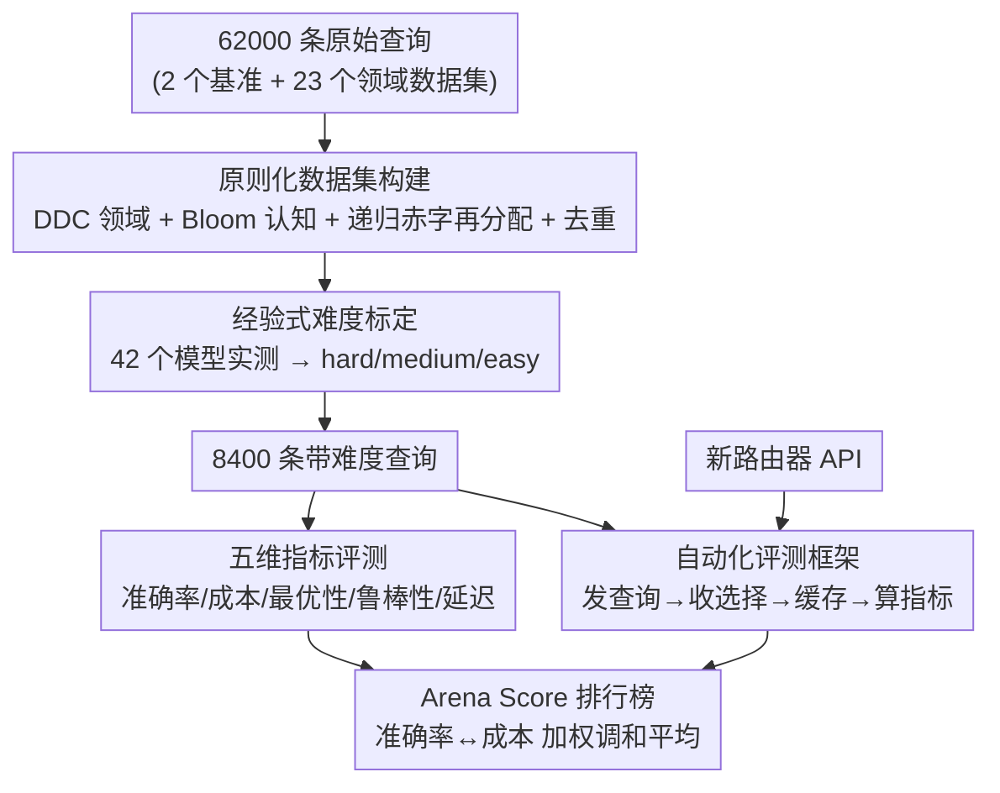

# RouterArena: An Open Platform for Comprehensive Comparison of LLM Routers

**会议**: ICLR 2026  
**OpenReview**: [https://openreview.net/forum?id=9HsaIi4ngF](https://openreview.net/forum?id=9HsaIi4ngF)  
**代码**: https://routeworks.github.io/ （平台主页）  
**领域**: LLM评测 / LLM路由 / 基准  
**关键词**: LLM路由器、评测基准、排行榜、准确率-成本权衡、自动化评估

## 一句话总结
RouterArena 是第一个面向 LLM 路由器（router）的开放评测平台，用 DDC 图书分类法构建覆盖 9 大领域、44 类、约 8400 条带难度标签的查询数据集，配合准确率、成本、路由最优性、鲁棒性、延迟五维指标和一个把准确率与成本合成的 Arena Score，再加上能自动跑新路由器并刷新榜单的框架，首次把学术与商业路由器拉到同一标尺下对比，发现没有一个路由器在所有指标上都最好、且现有方法普遍不擅长「该用小模型时用小模型」。

## 研究背景与动机

**领域现状**：如今 LLM 生态里模型在规模、能力、价格上差异巨大，没有一个模型在所有场景都最优——强模型贵但能啃难题，小模型便宜但啃不动难题。于是「LLM 路由器」应运而生：它在输入查询到来时自动选一个最合适的模型来回答，已经从 2023 年零星的几篇学术工作扩张到 2024-2025 年十几个学术方法 + 商业产品（NotDiamond、Azure Model Router），连 GPT-5 都内置了路由功能。

**现有痛点**：路由器越来越多，评测却没跟上。每篇工作各自用一套数据集和指标，结果之间根本没法横向比较。已有的路由器 benchmark（RouterBench、RouterEval、FusionBench、EmbedLLM）都各有硬伤：查询类别覆盖窄、不区分难度、指标单一（往往只有 deferral curve 或 accuracy）、只评开源路由器不支持商业闭源路由器、没有统一排行榜。

**核心矛盾**：路由器的好坏本质上是**多维**的——既要看准确率和成本，又要看「是否选了能答对的最便宜模型」（最优性）、对噪声输入是否稳定（鲁棒性）、自身引入多大延迟。但现有基准只盯住其中一两维，于是「谁是更好的路由器」这个问题没有公允答案。而且评测路由器比评测模型更难：模型 arena 只要比单个模型输出，路由器 arena 还要求数据集能区分难度、指标能多角度、框架能自动接入新路由器并实时更新榜单。

**本文目标**：造一个像 LMArena 之于模型那样的「Router Arena」，在统一协议下系统地评测和对比所有路由器，需要同时解决三件事——有覆盖广且能区分难度的数据集、有覆盖部署关切的多维指标、有能自动评测并刷新榜单的框架。

**核心 idea**：用图书馆的 Dewey Decimal Classification（DDC）保证领域全覆盖、用经验测得的「多少个模型能答对」来定义难度、用加权调和平均把准确率和成本压成单一 Arena Score，再用一个自动化框架把开源和商业路由器都纳进同一张实时排行榜。

## 方法详解

### 整体框架
RouterArena 不是一个新路由器，而是一整套「评测路由器的基础设施」。它由四块拼成：(1) 一个用三条原则构建的查询数据集——DDC 保证领域全覆盖、Bloom 分类法标注认知技能层级、再用经验难度把查询分成 hard/medium/easy 三档；(2) 五个维度的评测指标，覆盖准确率、成本、路由最优性、鲁棒性、延迟；(3) 一个排行榜机制，用加权调和平均把准确率和成本合成 Arena Score，连同其它五项排名一起给出综合榜；(4) 一个自动化框架，给定一个路由器的 API 接入点，就能自动发查询、收模型选择、算指标、刷新榜单。把这四块串起来，任何人提交一个新路由器，平台都能把它放到同一张榜上和 12 个已有路由器（学术 9 个 + 商业 3 个）公平对比。

### 关键设计

**1. 原则化数据集构建：用图书分类法+认知分类法堵住「覆盖窄」**

针对现有基准「查询类别覆盖窄、分布随意」的痛点，RouterArena 不靠拍脑袋拼数据，而是借两套成熟的知识组织体系来强约束覆盖。第一条原则是 **DDC 领域覆盖**：直接采用图书馆通用的 Dewey Decimal Classification 把人类知识切成层级化的领域（排除宗教），最终覆盖 9 个顶级领域、44 个类别，保证路由器面对的查询不会漏掉某个学科。第二条原则是 **Bloom 认知技能覆盖**：用 Bloom's taxonomy 给每条查询标注它考的是简单事实回忆还是高阶推理判断，标注由 DeepSeek-V3.1 以 LLM-as-Judge 完成，并用小规模人工研究验证可靠性——注意 Bloom 层级只用来刻画「认知技能」，不等于难度标签。

构建过程本身也有讲究：先从 2 个已有 LLM 基准收齐查询、再用 23 个领域专用数据集补足欠缺类别，凑出 6.2 万条原始查询，每个源数据集封顶约 1000 条防止 WMT/SuperGLUE 这类大语料喧宾夺主；接着作者提出一个**递归赤字再分配算法**让查询在类别和认知层级间均衡分布——先把理科:文科定为 2:1，某子类没达到配额时，超额子类的盈余被递归且均匀地分给亏空子类，同样的过程在子类内对认知层级再做一次；最后用 `sentence-transformers/all-MiniLM-L6-v2` 做基于余弦相似度的去重，挑出最不相似的样本，既保覆盖又去冗余。

**2. 经验式难度标定：让「难度」可被实测而非主观假设**

要检验路由器会不会做准确率-成本权衡（难题派给贵的强模型、简单题派给便宜的弱模型），数据集必须有清晰可分的难度档。本文的关键选择是**用经验定义难度**而非人工打标或 Bloom 层级：对每条查询，用 42 个覆盖广谱能力的模型去跑，统计有多少个模型能答对，答对的模型越少说明越难。据此把查询分成三档——hard（≤4/42 个模型答对）、medium（5–19/42）、easy（≥20/42）。作者进一步把查询按「42 个 LLM 上的平均准确率」排序，发现整体和各领域的曲线都是平滑单调上升、没有大断层（Figure 4），说明难度在「极难→极易」整个区间均匀铺开，能真正区分路由器行为。最终难度分布是 easy 47.5% / medium 29.1% / hard 23.4%——偏向简单题，但这恰好反映真实世界查询分布。这种标定方式的好处是「难度」直接对应「模型能不能答对」，和路由器要做的决策天然对齐。

**3. 五维评测指标 + Arena Score：把多维好坏压成可排名的单一分**

路由器的好坏是多维的，所以本文定义五个维度：**(1) 准确率**——所有查询上答案正确率的平均；**(2) 成本**——按 $cost = c_{in}\cdot N_{in} + c_{out}\cdot N_{out}$ 用各家官方 API 定价算实际推理花费，覆盖输入长度、CoT 生成长度、MoE 这些影响成本的因素；**(3) 路由最优性**——含三个子指标：最优选择率（用最便宜模型就答对的查询占比）、最优准确率比（实际准确率 / 始终选池中最强模型的上界）、最优成本比（实际花费 / 始终选最优模型的花费），专门惩罚那些明明有更便宜的正确选项却用贵模型的路由器；**(4) 鲁棒性**——对查询做改写、语法变化、同义替换、错别字扰动，测路由器在扰动前后选同一个模型的比例；**(5) 延迟**——路由器在关键路径上引入的额外开销（TTFT 和端到端延迟的增量）。

排行榜把这些汇成六个排名分（Arena Score、最优选择率、最优准确率比、最优成本比、鲁棒性、延迟），综合排名取六项平均。其中 **Arena Score** 是核心，用加权调和平均把准确率和成本捏成一个数。为了在低成本区更好区分路由器，先对成本做 base-2 对数变换（价格每翻倍，成本分降 1），归一化成本为 $C_i = \frac{\log_2(c_{max}) - \log_2 c_i}{\log_2(c_{max}) - \log_2(c_{min})}$，其中 $c_{min}=0.0044$（池中最便宜模型每千查询的成本）、$c_{max}=200$（最贵的 O1-PRO），把成本映到 $[0,1]$、越大越省钱。再与准确率 $A_i$ 合成 $S_{i,\beta} = \frac{(1+\beta)A_i C_i}{\beta A_i + C_i}$，其中 $\beta>0$ 控制成本相对准确率的权重，默认 $\beta=0.1$ 偏向准确率，因为高准确率的路由器即便略贵通常也更有价值。

**4. 自动化评测框架与实时榜单：让开源和商业路由器都能一键上榜**

为了让榜单能持续更新，框架的设计目标是「给个 API 接入点就能评」。用户只需提供新路由器的访问入口，框架就把评测查询发过去、路由器在自己那端做路由推理并返回模型选择，框架监控其响应时间得到延迟、再自己跑被选模型的推理（很多路由器共享重叠的模型池，所以用 prefix caching / 缓存结果提升效率保证公平），最后算指标、汇总、刷新榜单。关键是它**同时支持开源和商业路由器**：开源路由器按各自原始实现的训练流程和模型池配置训练后评测；商业路由器无需训练直接调 API。即便某些商业路由器不暴露模型选择、只返回答案，也能被评测，只是部分指标测不了。正是这套框架让 12 个路由器（NotDiamond、Azure-Router、GPT-5 三个商业 + KNN/MLP/GraphRouter/Universal Router/CARROT/RouterDC/IRT-Router/RouteLLM/vLLM-SR 等学术）头一次出现在同一张榜上。

## 实验关键数据

### 主实验：综合排行榜（Arena Score）
12 个路由器的 Arena Score 排名（分越高越好，综合榜见 Figure 1 / Table 2）：

| 排名 | 路由器 | 类型 | Arena Score |
|------|--------|------|-------------|
| 1 | MIRT-BERT | 学术 | 67.3 |
| 2 | Azure-Router | 商业 | 66.4 |
| 3 | CARROT | 学术 | 63.9 |
| 4 | vLLM-SR | 学术 | 63.8 |
| 5 | GPT-5 | 商业 | 62.7 |
| 6 | NIRT-BERT | 学术 | 60.8 |
| 7 | GraphRouter | 学术 | 60.5 |
| 12 | RouterDC | 学术 | 35.2 |

关键观察：**商业路由器并不必然碾压开源**——GPT-5 因模型池被限制在 OpenAI 家族、成本高，综合只排第 7（按内部排名）；NotDiamond 因频繁选贵模型排到第 12。**没有任何路由器在所有指标上都登顶**，印证路由器设计存在内在权衡。

### 分析实验：最优性、鲁棒性、延迟

| 维度 | 关键发现 | 数据 |
|------|---------|------|
| Oracle 准确率 | 所有路由器都够不着理论上界 | Oracle Acc. = 90.89% |
| 归一化效率 | vLLM-SR / CARROT 能省 ~35% 成本而准确率掉 <2%；NIRT-BERT 反例：只达基线准确率却花 400% 成本 | Figure 7 |
| 最优选择率 | RouterDC 最优选择率最高（93.5%）但整体准确率最差；MIRT-BERT 准确率高（≈77% 最优）却花近 5 倍最优成本 | Figure 8 |
| 鲁棒性 | 普遍偏低，依赖 BERT 的学术路由器（vLLM-SR 35%、NIRT-BERT 49%）对表层扰动尤其敏感 | Figure 9 左 |
| 延迟 | vLLM-SR(546.8ms)、RouteLLM(259ms) 因调 OpenAI embedding API 显著偏高，其余多在 sub-100ms | Figure 9 右 |

### 关键发现
- **现有路由器普遍「不会用小模型」**：大多数路由器在归一化图上都挤在 (100% 成本, 100% 准确率) 附近，说明它们过度依赖最强模型、错失了 defer 到便宜模型的机会。这是本文给出的最大 future work 方向——只在必要时才动用大模型。
- **难度档确实非平凡**：多数路由器在 easy 上 >89% 准确率，到 medium/hard 急剧下滑（hard 常 <10%），证明经验难度标定有效、hard 题留有大量提升空间。
- **二元路由器的硬权衡更明显**：RouteLLM 这类只在强/弱两个模型间二选一的路由器，提准确率就必然把更多查询送给强模型、推高成本，权衡曲线最陡。

## 亮点与洞察
- **用 DDC + Bloom 两套成熟知识体系约束数据集覆盖**：把「领域覆盖」和「认知层级覆盖」交给图书馆分类法和教育学分类法，比人工拍脑袋拼类别更系统、更可复现，这个思路可迁移到任何需要「覆盖全知识面」的评测集构建。
- **难度由「多少模型能答对」经验决定**：绕开了人工标难度的主观性，且难度定义直接和路由器要做的决策对齐——难题就是「大多数模型都答不对的题」，天然考验路由器会不会选强模型。
- **Arena Score 的对数成本归一化很巧**：价格每翻倍只扣 1 分，让低成本区的路由器之间能拉开差距，避免成本被几个超贵模型的绝对数值主导。
- **「商业不一定赢开源」是有说服力的结论**：因为统一协议下连成本和最优性都量化了，GPT-5/NotDiamond 这种靠贵模型堆准确率的策略在综合榜上吃亏，给「该不该为路由付费」提供了量化依据。

## 局限与展望
- **难度分布偏向简单题**（easy 47.5% / hard 23.4%）：作者辩称这反映真实查询分布，但也意味着 hard 子集样本相对少，hard 上的路由器排名稳定性可能受限。
- **正确性判定与 Bloom 标注都依赖 LLM-as-Judge**（DeepSeek-V3.1），作者自己在伦理声明里承认可能引入或放大标注模型的偏见。
- **离线评测的隐患**：框架自己跑被选模型并缓存结果以保证公平，但模型 API 定价会变、模型也在更新，实时榜单要长期维护才有意义——这既是卖点也是负担。
- **部分商业路由器只返回答案不暴露模型选择**，导致最优性、延迟等指标测不全，跨路由器的某些横向比较不完全对等。
- **改进方向**：作者明确指出下一代路由器应学会「只在必要时 defer 到大模型」来逼近效率前沿，并把鲁棒性、延迟纳入设计目标而非只盯准确率-成本。

## 相关工作与启发
- **vs RouterBench / RouterEval / FusionBench / EmbedLLM**: 它们都是离线设计（冻结一大批模型输出做廉价可复现对比），类别覆盖窄（24–27 类）、不区分难度、指标单一、不支持商业路由器、无排行榜；RouterArena 是 44 类（基于 DDC）+ 3 个经验验证难度档 + 5 维指标 + 含 3 个商业路由器 + 多指标榜单的**实时**平台，本质区别是「活榜单 + 商业路由器纳入」。
- **vs LMArena (Chatbot Arena)**: LMArena 比的是单个模型、靠人类偏好投票；RouterArena 把评测前沿从「比模型」推进到「比路由策略」，且不靠人类投票而靠多维客观指标。
- **vs 各路由器方法（RouteLLM / GraphRouter / CARROT / RouterDC / IRT-Router 等）**: 这些是被评测对象而非竞品，RouterArena 提供的是把它们拉到同一标尺的基础设施。

## 评分
- 新颖性: ⭐⭐⭐⭐ 首个把学术+商业路由器纳入统一实时榜单的开放平台，DDC/经验难度/Arena Score 几个设计都有针对性，但单项技术组件多为已有方法的组合。
- 实验充分度: ⭐⭐⭐⭐⭐ 12 个路由器 × 5 维指标 × 难度分层 + LongBench-v2 扩展，覆盖面和分析深度都很扎实。
- 写作质量: ⭐⭐⭐⭐ 动机—挑战—设计的逻辑链清晰，指标定义和公式给得完整，图较多但表述到位。
- 价值: ⭐⭐⭐⭐⭐ 填补了路由器评测「无统一标尺」的空白，开放平台 + 实时榜单对社区有持续价值，并直接指出了下一代路由器的改进方向。

<!-- RELATED:START -->

## 相关论文

- [\[ICML 2026\] RouteJudge: An Open Platform for Reproducible and Preference-Aware LLM Routing](../../ICML2026/llm_evaluation/routejudge_an_open_platform_for_reproducible_and_preference-aware_llm_routing.md)
- [\[ICLR 2026\] Sci2Pol：评测与微调 LLM 的「科学→政策简报」生成能力](sci2pol_evaluating_and_fine-tuning_llms_on_scientific-to-policy_brief_generation.md)
- [\[ICLR 2026\] An Open-Ended Benchmark and Formal Framework for Adjuvant Research with MLLM](an_open-ended_benchmark_and_formal_framework_for_adjuvant_research_with_mllm.md)
- [\[ICLR 2026\] DeepResearch Bench: A Comprehensive Benchmark for Deep Research Agents](deepresearch_bench_a_comprehensive_benchmark_for_deep_research_agents.md)
- [\[ICLR 2026\] AnesSuite: A Comprehensive Benchmark and Dataset Suite for Anesthesiology Reasoning](anessuite_a_comprehensive_benchmark_and_dataset_suite_for_anesthesiology_reasoni.md)

<!-- RELATED:END -->
