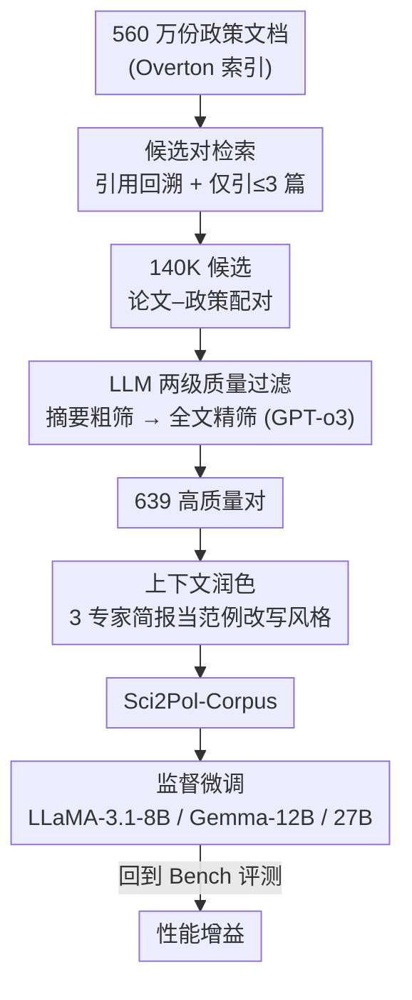

# Sci2Pol：评测与微调 LLM 的「科学→政策简报」生成能力

**会议**: ICLR 2026  
**OpenReview**: [https://openreview.net/forum?id=S6gJESWNSX](https://openreview.net/forum?id=S6gJESWNSX)  
**代码**: https://github.com/WeiminWu2000/Sci2Pol  
**领域**: NLP理解 / LLM评测 / 数据集与基准  
**关键词**: 政策简报生成, 评测基准, 训练语料, LLM-as-a-judge, 监督微调

## 一句话总结
本文提出首个面向「从科学论文生成政策简报（policy brief）」任务的评测基准 **Sci2Pol-Bench**（基于五阶段写作流程分解出 18 个任务）和训练语料 **Sci2Pol-Corpus**（从 560 万份政策文档中筛出 639 对高质量「论文–简报」配对），并指出 BERTScore/ROUGE 无法衡量简报质量、改用对齐专家判断的 LLM 评测指标；在语料上微调后，Gemma-3-27B 反超了规模大得多的 GPT-4o 与 DeepSeek-V3（671B）。

## 研究背景与动机
**领域现状**：把科学证据转化为可用的政策建议（policy brief）是一项重要但困难的工作——气候、公共卫生、技术变革等议题都急需来自科学界的及时输入。但政策制定者往往难以把密集、专业的研究读成清晰可用的指引，而多数科学家又缺乏政策写作经验。随着 LLM 能力变强，一个自然的问题是：LLM 能在多大程度上帮上忙，又该如何把它做得更好？

**现有痛点**：先前研究已表明 LLM 在科学内容上会产生幻觉、错误核验论断、给出不稳定或带偏见的政策推理。作者用专家审阅的样例进一步归纳出政策简报生成的四类典型缺陷：(i) **核心内容缺失**——漏掉定量发现、方法、背景，或塞进无关信息；(ii) **幻觉论断**——编造原文没有的数字或因果陈述；(iii) **语气不当**——即便准确也常过于技术化、冗长，不适合政策读者；(iv) **可执行性低**——建议含糊、缺乏证据支撑。

**核心矛盾**：要严肃评测这一能力，既需要把「写简报」这个笼统过程**拆解成可分级考查的子能力**，又需要一份**真实、领域匹配**的数据。然而这个方向此前**既没有基准也没有训练数据**：常用的 BERTScore/ROUGE 只看词面重叠，无法反映推理、结构和证据链接的质量；同时也缺少能用于微调、风格贴近专家简报的配对语料。

**本文目标**：(1) 造一个细粒度、可分级的评测基准，回答「LLM 现在能做到什么程度」；(2) 造一份针对性训练语料，回答「怎么把它做得更好」。

**切入角度**：借鉴「渐进式、面向能力」的评测框架思想，作者把简报写作**模仿人类写作流程**拆成五个阶段（自动补全→理解→摘要→生成→核验），每个阶段对应一组可量化的任务；并用「同一批作者既写论文又写简报」这一严格收录标准，保证 85 对配对反映的是真实专家解读。

**核心 idea**：用「五阶段 taxonomy → 18 任务 Bench」做诊断性评测、用「引用回溯 + LLM 过滤 + 上下文润色」三步从海量政策文档里炼出训练语料，把「科学↔政策」的鸿沟同时从「怎么评」和「怎么练」两端补上。

## 方法详解

### 整体框架
本文不是一个模型方法，而是一套「评测 + 训练」的双资产基础设施，整体分两条线：

- **Sci2Pol-Bench（评测线）**：以 **Sci2Pol-Taxonomy** 五阶段（Autocompletion / Understanding / Summarization / Generation / Verification）为骨架，配出 18 个任务，覆盖选择题与开放式写作两种形式；其中针对最难的「生成」阶段，专门设计了一套基于 LLM-as-a-judge 的 reference-based 指标取代 BERTScore/ROUGE。用它一次性评测 13 个开源/商用 LLM。
- **Sci2Pol-Corpus（训练线）**：从 Overton 索引的 560 万份政策文档出发，沿「引用回溯检索 → LLM 两级质量过滤 → 上下文风格润色」三步，最终炼出 639 对高质量「论文–简报」训练对，再用它监督微调三个开源模型并回到 Bench 上验证增益。

两条线共用同一批 85 对专家撰写的「论文–简报」金标准：Bench 用它们构造领域目标，Corpus 用它们当润色风格的 in-context 参考。下面这张图刻画的是「训练线」的语料炼制管线（评测线偏静态任务定义，不必画图）：

### 关键设计

**1. Sci2Pol-Taxonomy 与 18 任务 Bench：把「写简报」拆成可分级考查的五阶段**

整个基准的地基是一个模仿人类写作流程的五阶段分解：**Autocompletion**（给前两句选/复原第三句，考局部连贯与流畅度）、**Understanding**（句子意图分类 + 科学知识选择题，考事实理解）、**Summarization**（把技术段落浓缩成政策读者能懂的摘要）、**Generation**（从零起草政策简报内容，考证据综合与说服性表达）、**Verification**（把论断对照原文做事实核验，考抗幻觉）。五个阶段呈能力递进，落到 18 个任务上（Table 1）：自动补全 4 个（任务 1–4，各 255 条，Micro F1）、理解 2 个（任务 5 句子分类 1200 条、任务 6 借 MMLU-Pro 1000 条）、摘要 4 个（任务 7–10，各 200 条，reference-free 分）、生成 5 个（任务 11–15，各 85 条，reference-based 分，含「政策问题/研究发现/研究方法/政策启示」分节生成 + 整篇简报生成）、核验 3 个（任务 16 自建 850 条、任务 17 借 SciRIFF 1000 条、任务 18 政策启示核验 700 条）。

这样拆解的价值在于：单看「整篇简报写得好不好」是个糊成一团的整体评分，无法定位模型到底栽在「漏内容」还是「编数字」还是「语气不对」。把生成进一步切成分节任务（11–14）+ 整篇任务（15），就能把**事实精度**与**整体连贯性**解耦——分节任务强调准确接地，整篇任务考查可读性，两者一起评才能暴露单看任务 15 看不到的权衡。所有配对都坚持「简报作者 = 论文作者」这一严格收录标准，确保政策内容是真实的专家解读而非二手转述。

**2. 面向生成任务的 LLM-as-a-judge reference-based 指标：让评分对齐专家判断而非词面重叠**

作者先实证地否掉了老指标：BERTScore 即便关键段落整段缺失，分数依然很高，因为重叠词会把相似度撑起来；ROUGE 则对改写过度惩罚，意思没变、只是换了语法措辞分数就骤降。两者都抓不住推理、结构和证据链接——而这恰恰是政策简报的命门。于是对任务 11–15 改用「论文接地的评分细则（rubric）+ LLM judge（Gemini-2.5-Pro）」的内容感知打分，每个任务的细则都是为该节量身定制的。

具体而言：**任务 11（政策问题）**按内容 + 结构打分，把政策问题拆成背景/现存问题/后果/需关注问题/支撑细节五部分，逐部分同时判「在论文里有多重要」和「候选写得有多好」，兼顾相关性与质量；**任务 12（研究发现）**只按内容打，评完整性、重要性、准确性、是否抓重点而非长列表、是否界定清范围；**任务 13（研究方法）**评「清晰度与目的、技术细节是否适配政策读者、术语是否用大白话解释」，其中前两项权重更高；**任务 14（政策启示）**评准确性（不能幻觉）、覆盖度、简洁不冗余、与论文主旨对齐；**任务 15（整篇）**则内容 + 风格一起评，看上下文深度、幻觉风险（每条论断都要可追溯到原文）、可读性语气、可执行性。这套 rubric-anchored 打分把「四类缺陷」逐条变成了可量化的扣分项。摘要任务（7–10）因为没有唯一正确答案，则用 reference-free 分，从清晰度/准确性/覆盖度/总体质量四维由 LLM judge 评。

**3. Sci2Pol-Corpus 三步炼制：从 560 万政策文档里反向挖出「论文–简报」训练对**

光有评测不够，作者还要造能用来微调的语料，难点是「真实的政策简报很稀有」。三步管线把海量政策文档逐级提纯：

(i) **候选对检索**：从 Overton（全球最大政策文献库）索引的 560 万份政策文档出发，借其引用元数据反查每份文档引用的科学论文，每条引用就是一个候选「论文–简报」对。关键启发式是「一份政策文档引用的论文越少，越可能聚焦于其中每一篇」，因此只保留**引用不超过 3 篇论文**的政策文档，得到 14 万候选对。

(ii) **LLM 两级质量过滤**：用 GPT-o3 判断政策文档是否真的以被引论文为中心。为压成本采用粗筛 + 精筛：**粗筛**只喂论文摘要（从 SciSciNet 取；14 万篇全文按每词一 token 估算超 7 亿 token、$2/百万 token 成本过高），判摘要与政策文档是否对齐，得 1407 对；随后处理超长文档——1407 对里 777 对政策文档不足 10 页直接留用，630 对过长的则手工抽其「执行摘要（executive summary）」当伪简报、剩余正文当伪论文，回收 234 对，合计 1011 对；**精筛**再用 GPT-o3 喂全文做细判，并额外加一条「论文与政策文档相似度」准则，剔除那些由同一长文档拆出、两半文本过于雷同的对，最终留 639 对。

(iii) **上下文润色**：官方政策文档的格式与文风并不等于标准 policy brief，于是从 85 对专家配对里选 3 对当 in-context 范例，让 GPT-o3 在保留事实与引用的前提下把文档改写成标准简报。作者强调这一步**只迁移写作风格与结构、不注入范例里的科学/政策内容**，并另做实验验证未从 Bench 泄漏信息。

**4. 监督微调验证语料价值：小模型靠领域监督反超大模型**

最后用 Sci2Pol-Corpus 对 LLaMA-3.1-8B-Instruct、Gemma-3-12B、Gemma-3-27B 做监督微调（SFT），回到 Bench 上对比微调前后。结论是三者在 Bench 上都获得一致提升，且微调后的 Gemma-3-27B 平均分反超规模大得多的 GPT-4o 与 DeepSeek-V3（671B）。这一对照说明：对「科学→政策」这类高度领域化的任务，**针对性的领域监督可以盖过单纯的参数规模**——语料确实捕捉到了政策相关的推理模式，而非泛泛的通用能力。

## 实验关键数据

### 主实验：13 个 LLM 在 Sci2Pol-Bench 上的表现
全部用 1000 次 bootstrap 显著性检验（seed=42）报均值±方差；生成/摘要类由 Gemini-2.5-Pro 当 judge。

| 排名 | 模型 | Auto.(1-4) | Under.(5-6) | Sum.(7-10) | Gene.(11-15) | Ver.(16-18) | 平均 |
|------|------|-----------|------------|-----------|-------------|------------|------|
| 1 | Grok-3-beta | 50.77 | 80.12 | 83.26 | 86.70 | 85.45 | **77.01** |
| 2 | DeepSeek-R1 | 44.76 | 86.61 | 80.83 | 84.75 | 83.84 | 75.05 |
| 3 | Qwen3-235B | 47.22 | 87.19 | 77.02 | 84.80 | 83.76 | 74.81 |
| 4 | DeepSeek-V3 | 39.54 | 79.35 | 78.97 | 86.23 | 85.48 | 73.35 |
| 5 | GPT-4o | 52.17 | 77.17 | 74.23 | 76.39 | 85.45 | 72.12 |
| 6 | Gemma-3-27B | 43.60 | 67.82 | 74.55 | 84.82 | 84.29 | 71.40 |
| 13 | LLaMA-3.1-8B-IT | 27.12 | 47.74 | 64.42 | 65.78 | 76.25 | 56.63 |

最强的 Grok-3-beta 平均也只有 77.01，离满分尚远，说明这个任务对当下顶级 LLM 仍有显著提升空间；尤其 **Autocompletion 阶段普遍偏低**（多数模型 40–53 分），是公认的短板。

### 微调实验：SFT 在 Sci2Pol-Corpus 上的增益

| 模型 | Sum.(7-10) | Gene.(11-15) | 平均 | 增益 |
|------|-----------|-------------|------|------|
| LLaMA-3.1-8B-IT | 64.42 | 65.78 | 56.63 | — |
| LLaMA-3.1-8B-SFT | 78.28 | 77.62 | 64.27 | **+7.64** |
| Gemma-3-12B | 71.79 | 77.34 | 68.47 | — |
| Gemma-3-12B-SFT | 84.19 | 78.57 | 71.59 | +3.12 |
| Gemma-3-27B | 74.55 | 84.82 | 71.40 | — |
| Gemma-3-27B-SFT | 86.36 | 81.53 | 73.43 | +2.03 |
| GPT-4o（参考） | 74.23 | 76.39 | 72.12 | — |
| DeepSeek-V3（参考） | 78.97 | 86.23 | 73.35 | — |

### 关键发现
- **小模型反超大模型**：微调后的 Gemma-3-27B 平均 73.43，超过 GPT-4o（72.12）与 DeepSeek-V3/671B（73.35），印证领域监督可盖过规模。
- **增益主要来自摘要**：三个模型 SFT 后 Summarization 都大涨（如 LLaMA 64.42→78.28、Gemma-27B 74.55→86.36），说明语料最直接补强的是「把科学浓缩成政策语言」这一环。
- **生成阶段有取舍**：Gemma-3-27B 微调后 Generation 反而从 84.82 降到 81.53，提示 SFT 在拉高摘要/可读性的同时，可能轻微牺牲了原模型在分节生成上的接地精度——这正是把生成拆成分节 + 整篇两类任务才能看到的细节权衡。
- **老指标失效**：作者实证 BERTScore 在关键段缺失时仍偏高、ROUGE 对改写过度惩罚，二者都抓不住简报质量，这是改用 LLM-as-judge 指标的直接动机。

## 亮点与洞察
- **把「写作流程」当评测 taxonomy 的骨架**：用 Autocompletion→Understanding→Summarization→Generation→Verification 五阶段镜像人类写作，既自然又能分级定位模型短板，这个「按能力递进拆任务」的范式可迁移到任何复杂写作/推理评测。
- **先证伪老指标、再立新指标**：不是直接抛出 LLM judge，而是先用「关键段缺失 BERTScore 仍高、改写后 ROUGE 骤降」的实证把旧指标钉死，再用 rubric-anchored 打分对齐专家——这种「破而后立」的论证方式很有说服力。
- **从海量政策文档反向挖训练对**：「引用回溯 + 引用数≤3 启发式 + 摘要粗筛/全文精筛 + 长文档拆执行摘要回收」这套提纯流水线，本质是把「稀有的高质量配对」从 560 万份噪声里捞出来，思路可复用到任何「领域 A 文档 ↔ 领域 B 文档」配对数据的构造。
- **可商用价值**：639 对就能让 27B 反超 671B，说明对高度专业化任务，与其堆规模不如造对的小语料。

## 局限与展望
- **金标准规模小**：85 对专家配对是「已发表配对的全集」，生成类任务（11–15）每个只有 85 条评测样本，统计功效有限；且五种来源期刊里 Nature 系占绝大多数（气候/能源/可持续/城市），领域覆盖偏窄。
- **重度依赖 LLM judge**：摘要与生成评分都靠 Gemini-2.5-Pro / rubric，judge 自身的偏好和稳定性会传导到排名（作者在附录 H.6 做了可靠性分析，但仍是潜在系统性偏差来源）。
- **语料含伪配对**：Corpus 里有相当一部分来自「执行摘要当伪简报、剩余正文当伪论文」的拆分，以及 GPT-o3 润色后的文本，这与真正的专家手写简报之间仍有分布差距，微调出来的「政策风格」可能带 GPT-o3 印记。
- **生成阶段的负迁移**：Gemma-27B 微调后 Generation 掉点提示 SFT 配方还需在「摘要增强 vs 生成接地」之间更精细地平衡。

## 相关工作与启发
- **vs 通用科学理解基准（SciRIFF / MMLU-Pro）**：它们考的是科学知识与论断核验的通用能力，本文则把它们当作 Understanding/Verification 阶段的两个子任务（任务 6、17）嵌进来，整体目标是更专门的「科学→政策简报」全流程评测，多出了摘要、分节生成、整篇生成等政策导向任务。
- **vs 传统摘要/生成指标（BERTScore、ROUGE）**：本文实证这些词面/嵌入重叠指标在政策简报场景失效，改用论文接地的 rubric + LLM judge，优势是能衡量推理/结构/证据链接、劣势是引入了 judge 依赖与成本。
- **vs 「靠规模取胜」的范式**：本文用 639 对小语料让 27B 反超 671B，提供了「领域针对性监督 > 参数规模」的一个具体反例，对资源受限场景下的领域适配很有启发。

## 评分
- 新颖性: ⭐⭐⭐⭐⭐ 首个「科学→政策简报」的评测基准 + 训练语料，五阶段 taxonomy 与反向挖配对的语料管线都很有原创性。
- 实验充分度: ⭐⭐⭐⭐ 评测覆盖 13 个 LLM、微调验证三个模型、附录另有 10 项分析，但生成类每任务仅 85 样本、来源期刊偏窄。
- 写作质量: ⭐⭐⭐⭐⭐ 动机—taxonomy—指标—语料—微调五段逻辑清晰，「先证伪老指标」的论证尤其漂亮。
- 价值: ⭐⭐⭐⭐⭐ 为「科学证据→政策」这一高社会价值方向建立了首套可复用的评测与训练基础设施。

<!-- RELATED:START -->

## 相关论文

- [\[ICLR 2026\] Multi-LLM Adaptive Conformal Inference for Reliable LLM Responses](multi-llm_adaptive_conformal_inference_for_reliable_llm_response.md)
- [\[ICLR 2026\] RouterArena: An Open Platform for Comprehensive Comparison of LLM Routers](routerarena_an_open_platform_for_comprehensive_comparison_of_llm_routers.md)
- [\[ICLR 2026\] BiasScope: Towards Automated Detection of Bias in LLM-as-a-Judge Evaluation](biasscope_towards_automated_detection_of_bias_in_llm-as-a-judge_evaluation.md)
- [\[ICLR 2026\] Log Probability Tracking of LLM APIs](log_probability_tracking_of_llm_apis.md)
- [\[ACL 2026\] 正确信念的瓦解：临床压力下 LLM 的认知韧性研究](../../ACL2026/llm_evaluation/when_correct_beliefs_collapse_epistemic_resilience_of_llms_under_clinical_pressu.md)

<!-- RELATED:END -->
