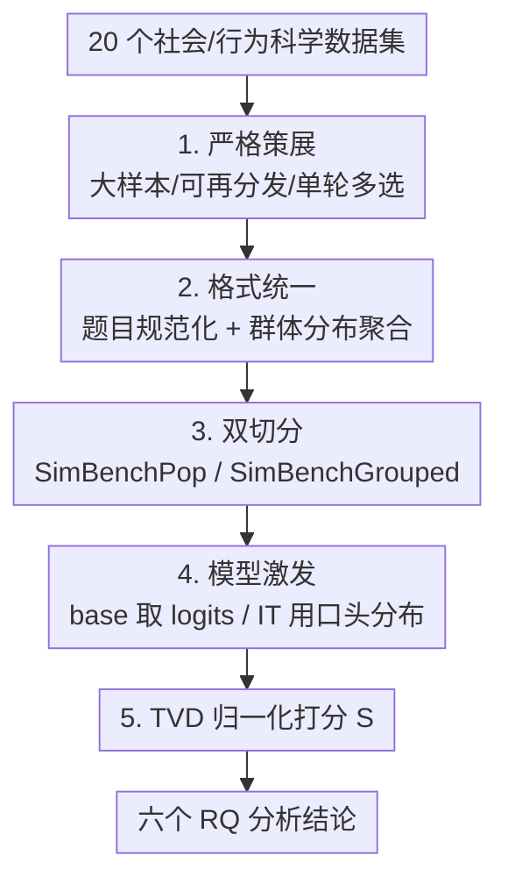

# SimBench: Benchmarking the Ability of Large Language Models to Simulate Human Behaviors

**会议**: ICLR 2026  
**OpenReview**: [https://openreview.net/forum?id=PL51SpN6ZJ](https://openreview.net/forum?id=PL51SpN6ZJ)  
**代码**: 有（GitHub + HuggingFace，论文附 Project Website）  
**领域**: LLM评测 / 社会模拟 / 行为科学  
**关键词**: 人类行为模拟, 群体分布预测, 对齐-模拟权衡, 总变差距离, 大规模基准

## 一句话总结
SimBench 把 20 个跨道德、经济、心理、政治的社会与行为科学数据集统一成「群体回答分布预测」任务，构建了首个大规模标准化的 LLM 人类行为模拟基准，并在 45 个模型上系统揭示：当前最强模型也只有 40.80/100 的中等保真度、模拟能力随规模对数线性增长但不随推理算力提升，且指令微调存在「对齐-模拟权衡」。

## 研究背景与动机
**领域现状**：用 LLM 模拟人类行为（替代或补充昂贵耗时的人类实验与问卷）正成为社会、心理、经济、政治学的热门方向，早期工作（Argyle、Horton、Aher 等）也给出了一些「LLM 能当模拟器」的乐观证据。

**现有痛点**：这些研究高度碎片化——绝大多数只在某个特定任务上评测一两个模型，用各自定制的任务和指标，结论彼此矛盾、无法横向比较。整个领域缺一套统一框架去回答「LLM 模拟在什么时候、怎样、为什么会成功或失败」，也无从判断如何训练更好的模拟器。

**核心矛盾**：模拟保真度的「度量」本身没有标准。不同论文用不同任务、不同人群、不同指标，得到的高低分根本不在同一个尺度上，于是「LLM 到底能不能模拟人」这个问题始终悬而未决。

**本文目标**：建立一个大规模、标准化、可复现的基准，把分散的实证证据收敛成一门「可测量的科学」，并围绕六个研究问题（RQ1–RQ6：总体能力、模型特性、任务选择、回答多样性、人群差异、与通用能力的相关性）系统刻画 LLM 的模拟能力。

**切入角度**：作者把「模拟人类行为」操作化为一个干净、可量化的代理任务——预测**群体层面的回答分布**（而非逐个个体），因为群体分布既能用分布距离严格打分，又天然缓解了训练数据污染（zero-shot 预测分布而非记忆答案）。

**核心 idea**：把 20 个异质数据集统一成「单轮多选 + 群体回答概率分布」的标准格式，用一个基于总变差距离（TVD）的归一化分数 $S$ 来度量保真度，从而让不同模型、任务、人群之间的模拟能力**第一次变得可比**。

## 方法详解

### 整体框架
SimBench 不是一个模型，而是一条「数据策展 → 格式统一 → 切分 → 模型激发 → 打分」的基准构建与评测流水线。输入是 20 个来自社会与行为科学仓库（Harvard Dataverse、ICPSR、OSF 等）的原始数据集，输出是每个模型在两个评测切分上的 SimBench 分数 $S\in(-\infty,100]$，以及围绕六个 RQ 的分析结论。

整条流水线的关键是把「人怎么回答」转写成「一道多选题 + 一个群体回答概率分布」：先按严格准则筛数据集，再把所有题目规范成多选格式、把个体回答聚合成群体分布作为「模拟目标」，然后切成 SimBenchPop（广人群）和 SimBenchGrouped（特定人群）两个评测集；评测时按模型类型用不同方式激发出模型预测的分布，最后用归一化 TVD 分数与人类真值比较。

### 关键设计

**1. 严格的数据策展准则：保证群体分布可靠且任务足够多样**

模拟保真度要可信，前提是每道题背后的人类分布本身可靠、且覆盖足够多样的「人类行为」。作者用一套硬性筛选准则过滤候选数据集：参与者数量大（才能聚合出有意义的群体分布）、许可宽松（可再分发）、**单轮自洽的题目**（避免多轮/条件交互引入混淆）、多选或有序回答格式（才能量化）、英文题面或经过验证的翻译。在准则之上还做策展权衡：优先用没被 LLM 模拟评测用过的新数据集，同时纳入 OpinionQA、ChaosNLI 这类成熟基准保证向后可比；优先带丰富社会人口学标注的数据集以支持细粒度分析，但也为 Jester、Choices13k 这种缺人口学但任务独特的数据集开特例。

最终留下的 20 个数据集在「任务」和「人群」两个维度上都刻意求多样：任务上涵盖决策（Choices13k、MoralMachine）、自我评估（OpinionQA、OSPsychBig5）、判断（ChaosNLI、Jester）、解题（WisdomOfCrowds、OSPsychMGKT）四类；人群上跨 130+ 国家、六大洲，盎格鲁圈西方只占 27.9%，其中 8 个数据集用代表性抽样以增强生态效度。多样性本身就是设计目标——只有这样，高分才意味着「真能模拟各种人的各种行为」，而不是只会答某一类问题。

**2. 异质数据集的格式统一：题目规范化 + 群体分布聚合**

20 个数据集格式五花八门，要可比就必须先抹平差异。这是 SimBench 的核心贡献之一，分两步：**题目规范化**把所有题统一成多选格式，做最小改动——主要是把原有离散选项映射到标准字母键，每个键对应单个 token，这样能从 base 模型干净地抽出每个选项的概率；连续量表（如 Jester）离散化分箱，必要时合并选项、上限 26 个选择（通常少于 10），并统一用官方英文版题面。坚持用英文是刻意为之：避免把「模拟能力」和「多语种能力」混在一起，让分数差异只反映模拟保真度。

**回答聚合**把数据标准化成群体层面的概率分布：大多数提供个体回答的数据集由作者自己聚合并在适用时加事后分层权重（如 ESS），少数已聚合的（如 GlobalOpinionQA）则规整到 SimBench schema。模拟目标分两种造法——**默认分组**对一题的全部参与者聚合，得到该数据集的「默认人群」分布，量度一般模拟能力；**特定分组**对带丰富人口学标注的数据集，按某个属性（年龄、性别等）聚合出更细粒度目标，量度模拟特定群体的能力。每个模拟目标都配一段描述对应人群的 prompt。整个过程产出 10,930,271 个唯一的「题目-群体」模拟目标。

**3. 双切分设计：SimBenchPop 与 SimBenchGrouped 探测两个不同侧面**

千万级目标太多无法全评，作者据此精选两个切分，各探测一个侧面。**SimBenchPop** 用全部 20 个数据集、每题配默认分组 prompt，得 7,167 个测试用例，衡量「模拟广泛多样人群」的能力。**SimBenchGrouped** 只取 5 个大规模调查数据集（Afrobarometer、ESS、ISSP、Latinobarómetro、OpinionQA，只有它们样本量大到在按某个人口学属性条件化后仍能给出可靠分布），并专门挑「在不同人群间方差最大」的题目，得 6,343 个用例，衡量「按指定群体特征模拟较窄人群」的能力。两者分工明确：前者看通用模拟，后者看条件化到具体人群时模拟能力会掉多少。

**4. 基于 TVD 的归一化分数 $S$：让不同熵水平的数据集可比**

要在熵水平差异巨大的数据集间公平打分，作者从总变差距离（TVD）导出 SimBench 分数 $S$，度量模型预测 $Q$ 相对均匀基线 $U$、朝人类真值 $P$ 改进了多少：

$$S(P, Q) = 100\left(1 - \frac{\mathrm{TVD}(P, Q)}{\mathrm{TVD}(P, U)}\right)$$

100 表示完美对齐，0 等同于随机猜测（均匀分布）。但当某题人类分布本身就接近均匀（$P=U$）时分母趋零、逐题计算不稳定，于是实际上对每个测试用例 $i$ 用**数据集级平均基线**归一化：

$$S_i = 100\left(1 - \frac{\mathrm{TVD}(P_i, Q_i)}{\frac{1}{|D|}\sum_{j\in D}\mathrm{TVD}(P_j, U_j)}\right)$$

分母是数据集 $D$ 内所有用例上「人类分布与均匀分布」的平均 TVD，这样指标在不同熵的数据集间都稳健。模型最终分是所有用例 $S_i$ 的平均；同时每个数据集封顶 500 题以免大数据集过度主导。模型激发也按类型分两路：base 模型直接取首 token logits 抽各选项概率；指令微调（IT）模型用**口头化分布**（prompt 让它输出「选项 A: 30%, 选项 B: 70%」），附录 E 证明对 IT 模型口头分布显著且一致地优于直接 token 概率。

## 实验关键数据

在 45 个 LLM（0.5B–405B，含商用/开源、base/IT）上评测，覆盖 RQ1–RQ6。

### 主实验

代表性模型在两个主切分上平均的 SimBench 分数（节选自全表）：

| 模型 | 类型 | $S$（↑） |
|------|------|--------|
| Claude-3.7-Sonnet | IT/闭源 | 40.80 |
| Claude-3.7-Sonnet-4000（带推理预算） | IT/闭源 | 39.46 |
| GPT-4.1 | IT/闭源 | 34.55 |
| DeepSeek-R1 | IT/开源 | 34.52 |
| Llama-3.1-405B-Instruct | IT/开源 | 28.40 |
| Qwen2.5-72B-Instruct | IT/开源 | 27.61 |
| OLMo-2-32B（最强 base） | Base/开源 | 15.90 |
| Gemma-3-4B-PT | Base/开源 | -0.65 |
| Qwen2.5-3B-Instruct | IT/开源 | -12.04 |
| OLMo-2-7B-Instruct | IT/开源 | -21.36 |

最强模型 Claude-3.7-Sonnet 也只有 40.80/100——预测分布仍更靠近均匀分布而非人类真值，但确实弥合了约 40% 的差距，存在「真实但有限」的模拟信号。多数模型 $S<20$，**10 个模型 $S<0$**（比随便给均匀分布还差），强烈警示别用小模型做模拟。

### 分析实验（RQ2–RQ6）

| RQ | 配置 / 变量 | 关键指标 | 结论 |
|------|-----------|---------|------|
| RQ2-规模 | 参数量 vs $S$ | 对数线性正相关 | 模拟能力随规模增长但边际递减 |
| RQ2-算力 | o4-mini low→high | 27.77 → 28.99 | 推理算力几乎无帮助 |
| RQ2-算力 | Claude-3.7 加 4000 推理预算 | 40.80 → 39.46 | 反而略降 |
| RQ2-算力 | GPT-4.1 加 CoT | 34.55 → 33.11 | 略降 |
| RQ4-权衡 | $\Delta S$=IT−base vs 人类回答熵 | $r=-0.942$ | 对齐-模拟权衡：低熵共识题 +40 分、高熵分歧题转为负 |
| RQ4-中介 | 因果中介分解 IT 效应 | 直接 +6.46 / 间接 −1.74 | 正向遵循指令 vs 负向降熵两股相反力 |
| RQ5-人群 | grouped vs ungrouped $\Delta S$ | 全为负，宗教虔诚度 −9.91 最差 | 模拟特定人群更难，宗教/政治意识形态最难 |
| RQ6-相关性 | $S$ vs 能力基准 | MMLU-Pro $r=0.94$、GPQA $r=0.86$ | 模拟能力最相关于知识密集型推理，而非数学/对话 |

### 关键发现
- **对齐-模拟权衡是核心发现**：指令微调的「寻模」目标（mode-seeking KL，$D_{KL}(q\Vert\sigma)$）让模型把概率质量集中到单一高奖励模式，在低熵共识题上最多 +40 分，但在高熵多元题上系统性恶化，熵≈0.8 处越过「无改进」线、更高熵处 IT 反而比 base 差；这与预训练「覆模」目标（mass-covering KL，$D_{KL}(p\Vert q)$）保留多模态多样性形成对照。
- **推理算力无效**：无论换高推理档位、加推理预算还是 CoT，模拟保真度都没有有意义提升甚至略降——作者推测 CoT 强制了过度理性的审慎，与人类常靠启发式直觉的回答不匹配。
- **任务难度差异巨大**：模型最擅长态度/自评类调查题（OpinionQA、Afrobarometer），在行为选择题（Choices13k、MoralMachine）上明显变差（佐证 LLM 的「价值-行动鸿沟」），在与对齐目标冲突的特质上（马基雅维利主义 OSPsychMACH、阴谋论 ConspiracyCorr、幽默评分 Jester）常差于均匀基线。
- **专才认知微调 vs 通用对齐**：Centaur（Llama 在 Psych-101 上微调）以「避免降熵的负向间接效应」改进（$S=8.54$），通用指令微调以「正向直接效应」改进（$S=16.56$），二者走相反机制——暗示未来最佳模拟器需要融合两条路径。

## 亮点与洞察
- **把「模拟人」收敛成可打分的分布预测任务**：用群体回答分布 + TVD 归一化分数，既让 20 个异质数据集横向可比，又把训练污染风险压到很低——这是把一片碎片化研究变成「可测量科学」的关键工程。
- **对齐-模拟权衡有理论也有因果证据**：作者不止给出 $r=-0.942$ 的强经验关系，还用「RL 即贝叶斯推断」框架解释（寻模 vs 覆模 KL），再用因果中介把 IT 效应拆成 +6.46 直接 / −1.74 降熵间接两股力，论证链条完整，可直接启发「分布保持的对齐」研究。
- **可迁移的指标设计**：用数据集级平均 TVD 当分母做归一化，避免了 $P=U$ 时分数发散，这个「按基线难度归一」的技巧可迁移到任何「不同子集熵差异大」的分布预测评测。

## 局限与展望
- **静态单轮 ≠ 完整模拟**：作者承认群体分布预测只是行为模拟的代理，真实人类模拟含交互、开放式、随时间演化的复杂动态，本基准（单轮多选）捕捉不到。
- **整体非代表性**：虽然部分子数据集用代表性抽样，但 SimBench 整体并不代表任何单一总体；交叉人群（如「女性+30-49 岁」）因样本不足、抽样噪声大而无法可靠评测。
- **英文化的取舍**：统一用英文题面避免混入多语种能力，但也牺牲了「模拟能力是否与提示语言相关」这一维度，作者把它留作未来工作。
- **改进方向**：发展分布保持的对齐技术以缓解对齐-模拟权衡；探索权重插值、推理期放大 system prompt 服从度等手段；把基准从标准化格式扩展到交互式与开放式行为模拟。

## 相关工作与启发
- **vs 既有 LLM 模拟研究（Argyle / Horton / Binz 等）**: 它们多聚焦个体层面、最小人口学条件化、只测一两个模型、用各自定制指标；SimBench 做群体层面、系统人口学条件化、45 模型、统一 TVD 分布指标，把分散结论收敛成可比的整体图景。
- **vs Centaur（Psych-101 专才认知微调）**: SimBench 的多样性使其成为 Centaur 泛化能力的强 OOD 测试，并揭示专才微调与通用对齐走相反机制——前者靠保留高熵多样性、后者靠正向遵循指令。
- **vs MMLU 等能力基准**: 作者类比 MMLU 推动 LLM 进步，定位 SimBench 为「让模拟从 ad-hoc 研究变成可测量科学」的基础设施；并实证发现模拟能力与 MMLU-Pro 高度相关（$r=0.94$），说明它根植于广义知识密集推理而非窄技能。

## 评分
- 新颖性: ⭐⭐⭐⭐⭐ 首个大规模标准化群体行为模拟基准，并把对齐-模拟权衡讲到理论+因果层面
- 实验充分度: ⭐⭐⭐⭐⭐ 45 模型 × 20 数据集 × 6 RQ，含规模、算力、人群、相关性多维分析
- 写作质量: ⭐⭐⭐⭐⭐ RQ 驱动、结论清晰、指标与机制解释到位
- 价值: ⭐⭐⭐⭐⭐ 为社会模拟研究提供可复现的度量基础设施，直接指向「分布保持对齐」新方向

<!-- RELATED:START -->

## 相关论文

- [\[ICLR 2026\] AlphaBench: Benchmarking Large Language Models in Formulaic Alpha Factor Mining](alphabench_benchmarking_large_language_models_in_formulaic_alpha_factor_mining.md)
- [\[ICLR 2026\] Prompt and Parameter Co-Optimization for Large Language Models](prompt_and_parameter_co-optimization_for_large_language_models.md)
- [\[ICLR 2026\] SparseEval: Efficient Evaluation of Large Language Models by Sparse Optimization](sparseeval_efficient_evaluation_of_large_language_models_by_sparse_optimization.md)
- [\[ICLR 2026\] Multi-turn Evaluation of Anthropomorphic Behaviours in Large Language Models](multi-turn_evaluation_of_anthropomorphic_behaviours_in_large_language_models.md)
- [\[ICLR 2026\] CMPhysBench: A Benchmark for Evaluating Large Language Models in Condensed Matter Physics](cmphysbench_a_benchmark_for_evaluating_large_language_models_in_condensed_matter.md)

<!-- RELATED:END -->
