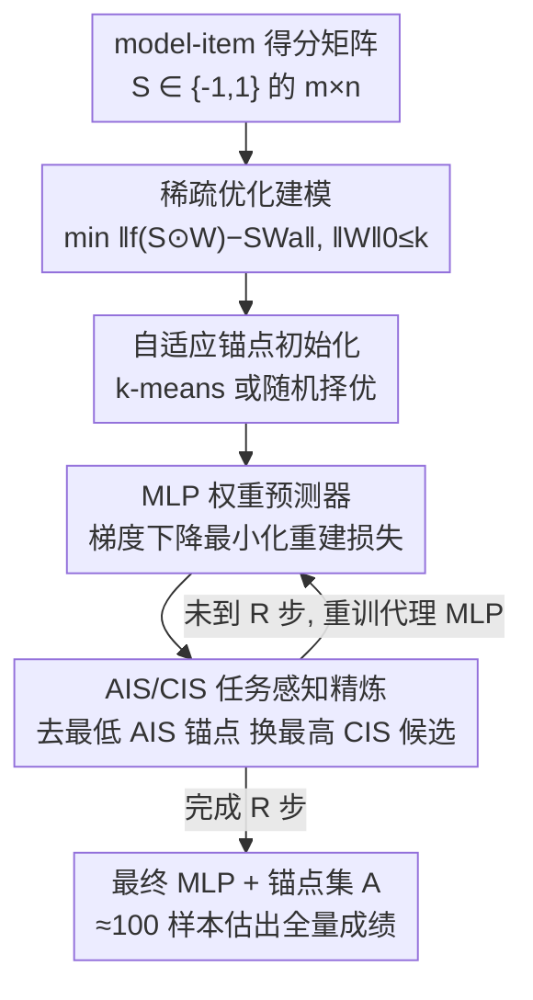

# SparseEval: Efficient Evaluation of Large Language Models by Sparse Optimization

**会议**: ICLR 2026  
**OpenReview**: [https://openreview.net/forum?id=CZAzAedGSV](https://openreview.net/forum?id=CZAzAedGSV)  
**代码**: https://github.com/taolinzhang/SparseEval  
**领域**: LLM 高效评估  
**关键词**: 高效评估, 锚点选择, 稀疏优化, 基准子集, 性能预测

## 一句话总结
本文把"用少量样本估计 LLM 在整个基准上的成绩"形式化为一个稀疏优化问题，首次用梯度下降的 MLP 直接学习锚点权重，并通过 AIS/CIS 两个重要性分数迭代替换锚点，只用约 100 个样本就能把估计误差压到 1–2% 并保持很高的排名一致性（Kendall's τ）。

## 研究背景与动机
**领域现状**：随着 LLM 规模膨胀，跑一遍 MMLU、HellaSwag 这类成千上万样本的基准变得越来越贵。"高效评估"（Efficient LLM Evaluation）这条线想做的是：只挑一小撮代表性样本（anchor），用它们估出模型在全量基准上的真实成绩与排名。已有方法走两条路——基于 IRT（如 TinyBenchmark/gp-IRT）拟合题目难度再聚类选点，或基于自适应聚类（如 TailoredBench）为每个模型定制子集。

**现有痛点**：这些方法大多依赖**额外的表示**——要么需要题目的 prompt 嵌入、要么需要预测概率分布来度量样本相似度，这些资源往往昂贵或难获取；更关键的是，锚点一旦由聚类选定就**固定不动**，权重也只是按聚类分布静态赋值，没有真正参与"用子集重建全量成绩"这个端到端目标的优化。结果是：当评测的模型数量放大到数千个时，这些聚类/IRT 方法吃不下这么大的数据量，100 个样本下估计误差常常超过 2%。

**核心矛盾**：高效评估的本质是"用 $k$ 个样本的加权平均去逼近全量平均"，这天然是一个带 $\ell_0$ 稀疏约束的优化问题；但过去的方法要么把聚合函数限制成线性、要么把选点和赋权割裂开，没有把"选哪些点"和"怎么赋权"放进同一个可微目标里联合求解。

**本文目标**：(1) 定量证明评测矩阵确实存在稀疏性，从而正当化高效评估；(2) 给定锚点时如何优化权重使其代表全量；(3) 如何让锚点选择被优化后的权重和下游任务共同引导。

**切入角度**：作者回到最原始的 model-item 得分矩阵 $S\in\{-1,1\}^{m\times n}$（对/错），直接对它做谱聚类，发现强烈的对角块结构（簇内相似度 0.72–0.89）和可观的簇间相似度——说明样本之间互相高度可预测，信息冗余巨大。这意味着不需要任何额外嵌入，稀疏性就藏在矩阵本身里。

**核心 idea**：把高效评估写成稀疏优化 $\min_{W,f}\,\|f(S\odot 1_mW^\top)-SW_a\|_1\ \text{s.t.}\ \|W\|_0\le k$，用 MLP 充当聚合函数 $f$、用梯度下降学锚点权重，再用基于"误差—梯度"的重要性分数迭代精炼锚点集合。

## 方法详解

### 整体框架
SparseEval 的输入是一个大规模 model-item 得分矩阵（数千个模型 × 整个基准的所有题目），输出是一个只含 $k$ 个锚点的子集 $A$ 及其权重函数 $f$，使得在锚点上算出的预测成绩能逼近全量真实成绩 $SW_a$（$W_a=\frac1n\mathbf 1_n$ 是均匀平均向量）。整体分两步走：先用 k-means/随机做自适应初始化得到一组锚点，然后进入"训练代理 MLP → 算 AIS/CIS → 换掉最差锚点 → 再训练"的精炼循环，循环 $R$ 步后用选定锚点训练一个最终 MLP 作为权重预测器。

### 关键设计

**1. 稀疏优化建模：把高效评估从"选点"重写成"带稀疏约束的可微目标"**

过去的方法把"挑代表样本"当成一个聚类/选择问题，本文先把它正本清源成优化问题。给定稀疏度 $k$，对每个题目引入权重向量 $W\in\mathbb R^n$（$\|W\|_0\le k$），构造稀疏输入 $S'=S\odot(1_mW^\top)$，再让一个聚合函数 $f$ 把稀疏输入映射成基准总分。目标是让它逼近真实全量成绩：

$$\min_{W,f}\ \big\|f(S\odot 1_mW^\top)-SW_a\big\|_1\quad\text{s.t.}\ \|W\|_0\le k.$$

这个写法的价值在于它统一了视角：当 $f$ 退化成线性函数时，$f$ 可被 $W$ 吸收，目标就还原成所有前人方法的"加权平均逼近全量平均"$\min_W\|SW-SW_a\|_1$；而当 $f$ 用 MLP 这类非线性函数时，就能表达出比线性加权更丰富的"锚点 → 全量"映射。换句话说，前人方法只是本文框架在线性特例下的一个点。作者还用谱聚类给出稀疏性的实证依据（簇内相似度 0.72–0.89、簇间也相当高），说明用少数锚点重建全量在原理上可行。

**2. MLP 权重预测器：用梯度下降直接端到端学锚点权重，而非静态赋权**

这一步针对"锚点权重靠聚类分布静态指定、没进优化"的痛点。作者观察到，既然聚合函数 $f$ 可以用 MLP 近似，那就可以把锚点的预测作为 MLP 输入、把全量真实成绩作为回归目标，端到端最小化重建损失：

$$L=\frac1M\big\|f(S_{\text{train}}\odot 1_MW^\top)-S_{\text{train}}W_a\big\|^2.$$

这里 $S_{\text{train}}\in\mathbb R^{M\times n}$ 是 $M$ 个训练模型的得分矩阵。MLP（基准上用 4 层）通过反向传播自动学到"哪些锚点该被放大、哪些该被抑制"，相当于把权重赋值这件事从手工聚类启发式换成了由重建误差驱动的可微学习。这也是 SparseEval 能吃下 5000 个模型这种大数据量的根本原因——梯度下降天然适配大规模回归，而 IRT 拟合和 k-means 聚类在这个体量下力不从心。

**3. 自适应锚点初始化：按数据集簇结构强弱在 k-means 与随机之间择优**

精炼循环需要一个起点。基于"多数数据集簇内相似度强"的观察，作者默认用 k-means 聚类初始化锚点，让初始点直接覆盖原始数据的簇结构、与后续梯度优化配合良好。但对 MMLU 这类簇内相似度偏弱（0.72）的数据集，随机初始化反而常常更好、有时还超过 k-means。因此实际采用自适应策略：对每个数据集，在一小批验证模型上分别试 k-means 和随机初始化，选表现更好的那个作为最终初始化。这个设计虽小但务实——它承认"没有一种初始化对所有基准都最优"，把选择权交给验证集。

**4. AIS/CIS 任务感知精炼：用误差与梯度把固定锚点换成对下游估计更有用的锚点**

无论 k-means 还是随机，初始化都没参与端到端优化、且初始化后锚点固定，子集对"性能估计"这个下游任务未必最优。作者从端到端训练中天然涌现的两样东西——误差和梯度——构造两个重要性分数来驱动替换。先算模型级校准残差 $e=f(S\odot 1_mW^\top)-SW_a$：$e_j>0$ 表示代理模型高估了模型 $j$，反之低估。

对每个**候选**（非锚点）题目 $i$，它的"对错模式"$S_{:,i}$ 若与残差结构对齐（残差为正处它常为 +1、残差为负处它常为 −1），二者点积绝对值就大，说明这个题目能稳定指示模型被高估还是低估，是有价值的特征。由此定义候选重要性分数：

$$\text{CIS}_i=\big|(S_{:,i})^\top e\big|=\big|(S_{:,i})^\top\big(f(S\odot 1_mW^\top)-SW_a\big)\big|.$$

对每个**锚点** $i$，则用反向传播时它在第一层的梯度幅度衡量其对降低误差的贡献（作者指出对快速训练的代理模型，梯度绝对值比权重激活更能直接反映影响）：

$$\text{AIS}_i=\Big\|\frac{\partial L}{\partial S_{:,i}}\Big\|_1.$$

每一步精炼：训练代理 MLP → 算所有锚点的 AIS 和候选的 CIS → 移除 AIS 最低的锚点 $i^\star=\arg\min_i\text{AIS}_i$、加入 CIS 最高的候选 $j^\star=\arg\max_j\text{CIS}_j$。重复 $R$ 步（论文设为 10）。作者还从理论上证明：线性设置下这种"去最弱锚点、补最强候选"的替换不会增大重建误差（命题 2，$E(A')\le E(A)$，且当 $|s_{j^\star}^\top r|>|s_{i^\star}^\top r|$ 且新点不在旧锚点张成的线性空间内时严格下降），给替换规则提供了理论支撑。

### 损失函数 / 训练策略
核心是上面的平方重建损失 $L$（式 3），用梯度下降优化、学习率 6e-4。流程见 Algorithm 1：初始化锚点 → 做 $R=10$ 步 AIS/CIS 精炼（每步代理 MLP 训 $E$ 个 epoch）→ 用选定锚点训练最终 MLP（$F$ 个 epoch，架构相同但输入特征数变化）。实验把模型数从 TinyBenchmark 的 300 扩到 5000，随机取 200 个模型平分为验证集和测试集，其余作训练集。

## 实验关键数据

### 主实验
六个基准（ARC / GSM8K / HellaSwag / MMLU / TruthfulQA / Winogrande），对比 Anchor Points、gp-IRT、TailoredBench，指标为 MAE（估计误差，越低越好）和 Kendall's τ（排名一致性，越高越好）。下表取锚点数 = 100（最贴近"约 100 样本"的设定）：

| 数据集 | 指标 | SparseEval | TailoredBench | gp-IRT | Anchor Points |
|--------|------|-----------|---------------|--------|---------------|
| ARC | MAE↓ / τ↑ | **1.165** / **0.917** | 2.413 / 0.873 | 2.274 / 0.787 | 10.620 / 0.578 |
| GSM8K | MAE↓ / τ↑ | **1.619** / **0.936** | 4.203 / 0.912 | 2.424 / 0.887 | 5.295 / 0.842 |
| HellaSwag | MAE↓ / τ↑ | **0.827** / **0.918** | 1.968 / 0.876 | 1.750 / 0.783 | 2.012 / 0.889 |
| MMLU | MAE↓ / τ↑ | **0.842** / **0.908** | 2.019 / 0.862 | 2.202 / 0.829 | 7.890 / 0.764 |
| TruthfulQA | MAE↓ / τ↑ | **1.027** / **0.931** | 1.577 / 0.895 | 1.808 / 0.847 | 1.733 / 0.891 |
| Winogrande | MAE↓ / τ↑ | **1.027** / **0.897** | 3.120 / 0.788 | 1.957 / 0.725 | 3.019 / 0.810 |

在所有基准、所有锚点数（20/40/60/80/100）下，SparseEval 都同时拿到最低 MAE 和最高 τ，相比最强 baseline 最多低约 2% 估计误差、高约 0.1 的 τ。值得注意的是 Anchor Points 在 ARC/MMLU 的 100 锚点处误差反而暴涨到 10%+，暴露了聚类方法在大模型量下的不稳定。

### 消融实验
锚点选择策略消融（锚点 = 100，对比纯随机初始化、纯 k-means、完整 SparseEval）：

| 数据集 | Random (MAE/τ) | k-means (MAE/τ) | SparseEval (MAE/τ) |
|--------|----------------|------------------|---------------------|
| ARC | 1.339 / 0.890 | 1.218 / 0.913 | **1.165 / 0.917** |
| GSM8K | 1.857 / 0.928 | 1.631 / 0.938 | **1.619 / 0.936** |
| MMLU | 0.850 / 0.903 | — | **0.842 / 0.908** |
| TruthfulQA | 1.204 / 0.915 | 1.058 / 0.926 | **1.027 / 0.931** |
| Winogrande | 1.104 / 0.886 | 1.104 / 0.886 | **1.027 / 0.897** |

AIS/CIS 精炼在 k-means/随机初始化的基础上进一步降低误差，说明精炼确实把锚点调到了对下游估计更有用的位置。另有架构消融（图 4）对比线性权重 vs MLP：MLP 在各锚点数下 MAE 更低、τ 更高，验证了非线性聚合函数的价值。

### 关键发现
- **精炼带来的增益与初始化强相关**：簇结构强的数据集 k-means 初始化已很好、精炼锦上添花；MMLU 这类弱簇结构数据集随机初始化更优，凸显自适应初始化的必要。
- **MLP > 线性**：把聚合函数从线性换成 MLP 是误差下降的重要来源，印证了"把 $f$ 一般化"这个建模选择。
- **训练数据比例**（图 5）：即便训练模型比例下降，SparseEval 的 MAE/τ 仍稳定优于 TailoredBench，鲁棒性更好。

## 亮点与洞察
- **把高效评估"优化化"**：最大的洞见是发现前人所有线性加权方法都是 $\min_{W,f}\|f(\cdot)-SW_a\|$ 在 $f$ 线性时的特例，从而打开了用 MLP+梯度下降统一选点与赋权的口子——这是个能复用的"一般化框架"思路。
- **不依赖额外嵌入**：直接在 $\{-1,1\}$ 的对错矩阵上做谱聚类和优化，省掉了 prompt 嵌入/概率分布这些昂贵的外部表示，工程上更轻。
- **AIS/CIS 的残差对齐直觉很巧**：用"候选题目的对错模式与残差点积"度量一个题目能否稳定指示模型被高估/低估，把"选有信息量的样本"翻译成了一个可计算、可证明的量，并配了理论保证替换不增误差。

## 局限与展望
- **依赖已有的大规模 model-item 矩阵**：方法需要数千个模型在全量基准上的历史得分来训练，对一个全新、没有历史评测数据的基准并不能直接零成本启动。
- **只在六个相对标准化、单选/对错型基准上验证**：对开放式生成、多轮对话、需要人工/裁判模型打分的评测，"对错矩阵 + 谱聚类稀疏性"这套假设是否成立有待检验。
- **理论保证局限在线性设置**：命题 1/2 只在线性权重下证明"更多锚点不增误差、替换降误差"，而方法实际用的是 MLP 非线性 $f$，非线性下的最优性/收敛性没有同等保证（⚠️ 以原文为准）。
- 精炼步数 $R$、代理 MLP 训练 epoch 等超参对结果的敏感性可进一步系统分析。

## 相关工作与启发
- **vs gp-IRT / TinyBenchmark**: 它们拟合 IRT 题目难度再 k-means 选点、按聚类分布静态赋权；本文不拟合 IRT，直接在对错矩阵上端到端学权重，模型量放大到 5000 时优势明显。
- **vs TailoredBench**: 它为每个模型自适应定制子集；本文用统一的 MLP 预测器 + AIS/CIS 精炼，多数基准上 MAE 更低、τ 更高，且不需要逐模型定制开销。
- **vs Anchor Points**: 它用小而有代表性的子集分析模型，但选点固定；本文的迭代精炼让锚点随下游误差动态调整，避免了大模型量下误差暴涨的问题。

## 评分
- 新颖性: ⭐⭐⭐⭐ 首次把高效评估写成稀疏优化并用梯度下降的 MLP 学权重，AIS/CIS 残差对齐选点有理论支撑。
- 实验充分度: ⭐⭐⭐⭐ 六基准 × 五种锚点数全面对比，含初始化/架构/数据比例多组消融，但限于客观对错型基准。
- 写作质量: ⭐⭐⭐⭐ 从稀疏性证据到形式化再到方法的逻辑链清晰，理论与算法对应明确。
- 价值: ⭐⭐⭐⭐ 约 100 样本即可低误差估全量成绩，对动辄上万样本的 LLM 评测成本是实打实的节省。

<!-- RELATED:START -->

## 相关论文

- [\[ICLR 2026\] DISCO: Diversifying Sample Condensation for Efficient Model Evaluation](disco_diversifying_sample_condensation_for_efficient_model_evaluation.md)
- [\[ICLR 2026\] Prompt and Parameter Co-Optimization for Large Language Models](prompt_and_parameter_co-optimization_for_large_language_models.md)
- [\[ICLR 2026\] Multi-turn Evaluation of Anthropomorphic Behaviours in Large Language Models](multi-turn_evaluation_of_anthropomorphic_behaviours_in_large_language_models.md)
- [\[ICLR 2026\] Don't Pass@k: A Bayesian Framework for Large Language Model Evaluation](dont_passk_a_bayesian_framework_for_large_language_model_evaluation.md)
- [\[ICLR 2026\] Fewer Battles, More Gain: An Information-Efficient Framework for Arena-based LLM Evaluation](fewer_battles_more_gain_an_information-efficient_framework_for_arena-based_llm_e.md)

<!-- RELATED:END -->
