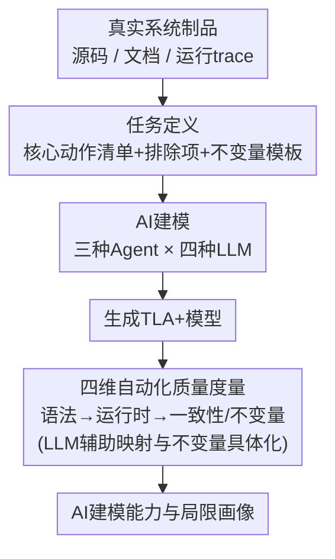

# SysMoBench: Evaluating AI on Formally Specifying Complex Real-World Systems

**会议**: ICLR 2026  
**OpenReview**: [https://openreview.net/forum?id=SAeaTz8YoM](https://openreview.net/forum?id=SAeaTz8YoM)  
**代码**: https://github.com/specula-org/SysMoBench  
**领域**: LLM评测 / 形式化建模 / Agent  
**关键词**: TLA+, 形式化规约, 系统建模, 自动化评测, 分布式系统

## 一句话总结
本文提出 SysMoBench——首个评测 AI 为真实复杂系统（并发/分布式）自动写形式化模型（TLA+）能力的基准，用语法、运行时、代码一致性、不变量四个可自动核验的度量打分，发现 LLM 能搞定 spinlock 这类小系统、但在 Etcd Raft 这类大型协议实现上严重力不从心。

## 研究背景与动机

**领域现状**：形式化模型（formal model）是验证大型复杂系统正确性的数学基石——把系统行为抽象成状态变量、初始谓词、动作（next-state relation）和时序属性，再用 TLC 这类模型检查器穷举状态空间来证明安全性/活性。TLA+ 是并发与分布式系统事实上的规约语言，被 Amazon、Microsoft、Google 等用来验证 Etcd、ZooKeeper、CosmosDB 等关键基础设施。

**现有痛点**：写和维护这些模型出了名地贵。和协议/算法不同，系统**实现代码**充满低层细节、更复杂、还不断演进，把它抽象成形式化模型往往要专家耗费数月到数年。生成式 AI（LLM + agent）近来在生成函数级规约（前置/后置条件、循环不变量）上展现了潜力，于是一个自然的问题是：AI 能不能直接为一个完整的真实系统写出形式化模型？

**核心矛盾**：现有工作几乎只针对小程序，没人系统地评测过 AI 给**完整系统**建模的能力。而建系统模型需要的能力和合成函数前后置条件完全不同——它要求 AI 理解系统设计（底层协议与算法）、推理故障与外部事件下的安全/活性、并把系统行为抽象成可执行程序。更要命的是没有现成的评测指标：已有 TLA+ 生成工作大多只检查 TLC 能不能跑起来，但"能跑"根本不等于"正确描述了系统"；拿人写的参考规约做对比又很脆弱，且真实系统通常压根没有这种底层规约。

**本文目标**：建一个不依赖人工评判、不依赖参考模型、能自动打分的基准，回答"今天的 LLM/agent 究竟能在多大程度上为真实复杂系统做形式化建模"。

**切入角度**：作者意识到一个高质量系统模型的"基本要求"是可以被工具客观核验的——语法是否合法（SANY）、能否被执行（TLC）、是否与真实代码执行轨迹一致（trace validation）、是否满足系统的安全/活性不变量。把这四件事自动化，就绕开了人工评判和参考模型的依赖。

**核心 idea**：用四个可自动核验的质量度量（语法 / 运行时 / 代码一致性 / 不变量）替代人工评判与参考模型对比，构建覆盖 11 个真实并发/分布式系统制品的 SysMoBench，让 AI 形式化建模能力第一次能被量化和复现。

## 方法详解

### 整体框架
SysMoBench 把"评测 AI 形式化建模"拆成一条清晰的流水线：给定一个真实系统制品（如 Etcd Raft 的源码、文档、运行 trace），任务定义指明哪些核心动作必须建模、哪些细节要排除，并附带描述系统正确性的不变量模板；AI（三种 agent × 四种 LLM）据此生成 TLA+ 模型；然后这个模型被送进四维自动化度量逐级评估——先静态查语法，过了再用 TLC 查运行时，能执行的再查与真实代码轨迹的一致性、以及是否满足不变量；最终汇总出 AI 的能力与局限画像。注意这四个度量是**有依赖的级联**：语法不过就无法编译、后续度量直接归零。

### 关键设计

**1. 任务定义：用核心动作清单 + 不变量模板把"建什么"说清楚**

形式化建模没有唯一正确答案，粒度太粗会漏掉关键行为、太细又陷入无关实现细节，所以评测的第一难题是"建到什么程度算对"。SysMoBench 为每个系统制品定义一个任务，明确列出**必须建模的核心动作**和**应当排除的动作**。以 spinlock 为例：必须建模 `lock()`/`unlock()`、对锁变量的原子 compare-exchange、争用时的自旋等待；而 RAII guard 的实现细节、调试格式化、trait 实现等非核心内容则排除。任务的粒度由目标用例决定——本文目标是基于模型检查的系统验证，所以要求与已有验证/查 bug 工作相同的详细程度。关键在于它评的是**行为一致性而非结构等价**：只要模型保留了验证所需的语义义务，允许对核心动作做细粒度建模，而不强求和某个参考模型逐行对应。任务同时还要求生成配套的 TLC 配置，以及一份描述系统安全/活性的不变量模板。这一设计让 SysMoBench 摆脱了对人写参考模型的依赖——作者甚至希望部分 AI 生成的模型最终能被真实项目采纳。

**2. 四维自动化质量度量：把"模型好不好"拆成四件可核验的事**

这是 SysMoBench 的核心贡献。它把一个高质量系统模型的基本要求拆成四个互相依赖、都能自动测量并归一化为百分比的度量：

$$
\text{语法}=0.5\cdot S_{\text{full}} + 0.5\cdot \frac{n_c}{n_t},\quad
M_r=\frac{n_r}{n_t},\quad
M_c=\frac{n_c}{n_t},\quad
M_i=\frac{n_i}{n_t}
$$

**语法正确性**用 SANY 静态检查 TLA+ 语法：整模型通过 SANY 得满分（$S_{\text{full}}$ 为 PASS/FAIL），但很多 AI 模型整体过不了，于是引入逐动作（per-action）部分打分——把每个动作连同必要依赖（常量声明、变量定义）封装成独立小模型再用 SANY 查，$n_c/n_t$ 是通过的动作占比；整体过得 100%、只过逐动作得 50%，因为逐动作检查不考虑动作间依赖。只有语法 100% 的模型才进入后续度量。**运行时正确性** $M_r$ 用 TLC 做有界模型检查与模拟，$n_r$ 是探索状态空间时被覆盖且无运行时错误的动作数，它是模型逻辑自洽性的代理。**代码一致性** $M_c$ 通过 trace validation 测量：给真实系统代码插桩收集执行轨迹，喂给 TLC 看模型能否复现这些轨迹，$n_c$ 是验证中被覆盖且无一致性错误的代码动作数——用插桩代码的动作数作分母（而非模型动作数）以保证不同 AI 模型间粒度一致。**不变量正确性** $M_i$ 为每个不变量单独建模型跑 TLC，$n_i$ 是在状态空间内成立的不变量数。四个度量越往后越能反映模型对系统行为的真实理解，而非仅仅"语法能编译"。

**3. LLM 辅助的元素映射与不变量具体化：让一致性/不变量检查能自动跑通**

度量 2 里的一致性和不变量检查有个绕不开的障碍：AI 生成的模型常用与系统代码、与不变量模板里**不同的命名**，无法直接对齐。SysMoBench 用一个编码 LLM（如 Claude-Sonnet-4）做两件事——一是从生成模型里抽取常量/变量/动作并映射到任务要求里对应的代码元素，让 trace validation 能把模型动作和日志事件对上；二是把不变量模板（含自然语言描述、形式化定义、TLA+ 示例）具体化（concretize）成针对该模型的不变量，比如把模板里的 `pc`/`in cs` 替换成模型实际用的 `status`/`locked`。作者论证这种用法可靠的理由是：映射任务本身简单且良定义、生成模型大体沿用系统命名约定、且其 trace validation 技术能容忍一定程度的缺失变量/动作。为打消"LLM 辅助是否引入偏差"的疑虑，作者用 Etcd Raft 和 spinlock 的"金标准模型"做了对照——人为改名、微调粒度造出 10 个变体，金标准模型在所有度量上都拿满分，从经验上验证了度量与映射的可信度。

**4. 三种代表性 Agent × 四种 LLM 的评测设计：分离不同建模范式的能力**

为刻画 AI 建模能力的不同侧面，SysMoBench 用三种 agent 分别探测不同范式。**基础建模 agent** 直接拿系统源码 + 任务要求提示 LLM，反映 LLM 的原始建模能力；**代码翻译 agent**（采用 Specula）让 LLM 逐语句把系统代码翻译成 TLA+ 再组织控制流，反映基于代码翻译的能力，好处是能借符号化控制流分析做严谨综合、并通过贴合代码抑制逻辑幻觉；**轨迹学习 agent** 不看代码、只从系统 trace 推断模型，反映 LLM 版自动机学习能力。每种 agent 由 Claude-Sonnet-4、GPT-5、Gemini-2.5-Pro、DeepSeek-R1 四种 LLM 驱动。评测沿用 HumanEval 协议——每个 agent 跑 5 次取最优模型，若编译失败或有运行时错误可经反馈回环最多迭代 3 次，全程无人工干预。这种正交设计让作者能把"不同建模范式"和"不同 LLM"的贡献分离开来分析。

### 一个完整示例
以 SysMoBench 中最简单的 Asterinas spinlock 为例走一遍流程：系统制品是一段 Rust 自旋锁代码（`SpinLock` 用 `AtomicBool` 做锁、`acquire_lock` 自旋等待）；任务定义要求建模 `lock()`/`unlock()`、原子 compare-exchange、自旋三个核心动作，排除 RAII guard 细节。AI agent 据此生成一份 TLA+ 模型，引入辅助变量 `pc`（线程程序计数器）和 `lock_state`，定义 `StartLock`/`Acquire`/`Unlock` 三个原子动作（每个动作由前置条件激活、再给所有变量赋下一状态值），并写出互斥不变量 `Cardinality({t \in Threads : pc[t] = "locked"}) <= 1`。评测时：SANY 查语法 → TLC 跑模型检查测运行时覆盖 → 用插桩 Rust 代码的执行轨迹做 trace validation 测一致性 → LLM 把互斥、锁一致性、无死锁等模板具体化后逐个 TLC 检查。结果上 spinlock 几乎所有 LLM 都拿到接近满分；但换成 Etcd Raft 这种 2000+ 行 Go 代码、含嵌套日志结构的协议实现，绝大多数 LLM 连语法关都过不了。

## 实验关键数据

### 主实验
评测覆盖 11 个真实系统制品（Asterinas 的 Spinlock/Mutex/Rwmutex/Ringbuffer，Etcd Raft、Redis Raft、Xline CURP、ZooKeeper FLE，以及 PGo 合成的 dqueue/locksvc/raftkvs）。下表对比基础建模 agent 与代码翻译 agent 在两个代表性制品上的四维度量（取最优模型）。

| 系统 | Agent | LLM | 语法 | 运行时 | 一致性 | 不变量 |
|------|-------|-----|------|--------|--------|--------|
| Spinlock | 基础建模 | Claude-Sonnet-4 | 100% | 100% | 100% | 100% |
| Spinlock | 基础建模 | GPT-5 | 100% | 100% | 80% | 100% |
| Spinlock | 代码翻译 | Claude-Sonnet-4 | 100% | 100% | 100% | 100% |
| Etcd Raft | 基础建模 | Claude-Sonnet-4 | 100% | 25% | 7.69% | 69.23% |
| Etcd Raft | 基础建模 | GPT-5 | 47.87% | — | — | — |
| Etcd Raft | 基础建模 | Gemini-2.5-Pro | 50% | — | — | — |
| Etcd Raft | 代码翻译 | Claude-Sonnet-4 | 100% | 66.67% | 15.38% | 92.31% |
| Etcd Raft | 代码翻译 | GPT-5 | 100% | 20% | — | — |

核心结论：**简单系统（spinlock）几乎所有 LLM 都能高质量建模，但复杂分布式协议实现（Etcd Raft）上能力急剧下滑**——基础建模 agent 里只有 Claude-Sonnet-4 能把 Etcd Raft 的语法做到 100% 并进入后续度量，且一致性低至 7.69%；其余 LLM 连语法关都过不了。Etcd Raft 之难来自三点：代码冗长（含调试工具与实现特定注释，让 agent 抓不住核心逻辑）、协议复杂（Raft 的状态转移顺序与条件远比自旋锁复杂）、抽象困难（分布式日志需要嵌套数据结构，要求精确用 TLA+ 构造表达）。

### 消融实验

| 分析维度 | 关键发现 |
|----------|----------|
| Agent 对比 | 复杂系统上代码翻译 agent 优于基础建模 agent（Etcd Raft 运行时 66.67% vs 25%、不变量 92.31% vs 69.23%），因 LLM 翻译能力强且贴合代码可抑制逻辑幻觉 |
| 不变量类型 | 安全性仅 8.3% 被违反，活性高达 41.9% 被违反 → LLM 时序推理能力有限 |
| 语法错误归因 | Token 错误 39.8%、符号定义 26.1%、运算符 16.2%、缩进 13.3%（DeepSeek-R1 常误用 ∩/∀ 等数学符号，Gemini/GPT-5 常把 TLA+ 与 Python 语法混淆） |
| 运行时错误归因 | 配置错误 38.0%、结构比较 28.3%、状态枚举 20.7%、结构操作 13.0% |
| LLM 对比 | Claude-Sonnet-4 在多数度量上领先；不仅语法正确率高（这是进入后续度量的门槛），过了语法后在运行时/一致性/不变量上也普遍更优 |
| PGo 合成系统 | 基础建模 agent 同样表现很差 → LLM 对机器生成代码（编译器模式+运行时库、变量名无语义线索）的理解能力有限 |

此外质性评估显示：AI 生成模型虽与人写模型在结构和完整性上有差异，但能捕捉系统核心行为，且已在 5 个系统上成功复现已知 bug，证明其对部分正确性检查的实用价值。

## 相关工作

**形式化规约基准**：已有不少基准评测 LLM 生成函数级前后置条件、循环不变量（VeriFast、LeetCode 程序等），以及证明生成、可验证代码生成，但都针对小程序、本质上评的是代码理解与规约能力而非**系统建模**。最相关的 TLAi+Bench 评测 AI 生成 TLA+ 规约但主要是逻辑谜题、只测语法和运行时正确性，不涉及系统理解；PAT-Agent、Alloy-APR 也只针对谜题与修复注入错误这类小任务。SysMoBench 是首个针对真实系统形式化建模的基准。

**与通用 AI 基准的区别**：不同于 MMLU、ARC、HELM 这类评测通用推理/知识的基准，也不同于 Agent-SafetyBench 这类 agent 安全基准，SysMoBench 专注"为大型复杂软件系统做形式化建模"这一作为系统验证基础的特定任务，目前覆盖的是不含神经组件、用系统代码实现的传统分布式与并发系统。

## 局限与展望

作者坦诚：评测目前聚焦 TLA+（虽已扩展支持 Alloy 与 PAT，但现有 LLM 对后两者更不熟悉，TLA+ 仍是实用之选）；轨迹学习 agent 因过不了运行时检查被略去；一致性与不变量检查依赖 LLM 辅助映射，虽经金标准模型验证但仍是潜在风险点。关于**训练数据污染**——评测用的开源系统代码很可能已在 LLM 训练集中，作者认为这恰恰是设计本意：正如人类工程师先学懂系统代码再写形式化模型，目标就是让 LLM 调用其内化的系统知识去写有效 TLA+ 模型，且多数制品的系统级 TLA+ 模型从未公开（Asterinas 锁、Redis Raft、Xline CURP 都没有），Etcd Raft/PGo 仓库里的也只是协议模型而非系统代码模型。展望上，作者期望 SysMoBench 能像 SWE-bench 之于软件工程那样，激发针对形式化系统建模的更先进 agent 与领域专用技术。

## 资源
- OpenReview: https://openreview.net/forum?id=SAeaTz8YoM
- 代码: https://github.com/specula-org/SysMoBench

<!-- RELATED:START -->

## 相关论文

- [\[ICLR 2026\] GDPval: Evaluating AI Model Performance on Real-World Economically Valuable Tasks](gdpval_evaluating_ai_model_performance_on_real-world_economically_valuable_tasks.md)
- [\[ICLR 2026\] CyberGym: Evaluating AI Agents' Real-World Cybersecurity Capabilities at Scale](cybergym_evaluating_ai_agents_real-world_cybersecurity_capabilities_at_scale.md)
- [\[ICLR 2026\] PACEbench: A Framework for Evaluating Practical AI Cyber-Exploitation Capabilities](pacebench_a_framework_for_evaluating_practical_ai_cyber-exploitation_capabilitie.md)
- [\[ICLR 2026\] DeepTRACE: Auditing Deep Research AI Systems for Tracking Reliability Across Citations and Evidence](deeptrace_auditing_deep_research_ai_systems_for_tracking_reliability_across_cita.md)
- [\[ICLR 2026\] Textual Bayes: Quantifying Prompt Uncertainty in LLM-based Systems](textual_bayes_quantifying_prompt_uncertainty_in_llm-based_systems.md)

<!-- RELATED:END -->
