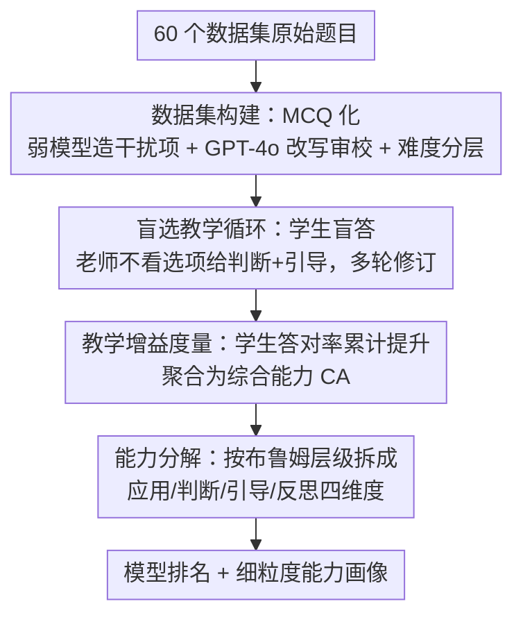

# Teach2Eval: An Interaction-Driven LLMs Evaluation Method via Teaching Effectiveness

**会议**: ICLR 2026  
**OpenReview**: [https://openreview.net/forum?id=HreYquZ5xs](https://openreview.net/forum?id=HreYquZ5xs)  
**代码**: https://github.com/zhiqix/Teach2Eval  
**领域**: LLM 评测  
**关键词**: 模型评测, 教学有效性, 交互式评测, 数据污染鲁棒性, 能力分解

## 一句话总结
Teach2Eval 把「评测一个 LLM」重新定义为「让它去教更弱的学生模型」——候选模型不直接答题，而是在不看选项和答案的前提下给学生反馈、纠错、多轮引导，用学生答对率的提升量作为分数；在 33 个模型、60 个数据集上与 Chatbot Arena / LiveBench 的 Spearman 相关性高达 0.94–0.975，且天然抗数据污染、能拆出四个正交的细粒度能力维度。

## 研究背景与动机
**领域现状**：当前 LLM 评测主要分两派。一派是静态、任务特定的基准（GSM8K、MATH、MMLU、BIG-bench 等），直接给模型在固定题目上的答题正确率打分；另一派是定制化的 agent 环境（代码沙盒、社会模拟）。两者本质都是「直接评分模型在某些任务/环境上的解题表现」。

**现有痛点**：因为分数与测试内容强耦合，这些方法对**数据污染**（题目泄漏进训练集导致背答案）、**饱和**（强模型都刷到天花板，区分不开）和**过拟合**特别脆弱。选择题这种「选项匹配」的评测通道尤其容易被记忆刷分。更关键的是，它们只能测「会不会做题」，测不出现代 LLM 作为 agent 的交互式推理能力。

**核心矛盾**：评测的可靠性依赖题目本身的「不可见性」，但题目总会被刷、被泄漏、被刷饱和——只要评测还盯着「模型自己答对了没有」，就永远在跟数据污染和饱和做军备竞赛，不断刷新数据集或工程化新环境。

**本文目标**：找到一种**不依赖具体题目（item-independent）**、又契合 LLM 交互/agentic 本质的评测范式，让评测信号不来自「模型自己答对没」。

**切入角度**：受费曼学习法（能教明白才是真懂）启发，作者换了个问题——不问「模型自己解题有多好」，而问「模型能多好地教别人解题」。教学这件事天然是交互的、需要诊断错误、给出可泛化的修正，而且老师如果只是背了答案，是教不出会推理的学生的。

**核心 idea**：用候选模型作为「老师」去引导一批弱「学生」模型，**学生在老师指导下的答对率提升量**就是老师的能力分数；老师全程看不到选项和标准答案，只能靠诊断学生自由形式推理里的错误来教，这就把「记忆答案」这条作弊通道彻底堵死。

## 方法详解

### 整体框架
Teach2Eval 是一个间接的、交互驱动的评测协议：输入是一个待评的候选 LLM（老师 $\mathcal{T}$）、一池固定的弱学生模型 $\{S_m\}$、以及一批标准化成选择题的数据；输出是老师的「综合能力」分数 CA 以及四个细粒度能力维度。整条管线分三步走：先把 60 个数据集的题目统一转成「带强干扰项的选择题」并按难度分层；然后进入「盲选教学」循环——学生先盲答，老师在**看不到选项**的情况下读学生的解题过程、给判断 + 引导，学生据此修订答案，多轮迭代；最后把学生跨轮次、跨多个学生的答对率累计提升量聚合成分数，并按布鲁姆认知层级拆成 Application / Judgment / Guidance / Reflection 四个能力。

### 关键设计

**1. 数据集构建：用弱模型的真实错误造选择题，既可自动评分又保住难度**

直接拿开放式问答让学生答，评分要么靠人工要么靠 judge，贵且不稳定；但简单地转成选择题又会因为干扰项太弱而降低难度、被秒选。本文的做法是：对每道题，从**弱模型的真实答案里收集干扰项**（这些是模型真会犯的错，天然有迷惑性），和标准答案拼成选择题，再用 GPT-4o 当 rewriter + reviewer 规范化格式和一致性，并把正确选项位置随机化以消除位置偏差。学生只在最终的选择题上被评分，从而能一致、可扩展地自动打分；而老师全程**看不到这些选项**，只看题目和学生的解题过程。这样既保住了「用真实模型错误」带来的难度，又避免了选项泄漏。最后用 Qwen 系列不同规模模型的实测正确率把所有题目分成五个难度带，支持跨难度分析。

**2. 盲选教学循环：老师不看答案做诊断—引导，学生多轮修订**

这是整套方法的核心机制，直接针对「直接评分易被记忆刷分」这个痛点。对每道题 $d_n$（标准答案 $y_n$），学生 $S_m$ 先只用题目和选项盲答得到 $a_{m,n,0}$；老师 $\mathcal{T}$ 随后只看题目和**不含选项**的完整对话历史 $H_{m,n,t-1}$，输出一个判断 $j_{m,n,t}$ 和一段引导 $g_{m,n,t}$：

$$j_{m,n,t},\, g_{m,n,t} = \mathcal{T}\big(d_n,\, H_{m,n,t-1}\big),\qquad H_{m,n,t-1} = \{a_{m,n,0}, j_{m,n,1}, g_{m,n,1}, \dots, a_{m,n,t-1}\}$$

学生据此更新答案 $a_{m,n,t} = S_m(d_n, a_{m,n,t-1}, g_{m,n,t})$。这种「盲选」设置保留了开放式推理、又杜绝了选项级别的泄漏——老师无法靠选项匹配作弊，只能真去诊断学生自由形式推理里的错误并给出可泛化的修正。再叠加多个失败模式各异的弱学生、被打乱的干扰项、被扰动的题面，整体构成一个「移动靶」，很难被某个老师过拟合。论文还专门做了消融（Ablation 5）验证：即使老师直接把答案说出来（answer revelation），与 Teach2Eval 的相关性（Spearman 0.921–0.947）仍显著高于与直接评测的相关性，说明该信号奖励的是「诊断—引导—反思」而非单纯报答案。

**3. 教学增益度量：把学生提升量聚合成综合能力 CA**

老师教得好不好，落到一个可度量的标量上。定义第 $t$ 轮学生 $S_m$ 的答对率提升为

$$\Delta P_t(S_m) = \frac{1}{|D|}\sum_{n=1}^{|D|}\Big(\mathbb{I}[a_{m,n,t}=y_n] - \mathbb{I}[a_{m,n,t-1}=y_n]\Big)$$

在 $T$ 轮预算下，对 $M$ 个学生取平均累计提升，得到综合能力（Comprehensive Ability）：

$$\mathrm{CA} = \frac{1}{M}\sum_{m=1}^{M}\sum_{t=1}^{T}\Delta P_t(S_m)$$

CA 衡量的是「老师把一池弱学生整体抬升了多少」，这个信号正交于题目本身——它不奖励老师自己会不会做题，而奖励老师能不能把别人教会，这正是它对污染鲁棒的根源（背答案的老师抬不动学生）。主实验中作者取三轮引导后的表现作为最终指标，因为消融显示多数模型在三轮后已基本收敛。

**4. 能力分解：按布鲁姆认知层级拆出四个正交维度**

只有一个 CA 分数信息量不够，作者基于布鲁姆认知分类法把老师能力分解成四个层层递进的维度，且实验证明它们能共同解释 CA。**应用能力 (AA)** 就是老师自己零样本直接答题的正确率 $\mathrm{AA}=\frac{1}{|D|}\sum_n \mathbb{I}[\mathcal{T}(d_n)=y_n]$，相当于传统直接评测。**判断能力 (JA)** 衡量老师在只看题目和解题过程（不看选项）时，能否正确判断学生首轮答案对错，即第一轮判断 $J_{m,n,1}$ 与真实对错 $\mathbb{I}[a_{m,n,0}=y_n]$ 是否一致。**引导能力 (GA)** 衡量首轮引导修复初始答错题目的有效率，仅在初始答错集合 $D_m^{inc}$ 上统计修对比例。**反思能力 (RA)** 衡量第二轮起的多轮持续修复，用一个乘性修复率刻画：设 $C_{m,t-1}$ 为第 $t$ 轮前已答对题数、$\mathrm{Fix}_{m,t}$ 为本轮新修对题数、$\mathrm{Reg}_{m,t}$ 为本轮从对退化成错的题数，则每轮反思乘子

$$r_{m,t} = \frac{C_{m,t-1} + \mathrm{Fix}_{m,t} - \mathrm{Reg}_{m,t}}{C_{m,t-1}} = 1 + \frac{\mathrm{Fix}_{m,t} - \mathrm{Reg}_{m,t}}{C_{m,t-1}}$$

（$C_{m,t-1}=0$ 时取 $r_{m,t}=1$ 防止除零），再跨后续轮次连乘聚合 $\mathrm{RA}_m=\prod_{t=2}^{T} r_{m,t}-1$。实验发现：AA（传统直接评测得到的能力）与 CA 相关性最低（0.849），而越高阶的能力（JA 0.873、RA 0.905、GA 0.936）与 CA 相关性越高——说明真正决定「教学有效性」的是高阶能力，传统直接评测恰恰抓不住这部分。

### 一个完整示例
以图 3 中「Suzanne 每三天走四英里，二月最少走多少」为例走一遍流程。学生第 0 轮盲答：「二月共 30 天 → 有十个 3 天周期 → 走 10×4=40 英里，选 A」（错）。老师判断「错误」，引导「二月天数算错了，请重新考虑」（不告诉答案）。学生第 1 轮：「二月至少 31 天 → 十个 3 天 → 仍 40，选 A」（还是错）。老师再引导「天数说太多了，二月是特殊月份」。学生第 2 轮：「二月至少 28 天 → 九个 3 天 → 走 9×4=36 英里，选 B」（对）。老师第 3 轮判断「无误，可以简化步骤」。这一过程里，学生从答错经两轮诊断—引导被修正到答对，老师全程不知道选项是「A.40 B.36 C.44 D.28」，只能靠诊断学生推理链里的具体错误（二月天数）来教——这正是 CA / GA / RA 想捕捉的能力。

## 实验关键数据

### 主实验
评测 33 个领先 LLM、60 个数据集（涵盖知识、推理、理解、多语言四类域），学生池为 4 个弱模型（LLaMA3.2-1B、Qwen2.5-1.5B、MiniCPM-2B、InternLM2.5-1.8B），vLLM 推理，temperature=0、max_tokens=8k、4×H100。

| 评测方法 | vs Chatbot Arena (Spearman) | vs Chatbot Arena (Kendall) | vs LiveBench (Spearman) | vs LiveBench (Kendall) |
|---------|------|------|------|------|
| 直接评测 | 0.734 | 0.558 | 0.861 | 0.695 |
| **Teach2Eval** | **0.944** | **0.853** | **0.975** | **0.886** |

Teach2Eval 与两大人类偏好榜单的相关性全面碾压直接评测，且成本更低。综合能力排行上，Claude-Sonnet-4-thinking、o4-mini、Gemini-2.5-pro 居前三；值得注意的是仅 14B 的 DeepSeek-R1-Distill-Qwen-14B 表现接近 70B 级别，而在直接评测里 Application Ability 虚高的 Qwen2.5-32B-Instruct 被本方法揭示出其真实能力并没那么强。图 5 还显示 Teach2Eval 在高能力区不饱和、散点更紧密单调，而直接评测在高端出现明显的分数压缩。

### 消融实验

| 配置 | 关键指标 | 说明 |
|------|---------|------|
| 完整方法 | Arena 0.944 / LiveBench 0.975 | 4 学生、3 轮引导 |
| 随机去掉 1 个学生（4 组 3 学生）| Arena 0.926–0.936；LiveBench >0.94 | 学生选择无显著偏置，结论稳健 |
| 累计采样收敛性 | Arena Spearman >0.92 / Tau >0.8 | 比直接评测收敛更快更稳 |
| 引导轮数 6 轮 | 三轮后基本收敛 | 故主实验取 3 轮为最终指标 |
| 老师泄漏答案 (Answer Revealed) | vs Teach2Eval 0.921 > vs Direct 0.815 | 即使报答案，仍奖励诊断—引导—反思 |

### 关键发现
- **高阶能力才是关键**：四个维度与综合能力 CA 的相关性递增（AA 0.849 < JA 0.873 < RA 0.905 < GA 0.936），传统直接评测只对应最低阶的 AA，抓不住决定教学有效性的高阶能力。
- **抗污染**（Insight 1）：在蒸馏污染子集上微调的 6 个模型，多数 Application Ability 升高但 Comprehensive Ability 反而下降；说明 CA 不像直接评分那样被污染监督「注水」，可用来早期发现过拟合。
- **判断能力是基础线**：所有模型 JA 都超过 50%，但在引导（GA）和反思（RA）上差异巨大；Yi-1.5-6B、InternLM2.5-7B 反思最差，多轮引导反而不稳定。
- **缩放律在高阶能力上仍成立但更微妙**（Insight 2）：同族内模型越大 CA 越高，但 DeepSeek-Distill 系列因基座不同会出现高阶能力波动；Application Ability 看似遵循缩放律，真实能力却可能不同。

## 亮点与洞察
- **把「评测」重构成「教学」是真正的范式转换**：用学生提升量当信号，从根上绕开了「盯着模型自己答对没」带来的污染/饱和困境，而不是再刷新一版数据集——这是「换问题」而非「换题目」。
- **盲选 + 弱模型造干扰项 + 异构学生**三件套共同构成「移动靶」，让评测难以被过拟合，这个组合很巧：弱模型的错误既是难度来源，又是规模化的标注来源，免去人工。
- **用弱模型评强模型**：本方法把「教学有效性」翻译成「学生提升量」这个可测信号，实现了长期被认为困难的「以弱评强」，思路可迁移到其他难以直接打分的能力（如 agent 协作、长程规划）的评测。
- **细粒度能力分解给训练提供可执行信号**：AA/JA/GA/RA 四维能在训练轨迹上提前预警过拟合（AA 升而 CA 降），把静态评测变成动态的能力诊断。

## 局限与展望
- 学生池固定为四个小模型，能力天花板有限——当被评老师远强于学生、或题目对学生过难/过易时，提升量信号可能压缩，方法对「学生池如何选」的依赖仍需更系统的研究。
- 整套依赖把任务统一成选择题（MCQ），对本身难以 MCQ 化的开放生成、长文写作、多模态任务覆盖有限；干扰项质量也依赖 GPT-4o 改写，引入了对单一闭源模型的依赖。
- 多轮交互 + 多学生 + 多数据集虽号称低成本，但相比单次直接评测，单个老师要跑大量教学交互，绝对推理量并不小；论文的「低成本」主要是相对于人工榜单而言。
- 缓存中 Ablation 4 与 Ablation 3 文字几乎重复（疑似排版重复），具体收敛轮数结论以原文为准 ⚠️。

## 相关工作与启发
- **vs 静态基准（GSM8K/MMLU/BIG-bench）**：它们直接给模型解题打分，与题目强耦合、易被污染和刷饱和；Teach2Eval 把信号从「模型答对没」换成「学生被教好没」，正交于题目本身。
- **vs LLM-as-a-Judge / Chatbot Arena**：judge 范式仍是给答案打分、且依赖一个裁判模型的偏好；众包榜单虽抗刷分但贵且慢。本文不评分答案、也不用裁判，而是用学生增益作为间接信号，且与这两大榜单高度一致（0.94–0.975）。
- **vs 教学/蒸馏范式（多教师蒸馏、Dean–Teacher–Student、角色扮演课堂）**：这些是用教学来「提升模型」；本文反过来把教学过程**转化成评测信号**，且不限制老师的教学策略，让老师自由选择最有效的教学方式，统一了能力导向与交互式评测。

## 评分
- 新颖性: ⭐⭐⭐⭐⭐ 把评测重构为教学、用学生增益作信号，是真正的范式级创新
- 实验充分度: ⭐⭐⭐⭐⭐ 33 模型×60 数据集，5 组消融 + 4 个 Insight，与两大榜单交叉验证
- 写作质量: ⭐⭐⭐⭐ 思路清晰、公式完整，但消融存在重复段落、部分图依赖附录
- 价值: ⭐⭐⭐⭐⭐ 抗污染 + 细粒度能力诊断 + 可指导训练，对评测社区实用价值高

<!-- RELATED:START -->

## 相关论文

- [\[ACL 2026\] Rethinking Meeting Effectiveness: A Benchmark and Framework for Temporal Fine-grained Automatic Meeting Effectiveness Evaluation](../../ACL2026/llm_evaluation/rethinking_meeting_effectiveness_a_benchmark_and_framework_for_temporal_fine-gra.md)
- [\[ACL 2026\] Teaching Language Models to Forecast Research Success Through Comparative Idea Evaluation](../../ACL2026/llm_evaluation/teaching_language_models_to_forecast_research_success_through_comparative_idea_e.md)
- [\[ICLR 2026\] Rethinking LLM Evaluation: Can We Evaluate LLMs with 200× Less Data?](rethinking_llm_evaluation_can_we_evaluate_llms_with_200_less_data.md)
- [\[ICLR 2026\] Noisy but Valid: Robust Statistical Evaluation of LLMs with Imperfect Judges](noisy_but_valid_robust_statistical_evaluation_of_llms_with_imperfect_judges.md)
- [\[ICLR 2026\] Harnessing Temporal Databases for Systematic Evaluation of Factual Time-Sensitive Question-Answering in LLMs](harnessing_temporal_databases_for_systematic_evaluation_of_factual_time-sensitiv.md)

<!-- RELATED:END -->
