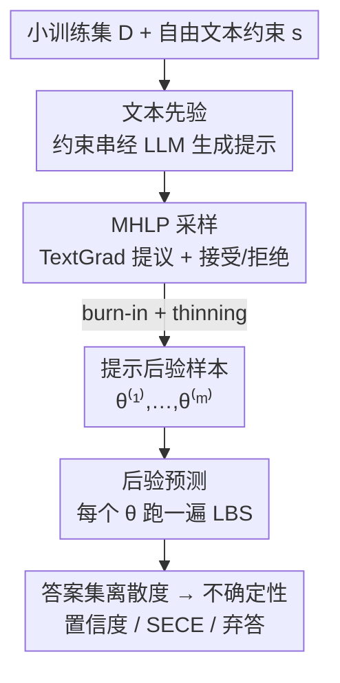

# Textual Bayes: Quantifying Prompt Uncertainty in LLM-based Systems

**会议**: ICLR 2026  
**OpenReview**: [https://openreview.net/forum?id=VPmsAr1OTl](https://openreview.net/forum?id=VPmsAr1OTl)  
**领域**: LLM评估 / 不确定性量化  
**关键词**: 贝叶斯推断, 提示不确定性, MCMC, 校准, 黑盒LLM

## 一句话总结
本文把 LLM 系统里的提示（prompt）看作统计模型中的"文本参数 $\theta$"，用一个小训练集对其做贝叶斯推断，并提出一种文本版 MCMC 算法 MHLP（Metropolis-Hastings through LLM Proposals）从提示的后验里采样，从而对黑盒 LLM 的预测和不确定性给出有原则的量化，在准确率与校准（ECE/SECE）上同时优于若干 frequentist 基线。

## 研究背景与动机
**领域现状**：LLM 越来越多被部署到金融、医疗等高风险场景，但人们对它的信任度有限——它会幻觉、会被越狱攻击。要真正用起来，关键一步是可靠地量化 LLM 系统的不确定性：当模型"不知道"时应当弃答、转交人类或调用检索/推理子程序。然而当前的 UQ（uncertainty quantification）研究既没有共识、又远未解决，而且很多 SOTA 模型是闭源黑盒，只能通过 API 访问，连权重梯度都拿不到。

**现有痛点**：LLM 系统对把各环节"粘合"在一起的提示极其敏感，而提示往往靠人工反复调（prompt engineering）。主流的链式思维（CoT）等做法是 frequentist 的：用**单一固定提示**生成答案，完全不考虑"该如何提示模型"这件事本身存在不确定性。结果就是模型对错误答案也会过度自信——它把"这个提示恰好这么写"当成了确定的事实。

**核心矛盾**：贝叶斯推断本是 UQ 的原则性工具，VAE、贝叶斯神经网络都靠它成功，但这些方法都对连续高维变量（如网络权重）做推断，依赖 $p(\theta)p(D\mid\theta)$ 对 $\theta$ 可微。而 LLM 系统里真正值得推断的变量是**提示**——它是离散文本，传统的基于梯度的 MCMC、变分推断、Laplace 近似全都用不上。

**本文目标**：在不打开黑盒、只改提示的前提下，对提示这一离散文本变量做贝叶斯推断，进而得到对模型本身和下游预测的有原则的不确定性估计，并能把自由文本形式的先验信念注入进去。

**切入角度**：作者观察到，文本变量虽然离散难采样，但在概念上其实**比神经网络权重更适合贝叶斯建模**——人类天生擅长用语言表达对一个提示"应该长什么样"的先验信念（如"应描述任务目的、给出解题指南、规定输出结构"），这种先验可以直接写成自由文本。难点只剩下：怎么从离散文本的后验里采样。

**核心 idea**：把提示视为文本参数 $\theta$、把整个 LLM 系统视为统计模型 $p(y\mid x,\theta)$，然后用"提示优化即 MCMC 提议分布"这一桥接，把成熟的提示优化方法（TextGrad）改造成 Metropolis-Hastings 的提议步，做到从提示后验 $p(\theta\mid D)$ 采样。

## 方法详解

### 整体框架
方法叫 **Textual Bayes**。出发点是把 LLM 系统统一写成 $y=\mathrm{LBS}(x;\theta)$：输入 $x$、由若干提示构成的文本参数 $\theta=(\theta_1,\dots,\theta_k)$、输出 $y$，由于每次 LLM 调用都带随机性，这天然构成一个统计模型 $p(y\mid x,\theta)$。贝叶斯的目标是：不再去找单一最优提示 $\theta^*$（极大似然，Eq. 3），而是在给定先验 $p(\theta)$ 和一个小训练集 $D$ 后，刻画提示的**后验** $p(\theta\mid D)\propto p(\theta)\prod_i p(y_i\mid x_i,\theta)$（Eq. 5），再用后验预测分布（Eq. 6）把不确定性传到下游输出上。

整条流水线分三步串起来：① 用自由文本约束构造提示先验 $p(\theta)$；② 用 MHLP 这个文本版 MCMC 从后验里采样出一组提示样本 $\{\theta^{(r)}\}_{r=1}^m$；③ 推理时对每个采样到的提示各跑一遍系统得到一组答案 $\{y^{(r)}_{\mathrm{new}}\}$，用这组答案的**离散程度**当作系统的不确定性。

### 关键设计

**1. 文本先验：把人类对提示的直觉写成自由文本约束**

贝叶斯推断必须指定先验 $p(\theta)$，但提示位于无限且语义复杂的离散文本空间，没法像高斯先验那样直接写密度。本文的做法是利用人类对"好提示长什么样"的直觉：把对每个参数 $\theta_j$ 的信念编码成一段人写的文本约束串 $s_j$（例如"应描述该 LLM 调用的目的、解题指南、预期输出结构"），再交给一个 LLM 去生成满足约束的提示，即 $\theta_j=\mathrm{LLM}(s_j;\text{"Generate an LLM prompt satisfying the given constraints."})$（Eq. 7）。为简化，先验取各参数独立 $p(\theta)=\prod_{j=1}^k p(\theta_j)$，但也可对多个 $\theta_j$ 写联合约束、用一次 LLM 调用建模。这一设计正是贝叶斯落到文本上的"优势面"：相比给神经网络权重指定先验几乎不可能，这里人类反而能轻松、自然地表达先验。

**2. MHLP：把提示优化当成 Metropolis-Hastings 的提议分布**

这是全文的核心。要从 $p(\theta\mid D)$ 采样就得用 MCMC，但 MH（Alg. 1）成败全看提议分布 $q(\theta'\mid\theta)$。如果像随机替换字母/单词那样扰动 $\theta$，几乎从不改变语义、永远收敛不了。作者的观察是：好提议应满足 $p(\theta\mid D)\propto p(D\mid\theta)p(\theta)$ 的两条性质——(i) 新提示 $\theta'$ 要符合先验约束，(ii) 在 $D$ 上下游表现要好。这恰恰就是**迭代式提示优化**在干的事。于是把提示优化形式化为一个马尔可夫更新 $\theta^{(t)}=\mathrm{UPDATE}(\theta^{(t-1)})$（Eq. 4），并直接令提议 $\theta'=\mathrm{UPDATE}(\theta)$。类比来看：Langevin MC 用梯度去利用 $p(\theta\mid D)$ 的可微结构，而 MHLP 用 LLM 调用去利用它的**语言结构**。具体 UPDATE 用 TextGrad 实现——TextGrad 把"建设性反馈"当作文本梯度做反向传播，本文把上面两条准则写成自然语言目标交给它优化。

关键在于 MHLP 保留了 MH 的**接受/拒绝**步：算出接受概率
$$\gamma=\min\!\left(1,\ \frac{g(\theta')\,q(\theta^{(t-1)}\mid\theta')}{g(\theta^{(t-1)})\,q(\theta'\mid\theta^{(t-1)})}\right),$$
其中 $g(\theta)=p(\theta)p(D\mid\theta)$ 是后验的未归一化分子，以概率 $\gamma$ 接受、否则保留旧值。这一步是它和"裸 TextGrad"的本质区别：TextGrad 没有接受/拒绝、相当于"永远接受"，会把对初始提示不见得有用的修改也吸收进去；MHLP 则把定量的下游表现纳入接受决策，等价于一种**带筛选的随机提示优化**，更倾向落在高后验值的提示上。由于 UPDATE 本身也是 LLM 系统，$q(\theta'\mid\theta)$ 的值可用开源模型在 UPDATE 最后一次 LLM 调用上估计（细节见附录近似）。实现上还用了贝叶斯深度学习常见的近似：温和化后验（tempered posterior）和小批量随机估计，以及 burn-in（丢弃前 $d$ 个样本）与 thinning（每隔 $h$ 个取一个）来增加样本多样性。

**3. 语义 ECE（SECE）：给自由文本输出量出校准误差**

有了后验提示样本，怎么衡量"校准好不好"？标准 ECE 需要一个置信度分数，但自由文本任务里正确答案有无数种表述，置信度算不出来。受语义熵启发，本文提出 **semantic ECE**：对输入 $x_i$ 采样 $m$ 个输出 $y^{(1)}_i,\dots,y^{(m)}_i$，再让一个 LLM 把它们按语义聚成若干簇，每个簇的经验概率 = 落入该簇的样本比例，取**最大簇概率**作为该输入的"语义置信度"，最后把这个值喂进标准 ECE 计算。这样就把只适用于封闭答案的 ECE 推广到了自由文本输出，使本文方法能在 SimpleQA、QASPER 这类生成式任务上被定量评估校准。

### 一个例子：把不确定性传到下游答案
以"成熟的香蕉是什么颜色"这道选择题为例。CoT 用单一固定提示"Answer the question. Think step-by-step." 反复采样，10 次可能都答 Yellow，给出 100% 置信——即便换个问题答错也照样自信。Textual Bayes 则先从提示后验里采出多份语义不同但都合理的提示（如"逐项分析每个选项再作答""作为知识渊博的专家审慎作答"），每份提示各生成答案；若 10 份提示里 67% 指向同一答案，系统就把这 67% 当作置信度。提示层面的不确定性由此被显式传导成答案层面的不确定性——这正是图 1 想表达的 frequentist（左）与贝叶斯（右）之别。

## 实验关键数据

### 主实验
评估在三类问答任务上展开：AIME 2024（封闭答案，30 题）、SimpleQA（自由文本，固定 100 题）、QASPER（带上下文的自由文本，固定 100 题）。模型用黑盒 GPT-4o / GPT-4o-mini，所有结果 10 次独立运行取均值±标准误。对比四个 frequentist 基线：Paraphrasing、System-Message（两种提示扰动法）、CoT、TextGrad。所有方法在推理时用相同的 $m$ 次系统调用，保证算力可比。

准确率（%，Tab. 1）：

| 方法 | AIME | SimpleQA | QASPER |
|------|------|----------|--------|
| Paraphrasing | 12.6 | 43.7 | 43.7 |
| System-Message | 7.2 | 47.3 | 59.7 |
| CoT | 9.0 | 47.8 | 56.5 |
| TextGrad | 11.9 | 46.6 | 58.8 |
| **MHLP (本文)** | **15.0** | **48.6** | **60.9** |

校准 ECE / SECE（%，越低越好，Tab. 2）：

| 方法 | AIME | SimpleQA | QASPER |
|------|------|----------|--------|
| Paraphrasing | 21.1 | 18.7 | 28.5 |
| System-Message | 19.7 | 18.4 | 23.9 |
| CoT | 31.5 | 18.0 | 26.2 |
| TextGrad | 27.4 | 17.7 | 21.6 |
| **MHLP (本文)** | 22.0 | **15.4** | **17.7** |

弃答能力（QASPER 上对"无上下文/随机上下文"的不可答问题做 ROC AUC，%，越高越好，Tab. 3）：MHLP 在 no-context 上达 77.9（最高），random-context 上 71.7（最高），均超过所有基线。

### 消融 / 对照分析

| 配置 | 关键差异 | 说明 |
|------|---------|------|
| MHLP（完整） | 有接受/拒绝 | 把下游表现纳入采样决策，落在高后验提示上 |
| TextGrad（去掉接受/拒绝） | "永远接受" | 吸收了对初始提示不见得有用的修改，准确率与校准均更差 |

第二个实验把 MHLP 用到与传统贝叶斯不同的场景——**共形事实性**（conformal factuality）。此时没有真值标签，未归一化后验拿不到，于是用一个代理目标 $g(\theta)=\mathbb{E}_{p(y'\mid x,\theta)}[\frac{1}{|y'|}\sum_{c\in y'}F(c;\theta)]$（Eq. 10）替代，靠 MHLP 采样不同提示生成多样的备选答案、再用频率打分。在 FactScore 传记子集上，MHLP 频率打分与 GPT-4 频率打分都满足共形覆盖界（Fig. 2a），但 MHLP 在相同经验事实性下**移除更少的声明**（Fig. 2b），说明其置信度校准更好、保留的有用信息更多。

### 关键发现
- **接受/拒绝步是 MHLP 跑赢 TextGrad 的根本原因**：它等价于带定量筛选的随机提示优化，把"表现好不好"写进采样过程，因此样本集中在高后验提示上。
- MHLP 是唯一在准确率上**全数据集稳定领先**的方法；唯一吃亏的是 AIME 上的 ECE（22.0，略逊于校准最好的 System-Message 19.7），但其准确率（15.0）远超那两个校准最好的方法，说明它没有靠"装不自信"换校准。
- 方法对黑盒 LLM 是**即插即用**的：只改提示采样这一步，不需要打开模型，也能和语义熵等"答案集→分数"的步骤正交组合。

## 亮点与洞察
- **把提示当贝叶斯参数**这个视角本身就很"啊哈"：它把"prompt engineering 缺乏严谨性"这个工程痛点，翻译成了"在文本参数上做后验推断"这个有数学保证的统计问题。
- **MHLP = 提示优化 ∪ MCMC** 的桥接非常巧妙：把 TextGrad 当 MH 的提议分布，既复用了成熟的提示优化器，又用接受/拒绝步给它套上了正确的采样语义；而且 MHLP 不限于贝叶斯——换个代理目标 $g(\theta)$ 就能采任意文本分布（共形事实性即一例）。
- **SECE** 是个可复用的小工具：任何需要对自由文本输出算校准的工作，都能借"语义聚类→最大簇概率当置信度"这一招。
- 文本变量"比连续权重更适合贝叶斯"的论断有反直觉的说服力——先验可由人直接用自然语言写，这是连续高维参数永远做不到的。

## 局限与展望
- **依赖开源代理似然**：要对闭源黑盒评估 $p(y\mid x,\theta)$ 和 $q(\theta'\mid\theta)$，需用开源模型做替身近似（附录 A.1），这会引入误差，且把方法和"恰好有合适开源模型"绑定。
- **MCMC 成本**：每条链要采样、要 burn-in/thinning，加上提议步本身是若干次 LLM 调用，前期固定开销不低；虽然推理时调用数与基线对齐，但建链阶段的算力没算进这个对比。
- **评估规模偏小**：AIME 仅 30 题、SimpleQA/QASPER 各固定 100 题，数据集与任务多样性有限，结论的普适性还需更大规模验证。
- **温和化后验等近似**未充分剖析其对最终不确定性估计的偏差影响，tempered posterior 的温度等超参敏感性留待进一步研究。

## 相关工作与启发
- **vs TextGrad**：两者都用文本梯度迭代优化提示，但 TextGrad 只产单一最优提示、无采样语义；本文把它当提议分布、补上接受/拒绝，从"点估计"升级成"从后验采样"，因此能量化不确定性而不只是提升点性能。
- **vs Paraphrasing / System-Message（Gao et al. 2024）**：这两种通过改写问题/系统提示注入随机性，是启发式扰动；本文的提示多样性来自有原则的贝叶斯后验，校准与弃答能力更强。
- **vs 语义熵等"答案集→分数"方法**：它们解决的是 UQ 流水线的第二步（把答案集汇总成分数），本文解决第一步（生成多样答案集），两者正交、可组合。
- **vs 共形事实性（Mohri & Hashimoto 2024）**：原方法用固定提示做频率打分；本文用 MHLP 采样不同提示生成备选，在相同覆盖保证下移除更少声明，展示了 MHLP 在贝叶斯之外的通用性。

## 评分
- 新颖性: ⭐⭐⭐⭐⭐ 首次在自由文本提示空间上做贝叶斯推断，"提示优化即 MCMC 提议"的桥接很有原创性。
- 实验充分度: ⭐⭐⭐⭐ 覆盖准确率/校准/弃答三类指标且有共形事实性外延，但数据集规模偏小、建链算力未纳入对比。
- 写作质量: ⭐⭐⭐⭐⭐ 从统计建模到算法层层推导，图 1 直观、动机清晰。
- 价值: ⭐⭐⭐⭐⭐ 为黑盒 LLM 提供即插即用、有数学保证的 UQ，并把丰富的贝叶斯文献接入 LLM 时代。

<!-- RELATED:START -->

## 相关论文

- [\[ICLR 2026\] EIP: Weighted Ranking of LLMs by Quantifying Question Difficulty](eip_weighted_ranking_of_llms_by_quantifying_question_difficulty.md)
- [\[ICML 2025\] Are LLM Belief Updates Consistent with Bayes' Theorem?](../../ICML2025/llm_evaluation/are_llm_belief_updates_consistent_with_bayes_theorem.md)
- [\[ICLR 2026\] Prompt and Parameter Co-Optimization for Large Language Models](prompt_and_parameter_co-optimization_for_large_language_models.md)
- [\[ICLR 2026\] vCache: Verified Semantic Prompt Caching](vcache_verified_semantic_prompt_caching.md)
- [\[ICLR 2026\] Complementing Self-Consistency with Cross-Model Disagreement for Uncertainty Quantification](complementing_self-consistency_with_cross-model_disagreement_for_uncertainty_qua.md)

<!-- RELATED:END -->
