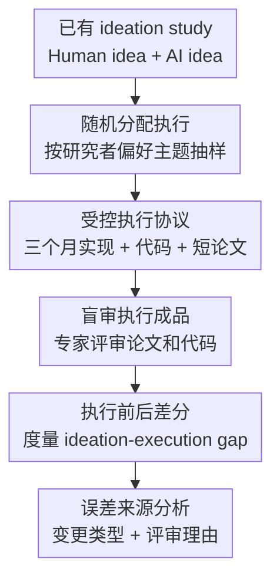

# The Ideation-Execution Gap: Execution Outcomes of LLM-Generated versus Human Research Ideas

**会议**: ICLR 2026  
**OpenReview**: [https://openreview.net/forum?id=Fllp8l6Puy](https://openreview.net/forum?id=Fllp8l6Puy)  
**代码**: https://github.com/NoviScl/AI-Researcher  
**领域**: LLM评估  
**关键词**: 研究想法评估, AI Scientist, 执行结果, 随机对照实验, 专家评审  

## 一句话总结
这篇论文用一次专家执行 + 盲审评审的随机对照实验检验 LLM 生成研究想法是否真的能转化为更好的研究成果，发现 LLM 想法在“只看 idea”时分数更高，但执行后在新颖性、兴奋度、有效性和整体质量上掉分显著更大。

## 研究背景与动机
**领域现状**：LLM 正在被放进科研流水线里，从文献综述、假设生成、实验计划到代码实现，都有人尝试构建所谓 AI Scientist。许多系统会先让模型生成研究 idea，再用 LLM judge 或少量人工评估筛掉看起来不够新、不够可行的方案。

**现有痛点**：问题在于，“看起来像好 idea”和“做出来以后真有结果”不是一回事。只看 proposal 时，评审容易根据新颖表述、宏大动机和假设中的成功实验来打分；但真正执行时，数据集是否存在、baseline 是否足够强、指标是否合适、成本是否可承受，都会把一个漂亮 idea 拉回现实。

**核心矛盾**：LLM 可能擅长生成让人第一眼觉得新奇的研究构想，却未必擅长把 idea 约束在可执行、可验证、可产出稳定 empirical signal 的范围内。也就是说，LLM 的 ideation 能力可能被“无执行评估”高估，而研究质量真正关心的是 execution outcome。

**本文目标**：作者想回答一个更硬的问题：如果把 LLM 生成的 research ideas 和人类专家写的 ideas 都交给合格研究者认真执行，最后由盲审专家评价成品论文和代码，那么两类 idea 的表现是否仍然有差异？更具体地，论文比较了执行前 idea 评分、执行后项目评分，以及二者之间的下降幅度。

**切入角度**：本文复用 Si et al. (2025) 中已经收集并评审过的一批 NLP 研究 idea，把它们作为 execution study 的起点。这样做的好处是，作者可以把“执行前的想法分数”和“执行后的项目分数”一一对应起来，直接量化 ideation-execution gap，而不是只做一次横截面比较。

**核心 idea**：用随机分配、专家执行、双盲评审和执行前后分数差分，把 LLM idea 的真实价值从“proposal 阶段的吸引力”里剥离出来。

## 方法详解

### 整体框架
本文不是提出一个新模型，而是设计一套用于评估研究 idea 的实验流程。整体上，作者先从已有 ideation study 中取出人类专家 idea 和 Claude-3.5-Sonnet 生成的 AI idea，再随机分配给 43 名具备 NLP 研究背景的执行者；每名执行者在三个月内完成实验、代码和 4 页短论文，最后由 58 名专家盲审员在不知道 idea 来源的情况下评审执行成品。

这个流程的关键是把 idea source 变成可随机化的处理变量，把执行质量和评审标准尽量控制住。这样，如果 LLM idea 和 human idea 在执行前后分数变化上呈现系统性差异，论文就可以更有力地说明这种差异来自 idea 本身，而不是来自某个执行者更强、某个评审更偏好某类题目。

### 关键设计
**1. 随机对照执行：让 idea 来源成为可比较变量**

研究 idea 的执行结果很容易被执行者能力、题目熟悉度、个人兴趣和资源投入混在一起。本文的处理方式是先询问执行者偏好的 7 个 NLP 主题，再在其偏好主题内随机分配来自 Human condition 或 AI condition 的匿名 idea。这样既避免把研究者分到完全陌生领域，也减少了“研究者挑自己觉得最强的 idea 来做”的自选择偏差。

这个设计让比较对象从“谁写得更像好 proposal”变成“同样由专家执行、同样由专家盲审时，idea 来源是否影响最终结果”。论文最终有 19 个 human ideas 和 24 个 AI ideas 被执行，主题覆盖 bias、coding、safety、multilingual、factuality、math、uncertainty 等 NLP 子方向。

**2. 最小化 idea 改动：评估原始构想而不是执行者再发明的方案**

如果执行者在做项目时大幅改方法，那么最终结果就不再能代表原 idea 的质量。作者因此要求执行者保留原始方法，不允许做实质性算法改动，只允许调整实验细节，例如数据集、模型、baseline、prompt、超参数、指标和分析实验。所有改动都需要记录，并由作者人工审核。

这个约束很重要，因为它把研究对象固定在“idea 本身能否经受执行”上，而不是“执行者能不能把坏 idea 救回来”。论文中只有一个项目因为原 idea 太模糊、必须由执行者补出核心方法而被终止并排除，其余项目都被认为基本忠实于原始 idea。

**3. 执行前后差分：用 gap 控制 idea 异质性**

直接比较执行后的平均分并不稳定，因为 43 个项目样本不大，不同 idea 的天然质量差异也很大。本文真正有力的指标是 execution score 与 ideation score 的差，即 $\text{gap}=\text{score}_{\text{execution}}-\text{score}_{\text{ideation}}$。负值表示执行后分数下降，下降越大说明 proposal 阶段的吸引力越没能转化成执行结果。

这个差分思想相当于把每个 idea 与它自己执行前的评分作比较。论文发现 Human ideas 在 novelty、excitement、effectiveness 上几乎不掉分，而 AI ideas 分别下降约 $1.049$、$1.760$、$1.879$ 分；overall 也下降 $1.976$ 分。更关键的是，AI ideas 的 gap 显著大于 Human ideas，四个共享指标的 FDR 校正后 $p<0.05$。

**4. 评审理由归因：解释为什么 execution 会揭穿某些好看的 idea**

论文不仅报告分数，还人工分析了 ideation review 和 execution review 的自由文本理由。作者把评审意见归到十类因素，包括 novelty/motivation、impact、method flaw、experiment design、baseline comparison、ablation/analysis、feasibility/resource、empirical performance、generalizability/scope 和 missing details/writing。

这个分析揭示了 gap 的来源：ideation 阶段评审常常是在“如果实验成功”的假设下打分，而 execution 阶段评审会强制看到真实实验结果、baseline 是否充分、指标是否合适、消融是否解释了机制、资源成本是否合理。换句话说，执行评估把很多 proposal 阶段被忽略的问题显性化了，尤其是 AI idea 中常见的高成本人工评估、缺 baseline、实验设计不严谨和效果不稳定。

### 一个完整示例
可以把论文中的一个 AI idea 想象成“跨文化角色扮演 prompt”，proposal 里计划招募不同语言和文化背景的 native speakers 来人工评价模型输出。只看 idea 时，这个真实人类评估会让评审觉得项目很有贡献，因为它看起来能补上自动评估不可靠的问题。

但进入执行阶段后，招募 native speakers 和文化专家的成本太高，执行者把这部分改成 LLM-as-a-judge 自动评估。成品被盲审时，评审就会指出：如果没有人工评价，很难判断输出是否真的更符合文化语境，也可能只是 LLM judge 被某些表面模式误导。这个例子很好地说明，AI idea 在 ideation 阶段的亮点可能依赖昂贵或不现实的实验承诺，而执行后这些承诺一旦收缩，idea 的有效性和兴奋度就会掉下来。

### 损失函数 / 训练策略
本文没有训练模型，也没有神经网络损失函数。它的“训练策略”对应的是统计评估策略：对执行后评审分数，作者分别采用两种聚合方式，一种把每条 review 当作独立样本，另一种先对每个 idea 的多个 review 取平均再把 idea 当作独立样本。前者样本量为 $N=181$ 条 review，后者样本量为 $N=43$ 个 idea。

对于核心 gap 分析，作者关注四个执行前后共有指标：novelty、excitement、effectiveness 和 overall。显著性检验使用 t-test，并对多重假设做 FDR 校正。控制指标包括 faithfulness 和 codebase quality，用来检查两组项目是否在“是否忠实执行原 idea”和“代码质量”上存在系统差异；结果显示这两个控制指标几乎相同，支持 gap 不是由某一组执行得更差导致的。

## 实验关键数据

### 主实验
主结果分两层看。第一层是执行后成品的评分：如果把每条 review 当独立样本，人类 idea 在 excitement、effectiveness、soundness 和 overall 上显著高于 AI idea；但如果以每个 idea 的平均分为单位，差异不再显著，说明直接比较执行后均分的统计功效有限。

| 评估方式 | Human ideas | AI ideas | 结论 |
|--------|-------------|----------|------|
| 执行前 novelty | 4.912 | 5.778 | AI 显著更高，$p=0.035$ |
| 执行前 excitement | 4.404 | 5.653 | AI 显著更高，$p=0.004$ |
| 执行前 effectiveness | 4.833 | 6.003 | AI 显著更高，$p=0.001$ |
| 执行前 overall | 4.596 | 5.382 | AI 显著更高，$p=0.035$ |
| 执行后 novelty | 4.903 | 4.729 | Human 略高，但不显著 |
| 执行后 excitement | 4.482 | 3.896 | Human 高，idea 级别不显著 |
| 执行后 effectiveness | 4.782 | 4.125 | Human 高，idea 级别不显著 |
| 执行后 overall | 3.968 | 3.406 | Human 高，idea 级别不显著 |

第二层是本文最核心的执行前后 gap。这个指标控制了不同 idea 本身的起点差异，因此统计信号更清楚。

| 指标 | Human gap | AI gap | $\Delta$(Human - AI) | FDR 校正后 p-value |
|------|-----------|--------|----------------------|--------------------|
| Novelty | -0.010 | -1.049 | 1.039 | 0.025 |
| Excitement | +0.078 | -1.760 | 1.835 | 0.001 |
| Effectiveness | -0.052 | -1.879 | 1.827 | 0.003 |
| Overall | -0.628 | -1.976 | 1.348 | 0.004 |

### 消融实验
论文没有传统意义上的模型模块消融，但做了两个关键稳健性和归因分析：一是检查执行过程中对 idea 的改动类型，二是排除 6 个“AI idea 原本计划人工评价、执行时改成自动评价”的案例后重算 gap。

| 分析配置 | 关键指标 | 说明 |
|------|---------|------|
| 所有 43 个执行项目 | AI gap 在四个指标上显著更大 | 主结论：AI idea 执行后掉分更明显 |
| 排除 6 个移除人工评价的 AI idea | Novelty gap: -1.107；Excitement gap: -1.843；Effectiveness gap: -1.921；Overall gap: -2.009 | 结论不变，说明 gap 不只是因为人工评价太贵被替换 |
| 改动数量统计 | Human 平均 2.9 次改动，AI 平均 3.1 次改动 | 两组都主要改实验细节，不是重写核心方法 |
| 控制指标 | Faithfulness: Human 6.48 / AI 6.42；Codebase quality: 二者均 3.58 | 执行忠实度和代码质量相近，不支持“AI 组执行更差”解释 |

### 关键发现
- LLM ideas 在执行前确实更容易被评为新颖、令人兴奋、预期有效，但这种优势在执行后消失，甚至均值排序反转。
- 直接比较执行后分数时，idea 级别样本只有 43 个，统计功效有限；比较执行前后 gap 才是本文最可靠的分析。
- AI ideas 的问题不主要来自执行者乱改方案，因为两组改动数量接近，控制指标中的 faithfulness 和 codebase quality 也接近。
- 执行评审会强制关注 empirical performance、baseline、ablation、resource 和 generalizability，这些因素在只看 idea 的阶段经常被忽略。
- 评审一致性并不低，effectiveness 一致性达到 84.3，高于论文中引用的 NeurIPS 2021 和 ICLR 2024 参考水平，说明执行结果相关指标相对可评。

## 亮点与洞察
- 本文最强的地方是把 AI idea evaluation 从“读 proposal 打分”推进到“执行后看结果”。这比再设计一个 LLM-as-a-judge benchmark 更有说服力，因为它直接测试研究 idea 的最终用途。
- 随机对照设计很干净：执行者不知道 idea 来源，评审者也不知道来源，且 idea 被随机分配到执行者偏好主题内。这让论文的因果解释比普通 benchmark 论文更稳。
- gap 指标很巧妙。它不要求 human idea 和 AI idea 的初始质量完全同质，而是看每个 idea 从 proposal 到 executed paper 的变化，因此更适合小样本高方差的研究评估场景。
- 论文对 AI Scientist 方向给出一个现实提醒：自动生成 idea 的优化目标不能只对齐“评审看起来喜欢”，还要对齐“执行后能产生可靠结果”。未来 idea generator 可能需要把执行反馈、成本估计和实验可验证性纳入训练或搜索过程。
- 对科研评审本身也有启发：很多 proposal 的分数依赖隐含前提，例如“如果实验成功”“如果能做人评”“如果 baseline 足够强”。这篇论文说明，这些前提最好在 idea 阶段就被显式拆开评估。

## 局限与展望
- 样本量仍然有限。43 个执行项目已经非常昂贵，但对于细分主题、执行者差异、idea 类型差异的分析仍然不够。
- idea 范围偏窄。本文复用的 idea 主要集中在 NLP prompting 技术，不能直接推广到需要大规模训练、复杂系统构建、理论证明或湿实验的科研领域。
- AI 条件使用的是研究开始时的 Claude-3.5-Sonnet。更强的新模型、带工具的 research agent、多轮自我修订或执行反馈式生成，可能会改变 gap 的大小。
- 执行者仍然是人类专家。论文讨论了未来可以用自动 coding/research agent 扩大执行规模，但当前系统对开放式研究执行的可靠性还不足。
- 执行后评审仍是主观专家评审。虽然一致性尚可，但短论文评审和真实会议接收之间仍有差距，尤其是长期影响力无法在三个月执行窗口里体现。
- 后续方向可以训练 proxy reward model 来预测 idea 的执行有效性，也可以构建闭环系统，让低成本执行反馈反过来改进 idea generation。

## 相关工作与启发
- **vs Si et al. (2025)**: Si et al. 评估的是 LLM 生成 research ideas 在 proposal 阶段是否被专家认为新颖和有趣；本文直接继承其 idea 和执行前评分，但进一步检验执行后的真实成品质量，结论也因此更保守。
- **vs The AI Scientist**: The AI Scientist 类工作强调端到端自动生成论文，包括 idea、实验和写作；本文不构建自动科学家，而是评估自动生成 idea 的上游质量是否能承受人类专家执行。
- **vs LLM-as-a-judge / automatic idea evaluation**: 自动评估方法便宜且可扩展，但容易奖励表面新颖和写作流畅。本文显示，缺少执行结果时，即使专家也会高估某些 idea，更不用说 LLM judge。
- **vs AI research outcome prediction**: 预测 empirical outcome 的工作试图用模型估计实验是否会成功；本文提供了一类珍贵监督信号，即同一 idea 在执行前后的专家评分变化，可作为训练或校准这类预测器的数据来源。
- **启发**: 对实际使用 LLM 做科研选题的人来说，不应只让模型生成“最 novel”的 idea，还应要求它给出最小可执行实验、强 baseline、失败条件、成本估计和可替代评估路径。一个 idea 如果在这些环节说不清，执行后掉分的风险就很高。

## 评分
- 新颖性: ⭐⭐⭐⭐⭐ 把 LLM research idea 的评价从 proposal 阶段推进到大规模专家执行阶段，问题设定非常关键。
- 实验充分度: ⭐⭐⭐⭐☆ 对单篇论文而言执行成本极高、设计严谨，但样本量和 idea 范围仍限制外推。
- 写作质量: ⭐⭐⭐⭐⭐ 论文结构清晰，主结论、稳健性分析和失败来源解释层层递进。
- 价值: ⭐⭐⭐⭐⭐ 对 AI Scientist、LLM idea generation、科研评估和自动评审都有直接警示意义。

<!-- RELATED:START -->

## 相关论文

- [\[ICLR 2026\] AutoMetrics: Approximate Human Judgments with Automatically Generated Evaluators](autometrics_approximate_human_judgments_with_automatically_generated_evaluators.md)
- [\[ICLR 2026\] The Open Proof Corpus: A Large-Scale Study of LLM-Generated Mathematical Proofs](the_open_proof_corpus_a_large-scale_study_of_llm-generated_mathematical_proofs.md)
- [\[ICLR 2026\] Human-LLM Collaborative Feature Engineering for Tabular Learning](human-llm_collaborative_feature_engineering_for_tabular_data.md)
- [\[ICLR 2026\] Towards Personalized Deep Research: Benchmarks and Evaluations](towards_personalized_deep_research_benchmarks_and_evaluations.md)
- [\[ACL 2026\] Idiom Understanding as a Tool to Measure the Dialect Gap](../../ACL2026/llm_evaluation/idiom_understanding_as_a_tool_to_measure_the_dialect_gap.md)

<!-- RELATED:END -->
