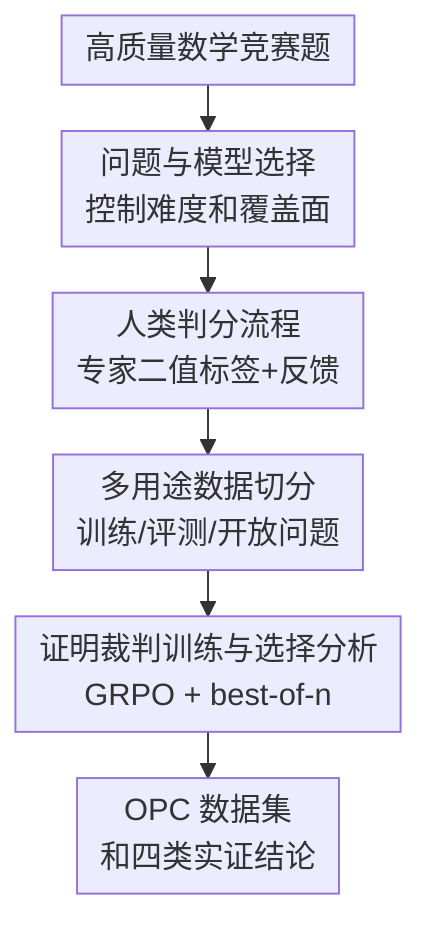

# The Open Proof Corpus: A Large-Scale Study of LLM-Generated Mathematical Proofs

**会议**: ICLR 2026  
**OpenReview**: [https://openreview.net/forum?id=a2XmC7rHIU](https://openreview.net/forum?id=a2XmC7rHIU)  
**论文**: [Open Proof Corpus](https://proofcorpus.ai/)  
**代码**: [https://huggingface.co/datasets/INSAIT-Institute/OPC](https://huggingface.co/datasets/INSAIT-Institute/OPC)  
**领域**: LLM评测 / 数学推理 / 数据集与基准  
**关键词**: 数学证明评测, 人类标注语料, LLM-as-a-judge, best-of-n, 形式化证明  

## 一句话总结
这篇论文构建了包含 5,062 条人类判分 LLM 数学证明的 Open Proof Corpus，并用它系统回答自然语言证明与形式化证明、最终答案与完整证明、best-of-n 选择和证明裁判训练之间的关键差异。

## 研究背景与动机
**领域现状**：LLM 在 AIME、HMMT、MathArena 这类最终答案型数学基准上进步很快，很多模型已经能给出接近顶尖参赛者水平的答案。可是数学能力并不只等于写出最后一个数，真正的数学研究、教学和定理证明系统更关心模型能否给出可检查、可追责、逻辑完整的证明。

**现有痛点**：已有证明评测通常规模太小、模型过旧、正确证明样本太少，或者没有开放人类标注结果。更麻烦的是，完整证明的错误常常很细：一步不合法的不等式变形、一个被当成“显然”的重计算、一个不存在的引用，都可能让最终结论失效。只靠最终答案或自动解析器，很难发现这些错误。

**核心矛盾**：证明生成研究需要大规模高质量标签来训练和分析模型，但高质量标签又只能由懂竞赛数学的人慢慢判分。作者面对的矛盾不是“再收集一些题目”这么简单，而是如何在专家时间有限的条件下，让每条证明都能被可靠地判为正确或错误，并保留足够信息支持后续研究。

**本文目标**：论文想解决四件事：第一，构建一个开放的大规模 LLM 生成证明语料；第二，用人类判分回答自然语言证明到底比形式化证明强多少；第三，测量最终答案正确时，完整证明是否也真的正确；第四，研究 LLM 作为证明裁判和 best-of-n 选择器是否能提升证明质量。

**切入角度**：作者没有把证明任务简化成一个新的分数榜，而是把“生成证明、专家判分、数据切分、下游训练与分析”连成一条管线。这个角度的好处是，同一批人类验证数据既能当训练集，也能当分析工具，还能让不同模型在同一证明正确性标准下比较。

**核心 idea**：用竞赛数学题上的 LLM 生成证明和专家二值判分，搭建一个开放语料 OPC，把证明生成从“最终答案是否对”推进到“完整论证是否站得住”。

## 方法详解

### 整体框架
OPC 的方法不是提出一个新的推理模型，而是提出一条可复现的数据构建和分析管线。输入是来自 IMO、USAMO、PutnamBench、MathArena 等高质量数学竞赛的题目；中间用多个强 LLM 生成完整自然语言证明，再由 13 名具备竞赛数学背景的专家通过专门界面判分；输出是一套带正确性标签、理由和部分句子级批注的证明语料，并进一步用于证明裁判训练、自然语言/形式化证明对比、最终答案/完整证明对比和 best-of-n 分析。

这条管线的关键在于标准化。题目来自不同竞赛，模型包括 O4-MINI、O3、GEMINI-2.5-PRO、GROK-3-MINI、QWEN3-235B-A22B 和 DeepSeek-R1，判分者背景也不同；如果没有统一的题目选择原则、证明生成提示词、判分说明和一致性监控，最后的数据很容易变成一堆不可比较的样本。作者把这些环节都固化下来，使 OPC 可以作为后续证明生成研究的公共底座。

### 关键设计
**1. 问题与模型选择：让语料既有难度又有可分析性**

OPC 的题目不是随便从数学网站抓来的，而是从 IMO Shortlist、USAMO、Putnam、EGMO、Baltic Way、MathArena 等竞赛和基准中挑选。作者用两个标准筛题：题源要足够权威，题目难度要能让强模型大约处在“会做一些、也会错很多”的区间。这个设定很重要，因为如果题太简单，语料里全是正确证明，训练不了裁判；如果题太难，语料里全是失败样本，又很难分析模型已经具备的能力。

模型选择也服务于同一个目标。论文使用当时强数学推理模型生成证明，并限制模型必须写完整 solution，而不是只给 proof outline。对于 MathArena 这种本来有最终答案的子集，作者只保留最终答案正确的生成结果，再看证明是否正确；这样可以直接隔离“答案对了但证明错了”的现象。对于 PutnamBench，作者还把已有的 informal final answer 附到题面里，使自然语言证明和形式化证明系统在相近信息条件下比较。

**2. 人类判分流程：把隐蔽证明错误转化成可靠标签**

论文最重的工程量在判分。13 名评审主要来自 IMO 参赛者或国家队选拔后期选手，具备识别竞赛证明细微错误的能力。每条样本包含题目、模型证明、正确/错误二值标签、判分理由，部分还包含句子级批注；少数边界样本可以标记 uncertain，整体占比低于 3%。这种设计比单纯给一个分数更适合训练和评测 LLM 裁判，因为下游任务正是判断一段证明能否成立。

为降低专家负担，作者构建了专门的网页判分界面，展示题目、参考解答、匿名模型证明和判分表单。几百条样本之后，系统还加入 O4-MINI 生成的“问题摘要”，只提示潜在漏洞，不直接给最终 verdict。论文专门检查了引入摘要前后 O4-MINI 与人类的一致率，发现没有显著变化，因此认为这个辅助工具提高了效率但没有明显引入偏差。

**3. 多用途数据切分：同一语料同时服务训练和科学问题**

OPC 不只是一个大表，而是按研究问题切成四个子集。MathArena 子集用于比较最终答案正确性和完整证明正确性；PutnamBench 子集用于比较自然语言证明与 Lean 等形式化证明；Best-of-n 子集让 O4-MINI 对同一题生成多条证明，用来研究不同选择策略；Generic 子集覆盖更广的竞赛来源，主要用于训练、验证和一般分析。

这种切分让论文避免了很多常见混淆。比如训练证明裁判时，MathArena 和 PutnamBench 不应混入训练集，因为它们承担独立结论的评测角色；best-of-n 的结论也不能用所有样本随意平均，因为有些题只有被选择的生成结果有人类标签。作者把数据用途在构建阶段就分清楚，使后面的四个结论都能对应到合适的子集。

**4. 证明裁判训练与选择分析：把 OPC 从静态数据集变成评测工具**

OPC 的另一个贡献是展示人类标签可以怎样转化为可用模型。作者从 Generic 子集中按 problem 切分训练/测试，确保训练集和测试集没有相同题目，然后用 GRPO 微调 R1-QWEN3-8B。奖励来自人类二值标签，训练后得到 OPC-R1-8B：它在证明正确性判断上达到 88.1% 的 majority-vote accuracy，接近 GEMINI-2.5-PRO，也比基座 R1-QWEN3-8B 高出约 17 个点。

在 best-of-n 分析中，作者不仅比较 pass@n，还比较四种选择策略：离散判对错、连续打 0-7 分、淘汰赛式 pairwise ranking，以及 Swiss round-robin ranking。Swiss 方法用 Bradley-Terry 模型把两两比较结果拟合成评分，核心概率形式是 $P(i \text{ beats } j)=1/(1+\exp(r_j-r_i))$。结果显示，pairwise ranking 比直接打分更能选出好证明，说明“让模型比较两段证明哪段更好”可能比“让模型单独给证明打分”更稳定。

### 一个完整示例
以 MathArena 子集为例，一道题先由模型生成带最终答案的完整证明。作者只保留最终答案正确的生成结果，然后交给专家看证明是否真的成立。假设某模型给出正确数值答案，但中间把一个复杂不等式变形写成“显然成立”，评审会按说明检查这一步是否真的能少量推理推出；如果不是，就标为 incorrect，并写明错误位置和原因。

这个例子解释了为什么最终答案基准会过于乐观。模型可能通过猜测、记忆、局部模式或不严谨推导得到正确答案，但其证明并不能让读者接受。OPC 的标签正是把这种“答案正确但论证不可靠”的情况显式记录下来，从而把评测目标从 outcome supervision 推向 proof correctness。

### 损失函数 / 训练策略
论文没有为证明生成提出新的损失函数，但在训练证明裁判时使用 GRPO。训练集包含 1,733 条 proof samples，测试集包含 293 条 proof samples，并按题目切分以避免同一道题泄漏。训练设置包括学习率 $10^{-6}$、最大响应长度 14,000 tokens、每题 10 个 rollouts、batch size 16，并使用与评测相同的判分提示词。

best-of-n 的 Swiss ranking 阶段可以看作一个选择模型而非训练目标：对同一题的多条证明做两两比较，得到胜负/平局结果，再用 Bradley-Terry 评分选最高者。它的代价是 $O(n^2)$ 次比较，比离散判分或 bracket ranking 更贵，但在论文实验中带来了最强的选择效果。

## 实验关键数据

### 主实验
OPC 的主实验分为三类：证明生成能力、证明裁判能力，以及几个关键开放问题的实证回答。下面表格保留最能说明论文结论的核心数字。

| 任务 / 子集 | 指标 | 代表模型 / 方法 | 结果 | 关键信息 |
|-------------|------|-----------------|------|----------|
| OPC 规模 | 人类判分证明数 | OPC | 5,062 条证明 / 1,010 道题 | 覆盖 6 个主要 LLM，43% 证明正确 |
| 人类一致性 | 双人判分一致率 | Human judges | 90.4% | 约 10% 样本双标，估计单个评审错误率约 5% |
| 证明裁判 | maj@5 | GPT-5 | 90.8% | 接近人类一致性上限 |
| 证明裁判 | maj@5 | OPC-R1-8B | 88.1% | 8B 开源模型经 OPC 训练后接近 Gemini-Pro |
| 自然语言 vs 形式化 | PutnamBench accuracy | GEMINI-2.5-PRO vs GOEDEL-PROVER-V2 | 约 83% vs <19% | 自然语言证明在该设置下解出约 4 倍题目 |
| 最终答案 vs 证明 | MathArena | O3 | 最终答案 87.6%，证明 59.5% | 答案正确不代表证明正确 |
| best-of-n | Best-of-n large subset | Rank (Swiss) | 40.0% | 相比 pass@1 的 22.7% 提升明显 |

证明裁判结果尤其关键，因为它说明人类标注的证明语料不只是“评测模型”的终点，还可以训练出更强的自动裁判。GPT-5 单次判断 89.3%、maj@5 90.8%，而 OPC-R1-8B 从基座的 70.7% pass@1 提升到 83.8% pass@1、88.1% maj@5，证明这批标签有直接的训练价值。

### 消融实验
严格来说，这篇论文没有传统模型组件消融；它的“消融/分析”主要是评测条件、选择策略和分布外泛化的对照。下面按论文实际问题整理。

| 配置 / 对照 | 关键指标 | 说明 |
|-------------|----------|------|
| R1-QWEN3-8B 基座裁判 | 70.7% pass@1 / 71.3% maj@5 | 未用 OPC 训练时判断证明正确性的能力较弱 |
| OPC-R1-8B | 83.8% pass@1 / 88.1% maj@5 | GRPO 使用 OPC 标签后大幅提升 |
| OPC-R1-8B on undergraduate OOD | 75.0% pass@1 / 77.0% maj@5 | 训练未含本科题，仍优于基座，说明有一定迁移 |
| 提供 ground-truth solution 给 GPT-5 | 89.3% → 89.0% pass@1 | 看到参考解答并不显著提升判错能力，污染影响有限 |
| Best-of-n Discrete | 31.5% | 比 pass@1 好，但提升有限 |
| Best-of-n Continuous | 32.9% | 连续打分略高于离散判分 |
| Best-of-n Rank (Swiss) | 40.0% | 两两排序明显强于直接判分/打分 |

这个表的核心不是证明某个模块“掉点”，而是说明 OPC 能支持多种可检验问题：训练数据是否有效、分布外是否仍有收益、提供官方解答是否会改变判分、以及选择策略是否真的比多采样本身更重要。

### 关键发现
- LLM 已经能生成不少正确自然语言证明，但错误证明仍然非常常见；尤其是在 IMO Shortlist 这种高难题源上，最好模型平均正确率也远低于最终答案基准给人的印象。
- 证明裁判能力比过去小规模研究显示得更强，GPT-5 和 GROK-4 已接近人类双标一致性；但模型存在自评偏差，多数模型判断自己生成的证明时表现更差。
- 自然语言证明当前明显领先形式化证明，但形式化证明的自动可验证性仍是长期优势；这不是“自然语言证明取代形式化证明”，而是说明两者之间还有很大的桥接空间。
- 最终答案正确性与完整证明正确性不对齐。GEMINI-2.5-PRO 在 MathArena 上最终答案与证明正确率差距较小，而 O3 的差距接近 30 个点，说明不同模型的“会算出答案”和“会写出可靠证明”不是同一种能力。
- best-of-n 的收益不仅来自多采样，还取决于选择器。Pairwise ranking 比单独判对错或打分更稳，尤其 Swiss ranking 在较大子集上把准确率从 22.7% 提到 40.0%。

## 亮点与洞察
- 这篇论文最扎实的地方是把“证明是否正确”交还给专家，而不是用最终答案、模型自评或形式化 verifier 的可用范围来替代。这个选择很贵，但正是它让后续结论有可信度。
- OPC 的设计很聪明：它不是单一排行榜，而是一个多用途实验场。MathArena、PutnamBench、Best-of-n 和 Generic 四个子集分别对应不同研究问题，使同一套语料可以回答多个长期悬而未决的问题。
- “模型不会承认不会做”这个观察很有现实意义。论文发现 1,700 多个错误解中，模型明确表示无法解决的只有 114 个，而且大多来自 O3；在数学这种要求可验证性的领域，错误自信比单纯低准确率更危险。
- LLM-as-a-judge 的结果给了一个务实方向：未来可能不必所有证明都让人类从头判分，可以先用强裁判筛选、排序和提示问题，再让专家集中处理边界样本。OPC 本身就提供了训练这种裁判的起点。
- best-of-n 的排序实验也值得迁移到其他高风险推理任务。相比让模型给单个答案打绝对分，让模型比较两个候选的相对质量，往往更接近人类审稿和竞赛判卷的实际工作方式。

## 局限与展望
- OPC 的主体题目仍以高中竞赛为主，约 84% 是 high-school level，研究级数学、专业本科高阶课程和真实论文证明还覆盖不足。因此它衡量的是竞赛证明能力，不应直接外推到数学研究自动化。
- 数据构建发生在 GROK-4 和 GPT-5 作为生成模型之前，因此这两个模型只作为裁判参与；最新模型的证明生成能力需要后续更新数据才能评估。
- 人类判分虽然可靠，但仍有噪声。双标一致率 90.4% 很高，不过这也意味着边界证明、复杂几何题和长计算题中仍存在不可忽略的主观或疏漏空间。
- 题目大多来自公开竞赛，污染风险不能完全排除。论文用标准/非标准竞赛、提供 ground-truth solution 等实验说明污染不是主导因素，但无法证明完全没有污染。
- best-of-n 的 Swiss ranking 代价为 $O(n^2)$，在大规模部署时成本较高。未来可以研究更省比较次数的排序、主动选择边界候选，或把比较器蒸馏成轻量模型。
- 自然语言证明目前比形式化证明强很多，但自然语言证明仍依赖人类或 LLM 裁判。真正可扩展的数学系统可能需要把自然语言强生成能力和形式化验证结合起来，而不是只选其中一种范式。

## 相关工作与启发
- **vs final-answer benchmarks**: AIME、HMMT、MathArena 等最终答案基准看的是 outcome，OPC 看的是完整 proof correctness。前者便宜、易自动评分，后者更接近数学能力本身，也能揭示“答案对但证明错”的情况。
- **vs formal proof generation**: Lean/Isabelle 等形式化证明可以自动验证，但当前通用 LLM 在形式化语法、库调用和证明搜索上仍受限。OPC 表明自然语言证明在 PutnamBench 上明显更强，同时也提醒形式化路线的长期价值在于可验证性。
- **vs Proof or Bluff / IMO Shortlist 小规模评测**: 这些工作揭示了 LLM 证明中的漏洞，但规模小或模型范围有限。OPC 的优势是开放 5,000+ 条人类判分证明，并覆盖多个题源、模型和下游分析。
- **vs LLM-as-a-judge 研究**: 通用 LLM 裁判常用于开放式问答、聊天质量或代码评价；OPC 把这个范式推进到数学证明，且提供人类标签训练小模型。它启发后续可以为特定高难评测任务构建专用裁判语料。
- **vs 数学训练数据集**: NuminaMath、Big-Math、DeepMath 等更偏训练解题能力，通常缺少 LLM 生成错误证明和人类正确性标签。OPC 的价值在于同时包含正确与错误的模型证明，特别适合训练 verifier、judge 和选择器。

## 评分
- 新颖性: ⭐⭐⭐⭐☆ 数据集和人评证明语料方向不全新，但 OPC 把规模、开放性、多子集设计和下游裁判训练结合得很完整。
- 实验充分度: ⭐⭐⭐⭐⭐ 论文覆盖证明生成、证明裁判、形式化对比、最终答案差距、best-of-n、污染分析和 OOD 泛化，证据链比较扎实。
- 写作质量: ⭐⭐⭐⭐☆ 主线清楚，图表信息密度高；不足是附录实验很多，读者需要来回对应子集定义才能完全把握结论边界。
- 价值: ⭐⭐⭐⭐⭐ 对数学推理评测、proof verifier 训练、LLM-as-a-judge 和自然语言/形式化证明桥接都有直接参考价值。

<!-- RELATED:START -->

## 相关论文

- [\[ICLR 2026\] RouterArena: An Open Platform for Comprehensive Comparison of LLM Routers](routerarena_an_open_platform_for_comprehensive_comparison_of_llm_routers.md)
- [\[ICLR 2026\] Reliable Fine-Grained Evaluation of Natural Language Math Proofs](reliable_fine-grained_evaluation_of_natural_language_math_proofs.md)
- [\[ICLR 2026\] The Ideation-Execution Gap: Execution Outcomes of LLM-Generated versus Human Research Ideas](the_ideation-execution_gap_execution_outcomes_of_llm-generated_versus_human_rese.md)
- [\[ICLR 2026\] AutoMetrics: Approximate Human Judgments with Automatically Generated Evaluators](autometrics_approximate_human_judgments_with_automatically_generated_evaluators.md)
- [\[ICML 2026\] RouteJudge: An Open Platform for Reproducible and Preference-Aware LLM Routing](../../ICML2026/llm_evaluation/routejudge_an_open_platform_for_reproducible_and_preference-aware_llm_routing.md)

<!-- RELATED:END -->
