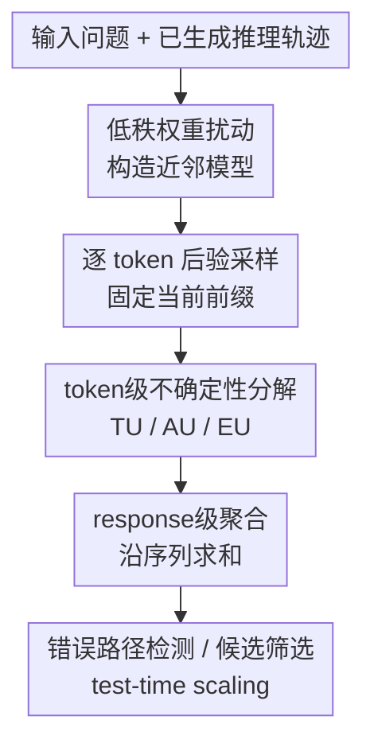

# TokUR: Token-Level Uncertainty Estimation for Large Language Model Reasoning

**会议**: ICLR2026  
**OpenReview**: [https://openreview.net/forum?id=VHQc7wzmYv](https://openreview.net/forum?id=VHQc7wzmYv)  
**代码**: https://github.com/Wang-ML-Lab/TokUR  
**领域**: LLM评测 / 不确定性估计 / 推理可靠性  
**关键词**: token级不确定性, LLM推理, 贝叶斯扰动, 错误路径检测, test-time scaling  

## 一句话总结
TokUR 用注意力权重的低秩随机扰动构造轻量级贝叶斯模型集成，在每个生成 token 上估计 total / aleatoric / epistemic uncertainty，再把这些信号聚合成推理轨迹级置信度，用于识别错误推理、筛选高质量答案并辅助测试时扩展。

## 研究背景与动机
**领域现状**：LLM 在数学推理、逻辑推理和代码生成里已经能产出很长的 chain-of-thought，但这些长答案的可靠性仍然很不稳定。实际部署时，问题不只是“模型能不能答对”，还包括“模型答错时能不能知道自己可能答错”，尤其是在多步推理里，一个中间算错的 token 往往会把后续推理整段带偏。

**现有痛点**：已有不确定性估计大致分两类。第一类是 query-level 方法，只估计输入问题 $x$ 的整体不确定性 $U(y|x)$，更像是在问“这个问题本身难不难”，却不能判断某个已经生成的回答 $y$ 是否可信。第二类是 response-level 的经验信号，例如 log-likelihood、predictive entropy、P(True)、Self-Certainty 或 DeepConf，它们在实践中有用，但大多缺少清晰的贝叶斯不确定性分解，也难以解释错误到底发生在哪个生成位置。

**核心矛盾**：长文本推理的不确定性估计有一个根本张力：理论上，序列级不确定性需要对全部可能输出序列做边缘化；但自回归生成空间随长度指数增长，这在计算上不可行。若退而求其次只看最终序列 log-probability，又会把模型偏好、长度偏差和真正的知识不确定性混在一起，无法稳定地区分“这个答案语义上可能错”与“这个答案只是写得长/短”。

**本文目标**：作者希望建立一个不用重新训练、能嵌入现有 LLM 推理流程的不确定性估计框架。这个框架需要同时做到三件事：第一，在 token 级别给出可计算的 uncertainty；第二，能把 token 信号聚合为 response-level 分数，用于评价一条完整推理轨迹；第三，这个分数不仅和答案正确性相关，还能直接服务于候选答案选择和 test-time scaling。

**切入角度**：TokUR 的关键观察是，LLM 的自回归生成天然是逐 token 决策，错误也常常在某个关键 token 附近显现。因此，与其先生成整段文本再粗略打分，不如在每一步固定当前前缀 $y_{<t}$，通过轻量级权重扰动构造多个“近邻模型”，观察它们对下一个 token $y_t$ 的分布是否一致。如果模型近邻之间意见分歧大，这个位置就更可能暴露 epistemic uncertainty。

**核心 idea**：TokUR 用低秩随机权重扰动近似贝叶斯后验，把长链推理的不确定性拆到 token 粒度上估计，再把 token-level uncertainty 沿生成轨迹求和，得到可用于推理质量评估和推理增强的 response-level uncertainty。

## 方法详解

### 整体框架
TokUR 的输入是一道推理题 $x$ 和基础 LLM 已经生成的一条候选回答 $y=(y_1,\dots,y_T)$，输出是这条回答的 total uncertainty、aleatoric uncertainty 和 epistemic uncertainty 分数。它不训练新模型，而是在推理时对注意力层的 query/key 权重加入低秩随机扰动，采样出若干个近邻模型；对每个 token，TokUR 用这些近邻模型的预测分布做贝叶斯模型平均，然后计算 token 级不确定性，最后沿序列聚合为回答级不确定性。

图里的核心贡献节点有四个：低秩权重扰动、逐 token 后验采样、token 级不确定性分解、response 级聚合。它们对应下面四个关键设计：先用很小的扰动成本获得近似后验，再让每个 token 的 uncertainty 条件化在真实生成前缀上，接着把贝叶斯不确定性拆成 TU/AU/EU，最后把这些局部信号变成可排序的整段推理分数。

### 关键设计
**1. 低秩权重扰动：不用训练也能得到近似贝叶斯模型集成**

TokUR 首先要解决的是“怎样在不重新训练大模型的情况下得到参数不确定性”。直接做 Bayesian LLM 或深度集成代价太高，LoRA 式贝叶斯适配又通常需要额外训练。作者选择对已有权重 $W_0$ 做 SVD：$W_0=U\mathrm{diag}(d)V^\top$，然后只取左奇异向量的前 $r'$ 列 $U'$，采样一个很小的噪声矩阵 $\epsilon$，构造扰动权重

$$
W = W_0 + U'\epsilon^\top, \quad \epsilon_{ij}\sim \mathcal{N}(0,\sigma_q^2).
$$

这相当于在低秩子空间里给原模型加一个各向同性高斯扰动，形成近似后验 $q(\theta|\sigma_q)$。论文默认把扰动加在所有注意力层的 $W^Q$ 和 $W^K$ 上，设置 $r'=8$、$\sigma_q=0.1$、每次不确定性估计采样 $M=2$ 个扰动模型。这样做的好处是扰动集中在影响注意力模式的关键权重上，既能让近邻模型产生足够的预测分歧，又不会像全参数扰动那样破坏原模型语义能力。

**2. 逐 token 后验采样：让不确定性绑定到具体推理前缀**

传统 query-level uncertainty 估计 $U(y|x)$ 时，需要对未观测的输出前缀 $y_{<t}$ 做边缘化，所以更像是在描述问题本身的开放性，而不是描述某条回答的质量。TokUR 改成固定已经生成的前缀 $y_{<t}$，只估计下一个 token 的预测分布：

$$
\bar p(y_t|y_{<t},x)=\mathbb{E}_{\theta\sim q(\cdot|D)}[p(y_t|y_{<t},x;\theta)].
$$

更细的一点是，论文采用 stepwise posterior sampling：每个 decoding step 的扰动权重样本不共享。也就是说，它把序列概率写成 $\prod_t \mathbb{E}_{\theta_t}[p(y_t|x,y_{<t};\theta_t)]$，而不是先采一组固定参数再生成整段。这个假设更贴近自回归解码中“每一步重新评价当前上下文”的需求，也避免一个早期扰动样本把整段序列的分布耦合得过强。附录 E.5.4 的消融显示，在 MATH500 的 test-time scaling 里，stepwise modeling 在 accuracy、相对 baseline 提升和样本效率上都稳定优于 joint modeling。

**3. TU/AU/EU 分解：把“答案本身随机”和“模型不知道”区分开**

TokUR 在每个 token 上计算三种不确定性。Total uncertainty 是扰动模型平均后的预测熵：

$$
\mathrm{TU}(y_t|y_{<t},x)=H[\bar p(y_t|y_{<t},x)].
$$

Aleatoric uncertainty 是每个扰动模型自身预测熵的期望：

$$
\mathrm{AU}(y_t|y_{<t},x)=\mathbb{E}_{\theta\sim q(\cdot|D)}[H[p(y_t|y_{<t},x;\theta)]].
$$

Epistemic uncertainty 则是二者差值，也就是 token 与参数之间的互信息：

$$
\mathrm{EU}(y_t|y_{<t},x)=\mathrm{TU}(y_t|y_{<t},x)-\mathrm{AU}(y_t|y_{<t},x)=I(y_t;\theta|y_{<t},x).
$$

这一区分很重要。AU 更像是“在当前上下文下合理输出本来就多”，例如开放式表达或高温采样带来的多样性；EU 更像是“模型近邻之间意见不一致”，往往对应参数知识不足、推理链局部不稳或关键计算出错。论文的案例分析也支持这一点：错误答案附近，例如把 $9600-7200$ 反写成 $7200-9600$、漏掉常数项、给出错误最终角度时，错误 token 周围会出现更高的不确定性热点。

**4. response级聚合：把 token 热点变成可排序的推理质量分数**

只有 token 热图还不够，实际应用需要给整条候选推理轨迹排序。TokUR 直接把 token uncertainty 沿序列累加：

$$
\widetilde U(y|x)=\sum_{t=1}^T U(y_t|y_{<t},x),
$$

其中 $U$ 可以取 TU、AU 或 EU。论文证明这个 response-level uncertainty 是 query-level uncertainty 的无偏估计，即 $\mathbb{E}_{y\sim p(y|x)}[\widetilde U(y|x)]=U(y|x)$；当输出长度 $T=1$ 时，它又退化为普通单 token uncertainty。因此，它不是单纯的经验打分，而是和已有不确定性理论有结构上的一致性。

应用时，这个分数可以有两种用法。离线场景下，模型先为同一道题采样多条推理轨迹，TokUR 给每条轨迹打分，保留低不确定性的 top-$P\%$ 候选，再做 majority voting 或 weighted best-of-N。在线场景下，TokUR 还能被当作 intrinsic reward 放进 particle filtering，在生成过程中按中间推理片段的不确定性重采样粒子。后者增益不大但展示了一个方向：不确定性估计可以从“事后筛答案”进一步走向“生成时引导推理”。

### 一个完整示例
以 GSM8K 中“比较两个人送奶收入差”的题为例，模型需要先算 Oula 的收入 $96\times100=9600$，再算 Tona 的收入 $(3/4)\times96\times100=7200$，最后取差得到 $2400$。一条正确推理在关键数值 token 附近保持较低 uncertainty；而错误推理把最后一步写成 $7200-9600=-2400$，TokUR 在负号和错误答案 token 附近给出明显更高的 EU/AU 热点。

这个例子说明 TokUR 的价值不只是把整段回答标成“高风险”，还可以定位风险在哪里。对于长链推理，这一点尤其有用：最终答案错了不一定意味着每一步都错，TokUR 的 token-level 信号能帮助人或下游算法发现最值得回看的一两个局部位置。

### 损失函数 / 训练策略
TokUR 本身没有训练损失，也不需要微调基础 LLM。它的主要超参来自推理时扰动与估计配置：低秩噪声 rank $r'=8$，扰动强度 $\sigma_q=0.1$，每次估计采样数 $M=2$。消融显示，$\sigma_q$ 太小时扰动模型几乎没有分歧，EU 对 log-likelihood 的增益有限；$\sigma_q$ 太大时近邻模型偏离原参数过远，会破坏语义并损害 AUROC。温度消融则显示，解码温度 $\tau$ 升高会明显抬高 AU，但 EU 相对稳定，TokUR 的区分能力没有被温度变化显著破坏。

在 test-time scaling 任务中，作者对 TokUR 分数使用 length normalization，以减少不同候选答案长度带来的排序偏差；但在错误路径检测任务里，附录 E.5.3 发现不做长度归一化反而更强，说明“长答案更容易累计更多不确定 token”在去幻觉/错误检测中可能是有利信号。这也是一个实践提醒：TokUR 的聚合形式要和下游目标配套，而不是机械套同一种归一化。

## 实验关键数据

### 主实验
论文的实验覆盖数学推理、逻辑推理、代码生成、事实性评估和 test-time scaling。主评测模型包括 Llama-3.2-1B-Instruct、Llama-3.1-8B-Instruct、Qwen-2.5-3B-Instruct 和 Qwen-2.5-7B-Instruct；数学数据集包括 GSM8K、MATH500 和 DeepScaleR。核心指标是 AUROC、AUPRC 和 Top-50% ACC，用来衡量 uncertainty score 能否区分正确/错误推理，并优先选出更可靠的回答。

| 任务 / 模型 | 指标 | 强基线 | TokUR 最好结果 | 主要结论 |
|---|---|---:|---:|---|
| MATH500 / Llama-3.2-1B | AUROC | DeepConf 71.77 | TokUR-TU 80.64 | 小模型数学推理错误检测大幅优于 confidence/log-prob 类方法 |
| MATH500 / Llama-3.1-8B | AUROC | Self-Certainty 76.41 | TokUR-EU 82.86 | 大模型上 EU 最强，说明 epistemic 分歧能抓住高阶错误 |
| DeepScaleR / Llama-3.1-8B | AUROC | DeepConf 73.05 | TokUR-TU 85.33 | 在更难数学题上 TokUR 优势更明显 |
| Zebra Puzzles / Qwen-2.5-3B | AUROC | Self-Certainty 47.77 | TokUR-AU 71.66 | 非数学逻辑推理也能泛化 |
| FactScore / Qwen-2.5-3B | Precision* | LL 45.03 | TokUR-AU 61.53 | 事实性筛选上 AU 更有效，可能因为事实陈述存在更强生成随机性 |

在数学错误路径检测中，TokUR 在 Llama 系列上基本稳定超过全部内部信号基线和外部语义基线。比如 Llama-3.2-1B 的 MATH500 上，CoT Pass@1 只有 25.60%，DeepConf 的 AUROC 为 71.77%，TokUR-TU 达到 80.64%；Llama-3.1-8B 的 MATH500 上，TokUR-EU 的 AUPRC 达到 81.35%，也高于 Self-Certainty 和 DeepConf。

| Test-time scaling 设置 | Pass@1 / 基线 | LL | TokUR 最好结果 | 提升解读 |
|---|---:|---:|---:|---|
| GSM8K, Llama-3.2-1B, $N=16$ | 44.43 | 47.10 | TokUR-EU 50.38 | 低采样预算下比 LL 多约 3.3 个点 |
| GSM8K, Llama-3.2-1B, $N=256$ | 44.43 | 58.89 | TokUR-AU 60.70 | 候选多时仍有稳定小幅优势 |
| MATH500, Llama-3.2-1B, $N=16$ | 25.60 | 26.42 | TokUR-EU 28.28 | 难题上 EU 排序最有效 |
| MATH500, Llama-3.1-8B, $N=256$ | 48.60 | 64.10 | TokUR-EU 65.32 | 大模型 + 难题场景下保持领先 |
| MATH500 online PF, Llama-3.2-1B | LL 26.27 | 26.27 | TokUR-EU WBoN 29.20 | 作为 intrinsic reward 有轻微增益 |

这些结果说明 TokUR 不只是一个检测器，还能作为候选答案排序器。作者在每题采样 512 条离线响应，从中抽取 $N=16,64,256$ 等不同预算，再保留 uncertainty 最低的 top-10% 做投票。TokUR 在小预算下收益最明显，这很符合直觉：当只能看少量候选时，可靠排序比简单多数投票更关键。

### 消融实验
| 配置 | 关键指标 | 说明 |
|---|---:|---|
| TokUR-TU, Llama-3.2-1B, MATH500，无长度归一化 | AUROC 57.14 | 原始累加分数在该任务上被长度等因素干扰较大 |
| TokUR-TU, Llama-3.2-1B, MATH500，带长度归一化 | AUROC 80.64 | 错误路径检测主表采用该设置，长度处理显著提升区分力 |
| TokUR-EU, Llama-3.1-8B, MATH500，带长度归一化 | AUROC 82.86 | 大模型上 epistemic uncertainty 最能区分正确/错误回答 |
| 扰动强度 $\sigma_q<0.1$ | EU 增益有限 | 扰动太小，近邻模型预测几乎一致，难以暴露参数不确定性 |
| 扰动强度 $\sigma_q>0.2$ | AUROC 下降 | 扰动过强会偏离原模型语义，uncertainty 变成噪声 |
| Stepwise posterior sampling | scaling 曲线更高 | 相比 joint modeling，逐步采样在 MATH500 上 accuracy、improvement 和 efficiency 都更好 |

需要注意的是，论文正文和附录对长度归一化的表述有些细节容易读混：实现细节里说 test-time scaling 使用 length normalization；附录 E.5.3 又比较了错误路径检测中有无 length normalization 的影响。表格显示 TokUR、LL 在带长度处理时检测性能更强，而 Self-Certainty、DeepConf 对归一化也高度敏感。更稳妥的理解是：TokUR 的 token 累加分数必须考虑下游任务与长度偏差的关系，不能把“是否归一化”当作无关实现细节。

### 关键发现
- TokUR 的 uncertainty 和问题难度、回答正确性有稳定相关性：在难度分桶实验里，错误回答的 AU/TU/EU 普遍高于正确回答，AUROC 多数高于随机水平。
- Epistemic uncertainty 在数学推理和 test-time scaling 中尤其有价值，因为它捕捉的是近邻模型之间对关键 token 的分歧，更接近“模型是否真的知道这一步”。
- AU 在 FactScore 这类事实性筛选上表现突出，说明不同任务可能需要不同 uncertainty 分量；不能简单认为 EU 永远最好。
- TokUR 对模型家族有泛化性，Llama 和 Qwen 上都能超过 log-likelihood、predictive entropy、Self-Certainty 和 DeepConf 等强基线。
- 在线 particle filtering 的增益较小，说明把 uncertainty 当过程奖励仍有挑战；当前更成熟的用法是事后检测和候选排序。

## 亮点与洞察
- TokUR 最巧妙的地方在于把长链推理可靠性问题拆到了 token 级别。很多错误不是整段文本都“不自信”，而是在某个算术、符号、条件引用或最终答案 token 附近出现局部不稳定；token heatmap 比整段 log-probability 更有诊断价值。
- 低秩权重扰动是一个很务实的折中。它没有重新训练 Bayesian LoRA，也没有维护多个完整模型，而是围绕原权重构造小范围随机近邻，使贝叶斯不确定性估计可以嵌入 vLLM 这类推理框架。
- AU/TU/EU 的分解让“模型输出不确定”这件事更可解释。AU 更偏生成任务本身的多样性，EU 更偏模型知识或参数层面的不确定；这比单一 confidence score 更适合分析不同错误来源。
- response-level 聚合的理论连接很重要。作者没有只说“把 token 分数加起来效果好”，而是证明它和 query-level uncertainty 有无偏估计关系，并在 $T=1$ 时退化到传统 token 预测场景。
- 这篇论文的思路可以迁移到 verifier、过程奖励模型和自适应采样。比如在多轮 agent 或代码修复里，可以用 token/step uncertainty 决定什么时候继续采样、什么时候调用外部工具、什么时候把中间步骤交给 verifier。

## 局限与展望
- 推理成本仍然不低。即便每步只采样 $M=2$ 个扰动模型，TokUR 也需要额外前向和权重扰动管理；在低延迟在线服务里，这个成本可能比普通 log-probability 打分高很多。
- token-level 聚合可能漏掉高层语义错误。有些推理错误不是单个 token 的局部异常，而是跨多个步骤的假设错置、问题理解偏差或隐含约束遗漏；简单求和未必能完整刻画这种全局逻辑不一致。
- 权重扰动后验仍是近似的。$q(\theta|\sigma_q)$ 来自低秩高斯扰动，不等同于真实训练数据后验；扰动子空间、扰动强度和采样数都会影响结果，理论上还有较强的工程假设。
- 实验以可验证推理任务为主，开放式写作、对话规划、多模态推理等场景还需要更多验证。尤其是事实性任务里 AU 更强，说明不同任务的 uncertainty 分量选择可能需要自动适配。
- 后续可以把 TokUR 与语义级 verification 结合：token uncertainty 负责定位高风险片段，语义 verifier 或工具调用负责判断这段是否真的错，从而减少单纯基于不确定性排序的误杀。

## 相关工作与启发
- **vs Log-Likelihood / Predictive Entropy**: LL 和 PE 直接来自模型输出分布，计算便宜，但容易混入长度偏差和表面概率偏好。TokUR 通过参数扰动比较多个近邻模型的分布差异，更能捕捉 epistemic uncertainty。
- **vs Self-Certainty / DeepConf**: Self-Certainty 用与均匀分布的 KL 距离估计 confidence，DeepConf 聚合 top-K log-probabilities，它们是强内部信号基线。TokUR 的区别是引入贝叶斯式权重扰动，并明确分解 TU/AU/EU，因此在 MATH500、DeepScaleR 等难推理任务上更稳。
- **vs Semantic Entropy / SAR**: SE 和 SAR 借助外部 NLI 或语义相似度模型，能从语义等价角度估计不确定性，但系统更重，也不是纯内部信号。TokUR 不依赖外部模型，更适合嵌入已有 LLM 推理服务。
- **vs Bayesian LoRA / Bayesian LLM**: 传统 Bayesian LoRA 多用于分类或下游适配，需要训练均值/方差或搜索后验近似。TokUR 则把 training-free Bayesianization 推到长文本生成和数学推理场景，用低秩扰动服务 token-level uncertainty。
- **对未来工作的启发**: 对 agent 系统而言，TokUR 可以作为“何时不信自己”的底层传感器。它不一定直接替代 verifier，但可以告诉系统哪些 token、步骤或候选答案最值得复查。

## 评分
- 新颖性: ⭐⭐⭐⭐☆ 低秩扰动和贝叶斯不确定性并非全新，但把它们系统推进到 token-level LLM reasoning，并连接错误检测与 test-time scaling，切入点很有价值。
- 实验充分度: ⭐⭐⭐⭐☆ 数学、逻辑、代码、事实性和多模型实验较完整，消融也覆盖扰动强度、温度、长度归一化和 stepwise sampling；但开放式真实应用还偏少。
- 写作质量: ⭐⭐⭐⭐☆ 结构清楚，理论定义和实验应用衔接自然；个别长度归一化表述需要读附录才能完全理顺。
- 价值: ⭐⭐⭐⭐⭐ 对 LLM 可靠性评估、推理候选筛选、过程奖励和 agent 自检都有直接启发，尤其适合需要长链推理可置信度信号的系统。

<!-- RELATED:START -->

## 相关论文

- [\[ICLR 2026\] Addressing Pitfalls in the Evaluation of Uncertainty Estimation Methods for Natural Language Generation](addressing_pitfalls_in_the_evaluation_of_uncertainty_estimation_methods_for_natu.md)
- [\[ICLR 2026\] Complementing Self-Consistency with Cross-Model Disagreement for Uncertainty Quantification](complementing_self-consistency_with_cross-model_disagreement_for_uncertainty_qua.md)
- [\[ICLR 2026\] When to Ensemble: Identifying Token-Level Points for Stable and Fast LLM Ensembling](when_to_ensemble_identifying_token-level_points_for_stable_and_fast_llm_ensembli.md)
- [\[ACL 2026\] Challenging the Boundaries of Reasoning: An Olympiad-Level Math Benchmark for Large Language Models](../../ACL2026/llm_evaluation/challenging_the_boundaries_of_reasoning_an_olympiad-level_math_benchmark_for_lar.md)
- [\[ICLR 2026\] Don't Pass@k: A Bayesian Framework for Large Language Model Evaluation](dont_passk_a_bayesian_framework_for_large_language_model_evaluation.md)

<!-- RELATED:END -->
