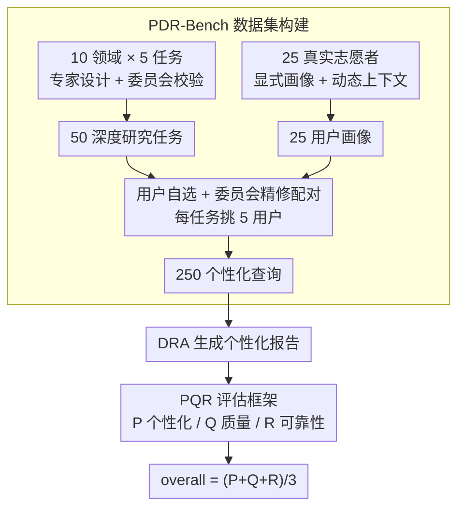

# Towards Personalized Deep Research: Benchmarks and Evaluations

**会议**: ICLR 2026  
**OpenReview**: [https://openreview.net/forum?id=51LIRzF53v](https://openreview.net/forum?id=51LIRzF53v)  
**代码**: https://github.com/OPPO-PersonalAI/PersonalizedDeepResearchBench (有)  
**领域**: Agent / LLM 评测 / 深度研究  
**关键词**: 深度研究智能体, 个性化评测, 基准构建, LLM-as-Judge, 用户画像

## 一句话总结
作者提出 **PDR-Bench**——首个面向"个性化深度研究"的基准，用 50 个跨 10 领域的研究任务 × 25 个真实用户画像组合出 250 条个性化查询，并配套 **PQR 评估框架**（个性化对齐 P / 内容质量 Q / 事实可靠性 R），实测发现现有深度研究系统普遍"会写报告但不会因人而异"，且越多用户信息个性化越好、但隐式上下文远不如显式画像好用。

## 研究背景与动机
**领域现状**：深度研究智能体（Deep Research Agents, DRAs）已能自主完成多轮检索、工具调用、信息聚合并产出结构化长报告，商业（Gemini/O3/Perplexity Deep Research）和开源（DeerFlow、OAgents、MiroFlow 等）系统层出不穷，被视为最有落地潜力的 agent 形态之一。

**现有痛点**：评测却严重滞后。一类是 **close-ended** 基准（GAIA、BrowseComp、HLE、X-Bench），靠合成任务和唯一答案，反映不了真实研究场景；另一类是 **open-ended** 深度研究基准（DeepResearch Bench、ResearcherBench、DeepResearchGym），只盯报告的事实准确性和全面性。两类都默认"好报告对所有人都一样好"。

**核心矛盾**：现实里重要决策——买哪辆车、怎么投资、申哪所博士——强烈依赖用户自己的**需求、预算、偏好和已有知识**。同一个"读博申请"任务，给应届生和给在职转码者应该给出完全不同的报告。但**个性化**这一维度恰恰是现有 DRA 评测的盲区：现有个性化基准（LaMP、PersonaGym、PersonaLens、PersonaFeedback）又只覆盖对话/推荐等窄任务，碰不到深度研究的复杂度。

**本文目标**：把"个性化"正式引入 DRA 评测，需要回答三件事——(1) 怎么造出既真实又能区分个性化能力的任务-用户数据；(2) 怎么量化一份报告"是不是为我写的"；(3) 现有系统到底做得怎么样、瓶颈在哪。

**切入角度**：作者认为个性化评测不能用"全局正确性"那套统一标准，而要**针对每个用户-任务对动态生成专属评判准则**——因为"对这个用户重要的维度"本身就是个性化的（给在职申请者，报告该不该突出在职录取因素，对应届生就不重要）。

**核心 idea**：用真实志愿者画像 + 委员会校验造出 250 条个性化查询，再用一个**三轴、动态准则、LLM 驱动**的 PQR 框架，把"个性化对齐 + 内容质量 + 事实可靠性"拆开分别打分。

## 方法详解

### 整体框架
这篇论文不是提出一个新 agent，而是提出一套**基准 + 评估方法学**，因此"方法"由两块拼成：左半边是**数据怎么造出来**（PDR-Bench 构建），右半边是**报告怎么打分**（PQR 评估框架）。

数据侧是一条三阶段流水线：先由领域专家设计 50 个深度研究任务（10 领域 × 每域 5 个），经委员会按"复杂度 / 清晰度 / 对齐度"三原则反复校验；同时招募 25 名真实志愿者，把本人真实信息映射到结构化画像 schema（显式 persona），再让标注员在手机 APP 上模拟其日常交互、积累记忆片段与对话（动态上下文）；最后用"用户自选 + 委员会精修"的协议把任务与用户配对，每个任务挑 5 个相关用户，得到 250 条个性化查询。

评估侧是 PQR 框架：对每份生成报告，分别沿 **P（个性化对齐）/ Q（内容质量）/ R（事实可靠性）** 三条正交轴打分，P、Q 用"动态权重→动态子准则→LLM 打分"三阶段，R 用"抽取声明→联网核验→算 FA/CC"三阶段，最后三轴算术平均得到 overall 分。

### 关键设计

**1. PDR-Bench 构建：用真实志愿者画像锚定"个性化"，而非合成人设**

针对"现有基准要么无个性化、要么人设是刻板印象"的痛点，作者把基准的可信度押在**真实用户数据**上。任务侧由旅游博主、理财顾问、教育咨询师等真实领域专家草拟，再过一遍由硕博研究员、数据科学家、产品经理组成的委员会，按三条可操作原则筛选：复杂度（需多步推理-检索-分析）、清晰度（目标明确无歧义）、对齐度（确实适合个性化深度研究），每域均衡保留 5 个，共 $T=\{t_i\}_{i=1}^{50}$，并造了语义对齐的中英双份任务集。

用户侧是真正的创新点：招 25 名年龄/职业/收入/人生阶段各异的志愿者，受隐私培训后把**本人真实信息**填进专门设计的画像 schema，得到 25 份显式 ground-truth persona $P_s$；再让标注员在手机 APP 上替这些画像模拟日常——记录旅行愿望、健康目标、家庭计划等记忆片段 $m_j$，并与助手对话 $c_j$，由 APP 的管理系统 $f_\theta$ 处理成**动态个性化上下文** $P_{c_j}=f_\theta(m_j,c_j)$。完整画像即 $P=\{(P_{s_j},P_{c_j})\}_{j=1}^{25}$。配对时不是随机，而是每个志愿者先从任务池里挑自己真正关心的，再由委员会精修，保证每个任务关联的 5 个用户既多样又与任务真相关：$Q=\{(p,t_i)\mid p\in P_i,|P_i|=5\}$，$|Q|=250$。这样"画像-任务"的相关性是天然的、有动机的，而不是硬塞。

**2. P-Score 个性化对齐：为每个用户-任务对动态生成专属评判准则**

这是全文核心。难点在于"个性化好不好"高度主观、多维，且**对不同用户重要的维度本就不同**，用一套固定 rubric 必然失真。作者的解法是一条三阶段、LLM 驱动的动态打分流水线，围绕四个基础维度——目标对齐 GOAL、内容对齐 CONT、呈现契合 PRES、可执行性 ACTI 展开：

- **Stage 1 动态维度权重**：一个 LLM 充当 meta-evaluator，读任务 $T$ 和画像 $P_s$，判断这四个维度对**这一对**的相对重要性，输出权重向量 $W=\{w_d\}$ 且 $\sum_{d}w_d=1$（如读博申请里 CONT 权重可高达 0.39、PRES 0.33）。
- **Stage 2 细粒度子准则生成**：对每个维度 $d$，LLM 再条件于 $T,P_s$ 生成一组具体子准则 $C_d^P=\{c_1,\dots,c_n\}$（如"所选院校是否贴合用户背景""是否刻意纳入在职申请者的关键录取因素"），每条配权重 $w_{c_i}$ 且 $\sum_i w_{c_i}=1$。
- **Stage 3 LLM 打分**：另一个 LLM 拿报告对照每条子准则给 $s_{c_i}\in[0,10]$ 并附理由。

最终 P-Score 是两层加权平均：

$$S_P=\sum_{d\in D_P} w_d\cdot S_d=\sum_{d\in D_P} w_d\left(\sum_{c_i\in C_d^P} w_{c_i}\cdot s_{c_i}\right)$$

和"全局正确性"评测的根本区别在于：评判标准本身是**因人因任务现造**的，而不是预先写死，这才接得住个性化的主观性。

**3. Q-Score 内容质量 与 R-Score 事实可靠性：补齐"写得好不好"与"是不是真的"**

个性化之外还得保证报告本身过硬，作者用两条独立轴兜底。**Q（内容质量）** 与任务相关、与用户无关，沿深度与洞察 DEIN、逻辑连贯 LOGC、清晰可读 CLAR 三维，复用与 P 相同的"动态权重 + 动态子准则 + LLM 打分"范式，得到层级加权的 $S_Q$。

**R（事实可靠性）** 则换一套机制，因为传统事实核查只比对原子事实、不适合"靠引用支撑"的深度研究。它分三步：先用 Judge LLM 抽出所有可验证声明及其来源，组成三元组 $\{(c_i,idx_i,source_i)\}$ 并去重得 $N_{total}$ 条（其中 $N_{cited}$ 条带引用）；再用 Jina Reader API 抓取每条引用的实际网页内容，让 Judge LLM 判断是否支持，$v_i\in\{0,1\}$；最后算两个互补指标——

$$FA=\frac{\sum_{i=1}^{N_{cited}} v_i}{N_{cited}}\times 10,\quad CC=\frac{N_{cited}}{N_{total}}\times 10,\quad S_R=\frac{FA+CC}{2}$$

FA（事实准确率）衡量"给出的引用有多少真的支撑了声明"，CC（引用覆盖率）衡量"报告里有多少事实声明真有引用撑着"。两者分开很关键：一个系统可能引用都准（FA 高）但大量论断裸奔无引用（CC 低），反之亦然。三轴最后简单平均成 $S_{overall}=(S_P+S_Q+S_R)/3$。

### 一个完整示例
以"读博申请"任务配一个在职转码用户为例走一遍 P-Score：Stage 1 的 meta-evaluator 读到用户是 CS 在职人士，判定 CONT 权重 0.39、PRES 0.33、GOAL 0.16、ACTI 0.12；Stage 2 为 CONT 现造子准则如 "C1: 所选院校是否瞄准强 AI 组且有产业联系、匹配度均衡"（权重 0.15）、"C2: 是否刻意纳入在职申请者关键录取因素"（权重 0.09）；Stage 3 打分 C1 得 8.5/10、C2 得 5/10，加权回 CONT 维度分，再与另外三维按 0.39/0.33/0.16/0.12 加权得到这份报告的 P-Score。换一个应届生用户，整套权重和子准则会重新生成——这正是"动态准则"区别于固定 rubric 的地方。

## 实验关键数据

### 主实验
评测 3 类共 10 个系统，在 Task w/Persona（显式给任务+画像）配置下、150 条代表性查询上，用 GPT-5 当 P/Q 裁判、GPT-5-Mini 当 R 裁判。

| 类别 | 代表系统 | P (overall) | DEIN(Q) | FA | CC |
|------|---------|------|------|------|------|
| 商业 DRA | Gemini-2.5-Pro Deep Research | 6.58 | 4.56 | 6.16 | 8.40 |
| 商业 DRA | O3 Deep Research | 6.11 | 5.10 | 5.58 | 6.84 |
| 开源 DRA | **OAgents** | **6.64** | **6.92** | 6.85 | 3.77 |
| 开源 DRA | MiroFlow | 5.78 | 6.65 | 6.68 | 7.29 |
| LLM+搜索 | Gemini-2.5-Pro w/Search | 5.53 | 4.19 | 5.41 | 6.99 |
| LLM+搜索 | GPT-4.1 w/Search | 4.28 | 4.07 | 5.54 | **0.10** |

> 注：P 列为个性化总分；不同系统各有短板，CC 列差异极大（OAgents 0.10 量级问题主要出在裸论断无引用）。

### 信息可用性梯度实验
对比 Task Only / Task w/Context / Task w/Persona 三种条件下的个性化分（P-Score）：

| 系统 | Task Only | Task w/Context | Task w/Persona |
|------|-----------|----------------|----------------|
| OAgents | 6.17 | 6.53 | **6.78** |
| O3 Deep Research | 5.13 | **5.48** | 5.46 |
| Gemini-2.5-Pro w/Search | 3.96 | 4.55 | **4.70** |

### 记忆系统实验
在 Task w/Context 设置下、用 Perplexity Deep Research 跑 50 条查询，测三种记忆系统能否把隐式上下文蒸馏成显式画像（重点看 GOAL/CONT）：

| 方法 | P-Score | GOAL | CONT |
|------|---------|------|------|
| No Memory | 3.69 | 3.88 | 3.74 |
| Mem0 | 3.55 | 3.73 | 3.55 |
| Memory OS | 3.88 | 4.06 | 3.97 |
| **O-Mem** | **4.26** | **4.47** | **4.43** |
| Task w/Persona（上界） | 4.58 | 4.69 | 4.93 |

### 关键发现
- **开源 agent 个性化最强，但可靠性是软肋**：OAgents 个性化总分最高（6.64）、多个子指标领先，但事实准确率仅 3.77；MiroFlow、DeerFlow 引用覆盖率很差。商业系统反过来——个性化略低但 FA/CC 稳（Gemini Deep Research FA 8.40、CC 9.26）。
- **光加搜索不够**：LLM+搜索整体落后专用 agent，GPT-4.1 w/Search 的 CC 近乎为 0（0.10），说明它几乎不给论断配引用。
- **信息越多个性化越好，但显式画像 >> 隐式上下文**：从 Task Only→Context→Persona 单调上升；OAgents 的 GOAL 从 Context 的 6.32 跳到 Persona 的 6.68，这一跳比 Task Only→Context 还大，说明 agent 很难从非结构化隐式数据里完整抽出用户偏好。
- **记忆系统有潜力但远未补上差距**：O-Mem 能超过 No Memory 基线（4.26 vs 3.69），但离 Task w/Persona 上界（4.58）仍有明显差距，Mem0 甚至不如不用记忆——当前记忆系统只能做内容对齐式的存取，缺乏把上下文抽象成"类画像用户模型"的高层推理。
- **裁判选型有据**：在 15 条采样上对比 LLM 与人类专家，GPT-5 的 PCA 最高（0.43）、MARD 最低（1.40）、每查询成本 0.68 美元，故定为主裁判。

## 亮点与洞察
- **"动态准则"是个性化评测的关键解法**：与其用一套固定 rubric 套所有人，不如让 meta-evaluator 针对每个用户-任务对现造权重和子准则——这把"对谁重要"这件本就个性化的事，交给评估流程自己决定，比静态 rubric 更接得住主观性。这个思路可迁移到任何"评判标准因人而异"的生成任务评测。
- **FA 与 CC 拆开看，能暴露两种截然不同的失败**：高 FA 低 CC = 引用都准但大量论断裸奔；高 CC 低 FA = 处处给引用但引用不支撑。合成一个事实分会把这两种问题糊掉，分开测才看得清系统到底差在哪。
- **把"个性化"从 agent 能力问题拆成数据可用性问题**：三档信息梯度实验干净地证明了瓶颈在"agent 抽不出隐式偏好"，于是顺理成章地把记忆系统作为补救方向来测，问题定位—解法验证的链条很完整。

## 局限与展望
- **依赖 LLM-as-Judge**：P/Q 全靠 GPT-5 当裁判，虽有 15 条人类一致性验证（PCA 0.43、MARD 1.40），但样本小，且裁判模型本身的偏好/偏见会传导进分数，换裁判可能改变排名。
- **规模与覆盖**：250 条查询、25 个用户、150 条实际评测子集，统计力有限；用户全部来自一次招募，人口学多样性虽刻意设计但难代表全球分布。
- **真实数据 → 公开数据有损耗**：出于隐私，公开版只放去标识、抽象化的画像衍生物，可能弱化了原始画像的细节信号，复现者拿到的不是完整真相画像。
- **R 轴依赖外部 API**：事实核验用 Jina Reader 抓网页 + LLM 判定，网页失效、反爬、判定噪声都会影响 FA/CC 的稳定性。
- **改进方向**：作者明确指向"超越存取、能把上下文抽象成动态类画像用户模型"的记忆系统，这是把个性化深度研究做实的关键缺口。

## 相关工作与启发
- **vs DeepResearch Bench / ResearcherBench / DeepResearchGym**：它们是 open-ended 深度研究基准，但只评事实准确性和全面性，默认"好报告对所有人一样好"；本文首次把个性化（P 轴）正式纳入 DRA 评测，并保留质量/可靠性轴（Q/R）做兜底。
- **vs GAIA / BrowseComp / HLE / X-Bench**：这些 close-ended 基准靠合成任务+唯一答案，反映不了真实研究；本文用真实专家任务 + 真实志愿者画像，open-ended 且个性化。
- **vs LaMP / PersonaGym / PersonaLens / PersonaFeedback**：现有个性化基准只覆盖对话/推荐等窄域，碰不到深度研究的多轮检索+长报告复杂度；本文把个性化首次接到深度研究场景上。
- **vs Mem0 / Memory OS / O-Mem**：本文不只把它们当被测对象，更是用它们验证"隐式上下文能否被蒸馏成显式画像"这一核心瓶颈，给记忆系统研究指了一个可量化的目标（逼近 Task w/Persona 上界）。

## 评分
- 新颖性: ⭐⭐⭐⭐⭐ 首个把个性化正式引入深度研究 agent 评测，动态准则的 P-Score 设计有原创性。
- 实验充分度: ⭐⭐⭐⭐ 覆盖 3 类 10 系统 + 三档信息梯度 + 记忆系统 + 人类一致性验证，但评测子集和人类标注样本偏小。
- 写作质量: ⭐⭐⭐⭐ 动机—方法—实验链条清晰，公式与图示到位。
- 价值: ⭐⭐⭐⭐⭐ 填补真实空白、配套开源基准与框架，对个性化 AI 研究助手的开发与评测有持久参考价值。

<!-- RELATED:START -->

## 相关论文

- [\[ICLR 2026\] ResearchRubrics: A Benchmark of Prompts and Rubrics For Evaluating Deep Research Agents](researchrubrics_a_benchmark_of_prompts_and_rubrics_for_evaluating_deep_research_.md)
- [\[ICLR 2026\] DRBench: A Realistic Benchmark for Enterprise Deep Research](drbench_a_realistic_benchmark_for_enterprise_deep_research.md)
- [\[ICLR 2026\] DeepResearch Bench: A Comprehensive Benchmark for Deep Research Agents](deepresearch_bench_a_comprehensive_benchmark_for_deep_research_agents.md)
- [\[ICLR 2026\] LiveResearchBench: A Live Benchmark for User-Centric Deep Research in the Wild](liveresearchbench_a_live_benchmark_for_user-centric_deep_research_in_the_wild.md)
- [\[ICLR 2026\] Characterizing Deep Research: A Benchmark and Formal Definition](characterizing_deep_research_a_benchmark_and_formal_definition.md)

<!-- RELATED:END -->
