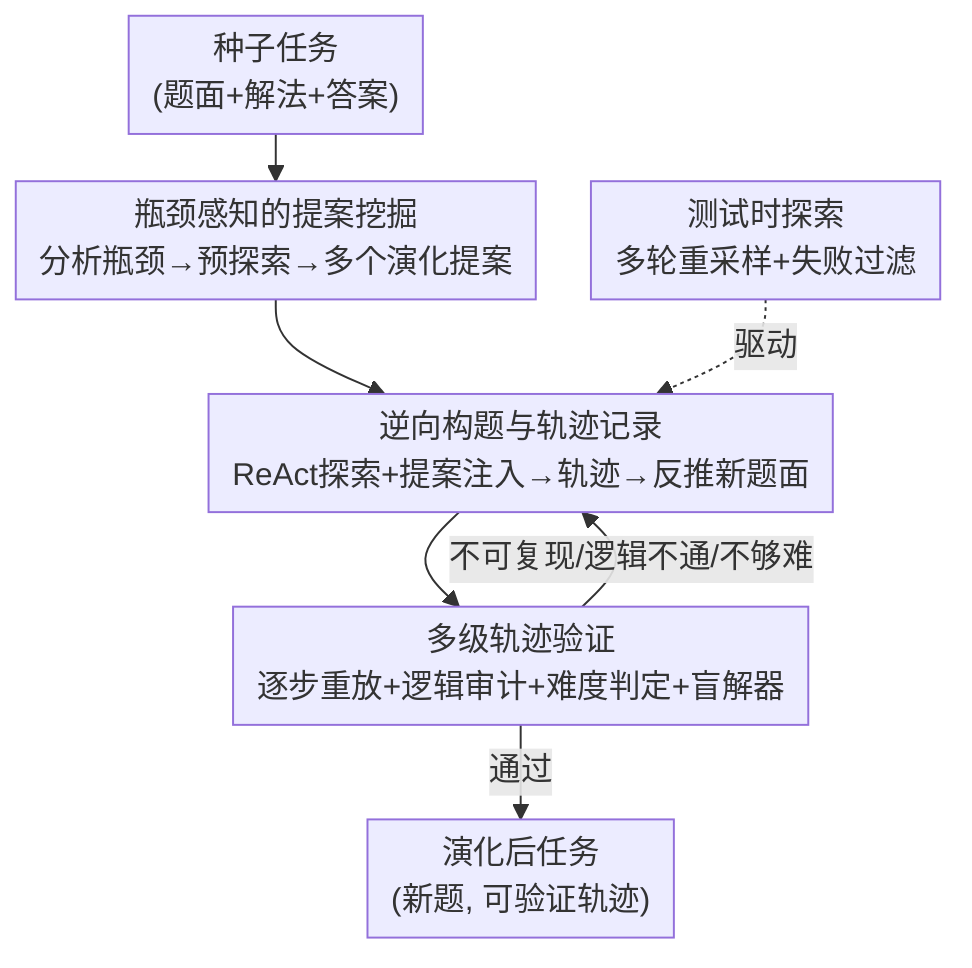

# Towards Self-Evolving Agent Benchmarks: Validatable Agent Trajectory via Test-Time Exploration

**会议**: ICLR 2026  
**OpenReview**: [https://openreview.net/forum?id=2H03gm4Rq6](https://openreview.net/forum?id=2H03gm4Rq6)  
**代码**: https://github.com/titanwings/trace-benchmark-evolving  
**领域**: Agent / 评测Benchmark  
**关键词**: 自进化基准、智能体评测、执行轨迹验证、测试时探索、任务演化

## 一句话总结
提出 TRACE 框架，让智能体把现有 benchmark 里的种子任务"自由探索 + 自我演化"成更难的新任务，并把演化过程中产生的执行轨迹当作一等公民记录下来、做多级验证，从而把静态人工标注的评测集变成可持续自我升级的动态评测系统。

## 研究背景与动机

**领域现状**：随着 LLM 智能体在推理、规划、工具使用上能力飞涨，主流评测靠的是 GAIA、SWE-bench、USACO 这类人工精心构造的静态 benchmark，用最终答案是否正确来打分。

**现有痛点**：这些静态 benchmark 正在被快速"刷爆"——顶尖智能体在 GAIA 上已经超过 90%、逼近人类基线。一旦饱和，benchmark 就丧失了区分先进智能体的能力，而且很容易让进步变成对固定测试集的过拟合，而非真正的泛化智能。可人工再造一批新颖、复杂、可靠的难题又极其费时费钱。

**核心矛盾**：智能体任务有两个特性让"自动加难"格外棘手——(1) **过程性**：强调与动态真实环境（网页、API）的多步交互；(2) **巨大多样性**：从网页导航到软件操作无所不包。这导致传统的"规则参数突变"或"简单放大"基本失效：在动态网页里改个关键词可能直接把任务变得无解，而把"订一张机票"改成"订三张"只是增加重复、并没增加认知与规划挑战。

**本文目标**：要一套超越表面改写、能从根本上提升智能体任务**过程、逻辑、语义复杂度**的自动演化范式，同时保证演化出的任务仍然可解、可验证。

**切入角度**：作者的关键观察是——人类 benchmark 设计者并不是凭空写题，而是先探索、跑通一条解法、再据此定义题目。于是把 LLM 的 **agentic 能力**本身当作演化引擎，让智能体在真实环境里自由探索，并把探索时产生的**执行轨迹**作为构题与验证的基础。

**核心 idea**：用"先探索出一条更难的解题轨迹、再逆向定义出对应的新题目"取代"直接改写题面"，并以轨迹的可复现性与逻辑自洽作为难度增加的可信凭证。

## 方法详解

### 整体框架

TRACE（Trajectory-based Validated-by-Reproducing Agent-benchmark Complexity Evolution）是一个**多智能体框架**，输入是某个现有 benchmark 里的一道种子任务（题面 + 可选的解题路径与答案），输出是一对 `(演化后的新任务, 可验证的执行轨迹)`。它把任务演化拆成三个分工明确、端到端协作的角色串成的流水线，再叠加一个"测试时探索"的外层循环来反复尝试与筛选。

整条流水线这样转：**Evolution Proposer** 先对种子任务做瓶颈分析与预探索，产出多个加难"提案"；**Exploration Executor** 不去解题、而是带着提案在真实环境里做 ReAct 探索，沿原解法路径择机注入提案，跑出一条更复杂的解题轨迹，再据此**逆向**写出新题面；**Trajectory Validator** 对这条轨迹逐步重放、做全局逻辑审计、判定难度是否真的提升，并额外引入一个看不到轨迹的"盲解器"做难度兜底。整个过程因为 LLM 采样的随机性与演化的开放性，被设计成一种结构化的**测试时探索**：失败的尝试不是噪声，而是探索的自然组成，被验证器过滤掉，只有经得起检验的轨迹才进入最终评测集。

### 关键设计

**1. 瓶颈感知的提案挖掘：先诊断再加难，而非盲目改写**

针对"规则改写经常把任务改无解、或只增加重复"的痛点，Evolution Proposer 不直接生成修改，而是先做一段**瓶颈感知的预探索**。它分析种子任务及其解题轨迹，判定这道题主要考察哪类能力（规划 / 推理 / 工具使用）、求解者最可能在哪里遇到内在困难，然后在任务的语义空间里探查可以加强的维度——延长证据链、增加工具交互复杂度、加深推理要求。基于这份诊断，它再合成多个**演化提案**，每个提案都是一条清晰的祈使式改造指令。提案受一组"指导原则但非硬性规则"约束：鼓励发散思维、甚至允许在语义自洽的前提下转向全新场景，但强制要求所有改造都必须导向**确定、可验证**的解。这种"先看任务卡在哪、再定向加难"的方式，让演化是有的放矢的结构增强，而不是表面扰动。

**2. 逆向构题与轨迹记录：先跑出更难的解、再据此定义题目**

这是 TRACE 最反直觉的一步。Exploration Executor 遵循**逆向构题（inverse problem creation）**原则——它的主要创造性动作"不是解题，而是定义一道题"。它从种子任务出发，沿当前解法路径前进，在合适的步骤做**逐步提案注入**：在某个中间状态把一个演化想法（加约束、换工具、转移到另一能力域）具体化，制造一个增加难度的"岔路口"，然后带着完整工具权限沿这条分支探索，产出一条记录了 `reasoning / action / observation` 的轨迹。论文把智能体工作流形式化为一个 DAG，每个节点是四元组 $S_i = (c_{i-1}, r_i, a_i, o_i)$（上下文、测试时推理、外部动作、环境观察），轨迹分布写作 $p_\pi(\tau)=\prod_{i=1}^{T}\pi_a(a_i\mid c_{i-1},r_i)\,p(o_i\mid a_i,c_{i-1})$。拿到这条更复杂的解题轨迹后，Executor 才反推出一段恰好匹配这条解的新题面，并保证最终答案是单一、确定、可验证的值、不含歧义。因为轨迹与题目天然配对，引入的复杂度始终透明可查，而不是"只有最终答案、看不见怎么变难的"。

**3. 多级轨迹验证 + 无轨迹盲解器：既保可复现，又保真的更难**

针对"演化任务可能不可复现、逻辑断裂、或只是表面变难"的风险，Trajectory Validator 做多级把关。第一级**逐步重放**：对轨迹里每一步重新执行工具调用，核对输出与记录的 observation 是否一致，保证可复现。第二级**全局逻辑审计**：在所有中间观察可复现、推理链内部自洽的假设下，判定任务可解且良定义。在轨迹验证之外，它还用一个受**心智理论（theory-of-mind）**启发的瓶颈评估来判断演化任务是否带来真实的难度提升——给定种子与演化任务的解题轨迹，让难度裁判估计哪道题会对能力相当的求解者构成更大的内在瓶颈。最关键的兜底是引入一个**无轨迹盲解器**：它看不到生成轨迹、纯用 ReAct 范式、且与主 Executor 享有同等工具权限（多模态、网页浏览、编码）。在限定预算内，如果盲解器能稳定解出演化任务，就说明它"不够难"，被拒绝或退回重演化；只有能抵抗这个盲解器的任务才通过，从而提供一个独立于作者轨迹的**经验难度下限**。

**4. 测试时探索作为难度引擎：把算力投在"造更难的题"上**

由于 LLM 采样的随机性和演化的开放性，造一道演化任务不是一次成型，而是一种结构化的**测试时探索**，分两层展开。**run 内**：Executor 探索不同推理路径与工具调用，把轨迹落地成一个具体问题实例。**run 间**：生成多条轨迹并送去验证，失败的尝试被当作探索的自然组成而非纯噪声过滤掉。作者由此把"测试时扩展（test-time scaling）"的内涵从"产出更可靠的答案"扩展到"探索并验证更难的、以轨迹为根基的任务"——额外算力不是用来把答案磨得更对，而是用来把题目造得更难。这让 benchmark 演化本身成为一个可以靠 compute 持续推进的过程。

### 一个完整示例

以 GAIA 里一道单跳检索题为例：「莱斯特大学论文《Can Hiccup Supply Enough Fish to Maintain a Dragon's Diet?》里算出的鱼袋体积是多少立方米？」（答案 0.1777，只需谷歌搜索 + 打开 PDF + 摘取一个标量）。Proposer 诊断其瓶颈在"网页搜索 + 文档理解"，预探索时发现整篇论文充满数学计算与鱼的数据，于是提议把它改造成一道数学建模题。Executor 沿原解法读论文、取出鱼的质量与体积数据，注入"用 5.0 m² 金属板最优设计圆柱容器、每个装满容器受 80 kg 起吊限制"等约束，跑出一条需要"形式化几何约束 → 推导目标函数 $V_{\text{total}}(r)$ → 用微积分求极值 → 在约束下解出 $(r^\star, h^\star)$"的多步轨迹，最终反推出新题：「Hiccup 单次最多能运多少千克鱼？」（答案 770.0）。Validator 做轻量格式检查、逐步重放、可解性与逻辑审计后通过。这条"从种子到火花（From Seed to Spark）"的演化把任务从**网页检索**直接跨越到**数学建模 + 编码**，是能力域的转置，而非"再加一跳"的表面改写。

## 实验关键数据

### 主实验

所有演化阶段统一用单一后端 Qwen3-Coder-480B-A35B（Proposer / Executor / Validator 同后端、同工具权限），辅助盲解器用 Qwen3-235B-A22B-Instruct；评测用统一的 inspect_eval ReAct Agent（上限 100 轮交互，看不到任何生成轨迹或验证输出）。演化任务直接沿用 GAIA 原始评测格式，指标为 Pass@1。

GAIA 上四个被测模型在两轮演化后普遍显著掉点（Total Pass@1，Evo. ← Orig.）：

| 模型 | Round 1 Total | Round 2 Total | 原始 → R2 变化 |
|------|---------------|---------------|----------------|
| DeepSeek-V3.1 | 0.247←0.418 (-0.171) | 0.188←0.418 (-0.229) | 明显下降 |
| Gemini-2.5-flash | 0.151←0.291 (-0.140) | 0.130←0.291 (-0.161) | 明显下降 |
| KIMI-K2 | 0.192←0.255 (-0.063) | 0.174←0.255 (-0.081) | 下降 |
| GPT-5-Mini | 0.260←0.455 (-0.213) | 0.174←0.455 (-0.281) | 大幅下降 |

最极端的单点是 Gemini-2.5-flash 在 Level 1、第二轮演化后 Pass@1 直接掉 43.1%（0.040←0.471）。注意按难度 Level 拆开看会有少数 Level 3 上升的反常项（如 GPT-5-Mini R2 的 Level 3 +0.183），作者解释为演化前后任务差异极大、几乎可视作独立问题，故又额外汇报了把两轮混合后的 "Mixed" Pass@1，整体仍一致下降。

### 难度上升的旁证：token 长度同步增长

| 指标 | GPT-5-Mini | KIMI-K2 |
|------|-----------|---------|
| Avg. Length (Round 1) | 4898.2←2864.5 (+2033.7) | 6609.0←3389.6 (+3219.4) |
| Avg. Length (Round 2) | 6275.7←2864.5 (+3411.2) | 8454.7←3389.6 (+5065.1) |

Pass@1 下降的**同时**平均答案长度大幅上升，说明 TRACE 不是在引入噪声，而是真正让任务变难、逼模型进入更长更费力的推理轨迹。

### 泛化到推理 benchmark：AIME-2024

| 模型 | Round 2 Acc | Round 4 Acc | 原始 → R4 变化 |
|------|-------------|-------------|----------------|
| DeepSeek-R1-Distill-Qwen-7B | 0.4933←0.5667 | 0.3933←0.5667 (-0.1734) | 下降 |
| DeepSeek-R1-Distill-Qwen-32B | 0.6233←0.7300 | 0.5333←0.7300 (-0.1967) | 下降 |
| Qwen3-235B-A22B | 0.9033←0.9400 | 0.7167←0.9400 (-0.2233) | 大幅下降 |

经过四轮演化，Qwen3-235B-A22B 平均准确率掉 22.33%、平均 token 数增加 8000+，证明 TRACE 不止适用于通用智能体任务，也能给纯推理 benchmark 持续加难。

### 关键发现
- **难度提升有"硬证据"**：盲解器兜底（无轨迹、同等工具）保证通过的任务确实抵抗得住强求解器，掉点不是靠引入歧义或不可解题刷出来的。
- **token 与 Pass@1 反向运动**是最有说服力的信号：变难的任务同时让正确率降、让推理变长，二者一致排除了"只是变噪声"的解释。
- **From Seed to Spark（从种子到火花）**：演化能自发跨越能力域，把单跳检索题变成数学建模 + 编码题，显著提升任务多样性与推理深度，这超出了作者预期、也超出了"再加一跳"的范畴。

## 亮点与洞察
- **逆向构题**是最巧的一招：把"出题"重新定义为"先跑出一条更难的解、再据此定义题目"，天然保证了每道演化题都配一条可执行、可复现的解轨迹，从根上解决了"自动造题难保证可解/可验"的老问题。
- **轨迹作为一等公民**：相比只验最终答案的静态 benchmark，把整条 `reasoning-action-observation` 轨迹留存下来做逐步重放，使评测从"答案对不对"升级到"过程站不站得住"，可迁移到任何需要过程级审计的 agent 评测。
- **无轨迹盲解器**提供了一个独立于作者主观判断的经验难度下限，这个"对抗式难度门槛"的思路可以直接借鉴到任何自动造题/数据合成流程里，防止生成器自欺。
- **测试时探索 = 造题引擎**：把 test-time scaling 的算力从"磨答案"重定向到"造更难的题"，给"benchmark 如何跟上模型迭代速度"提供了一条可持续、可 scale 的路径。

## 局限与展望
- 难度判定的核心环节（瓶颈评估、逻辑审计）本身依赖 LLM 裁判，存在裁判能力天花板与潜在偏置——若裁判判错"是否更难"，整条流水线的难度保证会打折扣。
- 主实验演化与验证全部基于单一后端 Qwen3-Coder-480B，虽然有助于隔离后端方差，但 TRACE 演化质量对生成后端能力的依赖程度、换更弱后端会怎样，文中未充分探讨。
- 演化高度依赖真实环境（live internet、可访问 URL）的可用性，被引用资源若失效会影响可复现性；按难度 Level 拆分时出现的少数反常上升项也提示，细粒度的难度可控性仍有提升空间。
- 评测仅覆盖 GAIA 与 AIME-2024 两类种子，对软件工程（SWE-bench）、多模态等更广任务族的适配效果有待验证。

## 相关工作与启发
- **vs Benchmark Self-Evolving / AutoEvoEval**：它们用预定义的原子操作对推理/封闭式 QA 做结构或语义扰动，主要针对**鲁棒性**而非提升过程复杂度；TRACE 靠模型在真实环境里的测试时探索自主造更难的题，并以轨迹可复现/逻辑自洽来保证可解可验。
- **vs EvoCodeBench**：它靠周期性吸纳新仓库来减少泄漏，依赖人工策划的数据流与固定时间表；TRACE 不靠预定义编辑或定时刷新，而是模型驱动的探索式演化。
- **vs WebArena / Mind2Web**：这些工作强调过程级评测（轨迹回放、步级指标）但任务集仍是静态预定义的；TRACE 把"轨迹"从评测信号进一步升级为**演化材料**，用它来生成新任务，而不只是给已有任务打分。

## 评分
- 新颖性: ⭐⭐⭐⭐⭐ "逆向构题 + 轨迹一等公民 + 盲解器兜底"组合出一个真正可持续自进化的评测范式，思路新颖且自洽。
- 实验充分度: ⭐⭐⭐⭐ GAIA + AIME 双 benchmark、四模型、多轮演化、token 旁证齐全，但后端单一、任务族偏窄，少数 Level 反常项稍弱。
- 写作质量: ⭐⭐⭐⭐ 动机与流水线讲得清楚，DAG 形式化与"从种子到火花"案例很有画面感。
- 价值: ⭐⭐⭐⭐⭐ 直击"benchmark 被刷爆、人工造题太贵"的真痛点，为评测如何追上模型迭代速度提供了可 scale 的工程范式。

<!-- RELATED:START -->

## 相关论文

- [\[ICLR 2026\] Holistic Agent Leaderboard: The Missing Infrastructure for AI Agent Evaluation](holistic_agent_leaderboard_the_missing_infrastructure_for_ai_agent_evaluation.md)
- [\[ICLR 2026\] AutoLibra: Agent Metric Induction from Open-Ended Human Feedback](autolibra_agent_metric_induction_from_open-ended_human_feedback.md)
- [\[ICLR 2026\] MLE-Smith: Scaling MLE Tasks with Automated Multi-agent Pipeline](mle-smith_scaling_mle_tasks_with_automated_multi-agent_pipeline.md)
- [\[ICLR 2026\] In-Context Learning for Pure Exploration](in-context_learning_for_pure_exploration.md)
- [\[ICLR 2026\] Talk, Evaluate, Diagnose: User-aware Agent Evaluation with Automated Error Analysis](talk_evaluate_diagnose_user-aware_agent_evaluation_with_automated_error_analysis.md)

<!-- RELATED:END -->
