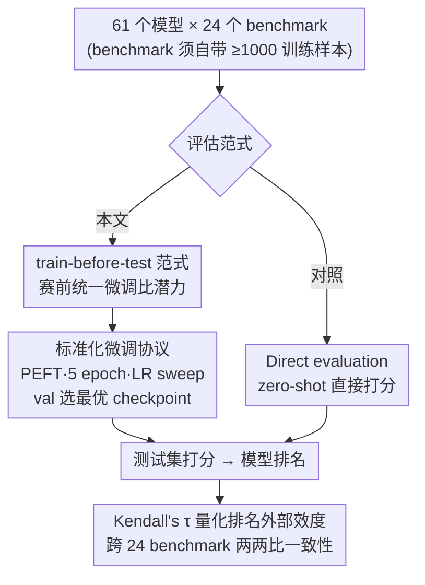

# Train-before-Test Harmonizes Language Model Rankings

**会议**: ICLR 2026  
**OpenReview**: [https://openreview.net/forum?id=ORv3SAzus1](https://openreview.net/forum?id=ORv3SAzus1)  
**代码**: https://github.com/socialfoundations/lm-harmony  
**领域**: LLM 评估 / 模型排名 / Benchmark 方法学  
**关键词**: 模型评估, 排名一致性, 微调, 外部效度, 困惑度

## 一句话总结
论文提出 **train-before-test**——评估前先用 benchmark 自带的训练集给每个模型做一次统一的标准化微调，再去测试集打分排名；在 24 个 benchmark × 61 个模型上证明，这种"比潜力"的排名跨 benchmark 高度一致（平均 Kendall's τ 从 0.52 升到 0.76），并把原本被遗忘的困惑度与下游表现重新连上、把模型-分数矩阵压成近乎秩一。

## 研究背景与动机

**领域现状**：大模型评估的主流做法是 **direct evaluation（直接评估）**——把模型当黑盒，zero-shot 地丢进各种 benchmark 跑分、排名、选型。Open LLM Leaderboard、HELM 等都建立在这套范式上。

**现有痛点**：不同 benchmark 给出的排名相互矛盾，**即使是号称测同一种能力的 benchmark 也对不上**。论文 Figure 1 给的例子很扎心：NQ-Open 和 ARC-Challenge 同属问答（QA）类，但 61 个模型在两者上的直接评估排名差异巨大。这让"到底该选哪个模型"成了一笔糊涂账。

**核心矛盾**：社区常把这种排名分歧解释为"大模型能力多面、各有所长"。但论文指出真正的祸根是 **training on the test task（在测试任务上训练过）**——模型的预训练数据各家配方不同、且多为私有，某个模型可能恰好"提前为某个 benchmark 复习过"。于是开箱表现混入了"准备度差异"这个混杂因子，一个本来更弱的模型可能只是更会应试。准备度不等，比较就不公平。

**本文目标**：既然"准备度不等"在干扰评估，那能不能**把准备度拉平**，让矛盾的排名重新和谐？具体拆成三问——拉平后排名是否跨 benchmark 一致？困惑度与下游表现的断裂能否修复？分数矩阵的潜在结构会怎样变化？

**切入角度**：受 Dominguez-Olmedo et al. (2024) 关于准备度混杂的发现启发，作者反其道而行：与其测"开箱即用的表现"，不如测"经过同等准备后能达到的潜力"。只要给每个模型**同样的赛前训练**，比较就回到同一起跑线。

**核心 idea**：用"赛前统一微调后再评估（train-before-test）"取代"直接评估"，把比较对象从 *performance（表现）* 换成 *potential（潜力）*，从而消除预训练准备度差异带来的虚假排名分歧。

## 方法详解

### 整体框架

train-before-test 本身不是一个新模型，而是一套**评估协议**，作为 direct evaluation 的对照存在。整条流水线是这样转的：先从 lm-eval-harness 里筛出**自带 ≥1000 条训练样本**的 benchmark（最终保留 24 个，覆盖语言理解、常识推理、问答、理化生、数学、医学六类）；对每个 (模型, benchmark) 对，先在该 benchmark 的训练集上做一次**标准化 PEFT 微调**，在验证集上挑最优 checkpoint，再到测试集打分；最后按分数给模型排名，并用 **Kendall's τ** 度量任意两个 benchmark 排名之间的一致性。direct evaluation 则跳过微调那一步、直接 zero-shot 评测，作为对照。两条路各自产出 24 套排名，对比谁的跨 benchmark 一致性更高。

### 关键设计

**1. train-before-test 范式：用赛前统一微调抹平准备度差异**

这一招直接针对"在测试任务上训练过"这个混杂因子。direct evaluation 比的是开箱表现，而开箱表现里掺杂了"哪个模型预训练时恰好见过类似数据"的运气成分——准备多的模型占便宜，比较因此失真。train-before-test 的做法是：评估前给**每个模型在同一个 benchmark 训练集上做同等微调**，让所有模型都"复习到位"再考试，于是分数反映的是模型经过适配后**能达到的潜力**，而非它碰巧带来的现成准备。这个视角的转换很关键——实践中开发者选模型往往是为了拿去**继续微调/适配**到自己的任务，此时"开箱第一名"在适配后未必还是第一名，潜力才是真正相关的信号。论文据此主张：direct evaluation 衡量"部署就绪度"，train-before-test 衡量"可适配潜力"，二者互补而非替代。

**2. 标准化微调协议：让"公平对照"可复现可规模化**

要让"同等准备"站得住脚，微调流程本身必须严格统一、不偏袒任何模型。论文采用**参数高效微调（PEFT/LoRA）**而非全量微调，既省算力又统一了适配预算；每个模型固定训练 5 个 epoch，在学习率 $\{1\text{e-}5, 2\text{e-}5, 5\text{e-}5\}$ 上分别扫一遍，然后**在独立验证集上选最优 checkpoint**——这一步保证了不会因为某个模型恰好需要不同学习率而吃亏。整个实验把 61 个模型 × 24 个 benchmark 共 $61 \times 24 = 1464$ 个微调模型全部跑出来，数据量上对训练集封顶 50000、验证集 1000、测试集 10000 以控成本。正是这种"对所有模型一视同仁的适配预算"，让"潜力"成了一个可比、可复现的量，而不是某次调参的偶然产物。

**3. 用 Kendall's τ 量化排名外部效度**

光说"排名更一致"不够，得有可量化的判据。论文用 **Kendall's τ**（秩相关系数）度量任意两个 benchmark 之间模型排名的吻合程度，并对全部 $\binom{24}{2}=276$ 个 benchmark 对计算，取平均看整体一致性。这里借用了**外部效度（external validity）**的概念：如果在 benchmark A 上的排名能优雅地迁移到 benchmark B，说明这个排名捕捉的是模型的内在性质而非某个任务的特异性。τ 越高，排名越能跨任务泛化、对实践中选型越有指导意义。这个度量也让"direct vs train-before-test 谁更好"变成一个可以直接对比数字的实证问题。

### 一个完整示例

以 NQ-Open 这个在直接评估下的"异类"为例走一遍。在 direct evaluation 下，NQ-Open 与其余 23 个 benchmark 的平均 Kendall's τ 只有 **0.23**——它的排名几乎和别人对不上，像个离群点（Figure 1 上半部分：Gemma-2-9B 在两个 QA benchmark 上排名差异明显）。换成 train-before-test：先让全部 61 个模型在 NQ-Open 训练集上各自做标准化 PEFT 微调、验证集选 checkpoint、测试集打分重排，此时 NQ-Open 与其余 benchmark 的平均 τ 跳到 **0.74**，离群点回归主流（Figure 1 下半部分排名高度对齐）。同一个 benchmark，仅仅因为"先训后测"，就从"谁都对不上"变成"和大家高度一致"——这直观说明了原先的分歧主要来自准备度差异，而非能力的真实多面性。

## 实验关键数据

实验覆盖 **24 个 benchmark × 61 个模型（6 个模型家族：LLaMA / Qwen / Gemma / Pythia / GPT-2 / Yi，≤14B）**，对每个组合都跑了 direct 与 train-before-test 两套评估。

### 主实验：跨 benchmark 排名一致性

| 评估方式 | 平均 Kendall's τ | 改善的 benchmark 对 | NQ-Open 平均 τ |
|----------|------------------|---------------------|----------------|
| Direct evaluation | 0.52 | — | 0.23 |
| Train-before-test | **0.76** | 276 对中 **274 对**提升 | **0.74** |

按六大类别细看（Figure 3），train-before-test 同时拉高了**类内**和**类间**一致性：语言理解类内 τ 从 0.52→0.75，数学类内从 0.55→0.84；而且类间一致性常常逼近类内一致性，说明"在一个领域潜力高的模型，适配后在别的领域往往也强"。

### 困惑度与潜在结构分析

| 分析维度 | Direct evaluation | Train-before-test |
|----------|-------------------|-------------------|
| perplexity 排名 ↔ 下游排名（平均 τ） | 0.48 | **0.74** |
| 平均 perplexity ↔ 平均下游表现（τ） | 0.55 | **0.84** |
| 分数矩阵 PC1 解释方差（全体模型） | 70% | **86%** |
| 分数矩阵 PC1 解释方差（仅 Qwen 家族） | 74% | **93%** |

### 关键发现

- **困惑度被"接回"下游表现**：困惑度曾因与下游表现脱节而退出榜单，但 train-before-test 后两者排名重新对齐（τ 0.48→0.74）。更惊人的是，对 **base（未指令微调）模型**，**微调前**的困惑度就能预测**微调后**的下游表现（平均 τ=0.78）——说明这种一致性反映的是模型**内在潜力**，而非微调引入的人工产物。
- **指令微调会污染困惑度信号**：同样的预测关系在 instruction-tuned 模型上很弱（τ=0.51），因为指令微调会同时抬高 benchmark 分数、又改变通用语料困惑度，模糊了两者关系。
- **潜力由单一潜因子主导**：train-before-test 后模型-分数矩阵的 PC1 解释了 86% 方差（仅 Qwen 家族高达 93%，近乎秩一），而 direct evaluation 下只有 70%。这意味着"潜力"几乎只受一个隐变量支配，且 PC1 与**预训练算力**正相关（Figure 7）；direct evaluation 下那些额外主成分，很可能只是不同模型对 benchmark 数据的差异化接触造成的"虚假多样性"。

## 亮点与洞察
- **把"评估的混杂因子"当问题正面解决**：别人把排名分歧归因于"模型能力多面"，本文识别出真正的混杂是"准备度不等"，并用一个朴素到优雅的对照实验（拉平准备度）证明分歧大半是假象。这种"控制变量"式的方法学思路可迁移到任何被混杂因子困扰的评估场景。
- **让"潜力"成为可测量的量**：通过统一的 PEFT 微调预算，把模糊的"模型潜力"操作化成 1464 个可复现的微调结果，是把直觉变成实证的范本。
- **复活了被抛弃的困惑度指标**：证明在公平评估下，连"微调前的困惑度"都能预测下游潜力，给"用便宜的 perplexity 代替昂贵的 benchmark 跑分做初筛"提供了依据。
- **秩一结构的解释力**：PC1 解释 86%/93% 方差并与算力挂钩，把"模型潜力≈一个标量"这件事讲清楚了，对理解 scaling law 与排名本质很有启发。

## 局限与展望
- **评估成本上升**：每个模型每个 benchmark 都要先微调，开销显著增加；作者辩称由于排名能跨 benchmark 迁移、所需 benchmark 数量可减少，能部分抵消成本。
- **一致性仍不完美**：跨 benchmark τ 提升明显但未达 1.0，残差可能来自 PEFT 适配不充分或不可约的测量噪声。
- **依赖 benchmark 自带训练集**：很多新 benchmark 不再提供训练数据，难以直接套用；作者呼吁未来 benchmark 配套发布微调数据。
- **商用闭源模型难微调**：部分模型提供方不开放微调，限制了协议适用范围——作者认为这反过来给"让模型易于微调"创造了正向激励。
- **个人观察**：结论建立在 ≤14B、6 个家族的模型上，是否在更大模型、更前沿能力（如复杂推理/代码）上仍呈"秩一潜力"有待验证；PEFT 而非全量微调也可能低估了某些模型的真实潜力上限。

## 相关工作与启发
- **vs Direct evaluation（HELM / Open LLM Leaderboard）**：它们测开箱表现、服务于"部署就绪度"，但排名跨 benchmark 矛盾；本文测适配潜力、服务于"选型与开发"，排名外部效度显著更高。两者互补而非替代。
- **vs training-on-the-test-task（Dominguez-Olmedo et al., 2024）**：该工作指出"准备度差异"是评估混杂因子；本文承接这一诊断，给出"拉平准备度"的解法，把诊断变成可操作的评估范式。
- **vs Zhang & Hardt (2024) 多任务排名不稳定性**：他们用投票理论（Arrow 不可能定理类比）说明多任务榜单天然缺乏稳定统一排名；本文从根因（准备度）入手让排名重新收敛，相当于绕开了"聚合多个矛盾排名"的困境。
- **vs Ruan et al. (2024) 等低秩分析**：前人发现分数矩阵近似低秩但 PC1 不够主导；本文证明 train-before-test 能把矩阵进一步压成近乎秩一（PC1 86%→单家族 93%），让"潜力≈单一潜因子"的论断更干净。

## 评分
- 新颖性: ⭐⭐⭐⭐⭐ 用"赛前统一微调"重新定义评估对象（潜力 vs 表现），视角转换简单而深刻
- 实验充分度: ⭐⭐⭐⭐⭐ 24 benchmark × 61 模型 × 1464 微调，配齐排名一致性、困惑度、PCA 三条证据链
- 写作质量: ⭐⭐⭐⭐⭐ 问题—诊断—解法—验证逻辑清晰，图表支撑有力
- 价值: ⭐⭐⭐⭐⭐ 直击大模型选型的现实痛点，并复活困惑度指标，对评估方法学有长远影响

<!-- RELATED:START -->

## 相关论文

- [\[ICLR 2026\] Pitfalls in Evaluating Language Model Forecasters](pitfalls_in_evaluating_language_model_forecasters.md)
- [\[ICLR 2026\] How Many Code and Test Cases Are Enough? Evaluating Test Cases Generation from a Binary-Matrix Perspective](how_many_code_and_test_cases_are_enough_evaluating_test_cases_generation_from_a_.md)
- [\[ICLR 2026\] Don't Pass@k: A Bayesian Framework for Large Language Model Evaluation](dont_passk_a_bayesian_framework_for_large_language_model_evaluation.md)
- [\[ACL 2026\] Can We Predict Before Executing Machine Learning Agents?](../../ACL2026/llm_evaluation/can_we_predict_before_executing_machine_learning_agents.md)
- [\[ICLR 2026\] How Reliable is Language Model Micro-Benchmarking?](how_reliable_is_language_model_micro-benchmarking.md)

<!-- RELATED:END -->
