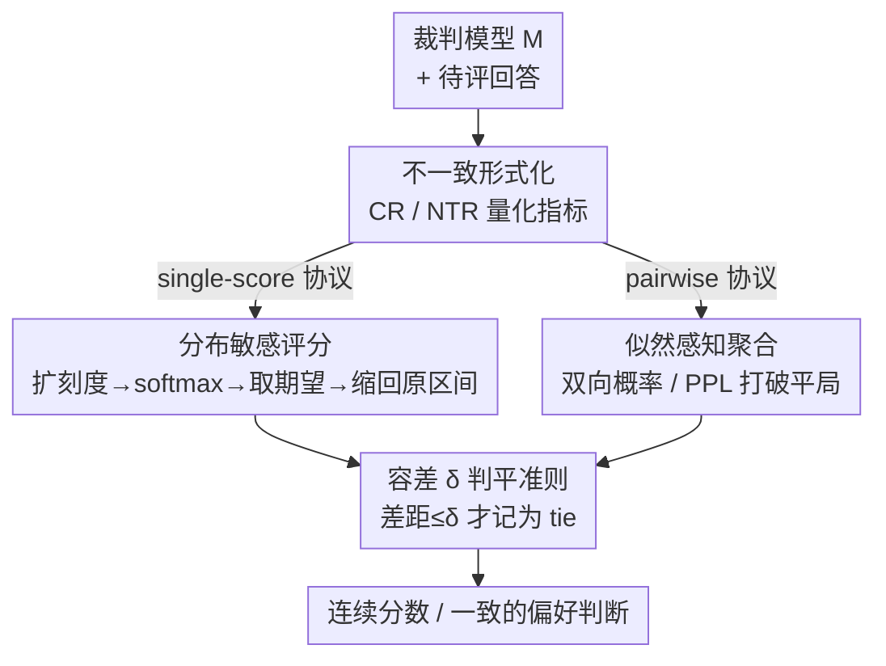

# TrustJudge: Inconsistencies of LLM-as-a-Judge and How to Alleviate Them

**会议**: ICLR 2026  
**OpenReview**: [https://openreview.net/forum?id=4uPyOCeN6U](https://openreview.net/forum?id=4uPyOCeN6U)  
**代码**: https://github.com/TrustJudge/TrustJudge  
**领域**: LLM 评测 / LLM-as-a-Judge  
**关键词**: LLM 评判, 评分不一致, 传递性, 概率化评分, 困惑度  

## 一句话总结
TrustJudge 系统性揭示了 LLM-as-a-judge 框架里两类被长期忽视的"自相矛盾"——打分和两两比较打架、两两比较成环——把根因归结为离散评分的信息损失和模糊平局，再用"分布敏感评分 + 似然感知聚合"两招无需训练地把不一致率大幅压低，同时保持甚至提升评测准确率。

## 研究背景与动机

**领域现状**：用大模型当裁判（LLM-as-a-judge）已经成了替代人工评测的主流做法，常见两种协议：一是 single-score（让裁判给单条回答打一个整数分，如 1–5 分，MT-Bench 风格），二是 pairwise comparison（让裁判直接比较两条回答 A、B，并交换顺序两遍以消除位置偏置）。这两套协议被大量自动评测、自我改进、互评流程依赖。

**现有痛点**：作者发现这两套协议本身就"不自洽"，而且是两种层面的不自洽。其一是 **Score-Comparison Inconsistency**：明明给 $R_x$ 打的分比 $R_y$ 低，但在两两比较里 $R_x$ 反而赢了（$R_x \succ R_y$ 却 $\text{score}(R_x) < \text{score}(R_y)$）。其二是 **Pairwise Transitivity Inconsistency**：两两比较出现非传递的环（$R_x \succ R_y \succ R_z \succ R_x$）或者平局矛盾（$R_x \equiv R_y \equiv R_z \neq R_x$），违背了理性偏好最基本的传递律。

**核心矛盾**：作者把根因落到两点。第一，**离散评分系统存在信息损失**——5 分制这种粗粒度刻度会把质量有差别的回答压成同一个分（比如两条质量不同的回答都拿 4 分），导致裁判输出的熵很低，分辨不出真实的质量差距。图 1 显示 5 分制的平均熵远低于 100 分制，正是信息被压扁的直接证据。第二，**两两比较里的平局判断很模糊**——大量传递性矛盾其实来自"判平"，裁判在拿不准时随手判 tie，平局一多就极易破坏传递律。

**本文目标**：在不引入额外训练、不需要人工标注的前提下，同时解决这两类不一致，并且不能牺牲评测准确率。

**切入角度**：既然问题出在"离散化丢信息"和"模糊平局"，那就不要让裁判输出一个被压扁的整数，而是把裁判 token 上的**概率分布**保留下来当信号——用分布算期望得到连续分数，用概率/困惑度去打破平局。

**核心 idea**：用"概率化的、保熵的"评判信号取代"离散的、丢信息的"整数评判——分布敏感评分解决打分与比较打架，似然感知聚合解决传递性成环。

## 方法详解

### 整体框架

TrustJudge 是一个**概率化评测框架**，它不改裁判模型、不训练，只改"怎么从裁判模型读出评判结果"。它先把两类不一致用形式化定义和量化指标钉死（Conflict Ratio 和 Non-Transitivity Ratio），然后对两套评测协议分别给出概率化的替代方案：single-score 协议走"分布敏感评分"，pairwise 协议走"似然感知聚合"，最后用一个统一的容差 $\delta$ 控制判平的松紧。整条链路的关键是：始终保留裁判模型在候选分数 / 候选结果上的概率分布，而不是只取一个 argmax 后的离散标签。

### 关键设计

**1. 把两类不一致形式化：给"自相矛盾"一把可量化的尺子**

要修问题，先得能测量问题。作者把两类不一致都写成可计算的指标。对于打分与比较的冲突，给定两条回答的整数分 $S_x, S_y$ 和两两比较结果 $C \in \{-1, 0, 1\}$（1 为 $R_x$ 胜、-1 为 $R_y$ 胜、0 为平），只要满足

$$(S_x > S_y \wedge C \le 0) \vee (S_x < S_y \wedge C \ge 0) \vee (S_x = S_y \wedge C \neq 0)$$

就判定这一对不一致，并用 **Conflict Ratio** $CR = \frac{1}{n}\sum_i \mathbb{I}[\text{pair } i \text{ inconsistent}]$ 度量整体冲突比例。对于传递性，作者在 $k \ge 3$ 的回答子集上定义两种违例：**环形不一致**（$C(R_x,R_y)=1 \wedge C(R_y,R_z)=1 \wedge C(R_z,R_x)\neq -1$，形成偏好环）和**等价不一致**（$C(R_x,R_y)=0 \wedge C(R_y,R_z)=0 \wedge C(R_x,R_z)\neq 0$，违背无差异的传递性），用 **Non-Transitivity Ratio** $NTR_k = V_k / \binom{n}{k}$ 度量，$V_k$ 是出现违例的 $k$ 元子集数。这套定义不是花架子——它让后面所有改进都有了统一、可复现的评判标准，也是论文"第一个系统性揭示该问题"这一贡献的落点。

**2. 分布敏感评分：用期望取代整数，把被压扁的熵找回来**

这一招针对的是"打分丢信息导致打分与比较打架"。做法是：先让裁判在比原刻度更细的尺度上打分（原本 5 分制就改成 100 分制），拿到裁判在扩展分数集 $\Theta' = \{s'_{min}, \dots, s'_{max}\}$ 上每个候选分的 logits，用 softmax 归一化成一个**合法的概率分布** $P(s'_j|R)$，再算期望并缩放回原区间：

$$S = \left(\sum_{j=s'_{min}}^{s'_{max}} s'_j \cdot \frac{\exp(P_o(s'_j|R))}{\sum_k \exp(P_o(s'_k|R))}\right) \times \frac{s_{max}-s_{min}}{s'_{max}-s'_{min}}$$

和 G-Eval 那种"直接对候选分数概率求和"的做法不同，G-Eval 因为非分数 token 也会分走概率，导致 $\sum_j P(s'_j|R) \neq 1$；而这里的 softmax 强制归一化，保证是一个良定义的分布。这样算出来的分是连续的，能区分原本会被压成同分的细微质量差异——理论上 Theorem 3.1 也证明了：存在两个条件熵不同的分布 $p_{R_1} \neq p_{R_2}$ 会被离散评分映射成同一个分，但分布敏感评分能把它们区分开。

**3. 似然感知聚合：用概率信号打破模糊平局，解开传递性的环**

这一招针对的是"模糊平局造成传递性成环"。作者提供两种从概率信号里"裁定胜负而非随手判平"的办法。Option A 是 **PPL-based**：对两条回答的两种拼接顺序（$R_x$ 接 $R_y$、$R_y$ 接 $R_x$）在裁判模型 $M$ 下分别算困惑度，谁的困惑度低就按谁的顺序定结果：

$$C(R_x, R_y) = \begin{cases} C_{order1}, & \text{if } PPL(M, R_x, R_y) < PPL(M, R_y, R_x) \\ C_{order2}, & \text{otherwise} \end{cases}$$

Option B 是**双向概率聚合**：对正反两种呈现顺序，把每种结果 $k \in \{1, -1, 0\}$ 的概率合并 $m[k] = p_{order1}[k] + p_{order2}[-k]$，取 $\arg\max_k m[k]$ 作为最终判断——这样既利用了概率的连续性来减少判平，又通过双向求和抵消位置偏置。Proposition 3.2 进一步说明：在模糊区域裁判输出熵接近最大 $\log|C|$，而基于困惑度构造的置信分布 $p_{conf}(k) \propto \exp(-\gamma \cdot PPL(J_k))$ 只要各 rationale 的困惑度不全相等就是非均匀的，其熵严格小于 $\log|C|$，即 PPL 信号比原始裁判输出更"确定"，决策更可靠。

**4. 容差 δ：一个旋钮统一控制判平松紧**

概率化评判几乎产出连续分数，两条回答完全相等的概率比离散打分低得多，于是判平需要一个可调的尺度。作者引入容差超参 $\delta \ge 0$：无论是绝对分差、PPL 差还是概率间隔，只要两条回答的差距 $\le \delta$ 就判平。$\delta$ 默认取 0，但论文做了完整的超参扫描，结论是推荐一个小的正 $\delta$——因为即便 $\delta=0$，框架本身也已经会产生相当数量的平局。这个旋钮让用户能在不重训模型的前提下调节最终排序的粒度。

### 损失函数 / 训练策略
本方法**完全无需训练、无需微调、无需额外人工标注**，所有改进都在推理阶段从裁判模型的 token 概率 / 困惑度里读取信号完成，因此可直接套用在任意现成裁判模型上。

## 实验关键数据

### 主实验

数据集由 MT-Bench 的 80 道题和 ArenaHard 的 500 道题组合而成，并从多个不同能力的 LLM 采样候选回答；single-comparison 协议下构造 10.8k 个实例，pairwise transitivity 协议下收集 $k=4$ 的 43.2k 条、$k=5$ 的 50.4k 条两两关系，所有金标分数与比较结果均经人工复核，且各评分等级分布被刻意平衡。裁判覆盖 Llama-3（3B/8B/70B）、GPT-3.5/4o、Qwen2.5（7B/14B/32B）、Gemma-2（2B/9B/27B）。

| 裁判模型 | 指标 | Baseline | G-Eval | TrustJudge |
|--------|------|------|----------|------|
| Llama-3.1-70B | CR (%) | 23.32 | 15.77 | **14.89** |
| Llama-3.1-70B | NTR$_{k=5}$ (%) | 15.22 | — | **4.40** |
| Llama-3.2-3B | CR (%) | 36.65 | 29.50 | **29.15** |
| Llama-3.2-3B | NTR$_{k=5}$ (%) | 54.69 | — | **17.76** |
| GPT-4o | CR (%) | 27.95 | 23.18 | **22.60** |
| GPT-4o | NTR$_{k=5}$ (%) | 24.33 | — | **6.01** |

以 Llama-3.1-70B 为裁判时，CR 从 23.32% 降到 14.89%（绝对降 8.43%），$NTR_{k=5}$ 从 15.22% 降到 4.40%（绝对降 10.82%）。整体上 CR 相对 baseline 绝对改进 4.78%–8.43%、并稳定比 G-Eval 好约 1–2%；$NTR_{k=5}$ 绝对降 10.82%–36.93%，其中 Llama-3.2-3B 从 54.69% 暴降到 17.76% 提升最猛。与此同时准确率不降反升——pairwise 的 exact match 提升 1.19%–6.85%（小模型受益最大，3B 提升 6.85%），pairwise win rate 在 45.41%–65.11% 区间。

### 消融实验

| 配置 | L-3.1-70B | G-4o | 说明 |
|------|---------|------|------|
| 5-scale Baseline (CR) | 23.32 | 27.95 | 原始 5 分制，不一致最高 |
| + Softmax | 17.08 | 25.50 | 加 softmax 归一化 |
| + 100-scale | 17.94 | 24.01 | 再加 100 分细粒度 |
| Pairwise Baseline (NTR$_{k=4}$) | 7.23 | 11.70 | 两遍交换序判平 |
| + Likelihood | **1.94** | **2.83** | 双向概率聚合，最优 |
| + PPL-Based | 2.18 | 4.48 | 困惑度法，实现更简单 |

### 关键发现
- **似然感知聚合（双向概率）贡献最大**：它把 pairwise 不一致压到最低（70B 仅 1.94%、GPT-4o 仅 2.83%），是解决传递性问题的主力。
- **PPL-based 法略逊于双向概率，但工程上更省**：它直接在序列概率上操作，无需显式识别 win/tie/lose 的 token 位置，对 Llama-3.1-8B 仍带来 16.47% 的绝对改进。
- **细粒度 + softmax 对打分一致性都有效**：softmax 归一化单独就能降 0.32%–6.24%，再叠 100 分制最高再降约 5.19%；图 3 显示从 5→10→100 分 CR 单调下降，印证"信息损失"假说。
- **越小的裁判受益越大**：3B 模型本身不一致最严重，TrustJudge 给它的相对改进也最显著，说明该框架对弱裁判尤其有救。

## 亮点与洞察
- **把"评测框架自身的自洽性"立为一个独立问题**：以往工作多关注裁判与人类是否一致，本文第一个系统揭示"打分 vs 比较打架""比较成环"这种框架内部矛盾，并给出 CR / NTR 两个可量化指标，问题定义本身就有价值。
- **"保熵"这个视角很巧**：把不一致归因于离散化的信息损失，再用期望/概率把熵保留下来——这把"评分"从取标签变成读分布，思路可迁移到任何需要从 LLM 读结构化判断的场景（如置信度估计、排序）。
- **零训练即插即用**：所有改进只动推理读取方式，可直接套在 GPT-4o 这种闭源模型上（只要能拿到 logprob），落地成本极低。
- **PPL 打破平局**这个 trick 很实用：当裁判"拿不准"时，用更通顺（低困惑度）的拼接顺序来定胜负，等于借模型自身的语言流畅度当额外裁决信号。

## 局限与展望
- **依赖 token 级概率 / 困惑度**：分布敏感评分和 PPL 法都需要访问裁判模型的 logprob，对完全黑盒（不返回 logprob）的 API 难以直接套用。
- **细粒度评分的可靠性边界未深究**：把 5 分制扩到 100 分制虽降不一致，但裁判在 100 分尺度上的打分本身是否可信、是否引入新的噪声，文中主要靠期望聚合缓解，缺乏对"裁判能否稳定区分 100 个等级"的直接验证。
- **传递性测试只报 $k=4,5$**：$k=3$ 被指出三元组太少不足以区分模型，但更大 $k$ 的高阶环受 $\binom{n}{k}$ 计算量限制未充分展开，超大规模排序下的表现仍是开放问题。
- **容差 $\delta$ 需按场景调**：虽给了扫描结论推荐小正值，但最优 $\delta$ 随裁判家族和协议变化，实际部署仍需调参。

## 相关工作与启发
- **vs G-Eval**：G-Eval 也用概率化评分，但目标是提升与人类的一致性，且直接对候选分数概率求和、会因非分数 token 导致概率不归一（$\sum_j P \neq 1$）；本文目标是修复框架内部不一致，用 softmax 强制归一化，实验中每个设置都比 G-Eval 好约 1–2%。
- **vs 用复杂数学建模修传递性的工作（如 Xu et al. / Zhang et al.）**：那类方法常需持续训练去拟合偏好结构，可能损害模型泛化性，且解决不了打分与比较的冲突；TrustJudge 无需训练、一套框架统一解决两类不一致。
- **vs 标准 MT-Bench / two-pass 交换序基线**：基线靠"两遍交换、结果不同就判平"消位置偏置，反而制造大量模糊平局喂大传递性违例；本文用双向概率聚合在抵消位置偏置的同时主动裁定胜负，避免靠判平兜底。

## 评分
- 新颖性: ⭐⭐⭐⭐⭐ 第一个系统性揭示并形式化 LLM-as-judge 框架内部两类不一致，问题定义本身开创性强
- 实验充分度: ⭐⭐⭐⭐⭐ 覆盖 4 个模型家族、3B–70B、10.8k+50.4k 实例，主实验 + 消融 + 容差扫描齐全
- 写作质量: ⭐⭐⭐⭐ 定义与公式严谨，理论分析到位；但部分细节（如准确率指标选择理由）需读附录才清楚
- 价值: ⭐⭐⭐⭐⭐ 零训练即插即用、对弱裁判尤其有效，对自动评测/自我改进流程有直接实用价值

<!-- RELATED:START -->

## 相关论文

- [\[ICLR 2026\] Rethinking LLM-as-a-Judge: Representation-as-a-Judge with Small Language Models via Semantic Capacity Asymmetry](rethinking_llm-as-a-judge_representation-as-a-judge_with_small_language_models_v.md)
- [\[ICLR 2026\] BiasScope: Towards Automated Detection of Bias in LLM-as-a-Judge Evaluation](biasscope_towards_automated_detection_of_bias_in_llm-as-a-judge_evaluation.md)
- [\[ACL 2026\] How Hypocritical Is Your LLM Judge? Listener–Speaker Asymmetries in the Pragmatic Competence of Large Language Models](../../ACL2026/llm_evaluation/how_hypocritical_is_your_llm_judge_listener-speaker_asymmetries_in_the_pragmatic.md)
- [\[ICLR 2026\] Preference Leakage: A Contamination Problem in LLM-as-a-judge](preference_leakage_a_contamination_problem_in_llm-as-a-judge.md)
- [\[ICLR 2026\] Do LLM Agents Know How to Ground, Recover, and Assess? Evaluating Epistemic Competence in Information-Seeking Agents](do_llm_agents_know_how_to_ground_recover_and_assess_evaluating_epistemic_compete.md)

<!-- RELATED:END -->
