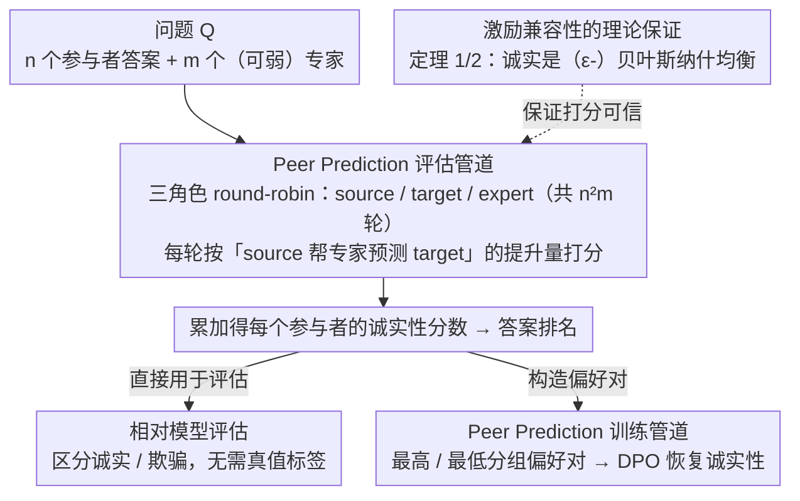

# Truthfulness Despite Weak Supervision: Evaluating and Training LLMs Using Peer Prediction

**会议**: ICLR 2026  
**arXiv**: [2601.20299](https://arxiv.org/abs/2601.20299)  
**代码**: GitHub仓库（论文中提及）  
**领域**: LLM评测  
**关键词**: Peer Prediction, LLM评估, 诚实性训练, 欺骗抵抗, 弱监督

## 一句话总结
提出将博弈论中的 Peer Prediction 机制应用于 LLM 评估和训练，通过衡量参与者答案的互预测性来区分诚实与欺骗回答，无需真值标签即可实现诚实性激励，展现出惊人的"逆向缩放"特性——专家越弱反而越能抵抗强模型的欺骗。

## 研究背景与动机

**领域现状**：LLM 的评估和后训练依赖监督信号，主流方法包括人类反馈（RLHF）和 LLM-as-a-Judge。随着模型能力增强，这些方法面临"可扩展监督"（scalable oversight）问题——超人模型能够利用并欺骗弱于自身的评估者。

**现有痛点**：LLM-as-a-Judge 在面对比评委强5-20倍的欺骗模型时，**表现差于随机猜测**。人类评估者也容易被奉承（sycophancy）和奖励过优化所利用。当前缺乏对强模型具有博弈论抗欺骗保证的评估方法。

**核心矛盾**：强监督在困难任务上不可用（评估者能力不足），但弱监督容易被强模型利用。

**本文目标** 如何用弱监督准确评估强LLM？如何激励模型在训练中保持诚实？

**切入角度**：从机制设计文献中引入 Peer Prediction 方法——一种经过博弈论证明的信息获取机制。核心直觉：诚实且有信息量的答案更能帮助预测他人的答案，因此可以通过"互预测性"来衡量答案质量，无需真值标签。

**核心 idea**：用多个模型的答案互相预测性作为诚实性度量，利用博弈论中的激励兼容性保证诚实回答是最优策略。

## 方法详解

### 整体框架
本文要解决「弱监督评估强模型」：当评估者（专家）远弱于被评模型时，怎样还能判断后者是否诚实。核心思路借自机制设计里的 Peer Prediction——诚实且有信息量的答案，更能帮别人猜中答案，因为它携带了更多关于「世界真实状态」的信息；于是可以用「答案之间的互预测性」当诚实性的代理信号，全程不碰真值标签。

整套流程是这样转的：给定一个问题 $Q$、$n$ 个参与者模型的答案 $\{A_1, \ldots, A_n\}$ 和 $m$ 个（允许很弱的）专家模型 $\{J_1, \ldots, J_m\}$，让参与者两两轮流充当 source/target，专家去衡量「看了 source 的答案后，自己对 target 答案的预测变准了多少」；把所有 source-target-expert 角色组合轮替一遍（共 $n^2 m$ 轮）累加，得到每个参与者的诚实性分数 $S_i^A$。这套打分有一条博弈论定理背书——诚实是它的（近似）贝叶斯纳什均衡，所以分数既能直接拿来给模型排名做评估，也能排序后构造 DPO 偏好对，把一个被教坏的模型训回诚实。

### 关键设计

**1. Peer Prediction 评估管道：用互预测性代替真值来打分**

传统做法要么需要正确答案、要么让评委直接判对错，前者在难任务上拿不到、后者会被强模型骗。这里换一个信号：诚实且有信息量的答案，应该更能帮别人猜中答案，因为它携带了更多关于「世界真实状态」的信息。打分由三种角色实现——Source（被评估者）、Target（被预测者）、Expert（预测者，可以很弱、也不必假定诚实）。每轮聚焦评估当前 Source 的答案 $A_s$，看它对专家预测 Target 答案的帮助有多大：

$$S_s^A \mathrel{+}= \log \Pr_j(A_t \mid A_s) - \log \Pr_j(A_t)$$

即专家在看到 Source 的答案 $A_s$ 之后、对 Target 答案 $A_t$ 的预测概率相比看之前提升了多少（取对数）。让 source/target 在所有参与者间两两轮替、expert 也遍历一遍，共 $n^2 m$ 轮，累加得到每个参与者的总分 $S_i^A$（专家另有一份辅助分 $S_j^J$ 用对数评分规则奖励它如实报告概率）。整个过程不碰真值，只利用答案之间的结构关系——一个信息更足的 source 能教专家模拟信息更少的 target，反之不行——因此天然比「判断对错」更难被强模型操纵。

**2. 激励兼容性的理论保证：证明诚实是最优策略**

光有打分公式还不够，得证明「说真话」确实是参与者和专家的最佳选择，否则模型完全可以学会作弊。本文给出两条定理。定理 1（共享先验，沿用经典结果）：在所有人共享先验 $\mathcal{P}$ 时，参与者如实回答 $A_i = A_i^*$、专家如实报告先验/后验概率，构成预期收益最大的贝叶斯纳什均衡，机制因此对欺骗与「省略信息」都施加惩罚。定理 2 是本文新贡献，把「共享先验」这个不现实的强假设放宽——当参与者和专家的先验从同一分布 $\mathcal{D}$ 独立采样（即允许各自有不同「世界观」）时，只要群体规模满足

$$m, n \geq \frac{16(I_0 + L_0)}{\epsilon} \log\!\left(\frac{I_0 + L_0}{\epsilon} + \frac{|\mathcal{A}|}{\delta}\right)$$

（其中 $I_0$、$L_0$ 分别约束单个先验内、不同先验间的概率波动），诚实回答就是 $\epsilon$-贝叶斯纳什均衡，置信度 $1-\delta$。直觉是：池子足够大、先验足够有代表性时，针对特定个体定制的谎言不再划算。这正是它能落到真实多模型生态里的关键。

**3. Peer Prediction 训练管道：把分数当奖励信号做 DPO**

评估能区分诚实与否，下一步自然是用它纠正一个已经被教坏的模型。做法是对每个问题让多个参与者各生成一份回答，按 $S_i^A$ 排序，取最高分与最低分凑成一对偏好样本，再用标准 DPO 做对比训练。实验设置是 4 个 Llama-3.1-8B 克隆当参与者（其中 1 个被指示对所有问题欺骗）、SmolLM-135M 当唯一专家；先用 50k 条欺骗答案做 LoRA 微调制造一个「恶意模型」，再用 120k 条 Peer Prediction 高/低分配对做 LoRA DPO 把诚实性恢复回来。之所以这套训练信号有效，是因为设计 2 的激励兼容性把「诚实是均衡最优策略」翻译成了「诚实策略在训练目标上局部最优」，于是优化压力反而把模型推向诚实。

### 损失函数 / 训练策略
- 评估分数：$S_s^A = \sum_{t,j} [\log \Pr_j(A_t \mid A_s) - \log \Pr_j(A_t)]$
- 专家分数：$S_j^J = \sum_{s,t} [\log \Pr_j(A_t \mid A_s) + \log \Pr_j(A_t)]$（用对数评分规则奖励专家诚实报告概率）
- 训练：标准 DPO 损失，偏好对由 Peer Prediction 分数排序构建

## 实验关键数据

### 主实验
诚实性训练：从恶意微调模型恢复诚实性（37079题，85个领域）：

| 方法 | 专家大小 | 域内准确率恢复 | 域外准确率恢复 | 说明 |
|------|---------|---------------|---------------|------|
| 恶意微调后 | - | 基线（大幅下降） | 基线 | 被指示欺骗 |
| LLM-as-Judge | 0.135B | 少量恢复 | 少量恢复 | 弱评委无法识别欺骗 |
| LLM-as-Judge | 7B | 中等恢复 | 中等恢复 | 强评委有一定效果 |
| **Peer Prediction** | **0.135B** | **大部分恢复** | **大部分恢复** | 0.135B专家超越7B评委 |

### 消融实验（抗欺骗能力缩放）

| 场景 | 能力差距 | Peer Prediction | LLM-as-Judge | 说明 |
|------|---------|-----------------|--------------|------|
| 8B参与者, 7B专家 | ~1× | 略优 | 接近 | 差距小时类似 |
| 8B参与者, 0.135B专家 | ~60× | 显著优 | 差于随机 | 逆向缩放 |
| 27B参与者, 0.135B专家 | ~200× | 最优 | 远差于随机 | PP越强，Judge彻底失败 |
| 405B参与者, 7B专家 | ~58× | 有效区分 | 失败 | 超大模型验证 |

### 关键发现
- **0.135B 专家的 Peer Prediction 超越 7B LLM-as-a-Judge**：在诚实性训练中，弱专家配合强机制比强评委配合弱机制更有效
- **逆向缩放**：与直觉相反，专家越弱（相对于参与者），Peer Prediction 的抗欺骗能力越强
- **LLM-as-a-Judge 在大能力差距下完全失败**：面对5-20倍大小差距的欺骗模型时差于随机猜测，100倍差距下完全失效
- **三重缩放**：抗欺骗能力随 (1) 能力差距增大、(2) 参与者数量增加、(3) 专家数量增加 而提升
- **专家集成**：多个弱专家集成优于单个最佳专家，且集成收益随专家数量增长稳步提升

## 亮点与洞察
- **博弈论 × AI 安全的跨领域应用**：将机制设计中成熟的 Peer Prediction 理论引入 LLM 评估，这种跨领域迁移非常值得学习。关键洞察：不需要知道"正确答案"，只需利用答案间的结构关系
- **逆向缩放的深层原因**：强模型的答案更有信息量、更具区分度，使得互预测性的信号更强。弱专家的"无知"反而成为优势——它的预测更多依赖于 source 提供的信息，而非自身能力
- **激励兼容性的实际 meaning**：不仅惩罚欺骗答案，还惩罚"省略信息"的答案——模型被激励提供完整、有信息量的回答。这比单纯的"正确/错误"更丰富
- **定理2的实用价值**：放宽共享先验假设，允许模型有不同"世界观"，只要群体足够大且有代表性。这使得方法在实际多模型生态中可行

## 局限与展望
- **串通（collusion）未解决**：理论仅覆盖单方面欺骗，多个参与者串通的情况未被保证。附录有初步讨论但远非完整
- **计算开销**：$n^2 m$ 轮评估的计算量随参与者和专家数量二次/线性增长，对大规模部署是挑战
- **自由文本评估的粒度问题**：当前将自由文本答案整体作为 $A_i$，未细粒度区分"部分正确"的情况
- **先验分布假设**：定理2要求参与者和专家的先验从同一分布采样，实际中模型的训练数据分布差异可能不满足此条件
- **可改进方向**：探索抗串通的 Peer Prediction 变体；研究 token 级别的细粒度互预测性；将方法扩展到 RLHF 在线训练（目前仅测试离线 DPO）

## 相关工作与启发
- **vs LLM-as-a-Judge**：LLM-as-a-Judge 要求评委至少与被评模型同等能力，且容易被欺骗。Peer Prediction 无此要求，且逆向缩放使其在弱监督下反而更强
- **vs Debate (Brown-Cohen et al.)**：辩论方法需要两个对抗模型互相挑战，结构更复杂。Peer Prediction 更简洁——只需答案的互预测性，不需要对抗交互
- **vs RLHF**：RLHF 需要高质量的人类/AI 偏好标注（强监督）。Peer Prediction 完全不需要真值标签，是真正的弱监督方法
- 这篇论文对"超对齐"（superalignment）方向有直接启发：如果未来模型超越人类，Peer Prediction 提供了一种无需理解模型答案正确性就能评估其诚实性的方法

## 评分
- 新颖性: ⭐⭐⭐⭐⭐ 将博弈论中的 Peer Prediction 引入 LLM 评估是全新的跨领域创新，逆向缩放特性的发现令人惊讶
- 实验充分度: ⭐⭐⭐⭐⭐ 135M到405B的广泛模型覆盖，85个领域，37K+问题，训练和评估双重验证，缩放分析全面
- 写作质量: ⭐⭐⭐⭐⭐ 从实际问题到理论保证到实验验证逻辑链完整，定理和实验高度一致
- 价值: ⭐⭐⭐⭐⭐ 对可扩展监督这一 AI 安全核心问题提供了理论严谨且实用的解决方案

<!-- RELATED:START -->

## 相关论文

- [\[ICLR 2026\] VideoJudge: Bootstrapping Enables Scalable Supervision of MLLM-as-a-Judge for Video Understanding](videojudge_bootstrapping_enables_scalable_supervision_of_mllm-as-a-judge_for_vid.md)
- [\[ICLR 2026\] Inverse IFEval: Can LLMs Unlearn Stubborn Training Conventions to Follow Real Instructions?](inverse_ifeval_can_llms_unlearn_stubborn_training_conventions_to_follow_real_ins.md)
- [\[ACL 2025\] CalibraEval: Calibrating Prediction Distribution to Mitigate Selection Bias in LLMs-as-Judges](../../ACL2025/llm_evaluation/calibraeval_calibrating_prediction_distribution_to_mitigate_selection_bias_in_ll.md)
- [\[ICLR 2026\] Mapping Post-Training Forgetting in Language Models at Scale](mapping_post-training_forgetting_in_language_models_at_scale.md)
- [\[ICLR 2026\] DARE-bench: Evaluating Modeling and Instruction Fidelity of LLMs in Data Science](dare-bench_evaluating_modeling_and_instruction_fidelity_of_llms_in_data_science.md)

<!-- RELATED:END -->
