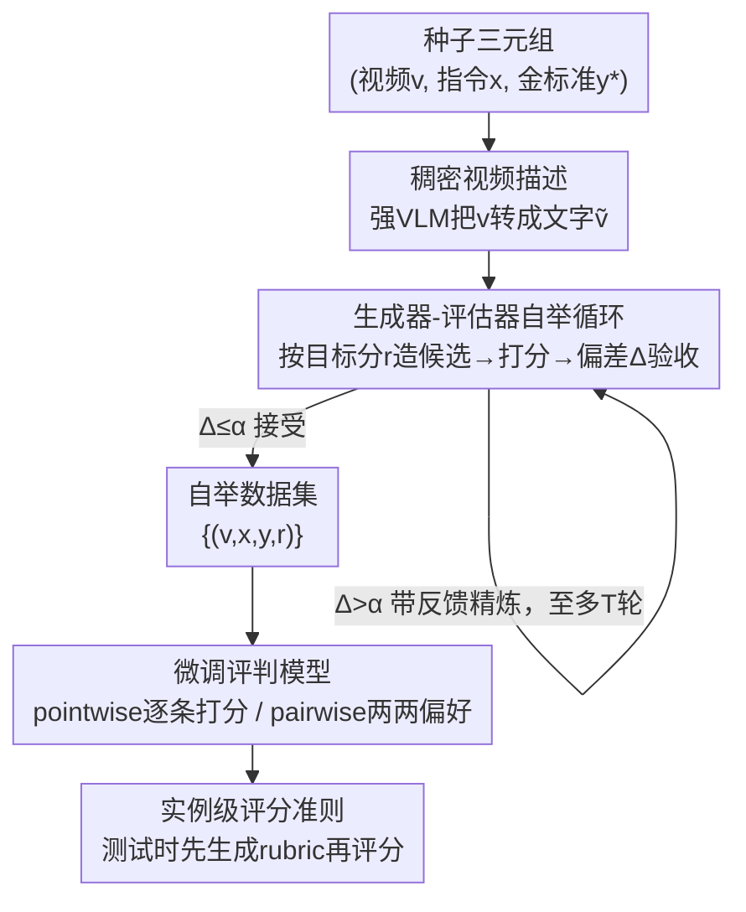

# VideoJudge: Bootstrapping Enables Scalable Supervision of MLLM-as-a-Judge for Video Understanding

**会议**: ICLR 2026  
**OpenReview**: [https://openreview.net/forum?id=31CznLfRIS](https://openreview.net/forum?id=31CznLfRIS)  
**代码**: 有（论文提供 Code / Models & Data 链接，具体 URL ⚠️ 以原文为准）  
**领域**: 多模态VLM / LLM评测  
**关键词**: MLLM-as-a-Judge, 视频理解评测, 自举数据合成, 生成器-评估器, 实例级评分准则

## 一句话总结
VideoJudge 用一个"生成器按目标分数造样本、评估器验收对齐分数"的自举循环，零人工标注地合成出 10 万条带分数监督的视频评测数据，训练出 3B/7B 的小型视频评判模型，在多数元评测基准上追平甚至超过 32B/72B 的通用 MLLM 评判者。

## 研究背景与动机

**领域现状**：视频理解模型（视频描述、视频问答、长视频理解）发展很快，但怎么"可靠、可解释、可规模化"地评测它们的输出却成了瓶颈。传统基于参考答案的指标（BLEU、ROUGE、BERTScore）只看表面词重叠，抓不住语义保真度和时序推理；人工评测是金标准但昂贵、慢、标注者之间一致性差。于是 LLM-as-a-Judge（用大模型当裁判）成为有希望的替代，已经在文本生成乃至图文任务（MLLM-as-a-Judge）上验证有效。

**现有痛点**：把 MLLM-as-a-Judge 搬到视频理解上几乎是空白，原因是视频的时序+多模态复杂度，外加两个更结构性的缺口。其一，**缺大规模评测资源**——没有带人类偏好信号的数据集，也没有标准化基准来验证模型判断是否对齐人类；现有工作要么依赖 GPT-4/4o 这类闭源模型（不透明、不可复现），要么用小开源 MLLM 做零样本（远达不到人类级可靠度）。其二，**缺有原则的评测准则**——现有 (M)LLM-as-a-Judge 要么用泛泛的通用 rubric（含糊、脆弱），要么靠人工撰写 rubric（无法跨任务扩展）。

**核心矛盾**：训练一个可靠的视频评判模型需要大量"带分数标注"的监督数据，而获取这种数据恰恰要么靠昂贵人工、要么靠不可复现的闭源模型——监督信号的"可规模化"和"可信/可复现"之间存在矛盾。

**本文目标**：在不依赖人工标注的前提下，既造出高质量的训练数据，又造出标准化的元评测基准，进而训练出小而强的视频评判模型。

**切入角度**：作者借鉴自我精炼（self-refinement）里"自一致性 + 自验证"的思路，让一个**生成器**和一个**评估器**相互制衡——生成器被要求"按指定分数"造出质量梯度的回答，评估器再独立打分验收，只保留二者对齐的样本。这样监督信号是被双向交叉验证过的，质量可控。

**核心 idea**：用"生成器按目标评分造样本 + 评估器验收对齐分数 + 不达标就反馈精炼"的自举循环，把少量种子三元组放大成大规模带分数监督数据，再用它微调小型视频评判模型。

## 方法详解

### 整体框架
VideoJudge 的全流程分两个阶段：**(1) 迭代自举**构造大规模、细粒度的带分数训练数据；**(2) 微调评判模型**，并在 pointwise（逐条打分）与 pairwise（两两偏好）两种设定下评测。自举阶段的核心是一个生成器 $G$ 和评估器 $E$ 协作的闭环：从种子语料里拿到三元组 $(v, x, y^*)$（视频、指令、金标准回答），先用强 VLM 把视频转成稠密文字描述 $\tilde v$ 作为语义上下文；生成器按目标评分 $r \in \{1,\dots,N-1\}$ 造出 $N-1$ 个质量递减的候选回答，金标准 $y^*$ 占据最高分 $N$（论文取 $N=5$）；评估器给每个候选打分 $\hat r$ 并给理由，偏差 $\Delta=|r-\hat r|\le\alpha$ 就直接收进数据集，否则把评估器反馈喂回生成器精炼，循环至多 $T$ 轮。最终得到的 $\{(v,x,y,r)\}$ 数据集既用来微调评判模型，同样的流程也被用来构造全新的 pointwise/pairwise 元评测基准。

### 关键设计

**1. 生成器-评估器自举循环：用相互制衡造出可控质量梯度的带分数监督**

这一步直接针对"缺大规模带分数训练数据、又不想靠人工或闭源模型"的痛点。给定种子三元组 $(x,\tilde v,y^*)$，生成器先做**初始生成**：被提示"按指定评分 $r$ 退化质量"，对每个目标分 $r\in\{1,\dots,N-1\}$ 各造一个候选 $y^{(r)}_0 = G(p_{\text{gen}}\,\|\,\tilde v\,\|\,x\,\|\,y^*,\,r)$，金标准 $y^*$ 直接当作最高分 $N$ 的回答。接着是**反馈**：评估器独立给候选打分并给理由，$\hat r, f^{(r)}_t = E(p_{\text{eval}}\,\|\,\tilde v\,\|\,x\,\|\,y^*\,\|\,y^{(r)}_t)$，并计算意图分与实判分的偏差 $\Delta^{(r)}_t = |r-\hat r|$。最后是**精炼**：偏差超阈 $\Delta^{(r)}_t>\alpha$ 的候选，把评估器反馈 $f^{(r)}_t$ 一并喂回生成器重写，$y^{(r)}_{t+1} = G(p_{\text{ref}}\,\|\,\tilde v\,\|\,x\,\|\,y^*\,\|\,y^{(r)}_t\,\|\,f^{(r)}_t,\,r)$，循环到满足验收或达上限 $T$ 轮。

验收准则很直接：$|r-\hat r|\le\alpha$ 才进数据集，于是最终数据里每条样本的分数都是被生成器意图和评估器判断**双向对齐**过的。这种设计的巧妙在于：分数不是事后硬贴的标签，而是"先按这个分造、再被独立验收过这个分"，监督信号天然自洽。作者用自动指标验证了梯度的真实性——随着目标分从 5 降到 1，候选相对金标准的 BERTScore 从 91.1（5–4）单调降到 86.9（5–1），BLEU 从 11.0 降到 3.0，确认生成器确实在可控地制造质量阶梯。

**2. 稠密视频描述作为语义上下文：让自举又快又稳**

视频自举循环里要反复让生成器、评估器"看"视频，如果每轮都对原始视频做推理，成本会爆炸。作者的做法是先用强 VLM 把视频 $v$ 转成稠密文字描述 $\tilde v$，在整个自举过程中用 $\tilde v$ 当语义上下文喂给生成器和评估器，而不是反复读原始帧。这样既给了二者更丰富的 grounding，又大幅减少了对原始视频的重复推理，让流水线更省算力。值得注意的是，这个描述代理也是后面"单模态语言模型也能当视频裁判"的基础——把 Qwen3 这类纯文本模型接上 $\tilde v$，它们就能在短上下文基准上拿到不错的相关性，但论文也强调：生成这些高质量描述本身要靠 Qwen2.5-VL-72B 或 GPT-4o-mini 这类强模型，算这笔账时这部分开销不能忽略。

**3. Pointwise/Pairwise 双设定评判训练 + 同流程造元评测基准：一套机制兼顾监督与评测**

拿到自举数据集 $D=\{(v_i,x_i,y_i,t_i)\}$ 后，评判模型以标准的负对数似然端到端自回归地生成目标序列 $t_i$：
$$\mathcal L(\theta) = -\frac{1}{M}\sum_{i=1}^{M}\sum_{j=1}^{|t_i|}\log P_\theta\big(t_{i,j}\mid t_{i,<j}, v_i, x_i, y_i\big)$$
该损失同时用于两种设定。**Pointwise** 下模型先在 `<thinking></thinking>` 里写推理，再在 `<score></score>` 里输出 1–5 的标量分（可选地先在 `<rubric></rubric>` 里生成任务专属准则）；**Pairwise** 下模型读两个候选，在 `<answer></answer>` 里选出更优的一个（训练/评测时随机打乱顺序以避免位置偏置）。关键是，构造训练数据的那套自举流程也被复用来**生成元评测基准**：从训练分布之外的数据集（LLaVA-Video、VideoChatGPT）取种子指令，跑同样的 Algorithm 1（阈值设 0）造出 VideoJudge-LLaVA / VideoJudge-VCG 两个 pointwise 基准；pairwise 侧则把不同评分的回答配对、高分者为偏好，得到 VideoJudge-Pairwise，并专挑生成器-评估器最易分歧的 2-vs-3 难例做人工标注得到 VideoJudge-Pairwise-H。一套机制同时产出训练监督和标准化评测套件，是这篇"框架而非单点模型"定位的核心。

**4. 测试时生成实例级评分准则：用 rubric 把小模型抬到大模型水平**

针对"通用 rubric 太空泛、人工 rubric 难扩展"的痛点，作者训练评判模型在推理时**先为当前样本生成专属 rubric，再依 rubric 推理、最后给整数分**。训练时先合成训练用 rubric，再让模型学会 (i) 给每个实例造 rubric、(ii) 带着 rubric 推理、(iii) 输出分数。这样评测就锚定在"针对这条样本的、明确的"评判标准上，既可解释又细粒度。效果很显著：仅用 10% pointwise 数据训练出的 VideoJudgeR-3B，MAE 从基线 1.15 降到 0.59、RMSE 从 1.56 降到 1.05，相关性升到 73 以上，逼平 32B/72B 基座；而且它产出的 rubric 在人评和 LLM-as-Judge 双重评判下都更受偏好（对 GPT-4o-mini 的 LLM-as-Judge 胜率 92.7%，对 Qwen-72B 71.3%）。这说明 rubric 监督能在不放大模型规模的前提下补上大部分性能差距。

### 损失函数 / 训练策略
评判模型在 BF16 下做全量微调，最大序列长度 128K，fps=1、训练最多 60 帧 / 评测最多 180 帧；训练 2 个 epoch、batch size 16，学习率 $2\times10^{-7}$ 余弦衰减、warmup 比例 0.03、weight decay 0、梯度裁剪 1。从 25K 种子视频指令-回答对出发，自举后只保留"每条指令至少凑齐 5 个评分回答"的样本，得到 103,825 条 pointwise 样本（20,765 个唯一视频-指令对）；pairwise 侧随机采样 50% 可能配对，同样得到 103,825 条。骨干用 Qwen2.5-VL 的 3B 和 7B。

## 实验关键数据

### 主实验（Pointwise，Table 1）
指标含义：RMSE/MAE 越低越好，S/P 为 Spearman/Pearson 相关性越高越好，ECE 校准误差越低越好，PSup/∆(C-D) 为长视频偏好分越高越好。

| 模型 | VJ-LLaVA S↑ | VJ-VCG S↑ | VATEX RMSE↓ | LongVidB ∆(C-D)↑ |
|------|------|------|------|------|
| Qwen2.5-VL-3B | 0.63 | 0.51 | 2.27 | 0.20 |
| Qwen2.5-VL-7B | 0.77 | 0.65 | 2.36 | 0.35 |
| Qwen2.5-VL-32B | 0.80 | 0.69 | 1.43 | 1.08 |
| Qwen2.5-VL-72B | 0.80 | 0.76 | 1.40 | 1.06 |
| **VideoJudge-3B** | **0.82** | 0.59 | **1.33** | 0.70 |
| **VideoJudge-7B** | 0.78 | **0.74** | 1.46 | **1.16** |

VideoJudge-7B 在 VJ-LLaVA、VJ-VCG、LongVideoBench 上追平或超过约 10× 大的 32B/72B 基座，尤其在 LongVideoBench 的 ∆(C-D) 上拿到最高的 1.16，说明反馈监督对长视频时序一致评判帮助最大。

### 消融与分析（Pairwise，Table 3；准确率↑）

| 模型 | VAA (w/ FB) | VJ (w/ FB) | VJ-H (w/ FB) |
|------|------|------|------|
| Qwen2.5-VL-3B | 54.90 | 82.60 | 85.23 |
| Qwen2.5-VL-32B | 80.78 | 91.20 | 92.83 |
| Qwen2.5-VL-72B | 89.80 | 94.00 | 94.51 |
| **VideoJudge-3B** | 71.76 | 94.00 | 89.45 |
| **VideoJudge-7B** | 85.49 | **98.60**(w/o FB) | 93.67 |

反馈（feedback）一栏的对比就是核心消融：对 3B/7B 基线，带反馈一致优于不带反馈（如 Qwen2.5-VL-3B 在 VJ 上 82.60 vs 75.00）；但对已经很强的大模型，反馈增益变小甚至混合。rubric 消融见 Table 2：VideoJudgeR-3B 把 3B 基座的 MAE 从 1.15 砍到 0.59。

### 关键发现
- **看视频比长推理更重要**：单模态 LLM 裁判（Qwen3）整体弱于多模态裁判（Qwen2.5-VL），且开启长链思维（thinking mode）并不能稳定提升评判能力——给模型真正的视频输入才是关键。
- **rubric 监督是性价比之王**：仅 10% 数据训练的 VideoJudgeR-3B 就能逼平 32B/72B，说明实例级 rubric 能在不放大规模下补上大部分差距。
- **帧数有甜区**：训练时帧数加到约 240 帧相关性持续涨（超过 0.7）后饱和；评测时约 120 帧即可捕获多数证据，再加收益递减——可用 maxframes 平衡精度与成本。
- **难例集中在 2-vs-3**：生成器-评估器分歧最频繁出现在评分 2 和 3 附近，人工评测也据此聚焦于 2-vs-3 难例（标注者一致率 94.8%，Cohen's κ 89.5）。

## 亮点与洞察
- **"按分造样本 + 验收对齐分数"把标注问题转成生成+验证问题**：监督信号不是事后贴标签，而是"先按这个分造、再被独立打这个分"，天然自洽，可零人工规模化扩张。这套思路可迁到任何"难标分数"的开放式生成评测任务。
- **同一自举流程兼造训练集和评测集**：避免了"训练用什么标准、评测就偏向什么标准"的循环论证（评测种子刻意取自训练分布之外），让"框架"而非"单个模型"成为真正贡献。
- **稠密视频描述当语义代理**：既给自举循环省算力，又顺手让纯文本模型也能下场当视频裁判，是个可复用的工程 trick——但要记得描述本身的生成成本。
- **测试时生成实例级 rubric**：把"评判标准"从模型外部的固定规则变成模型内部按样本即时产出的中间产物，既提可解释性又显著抬小模型性能，是很有迁移价值的设计。

## 局限与展望
- **依赖强模型造描述与初始监督**：稠密描述、初始评估都要 Qwen2.5-VL-72B / GPT-4o-mini 这类强模型，整体"零人工"省下的是标注成本，但前置的强模型推理开销不可忽略，作者自己也强调要计入总成本。
- **评分尺度与设定较窄**：pointwise 固定在 1–5 的 5 档、$N=5$；自举数据按"凑齐 5 个评分"过滤，可能对某些指令丢弃过多样本。pairwise 因算力只采样了 50% 配对。
- **难例区间偏置**：生成器-评估器在 2-vs-3 处分歧最大，说明中间档质量区分本身最不稳定，模型在这些模糊区的可靠度仍是软肋（人工也只有 92% 出头的正确率）。
- **骨干单一**：实验主要基于 Qwen2.5-VL 系列，框架在其他视频骨干上的可迁移性还需验证。

## 相关工作与启发
- **vs 传统参考指标（BLEU/ROUGE/BERTScore）**：它们靠词重叠、需参考答案，抓不住语义保真和时序推理；VideoJudge 用学到的评判模型直接对齐人类判断，且对开放式多解任务更鲁棒。
- **vs 闭源 MLLM 裁判（GPT-4o 等）**：闭源不透明、不可复现；VideoJudge 用小开源模型 + 公开数据/基准达到相当甚至更好的可靠度，并开放了模型、数据、基准等全套 artifact。
- **vs 文本/图文 LLM-as-a-Judge（Prometheus、MLLM-as-a-Judge 等）**：前作多在文本或静态图像；本文是首个面向多样视频理解任务、用自举训练可扩展 MLLM 评判者的框架，补上了视频这一空白。

## 评分
- 新颖性: ⭐⭐⭐⭐ 首个面向视频理解、用生成器-评估器自举做可扩展 MLLM 裁判的框架，思路清晰且补了明确空白。
- 实验充分度: ⭐⭐⭐⭐ pointwise/pairwise 双设定 + 4 个基准 + 帧数/温度/rubric 多重分析 + 人评验证，较扎实。
- 写作质量: ⭐⭐⭐⭐ 公式与流程交代清楚，框架与设计对得上；个别符号（如 ∆/α）需对照原文。
- 价值: ⭐⭐⭐⭐ 开放全套模型/数据/基准，对视频评测社区可复现研究价值高。

<!-- RELATED:START -->

## 相关论文

- [\[ACL 2026\] MM-JudgeBias: A Benchmark for Evaluating Compositional Biases in MLLM-as-a-Judge](../../ACL2026/llm_evaluation/mm-judgebias_a_benchmark_for_evaluating_compositional_biases_in_mllm-as-a-judge.md)
- [\[AAAI 2026\] LLM-as-a-Judge for Scalable Test Coverage Evaluation](../../AAAI2026/llm_evaluation/llm-as-a-judge_for_scalable_test_coverage_evaluation_accuracy_operational_reliab.md)
- [\[ICLR 2026\] Truthfulness Despite Weak Supervision: Evaluating and Training LLMs Using Peer Prediction](truthfulness_despite_weak_supervision_evaluating_and_training_llms_using_peer_pr.md)
- [\[ICLR 2026\] An Open-Ended Benchmark and Formal Framework for Adjuvant Research with MLLM](an_open-ended_benchmark_and_formal_framework_for_adjuvant_research_with_mllm.md)
- [\[ICLR 2026\] PerSpectra: A Scalable and Configurable Pluralist Benchmark of Perspectives from Arguments](perspectra_a_scalable_and_configurable_pluralist_benchmark_of_perspectives_from_.md)

<!-- RELATED:END -->
