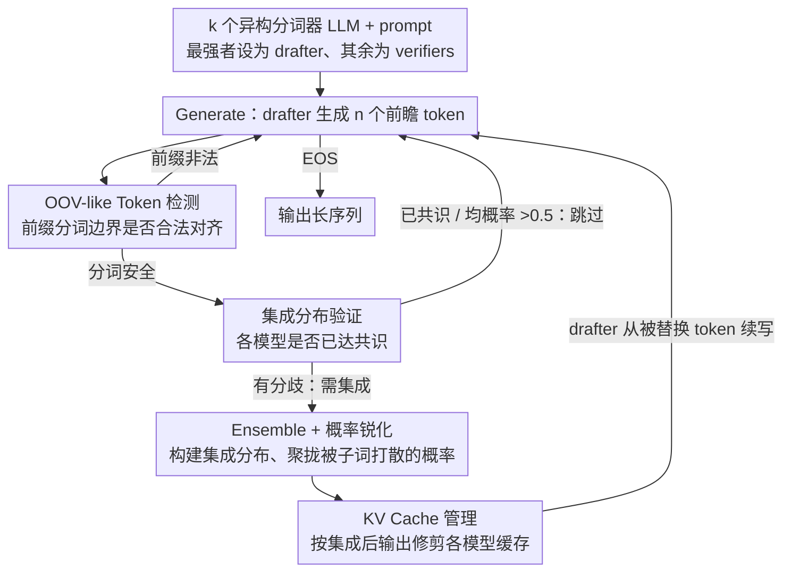

# When to Ensemble: Identifying Token-Level Points for Stable and Fast LLM Ensembling

**会议**: ICLR 2026  
**arXiv**: [2510.15346](https://arxiv.org/abs/2510.15346)  
**代码**: [https://github.com/yoon6503/SAFE](https://github.com/yoon6503/SAFE)  
**领域**: LLM评测  
**关键词**: LLM集成, 分词不匹配, OOV-like token, 投机式集成, 概率分布对齐

## 一句话总结
提出 SAFE（Stable And Fast LLM Ensembling），通过 Generate-Verify-Ensemble 循环在 token 级别选择性地集成多个异构分词器 LLM，解决长序列生成中分词不匹配导致的 OOV-like 污染问题，仅在不到 1% 的 token 上集成即可提升效果，MATH500 上将 UniTE 从 59.6% 提升到 77.4%。

## 研究背景与动机

**领域现状**：LLM 概率级集成（aggregating next-token probability distributions）是利用多模型互补优势的有效方法。现有方法如 UniTE、GaC 在短回答（多选题、直接答题）上表现良好，但在长序列生成（CoT 推理）中效果退化甚至崩溃。

**现有痛点**：**(1) OOV-like token 问题**——当集成选择的 token 不符合某个参与模型的分词方案时，该模型被迫在非法前缀上预测，导致概率分布损坏并产生错误 token（如 "Sofia" 被切为 "So"+"fia"，但另一模型将其作为整体，"So" 对该模型就是 OOV-like token，导致输出乱码 "Ã"）。这种错误在长序列中累积放大。**(2) 效率问题**——每个 token 都做集成需要跨词表对齐，开销随序列长度线性增长。

**核心矛盾**：UniTE 在所有 token 上集成，CoT 下准确率从 72.4% 暴跌到 59.6%（MATH500）甚至 43.4%（EXAONE+Qwen2.5）。集成反而不如单模型。

**本文目标** 在长序列生成中，**何时**集成（哪些 token 位置）才能既稳定又高效？

**切入角度**：识别两个决定集成位置的关键因素——(i) 分词边界是否对齐（避免 OOV-like 污染）和 (ii) 模型间概率分布是否有共识（跳过不必要的集成）。借鉴 speculative decoding 的思路，用 drafter-verifier 架构减少自回归前向传播次数。

**核心 idea**：不是每个 token 都需要集成，只在分词安全且模型不一致的 token 上集成，就能同时提升稳定性和效率。

## 方法详解

### 整体框架

SAFE 想回答的不是"如何集成"，而是"何时集成"：在一条长生成序列里，绝大多数 token 上各模型本就高度一致，强行逐 token 对齐既冒分词污染的风险又浪费算力。为此 SAFE 借用 speculative decoding 的 drafter-verifier 结构，把最强的那个模型设为 drafter（负责真正往下生成），其余模型设为 verifiers（只负责验证）。整个生成在一个三步循环里推进：**Generate** 阶段 drafter 一口气生成 n 个 token 的前瞻序列；**Verify** 阶段所有 verifier 在单次前向传播里同时检查这 n 个 token，逐个判断该位置是否值得集成（要同时过 OOV-like 检查和共识检查）；**Ensemble** 阶段只在被选中的少数 token 上真正构建集成分布、必要时做概率锐化，drafter 再从被替换的 token 处接着往下生成。因为前瞻加单次验证，verifier 的前向传播次数被大幅压下来，端到端延迟接近单模型。

### 关键设计

**1. OOV-like Token 检测：在出错之前就避开不安全的分词位置**

跨异构分词器集成最致命的隐患是：drafter 选出的某个 token，用 verifier 的分词器看可能正好"切断"了一个完整 token，逼着 verifier 在一个非法前缀上预测，概率分布随之损坏并吐出乱码（就是背景里 "Sofia" 被切成 "So"+"fia"、verifier 在 "So" 上输出 "Ã" 的情形）。SAFE 不在出错后补救，而是预防性地识别这种位置：对每个 verifier $LLM_v$，用它自己的分词器把 drafter 已生成的序列 $\mathbf{t}_{<i+n}$ 重新分词，若 drafter 的某个 token $t_j$ 的解码边界 $\text{Decode}(\mathbf{t}_{<j+1})$ 与 $LLM_v$ 的任何分词边界都对不齐，就把 $t_j$ 标记为 OOV-like，并直接**跳过** $t_{j+1}$ 位置的集成。这样集成只发生在所有 verifier 都能合法接续的位置上，从根上堵住了 OOV-like 污染在长序列中的累积放大。

**2. 集成分布验证：模型已经达成共识时就别再算一遍**

即便分词安全，逐 token 构建集成分布依然昂贵，而长序列里大量 token 各模型本来就一致，集成纯属冗余。SAFE 给出两个充分条件，满足任一即可跳过集成：其一是**一致共识**——所有 verifier 的 argmax token 都和 drafter 选的 token 相同；其二是**平均概率 > 0.5**——所有模型对该 token 的平均概率超过 0.5。论文进一步证明，这两个条件都能保证被跳过的 token 确实就是完整集成分布的最大概率 token，因此跳过不损失准确性，只是省掉了一次代价高昂的分布构建。

**3. 概率锐化策略：把被子词打散的概率质量重新聚拢**

异构分词会把同一个词的概率分散到多个子词 token 上，直接做算术平均会得到一个过于平滑的集成分布（max < 0.5），选不出明确的 token。SAFE 在这种平滑情形下做锐化，提供两条路线：一是**启发式后缀合并**，把同源变体子词的概率重分配回它们的共同前缀（如把 "Sofia" 和 "SofiaŢ" 的概率合并到 "So"），且只对概率 > λ 的 drafter token 触发；二是**用几何均值替代算术均值**，几何均值会强惩罚任何一个模型给出的低概率，从而把质量集中到所有模型一致支持的 token 上。实验里前缀合并更鲁棒、几何均值跨数据集不太稳定，因此前者是更稳妥的默认选项。

**4. KV Cache 管理：让集成替换后的缓存重新对齐**

集成会把 drafter 原本生成的 token 替换掉，导致各模型的 KV cache 与新输出不一致——正因为这件事难处理，之前的跨分词器集成方法干脆放弃了 KV cache、退回全量重算。SAFE 在每个集成步骤结束后统一更新所有模型的 KV cache，使其与集成后的实际输出对齐，是首个把跨异构分词器集成的 KV cache 管理完整实现出来的工作，这也是它延迟能贴近单模型的重要原因。

### 损失函数 / 训练策略

SAFE 是无训练的推理时方法，不涉及任何损失函数，是即插即用（plug-and-play）的框架，可直接套在 UniTE、GaC 等现有集成方法之上。

## 实验关键数据

### 主实验
三个异构分词器模型（Internlm3-8B + Qwen2.5-7B + EXAONE3.5-7.8B）的 CoT 集成：

| 方法 | MMLU-redux | MATH500 | GSM8K | BBH | ARC-C | Avg |
|------|-----------|---------|-------|-----|-------|-----|
| 最佳单模型 | 76.89 | 74.8 | 91.81 | 82.26 | 90.44 | 82.87 |
| UniTE (每token集成) | 73.39 | 59.6 | 75.06 | 79.58 | 87.97 | 75.12 |
| UniTE + SAFE (2模型) | **77.81** | **77.4** | **92.04** | **82.97** | 90.78 | **84.20** |
| UniTE + SAFE (3模型) | 77.60 | **79.0** | 92.04 | 82.77 | **91.55** | **84.59** |
| GaC | 77.00 | 74.2 | 91.28 | 82.34 | 90.61 | 83.09 |
| GaC + SAFE | 77.11 | 76.0 | 91.36 | 82.34 | 91.13 | 83.59 |

### 消融实验

| 组件 | MATH500 | 说明 |
|------|---------|------|
| UniTE (无SAFE) | 59.6 | 每token集成，OOV污染严重 |
| + OOV-like 检测 | ~74 | 仅添加OOV检查，大幅恢复 |
| + 共识跳过 | ~76 | 减少不必要集成，进一步提升 |
| + 概率锐化 | 77.4 | 完整SAFE |
| E/T比例 (MATH500) | 3.82% | 仅在<4%的token上集成 |
| E/T比例 (一般领域) | ~15% | 一般领域需要更多集成 |

### 关键发现
- **SAFE 将 UniTE 在 MATH500 上从 59.6% 拯救到 79.0%**（3模型），超越最佳单模型 4.2%
- **数学任务几乎不需要集成**：E/T 仅 4.85%，因为方程/结构化表达变化少，模型间一致性高
- **一般领域需要更多集成**：E/T 约 15%，语言变化度大导致模型分歧多
- **2模型集成通常优于3模型**：当知道模型排名时，选 top-2 更有效
- **延迟接近单模型**：SAFE 的推理速度几乎与单模型相当（得益于 speculative strategy + 选择性集成 + KV cache）
- **几何均值锐化在数据集间不稳定**，启发式前缀合并更鲁棒

## 亮点与洞察
- **问题定义精准**：OOV-like token 的概念抓住了跨分词器集成的核心难题。之前的方法完全忽视了这个问题，在短回答上偶然没暴露是因为短回答很少遇到分词不匹配
- **"何时集成"比"如何集成"更重要**：SAFE 的核心贡献不是提出新的集成算法，而是决定集成位置。仅在<1%的 token 上集成就能超越全 token 集成，这个发现改变了集成的思路
- **Speculative Decoding 思想的巧妙迁移**：将投机解码从"加速单模型"迁移到"加速多模型集成"，drafter-verifier 架构既减少前向传播次数又自然解决了异步生成问题
- **实用性强**：即插即用、无训练、支持异构分词器、有完整的 KV cache 实现，可直接部署

## 局限与展望
- **仅测试 7B-8B 规模模型**：附录有 32B 实验但主实验限于小模型，对 70B+ 的效果未知
- **Drafter 选择依赖先验排名**：需要预先知道哪个模型最强作为 drafter
- **固定前瞻长度 n**：n=5 可能不是所有场景最优，自适应调整可能更好
- **概率锐化策略较粗糙**：前缀合并启发式可能在某些语言（如中文）效果不同
- **可改进方向**：探索自适应 n 和自适应 drafter 选择；将 SAFE 扩展到更多模型（>3）的集成；研究在 RLHF/对齐场景下的应用（集成对齐过的和未对齐的模型）

## 相关工作与启发
- **vs UniTE**：UniTE 在每个 token 集成，CoT 下灾难性退化。SAFE 在<20%的 token 上集成即超越 UniTE 和单模型
- **vs GaC**：GaC 在主模型概率<0.5 时集成，偶然避免了部分 OOV 问题但无系统解决方案。SAFE 进一步提升 GaC 性能
- **vs Speculative Decoding**：投机解码要求 drafter 和 target 共享分词器。SAFE 首次将其扩展到异构分词器场景
- **vs 后推理集成（MoA等）**：通过聚合完整回答工作，避免 token 级问题但需要多次完整推理。SAFE 在 token 级工作但效率接近单模型

## 评分
- 新颖性: ⭐⭐⭐⭐ OOV-like token 的发现和系统解决方案是重要贡献，但整体思路（选择性集成+speculative decoding）不算全新
- 实验充分度: ⭐⭐⭐⭐⭐ 5个benchmark、多种模型组合（2/3模型）、效率分析、消融、32B扩展等非常全面
- 写作质量: ⭐⭐⭐⭐ 问题动机清晰（图1/2非常直观），算法描述规范，但部分符号稍显复杂
- 价值: ⭐⭐⭐⭐ 解决了 LLM 概率级集成在实际应用中的关键障碍，使跨异构分词器集成真正可用

<!-- RELATED:START -->

## 相关论文

- [\[ICLR 2026\] When LLMs Get Significantly Worse: A Statistical Approach to Detect Model Degradations](when_llms_get_significantly_worse_a_statistical_approach_to_detect_model_degrada.md)
- [\[ICLR 2026\] FinSearchComp: Towards a Realistic, Expert-Level Evaluation of Financial Search and Reasoning](finsearchcomp_towards_a_realistic_expert-level_evaluation_of_financial_search_an.md)
- [\[ICLR 2026\] Credit-Budgeted ICPC-Style Coding: When Agents Must Pay for Every Decision](credit-budgeted_icpc-style_coding_when_agents_must_pay_for_every_decision.md)
- [\[ACL 2026\] HoWToBench: Holistic Evaluation for LLM's Capability in Human-level Writing using Tree of Writing](../../ACL2026/llm_evaluation/howtobench_holistic_evaluation_for_llms_capability_in_human-level_writing_using_.md)
- [\[NeurIPS 2025\] HybridNorm: Towards Stable and Efficient Transformer Training via Hybrid Normalization](../../NeurIPS2025/llm_evaluation/hybridnorm_towards_stable_and_efficient_transformer_training_via_hybrid_normaliz.md)

<!-- RELATED:END -->
