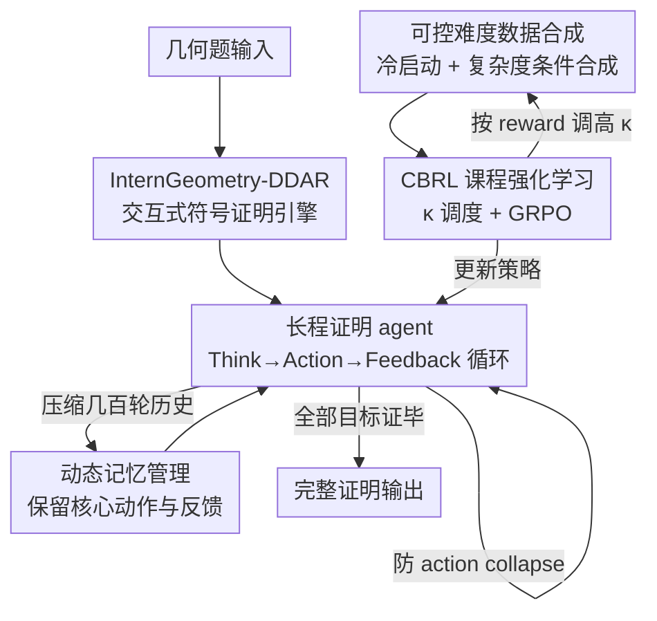

# Achieving Olympia-Level Geometry Large Language Model Agent via Complexity Boosting Reinforcement Learning

**会议**: ICLR2026  
**OpenReview**: [https://openreview.net/forum?id=1sffPGGQyT](https://openreview.net/forum?id=1sffPGGQyT)  
**代码**: 待确认  
**领域**: LLM推理 / 几何定理证明 / Agent / 课程强化学习  
**关键词**: 几何定理证明, LLM Agent, 辅助线构造, 长程交互, 复杂度提升课程 RL

## 一句话总结
本文提出 InternGeometry——首个达到奖牌选手水平的几何 LLM agent：它把符号引擎当工具，用「思考—构造/命题—验证—反思」的超长程交互（单题 200+ 步）攻克辅助线构造缺乏启发式的难题，再配合 Complexity-Boosting RL（CBRL）逐级提升合成题难度，仅用 13K 训练样本（AlphaGeometry 2 的 0.004%）就在 IMO 2000–2024 的 50 道几何题上解出 44 道，超过金牌选手平均分。

## 研究背景与动机
**领域现状**：LLM agent 在数学、编程上已能借助 LEAN 等形式化工具反复推理、反思工具反馈，达到 IMO 级别表现，被认为有更好的泛化性。但在**几何**这个子领域，主流仍是 AlphaGeometry 2、SeedGeometry 这类**专家模型**：它们靠数亿规模的合成数据训练一个专门预测辅助线的模型，再用它去引导符号引擎（DDAR）做大规模搜索。

**现有痛点**：几何题的解题链条极长，不仅要组合各种几何定理，更要做**创造性的辅助线构造**——而辅助线"该往哪加"几乎没有可靠启发式（weak heuristics），人类也得反复试错。专家模型范式为此付出了两个代价：一是**数据爆炸**（AlphaGeometry 2 用了 ~3 亿合成样本），二是**泛化差**（专家模型只学会预测构造，不会像通用推理那样举一反三）。

**核心矛盾**：辅助线构造的弱启发式 vs. 专家模型"一次性预测构造 + 海量搜索"的范式——后者用堆数据和堆搜索去硬扛弱启发式，效率和通用性都被牺牲。问题根本在于：弱启发式应该靠**探索性试错逐步积累洞察**来克服，而不是靠一个静态预测器一锤定音。

**本文目标**：(1) 让通用 LLM agent 而非专家模型来解 IMO 级几何题；(2) 用极少数据达到甚至超过专家模型；(3) 保留 agent 的泛化与创造力（能给出人类解法里没有的辅助线）。

**切入角度**：作者观察到人类专家正是通过"探索性试探"获得辅助线洞察的。如果让 agent 像人一样**长时间、多轮地**与符号引擎交互——不断提命题、加辅助点、看引擎反馈再调整——就能把"弱启发式"逐步转成"强启发式"（weak-to-strong heuristic transition）。

**核心 idea**：用「超长程 LLM–工具交互 + 动态记忆」替代「专家模型一次性预测」来攻克辅助线弱启发式，再用「复杂度逐级提升的课程 RL」高效把 agent 训练到奥赛难度。

## 方法详解

### 整体框架
InternGeometry 把几何证明建模成 agent 与一个**可交互符号引擎**的长程对话。给定一道几何题，agent 在每一步先用自然语言慢思考（Think），再输出一段 DSL 形式的动作（Action）——可以是构造几何对象、添加辅助线、或提出一个待证子命题；引擎执行后返回反馈（Feedback），告知动作是否成功、当前已知哪些性质。一个动态记忆模块把几百轮的交互历史压缩成紧凑摘要喂回 agent，使它能在 200+ 步内持续探索而不被上下文淹没。训练侧，CBRL 用一个**难度可控的数据合成管线**不断生成当前最"卡"难度的题，配合 GRPO 在线强化，逐轮把题目难度推高，最终让 agent 具备奥赛级能力。

### 关键设计

**1. InternGeometry-DDAR：把"一次性建图"的符号引擎改成可交互、可维护状态的证明环境**

AlphaGeometry 系的 DDAR（deductive database arithmetic reasoning）是"先逐点建好整张图，再一次性穷举所有可推出的定理"——这种一锤子模式不适合 agent 边探索边加辅助点。本文基于开源 DDAR 系统 Newclid 重建了 InternGeometry-DDAR，关键改动有两点：一是引入更强的点定义策略（如**全局优化点的放置**以满足约束），把表达能力覆盖到绝大多数 IMO 几何题；二是让引擎**跨步维护状态**——当前几何配置、已构造的辅助点、所有已证的前提与命题都被保存下来，agent 可以增量地在已有状态上继续操作，并提出"子证明目标"交给引擎验证。这把符号引擎从一个静态求解器变成了一个支持长程交互的"形式化沙盒"，是后面所有探索的基础设施。

**2. 长程证明 agent：用 Think–Action–Feedback 循环 + 拒绝采样把弱启发式逐步磨成强启发式**

这是全文的灵魂。agent $G$ 在第 $t$ 步的输出是 $[P_t, A_t] = G(X, W(H_{t-1}))$，其中 $P_t$ 是自然语言慢思考、$A_t$ 是形式化动作代码、$H_{t-1}$ 是历史、$W$ 是记忆压缩器。动作 $A_t$ 交给引擎执行得到 $O_t, E_t = E_{t-1}(A_t)$，并把 $[P_t, A_t, O_t]$ 追加进历史。这个循环可以跑 200+ 步——之所以要这么长，是因为辅助线没有可靠启发式，agent 必须像人一样**反复提命题、加构造、看引擎说哪条成立哪条不成立，再据此调整方向**，在试错中累积对这道题的几何性质认识，最终凑出可行解。

长程交互的一个副作用是 **action collapse**：模型容易陷入坏模式，反复输出高度重复或与前几轮雷同的动作。本文用一个简单直接的**拒绝采样**来防它：朴素采样得到 $[\hat P_t, \hat A_t]$ 后，先过一个基于规则的多条件检查 `PassCheck`——禁止与历史重复的动作、禁止无休止思考不停、禁止某一轮没有有效动作或格式有问题、禁止连续多轮用同一种动作类型；通过才采用，否则丢弃重采。这让 agent 在几百步里保持探索多样性，是长程能力能落地的关键护栏。

**3. 动态记忆管理 W：把几百轮历史压成紧凑摘要，既省上下文又引导多样探索**

如果把几百轮的完整思考和详细反馈都塞进上下文，agent 很快就会被淹没。$W$ 对早期交互做摘要：丢掉冗长的思考过程和详细环境反馈，**只保留核心动作输出和关键环境反馈**——例如某条辅助线是否成功添加、某个命题是否成立；最后一轮的反馈保持原样，让 agent 准确知道当前已知哪些命题。这样 agent 得到的是一份"我做过哪些动作、各自结果如何"的简洁全景，既压缩了上下文、提升长程容量，又因为看得到历史探索过的方向而能**引导未来的多样化探索**（避免重复已走过的死路）。记忆压缩在消融里极其关键——去掉它（上下文不压缩）IMO 50 从 44 掉到 20。

**4. CBRL：用复杂度调度自动把训练题维持在"中等难度"，让课程 RL 高效收敛**

直接在高难题上训会因奖励极稀疏而难收敛，只在简单题上训又泛化不到 IMO 难度。CBRL（Complexity-Boosting RL）的思路是**让算法自己动态控制合成题的难度**。冷启动阶段先用少量合成数据做 SFT（目标 $L_{st}$），让 agent 学会慢思考、主动调工具的基本范式；之后进入"交互—训练"迭代循环，按 GRPO 优化（式 5），奖励设计得**刻意简单且可由规则自动计算**：$r = r_o \wedge r_s$，结果奖励 $r_o$ 在证明完成时为 1，步骤有效性奖励 $r_s$ 对"提命题"步看命题是否被引擎证出、对"加辅助线"步看该构造是否最终被用进完整证明——即只奖励成功轨迹中的有效步，惩罚失败轨迹的所有步和成功轨迹中的无效步。

难度调度是 CBRL 的精髓。作者沿用 AlphaGeometry 的观察——IMO 几何题对人的难度正相关于 **DDAR 证明步数**，于是用证明步数 $\kappa$ 作为复杂度度量。每轮先按 $\kappa$ 采样数据训练 $\theta^* = \arg\max_\theta \mathbb{E}_{X\sim \mathcal{X}(\kappa)} J_{rl}(X,\theta)$，再更新难度 $\kappa^* = \arg\max_\kappa \mathbb{E}_{X\sim\mathcal{X}(\kappa)}\mathbb{E}_{y}|A(X,y)|$——即选能让**平均绝对优势最大**的难度。论文给出两个性质：该 $\kappa^*$ 近似最优地加速学习进度（定理 1）；对二元奖励，最大平均绝对优势是 0.5，恰对应"对当前模型不太难也不太易"的中等难度（定理 2）。实践中每轮按学习率 $\alpha$ 更新 $\kappa$，于是合成题随训练逐渐变难，构成从易到难的课程。

**5. 可控难度数据合成 pipeline：用 13K 自合成数据替代数亿专家数据**

CBRL 能成立，前提是有一个**难度可控**的题目工厂。pipeline 分两段：冷启动段，由于 DSL 形式数据稀缺，作者用专家迭代把 InternThinker-32B 微调成 InternGeometry-Formalizer，把大量自然语言几何题形式化，产出 7K 形式化"问题+解轨迹"对做冷启动；CBRL 段，针对冷启动数据"难题太少"的分布失衡，在 RL 过程中**动态合成**——往随机构造的图里按给定复杂度的统计先验加辅助线，再用 InternGeometry-DDAR 过滤出有效构造和目标组成新题，按证明步数控制难度，共合成 6K 题。两段合计约 13K，仅为 AlphaGeometry 2 的 0.004%。这套自动化合成是"无偏、无上限地调整课程难度（尤其在高复杂度端）"的关键，区别于 Voyager/WebRL 等依赖高度结构化任务模板的课程方法。

### 一个完整示例（IMO 2018 P6）
题目：凸四边形 $ABCD$ 满足 $AB\cdot CD = BC\cdot DA$，内点 $X$ 满足 $\angle XAB=\angle XCD$ 且 $\angle XBC=\angle XDA$，求证 $\angle BXA + \angle DXC = 180°$。大多数人类解法依赖反演、三角或复数。InternGeometry 却走了一条优雅的纯几何路线：先在 $AC$ 上取点 $T$ 使 $\angle BDA = \angle TDC$，再把点 $K$ 定义为两圆的交点——这两点恰构成 $ABCD$ 里的一对等角共轭点（说明 agent 通过探索发现了这一隐含结构）；接着它构造 $T$ 关于四边形各边的对称点，把"三角形里处理等角共轭"的辅助点用法推广到四边形。整条链路是 agent 在数百步交互里"提构造 → 引擎验证 → 反思 → 再提"试错出来的，最终给出了与人类解法本质不同的构造，体现了创造力。

## 实验关键数据

### 主实验
测试集为 IMO 50（IMO 2000–2024 全部几何题），骨干模型 InternThinker-32B，最大 200 步，Pass@256。

| 模型 | 类型 | 训练数据量 | IMO 50 Pass@K |
|------|------|-----------|---------------|
| AlphaGeometry 2 | 专家模型 | 300M | 42/50 |
| SeedGeometry | 专家模型 | 230M | 43/50 |
| **InternGeometry** | **LLM Agent** | **13K** | **44/50** |

InternGeometry 不仅解题数最多，数据量只有专家模型的 0.004%–0.006%，且测试时算力预算远低于 AlphaGeometry 2 的 beam 集成（其最优单 beam 配置为 beam size 128、分支 32、深度 4）。算上 IMO 2025 共 51 题，InternGeometry 解出 45 道，覆盖 AlphaGeometry 2 解出的全部题并额外解出 2018 P6、2023 P6；相比 SeedGeometry 额外解出 2001 P5、2009 P4b，但漏掉 2006 P1。剩余未解题多涉及超出纯几何证明范围的计算，落在 DDAR 表达能力之外。

### 消融实验

长程组件消融（表 3，Pass@256）：

| 配置 | IMO 50 | 说明 |
|------|--------|------|
| Full（命题+慢思考+压缩+拒绝采样） | 44/50 | 完整 |
| w/o 命题（只允许加辅助线） | 35/50 | 去掉提命题/长程证明步 |
| w/o 命题 + w/o 慢思考 | 23/50 | 再去掉慢思考 |
| w/o 上下文压缩 | 20/50 | 去掉动态记忆 |
| w/o 拒绝采样 | 38/50 | 去掉防 collapse |

CBRL 消融（表 4，Pass@256）：

| 训练设置 | IMO 50 | 说明 |
|----------|--------|------|
| With CBRL | 44/50 | 完整课程 RL |
| SFT Cold Start | 22/50 | 仅冷启动 |
| Easy Data Only | 29/50 | 只用低难度数据 |
| Challenging Data Only | 24/50 | 只用高难度数据 |
| Same Data without Schedule | 38/50 | 同样数据但去掉难度调度 |

### 关键发现
- **长程交互是命门**：去掉提命题/长程证明步（只让加辅助线）从 44 掉到 35，再去掉慢思考掉到 23，去掉上下文压缩掉到 20——证实"弱→强启发式转换"靠的就是长时间试错。
- **延长轨迹比重复采样更划算**：在相同总推理预算（采样数 K × 步数）下，把单条轨迹从 64 步放到 200 步带来的提升远快于多次重复采样，说明长程交互才是几何证明里高效积累启发式的方式。
- **难度必须"刚刚好"**：只用简单题（29）或只用难题（24）都不如 CBRL（44）；难题因奖励太稀疏、同样预算内学不动，简单题则泛化不到 IMO 难度。去掉难度调度（38）也明显掉点。训练到第 6 轮时 IMO 50 出现显著跃升。
- **创造力**：case study 显示 agent 能给出人类解法里没有的辅助线构造（如 2018 P6 的纯几何等角共轭构造）。

## 亮点与洞察
- **把"专家模型一次性预测辅助线"换成"agent 长程试错探索"**：这是范式级转变——不再靠静态预测器死扛弱启发式，而是用几百步交互逐步积累几何性质洞察，既省 99.996% 数据，又保留通用推理的泛化与创造力。
- **难度调度的理论锚点很漂亮**：用"平均绝对优势最大"作为难度选择目标，并证明二元奖励下最大值恰为 0.5（对应中等难度），把"课程该选多难"从经验调参变成可计算的优化目标，这个洞察可迁移到任何二元奖励的课程 RL。
- **极简规则奖励**：$r = r_o \wedge r_s$ 全程规则自动算，不需训练奖励模型——对"步骤有效性"的定义（辅助线必须被最终证明用上才算有效）很巧妙地把信用分配下沉到了步级。
- **动态记忆的双重作用**：压缩历史既省上下文，又因为暴露探索轨迹而引导未来不重复走死路——消融里它是单点贡献最大的组件（去掉从 44→20）。

## 局限与展望
- **受限于符号引擎的表达力**：未解出的题大多涉及超出纯几何证明的计算，落在 DDAR 表达范围之外；agent 能力被工具天花板锁住。
- **只验证了几何这一个领域**：CBRL + 长程 agent 范式能否迁移到代数、组合等同样"弱启发式 + 需创造性构造"的数学子领域，尚未验证。
- **测试预算仍不小**：虽远低于 AlphaGeometry 2，但 Pass@256 + 200 步意味着单题推理成本不低，实用部署还需进一步提效。
- **复杂度仅用证明步数刻画**：$\kappa$ 用 DDAR 步数近似难度，但步数多未必等于"对模型难"，更细粒度的难度度量可能让课程更平滑。

## 相关工作与启发
- **vs AlphaGeometry 2 / SeedGeometry**：它们是专家模型范式——训一个专门预测辅助线的模型（数亿数据）去引导符号引擎大规模搜索；本文是 LLM agent 范式——通用模型长程交互试错，13K 数据反超，且能产出人类没有的构造。核心区别是"静态预测 vs 动态探索"。
- **vs 数学 RL agent（OR/PR、基于 ITP 的证明器如 DeepSeek-Prover、Seed-Prover）**：它们多用 Python 解释器或 LEAN 等通用/形式化工具攻 miniF2F、ProofNet，几乎不碰几何；本文专门为几何造了交互式 DDAR 引擎，填补这一空白。
- **vs 课程 RL agent（Voyager、WebRL、EnvGen）**：这些方法依赖高度结构化的任务模板或人工设计课程；本文的数据合成能在指定难度上全自动、无偏、无上限地合成（尤其高复杂度端），课程调整更自由。

## 评分
- 新颖性: ⭐⭐⭐⭐⭐ 首个奖牌级几何 LLM agent，用 agent 长程交互范式替代专家模型，并给出难度调度的理论刻画。
- 实验充分度: ⭐⭐⭐⭐⭐ IMO 50 + 2025 全覆盖对比，长程与 CBRL 两套消融详尽，含逐题对照和 case study。
- 写作质量: ⭐⭐⭐⭐ 方法与动机讲得清晰，公式与图配合到位；部分附录细节（点放置优化、数据合成）压在 Appendix 略简。
- 价值: ⭐⭐⭐⭐⭐ 以 0.004% 数据反超 SOTA 专家模型，为"agent + 课程 RL"攻克弱启发式任务提供了可复用范式。

<!-- RELATED:START -->

## 相关论文

- [\[ACL 2025\] Enhancing the Rule Learning Ability of Large Language Model Agent through Induction, Deduction, and Abduction](../../ACL2025/llm_nlp/idea_enhancing_the_rule_learning_ability_of_large_language_model_agent_through_i.md)
- [\[AAAI 2026\] TransMamba: A Sequence-Level Hybrid Transformer-Mamba Language Model](../../AAAI2026/llm_nlp/transmamba_a_sequence-level_hybrid_transformer-mamba_language_model.md)
- [\[ACL 2026\] Generative Floor Plan Design with LLMs via Reinforcement Learning with Verifiable Rewards](../../ACL2026/llm_nlp/generative_floor_plan_design_with_llms_via_reinforcement_learning_with_verifiabl.md)
- [\[ACL 2025\] Achieving Certification-by-Design Through Model-Driven Development](../../ACL2025/llm_nlp/achieving_certification-by-design_through_model-driven_development.md)
- [\[ICML 2026\] T$^2$PO: Uncertainty-Guided Exploration Control for Stable Multi-Turn Agentic Reinforcement Learning](../../ICML2026/llm_nlp/t2po_uncertainty-guided_exploration_control_for_stable_multi-turn_agentic_reinfo.md)

<!-- RELATED:END -->
