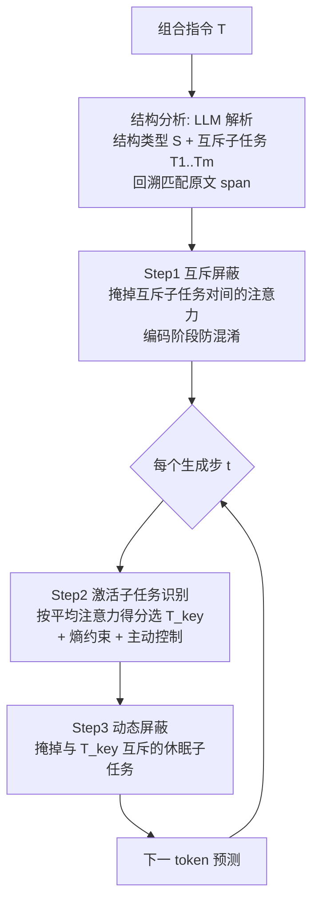

# Attend to the Active: Structure-Aware Dynamic Attention in LLMs for Compositional Instruction Following

**会议**: ICLR 2026  
**OpenReview**: [https://openreview.net/forum?id=wwA0X3UfAn](https://openreview.net/forum?id=wwA0X3UfAn)  
**代码**: 待确认  
**领域**: LLM / NLP（指令遵循、注意力引导）  
**关键词**: 组合指令遵循、注意力引导、结构感知、免训练、互斥子任务、推理时干预  

## 一句话总结
ATA 在一次前向传播内、不更新任何参数，先识别组合指令的结构类型（链式/分支/并行）并拆出互斥子任务，再在生成的每一步动态找出当前"激活"的子任务、用注意力偏置屏蔽掉其余"休眠"子任务，从而消除子任务之间的干扰、显著提升 LLM 对复杂组合指令的遵循忠实度。

## 研究背景与动机
**领域现状**：LLM 在单一指令上已经很能打，现实场景越来越多要求它处理"组合指令"——一条 prompt 里塞了多个子任务。但已有研究大多盯着"必须同时满足"的耦合约束（如语义+格式同时成立），对于子任务之间彼此**逻辑独立甚至互斥**的复杂结构探索很少。

**现有痛点**：作者把组合指令归纳成三种原型结构——**链式（Chaining，子任务顺序依次执行）**、**分支（Branching，按条件二选一）**、**并行（Paralleling，多个独立任务并排堆叠）**。这些结构有个共同特征：在生成的某一步，只有一个子任务应当"激活"主导输出，其余应当"休眠"。可现实是 LLM 习惯把注意力弥散到整个输入上下文，休眠子任务因为在上下文里和激活子任务结构纠缠，会"勾走"模型注意力，造成三类典型错误——**Wrong Generation（执行了不该执行的休眠分支）**、**Mixed Generation（把互斥子任务的信息混着输出）**、**Omitted Generation（漏掉了该做的激活子任务）**。

**核心矛盾**：已有解法要么靠**微调**（数据贵、资源重），要么靠**高层规划 / 迭代自反思**（多轮推理、依赖高质量中间步骤、开销大），而且本质上都没能在推理阶段真正压住模型对休眠子任务的注意力。问题的根子在注意力分配，绕开注意力去做外围补丁治标不治本。

**本文目标**：在不动参数、单次前向的前提下，直接在注意力层面"对症下药"——动态锁定激活子任务、抑制对休眠子任务的注意力。

**核心 idea（结构即安全护栏）**：先用 LLM 自身把指令的结构和互斥子任务解析出来，把这份结构信息当作**约束注意力干预范围的护栏**——只在互斥子任务的 token 跨度上做屏蔽，绝不碰其余上下文，从而既消干扰又不丢全局信息。这是该领域首次系统性归因 LLM 在组合指令上的退化原因，也是首次把"并行结构"纳入研究。

## 方法详解

### 整体框架
ATA（Attend To the Active）把"结构分析"和"注意力引导"串成一条免训练流水线：先用同一个 LLM 配合精心设计的 prompt 把指令解析成 `(结构类型 S, 互斥子任务列表 T₁…Tₘ)`，并把每个子任务**回溯匹配**到原文 token 跨度防止抽取漂移；随后在每一个生成步对原始注意力施加三段式改写——屏蔽互斥子任务间的相互注意（防混淆）、按注意力得分选出当前激活子任务、再屏蔽掉与激活子任务互斥的休眠子任务（防干扰）。整个过程只改注意力分数矩阵，不更新权重，且只作用在少数最相关的注意力头上。

### 关键设计

**1. 结构分析与子任务回溯匹配：把"乱缠的指令"先拆成干净的互斥单元。** LLM 端到端执行复杂结构会翻车，但解读和拆分子任务却很在行。ATA 设计了一个让 LLM 同时输出**结构标签**（Chain/Branch/Parallel）和**逐条子任务**的 JSON prompt，即 $S, T_1, \dots, T_m = \mathrm{LLM}(T\mid P)$。为防止 token 级抽取错误传播，它强制把每条抽出来的子任务**匹配回原文对应的 span**——这一步是后续所有注意力屏蔽的坐标基准。作者特意论证了这个设计的鲁棒性：因为干预只发生在子任务 span 内，即便结构识别有小遗漏，最坏也只是"少屏蔽了一点"，是非破坏性的，不会误伤全局上下文。

**2. 互斥屏蔽（Step 1）：在编码阶段就让互斥子任务"互相看不见"。** 顺序子任务不该提前看到后续、不同分支的子任务相互参照会引入歧义、并行任务彼此引用会妨碍各自理解——这些都是"混淆式理解"的源头。ATA 借鉴 LLM 因果注意力用 $-\infty$ 屏蔽后续 token 的思路，对互斥子任务对的 token 集合加一个负偏置矩阵 $M$：

$$H^{(l,h)} = \mathrm{Softmax}\big(A^{(l,h)} + M^{(l,h)}\big)V, \quad M^{(l,h)}(T_i, T_j) = \begin{cases} -\alpha, & T_i \perp T_j \\ 0, & \text{otherwise} \end{cases}$$

经过 Softmax 后互斥子任务对之间的注意力被压缩 $\exp(\alpha)$ 倍，从而让各子任务的表示保持解耦、语义独立。$\alpha$ 控制屏蔽强度（0 到完全屏蔽），全实验固定 $\alpha = \log 100$。

**3. 激活子任务识别（Step 2）：用注意力得分 + 熵置信度动态锁定"当前主角"。** 在生成步 $t$，ATA 给每个子任务打分——统计它的 token 被后续 query 吸引到的平均注意力：

$$\mathrm{score}(T_i, t) = \frac{1}{|T_i|} \sum_{k \in T_i} \frac{1}{t-k} \sum_{k \le q \le t} A^{(l,h)}(q, k)$$

得分最高者即激活子任务 $T_{\text{key}}$。由于 Step 1 已经把互斥子任务隔开，这个得分不受其他子任务串扰。为防止误切换，ATA 再加一道**熵约束**——只有当各子任务归一化得分的熵 $H(\cdot) < \epsilon = \gamma\log(m)$（$\gamma=0.5$，随子任务数 $m$ 自适应）时才接受切换，熵越低表示越自信；超阈值就保持上一步的屏蔽状态，避免被偶发的注意力抖动带偏。在此之上还有一层**主动控制**：链式/并行只允许 $T_1\to T_2\to\cdots$ 顺序推进、拒绝跳跃或回访，分支一旦选定就全程锁定同一激活子任务，从结构层面堵住非法切换。

**4. 动态注意力屏蔽 + 头选择（Step 3）：每步只让模型盯着激活子任务。** 锁定 $T_{\text{key}}$ 后，所有与之互斥的子任务被判为休眠，ATA 对它们的注意力列施加同样的负偏置：

$$M^{(l,h)}(:, T_j) = \begin{cases} -\alpha, & T_j \perp T_{\text{key}} \\ 0, & \text{otherwise} \end{cases}$$

休眠子任务的注意力被压低 $\exp(\alpha)$ 倍，激活子任务的注意力被相对抬升，从而把模型的"目光"精准锁在当前该做的事上。值得注意的是，这套改写**只在一小撮对激活子任务特别敏感的注意力头上施加**（分支基准选 50 个头、链式与并行选 20 个头）——因为注意力头的关注模式高度异质，若对所有头一刀切容易破坏全局理解甚至模型崩溃。整套机制额外开销小于 7%，且只动注意力分数、不改任何参数。

## 实验关键数据

**基准**：链式（325 条，子任务长 2–3，取自 Complexbench）、分支（435 条，单层到嵌套多层条件，取自 Complexbench）、并行（450 条，由 gsm8k 独立任务拼接而成）。模型：LLaMA3-8B-Instruct、Mistral-7B-Instruct。

### 主实验表格（遵循度 %，Avg.）

| 方法 | Chain | Branch | Parallel | All Avg. |
|---|---|---|---|---|
| **Llama-3-8B-Instruct** | | | | |
| Direct I/O | 59.21 | 54.63 | 59.80 | 57.88 |
| CoT Prompting | 57.69 | 55.02 | 64.97 | 59.23 |
| Decomposition | 54.63 | 50.04 | 62.58 | 55.75 |
| Think-Execute | 60.85 | 52.92 | 63.14 | 58.97 |
| Self-correction | 61.74 | 55.24 | 61.25 | 59.41 |
| **ATA** | **62.98** | **58.74** | **69.91** | **63.88** |
| **Mistral-7B-Instruct** | | | | |
| Direct I/O | 56.31 | 48.83 | 34.89 | 46.67 |
| Self-correction | 56.94 | 47.65 | 35.22 | 46.60 |
| **ATA** | **58.37** | **52.16** | **41.34** | **50.62** |

并行结构上 ATA 给 Llama3-8B 带来 +10.11% 的提升（59.80→69.91），且 Direct/CoT/Decomposition 等基线在该结构上几乎无效甚至倒退；那些显式引入迭代反馈的方法（Self-correction、Think-Execute）也全面落后——作者认为它们依赖高质量反馈、且仍把注意力摊给所有互斥子任务，反而引入干扰。

### 消融实验表格

| 变体 | Chain | Branch | Parallel |
|---|---|---|---|
| Direct（无干预） | 59.21 | 54.63 | 57.88 |
| **ATA（完整）** | **62.98** | **58.74** | **69.91** |
| w/o Structure Info | 60.45 | 55.28 | 60.35 |
| w/o Mutual Mask | 61.82 | 57.03 | 67.42 |
| w/o Dynamic Mask | 60.74 | 56.65 | 64.31 |
| w/o Active Control | 61.14 | 57.23 | 66.82 |

注意力引导策略对比（Parallel）：Direct 57.88 / SampleAttention 57.71 / PASTA 60.43 / **ATA 69.91**；而 ATA 的"误导引导（Misguided St.）"与"随机引导（Random St.）"变体会掉到 54.12 / 56.81，反证引导**方向正确**才是关键。

### 关键发现
- **结构信息是命门**：去掉结构信息后并行从 69.91 暴跌到 60.35，因为失去 span 约束后会误屏蔽全局上下文或覆盖到混合/不完整的子任务。
- **两个屏蔽模块各司其职**：互斥屏蔽主要消除 Mixed/Wrong 两类错误（编码阶段防混淆），动态屏蔽主要保证激活子任务的忠实执行；图 4(a) 显示完整 ATA 在三类生成错误上的下降幅度均最大。
- **对结构识别质量鲁棒**：即便只给部分（part）结构信息，性能仍明显高于 Direct，印证"非破坏性屏蔽"的设计承诺。
- **头数有甜区**：选 20–50 个敏感头效果最好，用全部头反而退化（全局信息被过度衰减）。
- **开销可忽略**：注意力改写带来的运行时开销 < 7%，且零参数更新。

## 亮点与洞察
- **把组合指令遵循的失败精准归因到"注意力被休眠子任务勾走"**，并对症在注意力层面做最小干预，思路干净、解释性强。
- **"结构信息当护栏"是点睛之笔**：先解析结构再把干预严格限制在互斥子任务 span 内，巧妙化解了"注意力屏蔽容易误伤全局上下文"这一通病，让免训练干预变得安全。
- **动态性**：激活子任务随生成步迁移，配合熵置信度与主动控制，比 PASTA/autoPASTA 那种"高亮区域固定不变"的静态引导更契合组合指令的动态本质。
- **首次引入并行结构**，并在该最难结构上拿到最大增益，补齐了组合指令研究版图。
- **即插即用、单次前向、零参数更新**，对各种现成 LLM 都能挂载，工程实用性高。

## 局限与展望
- **强依赖结构解析的 LLM**：结构类型只覆盖链式/分支/并行三种原型，遇到更复杂的嵌套/混合结构或解析失败时，护栏会失效（虽对小遗漏鲁棒，但对结构误判没保护）。
- **超参与头选择带启发式**：屏蔽强度 $\alpha=\log100$、熵系数 $\gamma=0.5$、各结构选 20/50 个头都是经验设定，跨模型/跨任务的可迁移性需更多验证。
- **规模与模型有限**：只在 7–8B 的 Llama3/Mistral 上验证，更大模型或推理模型上的收益与开销占比尚不清楚。
- **依赖注意力得分可读性**：方法假设激活子任务能从注意力得分中可靠浮现，对注意力模式更"扁平"或经过特殊训练的模型可能不成立。

## 相关工作与启发
- **组合指令遵循**：相对 Chain-of-Instruction（建模顺序执行）、Complexbench（引入条件分支）等只覆盖部分结构、且多靠微调/多轮推理的工作，ATA 在单次前向内统一处理三种结构并首推并行结构。
- **注意力引导**：SampleAttention/SASK 走稀疏注意力提效但易丢全局信息；SAR 在 token 级移注意力做不确定性量化；PASTA/autoPASTA 放大预定义或自选片段的注意力但高亮区固定。ATA 的差异在于把引导**限制在互斥子任务 span**（保全局）并**逐步动态切换激活对象**（适配动态子任务）。
- **启发**：推理时干预（inference-time steering）正在成为一条不碰参数就能改行为的高性价比路线；本文示范了"先用 LLM 解析出结构化约束、再把这份约束当作注意力干预的安全边界"这一通用范式，可迁移到长文档分区阅读、多约束生成、agent 子任务调度等更广场景。

## 评分
- **新颖性**: ⭐⭐⭐⭐ — 首次系统归因组合指令退化于注意力分散，并首推并行结构 + 动态结构感知注意力引导，思路新且自洽。
- **实验充分度**: ⭐⭐⭐⭐ — 覆盖三种结构、两个模型、五类强基线、丰富消融与鲁棒性分析；但模型规模偏小、未含更大或推理型 LLM。
- **写作质量**: ⭐⭐⭐⭐ — 问题刻画（三类错误）、结构定义、三段式方法、图表都清晰，公式与直觉结合得好。
- **价值**: ⭐⭐⭐⭐ — 免训练、单次前向、即插即用、开销 <7%，对落地处理复杂组合指令很有吸引力。

<!-- RELATED:START -->

## 相关论文

- [\[ACL 2025\] Revisiting Compositional Generalization Capability of Large Language Models Considering Instruction Following Ability](../../ACL2025/llm_nlp/compositional_generalization_instruction.md)
- [\[ICLR 2026\] Enhancing Persona Following at Decoding Time via Dynamic Importance-Guided Token Estimation for Role-Playing Agents](enhancing_persona_following_at_decoding_time_via_dynamic_importance-guided_token.md)
- [\[ICLR 2026\] Prompt-MII: Meta-Learning Instruction Induction for LLMs](prompt-mii_meta-learning_instruction_induction_for_llms.md)
- [\[ICLR 2026\] Compositional-ARC: Assessing Systematic Generalization in Abstract Spatial Reasoning](compositional-arc_assessing_systematic_generalization_in_abstract_spatial_reason.md)
- [\[ACL 2025\] MDCure: A Scalable Pipeline for Multi-Document Instruction-Following](../../ACL2025/llm_nlp/mdcure_a_scalable_pipeline_for_multi-document_instruction-following.md)

<!-- RELATED:END -->
